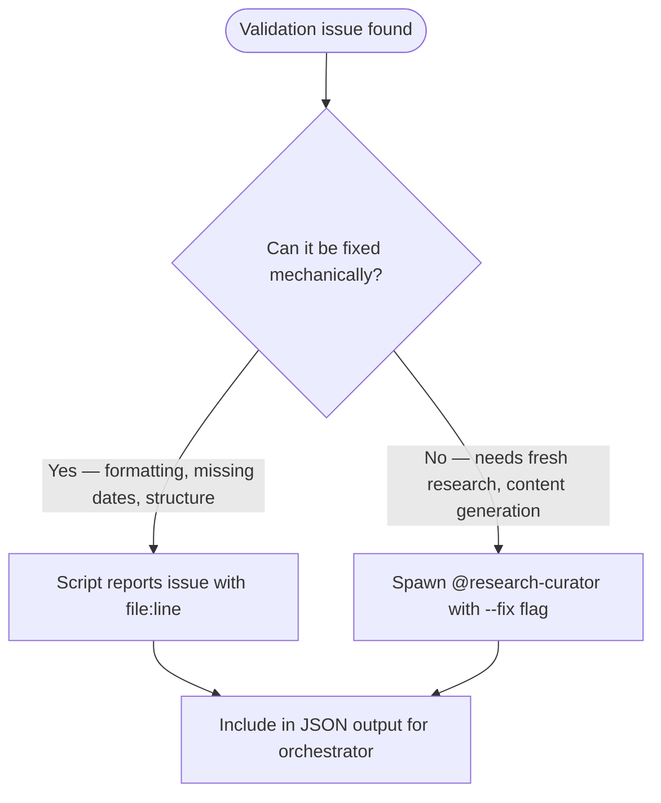

# Validation Rules

Checks performed by `./scripts/validate-research.py` and severity mapping for the `/research-curator --validate` mode.

---

## Check Definitions

### Error Severity (must fix)

- **section_completeness**: All 10 required sections must exist — Header, Overview, Problem Addressed, Key Statistics, Key Features, Technical Architecture, Installation & Usage, Relevance to Claude Code Development, References, Freshness Tracking
- **header_fields**: Header block must contain Research Date, Source URL, Version at Research, License
- **empty_sections**: Section heading exists but contains no content below it before the next heading

### Warning Severity (should fix)

- **access_dates**: Every URL in the References section must have an access date in format `(accessed YYYY-MM-DD)` or `(YYYY-MM-DD)`
- **freshness_tracking**: Freshness Tracking section must contain Last Verified, Version at Verification, Next Review Recommended fields
- **statistics_currency**: Dates in Key Statistics section older than 6 months from today trigger a staleness warning
- **url_format**: All URLs must be valid `http://` or `https://` format

### Info Severity (optional)

- **formatting_suggestions**: Minor markdown formatting issues (missing blank lines around fences, inconsistent heading levels)

---

## Script vs Agent Responsibility



**Script handles detection only** — it identifies issues and reports them with file path, line number, severity, and message.

**Agent handles fixes** that require:

- Gathering fresh statistics (re-research)
- Writing missing section content
- Updating stale references with current URLs
- Refreshing version numbers from upstream

**Orchestrator decides** which issues to auto-fix vs report to user based on severity.

---

## JSON Output Schema

```json
{
  "summary": {
    "total": "number of entries scanned",
    "passed": "entries with zero errors",
    "errors": "total error-severity issues",
    "warnings": "total warning-severity issues"
  },
  "entries": [
    {
      "file": "category/filename.md (relative to research/)",
      "status": "pass | fail",
      "issues": [
        {
          "check": "check name from definitions above",
          "severity": "error | warning | info",
          "message": "human-readable description",
          "line": "line number or null"
        }
      ]
    }
  ]
}
```
