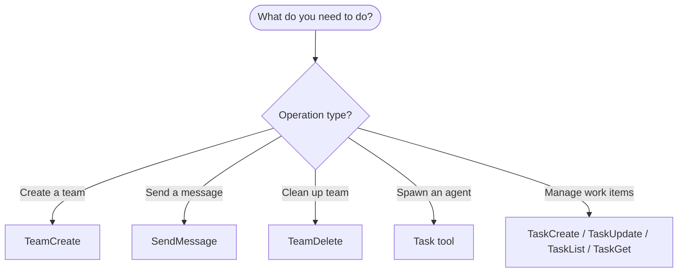
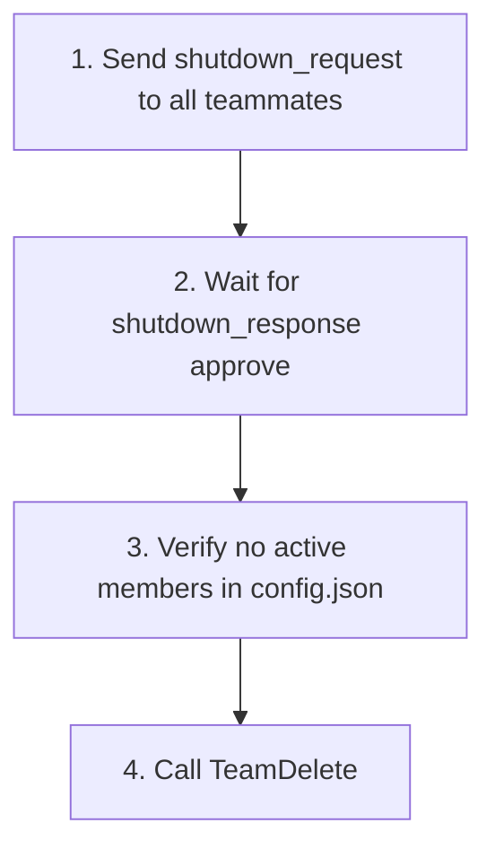

# Swarm Operations

API reference for multi-agent orchestration tools in Claude Code v2.1.45.

---

## Tools Overview



---

## TeamCreate -- Create a Team

```javascript
TeamCreate({
  team_name: "feature-auth",
  description: "Implementing OAuth2 authentication"
})
```

**Creates:**

- `~/.claude/teams/feature-auth/config.json`
- `~/.claude/tasks/feature-auth/` directory
- You become the team leader

---

## SendMessage -- All Inter-Agent Communication

SendMessage handles direct messages, broadcasts, shutdown, and plan approval.

### Direct Message (type "message")

```javascript
SendMessage({
  type: "message",
  recipient: "security-reviewer",
  content: "Please prioritize the authentication module. The deadline is tomorrow.",
  summary: "Prioritize auth module"
})
```

**Required fields:** `type`, `recipient`, `content`, `summary`

**IMPORTANT:** Your text output is NOT visible to teammates. You MUST use SendMessage to communicate.

### Broadcast (type "broadcast")

```javascript
SendMessage({
  type: "broadcast",
  content: "Status check: Please report your progress",
  summary: "Requesting status from all"
})
```

**Required fields:** `type`, `content`, `summary`

**WARNING:** Broadcasting is expensive -- sends N separate messages for N teammates. Prefer direct message to specific teammates.

**When to broadcast:**

- Critical issues requiring immediate team-wide attention
- Major announcements affecting everyone

**When NOT to broadcast:**

- Responding to one teammate
- Normal back-and-forth
- Information relevant to only some teammates

### Shutdown Request (type "shutdown_request")

Leader requests teammate to exit:

```javascript
SendMessage({
  type: "shutdown_request",
  recipient: "security-reviewer",
  content: "All tasks complete, wrapping up"
})
```

### Shutdown Response (type "shutdown_response")

Teammate approves or rejects shutdown:

```javascript
// Approve (terminates your process)
SendMessage({
  type: "shutdown_response",
  request_id: "shutdown-123",
  approve: true
})

// Reject (continue working)
SendMessage({
  type: "shutdown_response",
  request_id: "shutdown-123",
  approve: false,
  content: "Still working on task #3, need 5 more minutes"
})
```

**IMPORTANT:** Extract the `requestId` from the JSON shutdown_request message and pass it as `request_id`. Simply saying "I'll shut down" is not enough -- you must call the tool.

### Plan Approval (type "plan_approval_response")

Leader approves or rejects teammate's plan:

```javascript
// Approve
SendMessage({
  type: "plan_approval_response",
  request_id: "plan-456",
  recipient: "architect",
  approve: true
})

// Reject with feedback
SendMessage({
  type: "plan_approval_response",
  request_id: "plan-456",
  recipient: "architect",
  approve: false,
  content: "Please add error handling for the API calls and consider rate limiting"
})
```

---

## TeamDelete -- Remove Team Resources

```javascript
TeamDelete()
```

**Removes:**

- `~/.claude/teams/{team-name}/` directory
- `~/.claude/tasks/{team-name}/` directory

**IMPORTANT:** Will fail if teammates are still active. Use shutdown_request first.

---

## Task Tool -- Spawn Teammates

```javascript
Task({
  team_name: "my-project",        // Required -- which team to join
  name: "worker-1",               // Required -- teammate's name
  subagent_type: "general-purpose",
  prompt: "Your instructions here...",
  run_in_background: true         // Teammates usually run in background
})
```

For spawning without team membership (subagents), see `Skill(command: "swarm-spawning")`.

---

## Message Formats

Messages are JSON objects stored in inbox files.

### Regular Message

```json
{
  "from": "team-lead",
  "text": "Please prioritize the auth module",
  "timestamp": "2026-01-25T23:38:32.588Z",
  "read": false
}
```

### Shutdown Request

```json
{
  "type": "shutdown_request",
  "requestId": "shutdown-abc123@worker-1",
  "from": "team-lead",
  "reason": "All tasks complete",
  "timestamp": "2026-01-25T23:38:32.588Z"
}
```

### Shutdown Approved

```json
{
  "type": "shutdown_approved",
  "requestId": "shutdown-abc123@worker-1",
  "from": "worker-1",
  "paneId": "%5",
  "backendType": "in-process",
  "timestamp": "2026-01-25T23:39:00.000Z"
}
```

### Idle Notification (auto-sent when teammate stops)

```json
{
  "type": "idle_notification",
  "from": "worker-1",
  "timestamp": "2026-01-25T23:40:00.000Z",
  "completedTaskId": "2",
  "completedStatus": "completed"
}
```

### Task Completed

```json
{
  "type": "task_completed",
  "from": "worker-1",
  "taskId": "2",
  "taskSubject": "Review authentication module",
  "timestamp": "2026-01-25T23:40:00.000Z"
}
```

### Plan Approval Request

```json
{
  "type": "plan_approval_request",
  "from": "architect",
  "requestId": "plan-xyz789",
  "planContent": "# Implementation Plan\n\n1. ...",
  "timestamp": "2026-01-25T23:41:00.000Z"
}
```

### Permission Request (for sandbox/tool permissions)

```json
{
  "type": "permission_request",
  "requestId": "perm-123",
  "workerId": "worker-1@my-project",
  "workerName": "worker-1",
  "workerColor": "#4A90D9",
  "toolName": "Bash",
  "toolUseId": "toolu_abc123",
  "description": "Run npm install",
  "input": {"command": "npm install"},
  "permissionSuggestions": ["Bash(npm *)"],
  "createdAt": 1706000000000
}
```

---

## Error Handling

### Common Errors

- **"Cannot cleanup with active members"** -- Teammates still running. Send shutdown_request to all teammates first, wait for approval.
- **"Already leading a team"** -- Team already exists. Call TeamDelete first, or use different team name.
- **"Agent not found"** -- Wrong teammate name. Read `config.json` for actual names.
- **"Team does not exist"** -- No team created. Call TeamCreate first.
- **"team_name is required"** -- Missing team context. Provide `team_name` parameter.
- **"Agent type not found"** -- Invalid subagent_type. Check available agents with proper prefix.

### Graceful Shutdown Sequence

**Always follow this sequence:**



```javascript
// 1. Request shutdown for all teammates
SendMessage({ type: "shutdown_request", recipient: "worker-1", content: "All tasks complete" })
SendMessage({ type: "shutdown_request", recipient: "worker-2", content: "All tasks complete" })

// 2. Wait for shutdown approvals
// Messages arrive automatically in your inbox

// 3. Verify no active members
// Read ~/.claude/teams/{team}/config.json

// 4. Only then cleanup
TeamDelete()
```

### Handling Crashed Teammates

Teammates have a 5-minute heartbeat timeout. If a teammate crashes:

1. They are automatically marked as inactive after timeout
2. Their tasks remain in the task list
3. Another teammate can claim their tasks
4. TeamDelete will work after timeout expires

### Debugging

Read team config to see members:

```bash
# Check team config -- view members and backend types
# Read ~/.claude/teams/{team}/config.json

# Check teammate inboxes
# Read ~/.claude/teams/{team}/inboxes/{agent}.json

# List all teams
# ls ~/.claude/teams/

# Check task states
# Read ~/.claude/tasks/{team}/*.json
```

---

## Related Skills

- Core concepts -- `Skill(command: "swarm-primitives")`
- Spawning agents -- `Skill(command: "swarm-spawning")`
- Patterns and recipes -- `Skill(command: "swarm-patterns")`

---

SOURCE: Claude Code v2.1.45 tool descriptions (TeamCreate, SendMessage, TeamDelete) -- verified from system prompt 2026-02-18
