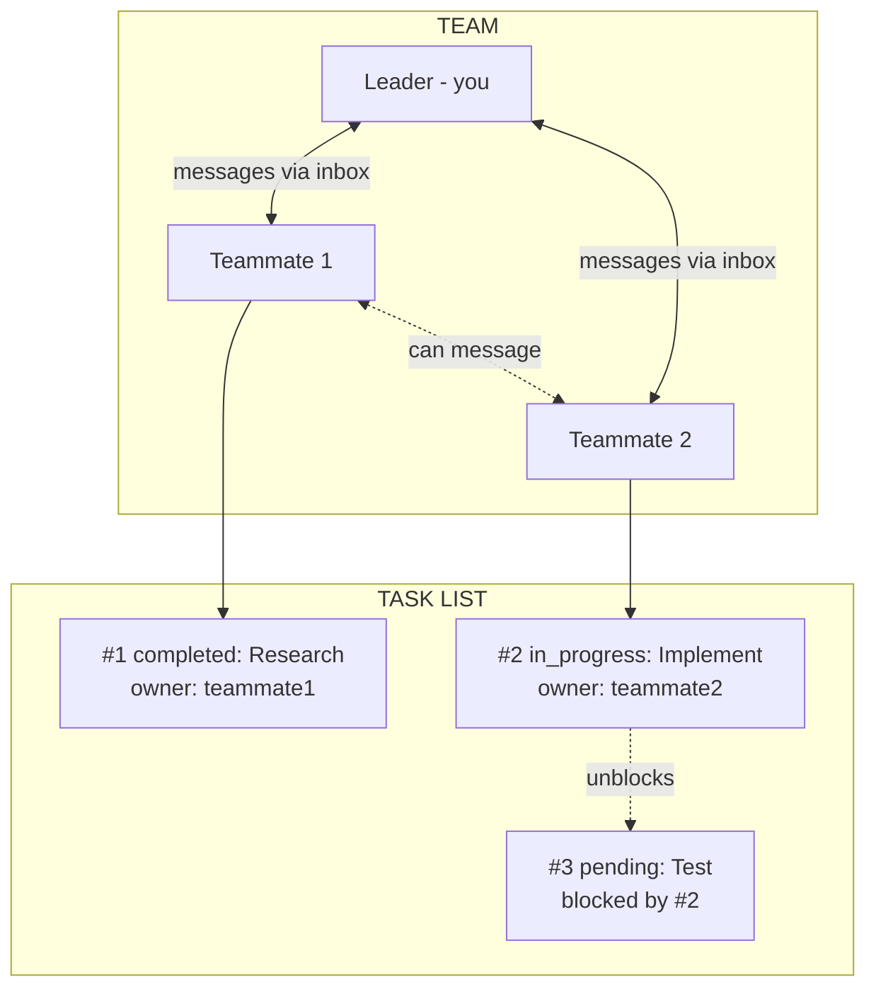
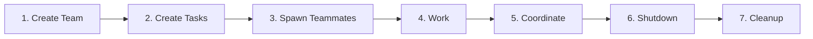
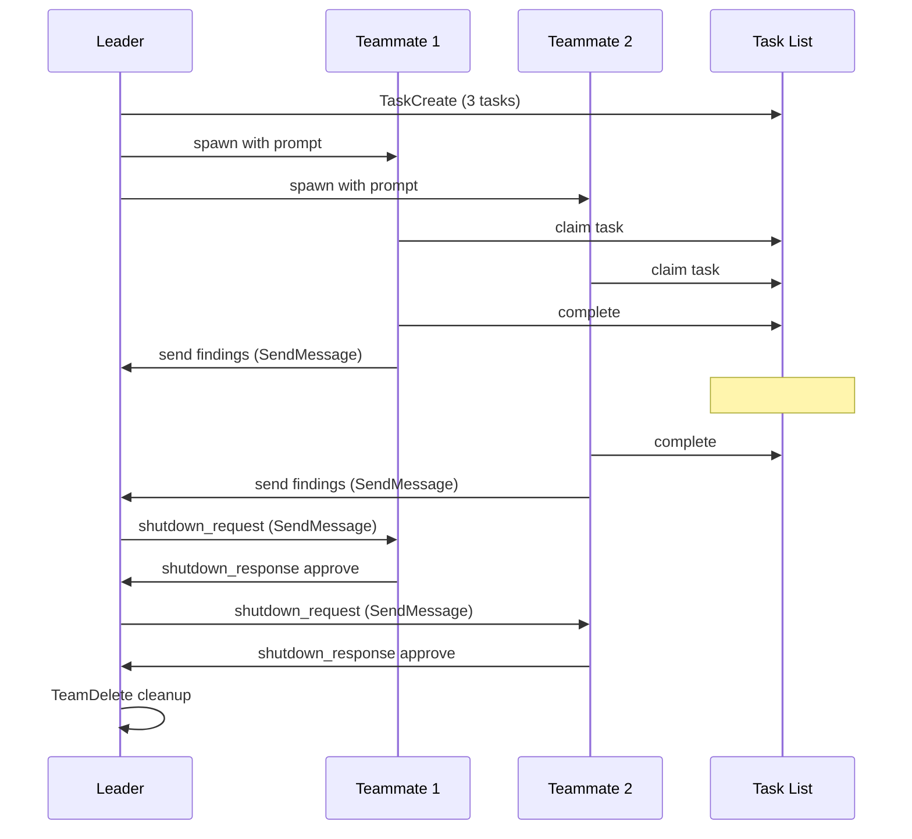

# Swarm Primitives

Core concepts for Claude Code multi-agent orchestration.

---

## Primitives

- **Agent** -- A Claude instance that can use tools. You are an agent. Subagents are agents you spawn. (N/A -- process)
- **Team** -- A named group of agents working together. One leader, multiple teammates. (`~/.claude/teams/{name}/config.json`)
- **Teammate** -- An agent that joined a team. Has a name, color, inbox. Spawned via Agent with `team_name` + `name`. (Listed in team config)
- **Leader** -- The agent that created the team. Receives teammate messages, approves plans/shutdowns. (First member in config)
- **Task** -- A work item with subject, description, status, owner, and dependencies. (`~/.claude/tasks/{team}/N.json`)
- **Inbox** -- JSON file where an agent receives messages from teammates. (`~/.claude/teams/{name}/inboxes/{agent}.json`)
- **Message** -- A JSON object sent between agents. Can be text or structured (shutdown_request, idle_notification, etc). (Stored in inbox files)
- **Backend** -- How teammates run. Auto-detected -- `in-process` (same Node.js, invisible), `tmux` (separate panes, visible), `iterm2` (split panes in iTerm2). See `Skill(command: "swarm-spawning")` for details.

---

## How They Connect



---

## Lifecycle



---

## Message Flow



---

## Core Architecture

A swarm consists of:

- **Leader** (you) -- Creates team, spawns workers, coordinates work
- **Teammates** (spawned agents) -- Execute tasks, report back
- **Task List** -- Shared work queue with dependencies
- **Inboxes** -- JSON files for inter-agent messaging

---

## File Structure

```text
~/.claude/teams/{team-name}/
+-- config.json              # Team metadata and member list
+-- inboxes/
    +-- team-lead.json       # Leader's inbox
    +-- worker-1.json        # Worker 1's inbox
    +-- worker-2.json        # Worker 2's inbox

~/.claude/tasks/{team-name}/
+-- 1.json                   # Task #1
+-- 2.json                   # Task #2
+-- 3.json                   # Task #3
```

---

## Team Config Structure

```json
{
  "name": "my-project",
  "description": "Working on feature X",
  "leadAgentId": "team-lead@my-project",
  "createdAt": 1706000000000,
  "members": [
    {
      "agentId": "team-lead@my-project",
      "name": "team-lead",
      "agentType": "team-lead",
      "color": "#4A90D9",
      "joinedAt": 1706000000000,
      "backendType": "in-process"
    },
    {
      "agentId": "worker-1@my-project",
      "name": "worker-1",
      "agentType": "Explore",
      "model": "haiku",
      "prompt": "Analyze the codebase structure...",
      "color": "#D94A4A",
      "planModeRequired": false,
      "joinedAt": 1706000001000,
      "tmuxPaneId": "in-process",
      "cwd": "/Users/me/project",
      "backendType": "in-process"
    }
  ]
}
```

---

## Task System

### TaskCreate -- Create Work Items

```javascript
TaskCreate({
  subject: "Review authentication module",
  description: "Review all files in app/services/auth/ for security vulnerabilities",
  activeForm: "Reviewing auth module..."  // Shown in spinner when in_progress
})
```

### TaskList -- See All Tasks

```javascript
TaskList()
```

Returns:

```text
#1 [completed] Analyze codebase structure
#2 [in_progress] Review authentication module (owner: security-reviewer)
#3 [pending] Generate summary report [blocked by #2]
```

### TaskGet -- Get Task Details

```javascript
TaskGet({ taskId: "2" })
```

Returns full task with description, status, blockedBy, etc.

### TaskUpdate -- Update Task Status

```javascript
// Claim a task
TaskUpdate({ taskId: "2", owner: "security-reviewer" })

// Start working
TaskUpdate({ taskId: "2", status: "in_progress" })

// Mark complete
TaskUpdate({ taskId: "2", status: "completed" })

// Set up dependencies
TaskUpdate({ taskId: "3", addBlockedBy: ["1", "2"] })
```

### Task Dependencies

When a blocking task is completed, blocked tasks are automatically unblocked:

```javascript
// Create pipeline
TaskCreate({ subject: "Step 1: Research" })        // #1
TaskCreate({ subject: "Step 2: Implement" })       // #2
TaskCreate({ subject: "Step 3: Test" })            // #3
TaskCreate({ subject: "Step 4: Deploy" })          // #4

// Set up dependencies
TaskUpdate({ taskId: "2", addBlockedBy: ["1"] })   // #2 waits for #1
TaskUpdate({ taskId: "3", addBlockedBy: ["2"] })   // #3 waits for #2
TaskUpdate({ taskId: "4", addBlockedBy: ["3"] })   // #4 waits for #3

// When #1 completes, #2 auto-unblocks
// When #2 completes, #3 auto-unblocks
```

### Task File Structure

`~/.claude/tasks/{team-name}/1.json`:

```json
{
  "id": "1",
  "subject": "Review authentication module",
  "description": "Review all files in app/services/auth/...",
  "status": "in_progress",
  "owner": "security-reviewer",
  "activeForm": "Reviewing auth module...",
  "blockedBy": [],
  "blocks": ["3"],
  "createdAt": 1706000000000,
  "updatedAt": 1706000001000
}
```

---

## Related Skills

- API reference -- `Skill(command: "swarm-operations")`
- Spawning agents -- `Skill(command: "swarm-spawning")`
- Patterns and recipes -- `Skill(command: "swarm-patterns")`

---

SOURCE: Claude Code v2.1.45 tool descriptions (TeamCreate, SendMessage, TeamDelete, TaskCreate, TaskUpdate, TaskList, TaskGet) -- verified 2026-02-18
