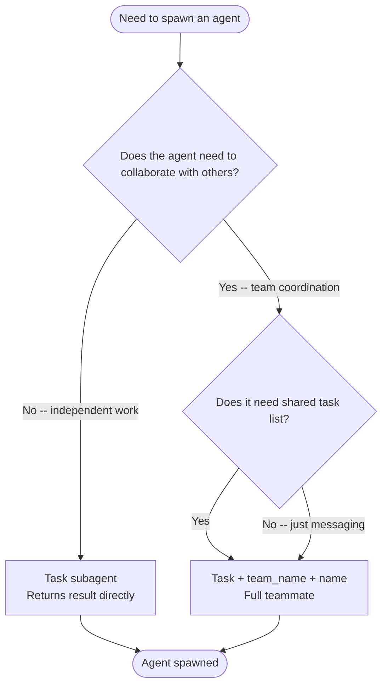
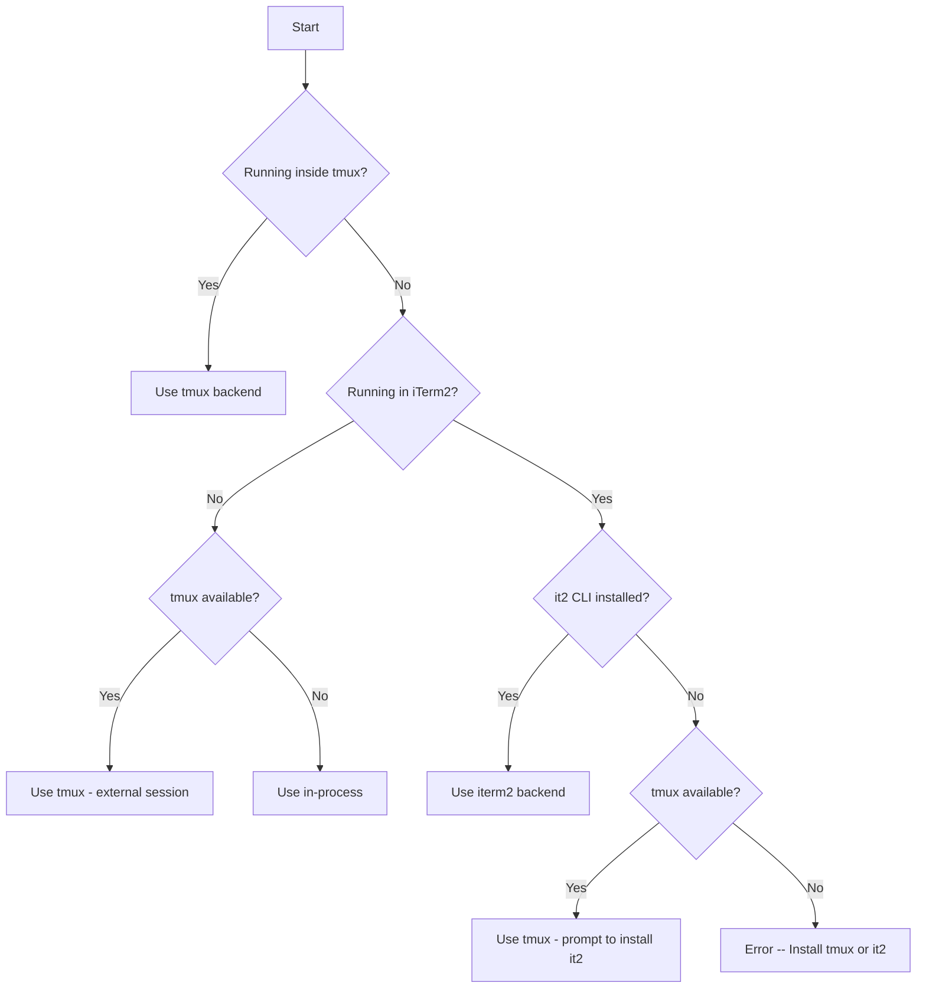

# Swarm Spawning

How to create agents -- subagent vs teammate, agent type catalog, backend selection.

---

## Two Ways to Spawn Agents

### Method 1 -- Task Tool (Subagents)

Use Task for **short-lived, focused work** that returns a result:

```javascript
Agent({
  subagent_type: "Explore",
  description: "Find auth files",
  prompt: "Find all authentication-related files in this codebase",
  model: "haiku"  // Optional: haiku, sonnet, opus
})
```

**Characteristics:**

- Runs synchronously (blocks until complete) or async with `run_in_background: true`
- Returns result directly to you
- No team membership required
- Best for searches, analysis, focused research

### Method 2 -- Task Tool + team_name + name (Teammates)

Use Task with `team_name` and `name` to **spawn persistent teammates**:

```javascript
// First create a team
TeamCreate({ team_name: "my-project" })

// Then spawn a teammate into that team
Agent({
  team_name: "my-project",        // Required -- which team to join
  name: "security-reviewer",      // Required -- teammate's name
  subagent_type: "general-purpose",
  prompt: "Review all authentication code for vulnerabilities. Send findings to team-lead.",
  run_in_background: true         // Teammates usually run in background
})
```

**Characteristics:**

- Joins team, appears in `config.json`
- Communicates via SendMessage
- Can claim tasks from shared task list
- Persists until shutdown
- Best for parallel work, ongoing collaboration, pipeline stages

### Choosing Between Subagent and Teammate



- **Subagent** -- lifespan until task complete, communication via return value, no task access, no team membership
- **Teammate** -- lifespan until shutdown requested, communication via inbox messages, shared task list access, team membership, ongoing coordination

---

## Built-in Agent Types

These are always available without plugins.

### Bash

```javascript
Agent({
  subagent_type: "Bash",
  description: "Run git commands",
  prompt: "Check git status and show recent commits"
})
```

- **Tools:** Bash only
- **Model:** Inherits from parent
- **Best for:** Git operations, command execution, system tasks

### Explore

```javascript
Agent({
  subagent_type: "Explore",
  description: "Find API endpoints",
  prompt: "Find all API endpoints in this codebase. Be very thorough.",
  model: "haiku"  // Fast and cheap
})
```

- **Tools:** All read-only tools (no Edit, Write, NotebookEdit, Task)
- **Model:** Haiku (optimized for speed)
- **Best for:** Codebase exploration, file searches, code understanding
- **Thoroughness levels:** "quick", "medium", "very thorough"

### Plan

```javascript
Agent({
  subagent_type: "Plan",
  description: "Design auth system",
  prompt: "Create an implementation plan for adding OAuth2 authentication"
})
```

- **Tools:** All read-only tools
- **Model:** Inherits from parent
- **Best for:** Architecture planning, implementation strategies

### general-purpose

```javascript
Agent({
  subagent_type: "general-purpose",
  description: "Research and implement",
  prompt: "Research React Query best practices and implement caching for the user API"
})
```

- **Tools:** All tools
- **Model:** Inherits from parent
- **Best for:** Multi-step tasks, research + action combinations

### claude-code-guide

```javascript
Agent({
  subagent_type: "claude-code-guide",
  description: "Help with Claude Code",
  prompt: "How do I configure MCP servers?"
})
```

- **Tools:** Read-only + WebFetch + WebSearch
- **Best for:** Questions about Claude Code, Agent SDK, Anthropic API

### statusline-setup

```javascript
Agent({
  subagent_type: "statusline-setup",
  description: "Configure status line",
  prompt: "Set up a status line showing git branch and node version"
})
```

- **Tools:** Read, Edit only
- **Model:** Sonnet
- **Best for:** Configuring Claude Code status line

---

## Plugin Agent Types

From the `compound-engineering` plugin (examples):

### Review Agents

```javascript
// Security review
Agent({
  subagent_type: "compound-engineering:review:security-sentinel",
  description: "Security audit",
  prompt: "Audit this PR for security vulnerabilities"
})

// Performance review
Agent({
  subagent_type: "compound-engineering:review:performance-oracle",
  description: "Performance check",
  prompt: "Analyze this code for performance bottlenecks"
})

// Architecture review
Agent({
  subagent_type: "compound-engineering:review:architecture-strategist",
  description: "Architecture review",
  prompt: "Review the system architecture of the authentication module"
})
```

**All review agents from compound-engineering:**

- `agent-native-reviewer` -- Ensures features work for agents too
- `architecture-strategist` -- Architectural compliance
- `code-simplicity-reviewer` -- YAGNI and minimalism
- `data-integrity-guardian` -- Database and data safety
- `data-migration-expert` -- Migration validation
- `deployment-verification-agent` -- Pre-deploy checklists
- `dhh-rails-reviewer` -- DHH/37signals Rails style
- `julik-frontend-races-reviewer` -- JavaScript race conditions
- `kieran-python-reviewer` -- Python best practices
- `kieran-rails-reviewer` -- Rails best practices
- `kieran-typescript-reviewer` -- TypeScript best practices
- `pattern-recognition-specialist` -- Design patterns and anti-patterns
- `performance-oracle` -- Performance analysis
- `security-sentinel` -- Security vulnerabilities

### Research Agents

```javascript
// Best practices research
Agent({
  subagent_type: "compound-engineering:research:best-practices-researcher",
  description: "Research auth best practices",
  prompt: "Research current best practices for JWT authentication"
})

// Framework documentation
Agent({
  subagent_type: "compound-engineering:research:framework-docs-researcher",
  description: "Research Active Storage",
  prompt: "Gather comprehensive documentation about Active Storage file uploads"
})

// Git history analysis
Agent({
  subagent_type: "compound-engineering:research:git-history-analyzer",
  description: "Analyze auth history",
  prompt: "Analyze the git history of the authentication module"
})
```

**All research agents:**

- `best-practices-researcher` -- External best practices
- `framework-docs-researcher` -- Framework documentation
- `git-history-analyzer` -- Code archaeology
- `learnings-researcher` -- Search docs/solutions/
- `repo-research-analyst` -- Repository patterns

### Design Agents

```javascript
Agent({
  subagent_type: "compound-engineering:design:figma-design-sync",
  description: "Sync with Figma",
  prompt: "Compare implementation with Figma design at [URL]"
})
```

### Workflow Agents

```javascript
Agent({
  subagent_type: "compound-engineering:workflow:bug-reproduction-validator",
  description: "Validate bug",
  prompt: "Reproduce and validate this reported bug: [description]"
})
```

---

## Spawn Backends

A **backend** determines how teammate Claude instances actually run. Claude Code supports three backends and **auto-detects** the best one.

### Auto-Detection Logic



**Detection checks:**

1. `$TMUX` environment variable -- inside tmux
2. `$TERM_PROGRAM === "iTerm.app"` or `$ITERM_SESSION_ID` -- in iTerm2
3. `which tmux` -- tmux available
4. `which it2` -- it2 CLI installed

### in-process (Default for non-tmux)

Teammates run as async tasks within the same Node.js process.

- No new process spawned
- Teammates share the same Node.js event loop
- Communication via in-memory queues (fast)
- You don't see teammate output directly

```text
+---------------------------------------+
|           Node.js Process             |
|  +---------+  +---------+  +---------+|
|  | Leader  |  |Worker 1 |  |Worker 2 ||
|  | (main)  |  | (async) |  | (async) ||
|  +---------+  +---------+  +---------+|
+---------------------------------------+
```

**Pros:** Fastest startup, lowest overhead, works everywhere
**Cons:** Can't see teammate output in real-time, all die if leader dies, harder to debug

### tmux

Teammates run as separate Claude instances in tmux panes/windows.

- Each teammate gets its own tmux pane
- Separate process per teammate
- Communication via inbox files

```text
+-----------------+-----------------+
|                 |    Worker 1     |
|     Leader      +-----------------+
|   (your pane)   |    Worker 2     |
|                 +-----------------+
|                 |    Worker 3     |
+-----------------+-----------------+
```

**Pros:** See teammate output in real-time, teammates survive leader exit, works in CI/headless
**Cons:** Slower startup (process spawn), requires tmux installed, more resource usage

**Useful tmux commands:**

```bash
# List all panes in current window
tmux list-panes

# Switch to pane by number
tmux select-pane -t 1

# Kill a specific pane
tmux kill-pane -t %5

# View swarm session (if external)
tmux attach -t claude-swarm

# Rebalance pane layout
tmux select-layout tiled
```

### iterm2 (macOS only)

Teammates run as split panes within your iTerm2 window.

- Uses iTerm2's Python API via `it2` CLI
- Each teammate visible side-by-side
- Communication via inbox files

**Setup:**

```bash
# 1. Install it2 CLI
uv tool install it2

# 2. Enable Python API in iTerm2
# iTerm2 > Settings > General > Magic > Enable Python API

# 3. Restart iTerm2

# 4. Verify
it2 --version
it2 session list
```

**Pros:** Visual debugging, native macOS experience, no tmux needed
**Cons:** macOS + iTerm2 only, requires setup, panes die with window

### Forcing a Backend

```bash
# Force in-process (fastest, no visibility)
export CLAUDE_CODE_SPAWN_BACKEND=in-process

# Force tmux (visible panes, persistent)
export CLAUDE_CODE_SPAWN_BACKEND=tmux

# Auto-detect (default)
unset CLAUDE_CODE_SPAWN_BACKEND
```

### Backend in Team Config

The backend type is recorded per-teammate in `config.json`:

```json
{
  "members": [
    {
      "name": "worker-1",
      "backendType": "in-process",
      "tmuxPaneId": "in-process"
    },
    {
      "name": "worker-2",
      "backendType": "tmux",
      "tmuxPaneId": "%5"
    }
  ]
}
```

---

## Environment Variables

Spawned teammates automatically receive these:

```bash
CLAUDE_CODE_TEAM_NAME="my-project"
CLAUDE_CODE_AGENT_ID="worker-1@my-project"
CLAUDE_CODE_AGENT_NAME="worker-1"
CLAUDE_CODE_AGENT_TYPE="Explore"
CLAUDE_CODE_AGENT_COLOR="#4A90D9"
CLAUDE_CODE_PLAN_MODE_REQUIRED="false"
CLAUDE_CODE_PARENT_SESSION_ID="session-xyz"
```

**Using in prompts:**

```javascript
Agent({
  team_name: "my-project",
  name: "worker",
  subagent_type: "general-purpose",
  prompt: "Your name is $CLAUDE_CODE_AGENT_NAME. Use it when sending messages to team-lead."
})
```

---

## Troubleshooting Backends

- **"No pane backend available"** -- Neither tmux nor iTerm2 available. Install tmux.
- **"it2 CLI not installed"** -- In iTerm2 but missing it2. Run `uv tool install it2`.
- **"Python API not enabled"** -- it2 can't communicate with iTerm2. Enable in iTerm2 Settings > General > Magic.
- **Workers not visible** -- Using in-process backend. Start inside tmux or iTerm2.
- **Workers dying unexpectedly** -- Outside tmux, leader exited. Use tmux for persistence.

**Checking current backend:**

```bash
# Check if inside tmux
echo $TMUX

# Check if in iTerm2
echo $TERM_PROGRAM

# Check tmux availability
which tmux

# Check it2 availability
which it2
```

---

## Related Skills

- Core concepts -- `Skill(skill: "swarm-primitives")`
- API reference -- `Skill(skill: "swarm-operations")`
- Patterns and recipes -- `Skill(skill: "swarm-patterns")`

---

SOURCE: Claude Code v2.1.45 tool descriptions (TeamCreate, Task) -- verified 2026-02-18
