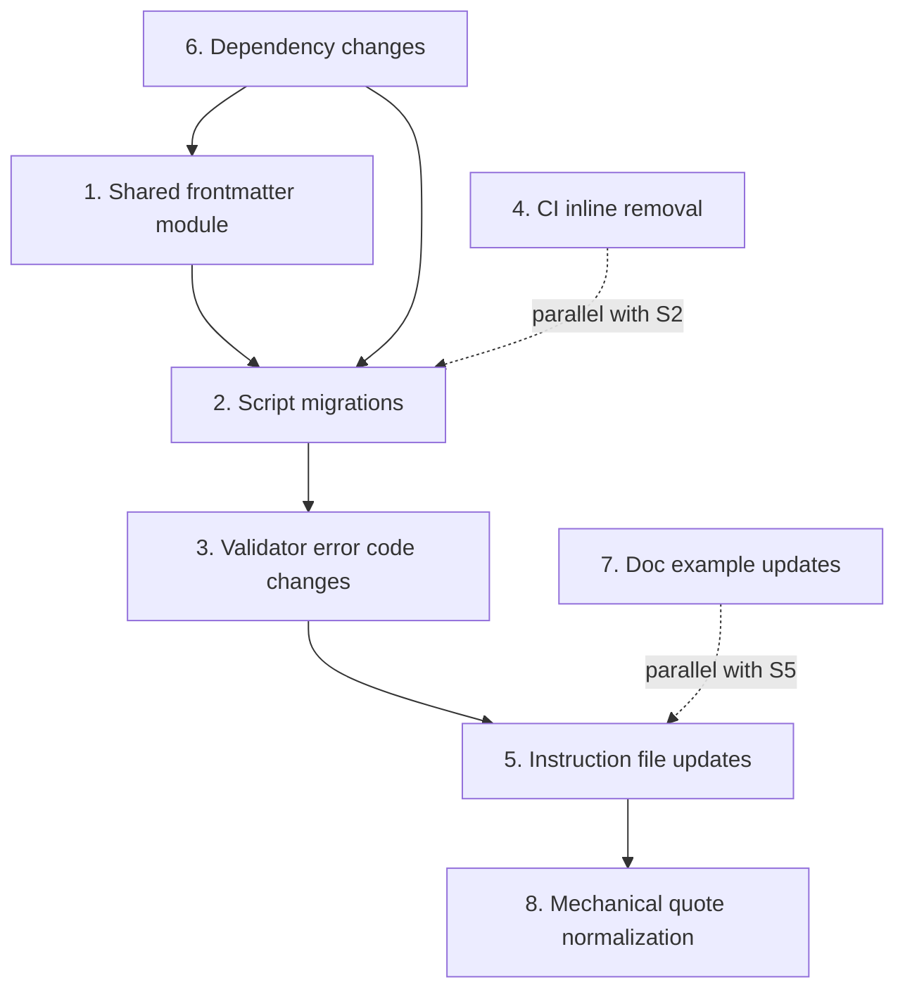

# Design: Shared Frontmatter Module + ruamel.yaml Migration

**Date**: 2026-02-19
**Status**: Approved

## Problem Statement

Two related issues:

1. **False quoting convention** — 30 files across 7 categories instruct agents to quote ALL YAML frontmatter descriptions. YAML only requires quotes when values contain syntax-breaking characters (`:` followed by space, `#` preceded by space, leading special chars). Agents propagate this as "project convention," producing unnecessarily quoted descriptions across ~45 files.

2. **Wrong YAML library** — 9 scripts use `pyyaml` (`import yaml`). The project needs `ruamel.yaml` (preserves comments, round-trips formatting). Additionally, `tomlkit` is used by scripts but missing from pyproject.toml dev dependencies.

3. **Duplicated frontmatter code** — `plugin_validator.py` and `validate_frontmatter.py` both implement `extract_frontmatter()` + Pydantic validation + auto-fix logic independently. `task_format.py` has a third parser. No shared module exists.

4. **CI anti-pattern** — `.github/workflows/code-quality.yml` contains inline Python for YAML/TOML syntax validation, duplicating pre-commit hooks `check-yaml` and `check-toml` already configured in `.pre-commit-config.yaml`.

## Verified Facts

All claims verified by context-gathering agents with file:line evidence.

### Frontmatter Tooling Landscape

- `plugin_validator.py` (4147 lines, created 2026-02-02, 22 commits) — superset validator with FM001-NR002 error codes, Pydantic models, token complexity. Pre-commit hook runs this.
- `validate_frontmatter.py` (1310 lines, created 2026-01-25, 13 commits) — original validator with 12+ unique functions not in plugin_validator.py: `validate_skill_directory_name()`, `generate_plugin_metadata()`, `validate_plugin_registration()`, Rich CLI.
- `task_format.py` — library module with `parse_yaml_frontmatter()`, `update_yaml_field()` (surgical regex-based field updates).
- `python-frontmatter>=1.1.0` — already in pyproject.toml. Used by `.claude/utilities/find-temp-documentation.py`. Supports custom handlers via `BaseHandler` subclass.

### pyyaml Reference Categories (68 references, 27 files)

- **18 IMPORT** — 9 scripts with active `import yaml` usage
- **9 DEPENDENCY** — PEP 723 metadata and pyproject.toml entries
- **26 EXAMPLE** — docs showing pyyaml as a library (hatchling, bandit, box.md)
- **2 INSTRUCTION** — agent docs recommending/referencing pyyaml
- **1 DETECTION** — warning message checking pyyaml installation
- **5 HISTORICAL** — planning docs
- **7 REFERENCE** — architecture/usage docs

### Quoting Instruction Scope (30 files, 7 categories)

- 9 active instruction files agents read and follow
- 5 validator scripts with enforcement code (FM004, FM009)
- Error code docs (ERROR_CODES.md x2, ARCHITECTURE.md, USAGE.md)
- CLAUDE.md / README files (4 files)
- Planning/architecture docs (4 files)
- Test files (2 files)
- Audit/analysis files (2 files)

### CI Duplication

- `.github/workflows/code-quality.yml` lines ~430-479: inline `import tomllib` and `uv run --with pyyaml python -c "import yaml; yaml.safe_load(...)"` for syntax checking
- `.pre-commit-config.yaml` line 39: `check-yaml` with `args: [--unsafe]`
- `.pre-commit-config.yaml` line 42: `check-toml`
- Pre-commit already runs in CI via `prek`

### Sibling Repo Patterns

- `mkapidocs` — centralized `yaml_utils.py` module with ruamel.yaml for round-trip operations (validated pattern)
- `mcp-json-yaml-toml` — uses both `ruamel.yaml>=0.18.0` and `tomlkit>=0.14.0`
- `python-frontmatter` — supports custom handlers; no built-in ruamel.yaml support; requires `BaseHandler` subclass with `load()` and `export()` overrides

### fix_tool_formats.py

Confirmed: `pyyaml>=6.0.0` in PEP 723 deps but never imported. Pure regex script. Dead dependency.

## Design

### 1. Shared Frontmatter Module

**File**: `plugins/plugin-creator/scripts/frontmatter_utils.py`

**Layer 1 — RuamelYAMLHandler**: `python-frontmatter` `BaseHandler` subclass using `ruamel.yaml` with `preserve_quotes=True`. Implements `load()` and `export()`. ~30 lines.

**Layer 2 — Convenience API**:

- `load_frontmatter(path: Path) -> frontmatter.Post` — reads markdown file, returns Post with parsed metadata and content body
- `loads_frontmatter(text: str) -> frontmatter.Post` — from string
- `dump_frontmatter(post: frontmatter.Post) -> str` — serializes to markdown string with frontmatter
- `dumps_frontmatter(post: frontmatter.Post, path: Path) -> None` — writes to file
- `update_field(path: Path, field: str, value: Any) -> None` — surgical single-field update

**PEP 723 deps**: `ruamel.yaml>=0.18.0`, `python-frontmatter>=1.1.0`

### 2. Script Migrations (9 files)

Each script replaces custom frontmatter extraction + `import yaml` with imports from the shared module:

1. `plugin_validator.py` — replace `extract_frontmatter()` + `yaml.safe_load()` + `yaml.dump()`
2. `validate_frontmatter.py` — same pattern
3. `quick_validate.py` — replace `import yaml` + `yaml.safe_load()`
4. `task_format.py` — replace `import yaml` + `yaml.safe_load()` + custom `_format_yaml_value()`
5. `migrate_task_format.py` — replace `import yaml`
6. `split_task_file.py` — replace pyyaml dep + usage
7. `sync_gitlab_docs.py` — replace `import yaml` + `yaml.safe_load()`
8. `discover_linters.py` — replace lazy `import yaml` fallback with ruamel.yaml (reads `.pre-commit-config.yaml`, not frontmatter)
9. `fix_tool_formats.py` — remove unused pyyaml PEP 723 dep only

### 3. Validator Error Code Changes

- **FM009 (Unquoted description with colons)** — Keep. Changes purpose: detects descriptions that would break YAML parsing from unquoted colons. Auto-fix still adds quotes. Instruction files change from "always quote" to "avoid colons; if necessary, quote the value. ruamel.yaml handles quoting on write, but broken YAML from hand-editing won't parse at all."
- **FM004 (Forbidden multiline indicator)** — Keep unchanged. Claude Code skill indexer cannot parse `>-`, `|-`, `|` — platform limitation.
- **FM007/FM008 (multiline description normalization)** — Keep unchanged.

### 4. CI Inline Validation Removal

Delete inline Python blocks in `.github/workflows/code-quality.yml` (lines ~430-479). Pre-commit hooks `check-yaml` and `check-toml` already provide this coverage.

### 5. Instruction File Updates (30 files)

- **Active instruction files (9)**: Change "always quote descriptions" to "avoid colons in descriptions; quote only when YAML syntax requires it"
- **Validator scripts (5)**: Handled in Section 2 and 3
- **Error code docs (4)**: Update FM009 description to match new purpose
- **CLAUDE.md / README files (4)**: Update auto-fix capability descriptions
- **Planning/architecture docs (4)**: Update if actively referenced by agents
- **Test files (2)**: Update fixtures and assertions for new FM009 behavior
- **Audit/analysis files (2)**: Update if touched

### 6. Dependency Changes

**pyproject.toml**:

- Add `"ruamel.yaml>=0.18.0"` to dev dependencies
- Add `"tomlkit>=0.13.0"` to dev dependencies
- Remove `"types-pyyaml>=6.0.12.20250915"`
- Keep `"python-frontmatter>=1.1.0"` (already present)

**PEP 723 across migrated scripts**:

- `"pyyaml>=6.0"` -> `"ruamel.yaml>=0.18.0"`
- Remove `"types-pyyaml>=6.0"`
- `fix_tool_formats.py`: remove `"pyyaml>=6.0.0"` entirely
- `discover_linters.py`: remove `"types-pyyaml>=6.0.0"`, keep `"tomlkit>=0.13.0"`

### 7. Documentation Example Updates

**Project convention docs** (update pyyaml -> ruamel.yaml):

- `.claude/docs/TASK_FILE_FORMAT.md`
- `plugins/plugin-creator/references/ARCHITECTURE.md`
- `plugins/plugin-creator/references/USAGE.md`
- `plugins/plugin-creator/skills/add-doc-updater/references/doc-updater-template.md`
- `plugins/python3-development/agents/code-reviewer.md`
- `plugins/python3-development/agents/python-cli-design-spec.md`

**Third-party library reference docs** (update to ruamel.yaml equivalents):

- `plugins/holistic-linting/.../bandit/deserialization.md`
- `plugins/python3-development/.../modern-modules/box.md`
- `plugins/python3-development/.../modern-modules/shiv.md`
- `plugins/python3-development/.../hatchling/` files
- `plugins/python3-development/.../planning/reference-document-architecture.md`

**tomllib/tomli references**: Leave stdlib references in `modernpython` and `stdlib-scripting` skills unchanged — they teach stdlib capabilities accurately.

**CLAUDE.md convention statement**: Add to project CLAUDE.md that this repo uses `ruamel.yaml` and `tomlkit` — never `pyyaml`.

### 8. Mechanical Quote Normalization

Run the shared module across all frontmatter-bearing component files (skills, agents, commands, rules) — using the same file type detection as `plugin_validator.py`'s `FileType` enum. ruamel.yaml round-trip mode normalizes quoting automatically on read-write cycle.

This is the last step, run after all instruction files and validators are updated.

## Execution Order

- **First**: S6 (dependency changes — unblocks everything)
- **Second**: S1 (shared module — unblocks migrations)
- **Parallel group**: S2 (script migrations) + S4 (CI cleanup)
- **After S2**: S3 (validator changes)
- **Parallel group**: S5 (instruction updates) + S7 (doc updates)
- **Last**: S8 (mechanical normalization — after all rules are updated)

## Verification

1. `uv run prek run --all-files` — all formatting/linting passes
2. All migrated scripts execute without import errors
3. `plugin_validator.py` validates a known-good skill file successfully
4. `plugin_validator.py` correctly flags a description with unquoted colons (FM009)
5. `plugin_validator.py` correctly flags multiline indicators (FM004)
6. Existing tests in `test_frontmatter_validator.py` pass (with updated assertions for FM009)
7. The mechanical normalization script processes all component files without errors
8. Spot-check: 5 frontmatter files have correct quoting (quoted where YAML requires, unquoted otherwise)
9. No Python file in `plugins/` or `.github/` contains `import yaml` (as an actual import, not as detection guidance or documentation)
