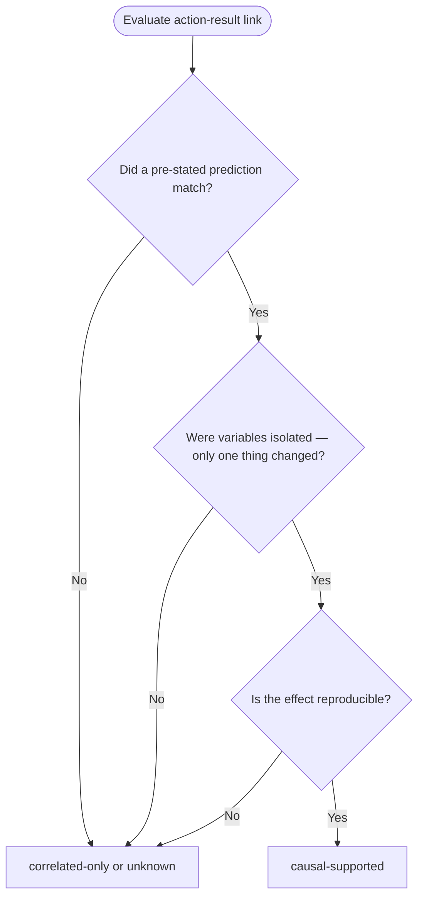

# Scientific Method Plugin Implementation Plan

> **For Claude:** REQUIRED SUB-SKILL: Use superpowers:executing-plans to implement this plan task-by-task.

**Goal:** Create `plugins/scientific-method/` — a unified plugin that consolidates `scientific-thinking`, `evidence-first-debugging`, and `experiment-protocol` skills with shared canonical reference files, then migrate all upstream references.

**Architecture:** One plugin with three thin skills sharing a `shared/` reference directory. The shared files (`investigation-template.md`, `evidence-rules.md`, `causality-check.md`, and domain extension files) are the canonical single source of truth. Each skill SKILL.md is a thin wrapper that declares its responsibility scope and loads the relevant shared files. A `retrospective-analyst` agent is spawned on investigation completion to produce mermaid timelines and retrospectives.

**Tech Stack:** Markdown, YAML frontmatter, Mermaid diagrams, Claude Code plugin schema. Validation via `uv run plugins/plugin-creator/scripts/plugin_validator.py`. Linting via `uv run prek run --files <file>`.

---

## Reference: Files Being Retired / Migrated

| Source | Destination | Action |
|---|---|---|
| `.claude/skills/scientific-thinking/SKILL.md` | `plugins/scientific-method/skills/scientific-thinking/SKILL.md` | Migrate + rewrite as thin wrapper |
| `.claude/skills/experiment-protocol/SKILL.md` | `plugins/scientific-method/skills/experiment-protocol/SKILL.md` | Migrate (content preserved) |
| `.claude/knowledge/workflow-diagrams/investigation-workflow.md` | `plugins/scientific-method/shared/investigation-workflow.md` | Migrate (content preserved) |
| `plugins/evidence-first-debugging/` (entire plugin) | Retired — content absorbed into plugin | Delete after plugin complete |

## Reference: Upstream Files Requiring Reference Updates

These files reference the old locations and must be updated after migration:

**Must update (active, user-facing):**
- `.claude/CLAUDE.md` line 40 — `/scientific-thinking` → `/scientific-method:scientific-thinking`
- `.claude/skills/README.md` lines 12, 148, 163, 421 — update skill name and path
- `.claude/docs/sdlc-layers/layer-0/evidence-discipline.md` line 40 — update SKILL.md path link
- `.claude/knowledge/workflow-diagrams/README.md` lines 15, 55, 94, 119, 146 — update skill references and investigation-workflow.md link
- `.claude/knowledge/workflow-diagrams/simple-task-workflow.md` line 300 — update investigation-workflow.md link
- `.claude/knowledge/workflow-diagrams/rag-retrieval-pattern.md` line 366 — update investigation-workflow.md link
- `.claude/knowledge/workflow-diagrams/master-workflow.md` lines 29, 158, 185, 187, 345, 375 — update skill name references
- `.claude/knowledge/workflow-diagrams/asset-decision-tree.md` line 109 — update skill name reference
- `plugins/plugin-creator/skills/claude-skills-overview-2026/SKILL.md` line 149 — update skill reference
- `plugins/plugin-creator/skills/skill-creator/SKILL.md` line 114 — update skill reference
- `.claude-plugin/marketplace.json` — remove `evidence-first-debugging`, add `scientific-method`

**Archive/plan files (informational — update paths but not blocking):**
- `.claude/archive/grooming-reports-2026-02-23/sdlc-layer-candidates.md` line 99
- `.claude/archive/grooming-reports-2026-02-23/sdlc-layer-candidates-master.md` line 62
- `plan/feature-context-process-quality-discipline.md` line 81

---

## Task 1: Create plugin scaffold

**Files:**
- Create: `plugins/scientific-method/.claude-plugin/plugin.json`
- Create: `plugins/scientific-method/skills/scientific-thinking/` (directory)
- Create: `plugins/scientific-method/skills/evidence-first-debugging/` (directory)
- Create: `plugins/scientific-method/skills/experiment-protocol/` (directory)
- Create: `plugins/scientific-method/skills/experiment-protocol/references/` (directory)
- Create: `plugins/scientific-method/shared/` (directory)
- Create: `plugins/scientific-method/shared/extensions/` (directory)
- Create: `plugins/scientific-method/agents/` (directory)

**Step 1: Create plugin.json**

```bash
mkdir -p plugins/scientific-method/.claude-plugin \
  plugins/scientific-method/skills/scientific-thinking \
  plugins/scientific-method/skills/evidence-first-debugging \
  plugins/scientific-method/skills/experiment-protocol/references \
  plugins/scientific-method/shared/extensions \
  plugins/scientific-method/agents
```

Write `plugins/scientific-method/.claude-plugin/plugin.json`:

```json
{
  "name": "scientific-method",
  "description": "Use when debugging, investigating root causes, designing experiments, or performing scientific analysis — enforces hypothesis-driven reasoning, evidence-first observation, causality validation, and structured output templates. Use when facing unknowns, repeated failures, or complex investigations requiring rigorous methodology.",
  "version": "1.0.0",
  "author": {
    "name": "Jamie Nelson",
    "url": "https://github.com/bitflight-devops"
  }
}
```

**Step 2: Validate plugin.json is valid JSON**

```bash
python3 -m json.tool plugins/scientific-method/.claude-plugin/plugin.json
```

Expected: valid JSON printed with no error.

**Step 3: Commit scaffold**

```bash
git add plugins/scientific-method/
git commit -m "feat(scientific-method): scaffold plugin directory structure"
```

---

## Task 2: Write shared/investigation-template.md

**Files:**
- Create: `plugins/scientific-method/shared/investigation-template.md`

This is the canonical 15-section Unified Investigation Template. All three skills reference this file.

**Step 1: Write the file**

Write `plugins/scientific-method/shared/investigation-template.md` with this exact content:

````markdown
# Unified Investigation Template

All investigation workflows produce outputs using this template. Sections 0–7 are filled before
execution. Sections 8–14 are filled during and after execution.

---

## 0 CONTEXT

```text
Goal:
System/Component:
Environment:
Baseline commit/build:
```

---

## 1 ISSUE STATEMENT

```text
Symptom:
Expected behavior:
Actual behavior:
Repro status: (reproduced | not reproduced | unknown)
Repro steps:
```

---

## 2 OBSERVATIONS

```text
O1:
  Snippet:
  Truncation: (none | TRUNCATED: total=<N>, shown=<M>, method=<head|tail|grep>)
  Evidence: [E#]

O2:
  Snippet:
  Evidence: [E#]
```

Rules:
- Raw signals only — no interpretation
- Prefer verbatim snippets over paraphrase
- Disclose truncation with total/shown counts and fingerprint

---

## 3 FACTS

```text
F1: Statement supported by evidence [E#]
F2: Statement supported by evidence [E#]
```

Rules:
- Must cite Evidence IDs
- No assumptions — only directly known items

---

## 4 HYPOTHESES

```text
H0 (Null): System behaves correctly; issue is external or environmental.

H1 (Alternative): [Specific causal mechanism]
```

Rules:
- Must be falsifiable
- Must reference facts
- State as: "If H1 is true, we would observe X"

---

## 5 PREDICTIONS

```text
If H1 is correct we should observe:

P1: [specific observable outcome]
P2: [specific observable outcome]
```

---

## 6 EXPERIMENT PLAN

```text
Path A:
  Test:
  Expected if H1:
  Expected if H0:

Path B:
  Test:
  Expected if H1:
  Expected if H0:
```

---

## 7 CONFOUNDING VARIABLES

```text
Possible confounds:
  - [caching, env vars, stale state, etc.]

Isolation plan:
  - [how each confound is controlled]
```

---

## 8 ACTIONS

```text
A1:
  Command/change:
  Location:
  Purpose:
  Evidence: [E#]
```

---

## 9 RESULTS

```text
R1:
  Observed outcome:
  Evidence: [E#]
```

---

## 10 CAUSALITY CHECK

See [causality-check.md](./causality-check.md) for classification rules.

```text
Link L1:
  Action: A#
  Result: R#
  Classification: (causal-supported | correlated-only | unrelated | unknown)
  Reason: (must reference evidence, not intuition)
  Falsification test:
```

---

## 11 CONCLUSION

```text
Decision: Reject H0 | Fail to Reject H0

Evidence: [cite E# items supporting decision]

Next step:
```

---

## 12 CHANGES

```text
Diff summary: <N> files, <N> insertions, <N> deletions [E#]

Key hunk:
  File:
  Before:
  After:
  Purpose:
```

---

## 13 VERIFICATION

```text
Verification command:
Result summary:
Evidence: [E#]
```

---

## 14 STATUS

Choose exactly one:

```text
status: unresolved
status: mitigated
status: resolved-verified
status: unknown
```

If `resolved-verified` — MUST include sections 13 (Verification) with evidence.
````

**Step 2: Lint**

```bash
uv run prek run --files plugins/scientific-method/shared/investigation-template.md
```

Expected: all hooks pass.

**Step 3: Commit**

```bash
git add plugins/scientific-method/shared/investigation-template.md
git commit -m "feat(scientific-method): add canonical unified investigation template"
```

---

## Task 3: Write shared/evidence-rules.md

**Files:**
- Create: `plugins/scientific-method/shared/evidence-rules.md`

**Step 1: Write the file**

Write `plugins/scientific-method/shared/evidence-rules.md`:

````markdown
# Evidence Rules

All observations, results, and facts must reference Evidence IDs.

## Evidence ID Format

```text
E1: [source description]
E2: [source description]
E3: [source description]
```

Evidence IDs are sequential. Never reuse or skip numbers within an investigation.

## Valid Evidence Sources

- Command output snippet
- Log excerpt
- Stack trace
- Test report (with pass/fail counts)
- Metric snapshot (with timestamp)
- Code diff (with file path and key lines)
- Screenshot description with source

## Truncation Disclosure

When output cannot be shown in full:

```text
TRUNCATED
total lines: <N>
shown: <M>
method: head | tail | grep
fingerprint: <sha256 or key tokens>
command: <exact command used to generate output>
```

Truncation disclosure is mandatory. Silent abbreviation is prohibited.

## Forbidden in FACTS / RESULTS / STATUS

Do not write these unless verified with evidence:

- "fixed"
- "resolved" (use `resolved-verified` with evidence instead)
- "root cause is" (use "evidence suggests:" or "hypothesis:")
- "definitely"
- "must be"
- "probably"
- "likely"

Allowed replacements:

```text
hypothesis:
evidence suggests:
observed:
unknown:
```
````

**Step 2: Lint**

```bash
uv run prek run --files plugins/scientific-method/shared/evidence-rules.md
```

**Step 3: Commit**

```bash
git add plugins/scientific-method/shared/evidence-rules.md
git commit -m "feat(scientific-method): add evidence rules reference"
```

---

## Task 4: Write shared/causality-check.md

**Files:**
- Create: `plugins/scientific-method/shared/causality-check.md`

**Step 1: Write the file**

Write `plugins/scientific-method/shared/causality-check.md`:

````markdown
# Causality Gate

Every action-result link must be classified before declaring a conclusion.

## Classification Options

```text
causal-supported
correlated-only
unrelated
unknown
```

## Requirements for causal-supported

All three conditions must be true:

1. **Prediction confirmed** — the observed result matches a pre-stated prediction
2. **Variables isolated** — no other changes occurred between action and result
3. **Effect reproducible** — the result can be obtained again under the same conditions

If any condition is false, classify as `correlated-only` or `unknown`.

## Format

```text
Link L1:
  Action: A#
  Result: R#
  Classification: (causal-supported | correlated-only | unrelated | unknown)
  Reason: [must reference evidence IDs, not intuition]
  Falsification test: [what would disprove the causal claim]
```

## Decision Flowchart



## Anti-Patterns

- Classifying as `causal-supported` when the experiment changed multiple variables simultaneously
- Classifying as `causal-supported` based on a single non-reproducible observation
- Omitting the falsification test
- Writing "root cause is" without a `causal-supported` classification backed by evidence
````

**Step 2: Lint**

```bash
uv run prek run --files plugins/scientific-method/shared/causality-check.md
```

**Step 3: Commit**

```bash
git add plugins/scientific-method/shared/causality-check.md
git commit -m "feat(scientific-method): add causality gate reference"
```

---

## Task 5: Write shared/extensions/debugging-extensions.md and performance-extensions.md

**Files:**
- Create: `plugins/scientific-method/shared/extensions/debugging-extensions.md`
- Create: `plugins/scientific-method/shared/extensions/performance-extensions.md`

**Step 1: Write debugging-extensions.md**

Write `plugins/scientific-method/shared/extensions/debugging-extensions.md`:

````markdown
# Debugging Scenario Extensions

Add these sections after section 2 (OBSERVATIONS) when the investigation involves a software bug,
crash, or unexpected code behaviour.

## 2a CALL STACK

```text
Full stack trace or abbreviated form with truncation disclosure:

Frame N: function_name (file.py:line)
Frame N-1: caller (file.py:line)
...
Evidence: [E#]
```

## 2b RECENT CODE CHANGES

```text
Changes in the relevant area since last known-good state:

Commit: <sha> — <message>
  Files: <path>
  Relevant diff lines:
    before:
    after:
Evidence: [E#]
```

## 2c DEPENDENCY GRAPH

```text
Direct dependencies of the failing component:

Component → Dependency (version)
Component → Dependency (version)

Changed dependencies (if any):
  <dep>: <old version> → <new version>
Evidence: [E#]
```
````

**Step 2: Write performance-extensions.md**

Write `plugins/scientific-method/shared/extensions/performance-extensions.md`:

````markdown
# Performance Investigation Extensions

Add these sections after section 2 (OBSERVATIONS) when the investigation involves latency,
throughput, memory, or resource regressions.

## 2a BASELINE METRICS

```text
Metric: <name>
Baseline value: <N> <unit> (measured at: <commit|timestamp>)
Current value: <N> <unit> (measured at: <commit|timestamp>)
Delta: <+/-N> (<+/-N%>)
Evidence: [E#]
```

## 2b REGRESSION WINDOW

```text
Last known-good: <commit sha or timestamp>
First known-bad: <commit sha or timestamp>
Commits in window: <N>
Narrowed by bisect: (yes | no)
Evidence: [E#]
```

## 2c HOT PATH ANALYSIS

```text
Profile tool: <name and version>
Top N functions by time/allocations:

1. function_name — <N>ms | <N>% total (file.py:line)
2. function_name — <N>ms | <N>% total (file.py:line)

Evidence: [E#]
```

## 2d RESOURCE UTILIZATION

```text
CPU: <N>% (peak: <N>%)
Memory: <N>MB RSS (peak: <N>MB)
I/O: <N> reads/s, <N> writes/s
Network: <N>MB/s in, <N>MB/s out
Measurement window: <duration>
Evidence: [E#]
```
````

**Step 3: Lint both**

```bash
uv run prek run --files \
  plugins/scientific-method/shared/extensions/debugging-extensions.md \
  plugins/scientific-method/shared/extensions/performance-extensions.md
```

**Step 4: Commit**

```bash
git add plugins/scientific-method/shared/extensions/
git commit -m "feat(scientific-method): add debugging and performance extension templates"
```

---

## Task 6: Migrate investigation-workflow.md into shared/

**Files:**
- Create: `plugins/scientific-method/shared/investigation-workflow.md` (migrated content)
- Modify: `.claude/knowledge/workflow-diagrams/README.md` (update link)
- Modify: `.claude/knowledge/workflow-diagrams/simple-task-workflow.md` (update link)
- Modify: `.claude/knowledge/workflow-diagrams/rag-retrieval-pattern.md` (update link)

**Step 1: Copy the file**

```bash
cp .claude/knowledge/workflow-diagrams/investigation-workflow.md \
   plugins/scientific-method/shared/investigation-workflow.md
```

**Step 2: Update the internal self-references in the migrated file**

The file's Navigation section at the bottom references adjacent files in `workflow-diagrams/`. Update the navigation links to point back to their original locations since those files stay in place:

Edit `plugins/scientific-method/shared/investigation-workflow.md` — find the Navigation section at the bottom and replace:

Old:
```markdown
## Navigation

- **Previous:** [Simple Task Workflow](./simple-task-workflow.md)
- **Next:** [RAG Retrieval Pattern](./rag-retrieval-pattern.md)
- **Back to:** [Index](./README.md)
```

New:
```markdown
## Navigation

- **Previous:** [Simple Task Workflow](../../../.claude/knowledge/workflow-diagrams/simple-task-workflow.md)
- **Next:** [RAG Retrieval Pattern](../../../.claude/knowledge/workflow-diagrams/rag-retrieval-pattern.md)
- **Back to:** [Index](../../../.claude/knowledge/workflow-diagrams/README.md)
```

**Step 3: Update the old file to redirect to new location**

Replace the content of `.claude/knowledge/workflow-diagrams/investigation-workflow.md` with a redirect notice:

```markdown
# Investigation Workflow

> **Moved:** This file has been migrated to the `scientific-method` plugin.
>
> New location: [`plugins/scientific-method/shared/investigation-workflow.md`](../../../plugins/scientific-method/shared/investigation-workflow.md)

```

**Step 4: Update links in workflow-diagrams/README.md**

In `.claude/knowledge/workflow-diagrams/README.md`, update the investigation-workflow.md links (lines 15 and 146) to point to the new location:

Old: `[Investigation Workflow](./investigation-workflow.md)`
New: `[Investigation Workflow](../../../plugins/scientific-method/shared/investigation-workflow.md)`

**Step 5: Update links in simple-task-workflow.md and rag-retrieval-pattern.md**

In `.claude/knowledge/workflow-diagrams/simple-task-workflow.md` line 300:
Old: `[Investigation Workflow](./investigation-workflow.md)`
New: `[Investigation Workflow](../../../plugins/scientific-method/shared/investigation-workflow.md)`

In `.claude/knowledge/workflow-diagrams/rag-retrieval-pattern.md` line 366:
Old: `[Investigation Workflow](./investigation-workflow.md)`
New: `[Investigation Workflow](../../../plugins/scientific-method/shared/investigation-workflow.md)`

**Step 6: Lint all modified files**

```bash
uv run prek run --files \
  plugins/scientific-method/shared/investigation-workflow.md \
  .claude/knowledge/workflow-diagrams/investigation-workflow.md \
  .claude/knowledge/workflow-diagrams/README.md \
  .claude/knowledge/workflow-diagrams/simple-task-workflow.md \
  .claude/knowledge/workflow-diagrams/rag-retrieval-pattern.md
```

**Step 7: Commit**

```bash
git add plugins/scientific-method/shared/investigation-workflow.md \
  .claude/knowledge/workflow-diagrams/investigation-workflow.md \
  .claude/knowledge/workflow-diagrams/README.md \
  .claude/knowledge/workflow-diagrams/simple-task-workflow.md \
  .claude/knowledge/workflow-diagrams/rag-retrieval-pattern.md
git commit -m "feat(scientific-method): migrate investigation-workflow.md into plugin shared/, add redirect in old location"
```

---

## Task 7: Write skills/scientific-thinking/SKILL.md

**Files:**
- Create: `plugins/scientific-method/skills/scientific-thinking/SKILL.md`

This skill is a thin wrapper. Its primary responsibility is hypothesis formulation, predictions, experiment design, and conclusion. It delegates observation recording and evidence tracking to `evidence-first-debugging`.

**Step 1: Delegate writing to `plugin-creator:contextual-ai-documentation-optimizer`**

Prompt for the optimizer:

> Write an optimized SKILL.md to `plugins/scientific-method/skills/scientific-thinking/SKILL.md`.
>
> Frontmatter:
> ```yaml
> ---
> name: scientific-thinking
> description: Use when facing unknowns, debugging without a clear cause, or making architecture decisions — enforces hypothesis-driven scientific reasoning through observation, hypothesis formulation, prediction, experiment design, and evidence-based conclusion. Use when previous attempts have failed or the problem space involves uncertainty.
> user-invocable: true
> ---
> ```
>
> Body content to include (preserve exactly):
>
> **Primary responsibility:** hypothesis formulation, predictions, experiment design, scientific conclusions.
>
> **Shared references to load:**
> - [Unified Investigation Template](../../shared/investigation-template.md) — the output structure for all investigation work
> - [Investigation Workflow](../../shared/investigation-workflow.md) — mermaid diagrams of the full scientific method flow
>
> **Companion skill:** For observation recording, evidence IDs, and causality validation, the `evidence-first-debugging` skill handles those responsibilities. Both skills use the same Unified Investigation Template output structure.
>
> **Workflow stages (enforce in this order):**
> 1. Observation — record ONLY factual observations, no interpretation (sections 0–3 of template)
> 2. Hypothesis formulation — state H0 (null) and H1 (alternative), both falsifiable (section 4)
> 3. Prediction — "If H1 is true, we should observe..." (section 5)
> 4. Experiment design — Path A and Path B, confounds identified (sections 6–7)
> 5. Execute — run experiments, record results (sections 8–9)
> 6. Conclusion — classify causality, state decision, cite evidence (sections 10–11)
>
> **Do NOT use for:** typo fixes, simple additions, tasks with explicit step-by-step instructions.
>
> **Activation triggers:** "unknown cause", "strange behavior", "intermittent", "architecture decision", "previous attempts failed", "root cause", "investigation".
>
> **When investigation completes (status: resolved-verified):** Notify user that the `retrospective-analyst` agent can produce a mermaid timeline and retrospective from the iteration log.

**Step 2: Lint**

```bash
uv run prek run --files plugins/scientific-method/skills/scientific-thinking/SKILL.md
```

**Step 3: Validate**

```bash
uv run plugins/plugin-creator/scripts/plugin_validator.py \
  plugins/scientific-method/skills/scientific-thinking/SKILL.md
```

Expected: no errors.

**Step 4: Commit**

```bash
git add plugins/scientific-method/skills/scientific-thinking/SKILL.md
git commit -m "feat(scientific-method): add scientific-thinking skill (thin wrapper over shared template)"
```

---

## Task 8: Write skills/evidence-first-debugging/SKILL.md

**Files:**
- Create: `plugins/scientific-method/skills/evidence-first-debugging/SKILL.md`

This skill owns: observation recording, evidence IDs, causality validation, verification gates. It replaces the standalone `plugins/evidence-first-debugging/` plugin.

**Step 1: Delegate writing to `plugin-creator:contextual-ai-documentation-optimizer`**

Prompt for the optimizer:

> Write an optimized SKILL.md to `plugins/scientific-method/skills/evidence-first-debugging/SKILL.md`.
>
> Frontmatter:
> ```yaml
> ---
> name: evidence-first-debugging
> description: Use when debugging software, investigating incidents, diagnosing flaky tests, or analyzing performance regressions — enforces structured observation recording with evidence IDs, causality validation, and verification gates to prevent correlation-causation pollution. Use when an agent might otherwise summarize or speculate instead of reporting observed evidence.
> user-invocable: true
> ---
> ```
>
> Body content — preserve these sections exactly:
>
> **Primary responsibility:** observation recording, evidence IDs, causality validation, verification gates.
>
> **Shared references to load:**
> - [Unified Investigation Template](../../shared/investigation-template.md) — the 15-section output structure
> - [Evidence Rules](../../shared/evidence-rules.md) — evidence ID format, truncation disclosure, forbidden phrases
> - [Causality Gate](../../shared/causality-check.md) — classification rules for action-result links
>
> **Domain extensions (load when applicable):**
> - [Debugging Extensions](../../shared/extensions/debugging-extensions.md) — load when investigating a software bug or crash; adds CALL STACK, RECENT CODE CHANGES, DEPENDENCY GRAPH after section 2
> - [Performance Extensions](../../shared/extensions/performance-extensions.md) — load when investigating latency/throughput/memory regression; adds BASELINE METRICS, REGRESSION WINDOW, HOT PATH ANALYSIS, RESOURCE UTILIZATION after section 2
>
> **Non-negotiable rules (enforce for every output):**
> 1. Facts only in FACTS/OBSERVATIONS/RESULTS — no guesses, no causal language unless classification is `causal-supported`
> 2. All hypotheses must be labeled explicitly and include a falsifiable test
> 3. Never output `status: resolved-verified` unless section 13 (Verification) contains a passing verification command with evidence
> 4. Every claim in FACTS or RESULTS must end with an Evidence ID in brackets, or be labeled UNKNOWN
> 5. If output is abbreviated, disclose: TRUNCATED with total lines, shown lines, method, and fingerprint
>
> **Status options (exactly one per investigation output):**
> - `status: unresolved`
> - `status: mitigated`
> - `status: resolved-verified` (requires section 13 verification evidence)
> - `status: unknown`

**Step 2: Lint and validate**

```bash
uv run prek run --files plugins/scientific-method/skills/evidence-first-debugging/SKILL.md
uv run plugins/plugin-creator/scripts/plugin_validator.py \
  plugins/scientific-method/skills/evidence-first-debugging/SKILL.md
```

**Step 3: Commit**

```bash
git add plugins/scientific-method/skills/evidence-first-debugging/SKILL.md
git commit -m "feat(scientific-method): add evidence-first-debugging skill (replaces standalone plugin)"
```

---

## Task 9: Migrate experiment-protocol skill

**Files:**
- Create: `plugins/scientific-method/skills/experiment-protocol/SKILL.md` (content from `.claude/skills/experiment-protocol/SKILL.md`)
- Preserve: any references/ content if present

**Step 1: Copy the existing skill**

```bash
cp .claude/skills/experiment-protocol/SKILL.md \
   plugins/scientific-method/skills/experiment-protocol/SKILL.md
```

Check if references/ exists in the source:

```bash
ls .claude/skills/experiment-protocol/
```

If a `references/` directory exists, copy it too:

```bash
cp -r .claude/skills/experiment-protocol/references/ \
      plugins/scientific-method/skills/experiment-protocol/references/
```

**Step 2: Update the file locations block inside the SKILL.md**

The migrated SKILL.md contains a `## File Locations` section with hardcoded paths. These paths are still valid (they describe where experiment artefacts go in the user's project, not in the plugin), so no change is needed. Verify the section looks correct after copy.

**Step 3: Verify the description has a trigger phrase**

Run the validator:

```bash
uv run plugins/plugin-creator/scripts/plugin_validator.py \
  plugins/scientific-method/skills/experiment-protocol/SKILL.md
```

If SK005 (missing trigger phrase) fires, the description already starts with "Design and run" — add "Use when" to the start:

Edit the description to begin: `"Use when you need evidence that a prompt or agent change actually improves behaviour — design and run unbiased reproducible experiments..."`

**Step 4: Add redirect to old location**

Replace `.claude/skills/experiment-protocol/SKILL.md` with:

```markdown
---
name: experiment-protocol
description: Moved — use the scientific-method plugin instead.
user-invocable: false
---

# Experiment Protocol (Moved)

This skill has been migrated to the `scientific-method` plugin.

New location: [`plugins/scientific-method/skills/experiment-protocol/SKILL.md`](../../../plugins/scientific-method/skills/experiment-protocol/SKILL.md)

Invoke as: `/scientific-method:experiment-protocol`
```

**Step 5: Lint**

```bash
uv run prek run --files \
  plugins/scientific-method/skills/experiment-protocol/SKILL.md \
  .claude/skills/experiment-protocol/SKILL.md
```

**Step 6: Commit**

```bash
git add plugins/scientific-method/skills/experiment-protocol/SKILL.md \
  .claude/skills/experiment-protocol/SKILL.md
git commit -m "feat(scientific-method): migrate experiment-protocol skill into plugin, add redirect at old path"
```

---

## Task 10: Write the retrospective-analyst agent

**Files:**
- Create: `plugins/scientific-method/agents/retrospective-analyst.md`

**Step 1: Delegate to `plugin-creator:contextual-ai-documentation-optimizer`**

Prompt:

> Write an agent definition to `plugins/scientific-method/agents/retrospective-analyst.md`.
>
> Frontmatter:
> ```yaml
> ---
> name: retrospective-analyst
> description: Spawned after an investigation reaches resolved-verified status — analyzes the iteration log to produce a mermaid investigation timeline, result analysis (what worked, what did not, pattern observations), and a retrospective with lessons learned and rubric update recommendations. Use when an investigation is complete and the user wants structured analysis and visualization.
> ---
> ```
>
> Body content — the agent receives:
> - The complete investigation output (all 14 sections of the Unified Investigation Template)
> - The iteration log (if experiment-protocol was used)
>
> The agent produces three artefacts:
>
> 1. **Investigation timeline** — mermaid sequenceDiagram showing the sequence of hypotheses formed, experiments run, and their outcomes. Each node labels the action and its result (PASS/FAIL/UNEXPECTED).
>
> 2. **Result analysis** — structured text covering:
>    - What worked (actions that produced `causal-supported` links)
>    - What did not work (actions with no causal link, iterations that regressed)
>    - Patterns observed (recurring failure modes, confounds that were missed initially)
>
> 3. **Retrospective** — structured text covering:
>    - Lessons learned (what would have accelerated the investigation)
>    - Anti-patterns encountered (e.g., hypothesis changed mid-experiment, criteria written post-hoc)
>    - Rubric update recommendations (if experiment-protocol was used — which criteria need sharpening)
>    - One-sentence summary suitable for a git commit message or backlog note
>
> Output files are written to:
> - `.claude/retrospectives/{YYYY-MM-DD}-{slug}-timeline.md`
> - `.claude/retrospectives/{YYYY-MM-DD}-{slug}-analysis.md`
> - `.claude/retrospectives/{YYYY-MM-DD}-{slug}-retrospective.md`
>
> The agent does NOT suggest code changes — it analyzes process quality only.

**Step 2: Lint and validate**

```bash
uv run prek run --files plugins/scientific-method/agents/retrospective-analyst.md
uv run plugins/plugin-creator/scripts/plugin_validator.py \
  plugins/scientific-method/agents/retrospective-analyst.md
```

**Step 3: Commit**

```bash
git add plugins/scientific-method/agents/retrospective-analyst.md
git commit -m "feat(scientific-method): add retrospective-analyst agent"
```

---

## Task 11: Migrate scientific-thinking from .claude/skills/

**Files:**
- Modify: `.claude/skills/scientific-thinking/SKILL.md` (replace with redirect)

**Step 1: Replace with redirect stub**

Write `.claude/skills/scientific-thinking/SKILL.md`:

```markdown
---
name: scientific-thinking
description: Moved — use the scientific-method plugin instead.
user-invocable: false
---

# Scientific Thinking (Moved)

This skill has been migrated to the `scientific-method` plugin.

New location: [`plugins/scientific-method/skills/scientific-thinking/SKILL.md`](../../../plugins/scientific-method/skills/scientific-thinking/SKILL.md)

Invoke as: `/scientific-method:scientific-thinking`
```

**Step 2: Lint**

```bash
uv run prek run --files .claude/skills/scientific-thinking/SKILL.md
```

**Step 3: Commit**

```bash
git add .claude/skills/scientific-thinking/SKILL.md
git commit -m "feat(scientific-method): redirect .claude/skills/scientific-thinking to plugin"
```

---

## Resume Context (for new session)

Tasks 1–11 are committed to branch `feature/scientific-method-plugin` in worktree
`.worktrees/scientific-method-plugin`.

**Important path note:** The worktree and the main repo share the same git index for the branch.
Files under `plugins/plugin-creator/` and `.claude-plugin/marketplace.json` exist in both locations
(same content via git). When running commands in Tasks 12–15:

- Use the **worktree** as the working directory for all `git add` / `git commit` operations:
  `cd /home/ubuntulinuxqa2/repos/claude_skills/.worktrees/scientific-method-plugin`
- All file paths in the tasks below are relative to that worktree root.
- The `plugins/plugin-creator/` files referenced in Task 12 exist at
  `.worktrees/scientific-method-plugin/plugins/plugin-creator/` — edit them there.

---

## Task 12: Update upstream references — active user-facing files

Update these files to reference the new plugin skill names. These are active files that users and Claude sessions read.

**Files to modify:**
- `.claude/CLAUDE.md`
- `.claude/skills/README.md`
- `.claude/docs/sdlc-layers/layer-0/evidence-discipline.md`
- `.claude/knowledge/workflow-diagrams/master-workflow.md`
- `.claude/knowledge/workflow-diagrams/README.md`
- `.claude/knowledge/workflow-diagrams/asset-decision-tree.md`
- `plugins/plugin-creator/skills/claude-skills-overview-2026/SKILL.md`
- `plugins/plugin-creator/skills/skill-creator/SKILL.md`

**Step 1: Update .claude/CLAUDE.md line 40**

Old: `For debugging, investigation, problem solving, unknowns, or repeated errors: use /scientific-thinking.`
New: `For debugging, investigation, problem solving, unknowns, or repeated errors: use /scientific-method:scientific-thinking.`

**Step 2: Update .claude/skills/README.md**

Three changes:
- Line 12: `| [scientific-thinking](#scientific-thinking)` → `| [scientific-method:scientific-thinking](#scientific-thinking) (plugin)`
- Line 148: `### scientific-thinking` — add note: `> Migrated to plugin: /scientific-method:scientific-thinking`
- Line 163: `@scientific-thinking or Skill(skill: "scientific-thinking")` → `@scientific-method:scientific-thinking or Skill(skill: "scientific-method:scientific-thinking")`
- Line 421: `"scientific-thinking"` → `"scientific-method:scientific-thinking"`

**Step 3: Update evidence-discipline.md line 40**

Old: `- [scientific-thinking SKILL.md](../../../skills/scientific-thinking/SKILL.md)`
New: `- [scientific-thinking SKILL.md](../../../../plugins/scientific-method/skills/scientific-thinking/SKILL.md)`

**Step 4: Update master-workflow.md (6 lines)**

Lines 29, 158: `scientific-thinking skill` → `scientific-method:scientific-thinking skill`
Lines 185, 187: `/scientific-thinking` → `/scientific-method:scientific-thinking`
Lines 345, 375: `scientific-thinking` → `scientific-method:scientific-thinking`

**Step 5: Update workflow-diagrams/README.md**

Lines 55, 94: `scientific-thinking` → `scientific-method:scientific-thinking`
Line 119: same update

**Step 6: Update asset-decision-tree.md line 109**

Old: `E2["scientific-thinking → Investigation pattern"]`
New: `E2["scientific-method:scientific-thinking → Investigation pattern"]`

**Step 7: Update plugin-creator skills**

In `plugins/plugin-creator/skills/claude-skills-overview-2026/SKILL.md` line 149:
Old: `- For debugging: use /scientific-thinking skill`
New: `- For debugging: use /scientific-method:scientific-thinking skill`

In `plugins/plugin-creator/skills/skill-creator/SKILL.md` line 114:
Old: `- For debugging: use /scientific-thinking skill`
New: `- For debugging: use /scientific-method:scientific-thinking skill`

**Step 8: Lint all modified files**

```bash
uv run prek run --files \
  .claude/CLAUDE.md \
  .claude/skills/README.md \
  .claude/docs/sdlc-layers/layer-0/evidence-discipline.md \
  .claude/knowledge/workflow-diagrams/master-workflow.md \
  .claude/knowledge/workflow-diagrams/README.md \
  .claude/knowledge/workflow-diagrams/asset-decision-tree.md \
  plugins/plugin-creator/skills/claude-skills-overview-2026/SKILL.md \
  plugins/plugin-creator/skills/skill-creator/SKILL.md
```

**Step 9: Commit**

```bash
git add \
  .claude/CLAUDE.md \
  .claude/skills/README.md \
  .claude/docs/sdlc-layers/layer-0/evidence-discipline.md \
  .claude/knowledge/workflow-diagrams/master-workflow.md \
  .claude/knowledge/workflow-diagrams/README.md \
  .claude/knowledge/workflow-diagrams/asset-decision-tree.md \
  plugins/plugin-creator/skills/claude-skills-overview-2026/SKILL.md \
  plugins/plugin-creator/skills/skill-creator/SKILL.md
git commit -m "fix(scientific-method): update all upstream references to new plugin skill paths"
```

---

## Task 13: Update archive/plan files (informational)

These files are in archive or planning directories. Update paths for accuracy but they are not blocking.

**Files:**
- `.claude/archive/grooming-reports-2026-02-23/sdlc-layer-candidates.md` line 99
- `.claude/archive/grooming-reports-2026-02-23/sdlc-layer-candidates-master.md` line 62
- `plan/feature-context-process-quality-discipline.md` line 81

**Step 1: Update each file**

In each, change `.claude/skills/scientific-thinking/SKILL.md` → `plugins/scientific-method/skills/scientific-thinking/SKILL.md`

**Step 2: Commit**

```bash
git add \
  .claude/archive/grooming-reports-2026-02-23/sdlc-layer-candidates.md \
  .claude/archive/grooming-reports-2026-02-23/sdlc-layer-candidates-master.md \
  plan/feature-context-process-quality-discipline.md
git commit -m "fix(scientific-method): update archive and plan file references to new plugin path"
```

---

## Task 14: Retire the standalone evidence-first-debugging plugin

**Files:**
- Delete: `plugins/evidence-first-debugging/` (entire directory)
- Modify: `.claude-plugin/marketplace.json` (remove `evidence-first-debugging`, add `scientific-method`, bump version to `5.2.0`)

**Step 1: Verify the scientific-method plugin has been validated before deleting**

```bash
uv run plugins/plugin-creator/scripts/plugin_validator.py plugins/scientific-method
```

Expected: no errors. Do NOT proceed to deletion if any errors remain.

**Step 2: Remove the standalone plugin directory**

```bash
rm -rf plugins/evidence-first-debugging/
```

**Step 3: Update marketplace.json**

Remove the `evidence-first-debugging` entry. Add the `scientific-method` entry. Bump version.

The entry to remove:
```json
{
  "name": "evidence-first-debugging",
  "source": "./plugins/evidence-first-debugging"
},
```

The entry to add (after the `rwr` entry):
```json
{
  "name": "scientific-method",
  "source": "./plugins/scientific-method"
},
```

Version: `"version": "5.2.0"`

**Step 4: Validate marketplace.json**

```bash
python3 -m json.tool .claude-plugin/marketplace.json
```

**Step 5: Lint**

```bash
uv run prek run --files .claude-plugin/marketplace.json
```

**Step 6: Commit**

```bash
git add -A
git commit -m "feat(scientific-method): retire standalone evidence-first-debugging plugin, add scientific-method to marketplace"
```

---

## Task 15: Full plugin validation and final checks

**Step 1: Run full plugin validator on scientific-method**

```bash
uv run plugins/plugin-creator/scripts/plugin_validator.py plugins/scientific-method
```

Expected: no errors, no SK005 warnings.

**Step 2: Verify all three skills are discoverable**

```bash
uv run plugins/plugin-creator/scripts/plugin_validator.py \
  plugins/scientific-method/skills/scientific-thinking/SKILL.md \
  plugins/scientific-method/skills/evidence-first-debugging/SKILL.md \
  plugins/scientific-method/skills/experiment-protocol/SKILL.md
```

**Step 3: Verify marketplace.json is valid**

```bash
python3 -m json.tool .claude-plugin/marketplace.json | grep -E "scientific|evidence"
```

Expected:
```text
"name": "scientific-method",
```
(No `evidence-first-debugging` entry.)

**Step 4: Verify redirects exist at old paths**

```bash
head -5 .claude/skills/scientific-thinking/SKILL.md
head -5 .claude/skills/experiment-protocol/SKILL.md
head -3 .claude/knowledge/workflow-diagrams/investigation-workflow.md
```

Each should show a redirect notice or `user-invocable: false` frontmatter.

**Step 5: Final lint of all plugin files**

```bash
uv run prek run --files \
  plugins/scientific-method/.claude-plugin/plugin.json \
  plugins/scientific-method/shared/investigation-template.md \
  plugins/scientific-method/shared/evidence-rules.md \
  plugins/scientific-method/shared/causality-check.md \
  plugins/scientific-method/shared/extensions/debugging-extensions.md \
  plugins/scientific-method/shared/extensions/performance-extensions.md \
  plugins/scientific-method/shared/investigation-workflow.md \
  plugins/scientific-method/skills/scientific-thinking/SKILL.md \
  plugins/scientific-method/skills/evidence-first-debugging/SKILL.md \
  plugins/scientific-method/skills/experiment-protocol/SKILL.md \
  plugins/scientific-method/agents/retrospective-analyst.md
```

**Step 6: Commit if any final fixes applied**

```bash
git add -A
git commit -m "fix(scientific-method): final validation fixes"
```

---

## Definition of Done

- [ ] `plugins/scientific-method/` exists with all three skills, shared/ files, and retrospective-analyst agent
- [ ] Plugin validator passes on all skill files with no errors
- [ ] Marketplace has `scientific-method` entry, no `evidence-first-debugging` entry, version `5.2.0`
- [ ] All redirects in place: `.claude/skills/scientific-thinking/SKILL.md`, `.claude/skills/experiment-protocol/SKILL.md`, `.claude/knowledge/workflow-diagrams/investigation-workflow.md`
- [ ] `.claude/CLAUDE.md` references `/scientific-method:scientific-thinking`
- [ ] `plugins/plugin-creator` skills reference updated skill name
- [ ] All prek hooks pass on all modified files
