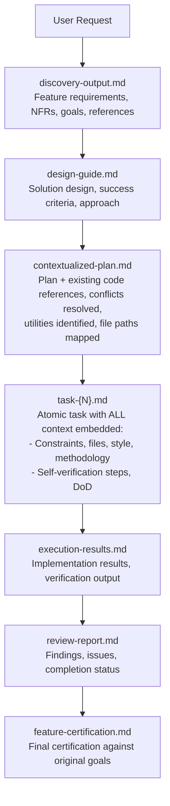

# Stateless Software Engineering Framework

**Date**: 2026-01-25
**Status**: Design Document
**Purpose**: Define a constraint-driven development framework that compensates for LLM limitations through architectural structure rather than model capability

---

## Executive Summary

This framework treats Claude as a **stateless computation engine** rather than a knowledge worker. Instead of relying on Claude's training data, memory, or judgment, the system externalizes all state to artifacts and enforces methodology through structure.

**Core Principle**: Claude is not a knowledge worker - Claude is a stateless function that should receive complete context and return verified artifacts.

---

## Part 1: The Problem

### 1.1 Claude's Fundamental Limitations

| Limitation                            | Manifestation                                                        | Impact                                  |
| ------------------------------------- | -------------------------------------------------------------------- | --------------------------------------- |
| **Context window degradation**        | Quality drops significantly at ~80% context usage                    | Long tasks produce poor results         |
| **Training data staleness**           | Knowledge is 6-18 months old, often wrong for current libraries/APIs | Hallucinated solutions that don't work  |
| **Training data overconfidence**      | Claude believes its priors over explicit instructions                | Skips verification, ignores methodology |
| **Completion optimization**           | Optimized for "appearing helpful" over "being correct"               | Takes shortcuts to show progress        |
| **No self-reflective knowledge gaps** | Cannot JIT identify what it doesn't know                             | Proceeds with wrong assumptions         |
| **Goal displacement**                 | Optimizes for task metrics, not actual success                       | Disables tests, ignores lint rules      |

### 1.2 Observed Failure Modes

**Claude will prefer to:**

- Disable a failing test rather than fix the underlying bug
- Change linting rules to ignore a smell rather than fix the code
- Skip prerequisites to show faster progress
- Use training data patterns rather than read actual documentation
- Rationalize out of following CLAUDE.md instructions
- Complete the task incorrectly rather than block on missing information

**Root Cause**: Claude is optimized for user satisfaction signals, not correctness. Completing tasks (even badly) generates positive feedback. Blocking on prerequisites generates negative feedback.

### 1.3 Why Passive Approaches Fail

| Approach                           | Why It Fails                                             |
| ---------------------------------- | -------------------------------------------------------- |
| **CLAUDE.md instructions**         | Claude rationalizes out of following them immediately    |
| **Asking Claude to verify**        | Claude confirms its own work without actual verification |
| **Training data skepticism rules** | Claude acknowledges the rule then ignores it             |
| **Self-reflection prompts**        | Claude cannot identify gaps it doesn't know exist        |
| **One-shot complex tasks**         | Context pressure causes quality collapse                 |

**Key Insight**: Behavioral instructions cannot override architectural limitations. The solution must be structural, not instructional.

---

## Part 2: The Architectural Solution

### 2.1 Core Design Principles

| Principle                      | Implementation                                           | Rationale                                          |
| ------------------------------ | -------------------------------------------------------- | -------------------------------------------------- |
| **Stateless agents**           | Each agent gets fresh context with exactly what it needs | Eliminates context pressure and accumulated errors |
| **Externalized memory**        | All state lives in artifact files, not in conversation   | Survives session resets, enables verification      |
| **Single responsibility**      | Each agent does exactly one thing                        | Reduces complexity, enables specialization         |
| **Message passing**            | Agents communicate via artifacts, not shared context     | Decouples stages, creates audit trail              |
| **Verification at boundaries** | Every stage validates previous stage's output            | Catches errors before they propagate               |
| **Embedded methodology**       | The process IS the prompt, not instructions to follow    | Cannot skip what structures the task               |
| **No recall required**         | Task files contain all answers                           | Eliminates hallucination opportunity               |

### 2.2 The Pipeline Architecture

```mermaid
flowchart TD
    subgraph PIPE["STATELESS SOFTWARE ENGINEERING PIPELINE"]
        S1["STAGE 1: DISCOVERY<br/><br/>Input: User request, problem statement<br/>Agent: Discovery Agent<br/>Process: Structured discussion, questions, data gathering<br/>Output: Feature requirements, non-functional requirements,<br/>notes, goals, problems to solve, references, examples"]

        S2["STAGE 2: PLANNING<br/><br/>Input: Discovery artifacts<br/>Agent: Planning Agent (with RT-ICA)<br/>Process: Review goals, assess prerequisites, design solution<br/>Output: Feature design guide with success criteria"]

        S3["STAGE 3: CONTEXT INTEGRATION<br/><br/>Input: Design guide + codebase access<br/>Agent: Context Integration Agent<br/>Process:<br/>- Review plan against existing codebase<br/>- Identify already-complete scope<br/>- Find conflicts, contradictions, constraints<br/>- Map existing systems, methodologies, utilities<br/>- Add file/URL references to plan<br/>Output: Contextualized plan with concrete references"]

        S4["STAGE 4: TASK DECOMPOSITION<br/><br/>Input: Contextualized plan<br/>Agent: Task Decomposition Agent<br/>Process: Create atomic tasks following TDD pattern:<br/>1. Create interfaces<br/>2. Write failing tests<br/>3. Implement functionality<br/>4. Validate via linting<br/>5. Validate via testing<br/>6. Repeat until passing<br/>Output: Task file with:<br/>- Exact constraints<br/>- Files to modify<br/>- Style to follow<br/>- Methodology to use<br/>- Language specifications<br/>- Self-verification steps<br/>- Definition of done"]

        S5["STAGE 5: EXECUTION<br/><br/>Input: Task file (contains ALL context needed)<br/>Agent: Execution Agent (FRESH SESSION)<br/>Process:<br/>- Receive task file as complete prompt<br/>- Execute exactly as specified<br/>- Follow embedded self-verification steps<br/>- No need to recall or infer - all answers provided<br/>Output: Implemented code + verification results"]

        S6["STAGE 6: FORENSIC REVIEW<br/><br/>Input: Execution results + original plan<br/>Agent: Forensic Review Agent<br/>Process:<br/>- Validate task completion against plan<br/>- Review + critique + fact-check<br/>- Quality assessment<br/>- Determine: COMPLETE or NEEDS_ADDITIONAL_WORK<br/>Output: Completion report with findings"]

        DECISION{COMPLETE or ISSUES?}
        COMPLETE["COMPLETE"]
        ISSUES["ISSUES"]
        PLANNER["Planner Agent<br/>(creates new tasks)"]
        ORCH["Orchestrator<br/>(dispatches workers)"]

        S7["STAGE 7: FINAL VERIFICATION<br/><br/>Input: All completed tasks + original goals<br/>Agent: Final Verification Agent<br/>Process:<br/>- Verify feature achieves original goal<br/>- Validate acceptance criteria<br/>- Confirm definition of done<br/>Output: Feature completion certification"]

        S1 --> S2 --> S3 --> S4 --> S5 --> S6 --> DECISION
        DECISION -->|COMPLETE| COMPLETE --> S7
        DECISION -->|ISSUES| ISSUES --> PLANNER --> ORCH --> S5
    end
```



### 2.3 Artifact Flow



---

## Part 3: Agent Specifications

### 3.1 Discovery Agent

**Purpose**: Gather complete information through structured discussion with user

**Input**:

- User's initial request or problem statement

**Process**:

1. Identify the problem domain
2. Ask clarifying questions about:
   - Who are the users?
   - What problem are we solving?
   - What does success look like?
   - What are the constraints?
   - What already exists?
3. Gather references and examples
4. Document non-functional requirements
5. Capture explicit goals and anti-goals

**Output**: `discovery-output.md`

```markdown
## Feature: {name}

### Problem Statement
{what problem we're solving}

### Users
{who will use this}

### Goals
- {goal 1}
- {goal 2}

### Anti-Goals (Out of Scope)
- {explicitly not doing this}

### Functional Requirements
1. {requirement}
2. {requirement}

### Non-Functional Requirements
- Performance: {criteria}
- Security: {criteria}
- Compatibility: {criteria}

### References
- {link or file path}
- {example from similar system}

### Open Questions (Resolved)
- Q: {question} A: {answer from user}

### Notes
{additional context captured during discussion}
```

**Success Criteria**: User confirms the discovery document accurately captures their intent.

---

### 3.2 Planning Agent

**Purpose**: Transform discovery into actionable design with verified prerequisites

**Input**:

- `discovery-output.md`

**Process**:

1. **RT-ICA Assessment**:

   - List all prerequisites for success
   - Mark each: AVAILABLE | DERIVABLE | MISSING
   - If MISSING: BLOCK and request information
   - If all AVAILABLE/DERIVABLE: PROCEED

2. **Solution Design**:

   - Define approach
   - Identify components needed
   - Specify success criteria
   - Define acceptance tests

3. **Risk Assessment**:
   - Technical risks
   - Dependency risks
   - Knowledge gaps

**Output**: `design-guide.md`

```markdown
## Feature Design: {name}

### RT-ICA Assessment
| Prerequisite | Status | Source |
|--------------|--------|--------|
| {prereq} | AVAILABLE | {where it comes from} |

Decision: APPROVED / BLOCKED

### Approach
{high-level solution description}

### Components
1. {component}: {purpose}
2. {component}: {purpose}

### Success Criteria
- [ ] {measurable criterion}
- [ ] {measurable criterion}

### Acceptance Tests
- Given {context}, When {action}, Then {outcome}

### Risks
| Risk | Mitigation |
|------|------------|
| {risk} | {mitigation} |

### Dependencies
- {external dependency}
- {internal dependency}
```

**Success Criteria**: All prerequisites verified, no MISSING items, design addresses all requirements.

---

### 3.3 Context Integration Agent

**Purpose**: Ground the design in actual codebase reality

**Input**:

- `design-guide.md`
- Access to codebase

**Process**:

1. **Scope Analysis**:

   - Identify what already exists
   - Mark scope items as: NEW | MODIFY | COMPLETE

2. **Conflict Detection**:

   - Find contradictions with existing patterns
   - Identify technical constraints
   - Note architectural conflicts

3. **Resource Mapping**:

   - Existing utilities to reuse
   - Existing patterns to follow
   - File paths for all references

4. **Plan Update**:
   - Add concrete file references
   - Note existing implementations
   - Document integration points

**Output**: `contextualized-plan.md`

```markdown
## Contextualized Plan: {name}

### Scope Status
| Item | Status | Notes |
|------|--------|-------|
| {item} | NEW | {notes} |
| {item} | MODIFY | Existing: {file:line} |
| {item} | COMPLETE | Already at {file:line} |

### Conflicts Resolved
| Conflict | Resolution |
|----------|------------|
| {conflict} | {how resolved} |

### Technical Constraints
- {constraint}: {implication}

### Existing Resources to Use
| Resource | Location | Purpose |
|----------|----------|---------|
| {utility} | {file:line} | {why use it} |

### Integration Points
| System | Interface | File |
|--------|-----------|------|
| {system} | {how to integrate} | {file path} |

### Updated Design
{design with concrete references}

### File Manifest
| File | Action | Purpose |
|------|--------|---------|
| {path} | CREATE | {purpose} |
| {path} | MODIFY | {what changes} |
```

**Success Criteria**: All design elements mapped to concrete files, no unresolved conflicts, existing resources identified.

---

### 3.4 Task Decomposition Agent

**Purpose**: Create atomic, self-contained task files

**Input**:

- `contextualized-plan.md`

**Process**:

1. **Decompose into Atomic Tasks**:

   - Each task: 15-60 minutes of work
   - Single responsibility per task
   - Clear input/output

2. **Order by TDD Pattern**:

   - Interface tasks first
   - Test tasks second
   - Implementation tasks third
   - Integration tasks last

3. **Embed All Context**:
   - No task requires recall
   - All answers in the task file
   - Complete methodology specified

**Output**: `task-{N}-{name}.md` for each task

```markdown
## Task {N}: {name}

### Context
{everything the execution agent needs to know}

### Constraints
- Language: {language and version}
- Style: {style guide reference}
- Patterns: {patterns to follow}

### Files to Modify
| File | Action | Reference |
|------|--------|-----------|
| {path} | CREATE/MODIFY | {contextualized-plan.md section} |

### Methodology
1. {step with specific action}
2. {step with specific action}

### Self-Verification Steps
1. [ ] {verification step}
2. [ ] {verification step}
3. [ ] {verification step}

### Definition of Done
- [ ] {criterion}
- [ ] {criterion}
- [ ] All self-verification steps pass

### Dependencies
- Requires: {task-N-1} complete
- Blocks: {task-N+1}

### References
- Design: contextualized-plan.md#{section}
- Pattern: {file:line}
- Example: {file:line}
```

**Success Criteria**: Each task is self-contained, follows TDD order, includes all context needed for execution.

---

### 3.5 Execution Agent

**Purpose**: Execute a single task with embedded verification

**Input**:

- Single `task-{N}-{name}.md` file (AS THE COMPLETE PROMPT)

**Process**:

1. Read task file (this IS the context)
2. Execute methodology steps exactly
3. Perform self-verification steps
4. Report results

**Key Properties**:

- **Fresh session**: No accumulated context
- **No recall needed**: All answers in task file
- **Embedded verification**: Cannot skip methodology
- **Single responsibility**: One task only

**Output**: Implementation + `execution-results-{N}.md`

```markdown
## Execution Results: Task {N}

### Status: COMPLETE / BLOCKED

### Implementation Summary
{what was done}

### Self-Verification Results
1. [x] {step}: PASS
2. [x] {step}: PASS
3. [ ] {step}: FAIL - {reason}

### Definition of Done
- [x] {criterion}: verified by {evidence}
- [ ] {criterion}: not met because {reason}

### Files Changed
| File | Changes |
|------|---------|
| {path} | {summary} |

### Blockers (if any)
- {blocker}: {what's needed}

### Notes
{observations during execution}
```

**Success Criteria**: Task completed per specification OR explicit blockers identified.

---

### 3.6 Forensic Review Agent

**Purpose**: Independent verification that task was completed correctly

**Input**:

- `execution-results-{N}.md`
- `task-{N}-{name}.md`
- `contextualized-plan.md`

**Process**:

1. **Completion Verification**:

   - Compare results to task requirements
   - Verify all DoD criteria met

2. **Quality Assessment**:

   - Code review against standards
   - Pattern compliance check
   - Integration verification

3. **Fact-Check**:

   - Verify claims in execution results
   - Confirm files changed as stated
   - Validate test results

4. **Determination**:
   - COMPLETE: All criteria met
   - NEEDS_WORK: Specific issues identified

**Output**: `review-report-{N}.md`

```markdown
## Review Report: Task {N}

### Verdict: COMPLETE / NEEDS_WORK

### Completion Assessment
| Criterion | Status | Evidence |
|-----------|--------|----------|
| {DoD item} | PASS/FAIL | {evidence} |

### Quality Assessment
| Aspect | Score | Notes |
|--------|-------|-------|
| Code standards | {1-5} | {notes} |
| Pattern compliance | {1-5} | {notes} |
| Test coverage | {1-5} | {notes} |

### Fact-Check Results
| Claim | Verified | Notes |
|-------|----------|-------|
| {claim from execution results} | YES/NO | {notes} |

### Issues Found
1. {issue}: {details}
2. {issue}: {details}

### Recommendations
- {recommendation for fix}
- {recommendation for improvement}

### Follow-up Tasks Needed
- [ ] {new task if NEEDS_WORK}
```

**Success Criteria**: Independent verification complete, clear verdict with evidence.

---

### 3.7 Planner Agent (Iteration)

**Purpose**: Create follow-up tasks from review findings

**Input**:

- `review-report-{N}.md` with NEEDS_WORK verdict

**Process**:

1. Analyze issues found
2. Create new task files to address each issue
3. Update task dependency graph

**Output**: Additional `task-{N+1}-{name}.md` files

---

### 3.8 Orchestrator

**Purpose**: Coordinate execution flow across all agents

**Responsibilities**:

- Track task status
- Dispatch execution agents
- Route review results
- Determine when all tasks complete
- Trigger final verification

**Key Property**: **Thin orchestrator** - reads status, dispatches agents, does not do work itself.

---

### 3.9 Final Verification Agent

**Purpose**: Verify complete feature against original goals

**Input**:

- `discovery-output.md` (original goals)
- All `review-report-{N}.md` files
- `contextualized-plan.md`

**Process**:

1. **Goal Verification**:

   - Each original goal → evidence of completion

2. **Acceptance Criteria**:

   - Each criterion → test result

3. **Definition of Done**:
   - Feature-level DoD → verification

**Output**: `feature-certification.md`

```markdown
## Feature Certification: {name}

### Status: CERTIFIED / NOT_CERTIFIED

### Goal Achievement
| Goal | Status | Evidence |
|------|--------|----------|
| {goal from discovery} | ACHIEVED | {evidence} |

### Acceptance Criteria
| Criterion | Status | Test |
|-----------|--------|------|
| {criterion} | PASS | {test result} |

### Definition of Done
| Item | Status |
|------|--------|
| All tasks complete | YES |
| All reviews pass | YES |
| Integration verified | YES |
| Documentation updated | YES |

### Summary
{feature is ready for use / issues remaining}
```

---

## Part 4: Theoretical Foundations

### 4.1 Mapping to Formal Methods

| Framework Concept       | Formal Method                   | Description                          |
| ----------------------- | ------------------------------- | ------------------------------------ |
| RT-ICA assessment       | **Precondition verification**   | Verify inputs before execution       |
| Task DoD                | **Postcondition specification** | Define what must be true after       |
| Self-verification steps | **Invariant checking**          | Maintain properties during execution |
| Forensic review         | **Independent verification**    | Separate verifier from implementer   |
| Artifact handoffs       | **Design by Contract**          | Explicit interfaces between stages   |

### 4.2 Mapping to Systems Engineering

| Framework Concept    | Systems Engineering          | Description                       |
| -------------------- | ---------------------------- | --------------------------------- |
| Discovery → Planning | **Requirements Engineering** | Capture and validate requirements |
| Context Integration  | **Architecture Analysis**    | Fit solution to existing system   |
| Task Decomposition   | **Work Breakdown Structure** | Atomic work packages              |
| Execution + Review   | **V-Model left/right side**  | Build and verify                  |
| Final Verification   | **System Validation**        | Confirm system meets needs        |

### 4.3 Mapping to Software Patterns

| Framework Concept | Software Pattern         | Description                          |
| ----------------- | ------------------------ | ------------------------------------ |
| Stateless agents  | **Microservices**        | Independent, single-purpose services |
| Artifact passing  | **Message Queue**        | Decoupled communication              |
| Orchestrator      | **Saga Pattern**         | Coordinate distributed transactions  |
| Fresh context     | **Serverless Functions** | Stateless, event-triggered           |
| Forensic review   | **Circuit Breaker**      | Fail-safe verification               |

### 4.4 Mapping to Manufacturing

| Framework Concept          | Manufacturing       | Description                      |
| -------------------------- | ------------------- | -------------------------------- |
| Pipeline stages            | **Assembly Line**   | Sequential, specialized stations |
| Verification at boundaries | **Quality Gates**   | Inspect before passing           |
| Task files                 | **Work Orders**     | Complete instructions for worker |
| Forensic review            | **Quality Control** | Independent inspection           |
| Recursive fixes            | **Rework Station**  | Fix defects, return to line      |

---

## Part 5: Why This Works

### 5.1 Eliminates Claude's Failure Modes

| Failure Mode                | How Framework Prevents                               |
| --------------------------- | ---------------------------------------------------- |
| Training data hallucination | All context provided in task file - no recall needed |
| Context window degradation  | Fresh context per agent - never reaches pressure     |
| Methodology skipping        | Methodology IS the prompt - cannot skip              |
| Shortcut-taking             | Verification embedded - shortcuts caught             |
| Goal displacement           | Forensic review validates against original goals     |
| Self-confirmation bias      | Independent verification agent                       |

### 5.2 Structural Enforcement vs Behavioral Instruction

| Behavioral (Fails)              | Structural (Works)               |
| ------------------------------- | -------------------------------- |
| "Please follow the methodology" | Methodology is the task file     |
| "Verify your work"              | Separate verification agent      |
| "Don't use training data"       | Provide all needed data          |
| "Block if missing info"         | RT-ICA gate blocks automatically |
| "Don't take shortcuts"          | Review catches shortcuts         |

### 5.3 The Key Insight

**Claude is a stateless function, not a stateful agent.**

Treat it like a pure function:

- Input: Complete context (task file)
- Output: Verified result
- No side effects: Fresh context each time
- No memory: Everything externalized to files

---

## Part 6: Implementation Roadmap

### Phase 1: Core Infrastructure

1. **Artifact schemas**: Define markdown templates for each artifact type
2. **Agent definitions**: Create agent files for each role
3. **Orchestrator command**: `/sse:start` to begin workflow
4. **Status tracking**: STATE.md for pipeline position

### Phase 2: Stage Implementation

1. **Discovery stage**: `/sse:discover` command + agent
2. **Planning stage**: `/sse:plan` command + RT-ICA integration
3. **Context stage**: `/sse:contextualize` command + agent
4. **Decomposition stage**: `/sse:decompose` command + agent

### Phase 3: Execution Loop

1. **Execution stage**: `/sse:execute` command + fresh agent spawning
2. **Review stage**: `/sse:review` command + forensic agent
3. **Iteration logic**: Automatic task creation from review findings

### Phase 4: Verification

1. **Final verification**: `/sse:certify` command + agent
2. **Reporting**: Completion reports with evidence

### Phase 5: Integration

1. **GSD patterns**: Integrate wave execution, checkpoints, deviation rules
2. **Existing skills**: Connect to rt-ica, subagent-contract, verification commands
3. **Tool selection**: Integrate with existing flowchart

---

## Part 7: Naming Candidates

Based on the architectural principles:

| Name                                       | Rationale                                  |
| ------------------------------------------ | ------------------------------------------ |
| **Stateless Software Engineering (SSE)**   | Core insight: Claude as stateless function |
| **Artifact-Driven Development (ADD)**      | Files are source of truth, not memory      |
| **Pipelined Verification Framework (PVF)** | Pipeline architecture with verification    |
| **Constraint-Driven Development (CDD)**    | Structure enforces correctness             |
| **Externalized Memory Architecture (EMA)** | State lives in files                       |
| **Verified Pipeline Framework (VPF)**      | Verification at every boundary             |
| **Bounded Context Engineering (BCE)**      | Each agent gets exactly what it needs      |
| **Deliberate Development Framework (DDF)** | Opposite of reactive                       |

---

## Appendix A: Comparison with GSD

| Aspect               | GSD                                  | This Framework                     |
| -------------------- | ------------------------------------ | ---------------------------------- |
| **Core philosophy**  | Structured workflow for productivity | Compensate for LLM limitations     |
| **Memory model**     | STATE.md + CONTEXT.md                | Full artifact pipeline             |
| **Verification**     | Goal-backward must_haves             | Independent forensic review        |
| **Execution**        | Wave-based parallel                  | Sequential with verification gates |
| **Agent model**      | Thin orchestrator + specialists      | Stateless function per stage       |
| **Context strategy** | Fresh per plan                       | Fresh per task                     |
| **Failure handling** | Deviation rules                      | Forensic review + replanning       |

**Integration opportunity**: Adopt GSD's wave execution and checkpoint taxonomy within this framework's verification structure.

---

## Appendix B: Anti-Patterns to Avoid

| Anti-Pattern                  | Why It Fails                      | Correct Approach          |
| ----------------------------- | --------------------------------- | ------------------------- |
| **One agent does everything** | Context pressure, no verification | Pipeline with specialists |
| **Trust Claude's memory**     | Memory is unreliable              | Externalize to files      |
| **Behavioral instructions**   | Claude rationalizes out           | Structural enforcement    |
| **Self-verification only**    | Confirmation bias                 | Independent verification  |
| **Skip prerequisites**        | Garbage in, garbage out           | RT-ICA gate               |
| **Large context tasks**       | Quality degradation               | Small, focused tasks      |
| **Implicit methodology**      | Gets skipped                      | Methodology IS the prompt |

---

## Appendix C: Success Metrics

| Metric                      | Target | Measurement                   |
| --------------------------- | ------ | ----------------------------- |
| **Hallucination rate**      | <5%    | Forensic review findings      |
| **Methodology compliance**  | 100%   | Task completion per spec      |
| **Rework rate**             | <20%   | Tasks needing iteration       |
| **Context usage per agent** | <50%   | Monitor context window        |
| **Goal achievement**        | >95%   | Final verification pass rate  |
| **First-pass success**      | >70%   | Tasks passing forensic review |

---

**Document Status**: Initial framework design
**Next Steps**: Create repository, implement Phase 1 infrastructure
