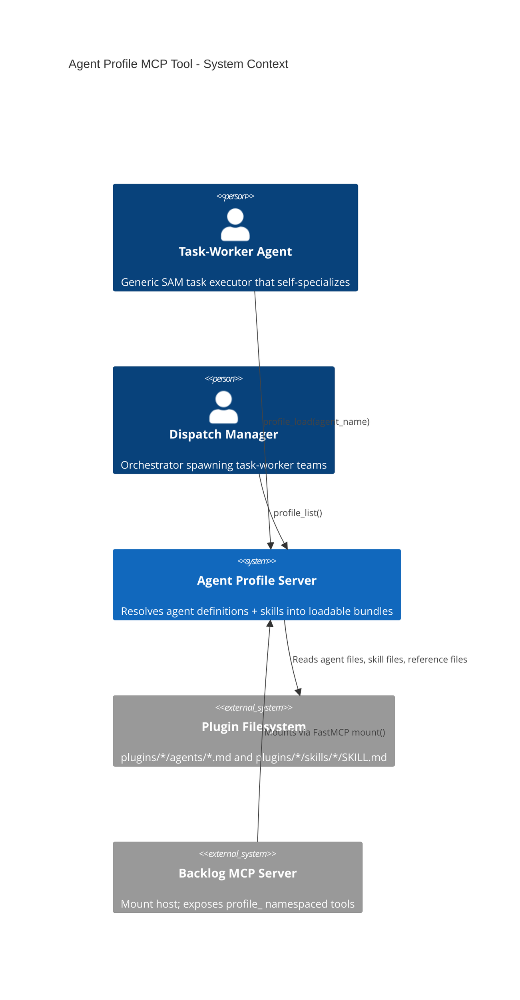
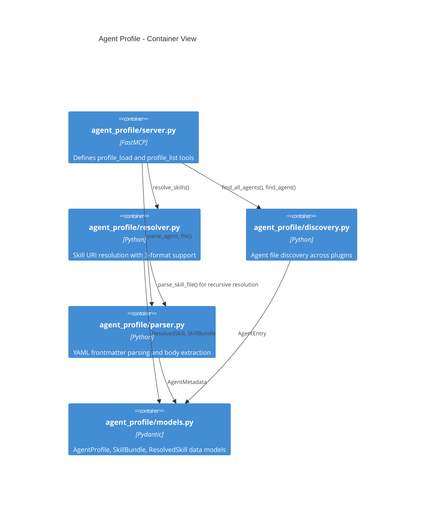
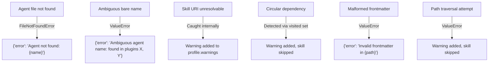

# Architecture Spec: Agent-Profile MCP Tool

## Document Metadata

- **Feature**: Agent-profile MCP tool for dynamic task-worker specialization via skill bundling
- **Issue**: #979
- **Generated**: 2026-03-22
- **Status**: ARCHITECTURE_COMPLETE
- **Source**: `plan/feature-context-agent-profile-mcp-tool.md`

---

## 1. Executive Summary

This architecture adds a new `agent_profile` Python package to the development-harness plugin, exposing two FastMCP tools (`profile_load` and `profile_list`) that are mounted into the existing backlog MCP server with a `profile_` namespace prefix. The tools enable task-workers to self-specialize at runtime by loading an agent definition file together with all of its declared skills, eliminating the need for per-agent routing in the dispatch layer.

The system reads agent `.md` files from `plugins/*/agents/`, parses YAML frontmatter to extract `skills:` declarations, resolves each skill URI across three formats (bare name, plugin-qualified `plugin:skill`, domain path `domains/name`), reads and concatenates SKILL.md content plus `references/*.md` files, and returns a structured `AgentProfile` containing the agent's metadata, body content, resolved skill content, and any resolution warnings. Circular skill dependencies (skills that themselves declare sub-skills) are detected via a visited-set and reported as warnings rather than errors.

The module is a new top-level package (`agent_profile/`) alongside `backlog_core/` and `sam_schema/` within the development-harness plugin, mounted into the backlog server via FastMCP's `mount()` API.

## 2. Architecture Overview

### C4 Context Diagram



### C4 Container Diagram



### Data Flow

```text
profile_load("python-cli-architect")
  |
  v
discovery.find_agent("python-cli-architect")
  |-- Scans plugins/*/agents/*.md
  |-- Matches by stem name or plugin:name
  |-- Returns AgentEntry(path, plugin_name)
  |
  v
parser.parse_agent_file(path)
  |-- Reads file, splits frontmatter from body
  |-- Extracts: name, description, skills, tools, model, color
  |-- Returns AgentMetadata + body_content
  |
  v
resolver.resolve_skills(skill_uris, plugin_context)
  |-- For each URI:
  |     |-- Classify: bare / plugin-qualified / domain-path
  |     |-- Resolve to filesystem path
  |     |-- Read SKILL.md + references/*.md
  |     |-- Check for sub-skills in SKILL.md frontmatter (recursive)
  |     |-- Track visited set for circular dependency detection
  |-- Returns list[ResolvedSkill] + warnings
  |
  v
Assemble AgentProfile response dict
  |-- metadata (name, description, tools, model)
  |-- body (agent instructions below frontmatter)
  |-- skills (list of resolved skill content)
  |-- warnings (unresolvable skills, circular deps)
```

## 3. Technology Stack

| Component | Choice | Justification |
|-----------|--------|---------------|
| MCP framework | FastMCP 3.x | Matches `backlog_core/server.py` and `sam_schema/server.py` patterns already in the plugin |
| Data models | Pydantic v2 | Matches existing model patterns in `backlog_core/models.py` and `sam_schema/core/models.py` |
| YAML parsing | `ruamel.yaml` | Repository standard per `.claude/rules/yaml-toml-libraries.md`; already a dependency |
| Frontmatter parsing | `frontmatter_utils` (shared module) | Existing `backlog_core/frontmatter_utils.py` handles YAML frontmatter extraction |
| Type annotations | `from __future__ import annotations` + `Annotated` | Matches existing server patterns |
| Server composition | `FastMCP.mount()` | Mounts into backlog server with `profile_` prefix; avoids adding a new MCP server entry to plugin.json |
| Python version | >= 3.11 | Matches existing `pyproject.toml` requirement |

**Not used:**

| Rejected | Why |
|----------|-----|
| Standalone MCP server | Adds operational complexity (new `.mcp.json` entry, new process). Mount into backlog is simpler and matches the feature context recommendation |
| `pyyaml` | Prohibited by repo convention |
| Custom frontmatter parser | `frontmatter_utils` already exists and is tested |

## 4. Component Design

### Package: `agent_profile/`

New top-level package at `plugins/development-harness/agent_profile/`. Five modules.

---

### 4.1 `agent_profile/models.py` -- Data models

**Purpose**: Pydantic models for agent profiles, skill bundles, and resolution results.

**Dependencies**: `pydantic`

```python
from __future__ import annotations
from pathlib import Path
from pydantic import BaseModel, Field

class AgentEntry(BaseModel):
    """Lightweight agent file record from discovery scan."""
    name: str = Field(description="Agent name derived from filename stem")
    plugin: str = Field(description="Plugin directory name")
    path: Path = Field(description="Absolute path to agent .md file")

class AgentMetadata(BaseModel):
    """Parsed frontmatter fields from an agent definition file."""
    name: str = Field(description="Agent name (from frontmatter or filename)")
    description: str = Field(default="", description="Agent description")
    skills: list[str] = Field(default_factory=list, description="Raw skill URI strings from frontmatter")
    tools: list[str] = Field(default_factory=list, description="Tool names/patterns")
    model: str | None = Field(default=None, description="Preferred model (haiku, sonnet, opus)")
    color: str | None = Field(default=None, description="Display color")

class ResolvedSkill(BaseModel):
    """A single skill resolved to its content."""
    uri: str = Field(description="Original skill URI as declared in agent frontmatter")
    resolved_path: Path = Field(description="Filesystem path to SKILL.md")
    plugin: str = Field(description="Plugin that owns this skill")
    skill_name: str = Field(description="Skill directory name")
    content: str = Field(description="Full SKILL.md content")
    reference_files: dict[str, str] = Field(
        default_factory=dict,
        description="Map of reference filename to content (from references/*.md)"
    )

class AgentProfile(BaseModel):
    """Complete resolved agent profile with all skills bundled."""
    name: str
    plugin: str
    description: str = ""
    model: str | None = None
    tools: list[str] = Field(default_factory=list)
    body: str = Field(description="Agent instructions (content below frontmatter)")
    skills: list[ResolvedSkill] = Field(default_factory=list)
    warnings: list[str] = Field(default_factory=list, description="Non-fatal resolution issues")

class ProfileListEntry(BaseModel):
    """Summary entry for list_agent_profiles output."""
    name: str
    plugin: str
    description: str = ""
    skill_count: int = 0
    model: str | None = None
```

---

### 4.2 `agent_profile/discovery.py` -- Agent file discovery

**Purpose**: Scan `plugins/*/agents/*.md` to find agent definition files. Handles name-based lookup and full enumeration.

**Dependencies**: `pathlib`, `agent_profile.models`

```python
# Interface only -- no implementation bodies

def get_plugins_root() -> Path:
    """Return the plugins/ directory path, resolved from the project root."""
    ...

def scan_all_agents(plugins_root: Path | None = None) -> list[AgentEntry]:
    """Discover all agent .md files across all plugins.

    Scans plugins/*/agents/*.md. Each file produces one AgentEntry.
    Subdirectory agents (agents/subdir/name.md) are included with
    colon-separated namespace (plugin:subdir:name).

    Returns:
        Sorted list of AgentEntry by (plugin, name).
    """
    ...

def find_agent(
    agent_name: str,
    plugins_root: Path | None = None,
) -> AgentEntry:
    """Find a single agent by name.

    Resolution order:
    1. If agent_name contains ':', treat as plugin-qualified (e.g., 'python3-development:code-reviewer')
       -- split on first ':', look in plugins/{plugin}/agents/{rest}.md
    2. If bare name, scan all plugins for agents/{name}.md
       -- If exactly one match: return it
       -- If multiple matches: raise ValueError listing all matches with plugin names
       -- If no match: raise FileNotFoundError

    Args:
        agent_name: Bare name or plugin-qualified name.
        plugins_root: Override for plugins directory.

    Returns:
        Single matching AgentEntry.

    Raises:
        FileNotFoundError: No agent file matches.
        ValueError: Multiple agents match a bare name (ambiguous).
    """
    ...
```

---

### 4.3 `agent_profile/parser.py` -- Frontmatter and body extraction

**Purpose**: Parse agent `.md` files into structured metadata and body content. Parse skill SKILL.md files for sub-skill declarations.

**Dependencies**: `ruamel.yaml`, `agent_profile.models`

```python
# Interface only

def parse_agent_file(path: Path) -> tuple[AgentMetadata, str]:
    """Parse an agent .md file into metadata and body content.

    Reads the file, extracts YAML frontmatter between --- delimiters,
    and returns the parsed metadata plus everything below the closing ---.

    The skills field in frontmatter may be:
    - A YAML list: ['skill-a', 'skill-b']
    - A comma-separated string: 'skill-a, skill-b'
    Both are normalized to list[str].

    Args:
        path: Absolute path to the agent .md file.

    Returns:
        Tuple of (AgentMetadata, body_content_string).

    Raises:
        FileNotFoundError: File does not exist.
        ValueError: File has no valid YAML frontmatter.
    """
    ...

def parse_skill_frontmatter(path: Path) -> list[str]:
    """Extract sub-skill declarations from a SKILL.md file's frontmatter.

    Reads only the frontmatter section. Looks for a 'skills:' or
    'requires:' field that lists dependent skills.

    Args:
        path: Path to SKILL.md file.

    Returns:
        List of skill URI strings declared as dependencies.
        Empty list if no sub-skills declared.
    """
    ...

def read_skill_content(skill_dir: Path) -> tuple[str, dict[str, str]]:
    """Read SKILL.md content and all reference files from a skill directory.

    Args:
        skill_dir: Path to skill directory (contains SKILL.md and optionally references/).

    Returns:
        Tuple of (skill_md_content, {reference_filename: content}).

    Raises:
        FileNotFoundError: SKILL.md does not exist in skill_dir.
    """
    ...
```

---

### 4.4 `agent_profile/resolver.py` -- Skill URI resolution

**Purpose**: Resolve skill URI strings to filesystem paths and content. Handles three URI formats. Detects circular dependencies during recursive resolution.

**Dependencies**: `pathlib`, `agent_profile.models`, `agent_profile.parser`, `agent_profile.discovery`

```python
# Interface only

class SkillResolver:
    """Resolves skill URIs to filesystem paths and reads their content.

    Maintains a visited set to detect circular dependencies during
    recursive resolution (skills that declare sub-skills).
    """

    def __init__(self, plugins_root: Path | None = None) -> None:
        """Initialize resolver.

        Args:
            plugins_root: Override for plugins directory. Defaults to auto-detection.
        """
        ...

    def resolve(
        self,
        skill_uris: list[str],
        context_plugin: str,
    ) -> tuple[list[ResolvedSkill], list[str]]:
        """Resolve a list of skill URIs to their content.

        For each URI, determines format and resolves:

        1. **Bare name** (e.g., 'subagent-contract'):
           - First checks context_plugin: plugins/{context_plugin}/skills/{name}/SKILL.md
           - Then scans all plugins for skills/{name}/SKILL.md
           - If multiple matches outside context plugin: warning, uses first found

        2. **Plugin-qualified** (e.g., 'dh:subagent-contract', 'python3-development:uv'):
           - Split on first ':' to get (plugin, skill_path)
           - Resolve plugin alias: 'dh' -> 'development-harness'
           - Look in plugins/{plugin}/skills/{skill_path}/SKILL.md
           - Supports nested paths: 'dh:testing:analyze-test-failures'

        3. **Domain path** (e.g., 'domains/enterprise-installanywhere'):
           - Treated as a relative path within context_plugin
           - Look in plugins/{context_plugin}/skills/{path}/SKILL.md

        After resolving each skill's SKILL.md, checks for sub-skill
        declarations in the skill's frontmatter and resolves those
        recursively. The visited set prevents infinite loops.

        Args:
            skill_uris: List of skill URI strings from agent frontmatter.
            context_plugin: Plugin name where the agent file lives (used
                for bare name resolution priority).

        Returns:
            Tuple of (resolved_skills, warnings).
            Unresolvable URIs produce warnings, not errors.
        """
        ...

    def _classify_uri(self, uri: str) -> tuple[str, str, str]:
        """Classify a skill URI into its format type.

        Returns:
            Tuple of (format_type, plugin_or_empty, skill_path) where
            format_type is 'bare', 'qualified', or 'domain'.
        """
        ...

    def _resolve_single(
        self,
        uri: str,
        context_plugin: str,
        visited: set[str],
    ) -> ResolvedSkill | None:
        """Resolve a single skill URI. Returns None if unresolvable.

        Args:
            uri: Skill URI string.
            context_plugin: Owning plugin for bare name priority.
            visited: Set of already-visited skill paths (absolute str)
                for circular dependency detection.
        """
        ...
```

**Plugin alias map** (hardcoded, extensible):

```python
PLUGIN_ALIASES: dict[str, str] = {
    "dh": "development-harness",
}
```

This map resolves short plugin names used in skill URIs (e.g., `dh:subagent-contract`) to their actual directory names. The map is intentionally small and hardcoded -- new aliases are added when new shorthand conventions emerge in agent frontmatter.

---

### 4.5 `agent_profile/server.py` -- FastMCP tool definitions

**Purpose**: Define the two MCP tools and create the FastMCP server instance for mounting.

**Dependencies**: `fastmcp`, `pydantic`, `agent_profile.models`, `agent_profile.discovery`, `agent_profile.parser`, `agent_profile.resolver`

```python
# Interface only

mcp: FastMCP  # Server instance, created at module level

def profile_load(
    agent_name: Annotated[str, Field(
        description=(
            "Agent name to load. Bare name (e.g., 'python-cli-architect') or "
            "plugin-qualified (e.g., 'python3-development:python-cli-architect'). "
            "Bare names that match multiple plugins return an error listing matches."
        )
    )],
) -> dict:
    """Load an agent profile with all skills resolved and bundled.

    Discovers the agent file, parses its frontmatter and body,
    resolves all declared skills (including recursive sub-skills),
    and returns the complete profile.

    Returns:
        AgentProfile as a JSON-serializable dict on success.
        Dict with 'error' key on failure.

    Response shape on success:
        {
            "name": "python-cli-architect",
            "plugin": "python3-development",
            "description": "...",
            "model": "sonnet",
            "tools": [...],
            "body": "# Role\n\nYou are a Python CLI architect...",
            "skills": [
                {
                    "uri": "python3-development:uv",
                    "resolved_path": "/abs/path/to/SKILL.md",
                    "plugin": "python3-development",
                    "skill_name": "uv",
                    "content": "# uv Skill\n\n...",
                    "reference_files": {
                        "uv-reference.md": "..."
                    }
                },
                ...
            ],
            "warnings": ["Could not resolve skill 'nonexistent': not found in any plugin"]
        }
    """
    ...

def profile_list(
    plugin: Annotated[str | None, Field(
        description="Filter by plugin name. Omit to list all plugins."
    )] = None,
) -> dict:
    """List all available agent profiles across plugins.

    Returns:
        Dict with 'agents' list of ProfileListEntry dicts, 'count',
        and optionally 'plugin_filter'.

    Response shape:
        {
            "agents": [
                {
                    "name": "python-cli-architect",
                    "plugin": "python3-development",
                    "description": "...",
                    "skill_count": 6,
                    "model": "sonnet"
                },
                ...
            ],
            "count": 55,
            "plugin_filter": null
        }
    """
    ...
```

---

### 4.6 `agent_profile/__init__.py` -- Package init

**Purpose**: Export the `mcp` server instance for mounting.

```python
from agent_profile.server import mcp

__all__ = ["mcp"]
```

---

### 4.7 Integration point: `backlog_core/server.py` -- Mount

**Change**: Add mount call after the backlog `mcp` instance is created.

```python
# At the end of backlog_core/server.py, after all @mcp.tool definitions:

from agent_profile import mcp as _agent_profile_mcp
mcp.mount("profile", _agent_profile_mcp)
```

This exposes the tools as `profile_load` and `profile_list` in the backlog MCP namespace.

## 5. Data Architecture

### Skill URI Format Specification

Three formats are used in agent frontmatter `skills:` fields across the codebase:

```text
Format 1 -- Bare name:
  "subagent-contract"
  "clear-cove-task-design"
  "semantic-code-search"
  Resolution: context_plugin first, then scan all plugins

Format 2 -- Plugin-qualified:
  "dh:subagent-contract"          (alias: dh -> development-harness)
  "python3-development:uv"       (full plugin name)
  "holistic-linting:holistic-linting"  (full plugin name)
  "dh:validation-protocol"
  Resolution: split on first ':', resolve plugin, look in skills/{path}/

Format 3 -- Domain path:
  "domains/enterprise-installanywhere"
  "domains/enterprise-spring-xml"
  Resolution: treat as relative path within context_plugin/skills/{path}/
```

SOURCE: Grep of `^skills:` across `plugins/*/agents/*.md` (2026-03-22). All three formats verified present.

### Frontmatter Skills Field Formats

The `skills:` field in agent frontmatter appears in two YAML forms:

```yaml
# Form A: Comma-separated string (most common)
skills: subagent-contract, dh:validation-protocol

# Form B: YAML list
skills:
  - subagent-contract
  - dh:validation-protocol

# Form C: Single value string
skills: subagent-contract
```

The parser normalizes all three to `list[str]`.

### AgentProfile Response Schema

The `profile_load` tool returns a JSON-serializable dict matching the `AgentProfile` Pydantic model. Full schema:

```json
{
  "name": "string -- agent name",
  "plugin": "string -- plugin directory name",
  "description": "string -- agent description from frontmatter",
  "model": "string | null -- preferred model",
  "tools": ["string -- tool names/patterns"],
  "body": "string -- full agent body content below frontmatter",
  "skills": [
    {
      "uri": "string -- original URI from frontmatter",
      "resolved_path": "string -- absolute path to SKILL.md",
      "plugin": "string -- owning plugin",
      "skill_name": "string -- skill directory name",
      "content": "string -- full SKILL.md content",
      "reference_files": {
        "filename.md": "string -- file content"
      }
    }
  ],
  "warnings": ["string -- non-fatal resolution messages"]
}
```

### ProfileListEntry Response Schema

The `profile_list` tool returns:

```json
{
  "agents": [
    {
      "name": "string",
      "plugin": "string",
      "description": "string",
      "skill_count": "int",
      "model": "string | null"
    }
  ],
  "count": "int",
  "plugin_filter": "string | null"
}
```

## 6. Security Architecture

### Path Traversal Prevention

The resolver MUST validate that all resolved paths remain within the `plugins/` directory tree. Specifically:

1. After resolving a skill URI to a filesystem path, call `Path.resolve()` and verify the result starts with the `plugins_root` prefix
2. Domain paths (format 3) are particularly sensitive -- `domains/../../etc/passwd` must not resolve outside plugins
3. The `read_skill_content` function must verify `skill_dir.resolve()` is within `plugins_root` before reading

### No Credential Handling

This module reads `.md` files from the local filesystem only. No credentials, tokens, or API keys are involved. No network access is required.

### File Read Scope

The module reads files matching these patterns only:
- `plugins/*/agents/*.md` -- agent definitions
- `plugins/*/skills/*/SKILL.md` -- skill definitions
- `plugins/*/skills/*/references/*.md` -- skill reference files

No other file types or locations are accessed.

## 7. Testing Architecture

### Test Structure

```text
tests/
  test_agent_profile/
    __init__.py
    test_discovery.py      -- Agent file scanning and lookup
    test_parser.py         -- Frontmatter parsing, body extraction, skill field normalization
    test_resolver.py       -- Skill URI classification, resolution, circular dependency detection
    test_server.py         -- MCP tool integration tests
    conftest.py            -- Shared fixtures (temp plugin trees, sample agent files)
```

### Coverage Requirements

- Minimum 80% line coverage across the `agent_profile` package
- 100% coverage on `resolver.py` -- this is the core logic with the most edge cases

### Test Categories

**Unit tests** (test_discovery.py, test_parser.py, test_resolver.py):
- Use `tmp_path` fixtures with synthetic plugin directory trees
- No real filesystem access to `plugins/` -- all paths are constructed in temp directories
- Test each URI format classification independently
- Test circular dependency detection with A->B->A skill chains
- Test ambiguous bare name resolution (multiple plugins, same skill name)
- Test comma-separated vs YAML list frontmatter normalization
- Test agent files with no frontmatter, empty frontmatter, missing skills field

**Integration tests** (test_server.py):
- Use `mcp.test_client()` from FastMCP to invoke tools
- Test `profile_load` with synthetic agent files in tmp_path
- Test `profile_list` enumeration
- Test error cases: nonexistent agent, ambiguous name
- Verify response shape matches Pydantic model serialization

### Key Test Scenarios

1. Bare name resolves to context plugin first
2. Bare name with single match across plugins succeeds
3. Bare name with multiple matches across plugins raises ValueError
4. Plugin-qualified name with alias (`dh:`) resolves correctly
5. Domain path resolves relative to context plugin
6. Circular A->B->A produces warning, not error
7. Missing skill produces warning, profile still returned
8. Agent with no skills field returns empty skills list
9. Comma-separated skills string parsed correctly
10. Reference files included in ResolvedSkill output
11. Path traversal attempt blocked (domain path with `..`)

### Pytest Configuration

Tests use the existing `pyproject.toml` pytest configuration in the development-harness plugin. No additional pytest config needed.

## 8. Distribution Architecture

### Package within existing plugin

The `agent_profile` package is added to the existing `development-harness` plugin. No standalone distribution is needed.

**File additions:**

```text
plugins/development-harness/
  agent_profile/
    __init__.py
    models.py
    discovery.py
    parser.py
    resolver.py
    server.py
```

**pyproject.toml changes:**

Add `agent_profile` to the Hatchling packages list alongside `backlog_core` and `sam_schema`:

```toml
[tool.hatchling.build.targets.wheel]
packages = ["packages/backlog_core", "packages/sam_schema", "agent_profile"]
```

Note: Verify the actual Hatchling config path -- the development-harness plugin may use a different layout convention. The key requirement is that `agent_profile` is importable as a top-level package.

**No new dependencies**: All dependencies (`ruamel.yaml`, `pydantic`, `fastmcp`) are already declared in the plugin's `pyproject.toml`.

**No new MCP server entries**: The agent-profile server is mounted into the existing backlog MCP server, so no changes to `.mcp.json` or `plugin.json` MCP server declarations are needed.

**backlog_core/server.py change**: A single import and mount call at module bottom:

```python
from agent_profile import mcp as _agent_profile_mcp
mcp.mount("profile", _agent_profile_mcp)
```

## 9. Architectural Decisions (ADRs)

### ADR-1: Mount into backlog server vs standalone server

**Context**: The agent-profile tools are conceptually separate from backlog management. However, adding a new MCP server requires a new process, new `.mcp.json` entry, and new lifecycle management.

**Decision**: Mount into backlog_core via `FastMCP.mount("profile", ...)`. Tools appear as `profile_load` and `profile_list`.

**Rationale**:
- Fewer moving parts -- no new server process
- The backlog server already starts with `--project-dir` which provides the project root needed for plugin discovery
- FastMCP mount provides clean namespace separation
- The feature context document (Q3) identified this as the pragmatic choice

**Trade-off**: Agent-profile tools now depend on the backlog server's lifecycle. If the backlog server is not configured, agent-profile tools are also unavailable. This is acceptable because the task-worker workflow already depends on the backlog MCP server.

---

### ADR-2: Bare name resolution with context-plugin priority

**Context**: Agent frontmatter uses bare skill names (e.g., `subagent-contract`) without plugin qualification. The same skill name could theoretically exist in multiple plugins.

**Decision**: Resolve bare names by checking the context plugin first (the plugin that owns the agent file), then scanning all plugins. Error on ambiguity (multiple matches outside context plugin).

**Rationale**:
- Context-plugin-first matches developer intent -- an agent in `development-harness` saying `subagent-contract` means the one in its own plugin
- Error-on-ambiguity prevents silent wrong-skill loading
- This matches how Claude Code resolves skill references in practice

**Trade-off**: Bare names that exist in only one plugin work seamlessly. Bare names that exist in multiple plugins require plugin qualification. This is the correct pressure -- it encourages explicit naming when ambiguity exists.

---

### ADR-3: Warnings over errors for unresolvable skills

**Context**: An agent may reference a skill that has been renamed, moved, or deleted. Should this fail the entire profile load?

**Decision**: Return a partial profile with warnings listing unresolvable skills. The profile's `warnings` field contains human-readable messages.

**Rationale**:
- A task-worker with 5 of 6 skills is more useful than a task-worker with 0 skills
- The feature context (Scenario 5) explicitly specifies this behavior
- Warnings are visible in the MCP response for the consumer to act on

**Trade-off**: A consumer that requires all skills must check the warnings field. This is an explicit contract -- the consumer decides whether partial resolution is acceptable.

---

### ADR-4: Recursive skill resolution with visited-set cycle detection

**Context**: Skills may declare sub-skills in their own frontmatter (e.g., a skill that `requires: [other-skill]`). This creates the possibility of circular dependencies: A depends on B, B depends on A.

**Decision**: Use a `set[str]` of visited absolute paths. When a skill path is already in the visited set, skip it and add a warning. Sub-skills are resolved depth-first.

**Rationale**:
- Depth-first with visited set is the standard cycle detection pattern
- Using absolute path strings (not URIs) prevents aliasing issues where the same skill is reached via different URI formats
- Warning rather than error matches ADR-3's philosophy

**Trade-off**: The visited set is per-call (per `resolve()` invocation), not global. Two separate `profile_load` calls do not share state. This is correct -- each profile resolution should be independent.

---

### ADR-5: Plugin alias map for URI resolution

**Context**: Some agent frontmatter uses short plugin aliases (e.g., `dh:subagent-contract` where `dh` refers to `development-harness`). The resolver needs to map these aliases to actual directory names.

**Decision**: Hardcode a `PLUGIN_ALIASES` dict in `resolver.py`. Initial content: `{"dh": "development-harness"}`.

**Rationale**:
- Only one alias exists in the current codebase (`dh`)
- A configuration file or registry for aliases adds complexity with no current benefit
- New aliases are rare events (adding a new plugin shorthand) and a one-line code change

**Trade-off**: Adding a new alias requires a code change and release. Acceptable given the frequency (approximately never after initial setup).

## 10. Scalability Strategy

### Synchronous Design

Both tools are synchronous (not async). Rationale:

1. All operations are local filesystem reads -- no I/O-bound network calls
2. The SAM server (`sam_schema/server.py`) uses the same pattern: synchronous tool functions
3. FastMCP handles concurrency at the server level -- tool functions do not need to be async

### Caching Strategy

**No caching in v1**. Agent files and skill files are small (1-50KB each). A full scan of `plugins/*/agents/*.md` reads approximately 55 files (observed count). A full skill resolution for a single agent reads 1-10 SKILL.md files plus their references.

**Future optimization path** (if profiling shows need):
- Cache `scan_all_agents()` result with filesystem mtime invalidation
- Cache resolved skill content keyed by absolute path + mtime
- Add an `invalidate_cache()` internal function (no MCP exposure needed)

### Resource Boundaries

- Maximum recursion depth for skill sub-skills: implicit via visited set (no explicit limit needed -- the total number of skills in the codebase is finite and small)
- Maximum file size read: no limit imposed. Skill files are documentation, not data. The largest reference file observed is under 100KB
- No file locking: read-only operations on files that change infrequently

### Error Propagation



Fatal errors (agent not found, ambiguous name, malformed frontmatter) return `{"error": str}`. Non-fatal errors (unresolvable skill, circular dependency, path traversal) add warnings and continue.
