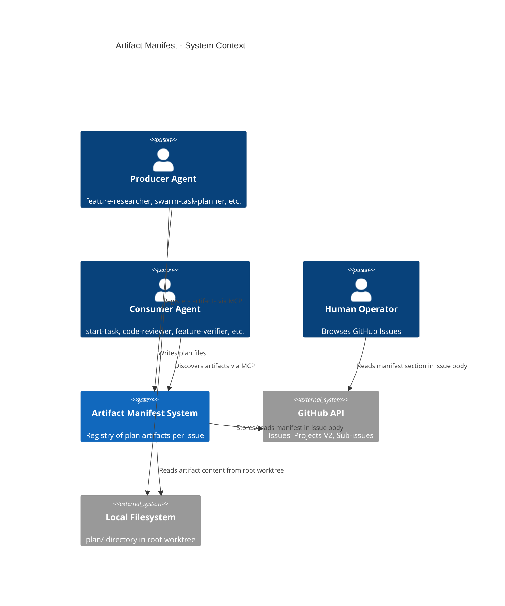
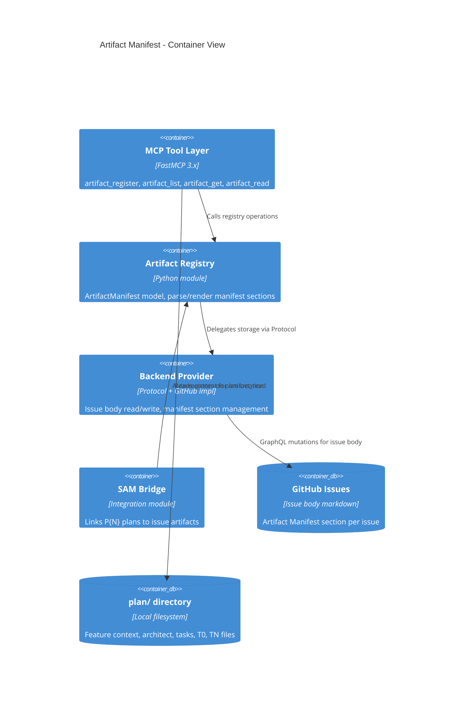
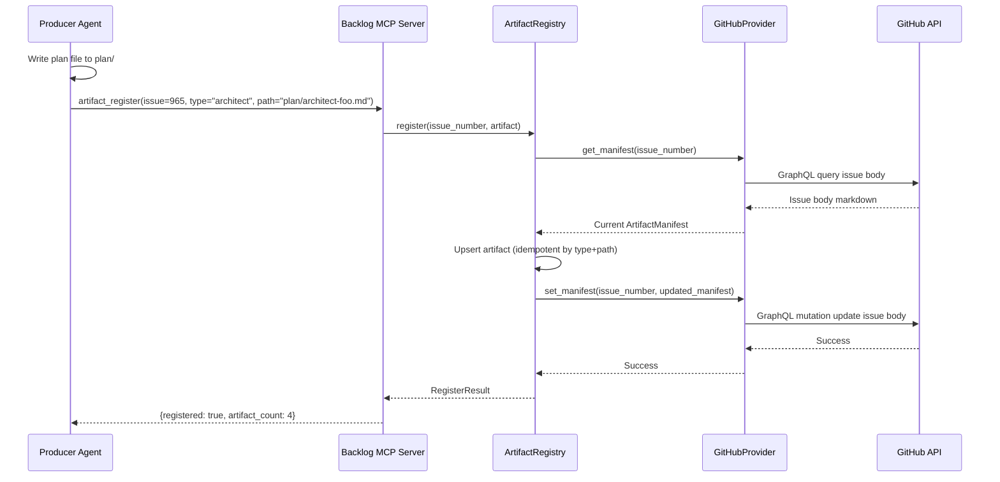
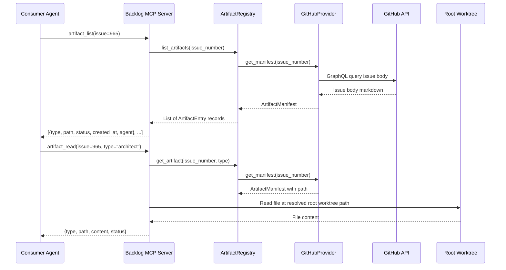
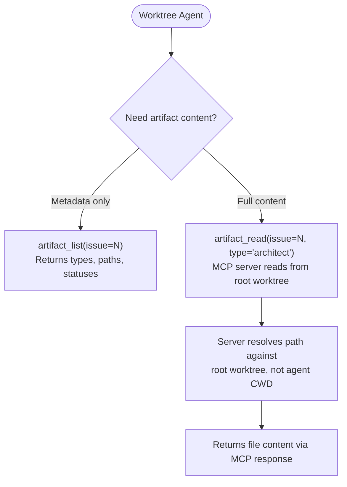
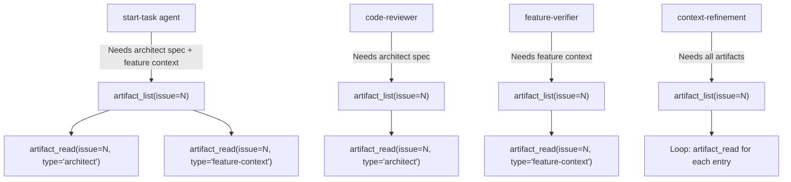

# Architecture Spec: Plan Artifact Manifest

**Feature**: Backend-First Issue-Linked Artifact Registry
**GitHub Issue**: #965
**Date**: 2026-03-21

---

## 1. Executive Summary

The Artifact Manifest system adds a structured registry of plan artifacts to GitHub Issue bodies, enabling producer agents to register artifacts and consumer agents to discover them via MCP tools. Local plan files remain the authoritative store of artifact content; GitHub Issues become the authoritative registry of what artifacts exist, their types, paths, and lifecycle statuses.

The architecture extends the existing `backlog_core` package with an `artifact_registry` module that implements a `BackendProvider` protocol. The GitHub provider (implemented first) stores manifest data as a structured section in the issue body, parseable by both humans and machines. A thin MCP tool layer on the backlog MCP server exposes `artifact_register`, `artifact_list`, and `artifact_get` operations. Producer agents call `artifact_register` after writing plan files; consumer agents call `artifact_list` to discover artifacts by issue number.

Worktree-isolated agents access artifact metadata through the MCP tools (which query GitHub, not the local filesystem), solving the cross-worktree visibility gap. Artifact content for uncommitted files is served by a new `artifact_read` MCP tool that reads from the root worktree filesystem, not the agent's worktree checkout.

The provider abstraction is intentionally thin: register, list, get, update status. Future GitLab/Linear/Supabase backends implement the same protocol. The manifest schema uses only primitives that map to all target backends (type string, path string, status enum, timestamp).

## 2. Architecture Overview

### C4 Context Diagram



### C4 Container Diagram



### Data Flow: Producer Registration



### Data Flow: Consumer Discovery



## 3. Technology Stack

This feature extends the existing `development-harness` plugin. No new packages or standalone scripts are introduced.

| Component | Technology | Justification |
|-----------|-----------|---------------|
| Data models | Pydantic 2.x | Consistent with `sam_schema.core.models` and `backlog_core.models`. AliasChoices for kebab/snake case. |
| MCP tools | FastMCP 3.x | Existing backlog and SAM MCP servers use FastMCP. Artifact tools go on backlog MCP (same GitHub auth). |
| GitHub API | PyGithub + GraphQL | `backlog_core.github` already uses PyGithub with GraphQL helpers. Extend, do not add a second client. |
| YAML parsing | ruamel.yaml | Repository standard per `.claude/rules/yaml-toml-libraries.md`. |
| Markdown parsing | `re` (stdlib) | Manifest section uses a simple delimited format. No external markdown parser needed. |
| Type checking | basedpyright | Project standard. All new interfaces use Protocol classes. |
| Testing | pytest + pytest-mock | Project standard. 80% coverage minimum. |
| CLI fallback | Typer (existing `backlog` CLI) | New subcommands `artifact register`, `artifact list` added to existing CLI. |

## 4. Component Design

### 4.1 Module: `backlog_core/artifact_registry.py`

**Purpose**: Core business logic for artifact manifest operations. Pure Python, no I/O. Handles manifest parsing, rendering, artifact upsert logic, and validation.

```python
class ArtifactRegistry:
    """Stateless registry operations on ArtifactManifest objects."""

    def register(self, manifest: ArtifactManifest, entry: ArtifactEntry) -> ArtifactManifest: ...
    def remove(self, manifest: ArtifactManifest, artifact_type: ArtifactType, path: str) -> ArtifactManifest: ...
    def get_by_type(self, manifest: ArtifactManifest, artifact_type: ArtifactType) -> list[ArtifactEntry]: ...
    def update_status(self, manifest: ArtifactManifest, artifact_type: ArtifactType, path: str, status: ArtifactStatus) -> ArtifactManifest: ...
```

```python
def parse_manifest_section(issue_body: str) -> ArtifactManifest: ...
def render_manifest_section(manifest: ArtifactManifest) -> str: ...
def replace_manifest_in_body(issue_body: str, rendered_section: str) -> str: ...
```

**Dependencies**: `backlog_core.models` (ArtifactManifest, ArtifactEntry, ArtifactType, ArtifactStatus)

### 4.2 Module: `backlog_core/artifact_provider.py`

**Purpose**: Backend abstraction. Defines the `ArtifactBackend` protocol and the `GitHubArtifactProvider` implementation.

```python
class ArtifactBackend(Protocol):
    """Backend contract for artifact manifest storage."""

    def get_manifest(self, issue_number: int) -> ArtifactManifest: ...
    def set_manifest(self, issue_number: int, manifest: ArtifactManifest) -> None: ...
    def read_artifact_content(self, path: str) -> str: ...
```

```python
class GitHubArtifactProvider:
    """GitHub implementation. Reads/writes manifest section in issue body via GraphQL."""

    def __init__(self, repo: str, root_worktree: Path) -> None: ...
    def get_manifest(self, issue_number: int) -> ArtifactManifest: ...
    def set_manifest(self, issue_number: int, manifest: ArtifactManifest) -> None: ...
    def read_artifact_content(self, path: str) -> str: ...
```

**Dependencies**: `backlog_core.github` (GraphQL helpers, PyGithub connection), `backlog_core.artifact_registry` (parse/render), `backlog_core.models`

### 4.3 Extension: `backlog_core/server.py` (MCP tools)

**Purpose**: New MCP tools added to the existing backlog MCP server. Four new tools:

```python
@mcp.tool()
async def artifact_register(
    issue_number: Annotated[int, Field(description="GitHub issue number")],
    artifact_type: Annotated[str, Field(description="Artifact type: feature-context, architect, task-plan, T0-baseline, TN-verification, codebase-analysis")],
    path: Annotated[str, Field(description="Relative path from repo root, e.g. plan/architect-foo.md")],
    status: Annotated[str, Field(description="Lifecycle status: draft, current, superseded, archived")] = "current",
    agent: Annotated[str, Field(description="Name of the producing agent")] = "",
) -> dict[str, object]: ...

@mcp.tool()
async def artifact_list(
    issue_number: Annotated[int, Field(description="GitHub issue number")],
    artifact_type: Annotated[str | None, Field(description="Filter by type (optional)")] = None,
) -> dict[str, object]: ...

@mcp.tool()
async def artifact_get(
    issue_number: Annotated[int, Field(description="GitHub issue number")],
    artifact_type: Annotated[str, Field(description="Artifact type to retrieve")],
) -> dict[str, object]: ...

@mcp.tool()
async def artifact_read(
    issue_number: Annotated[int, Field(description="GitHub issue number")],
    artifact_type: Annotated[str, Field(description="Artifact type whose content to read")],
) -> dict[str, object]: ...
```

**Tool semantics**:

- `artifact_register`: Upserts an artifact entry. Idempotent by (type, path). Returns `{registered: true, artifact_count: N}`.
- `artifact_list`: Returns `{artifacts: [{type, path, status, created_at, agent}, ...], count: N}`. Optionally filtered by type.
- `artifact_get`: Returns metadata for a single artifact type. If multiple artifacts of the same type exist (e.g., multiple codebase-analysis files), returns all.
- `artifact_read`: Returns `{type, path, content, status}`. Reads file content from root worktree path. For worktree-isolated agents, this is the primary content access mechanism.

**Dependencies**: `backlog_core.artifact_registry`, `backlog_core.artifact_provider`

### 4.4 Integration: SAM Bridge

**Purpose**: Automatic artifact registration when SAM operations create or reference plan artifacts. Not a separate module -- integration points in existing code.

**Integration point 1**: `sam_schema/server.py` `sam_create` tool. After creating a plan file, if an `issue` field is present, call `artifact_register` for the task-plan artifact.

**Integration point 2**: `/add-new-feature` skill workflow. Each phase that produces an artifact includes an `artifact_register` MCP call in the agent's delegation prompt. This is the primary registration path -- explicit, not hook-based.

**Integration point 3**: `backlog_core/operations.py` `backlog_update(plan=...)`. When a plan is attached to a backlog item that has an issue number, register the plan as a `task-plan` artifact on that issue.

### 4.5 Worktree Content Access

**Purpose**: Serve artifact content to worktree-isolated agents via MCP.



The `artifact_read` tool resolves paths against the `root_worktree` path configured at server startup (same `--project-dir` mechanism as `backlog_core.models.init()`). Worktree agents never access plan files via filesystem -- they use MCP exclusively.

**Safety constraint**: The `artifact_read` tool validates that the resolved path:
1. Is under the repository root (no path traversal)
2. Starts with `plan/` (only plan artifacts, not arbitrary files)
3. The file exists (returns clear error on cache miss)

## 5. Data Architecture

### 5.1 Pydantic Models

All models go in `backlog_core/models.py` alongside existing models.

```python
class ArtifactType(StrEnum):
    """Plan artifact categories. Matches the taxonomy in feature-context-artifact-manifest.md."""

    FEATURE_CONTEXT = "feature-context"
    ARCHITECT = "architect"
    TASK_PLAN = "task-plan"
    T0_BASELINE = "T0-baseline"
    TN_VERIFICATION = "TN-verification"
    CODEBASE_ANALYSIS = "codebase-analysis"


class ArtifactStatus(StrEnum):
    """Lifecycle status of a registered artifact."""

    DRAFT = "draft"
    CURRENT = "current"
    SUPERSEDED = "superseded"
    ARCHIVED = "archived"


class ArtifactEntry(BaseModel):
    """A single artifact reference within a manifest.

    Represents a structured reference to a plan file -- not the content itself.
    Follows the Jira remote-link pattern: ownership of content stays with the
    filesystem, ownership of the reference stays with the backend.
    """

    model_config = ConfigDict(populate_by_name=True, use_enum_values=True)

    artifact_type: ArtifactType = Field(
        ...,
        validation_alias=AliasChoices("artifact-type", "artifact_type", "type"),
        serialization_alias="type",
    )
    path: str = Field(..., min_length=1, description="Relative path from repo root")
    status: ArtifactStatus = ArtifactStatus.CURRENT
    created_at: str = Field(
        default="",
        validation_alias=AliasChoices("created-at", "created_at"),
        serialization_alias="created-at",
    )
    agent: str = Field(default="", description="Name of the producing agent")


class ArtifactManifest(BaseModel):
    """Complete artifact manifest for a single GitHub Issue.

    Parsed from and rendered to a markdown section in the issue body.
    The section format is human-readable (markdown table) and machine-parseable.
    """

    model_config = ConfigDict(populate_by_name=True)

    issue_number: int = Field(
        ...,
        validation_alias=AliasChoices("issue-number", "issue_number"),
        serialization_alias="issue-number",
    )
    artifacts: list[ArtifactEntry] = Field(default_factory=list)
    last_updated: str = Field(
        default="",
        validation_alias=AliasChoices("last-updated", "last_updated"),
        serialization_alias="last-updated",
    )


class RegisterResult(BaseModel):
    """Response from artifact_register MCP tool."""

    registered: bool
    artifact_count: int
    action: str = ""  # "created" | "updated" | "no-change"


class ArtifactContent(BaseModel):
    """Response from artifact_read MCP tool."""

    artifact_type: str = Field(serialization_alias="type")
    path: str
    content: str
    status: str
```

### 5.2 Manifest Section Format in Issue Body

The manifest is stored as a markdown section within the GitHub Issue body. Format:

```markdown
## Artifact Manifest

<!-- artifact-manifest:begin -->
| Type | Path | Status | Agent | Created |
|------|------|--------|-------|---------|
| feature-context | plan/feature-context-foo.md | current | feature-researcher | 2026-03-21T10:00:00Z |
| architect | plan/architect-foo.md | current | python-cli-design-spec | 2026-03-21T11:00:00Z |
| task-plan | plan/P965-foo.yaml | current | swarm-task-planner | 2026-03-21T12:00:00Z |
<!-- artifact-manifest:end -->
```

**Format design decisions**:

- **Markdown table**: Human-readable when browsing GitHub. Machine-parseable via regex on the delimited block.
- **HTML comment delimiters**: `<!-- artifact-manifest:begin -->` and `<!-- artifact-manifest:end -->` enable precise extraction without fragile heading-level parsing. Follows the same pattern as `<!-- sam:task ... -->` blocks in `backlog_core.parsing`.
- **No JSON/YAML in body**: Keeps the issue body clean for human readers. The structured data is implicit in the table columns.
- **Idempotent upsert**: Registration matches on (type, path). If both match an existing entry, the status/agent/timestamp are updated. If only type matches but path differs, a new row is added (supports multiple codebase-analysis files).

### 5.3 Manifest Section Parsing

The parser extracts content between the `<!-- artifact-manifest:begin -->` and `<!-- artifact-manifest:end -->` delimiters and parses the markdown table rows into `ArtifactEntry` objects. If no manifest section exists, an empty `ArtifactManifest` is returned (not an error).

The renderer produces the full section including heading and delimiters. The `replace_manifest_in_body` function replaces the section in-place if it exists, or appends it to the end of the issue body if absent.

### 5.4 Backward Compatibility: Plan.issue and backlog_update(plan=...)

The existing `Plan.issue` field and `backlog_update(plan=...)` continue to work unchanged. The artifact manifest is additive:

- `Plan.issue` stores the GitHub issue number in plan frontmatter (used by SAM for status sync)
- `backlog_update(plan=...)` stores the plan file path in the backlog item metadata
- `artifact_register(...)` stores a structured reference in the GitHub Issue body

All three can coexist. The manifest does not replace the existing linking mechanisms -- it augments them with a structured, queryable registry.

### 5.5 Artifact Type to Path Convention Mapping

```python
ARTIFACT_PATH_PATTERNS: dict[ArtifactType, str] = {
    ArtifactType.FEATURE_CONTEXT: "plan/feature-context-{slug}.md",
    ArtifactType.ARCHITECT: "plan/architect-{slug}.md",
    ArtifactType.TASK_PLAN: "plan/P{N}-{slug}.yaml",
    ArtifactType.T0_BASELINE: "plan/T0-baseline-{slug}.yaml",
    ArtifactType.TN_VERIFICATION: "plan/TN-verification-{slug}.yaml",
    ArtifactType.CODEBASE_ANALYSIS: "plan/codebase/{focus}.md",
}
```

This mapping is informational (for validation warnings), not enforced. Artifacts can be registered with any path. The manifest records what exists, not what should exist.

## 6. Security Architecture

### 6.1 Credential Management

No new credentials introduced. The system uses the existing `GITHUB_TOKEN` environment variable, already managed by `backlog_core.github`. The `GitHubArtifactProvider` reuses the same PyGithub connection established by the backlog MCP server.

### 6.2 Security Checklist

- [x] **Path traversal prevention**: `artifact_read` validates that resolved paths are under repo root and within `plan/` directory. No `..` traversal permitted.
- [x] **No secret exposure**: Manifest contains only paths and metadata -- no credentials, tokens, or sensitive data.
- [x] **Input validation**: `ArtifactType` is a `StrEnum` -- only valid types accepted. Paths validated as non-empty strings. Issue numbers validated as positive integers.
- [x] **No shell execution**: All operations are Python API calls. No `subprocess` or shell commands.
- [x] **Rate limiting**: GraphQL mutations for issue body updates are batched (one update per registration call). The manifest section is fetched and updated atomically -- no N+1 query patterns.
- [x] **Idempotency**: Duplicate registrations produce the same state. No append-only growth from repeated calls.

## 7. Testing Architecture

### 7.1 Testing Strategy

| Layer | Test Type | Coverage Target | Key Focus |
|-------|-----------|-----------------|-----------|
| `artifact_registry.py` | Unit tests | 95% | Parse/render roundtrip, upsert idempotency, edge cases (empty body, missing section, malformed table) |
| `artifact_provider.py` | Unit + integration | 80% | GitHubProvider with mocked GraphQL responses. Integration test with real GitHub API (marked `@pytest.mark.integration`). |
| MCP tools | CLI integration | 80% | FastMCP test client. Verify tool signatures, parameter validation, response shapes. |
| SAM bridge | Unit tests | 80% | Verify `sam_create` triggers registration when issue field present. |

### 7.2 Test Fixtures

```python
# Fixture: sample issue body with existing manifest
@pytest.fixture
def issue_body_with_manifest() -> str: ...

# Fixture: sample issue body without manifest section
@pytest.fixture
def issue_body_no_manifest() -> str: ...

# Fixture: ArtifactManifest with 3 entries
@pytest.fixture
def sample_manifest() -> ArtifactManifest: ...

# Fixture: mock GitHubArtifactProvider
@pytest.fixture
def mock_provider(mocker: MockerFixture) -> GitHubArtifactProvider: ...
```

### 7.3 Critical Test Scenarios

1. **Roundtrip fidelity**: Parse a manifest section, render it, parse again -- result is identical.
2. **Idempotent registration**: Register same artifact twice -- manifest has exactly one entry.
3. **Multiple artifacts of same type**: Register two `codebase-analysis` artifacts with different paths -- both appear.
4. **Empty issue body**: Register into an issue with no body -- manifest section is created.
5. **Existing body without manifest**: Register into an issue with content but no manifest section -- section appended, existing content preserved.
6. **Path traversal rejection**: `artifact_read` with `../../../etc/passwd` path -- rejected with clear error.
7. **Non-plan path rejection**: `artifact_read` with `src/main.py` -- rejected (not in `plan/`).
8. **Cache miss**: `artifact_read` for a registered artifact whose local file is missing -- returns error with "cache miss" explanation.
9. **Status transition**: Update artifact from `current` to `superseded` -- manifest reflects new status.

### 7.4 pytest Configuration

Tests go in `plugins/development-harness/tests_backlog/test_artifact_registry.py` and `tests_backlog/test_artifact_provider.py`, following the existing test directory structure.

```toml
# Already configured in plugins/development-harness/pyproject.toml
[tool.coverage.run]
source = ["backlog_core", "sam_schema", "dispatch_schema"]
# backlog_core already included -- new modules covered automatically
```

## 8. Distribution Architecture

**Strategy 2 -- Python Package** (extension of existing package).

The artifact manifest code lives entirely within the existing `backlog_core` package in `plugins/development-harness/`. No new package, no new `pyproject.toml`, no new MCP server.

```text
plugins/development-harness/
├── backlog_core/
│   ├── __init__.py              # existing
│   ├── models.py                # extended with ArtifactType, ArtifactStatus, ArtifactEntry, ArtifactManifest
│   ├── artifact_registry.py     # NEW: parse/render/upsert logic
│   ├── artifact_provider.py     # NEW: ArtifactBackend protocol + GitHubArtifactProvider
│   ├── github.py                # existing, minimal extensions for manifest section I/O
│   ├── operations.py            # existing, extended for auto-registration on backlog_update(plan=...)
│   ├── server.py                # existing, extended with 4 new MCP tools
│   └── parsing.py               # existing, extended with manifest section parse/render helpers
├── sam_schema/
│   └── server.py                # existing, extended: sam_create triggers artifact_register
└── tests_backlog/
    ├── test_artifact_registry.py # NEW
    └── test_artifact_provider.py # NEW
```

**Justification**: The artifact manifest is a feature of the backlog system (issue-linked metadata). It shares the same GitHub connection, authentication, and repository discovery as existing backlog operations. A separate package or MCP server would duplicate infrastructure and fragment the consumer interface.

The `backlog_core` package is already declared in `pyproject.toml` under `[tool.hatch.build.targets.wheel] packages` and `[tool.coverage.run] source`. New modules within it are automatically included in builds and coverage.

## 9. Architectural Decisions (ADRs)

### ADR-001: Extend backlog MCP server, not create a new MCP server

**Context**: Artifact manifest operations need GitHub API access, repository discovery, and issue body manipulation. These are all capabilities the backlog MCP server already has.

**Decision**: Add `artifact_register`, `artifact_list`, `artifact_get`, `artifact_read` as new tools on the existing backlog MCP server.

**Rationale**: A separate MCP server would duplicate GitHub connection management, authentication, repository discovery, and issue body parsing. Consumers would need to know which server handles artifacts vs backlog items. The backlog server already owns "GitHub Issue body management" -- artifacts are another section within that body.

**Consequences**: The backlog MCP server grows by 4 tools (currently has ~10). Server startup adds `GitHubArtifactProvider` initialization. Tool namespace uses `artifact_` prefix for clear separation.

---

### ADR-002: Manifest in issue body section, not pinned comment or sub-issue

**Context**: Three options for manifest storage: (a) section in issue body, (b) pinned comment, (c) linked sub-issue. Each has trade-offs for editability, discoverability, and API complexity.

**Decision**: Section in issue body with HTML comment delimiters.

**Rationale**:
- **Issue body**: Single API call to read (issue body is always fetched with the issue). Humans see it immediately when viewing the issue. Editing is a single mutation. The `<!-- artifact-manifest:begin/end -->` delimiter pattern is already used for `<!-- sam:task ... -->` blocks in `backlog_core.parsing`.
- **Pinned comment**: Requires a separate API call to list comments and find the pinned one. GitHub does not have a native "pinned comment" concept for issues (only for discussions). Would need a convention like "first comment by the bot" which is fragile.
- **Sub-issue**: Requires creating and managing a separate issue. Overkill for a metadata section. Adds API complexity and a conceptual entity that does not map to any user mental model.

**Consequences**: Issue body mutations must preserve existing content outside the manifest section. The `replace_manifest_in_body` function handles this atomically. Concurrent edits to the issue body (by humans or other tools) could conflict -- mitigated by the fetch-then-update pattern already used in `backlog_core.github`.

---

### ADR-003: Explicit registration via MCP call, not automatic hook-based

**Context**: Producer agents could register artifacts either (a) explicitly by calling `artifact_register` MCP tool, or (b) automatically via a hook that detects file writes to `plan/`.

**Decision**: Explicit MCP call by producer agents, with integration-point auto-registration for `sam_create` and `backlog_update(plan=...)`.

**Rationale**:
- **Explicit is observable**: The agent's delegation prompt includes the registration step. The orchestrator can verify it happened. Hook-based registration is invisible and harder to debug.
- **Not all plan files should be registered**: Transient artifacts (active-task context files, follow-up task files from code review) should not appear in the manifest. Explicit registration gives the producer agent control.
- **Integration points cover the common case**: `sam_create` and `backlog_update(plan=...)` handle the two most common registration paths automatically. Individual producer agents handle the rest via explicit calls.
- **Hook complexity**: A filesystem-watching hook would need to distinguish plan files from non-plan files, determine the correct issue number, and handle the case where the issue does not yet exist. This logic is better expressed in the agent's workflow than in a generic hook.

**Consequences**: Each producer agent's delegation prompt must include an `artifact_register` step. The orchestrator skill (`/add-new-feature`) must be updated to include registration in each phase's delegation instructions.

---

### ADR-004: Thin provider abstraction (4 methods)

**Context**: The backend abstraction must support GitHub now and GitLab/Linear/Supabase later. The abstraction boundary determines what future providers must implement.

**Decision**: `ArtifactBackend` protocol with 3 required methods: `get_manifest`, `set_manifest`, `read_artifact_content`.

**Rationale**:
- **get_manifest / set_manifest**: Every backend can store and retrieve a structured manifest. GitHub uses issue body sections. GitLab could use issue descriptions. Linear could use document resources. Supabase could use a table.
- **read_artifact_content**: Every backend needs a way to serve file content. GitHub provider reads from root worktree. A Supabase provider might read from object storage. This is the only I/O method.
- **No sub-issue methods**: Sub-issue management is a backlog concern, not an artifact concern. The artifact manifest references issues by number -- it does not create them.
- **No search/filter methods**: Filtering by type or status is done in the `ArtifactRegistry` layer after loading the full manifest. Manifests are small (3-6 entries per issue). No need for backend-level query optimization.

**Consequences**: Future providers implement 3 methods. The `ArtifactRegistry` layer handles all business logic (upsert, filter, validation) without provider involvement. Providers are pure I/O adapters.

---

### ADR-005: Forward-only migration (no retroactive registration)

**Context**: The `plan/` directory contains artifacts for completed features that were never registered. Should these be retroactively registered?

**Decision**: Forward-only. The manifest applies to new features going forward. Existing artifacts are not retroactively registered.

**Rationale**:
- Retroactive registration requires mapping old plan files to issue numbers. Many old features lack issue numbers or used different conventions.
- The manifest's primary value is for active workflows (worktree isolation, cross-agent discovery). Completed features do not benefit from retroactive registration.
- A bulk migration script could be written later if needed, but it is not part of the initial feature scope.

**Consequences**: The `artifact_list` tool returns an empty manifest for issues that predate the feature. This is correct behavior -- no artifacts were registered. Consumers must handle empty manifests gracefully.

## 10. Scalability Strategy

### 10.1 API Call Efficiency

Each `artifact_register` call performs 2 GitHub API operations: one read (get issue body) and one write (update issue body). This is acceptable for the expected workload (3-6 registrations per feature, executed sequentially during `/add-new-feature`).

For bulk registration scenarios (e.g., retroactive migration), a batch variant could accept multiple entries and perform a single read-modify-write cycle. This is not in scope for initial implementation but the `ArtifactRegistry.register` method accepts and returns `ArtifactManifest` objects, making batch operations a trivial extension.

### 10.2 Manifest Size

Manifests contain 3-6 entries per feature. At ~100 characters per table row, the manifest section adds ~600-800 characters to an issue body that typically contains 2000-5000 characters. No pagination needed.

### 10.3 Concurrent Access

Two agents registering artifacts for the same issue simultaneously could produce a lost-update conflict (both read the same body, both write their update, second write overwrites first). Mitigation strategies:

1. **Sequential registration**: The `/add-new-feature` workflow runs producer agents sequentially. No concurrent writes in the normal flow.
2. **Retry on conflict**: If a write fails because the issue body changed between read and write, the provider retries (read-modify-write cycle). PyGithub surfaces HTTP 409 conflicts as `GithubException`.
3. **No distributed lock**: A distributed lock is overkill for 3-6 sequential registrations. The retry mechanism handles the rare concurrent case.

### 10.4 Caching

The `get_manifest` call reads the full issue body from GitHub. For consumer agents that call `artifact_list` followed by multiple `artifact_read` calls, the manifest is fetched once per `artifact_list` call. The `artifact_read` tool does NOT re-fetch the manifest -- it receives the path from the caller (who got it from `artifact_list`).

Future optimization: an in-process LRU cache on `get_manifest` with a TTL of 60 seconds. Not in scope for initial implementation -- the expected access pattern (one `artifact_list` per agent session) does not warrant it.

### 10.5 Resource Management

- **File handles**: `artifact_read` opens plan files with a context manager. No persistent file handles.
- **GitHub connections**: Reuses the existing PyGithub connection from `backlog_core.github`. No new connections.
- **Memory**: Manifest objects are small Pydantic models (< 1KB). File content returned by `artifact_read` is loaded fully into memory. Plan files are typically 5-50KB -- well within acceptable memory usage for MCP tool responses.

---

## Appendix A: Producer Agent Registration Points

Each producer agent is updated with an `artifact_register` call in its delegation prompt:

```mermaid
flowchart TD
    FR[feature-researcher] -->|Writes plan/feature-context-slug.md| R1["artifact_register(issue, 'feature-context', path)"]
    PCD[python-cli-design-spec] -->|Writes plan/architect-slug.md| R2["artifact_register(issue, 'architect', path)"]
    STP[swarm-task-planner] -->|Writes plan/P{N}-slug.yaml| R3["artifact_register(issue, 'task-plan', path)"]
    CA[codebase-analyzer] -->|Writes plan/codebase/FOCUS.md| R4["artifact_register(issue, 'codebase-analysis', path)"]
    T0[t0-baseline-capture] -->|Writes plan/T0-baseline-slug.yaml| R5["artifact_register(issue, 'T0-baseline', path)"]
    TN[tn-verification-gate] -->|Writes plan/TN-verification-slug.yaml| R6["artifact_register(issue, 'TN-verification', path)"]
```

The `/add-new-feature` skill's delegation prompt for each phase includes the registration call. The `/implement-feature` skill includes registration for T0 and TN bookend tasks.

## Appendix B: Consumer Agent Discovery Points

Consumer agents query the manifest before accessing artifacts:



## Appendix C: Migration Strategy

### Phase 1: Core Implementation (this feature)

- Add data models to `backlog_core/models.py`
- Implement `artifact_registry.py` and `artifact_provider.py`
- Add 4 MCP tools to `backlog_core/server.py`
- Add integration points in `sam_create` and `backlog_update`
- Tests for all new code

### Phase 2: Producer Agent Updates

- Update `/add-new-feature` skill to include `artifact_register` in each phase's delegation prompt
- Update `/implement-feature` skill to include registration for bookend tasks
- No changes to agent files themselves -- agents receive registration instructions via delegation prompts

### Phase 3: Consumer Agent Updates

- Update `/start-task` skill to use `artifact_list` + `artifact_read` instead of filesystem paths
- Update `/complete-implementation` skill phases to discover artifacts via MCP
- Fallback: if `artifact_list` returns empty (pre-manifest issue), fall back to filesystem path conventions

### Phase 4: Worktree Integration

- Update `/work-milestone` skill to pass issue number to worktree agents
- Worktree agents use `artifact_read` instead of filesystem access for plan artifacts
- Verify worktree agents never write to `plan/` in their worktree checkout

### Backward Compatibility During Migration

- All existing plan files, naming conventions, and SAM P{N} addressing continue to work unchanged
- `Plan.issue`, `backlog_update(plan=...)`, and `backlog_get_ready_sam_tasks` are not modified
- Consumer agents that already receive file paths via delegation prompts continue to work
- The manifest is additive -- it augments existing discovery mechanisms, does not replace them
- Agents that do not know about the manifest continue to function via filesystem conventions
