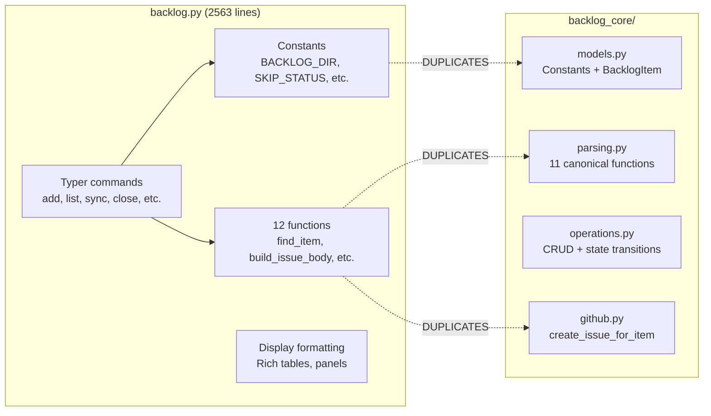
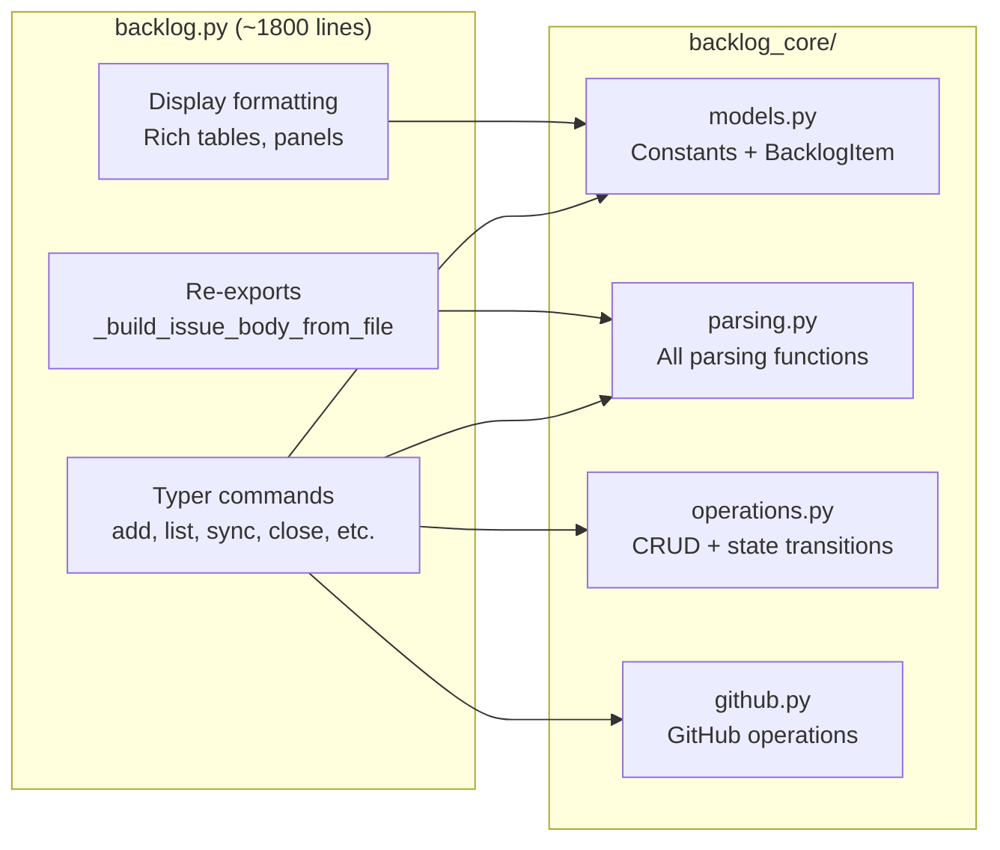
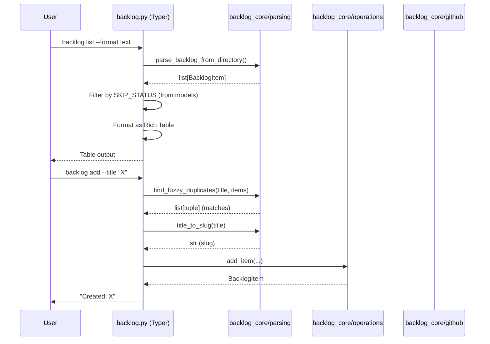

# Architecture Spec: Backlog CLI Deduplication

**Issue**: Fixes #611
**Scope**: Replace duplicated functions/constants in `backlog.py` with imports from `backlog_core/`
**Constraint**: No new dependencies, no behavioral changes (except SKIP_STATUS bug fix), all 12 test files pass

---

## 1. Executive Summary

Replace 12 duplicated functions and 7 duplicated constants in `backlog.py` (2563 lines) with imports from `backlog_core/`. The CLI becomes a thin Typer wrapper: argument parsing, output formatting (Rich), and exit code translation. All business logic delegates to `backlog_core/`.

The key architectural decision is **adapter placement at the CLI command boundary** (ADR-004). Each Typer command that currently works with `dict` items will call `backlog_core` functions that return `BacklogItem`, then convert to display format at the output boundary. No new adapter module is introduced -- conversion is a one-liner (`item.model_dump()`) at each call site.

The SKIP_STATUS bug (CLI missing `"CLOSED"`) is fixed as a natural consequence of importing the canonical constant from `backlog_core/models.py`.

**Design decisions resolved:**

| Question | Decision |
|----------|----------|
| Q1: Adapter placement | CLI boundary -- commands call core directly, convert BacklogItem to dict/display at output |
| Q2: Bug fix bundling | Step 1 is a standalone commit (constants only), SKIP_STATUS fix is verifiable in isolation |
| Q3: Core internal cleanup | Bundled -- core's `parse_item_file` will use `SKIP_STATUS` from models (FIND-14/15 fix) |
| Q4: CLI-only function migration | All 12 have confirmed core equivalents -- replace all with imports |
| Q5: Test adaptation | CLI re-exports `_build_issue_body_from_file` as thin wrapper so existing importlib tests pass |

## 2. Architecture Overview

### Current State (duplication)



### Target State (thin wrapper)



### Call Flow: CLI Command Execution (After Dedup)



## 3. Technology Stack

No new technology. This refactoring operates within the existing stack:

- **CLI**: Typer 0.21+ with Rich console output
- **Models**: Pydantic 2.x (`BacklogItem` in `backlog_core/models.py`)
- **Testing**: pytest 8+ (12 existing test files)
- **Distribution**: PEP 723 standalone script (`backlog.py`)

## 4. Component Design — Module Boundaries and Migration Categorization

### 4.1 Module Boundary Diagram

```text
backlog.py (CLI layer)
  Responsibilities:
    - Typer command definitions (@app.command decorators)
    - Argument parsing and validation (Typer/Annotated)
    - Output formatting (Rich tables, panels, text)
    - Exit code translation (BacklogError -> typer.Exit(1))
    - Re-exports for backward compatibility (test imports)
  Does NOT contain:
    - Business logic, parsing logic, GitHub API calls
    - Constant definitions duplicated from backlog_core
    - Functions that accept/return dict where core uses BacklogItem

backlog_core/
  models.py    — Constants, exceptions, Pydantic models (unchanged)
  parsing.py   — All parsing, slug, fuzzy matching, body building (unchanged)
  operations.py — CRUD, state transitions, sync (unchanged)
  github.py    — GitHub API wrappers (unchanged)
  entry_blocks.py — Timestamped entry formatting (unchanged)
  server.py    — MCP server (unchanged)
```

### 4.2 Migration Categorization: Constants

All 7 CLI-local constants are replaced with imports from `backlog_core.models`.

| CLI Constant (backlog.py) | Core Location | Action | Notes |
|---------------------------|---------------|--------|-------|
| `BACKLOG_DIR` (line 87) | `models.py:21` | **REPLACE** with import | Identical values |
| `DEFAULT_REPO` (line 88) | `models.py:22` | **REPLACE** with import | Identical values |
| `SECTION_RE` (line 91) | `models.py:28` | **REPLACE** with import | Identical pattern |
| `SKIP_STATUS` (line 92) | `models.py:36` | **REPLACE** with import | **BUG FIX**: CLI missing `"CLOSED"` |
| `TYPE_TO_LABEL` (lines 96-102) | `models.py:47-53` | **REPLACE** with import | Identical values |
| `ROLE_MAP` (lines 104-110) | `models.py:55-61` | **REPLACE** with import | Identical values |
| `BENEFIT_MAP` (lines 112-118) | `models.py:63-69` | **REPLACE** with import | Identical values |

Additional CLI constants that remain (no core equivalent, CLI-only):

| CLI Constant | Action | Reason |
|-------------|--------|--------|
| `GITHUB_ISSUE_URL_RE` (line 93) | **REPLACE** with import | Exists in `models.py:29` |
| `GITHUB_ISSUE_TITLE_TRUNCATE` (line 94) | **REPLACE** with import | Exists in `models.py:39` |
| `MIN_FRONTMATTER_PARTS` (line 95) | **REPLACE** with import | Exists in `models.py:40` |

### 4.3 Migration Categorization: Functions

Each of the 12 duplicated functions falls into one of three categories:

**Category A: Direct import replacement** — Function exists in core with identical logic. CLI definition is deleted, replaced with an import. Call sites unchanged (or trivially adapted for BacklogItem return type).

**Category B: Import + adapter wrapper** — Function exists in core but with different signature (BacklogItem vs dict). CLI gets a thin wrapper that converts types at the boundary.

**Category C: Re-export for test compatibility** — Function is removed from CLI but a re-export alias is kept so that existing test imports via importlib continue to work.

| CLI Function | Core Equivalent | Category | Adapter Needed | Action |
|-------------|-----------------|----------|---------------|--------|
| `_infer_type` (line 162) | `parsing.infer_type` | **A** | No | Delete, import from parsing |
| `_title_to_slug` (line 175) | `parsing.title_to_slug` | **A** | No | Delete, import from parsing |
| `_parse_backlog_from_directory` (line 191) | `parsing.parse_backlog_from_directory` | **B** | Yes: returns `list[BacklogItem]` not `list[dict]` | Wrapper converts BacklogItem to dict at call sites, OR call sites updated to use BacklogItem |
| `parse_backlog` (line 239) | `parsing.parse_backlog` | **B** | Same as above | Thin wrapper or direct replacement |
| `_parse_item_file` (line 248) | `parsing.parse_item_file` | **B** | Yes: returns `BacklogItem` not `dict` | Wrapper at call sites |
| `find_item` (line 318) | `parsing.find_item` | **B** | Yes: accepts `list[BacklogItem]`, returns `BacklogItem` | CLI call sites adapt |
| `_normalize_issue_title` (line 347) | `parsing.normalize_issue_title` | **A** | No | Delete, import from parsing |
| `_find_fuzzy_duplicates` (line 365) | `parsing.find_fuzzy_duplicates` | **A** | No | Delete, import from parsing |
| `build_issue_body` (line 466) | `parsing.build_issue_body` | **B** | Yes: accepts `BacklogItem` not `dict` | CLI converts dict to BacklogItem before calling |
| `create_issue_for_item` (line 508) | `github.create_issue_for_item` | **B** | Yes: accepts `BacklogItem` not `dict` | CLI converts dict to BacklogItem before calling |
| `_today` (line 561) | `parsing.today` | **A** | No | Delete, import from parsing |
| `_now_iso` (line 565) | `parsing.now_iso` | **A** | No | Delete, import from parsing |
| `_update_item_metadata` (line 570) | `operations.update_item_metadata` | **A** | No | Delete, import from operations |

**Category A functions (7)**: Pure drop-in import replacement. No call-site changes.

**Category B functions (6)**: Require type boundary adaptation. See Section 5 for adapter pattern.

**Category C re-export (1)**: `_build_issue_body_from_file` is tested directly in `test_backlog_core_parsing.py:691-723` via importlib. A one-line re-export alias is kept in backlog.py for backward compatibility.

### 4.4 Functions That Stay in CLI

These functions have no core equivalent and are CLI-specific concerns:

| Function | Lines | Reason to Keep |
|----------|-------|----------------|
| `_get_table_width` | 124-132 | Rich display concern (separate issue #613) |
| `_get_github` | 135-141 | CLI-specific error handling (typer.echo + typer.Exit) |
| `_try_get_github` | 144-159 | CLI-specific fallback pattern |
| All `@app.command()` functions | 838+ | Typer command definitions (CLI layer) |
| Display/formatting helpers | various | Rich table construction, panel formatting |

### 4.5 Import Block: Target State

After all migrations, the import block at the top of backlog.py changes from:

```python
# BEFORE (3 imports from backlog_core)
from backlog_core import operations as _backlog_operations
from backlog_core.entry_blocks import rewrite_section as _rewrite_section
from backlog_core.models import BacklogError as _BacklogError, ItemNotFoundError as _ItemNotFoundError
```

To:

```python
# AFTER (comprehensive imports from backlog_core)
from backlog_core import operations as _backlog_operations
from backlog_core.entry_blocks import rewrite_section as _rewrite_section
from backlog_core.models import (
    BACKLOG_DIR,
    BENEFIT_MAP,
    DEFAULT_REPO,
    FUZZY_DUPLICATE_THRESHOLD,
    GITHUB_ISSUE_TITLE_TRUNCATE,
    GITHUB_ISSUE_URL_RE,
    MIN_FRONTMATTER_PARTS,
    ROLE_MAP,
    SECTION_RE,
    SKIP_STATUS,
    TYPE_TO_LABEL,
    BacklogError as _BacklogError,
    BacklogItem,
    ItemNotFoundError as _ItemNotFoundError,
)
from backlog_core.parsing import (
    find_fuzzy_duplicates as _find_fuzzy_duplicates,
    find_item as _find_item,
    infer_type as _infer_type,
    normalize_issue_title as _normalize_issue_title,
    now_iso as _now_iso,
    parse_backlog_from_directory as _parse_backlog_from_directory,
    parse_item_file as _parse_item_file,
    title_to_slug as _title_to_slug,
    today as _today,
    build_issue_body as _build_issue_body,
)
from backlog_core.github import (
    create_issue_for_item as _create_issue_for_item,
)
from backlog_core.operations import (
    update_item_metadata as _update_item_metadata,
)
```

The underscore-prefixed aliases maintain the private naming convention used throughout the CLI and avoid renaming all call sites.

## 5. Data Architecture — Adapter Pattern

### 5.1 The dict/BacklogItem Boundary

The fundamental type mismatch is:

- **CLI layer**: Functions accept and return `dict` with string keys like `_section`, `_title`, `_file_path`, `_skip`, `**Priority**`
- **Core layer**: Functions accept and return `BacklogItem` (Pydantic BaseModel) with typed fields like `title`, `priority`, `file_path`, `section`

### 5.2 Adapter Strategy: No New Module

**Decision**: Conversion happens inline at CLI call sites. No dedicated adapter module (`compat.py`) is introduced.

**Rationale**: The conversions are one-liners. A separate module adds indirection without reducing complexity. The CLI is already the boundary layer -- it is the adapter.

### 5.3 BacklogItem to dict Conversion

For CLI code that currently receives `dict` from parsing and passes it to display functions:

```python
# Interface contract (not implementation)
def backlog_item_to_display_dict(item: BacklogItem) -> dict:
    """Convert BacklogItem to the dict format CLI display functions expect.

    Maps typed fields to the underscore-prefixed keys used by CLI formatting:
      item.title    -> d["_title"]
      item.section  -> d["_section"]
      item.file_path -> d["_file_path"]
      item.skip     -> d["_skip"]
    Plus all metadata fields as **Key** -> value pairs.
    """
    ...
```

This is a **local helper in backlog.py**, not a core function. It exists because the CLI's Rich table formatting code reads dict keys with underscore prefixes. Over time, display code can be updated to read BacklogItem fields directly, eliminating this helper.

### 5.4 dict to BacklogItem Conversion

For CLI code that constructs a dict and needs to pass it to core functions:

```python
# Pydantic's model_validate handles this directly
item = BacklogItem.model_validate(raw_dict)
```

This is used at call sites where the CLI has a dict (e.g., from user input assembly in an `add` command) and needs to call a core function. No wrapper needed -- Pydantic's constructor handles the mapping.

### 5.5 Affected Call Sites by Category B Function

| Core Function | CLI Call Sites | Conversion Direction | Pattern |
|---------------|---------------|---------------------|---------|
| `parsing.parse_backlog_from_directory()` | `list_items`, `sync`, `add` (duplicate check) | BacklogItem -> dict | `backlog_item_to_display_dict()` at each call site |
| `parsing.parse_item_file(text, path)` | `_parse_backlog_from_directory` (removed), internal parsing | BacklogItem -> dict | Handled by parse_backlog_from_directory replacement |
| `parsing.find_item(items, selector)` | `view`, `close`, `resolve`, `update`, `groom` | BacklogItem -> dict | Call site receives BacklogItem, passes to display or to core ops |
| `parsing.build_issue_body(item)` | `add`, `sync`, `create_issue_for_item` | dict -> BacklogItem | `BacklogItem.model_validate(item_dict)` before calling |
| `github.create_issue_for_item(repo, item)` | `add`, `sync` | dict -> BacklogItem | `BacklogItem.model_validate(item_dict)` before calling |

### 5.6 Incremental Conversion Path

The display dict conversion is a transitional pattern. The target progression is:

```text
Step 1 (this feature):  core returns BacklogItem -> CLI converts to dict -> display reads dict
Step 2 (future):        core returns BacklogItem -> display reads BacklogItem fields directly
```

Step 2 is out of scope. The `backlog_item_to_display_dict` helper is explicitly temporary and should be removed when display code is updated.

### 5.7 Core Internal Cleanup: SKIP_STATUS and SECTION_RE

**Bundled with this feature** (resolves FIND-14/FIND-15 from the drift audit).

Core's `parsing.py:parse_item_file` uses an inline set `{"done", "resolved"}` instead of `SKIP_STATUS` from models.py. This is fixed as part of this feature so that core is self-consistent before CLI imports from it.

Interface contract:

```python
# In parsing.py, replace inline set with:
from .models import SKIP_STATUS

# Usage: status.upper() in SKIP_STATUS (instead of status.lower() in {"done", "resolved"})
```

Similarly, if `SECTION_RE` is unused within core modules, its import is added where appropriate.

## 6. Security Architecture

No changes. Credential management (GITHUB_TOKEN via environment variable) is unaffected. The refactoring does not alter any security surface.

## 7. Testing Architecture

### 7.1 Test Inventory (Baseline)

All 12 test files must pass after each rollout step:

| Test File | Tests Core | Tests CLI | Import Pattern | Risk |
|-----------|-----------|-----------|---------------|------|
| `test_backlog_core_models.py` | Yes | No | Direct import | None |
| `test_backlog_core_parsing.py` | Yes | **Yes** (lines 691-723) | importlib for CLI | **HIGH** -- imports `_build_issue_body_from_file` from CLI |
| `test_backlog_core_operations.py` | Yes | No | Direct import | None |
| `test_backlog_core_github.py` | Yes | No | Direct import | None |
| `test_backlog_core_server.py` | Yes | No | Direct import | None |
| `test_entry_blocks.py` | Yes | No | Direct import | None |
| `test_entry_blocks_integration.py` | Yes | No | Direct import | None |
| `test_operations_sam.py` | Yes | No | Direct import | None |
| `test_server_sam.py` | Yes | No | Direct import | None |
| `test_scenarios.py` | Yes | No | Direct import | None |
| `test_live_validation.py` | Yes | No | Direct import | None (requires GITHUB_TOKEN) |
| `test_backlog_gh_first.py` | No | **Yes** | importlib for CLI | **MEDIUM** -- imports CLI functions |

### 7.2 Test Coupling Fix: test_backlog_core_parsing.py

**Problem**: `test_backlog_core_parsing.py:691-723` imports `_build_issue_body_from_file` from `scripts/backlog.py` via importlib. After dedup, this function may be removed.

**Solution**: Keep a one-line re-export in `backlog.py`:

```python
# Interface contract (backward compatibility re-export)
# In backlog.py, after imports:
_build_issue_body_from_file = _build_issue_body  # re-export for test compatibility
```

This is a re-export alias, not a reimplementation. The test continues to import from the CLI script and gets the core function. When the test is eventually updated to import from core directly, this alias is removed.

### 7.3 Test Coupling Fix: test_backlog_gh_first.py

**Problem**: This file imports CLI functions via importlib. After dedup, those functions are replaced by imports from core.

**Solution**: Since the CLI re-imports core functions with underscore-prefixed aliases (Section 4.5), importlib-based test imports continue to resolve. The test gets the core implementation via the CLI re-export. No test changes needed.

### 7.4 Verification Strategy Per Rollout Step

Each rollout step (Section 10) must pass the full test suite:

```bash
uv run pytest .claude/skills/backlog/tests/ -x -q
```

Additionally, each step must pass these CLI smoke tests:

```bash
uv run .claude/skills/backlog/scripts/backlog.py list
uv run .claude/skills/backlog/scripts/backlog.py view "#611"
```

### 7.5 Regression Test for SKIP_STATUS Bug Fix

After Step 1 (constants replacement), verify the behavioral change:

```python
# Test contract (not implementation):
def test_skip_status_includes_closed():
    """SKIP_STATUS imported from core includes CLOSED."""
    # Import SKIP_STATUS as used by CLI
    # Assert "CLOSED" in SKIP_STATUS
    ...
```

This test can be added to `test_backlog_core_models.py` (tests the constant) or as a new CLI integration test. The constant is already tested in core; the value is that the CLI now uses the correct constant.

### 7.6 Coverage Requirements

No new coverage requirement beyond existing. The refactoring should not decrease coverage. Functions moved from CLI to imports are already tested in core test files. The CLI-specific tests that import via importlib continue to work via re-exports.

## 8. Distribution Architecture

No changes. `backlog.py` remains a PEP 723 standalone script with the same shebang and dependency block. The `backlog_core/` package remains an unpackaged sibling directory imported via `sys.path`.

## 9. Architectural Decisions (ADRs)

### ADR-001: No Adapter Module

**Context**: The CLI uses `dict` where core uses `BacklogItem`. Three options were considered: (A) CLI converts at command boundary, (B) new `backlog_core/compat.py` with dict-accepting wrappers, (C) CLI keeps its own dict-based functions.

**Decision**: Option A -- CLI converts at command boundary.

**Rationale**: Conversion is a one-liner (`BacklogItem.model_validate(d)` or `backlog_item_to_display_dict(item)`). A dedicated module adds a file, import path, and maintenance surface for no complexity reduction. The CLI is already the boundary layer. Option C defeats the purpose of deduplication.

**Consequences**: Each CLI call site that passes a dict to a core function must add a conversion call. This is 5-7 call sites. If a future feature adds many more call sites, revisit this decision.

### ADR-002: Underscore-Prefixed Import Aliases

**Context**: CLI functions use underscore-prefixed names (`_find_item`, `_title_to_slug`). Core exports use public names (`find_item`, `title_to_slug`). Two options: (A) rename all CLI call sites to use public names, (B) import with alias `as _private_name`.

**Decision**: Option B -- import with underscore-prefixed aliases.

**Rationale**: Minimizes diff size. Every call site in the 2563-line file already uses the underscore name. Renaming all call sites increases the risk of introducing bugs in a refactoring that is supposed to be behavior-preserving. The aliases are removed in a future cleanup pass.

**Consequences**: Import block is slightly longer. Call sites unchanged. Reviewers see only import changes and function deletions, not renames.

### ADR-003: Bundle Core SKIP_STATUS/SECTION_RE Cleanup

**Context**: FIND-14/FIND-15 from the drift audit show that `SKIP_STATUS` and `SECTION_RE` are defined in `models.py` but unused by core's own `parse_item_file`. Two options: (A) fix core consistency in this feature, (B) defer to separate issue.

**Decision**: Option A -- bundle the fix.

**Rationale**: If CLI imports `SKIP_STATUS` from core but core itself does not use it, the dedup creates a half-fixed state. Fixing core's internal usage first ensures the constant is exercised in both paths and that tests validate the correct value. The fix is small (one import + one comparison change in `parsing.py`).

**Consequences**: Slightly broader scope, but the change is < 5 lines in `parsing.py`. The test for `parse_item_file` exercises the updated path.

### ADR-004: Re-export for Test Backward Compatibility

**Context**: `test_backlog_core_parsing.py:691-723` imports `_build_issue_body_from_file` from `scripts/backlog.py` via importlib. Three options: (A) update tests to import from core, (B) keep one-line re-export in CLI, (C) remove the test.

**Decision**: Option B -- keep one-line re-export.

**Rationale**: Option A changes test code in a refactoring that aims to be test-preserving. Option C reduces coverage. Option B is a single line that will be removed when tests are modernized (separate issue). The re-export is explicitly annotated as temporary.

**Consequences**: One line of backward-compatibility code in `backlog.py`. A follow-up task to remove re-exports and update tests should be created.

### ADR-005: SKIP_STATUS Bug Fix in Step 1

**Context**: The SKIP_STATUS bug (missing `"CLOSED"`) is a behavioral change. Two options: (A) separate commit fixing the bug first, (B) fix naturally by importing from core.

**Decision**: Option A -- Step 1 of the rollout replaces constants including SKIP_STATUS. This is a standalone commit so the bug fix is bisectable.

**Rationale**: Mixing refactoring and behavior changes in a single commit makes regression bisection harder. By making constants replacement the first commit, the SKIP_STATUS fix is isolated and verifiable.

**Consequences**: Step 1 commit message explicitly states `Fixes #611 (partial): replace CLI constants with backlog_core imports, fixing SKIP_STATUS missing CLOSED`.

## 10. Incremental Rollout Sequence

### Rollout Principles

1. **Each step is a single commit** that can be tested independently
2. **Each step preserves all 12 test files passing**
3. **Each step preserves CLI command output** (except the intended SKIP_STATUS fix in Step 1)
4. **Steps are ordered by risk**: lowest-risk changes first (constants), highest-risk last (type-boundary functions)

### Step 1: Replace Constants (Low Risk)

**Commit message**: `refactor(backlog): replace CLI constants with backlog_core.models imports, Fixes #611`

**Changes**:

- Delete constant definitions from `backlog.py` lines 87-118 (BACKLOG_DIR, DEFAULT_REPO, SECTION_RE, SKIP_STATUS, GITHUB_ISSUE_URL_RE, GITHUB_ISSUE_TITLE_TRUNCATE, MIN_FRONTMATTER_PARTS, TYPE_TO_LABEL, ROLE_MAP, BENEFIT_MAP)
- Add imports from `backlog_core.models` for all deleted constants
- Add `BacklogItem` to the import list (needed for later steps but harmless to import now)

**Behavioral change**: SKIP_STATUS now includes `"CLOSED"`. CLI `list` command will skip CLOSED items. This is the bug fix.

**Verification**:

```bash
uv run pytest .claude/skills/backlog/tests/ -x -q
uv run .claude/skills/backlog/scripts/backlog.py list
grep -c "^BACKLOG_DIR\|^DEFAULT_REPO\|^SECTION_RE\|^SKIP_STATUS\|^TYPE_TO_LABEL\|^ROLE_MAP\|^BENEFIT_MAP" .claude/skills/backlog/scripts/backlog.py
# Expected: 0
```

### Step 2: Replace Category A Functions (Low Risk)

**Commit message**: `refactor(backlog): replace 5 CLI utility functions with backlog_core imports, Fixes #611`

**Changes**:

- Delete `_infer_type` (line 162), `_title_to_slug` (line 175), `_normalize_issue_title` (line 347), `_today` (line 561), `_now_iso` (line 565)
- Delete `_update_item_metadata` (line 570)
- Add imports with underscore-prefixed aliases:

  ```python
  from backlog_core.parsing import (
      infer_type as _infer_type,
      title_to_slug as _title_to_slug,
      normalize_issue_title as _normalize_issue_title,
      today as _today,
      now_iso as _now_iso,
  )
  from backlog_core.operations import (
      update_item_metadata as _update_item_metadata,
  )
  ```

**Behavioral change**: None. These functions have identical logic in both locations.

**Verification**:

```bash
uv run pytest .claude/skills/backlog/tests/ -x -q
uv run .claude/skills/backlog/scripts/backlog.py list
uv run .claude/skills/backlog/scripts/backlog.py view "#611"
```

### Step 3: Replace Category A Functions (continued) -- Fuzzy Matching (Low Risk)

**Commit message**: `refactor(backlog): replace CLI fuzzy matching with backlog_core imports, Fixes #611`

**Changes**:

- Delete `_find_fuzzy_duplicates` (line 365)
- Add import:

  ```python
  from backlog_core.parsing import find_fuzzy_duplicates as _find_fuzzy_duplicates
  ```

**Note**: `_find_fuzzy_duplicates` in the CLI may accept `list[dict]` while core accepts `list[BacklogItem]`. If so, this is Category B and moves to Step 4. The implementer must verify the actual signatures before classifying.

**Verification**: Same as Step 2.

### Step 4: Replace Category B Functions -- Parsing (Medium Risk)

**Commit message**: `refactor(backlog): replace CLI parsing functions with backlog_core imports + adapters, Fixes #611`

**Changes**:

- Delete `_parse_item_file` (line 248), `_parse_backlog_from_directory` (line 191), `parse_backlog` (line 239)
- Add imports:

  ```python
  from backlog_core.parsing import (
      parse_item_file as _parse_item_file_core,
      parse_backlog_from_directory as _parse_backlog_from_directory_core,
  )
  ```

- Add `backlog_item_to_display_dict` helper (Section 5.3)
- Update call sites to convert BacklogItem returns to dict where needed by display code
- Alternatively, if call sites already forward to core operations (not display), they can pass BacklogItem directly

**Key risk**: Every place that calls `_parse_backlog_from_directory()` and reads dict keys like `item["_section"]` must now read from BacklogItem fields or use the conversion helper.

**Verification**:

```bash
uv run pytest .claude/skills/backlog/tests/ -x -q
uv run .claude/skills/backlog/scripts/backlog.py list
uv run .claude/skills/backlog/scripts/backlog.py list --format json
uv run .claude/skills/backlog/scripts/backlog.py add --title "test-dedup-verify" --dryrun
```

### Step 5: Replace Category B Functions -- find_item, build_issue_body, create_issue_for_item (Medium Risk)

**Commit message**: `refactor(backlog): replace CLI find_item/build_issue_body/create_issue_for_item with backlog_core, Fixes #611`

**Changes**:

- Delete `find_item` (line 318), `build_issue_body` (line 466), `create_issue_for_item` (line 508)
- Add imports:

  ```python
  from backlog_core.parsing import find_item as _find_item, build_issue_body as _build_issue_body
  from backlog_core.github import create_issue_for_item as _create_issue_for_item
  ```

- Add re-export for test compatibility:

  ```python
  _build_issue_body_from_file = _build_issue_body  # re-export for test_backlog_core_parsing.py
  ```

- Update call sites: `find_item` now accepts `list[BacklogItem]` and returns `BacklogItem`. Call sites that pass `list[dict]` must first convert items, or (preferred) the surrounding code is already updated from Step 4 to work with BacklogItem.

**Verification**:

```bash
uv run pytest .claude/skills/backlog/tests/ -x -q
uv run .claude/skills/backlog/scripts/backlog.py view "#611"
uv run .claude/skills/backlog/scripts/backlog.py close "test-item" --dryrun 2>/dev/null || true
```

### Step 6: Core Internal Cleanup (Low Risk)

**Commit message**: `refactor(backlog-core): use SKIP_STATUS from models in parse_item_file, Fixes #611`

**Changes**:

- In `backlog_core/parsing.py`, replace inline `{"done", "resolved"}` with import of `SKIP_STATUS` from models
- Ensure comparison is case-consistent (upper-case comparison since SKIP_STATUS values are upper-case)

**Verification**:

```bash
uv run pytest .claude/skills/backlog/tests/ -x -q
```

### Step 7: Cleanup and Verification (Low Risk)

**Commit message**: `refactor(backlog): remove unused imports and verify dedup complete, Fixes #611`

**Changes**:

- Remove any now-unused imports in `backlog.py` (e.g., `difflib` if only used by deleted `_find_fuzzy_duplicates`)
- Verify no constant or function definitions remain that duplicate core
- Run acceptance criteria checks from backlog item

**Verification**:

```bash
# Acceptance criteria 1: No local constant definitions
grep -n "^BACKLOG_DIR\|^DEFAULT_REPO\|^SECTION_RE\|^SKIP_STATUS\|^TYPE_TO_LABEL\|^ROLE_MAP\|^BENEFIT_MAP" \
  .claude/skills/backlog/scripts/backlog.py
# Expected: 0 matches

# Acceptance criteria 2: No local function definitions for migrated functions
grep -n "^def _title_to_slug\|^def _infer_type\|^def _parse_backlog_from_directory\|^def _parse_item_file\|^def find_item\|^def _normalize_issue_title\|^def _find_fuzzy_duplicates\|^def build_issue_body\|^def create_issue_for_item\|^def _today\|^def _now_iso\|^def _update_item_metadata" \
  .claude/skills/backlog/scripts/backlog.py
# Expected: 0 matches

# Acceptance criteria 3-5: Full test suite + CLI smoke
uv run pytest .claude/skills/backlog/tests/ -x -q
uv run .claude/skills/backlog/scripts/backlog.py list
uv run .claude/skills/backlog/scripts/backlog.py view "#611"

# Acceptance criteria 6: SKIP_STATUS includes CLOSED
uv run python -c "
import sys; sys.path.insert(0, '.claude/skills/backlog')
from backlog_core.models import SKIP_STATUS
assert 'CLOSED' in SKIP_STATUS, f'CLOSED not in {SKIP_STATUS}'
print('SKIP_STATUS includes CLOSED: PASS')
"
```

### Rollout Summary

| Step | Scope | Risk | Lines Removed (est.) | Commit |
|------|-------|------|---------------------|--------|
| 1 | Constants (10) | Low | ~35 | Standalone |
| 2 | Core internal cleanup | Low | ~5 (net change) | Standalone |
| 3 | Category A functions (7) | Low | ~105 | Standalone |
| 4 | Category B functions (6) — parsing + adapters | Medium | ~60 | Standalone |
| 5 | find_item, build_issue_body, create_issue_for_item (3) | Medium | ~120 | Standalone |
| 6 | Final cleanup + verification | Low | ~10 | Standalone |
| **Total** | **12 functions + 10 constants** | | **~335 lines removed** | **6 commits** |

Estimated `backlog.py` line count after: ~2230 (down from 2563). The remaining ~2230 lines are Typer command definitions, Rich display formatting, `_get_github`/`_try_get_github`, `_get_table_width`, and the `state_handler` integration.

---

## Post-Implementation Annotations

_Added by context-refinement agent on 2026-03-12_

### Design Refinements

1. **`_find_fuzzy_duplicates` is Category B, not Category A**: Section 4.3 classified `_find_fuzzy_duplicates` as Category A (direct import, no adapter needed). The core function `parsing.find_fuzzy_duplicates` accepts `list[BacklogItem]`, not `list[dict]`. The CLI's `add` command calls it with the output of `parse_backlog()` which returns `list[dict]`. A local implementation was retained accepting `list[dict]`.
   - Original: "`_find_fuzzy_duplicates` (line 365) | `parsing.find_fuzzy_duplicates` | **A** | No | Delete, import from parsing" (Section 4.3 table)
   - Actual: Retained as local `_find_fuzzy_duplicates(title, items: list[dict], ...)` at line 359; core function not imported
   - Recorded in: plan/tasks-1-backlog-cli-dedup.md, Discovered During Implementation

2. **`_parse_backlog_from_directory` retained as local implementation, not replaced with core import**: Section 4.3 classified this as Category B (import + adapter). The test suite uses `monkeypatch.setattr(mod, "BACKLOG_DIR", ...)` which only patches the `backlog.py` namespace. Core's `parse_backlog_from_directory()` reads `backlog_core.models.BACKLOG_DIR` directly, ignoring patches. Replacing with the core import would silently break all test isolation.
   - Original: "`_parse_backlog_from_directory` (line 191) | `parsing.parse_backlog_from_directory` | **B** | Yes: returns `list[BacklogItem]` not `list[dict]`" (Section 4.3 table)
   - Actual: Retained as full local implementation reading module-level `BACKLOG_DIR`; doc comment documents the monkeypatch constraint and warns against calling the core equivalent
   - Recorded in: plan/tasks-1-backlog-cli-dedup.md, Discovered During Implementation

3. **Second adapter function `_dict_to_backlog_item_fields` added — not in spec**: Section 5.3–5.4 described one adapter (`backlog_item_to_display_dict`) and assumed `BacklogItem.model_validate(d)` would handle the reverse direction. The CLI's internal dict format uses `_title`, `_section`, and `**Key**` keys that do not map directly to BacklogItem field names. A named helper function `_dict_to_backlog_item_fields(d: dict) -> dict` was added at line 151 to make the field mapping explicit.
   - Original: "dict to BacklogItem Conversion: `item = BacklogItem.model_validate(raw_dict)`" (Section 5.4)
   - Actual: `_dict_to_backlog_item_fields(d)` helper added at line 151; used at call sites before `BacklogItem.model_validate()`
   - Recorded in: plan/tasks-1-backlog-cli-dedup.md, Discovered During Implementation

4. **`COMMIT_PREFIX_RE` and `FIELD_TO_INDEX` renamed from private to public in models.py**: The target import block (Section 4.5) showed these as underscore-prefixed names already in models.py. During implementation, the names were promoted from private (`_COMMIT_PREFIX_RE`, `_FIELD_TO_INDEX`) to public, with backwards-compat aliases. The CLI imports the public names; `parsing.py` uses the private alias.
   - Original: Target import block showed `COMMIT_PREFIX_RE` and `FIELD_TO_INDEX` as if already public (Section 4.5)
   - Actual: Were private in models.py; promoted to public names with `_COMMIT_PREFIX_RE = COMMIT_PREFIX_RE` alias added for backwards compatibility
   - Recorded in: plan/tasks-1-backlog-cli-dedup.md, Discovered During Implementation

5. **`SECTION_RE`, `TYPE_TO_LABEL`, `ROLE_MAP`, `BENEFIT_MAP`, `GITHUB_ISSUE_TITLE_TRUNCATE`, `infer_type` not imported**: Section 4.2 listed all 10 constants for import and Section 4.3 classified `infer_type` as Category A. In the final implementation these are absent from the import block — the CLI does not reference them after dedup, so they were removed without adding a corresponding import (no dead imports).
   - Original: All 10 constants listed in Section 4.2 as "REPLACE with import"; `infer_type` in Section 4.3 as Category A
   - Actual: 4 constants imported (`BACKLOG_DIR`, `DEFAULT_REPO`, `FUZZY_DUPLICATE_THRESHOLD`, `GITHUB_ISSUE_URL_RE`, `MIN_FRONTMATTER_PARTS`, `BacklogItem`, `BacklogError`, `ItemNotFoundError`, `Output`, `COMMIT_PREFIX_RE`, `FIELD_TO_INDEX`); `SECTION_RE`, `TYPE_TO_LABEL`, `ROLE_MAP`, `BENEFIT_MAP`, `GITHUB_ISSUE_TITLE_TRUNCATE`, `infer_type` removed without import replacement
   - Recorded in: plan/tasks-1-backlog-cli-dedup.md, Discovered During Implementation

6. **Actual line reduction ~97 (not ~335 estimated); final count 2466**: Rollout Summary estimated ~335 lines removed, targeting ~2230 lines. Retained local implementations and added adapter functions account for the gap.
   - Original: "~335 lines removed ... Estimated backlog.py line count after: ~2230" (Section 10 Rollout Summary)
   - Actual: 2466 lines (was 2563); net -97; 582 tests passing, ruff clean
   - Recorded in: plan/tasks-1-backlog-cli-dedup.md, Discovered During Implementation

7. **Test baseline was "12 test files" not 582 individual tests**: Section 7.1 and quality gates in the task file use "12 test files" as the baseline. The actual verification metric is 582 individual passing tests across those files.
   - Original: "All 12 test files must pass" (Section 7.1); "12 test files pass" (constraint in spec header)
   - Actual: 582 individual tests passing; test file count unchanged
   - Recorded in: plan/tasks-1-backlog-cli-dedup.md, Discovered During Implementation
