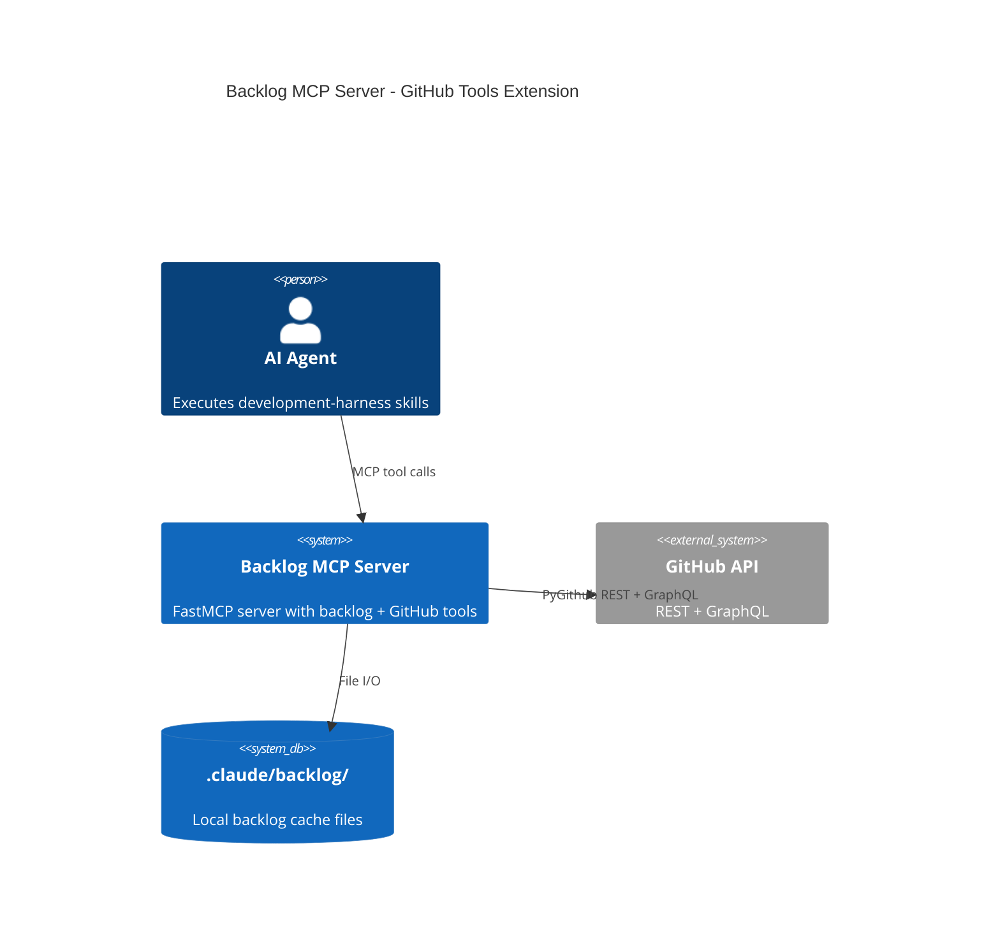
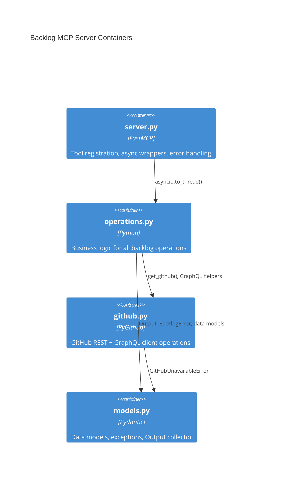
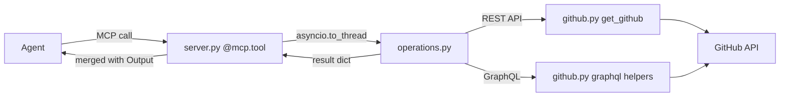
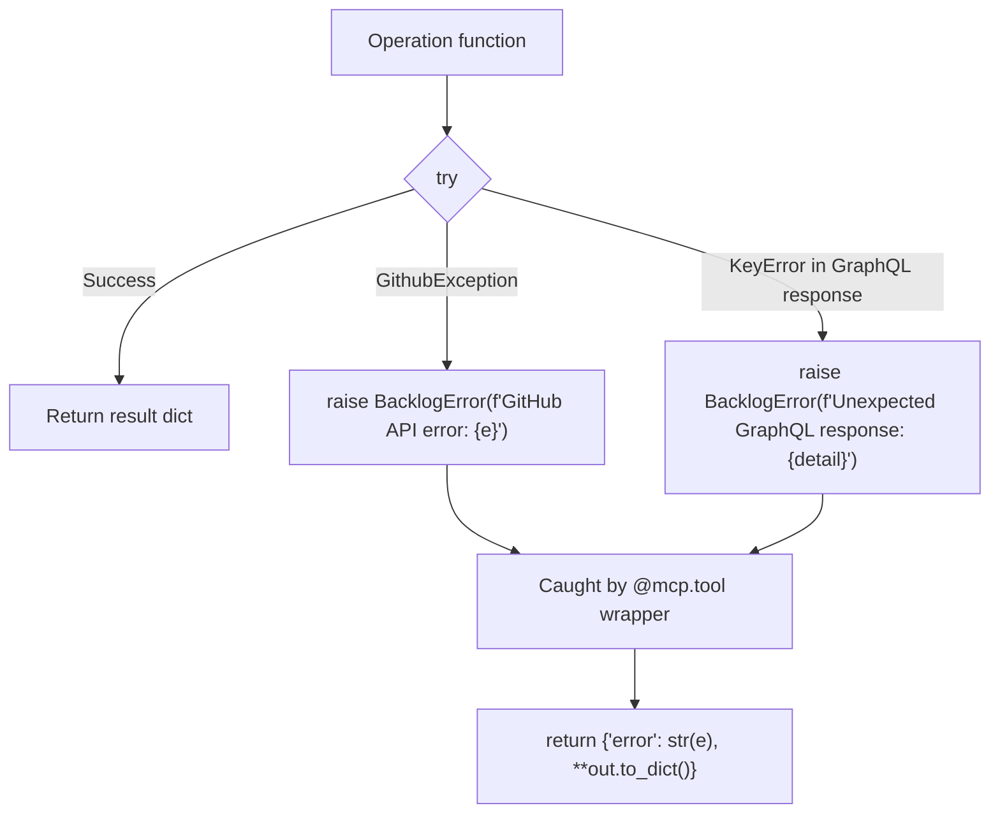

# Architecture Spec: Backlog MCP Server GitHub Tools Extension

## Document Metadata

- **Feature**: Add GitHub API tools to backlog MCP server
- **Date**: 2026-03-20
- **Status**: DRAFT
- **Input**: plan/feature-context-backlog-mcp-github-tools.md, plan/codebase/backlog-mcp-server-patterns.md

---

## 1. Executive Summary

Extend the existing backlog FastMCP server (`plugins/development-harness/backlog_core/`) with new GitHub API tools that replace 38 `gh` CLI references across 12 plugin markdown files. All new tools use PyGithub (already declared) -- no new dependencies, no subprocess calls. The server already handles issue CRUD; this extension adds ancillary operations: issue comments, read-only label listing, milestone CRUD, Projects V2 via GraphQL, and merged PR search.

### Overlap Analysis

Existing tools that already cover requested functionality:

- **`backlog_view`** -- already returns issue details (title, body, state, labels, assignees). Covers the `gh issue view` audit references. No new tool needed.
- **`backlog_close`** -- already closes issues with reason and comment via `close_github_issue()`. Covers `gh issue close` audit references. No new tool needed.
- **`check_open_prs_for_issue()`** -- exists in `github.py` but is NOT exposed as an MCP tool. Needs a thin wrapper, not a new implementation.

### New Tools Required

After overlap elimination, 9 new tools are needed:

| Tool | Category | Replaces |
|------|----------|----------|
| `backlog_comment_issue` | Issues | `gh issue comment` |
| `backlog_list_issues` | Issues | `gh issue list` with filters |
| `backlog_list_labels` | Labels | `gh label list` (read-only) |
| `backlog_list_milestones` | Milestones | `gh api milestones` |
| `backlog_get_soonest_milestone` | Milestones | Custom logic over milestone list |
| `backlog_create_milestone` | Milestones | `gh api -X POST milestones` |
| `backlog_list_projects` | Projects V2 | `gh project list` (GraphQL) |
| `backlog_create_project` | Projects V2 | `gh project create` (GraphQL) |
| `backlog_list_merged_prs` | PRs | `gh pr list --state merged` |

`backlog_link_project` (link project to repo) is dropped -- Projects V2 are linked to orgs/users, not repos. The create mutation already associates the project with the authenticated owner.

## 2. Architecture Overview

### C4 Context Diagram



### C4 Container Diagram



### Data Flow



## 3. Technology Stack

All technologies are already in use by the existing server. No new dependencies.

- **MCP Framework**: FastMCP (existing) -- tool registration, async event loop, parameter schema generation
- **GitHub Client**: PyGithub >=2.8.1 (existing) -- REST API for issues, labels, milestones, PRs
- **GraphQL**: PyGithub's `_requester` for raw GraphQL queries (existing pattern in `_resolve_labels_graphql`) -- Projects V2 has no REST API
- **Data Models**: Pydantic (existing) -- `Output` collector, return dict validation
- **Async**: `asyncio.to_thread()` (existing pattern) -- wraps blocking PyGithub calls
- **Testing**: pytest + pytest-mock + pytest-asyncio (existing) -- mock PyGithub, test tool registration
- **Type Hints**: `Annotated[T, Field(description="...")]` (existing pattern) -- MCP parameter schema

## 4. Component Design

### Module Structure

No new files. All new code goes into existing modules:

- **`server.py`** -- 9 new `@mcp.tool` async functions (thin wrappers)
- **`operations.py`** -- 9 new operation functions (business logic)
- **`github.py`** -- 3 new helpers: `_projects_v2_list_query()`, `_projects_v2_create_mutation()`, `_graphql_request()`
- **`models.py`** -- No changes needed (existing `Output`, `BacklogError` suffice)

### server.py -- Tool Interfaces

All tools follow the established pattern: `@mcp.tool` async function, `Annotated` parameters, `asyncio.to_thread()` to operation, `BacklogError` catch returning error dict.

#### Issues

```python
@mcp.tool
async def backlog_list_issues(
    milestone: Annotated[str | None, Field(description="Filter by milestone title")] = None,
    labels: Annotated[str | None, Field(description="Comma-separated label names to filter by")] = None,
    state: Annotated[str, Field(description="Issue state: open, closed, all")] = "open",
    limit: Annotated[int, Field(description="Maximum issues to return")] = 30,
) -> dict: ...

@mcp.tool
async def backlog_comment_issue(
    issue_number: Annotated[int, Field(description="GitHub issue number")],
    body: Annotated[str, Field(description="Comment body (markdown)")],
) -> dict: ...
```

#### Labels

```python
@mcp.tool
async def backlog_list_labels(
    limit: Annotated[int, Field(description="Maximum labels to return")] = 100,
) -> dict: ...
```

#### Milestones

```python
@mcp.tool
async def backlog_list_milestones(
    state: Annotated[str, Field(description="Milestone state: open, closed, all")] = "open",
) -> dict: ...

@mcp.tool
async def backlog_get_soonest_milestone() -> dict: ...

@mcp.tool
async def backlog_create_milestone(
    title: Annotated[str, Field(description="Milestone title")],
    description: Annotated[str, Field(description="Milestone description")] = "",
    due_on: Annotated[str | None, Field(description="Due date in ISO 8601 format (YYYY-MM-DD)")] = None,
) -> dict: ...
```

#### Projects V2 (GraphQL)

```python
@mcp.tool
async def backlog_list_projects(
    owner: Annotated[str | None, Field(description="GitHub owner (org or user). Defaults to repo owner")] = None,
    limit: Annotated[int, Field(description="Maximum projects to return")] = 20,
) -> dict: ...

@mcp.tool
async def backlog_create_project(
    title: Annotated[str, Field(description="Project title")],
    owner: Annotated[str | None, Field(description="GitHub owner (org or user). Defaults to repo owner")] = None,
) -> dict: ...
```

#### PRs

```python
@mcp.tool
async def backlog_list_merged_prs(
    search: Annotated[str | None, Field(description="Search query (e.g., issue number '#42' or keyword)")] = None,
    limit: Annotated[int, Field(description="Maximum PRs to return")] = 20,
) -> dict: ...
```

### operations.py -- Operation Interfaces

Each operation function follows the established signature pattern:

```python
def list_issues(
    repo: str = DEFAULT_REPO,
    milestone: str | None = None,
    labels: str | None = None,
    state: str = "open",
    limit: int = 30,
    output: Output | None = None,
) -> dict: ...

def comment_issue(
    repo: str = DEFAULT_REPO,
    issue_number: int = 0,
    body: str = "",
    output: Output | None = None,
) -> dict: ...

def list_labels(
    repo: str = DEFAULT_REPO,
    limit: int = 100,
    output: Output | None = None,
) -> dict: ...

def list_milestones(
    repo: str = DEFAULT_REPO,
    state: str = "open",
    output: Output | None = None,
) -> dict: ...

def get_soonest_milestone(
    repo: str = DEFAULT_REPO,
    output: Output | None = None,
) -> dict: ...

def create_milestone(
    repo: str = DEFAULT_REPO,
    title: str = "",
    description: str = "",
    due_on: str | None = None,
    output: Output | None = None,
) -> dict: ...

def list_projects(
    repo: str = DEFAULT_REPO,
    owner: str | None = None,
    limit: int = 20,
    output: Output | None = None,
) -> dict: ...

def create_project(
    repo: str = DEFAULT_REPO,
    title: str = "",
    owner: str | None = None,
    output: Output | None = None,
) -> dict: ...

def list_merged_prs(
    repo: str = DEFAULT_REPO,
    search: str | None = None,
    limit: int = 20,
    output: Output | None = None,
) -> dict: ...
```

### github.py -- New Helper Interfaces

```python
def _graphql_request(repo: Repository, query: str, variables: dict | None = None) -> dict:
    """Execute a GraphQL query using PyGithub's requester.

    Follows the existing _resolve_labels_graphql pattern.
    Raises BacklogError on GraphQL errors.
    """
    ...

def _projects_v2_list_query(owner: str, limit: int = 20) -> tuple[str, dict]:
    """Return (query_string, variables) for listing Projects V2."""
    ...

def _projects_v2_create_mutation(owner_id: str, title: str) -> tuple[str, dict]:
    """Return (mutation_string, variables) for creating a Projects V2 project."""
    ...
```

## 5. Data Architecture

No new Pydantic models required. All tools return plain dicts following the established convention. Below are the return schemas per tool.

### Return Schemas

#### `backlog_list_issues`

```python
{
    "issues": [
        {
            "number": int,
            "title": str,
            "state": str,          # "open" | "closed"
            "labels": list[str],   # label names
            "assignees": list[str], # login names
            "milestone": str | None,
            "created_at": str,     # ISO 8601
            "updated_at": str,
        },
        # ...
    ],
    "count": int,
    "messages": list[str],
    "warnings": list[str],
}
```

#### `backlog_comment_issue`

```python
{
    "issue_number": int,
    "comment_id": int,
    "comment_url": str,
    "messages": list[str],   # ["Comment added to issue #N"]
    "warnings": list[str],
}
```

#### `backlog_list_labels`

```python
{
    "labels": [
        {
            "name": str,
            "color": str,         # hex without #
            "description": str,
        },
        # ...
    ],
    "count": int,
    "messages": list[str],
    "warnings": list[str],
}
```

#### `backlog_list_milestones`

```python
{
    "milestones": [
        {
            "number": int,
            "title": str,
            "state": str,         # "open" | "closed"
            "description": str,
            "due_on": str | None,  # ISO 8601 date
            "open_issues": int,
            "closed_issues": int,
        },
        # ...
    ],
    "count": int,
    "messages": list[str],
    "warnings": list[str],
}
```

#### `backlog_get_soonest_milestone`

```python
{
    "milestone": {              # or None if no open milestones with due dates
        "number": int,
        "title": str,
        "due_on": str,
        "open_issues": int,
        "closed_issues": int,
    } | None,
    "messages": list[str],
    "warnings": list[str],
}
```

#### `backlog_create_milestone`

```python
{
    "milestone_number": int,
    "title": str,
    "url": str,
    "messages": list[str],     # ["Created milestone 'title'"]
    "warnings": list[str],
}
```

#### `backlog_list_projects`

```python
{
    "projects": [
        {
            "id": str,            # GraphQL node ID
            "title": str,
            "number": int,
            "url": str,
            "closed": bool,
            "short_description": str,
        },
        # ...
    ],
    "count": int,
    "messages": list[str],
    "warnings": list[str],
}
```

#### `backlog_create_project`

```python
{
    "project_id": str,          # GraphQL node ID
    "title": str,
    "url": str,
    "number": int,
    "messages": list[str],      # ["Created project 'title'"]
    "warnings": list[str],
}
```

#### `backlog_list_merged_prs`

```python
{
    "pull_requests": [
        {
            "number": int,
            "title": str,
            "merged_at": str,     # ISO 8601
            "author": str,        # login
            "url": str,
            "head_branch": str,
        },
        # ...
    ],
    "count": int,
    "messages": list[str],
    "warnings": list[str],
}
```

### GraphQL Query Designs

#### Projects V2 List Query

```graphql
query ListProjectsV2($owner: String!, $limit: Int!) {
  repositoryOwner(login: $owner) {
    ... on ProjectV2Owner {
      projectsV2(first: $limit, orderBy: {field: UPDATED_AT, direction: DESC}) {
        nodes {
          id
          title
          number
          url
          closed
          shortDescription
        }
      }
    }
  }
}
```

#### Projects V2 Create Mutation

```graphql
mutation CreateProjectV2($ownerId: ID!, $title: String!) {
  createProjectV2(input: {ownerId: $ownerId, title: $title}) {
    projectV2 {
      id
      title
      number
      url
    }
  }
}
```

The `ownerId` is resolved by querying `repositoryOwner(login: $owner) { id }` first. This two-step approach (resolve owner ID, then create) avoids requiring users to know their GraphQL node ID.

## 6. Security Architecture

### Credential Management

- **Token source**: `GITHUB_TOKEN` environment variable (existing pattern via `get_github()`)
- **No new credentials**: All new tools use the same token as existing tools
- **Token scope requirements**: New tools require `repo` scope (already required by existing tools) plus `project` scope for Projects V2 mutations

### Security Checklist

- [x] No subprocess calls -- all operations via PyGithub library
- [x] No `shell=True` -- no subprocess usage at all
- [x] No secrets in logs -- `Output` messages contain operation results, not tokens
- [x] Input validation -- `issue_number` is int (not string), `state` validated against allowed values, `due_on` parsed as ISO date
- [x] Read-only label listing -- label mutation remains exclusive to `state_handler.apply_github_transition()`
- [x] Rate limiting -- PyGithub handles GitHub API rate limits with retry headers; no custom rate limiting needed
- [x] No path traversal -- no file path parameters in new tools

## 7. Testing Architecture

### Test Location

`plugins/development-harness/tests/` -- existing test directory.

### Test Files

- **`test_github_tools_operations.py`** -- unit tests for 9 new operation functions. Mock `get_github()` and PyGithub objects. Test success path, error path, edge cases (empty results, missing milestones, GraphQL errors).
- **`test_github_tools_server.py`** -- integration tests for 9 new MCP tool functions. Mock `operations.*` calls. Verify return dict structure, error dict on `BacklogError`, `Output` messages merged.
- **`test_graphql_helpers.py`** -- unit tests for `_graphql_request()`, `_projects_v2_list_query()`, `_projects_v2_create_mutation()`. Verify query strings, variable substitution, error handling for GraphQL error responses.

### Coverage Requirements

- **Overall**: 80% line and branch coverage (existing `fail_under=80`)
- **Critical paths**: `_graphql_request()` error handling -- 95%+ coverage (GraphQL errors must be caught and wrapped as `BacklogError`)
- **All tools**: success path + error path + edge case (empty results)

### Mock Strategy

```python
# Pattern: mock get_github to return a mock Repository
@pytest.fixture
def mock_repo(mocker: MockerFixture) -> MagicMock:
    repo = MagicMock(spec=Repository)
    mocker.patch("backlog_core.github.get_github", return_value=repo)
    return repo

# Pattern: mock GraphQL requester for Projects V2 tests
@pytest.fixture
def mock_graphql(mocker: MockerFixture, mock_repo: MagicMock) -> MagicMock:
    requester = MagicMock()
    mock_repo._requester = requester
    return requester
```

### Test Markers

```python
@pytest.mark.unit          # operation and helper tests
@pytest.mark.integration   # server tool tests (full async path)
@pytest.mark.asyncio       # all server tool tests (async functions)
```

### Key Test Cases per Tool

- **`list_issues`**: filters by milestone, filters by labels, handles empty results, respects limit
- **`comment_issue`**: creates comment, returns comment ID/URL, raises on invalid issue number
- **`list_labels`**: returns all labels, respects limit
- **`list_milestones`**: filters by state, returns sorted by due date
- **`get_soonest_milestone`**: returns earliest due date, returns None when no milestones have due dates
- **`create_milestone`**: creates with all fields, creates with minimal fields, raises on duplicate title
- **`list_projects`**: returns projects from GraphQL, handles owner resolution, handles empty results
- **`create_project`**: resolves owner ID then creates, returns project details, raises on GraphQL error
- **`list_merged_prs`**: filters by search query, returns only merged PRs, respects limit

## 8. Distribution Architecture

This is an extension to an existing FastMCP server within a plugin -- not a standalone tool.

- **Distribution**: Part of the `development-harness` plugin (`plugins/development-harness/`)
- **Entry point**: Existing `backlog_core/server.py` -- no new entry points
- **Dependencies**: No new dependencies. PyGithub, FastMCP, and Pydantic are already declared in the plugin's `pyproject.toml`
- **No PEP 723**: Not applicable (not a standalone script)

## 9. Architectural Decisions (ADRs)

### ADR-001: Extend existing modules rather than creating new files

**Decision**: Add new operations to `operations.py`, new tools to `server.py`, new helpers to `github.py`.

**Alternatives considered**: (A) New file `github_tools.py` for all new operations, (B) new file per category (`milestones.py`, `projects.py`).

**Rationale**: The existing server has 14 tools in `server.py` and corresponding operations in `operations.py`. Adding 9 more keeps both files under 500 lines. Splitting prematurely fragments the import graph and makes the existing pattern (`asyncio.to_thread(operations.X)`) harder to follow. If the file grows beyond 500 lines in the future, extract by category then.

### ADR-002: Raw GraphQL via PyGithub's requester for Projects V2

**Decision**: Use `repo._requester` to execute raw GraphQL queries for Projects V2 operations.

**Alternatives considered**: (A) Add `gql` or `sgqlc` as a new dependency, (B) use `httpx` with GitHub's GraphQL endpoint directly.

**Rationale**: PyGithub's `_requester` is already used in `_resolve_labels_graphql` for label resolution. Adding a new dependency violates the "no new dependencies" constraint. Using `httpx` bypasses PyGithub's auth handling and error wrapping. The `_requester` approach is proven in the codebase and handles auth, rate limits, and error responses consistently.

### ADR-003: Drop `backlog_link_project` tool

**Decision**: Do not implement a "link project to repo" tool.

**Alternatives considered**: Implement via `linkProjectV2ToRepository` GraphQL mutation.

**Rationale**: Projects V2 are owned by organizations or users, not repositories. The `createProjectV2` mutation creates the project under the owner's scope; it does not need to be "linked" to a specific repo. The `gh project link` CLI command exists but is a convenience wrapper around adding the repo as a field value in the project -- this is project-specific configuration, not a general-purpose operation. Agents that need this can add items to the project after creation.

### ADR-004: Read-only label listing only

**Decision**: `backlog_list_labels` is read-only. No create/update/delete label tools.

**Alternatives considered**: Full label CRUD.

**Rationale**: The feature context explicitly states that `state_handler.apply_github_transition()` is the canonical owner of label mutations. Adding label mutation tools would create a competing write path. Read-only listing satisfies the audit requirement (`gh label list`) without violating this ownership boundary.

### ADR-005: Milestone filtering by title in `list_issues` uses PyGithub milestone lookup

**Decision**: The `milestone` parameter in `backlog_list_issues` accepts a milestone title string, which the operation resolves to a milestone number via `repo.get_milestones()` before passing to `repo.get_issues(milestone=...)`.

**Alternatives considered**: (A) Accept milestone number directly, (B) accept both title and number.

**Rationale**: Agents work with milestone titles (human-readable), not numbers. The two-step lookup (title to number, then filter) costs one extra API call but provides a natural interface. PyGithub's `get_issues()` requires a `Milestone` object, not a title string, so the lookup is necessary regardless.

## 10. Scalability Strategy

### Async Pattern

All new tools follow the existing pattern: `asyncio.to_thread()` wrapping synchronous PyGithub calls. PyGithub is not async-native; `to_thread()` prevents blocking the FastMCP event loop.

```python
# Existing pattern -- all new tools follow this exactly
@mcp.tool
async def backlog_new_tool(param: Annotated[str, Field(...)]) -> dict:
    out = Output()
    try:
        result = await asyncio.to_thread(operations.new_operation, param=param, output=out)
        return {**result, **out.to_dict()}
    except BacklogError as e:
        return {"error": str(e), **out.to_dict()}
```

### Resource Management

- **PyGithub client**: Created per-call via `get_github()`. PyGithub handles connection pooling internally via `urllib3`. No connection lifecycle management needed.
- **GraphQL requests**: Use the same `_requester` from the PyGithub `Repository` object -- no separate HTTP client.
- **Rate limits**: PyGithub reads `X-RateLimit-Remaining` headers. When rate-limited, it raises `RateLimitExceededException` which inherits from `GithubException`. Operations catch `GithubException` and wrap as `BacklogError`.
- **Pagination**: PyGithub returns `PaginatedList` objects. Operations iterate up to `limit` items using `get_page()` or slicing, avoiding unbounded iteration.
- **Timeout**: Existing 15-second timeout on `get_github()` applies to all new operations.

### Error Handling per Operation Type



- **REST operations** (issues, labels, milestones, PRs): Catch `GithubException`, wrap as `BacklogError`
- **GraphQL operations** (Projects V2): Catch `GithubException` from requester + validate response structure (check for `errors` key in GraphQL response), wrap both as `BacklogError`
- **Validation errors** (invalid state value, invalid date format): Raise `ValidationError` (subclass of `BacklogError`) before making API call
