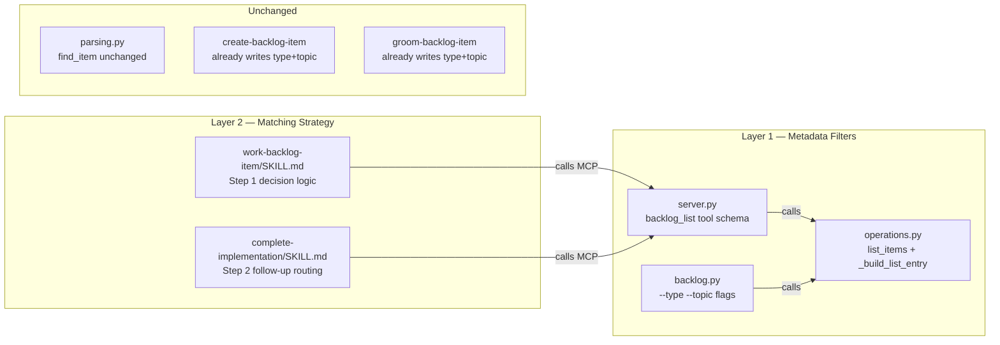
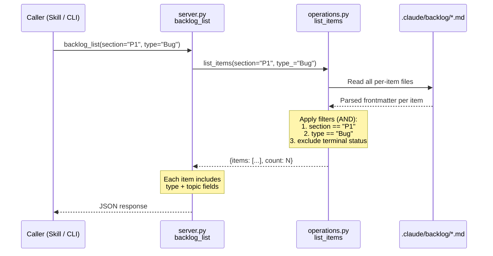
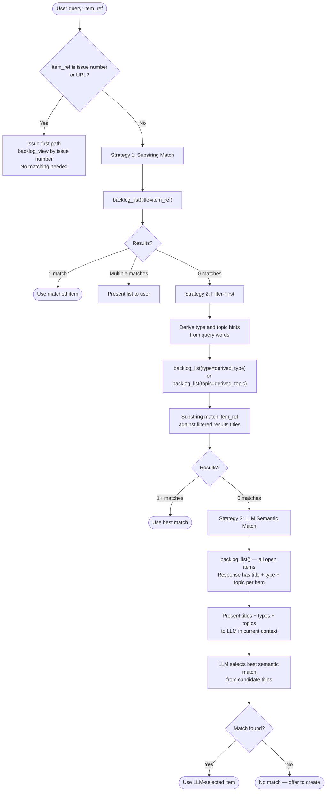
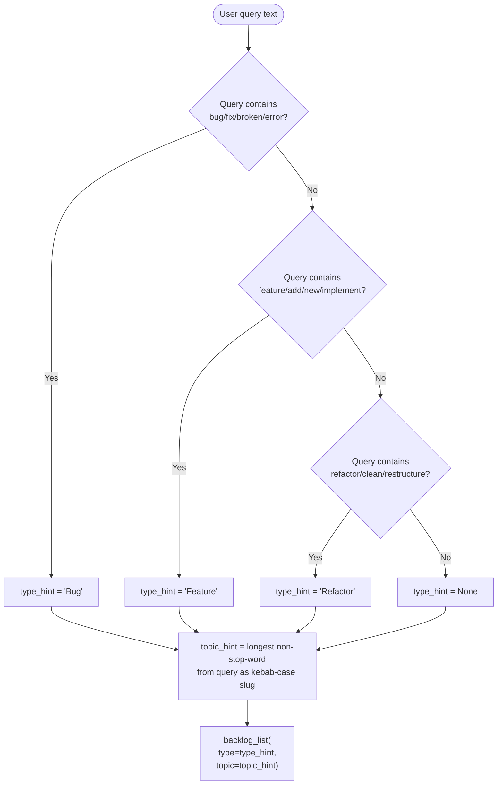
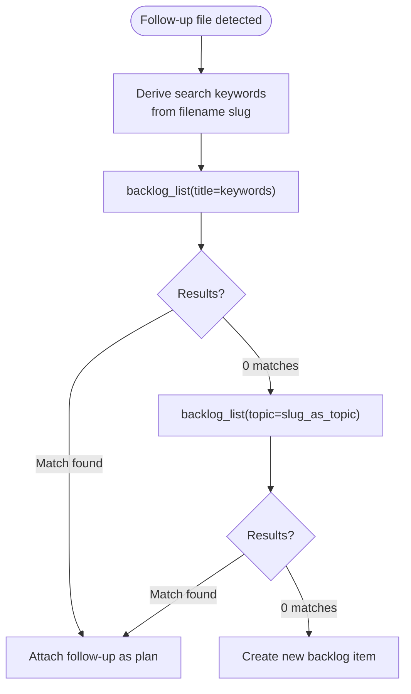
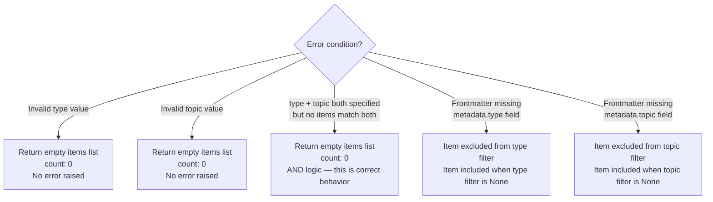
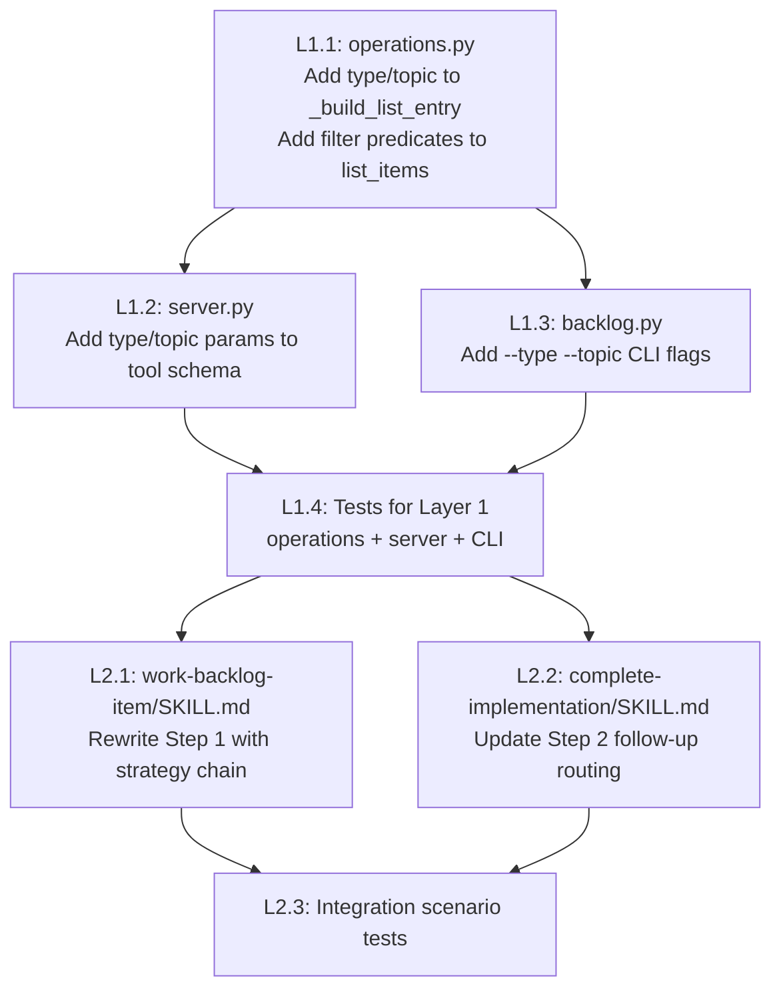

# Architecture Spec — Backlog Semantic Matching (Layers 1 & 2)

## 1. Data Model Changes

### 1.1 Response Schema Extension

`_build_list_entry()` in `operations.py` currently returns:

```python
{
    "title": str,
    "priority": str,
    "section": str,
    "issue": str | None,
    "plan": str | None,
    "groomed": bool,
    "file_path": str,
    "status": str
}
```

Add two fields:

```python
{
    # ... existing fields unchanged ...
    "type": str | None,    # from metadata.type (Feature|Bug|Refactor|Docs|Chore)
    "topic": str | None,   # from metadata.topic (kebab-case slug)
}
```

Both fields are optional in the response. If frontmatter lacks `metadata.type` or `metadata.topic`, the field value is `None`. No items are excluded for missing fields.

### 1.2 No Schema Changes to Per-Item Files

`metadata.type` and `metadata.topic` already exist in frontmatter. No migration needed. No new fields introduced.

---

## 2. Interface Changes

### 2.1 MCP Tool Schema: `backlog_list`

Add two optional parameters to the tool registration in `server.py`:

```python
async def backlog_list(
    # ... existing parameters unchanged ...
    type: str | None = None,     # NEW: filter by metadata.type
    topic: str | None = None,    # NEW: filter by metadata.topic
) -> dict
```

Parameter behavior:

- `type` — exact match against `metadata.type` (case-insensitive). Valid values: `Feature`, `Bug`, `Refactor`, `Docs`, `Chore`. Invalid values return zero results (no error).
- `topic` — substring match against `metadata.topic` (case-insensitive). Allows partial topic slugs (e.g., `"backlog"` matches `"backlog-cli"`, `"backlog-matching"`).
- Both compose with existing filters via AND logic. `backlog_list(section="P1", type="Bug")` returns P1 bugs only.
- Omitting both preserves current behavior exactly.

### 2.2 CLI: `backlog.py list`

Add two Typer options:

```python
@app.command()
def list(
    # ... existing options unchanged ...
    type: str | None = typer.Option(None, "--type", help="Filter by item type"),
    topic: str | None = typer.Option(None, "--topic", help="Filter by topic slug"),
):
```

Pass through to `list_items()` call. Output format unchanged.

### 2.3 SKILL.md Changes (Layer 2)

`/work-backlog-item` Step 1 gains a matching strategy decision tree. `/complete-implementation` Step 2 follow-up routing gains the same. These are SKILL.md instruction changes, not Python code. See Section 4 for the decision logic.

---

## 3. Module Boundaries

### Files That Change



### Responsibility per File

- **`operations.py`** — Reads `metadata.type` and `metadata.topic` from frontmatter during `list_items()`. Applies filter predicates. Includes both fields in `_build_list_entry()` output. This is the only file that touches filtering logic.
- **`server.py`** — Declares `type` and `topic` parameters in tool schema. Passes them to `list_items()`. No filtering logic here.
- **`backlog.py`** — Declares `--type` and `--topic` CLI options. Passes them to `list_items()`. No filtering logic here.
- **`work-backlog-item/SKILL.md`** — Step 1 instructions rewritten with strategy fallback chain (see Section 4).
- **`complete-implementation/SKILL.md`** — Step 2 follow-up routing updated to use filter-first strategy before substring.

### Files NOT Changed

- **`parsing.py`** — `find_item()` is used by `backlog_view`, `backlog_update`, `backlog_close`, `backlog_resolve`, `backlog_groom`. These resolve a single item by selector (issue number, URL, or title substring). They do not need semantic matching. `find_item()` remains unchanged.
- **`create-backlog-item/SKILL.md`** — Already writes `metadata.type` and `metadata.topic` at creation. No change needed.
- **`groom-backlog-item/SKILL.md`** — Already writes `metadata.type` during grooming. No change needed.

---

## 4. Call Flows

### 4.1 Layer 1: Filter Query Flow



### 4.2 Layer 2: Matching Strategy Decision (work-backlog-item Step 1)

This is orchestrator decision logic expressed in SKILL.md instructions, not Python code.



### 4.3 Strategy 2 — Type and Topic Derivation

The SKILL.md instructions guide the orchestrator to derive filter hints from the user's query:



This derivation is heuristic and best-effort. The orchestrator (an LLM) performs this reasoning naturally from the SKILL.md instructions without requiring Python code.

### 4.4 Strategy 3 — LLM Semantic Match (Token Budget)

`backlog_list` returns title + type + topic per item (no descriptions). For 245 items:

- Average title: ~60 chars
- Type: ~8 chars
- Topic: ~20 chars
- Per item: ~100 chars = ~25 tokens
- Total: 245 items x 25 tokens = **~6,125 tokens**

This fits comfortably in a single LLM context window. The orchestrator can read all 245 item summaries and semantically match without loading any descriptions.

If descriptions are needed for disambiguation, the orchestrator reads individual per-item files for the top candidates (2-5 items) via `backlog_view`. This keeps token cost proportional to match ambiguity, not corpus size.

### 4.5 complete-implementation Follow-up Routing



Follow-up routing uses only Strategies 1 and 2 (substring then filter-first). Strategy 3 (LLM semantic) is not used here because follow-up filenames are machine-derived slugs, not human semantic queries. Substring and topic filtering are sufficient.

---

## 5. Backward Compatibility Contract

### Hard Guarantees

1. **Parameter defaults** — All new parameters (`type`, `topic`) default to `None`. Callers that pass no new parameters see identical behavior and identical response shape (new fields are additive).

2. **Response shape** — Existing fields (`title`, `priority`, `section`, `issue`, `plan`, `groomed`, `file_path`, `status`) retain identical types and semantics. `type` and `topic` are added alongside them.

3. **Filter composition** — Adding `type` or `topic` to a query with existing filters narrows results (AND logic). It never broadens results or changes the meaning of existing filters.

4. **Substring matching unchanged** — `title` parameter continues to perform case-insensitive substring matching in `operations.py`. The matching strategy fallback chain lives in SKILL.md instructions, not in `operations.py`. The Python function remains a pure filter.

5. **CLI backward compatible** — Existing CLI invocations without `--type` or `--topic` produce identical output.

### What Changes for Existing Callers

- Response JSON includes two new optional fields (`type`, `topic`). Callers that destructure specific fields are unaffected. Callers that iterate all fields see two new keys.
- No existing field is removed, renamed, or retyped.

---

## 6. Error Handling

### 6.1 Filter Errors



Rationale: Invalid filter values are not errors — they are queries that match nothing. This matches existing behavior where `title="nonexistent"` returns zero results without raising.

### 6.2 Matching Strategy Errors (SKILL.md Level)

| Scenario | Strategy 1 | Strategy 2 | Strategy 3 | Final Outcome |
|----------|-----------|-----------|-----------|---------------|
| Exact title match exists | Returns 1 item | Not reached | Not reached | Use matched item |
| Synonym query, same topic | 0 results | Filters narrow, substring hits | Not reached | Use filter-first match |
| Semantic query, no keyword overlap | 0 results | 0 results (no hints derivable) | LLM picks from all titles | Use LLM-selected item |
| Completely unrelated query | 0 results | 0 results | LLM finds no match | Offer to create new item |

### 6.3 Items Missing type or topic Fields

When `backlog_list` is called without `type` or `topic` filters, items with missing fields are included normally (fields show as `null` in response). When a filter is active, items missing that field are excluded from results. This means:

- Strategy 1 (substring) is unaffected by field population rate
- Strategy 2 (filter-first) effectiveness scales with field population rate
- Strategy 3 (LLM semantic) uses whatever fields are available per item

No backfill migration is required for Layers 1-2 to function. Items without `type`/`topic` are reachable via Strategies 1 and 3.

---

## 7. Testing Strategy

### 7.1 Layer 1 Tests

**File:** `.claude/skills/backlog/tests/test_backlog_core_operations.py` (extend existing)

| Test | Acceptance Criterion | Assertion |
|------|---------------------|-----------|
| `test_list_items_type_filter` | `backlog_list(type="Bug")` returns only bugs | All returned items have `type == "Bug"` |
| `test_list_items_topic_filter` | `backlog_list(topic="backlog-cli")` returns matching items | All returned items have `"backlog-cli"` as substring of `topic` |
| `test_list_items_type_topic_compose` | Filters compose with AND logic | `backlog_list(section="P1", type="Feature")` returns only P1 features |
| `test_list_items_response_includes_type_topic` | Response entries include type and topic | Each item dict has `"type"` and `"topic"` keys |
| `test_list_items_backward_compatible` | No new params = identical behavior | `backlog_list()` result matches pre-change result |
| `test_list_items_missing_type_included` | Items without `metadata.type` included when no type filter | Item with no type appears in unfiltered results |
| `test_list_items_missing_type_excluded` | Items without `metadata.type` excluded when type filter active | Item with no type does not appear in `type="Bug"` results |
| `test_list_items_invalid_type_empty` | Invalid type returns empty | `backlog_list(type="InvalidType")` returns `{items: [], count: 0}` |

**File:** `.claude/skills/backlog/tests/test_backlog_core_server.py` (extend existing)

| Test | Assertion |
|------|-----------|
| `test_backlog_list_type_param_schema` | MCP tool schema includes `type` parameter |
| `test_backlog_list_topic_param_schema` | MCP tool schema includes `topic` parameter |
| `test_backlog_list_type_passthrough` | `type` parameter passes through to `list_items()` |

### 7.2 Layer 2 Tests

Layer 2 matching strategy is SKILL.md instruction logic executed by the orchestrator, not Python code. Testing is via integration scenarios.

**File:** `.claude/skills/backlog/tests/test_scenarios.py` (extend existing)

| Test | Acceptance Criterion | Setup | Assertion |
|------|---------------------|-------|-----------|
| `test_semantic_match_synonym_query` | "fix login issue" finds "Authentication failure on SSO redirect" | Create two items: one with matching topic, one without | Correct item found via Strategy 2 or 3 |
| `test_substring_match_takes_priority` | Substring matches returned before semantic | Create item with exact title substring | Strategy 1 returns immediately |
| `test_filter_first_narrows_candidates` | Type filter reduces candidate set | Create 5 items: 2 bugs, 3 features | `type="Bug"` + substring finds correct bug |

### 7.3 Backward Compatibility Tests

**File:** `.claude/skills/backlog/tests/test_integration_reconciliation.py` (extend existing)

| Test | Assertion |
|------|-----------|
| `test_existing_callers_unaffected` | Calls with only existing parameters produce same results as before |
| `test_response_shape_additive_only` | New fields present but no existing fields changed |

---

## 8. Implementation Order



L1.1, L1.2, L1.3 can be implemented in parallel (they touch different files). L1.4 tests verify Layer 1 before Layer 2 begins. L2.1 and L2.2 can be implemented in parallel.

---

## References

- Feature context: [plan/feature-context-backlog-semantic-matching.md](./feature-context-backlog-semantic-matching.md)
- Codebase analysis: [plan/codebase/backlog-matching-patterns.md](./codebase/backlog-matching-patterns.md)
- Impact radius: [.claude/reports/groom-745-impact-radius.md](../.claude/reports/groom-745-impact-radius.md)
- Backlog item schema: `.claude/skills/backlog/references/item-schema.md`
- MCP server: `.claude/skills/backlog/backlog_core/server.py`
- Operations: `.claude/skills/backlog/backlog_core/operations.py`
- CLI: `.claude/skills/backlog/scripts/backlog.py`
