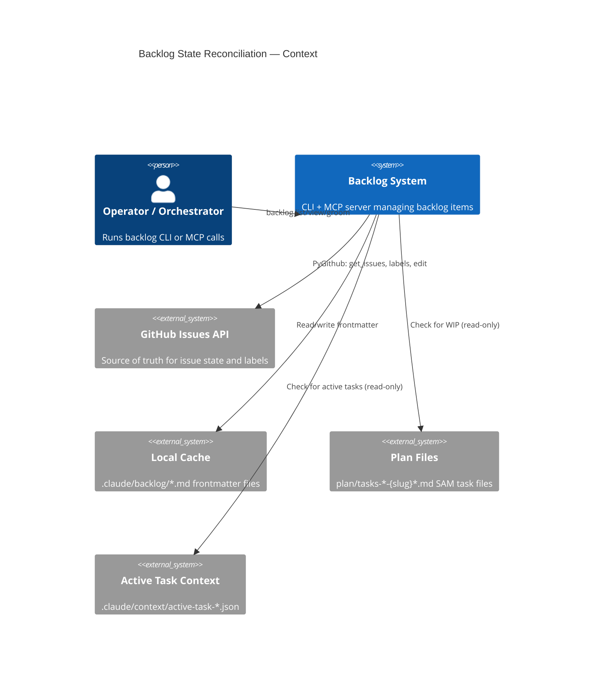
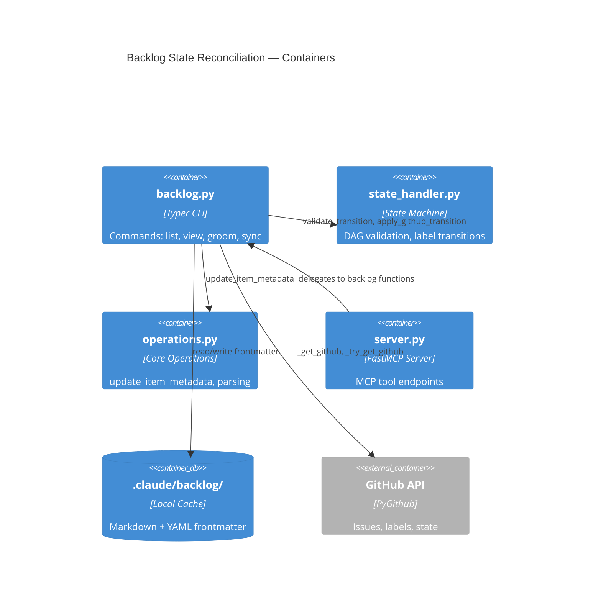
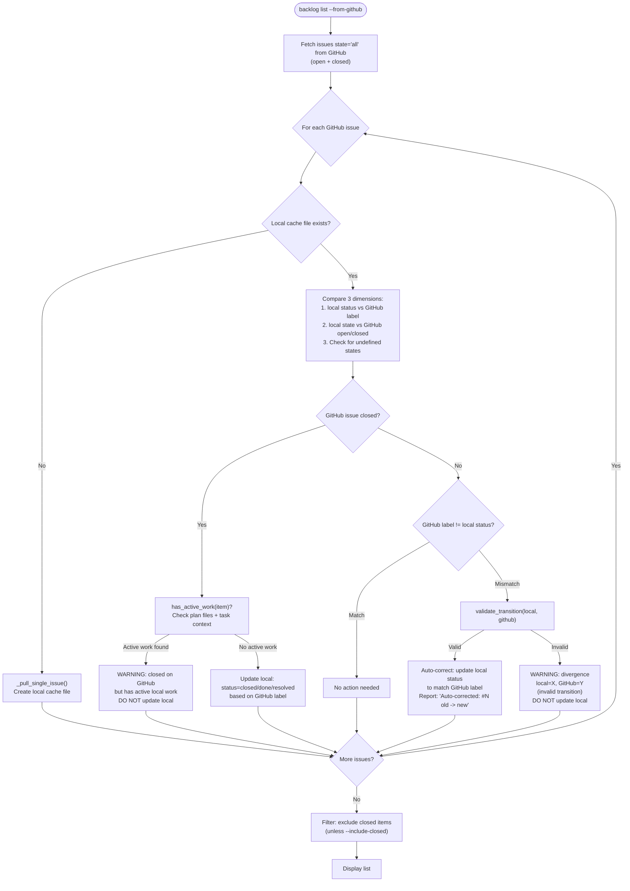

# Architecture Spec: Backlog State Reconciliation

**Issue**: #714
**Date**: 2026-03-14
**Status**: COMPLETE
**Input Documents**:
- [Feature Context](./feature-context-backlog-state-reconciliation.md)
- [Codebase Patterns](./codebase/backlog-state-patterns.md)
- [State Machine Analysis](../.claude/reports/backlog-state-machine-analysis-20260314.md)

---

## 1. Executive Summary

The backlog system has three state dimensions (local frontmatter, GitHub `status:*` labels, GitHub issue state open/closed) that drift apart silently. This architecture adds a reconciliation layer that:

1. **Detects divergence** between local cache and GitHub on every `--from-github` read operation.
2. **Auto-corrects DAG-valid divergences** by persisting the GitHub-authoritative state to local frontmatter.
3. **Flags invalid divergences** (transitions not in `VALID_TRANSITIONS`) as warnings without modifying local state.
4. **Protects work-in-progress items** from premature closure by checking for active plan files and task context before accepting closed state from GitHub.
5. **Fixes the grooming bug** so `backlog groom` atomically transitions labels via `apply_github_transition()` and updates local frontmatter.
6. **Excludes closed items** from default `backlog list` output; adds `--include-closed` flag.

All changes are confined to three existing files: `backlog.py` (CLI), `state_handler.py` (state machine), and `server.py` (MCP). No new files are created. The reconciliation functions are added to `backlog.py` as private helpers following existing conventions.

**Design Decisions Resolved**:

| Question | Decision | Rationale |
|----------|----------|-----------|
| Reconciliation trigger | `--from-github` only (Option A) | Default list stays local-only, fast, offline-capable. GitHub API calls only on explicit request. |
| WIP protection signals | Plan file with IN PROGRESS task OR active-task context file (Option C) | Plan file existence alone is too broad (completed plans block closures). Active-task context files indicate live work. |
| Auto-correction persistence | Persist to local file (Option A) | Prevents redundant re-detection on every read. Uses existing `_update_item_metadata()` pattern. |
| Migration of 58 "open" items | Separate task (Option B) | Reconciliation detects and flags undefined states. One-time migration is a distinct deliverable. |
| Grooming fix | Co-delivery (Option B) | Root cause of divergence; fixing it prevents new divergences during reconciliation development. |

## 2. Architecture Overview

### Context Diagram



### Container Diagram



### Data Flow: Reconciliation on `--from-github`



## 3. Technology Stack

No new dependencies. All changes use the existing stack:

| Component | Technology | Justification |
|-----------|-----------|---------------|
| CLI Framework | Typer (existing) | All new flags (`--include-closed`) follow existing Annotated syntax |
| GitHub API | PyGithub (existing) | `_get_github()` / `_try_get_github()` patterns already established |
| State Machine | `state_handler.py` (existing) | `validate_transition()` and `apply_github_transition()` are the canonical interfaces |
| Local Cache | YAML frontmatter (existing) | `_update_item_metadata()` is the canonical write path |
| MCP Server | FastMCP (existing) | New parameters propagate through `asyncio.to_thread` delegation |
| Testing | pytest + pytest-mock (existing) | Autouse `_isolate_backlog_dir` fixture pattern for new tests |

## 4. Component Design

All new functions are added to existing files. No new modules.

### 4.1 `backlog.py` — New Private Functions

#### `_reconcile_item()` — Core Reconciliation Logic

```python
def _reconcile_item(
    item: dict,
    gh_issue_map: dict[int, Any],  # {issue_number: PyGithub Issue object}
    repo: str,
) -> ReconcileResult:
    """Compare local cache state against GitHub for a single item.

    Determines sync direction using VALID_TRANSITIONS DAG:
    - DAG-valid divergence: auto-correct local to match GitHub (persist)
    - Invalid divergence: flag as warning, do not modify local
    - GitHub closed + no WIP: update local to terminal state
    - GitHub closed + WIP detected: warn, do not modify local

    Args:
        item: Parsed backlog item dict (from parse_backlog).
        gh_issue_map: Pre-fetched GitHub issues keyed by number.
        repo: Repository slug for GitHub API calls.

    Returns:
        ReconcileResult with action taken and any warnings.
    """
    ...
```

**Dependencies**: `state_handler.validate_transition`, `_update_item_metadata`, `_has_active_work`

**Error handling**: Soft fail -- if GitHub issue not in map (e.g., deleted), skip with warning. Never raises.

#### `_has_active_work()` — WIP Detection

```python
def _has_active_work(item: dict) -> tuple[bool, str]:
    """Check if an item has active local work that should block auto-closure.

    Checks two signals:
    1. Plan files: glob for plan/tasks-*-{topic}*.md, then parse for any
       task with status IN PROGRESS.
    2. Active task context: glob for .claude/context/active-task-*.json,
       check if any references this item's issue number.

    Args:
        item: Parsed backlog item dict. Uses _topic and _issue fields.

    Returns:
        Tuple of (has_work: bool, reason: str).
        reason is empty string if has_work is False,
        otherwise describes what was found (e.g., "plan file plan/tasks-3-foo.md
        has IN PROGRESS task 2.1").
    """
    ...
```

**Dependencies**: `pathlib.Path.glob`, `json.loads` (for context files), task file parsing (regex for `**Status**: IN PROGRESS`)

**Error handling**: File read errors return `(False, "")` -- missing files mean no active work.

#### `_reconcile_batch()` — Batch Reconciliation

```python
def _reconcile_batch(
    items: list[dict],
    repo: str,
) -> tuple[list[dict], list[str]]:
    """Reconcile all items against GitHub state.

    Fetches all issues (state="all") in one API call, then reconciles
    each local item against the GitHub issue map.

    Args:
        items: All parsed backlog items from local cache.
        repo: Repository slug.

    Returns:
        Tuple of (updated_items, warnings).
        updated_items: items list with local status corrections applied.
        warnings: list of human-readable warning strings for divergences.
    """
    ...
```

**Dependencies**: `_try_get_github`, `_reconcile_item`, `repo.get_issues(state="all")`

**Error handling**: If GitHub unavailable (`_try_get_github` returns None), return items unchanged with single warning "GitHub unavailable -- skipping reconciliation".

#### `_filter_closed_items()` — Closed Item Exclusion

```python
def _filter_closed_items(
    items: list[dict],
    include_closed: bool,
) -> list[dict]:
    """Filter out items whose local status is a terminal state.

    Terminal states: done, resolved, closed.

    Args:
        items: Parsed backlog items.
        include_closed: If True, return all items unfiltered.

    Returns:
        Filtered list (or original list if include_closed=True).
    """
    ...
```

**Dependencies**: `BacklogState.DONE`, `BacklogState.RESOLVED`, `BacklogState.CLOSED`

### 4.2 `backlog.py` — Modified Existing Functions

#### `_refresh_local_cache_from_github()` — Fetch `state="all"`

**Current**: `repo_obj.get_issues(state="open")`
**Change**: `repo_obj.get_issues(state="all")`

This is the root cause fix for AC#2. Closed issues will now be fetched and their local cache files updated.

Within this function, after fetching all issues, call `_reconcile_batch()` to detect and resolve divergences before returning.

#### `_batch_fetch_statuses()` — Fetch `state="all"`

**Current**: `repo_obj.get_issues(state="open")`
**Change**: `repo_obj.get_issues(state="all")`

This fixes AC#3 (non-blank status for every linked item). Closed issues will now appear in the status map with their terminal state label.

#### `backlog_groom()` / `_write_groomed_to_item_file()` — Atomic Transition

**Current behavior (buggy)**:
1. `issue.remove_from_labels("status:needs-grooming")` -- removes label
2. No replacement label added
3. Local frontmatter `status` unchanged

**New behavior**:
1. Call `apply_github_transition(repo, issue, "needs-grooming", "groomed")` -- atomic label swap
2. Call `_update_item_metadata(filepath, {"metadata": {"status": "groomed"}}, set_synced=True)` -- update local

This follows the same pattern used by `_apply_status_in_progress()`, `backlog close`, and `backlog resolve`.

#### `list_items()` CLI Command — New `--include-closed` Flag

```python
def list_items(
    # ... existing parameters ...
    include_closed: Annotated[
        bool,
        typer.Option("--include-closed", help="Include items with closed/done/resolved status"),
    ] = False,
) -> None:
    ...
```

After parsing items and optionally reconciling (if `--from-github`), apply `_filter_closed_items(items, include_closed)` before rendering output.

### 4.3 `state_handler.py` — New Helper

#### `is_terminal_state()` — Terminal State Check

```python
def is_terminal_state(state: str) -> bool:
    """Check if a state is terminal (no valid outgoing transitions).

    Args:
        state: State value string.

    Returns:
        True if state is done, resolved, or closed.
    """
    ...
```

This is a pure function (no I/O). Used by `_filter_closed_items()` and `_reconcile_item()`.

#### `find_valid_path()` — Multi-Hop Transition Check

```python
def find_valid_path(from_state: str, to_state: str) -> list[str] | None:
    """Find a valid path through the DAG from from_state to to_state.

    Used by reconciliation to determine if a divergence is reachable
    (even if not a direct single-hop transition). If reachable, the
    divergence is DAG-valid and can be auto-corrected by setting
    local status directly to the GitHub state (skipping intermediates,
    since GitHub is source of truth).

    Args:
        from_state: Current local state.
        to_state: Target state (from GitHub label).

    Returns:
        List of states in the path (including from and to), or None
        if no valid path exists (invalid divergence).
    """
    ...
```

This uses BFS on `VALID_TRANSITIONS`. Pure function, no I/O. Needed because `validate_transition()` only checks single-hop validity, but a divergence like `needs-grooming` -> `in-progress` is reachable via `needs-grooming -> groomed -> in-milestone -> in-progress`.

### 4.4 `server.py` — MCP Interface Updates

#### `backlog_list` Tool — New `include_closed` Parameter

```python
@mcp.tool()
async def backlog_list(
    # ... existing parameters ...
    include_closed: bool = False,
) -> dict:
    """List backlog items. Excludes closed items unless include_closed=True."""
    ...
```

Passes `include_closed` through to the underlying `list_items()` function via `asyncio.to_thread`.

### 4.5 Data Types

#### `ReconcileResult` — Reconciliation Outcome

```python
@dataclass
class ReconcileResult:
    """Result of reconciling a single item."""
    issue_number: int
    action: str  # "auto_corrected" | "flagged_divergence" | "wip_protected" | "closed" | "no_change"
    old_status: str
    new_status: str
    warning: str  # Empty if no warning; human-readable if warning/flag
```

Defined in `backlog.py` (module-level, near existing dataclasses).

### 4.6 Integration Points

```mermaid
flowchart TD
    subgraph "backlog list"
        L1[Parse local cache] --> L2{--from-github?}
        L2 -->|Yes| L3["_refresh_local_cache_from_github()<br>now fetches state='all'<br>calls _reconcile_batch()"]
        L3 --> L4
        L2 -->|No| L4["_filter_closed_items(items, include_closed)"]
        L4 --> L5{--with-status?}
        L5 -->|Yes| L6["_batch_fetch_statuses()<br>now fetches state='all'"]
        L5 -->|No| L7[Render output]
        L6 --> L7
    end

    subgraph "backlog view"
        V1[Parse single item] --> V2{Has _issue?}
        V2 -->|Yes| V3["_fetch_item_status() (existing)<br>+ single-item reconcile check"]
        V2 -->|No| V4[Render local-only]
        V3 --> V4
    end

    subgraph "backlog groom"
        G1[RT-ICA decision] --> G2{APPROVED?}
        G2 -->|Yes| G3["apply_github_transition(repo, issue,<br>'needs-grooming', 'groomed')"]
        G3 --> G4["_update_item_metadata(filepath,<br>{'metadata': {'status': 'groomed'}},<br>set_synced=True)"]
        G2 -->|No / BLOCKED| G5[Existing blocked path]
    end
```



### 4.7 Warning Output Format

All warnings use `typer.echo(..., err=True)` to stderr. Format:

```text
WARNING: #{issue_number} divergence: local={local_status}, GitHub={github_status} (invalid transition)
WARNING: #{issue_number} closed on GitHub but has active work: {reason}
Auto-corrected: #{issue_number} {old_status} -> {new_status}
```

Warnings are collected during reconciliation and emitted after the batch completes, before rendering the list output. This prevents warnings from interleaving with JSON or table output.

## 5. Data Architecture

### Frontmatter Schema (Existing, No Changes)

The local cache frontmatter schema is unchanged. The `status` field already exists; reconciliation writes valid `BacklogState` values to it via `_update_item_metadata()`.

```yaml
# .claude/backlog/{priority}-{slug}.md
---
name: "Item title"
description: "Item description"
metadata:
  priority: P1
  status: groomed          # BacklogState enum value (was often "open" -- undefined)
  source: user
  added: '2026-01-15'
  type: Feature
  topic: my-feature
  issue: '#427'
  plan: plan/tasks-3-my-feature.md
  groomed: '2026-02-01'
  last_synced: '2026-03-14T10:00:00Z'
---
```

### ReconcileResult Dataclass

```python
from dataclasses import dataclass

@dataclass
class ReconcileResult:
    issue_number: int
    action: str      # Literal["auto_corrected", "flagged_divergence", "wip_protected", "closed", "no_change"]
    old_status: str  # Previous local status value
    new_status: str  # New local status value (same as old if no change)
    warning: str     # Human-readable warning, empty string if none
```

### Three-Dimensional State Comparison

Reconciliation compares three dimensions per item:

| Dimension | Source | Field | Possible Values |
|-----------|--------|-------|-----------------|
| Local status | `.claude/backlog/*.md` frontmatter | `metadata.status` | Any string (including undefined "open") |
| GitHub label | GitHub Issue labels | `status:*` prefix | 8 canonical `BacklogState` values or absent |
| GitHub state | GitHub Issue API | `Issue.state` | `"open"` or `"closed"` |

### Reconciliation Decision Matrix

| Local Status | GitHub Label | GitHub State | Action |
|-------------|-------------|-------------|--------|
| X | `status:X` | open | No change |
| X | `status:Y` (X->Y valid path) | open | Auto-correct local to Y |
| X | `status:Y` (no valid path) | open | Warn: invalid divergence |
| X | `status:Y` | closed | Check WIP, then auto-correct or warn |
| X | (no label) | open | Warn: stateless void |
| X | (no label) | closed | Check WIP, then set local to "closed" |
| "open" (undefined) | `status:Y` | open | Auto-correct local to Y |
| "open" (undefined) | (no label) | open | Warn: undefined state, no GitHub label |
| any | any | closed + WIP detected | Warn: WIP protection, do not update |

## 6. Security Architecture

No new security surface. All changes operate within existing security boundaries:

- **GitHub API access**: Uses existing `_get_github()` / `_try_get_github()` with `GITHUB_TOKEN` from environment. No new credential handling.
- **File I/O**: All local writes go through `_update_item_metadata()` which writes to `.claude/backlog/` only. No path traversal risk -- paths are derived from existing cache file paths, not user input.
- **Plan file reads**: `_has_active_work()` reads plan files and context files. These are read-only operations using `pathlib.Path.glob()` with fixed patterns. No user-controlled glob input.
- **No subprocess calls**: All operations are pure Python + PyGithub API calls.

## 7. Testing Architecture

### Test Infrastructure

Uses existing test patterns from `test_backlog_core_operations.py`:

- **Autouse fixture**: `_isolate_backlog_dir` monkeypatches `BACKLOG_DIR` to `tmp_path`
- **Item helper**: `_write_item()` creates test backlog files with configurable frontmatter
- **GitHub mocking**: `pytest-mock` `MockerFixture` for PyGithub objects

### Test Cases by Acceptance Criteria

**AC#1: backlog list excludes closed items unless --include-closed**

```text
test_list_excludes_closed_items_by_default
  Given: 3 items (status: groomed, done, closed)
  When: backlog list (no flags)
  Then: Only groomed item appears

test_list_includes_closed_with_flag
  Given: 3 items (status: groomed, done, closed)
  When: backlog list --include-closed
  Then: All 3 items appear
```

**AC#2: --from-github fetches both open and closed issues**

```text
test_from_github_fetches_state_all
  Given: Mock repo.get_issues() expects state="all"
  When: backlog list --from-github
  Then: get_issues called with state="all" (not "open")

test_from_github_updates_closed_item_locally
  Given: Local item with status=in-progress, GitHub issue closed with status:done label
  When: backlog list --from-github
  Then: Local frontmatter updated to status=done
```

**AC#3: --with-status returns non-blank status for every linked item**

```text
test_with_status_returns_status_for_closed_items
  Given: Item linked to closed GitHub issue with status:done label
  When: backlog list --with-status
  Then: Status field is "status:done" (not blank)
```

**AC#4: groom atomically transitions labels and updates local status**

```text
test_groom_calls_apply_github_transition
  Given: Item with status:needs-grooming label
  When: backlog groom (RT-ICA APPROVED)
  Then: apply_github_transition called with from_state="needs-grooming", to_state="groomed"
  And: _update_item_metadata called with status="groomed"

test_groom_does_not_leave_stateless_void
  Given: Item with status:needs-grooming label
  When: backlog groom (RT-ICA APPROVED)
  Then: Issue has exactly one status:* label ("status:groomed")
```

**AC#5: DAG-valid divergences auto-corrected**

```text
test_reconcile_auto_corrects_valid_divergence
  Given: Local status=needs-grooming, GitHub label=status:groomed
  When: _reconcile_item()
  Then: Local updated to groomed, action="auto_corrected"

test_reconcile_auto_corrects_multi_hop_divergence
  Given: Local status=needs-grooming, GitHub label=status:in-progress
  When: _reconcile_item()
  Then: Local updated to in-progress (reachable via DAG path)
```

**AC#6: Invalid divergences flagged as warnings**

```text
test_reconcile_flags_invalid_divergence
  Given: Local status=done, GitHub label=status:needs-grooming
  When: _reconcile_item()
  Then: action="flagged_divergence", warning contains "invalid transition"
  And: Local status unchanged
```

**AC#7: WIP protection blocks auto-closure**

```text
test_wip_protection_with_active_plan_file
  Given: GitHub issue closed, plan/tasks-3-feature.md exists with IN PROGRESS task
  When: _reconcile_item()
  Then: action="wip_protected", local status unchanged

test_wip_protection_with_active_task_context
  Given: GitHub issue closed, .claude/context/active-task-abc123.json references this issue
  When: _reconcile_item()
  Then: action="wip_protected", local status unchanged

test_no_wip_protection_when_no_active_work
  Given: GitHub issue closed, no plan files, no context files
  When: _reconcile_item()
  Then: action="closed", local updated to terminal state
```

**AC#8: Zero blank-status items**

```text
test_batch_fetch_includes_closed_issues
  Given: Mix of open and closed issues
  When: _batch_fetch_statuses()
  Then: Every issue number has a non-empty status entry
```

**AC#9: Test coverage**

- Target: 80% line coverage for new code (enforced by existing `fail_under=80`)
- All reconciliation functions tested with both matching and divergent states
- WIP detection tested with plan file parsing edge cases

### State Machine Unit Tests (state_handler.py)

```text
test_is_terminal_state_done -> True
test_is_terminal_state_resolved -> True
test_is_terminal_state_closed -> True
test_is_terminal_state_in_progress -> False

test_find_valid_path_direct_hop -> [needs-grooming, groomed]
test_find_valid_path_multi_hop -> [needs-grooming, groomed, in-milestone, in-progress]
test_find_valid_path_no_path -> None (done -> needs-grooming)
test_find_valid_path_same_state -> [needs-grooming] (identity)
```

### MCP Server Tests

```text
test_backlog_list_mcp_include_closed_parameter
  Given: MCP tool call with include_closed=True
  Then: Underlying list function receives include_closed=True
```

## 8. Distribution Architecture

No distribution changes. All modifications are to existing files within the backlog skill:

- `.claude/skills/backlog/scripts/backlog.py` — PEP 723 standalone script (existing)
- `.claude/skills/backlog/scripts/state_handler.py` — imported by backlog.py (existing)
- `.claude/skills/backlog/backlog_core/server.py` — FastMCP server (existing)

The existing PEP 723 metadata in `backlog.py` already declares all required dependencies (typer, PyGithub, etc.). No new dependencies are added.

## 9. Architectural Decisions (ADRs)

### ADR-001: GitHub as Authoritative Source for State Reconciliation

**Context**: Local frontmatter and GitHub labels can diverge. When they do, which is correct?

**Decision**: GitHub labels are the authoritative source. When divergence is detected, local frontmatter is updated to match GitHub (not the reverse).

**Rationale**:
- GitHub is the shared, multi-user system; local cache is per-developer
- Labels are modified by multiple tools (CLI, MCP, GitHub UI, CI workflows)
- Local files are derived artifacts, not primary state
- The existing `_pull_single_issue()` pattern already treats GitHub as source of truth for description, priority, and type fields
- The codebase analysis confirms: "GitHub as source of truth for state labels" is listed as an existing invariant (Section 9.1)

**Consequences**: If a user manually edits local frontmatter `status`, it will be overwritten on next `--from-github` reconciliation. This is intentional -- direct frontmatter editing is already prohibited by CLAUDE.md ("Do not edit `.claude/backlog/*.md` files directly").

### ADR-002: Multi-Hop DAG Validation via `find_valid_path()`

**Context**: `validate_transition()` checks single-hop transitions only. A divergence like `needs-grooming` (local) vs. `in-progress` (GitHub) is not a single valid transition, but IS reachable through the DAG via `needs-grooming -> groomed -> in-milestone -> in-progress`.

**Decision**: Add `find_valid_path()` that performs BFS on `VALID_TRANSITIONS` to determine reachability. If a path exists, the divergence is DAG-valid and auto-correctable. If no path exists, it is invalid.

**Rationale**:
- Single-hop validation would incorrectly flag many legitimate divergences as invalid
- The actual concern is "can you get from A to B through valid transitions?" not "is A->B a single valid hop?"
- GitHub is authoritative, so if GitHub says `in-progress` and local says `needs-grooming`, the item progressed through valid steps that were not reflected locally
- BFS on an 8-node graph is trivially cheap (microseconds)

**Consequences**: More divergences are auto-corrected, fewer warnings to the user. The user only sees warnings for truly impossible state paths (e.g., `done` -> `needs-grooming`).

### ADR-003: WIP Detection Checks Plan File Task Status, Not Just Existence

**Context**: Plan files persist after completion. Checking only for file existence would block closure of items whose work is already finished.

**Decision**: Check plan file existence AND parse for tasks with `**Status**: IN PROGRESS`. Also check `.claude/context/active-task-*.json` for references to the item.

**Rationale**:
- Plan file existence alone is over-broad (completed plans block valid closures)
- Active-task context files are the most reliable signal of live work (written by `/start-task`, deleted by `SubagentStop` hook)
- Checking task status within the plan file catches work-in-progress even if the context file was cleaned up
- This matches Option C from the feature context gap analysis

**Consequences**: Slight I/O cost to read plan files during reconciliation. Mitigated by only checking plan files for items where GitHub issue is closed (not for all items).

### ADR-004: Reconciliation Runs Only on `--from-github`, Not Default List

**Context**: Should every `backlog list` call query GitHub for divergence detection?

**Decision**: No. Default `backlog list` remains local-only. Reconciliation only runs when `--from-github` is passed.

**Rationale**:
- Default list must work offline (no network required)
- GitHub API calls add latency (1-3 seconds for 100+ issues)
- Rate limiting concerns for automated workflows that call `backlog list` frequently
- Users who want fresh data explicitly request it with `--from-github`
- This matches the existing pattern where `--from-github` is the "refresh" mechanism

**Consequences**: Default list may show stale data. This is the existing behavior and is acceptable because `--from-github` is the explicit "give me current data" signal.

### ADR-005: Grooming Fix Co-Delivered with Reconciliation

**Context**: The grooming bug (removes `status:needs-grooming` without adding `status:groomed`) is a root cause of state divergence. Should it be fixed separately or together?

**Decision**: Co-deliver the fix in the same PR as reconciliation.

**Rationale**:
- The grooming bug is the primary source of "stateless void" items
- Fixing it prevents new divergences from being created while reconciliation is being developed
- The fix is small (replace manual label removal with `apply_github_transition()` call)
- All state-consistency work in one PR makes review coherent
- The fix follows the exact same pattern already used by 4 other transitions

## 10. Scalability Strategy

### GitHub API Call Efficiency

The reconciliation fetches `state="all"` in a single `repo.get_issues()` call, which returns both open and closed issues. This is one API call regardless of issue count. PyGithub handles pagination internally.

For repositories with many issues (100+), this is still a single paginated API operation. The result is cached in-memory as a `dict[int, Issue]` for O(1) lookup per item.

### WIP Detection I/O

`_has_active_work()` performs file I/O only for items where GitHub issue is closed. For open items, no plan file check is needed. The glob patterns are:

- `plan/tasks-*-{topic}*.md` -- typically 0-2 matches per item
- `.claude/context/active-task-*.json` -- typically 0-1 files total

This is bounded by the number of closed items with local cache files, which decreases over time as the reconciliation cleans up stale entries.

### BFS on State Graph

`find_valid_path()` operates on an 8-node DAG. BFS worst case visits all 8 nodes. This is negligible computation (microseconds) and called once per divergent item, not per item.

### Resource Management

No new long-lived resources. All GitHub API connections use existing `_try_get_github()` patterns with 10-second timeouts. No async operations added (the MCP server already wraps sync calls via `asyncio.to_thread`).

---

## Acceptance Criteria Traceability

| AC# | Requirement | Component | Function |
|-----|------------|-----------|----------|
| 1 | backlog list excludes closed unless --include-closed | `backlog.py` | `_filter_closed_items()`, `list_items()` |
| 2 | --from-github fetches open + closed | `backlog.py` | `_refresh_local_cache_from_github()` |
| 3 | --with-status returns non-blank for every linked item | `backlog.py` | `_batch_fetch_statuses()` |
| 4 | groom atomically transitions labels + local status | `backlog.py` | `_write_groomed_to_item_file()` |
| 5 | DAG-valid divergences auto-corrected | `backlog.py`, `state_handler.py` | `_reconcile_item()`, `find_valid_path()` |
| 6 | Invalid divergences flagged as warnings | `backlog.py` | `_reconcile_item()` |
| 7 | WIP protection blocks auto-closure | `backlog.py` | `_has_active_work()`, `_reconcile_item()` |
| 8 | Zero blank-status items | `backlog.py` | `_batch_fetch_statuses()` with `state="all"` |
| 9 | Test coverage | test files | See Section 7 test cases |
| 10 | Fixes #714 | all | PR references issue |
