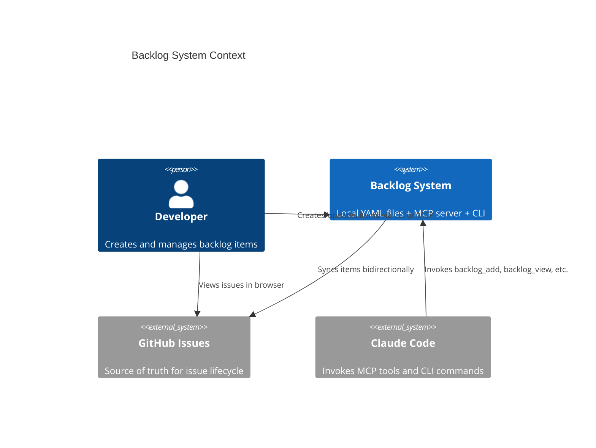
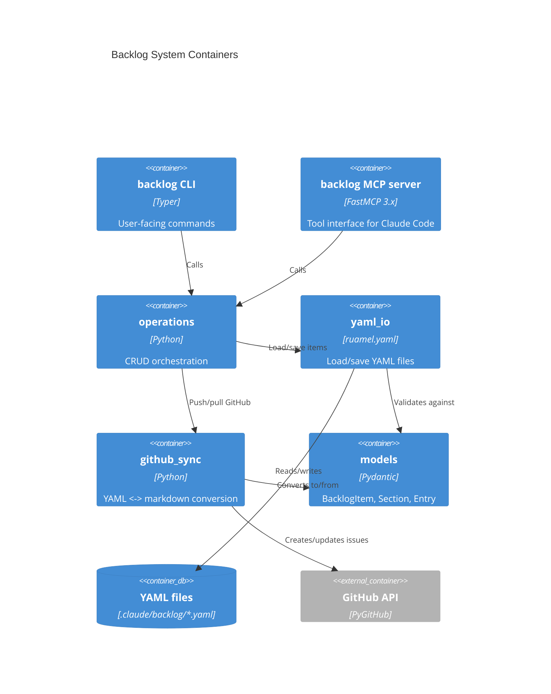
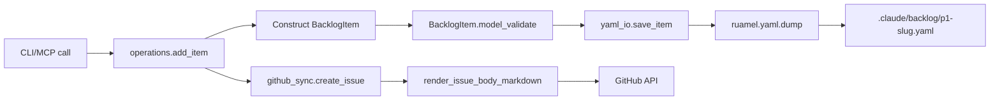
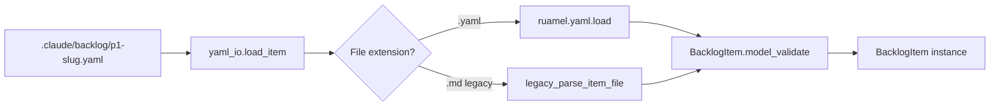
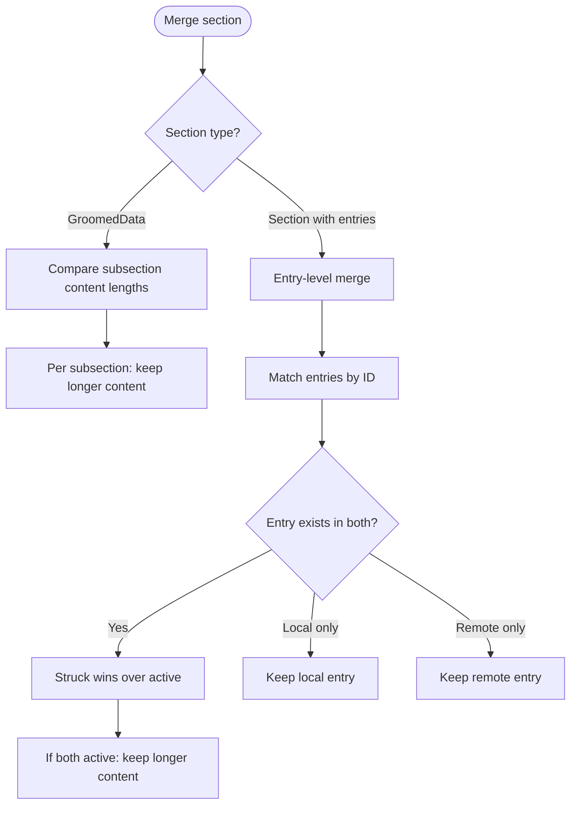
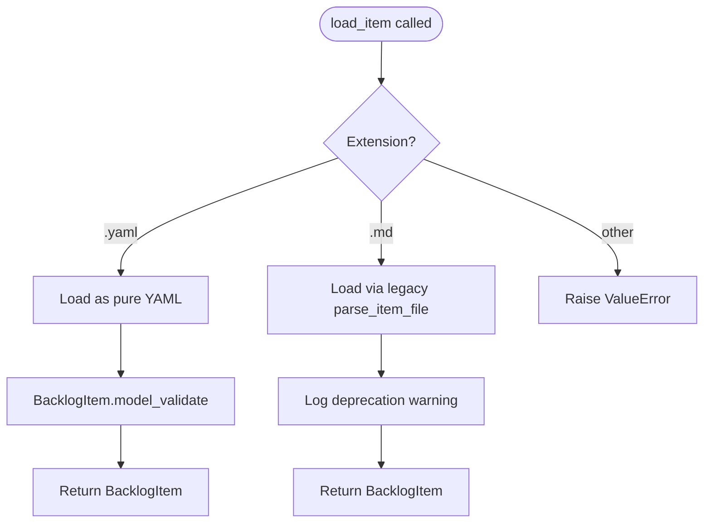
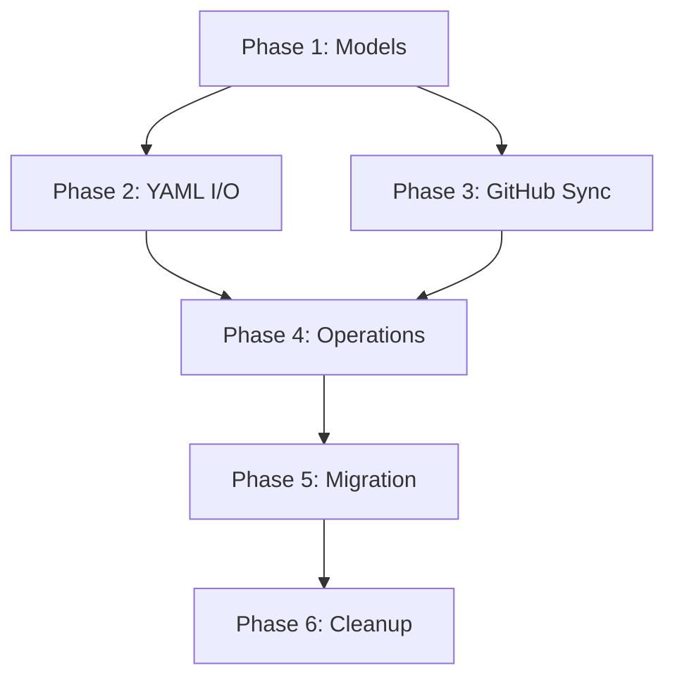

# Architecture Spec: Backlog YAML Migration

## 1. Executive Summary

Convert local backlog files from hybrid markdown (YAML frontmatter + markdown body with regex-parsed sections) to pure YAML files. This eliminates the dual-parser architecture (`python-frontmatter` + regex) in favor of a single `ruamel.yaml` load/dump cycle, makes all structured data (sections, entries, groomed subsections) first-class typed fields on the `BacklogItem` Pydantic model, and replaces fragile regex-based section manipulation with dict/list operations.

The migration is **atomic** (bulk convert all ~90 files in one commit) with a **format-detecting reader** active for one release cycle to handle any files missed or created by external tooling. GitHub issue bodies remain markdown -- a new sync adapter converts between local YAML and GitHub markdown representations.

Key outcomes:
- `python-frontmatter` dependency removed from backlog I/O path
- `BacklogItem.raw_body: str` replaced by typed section fields
- Entry blocks become `list[Entry]` under their section key instead of HTML `<div><sub>` wrappers parsed by regex
- `parse_item_file()` becomes YAML load + `BacklogItem.model_validate()`
- Section manipulation becomes dict/list operations (no regex)

## 2. Architecture Overview

### C4 Context Diagram



### C4 Container Diagram



### Data Flow: Write Path



### Data Flow: Read Path



## 3. Technology Stack

| Component | Choice | Justification |
|-----------|--------|---------------|
| YAML library | `ruamel.yaml` (round-trip mode) | Project standard per `.claude/rules/yaml-toml-libraries.md`. Already a dependency. Round-trip mode preserves comments and formatting. |
| Data validation | Pydantic v2 (`BaseModel`) | Already used for `BacklogItem`. `model_validate()` replaces regex parsing. |
| File extension | `.yaml` | Distinguishes from legacy `.md` files. Enables format detection by extension. |
| GitHub sync | PyGitHub | Already used in `github.py`. No new dependency needed. |
| Migration script | PEP 723 standalone | One-time bulk conversion. No ongoing dependency. |
| Removed dependency | `python-frontmatter` | No longer needed when files are pure YAML. Remains available as dev dep for any other usage in repo. |

**No new dependencies introduced.** The migration removes `python-frontmatter` from the backlog I/O path and uses `ruamel.yaml` directly.

## 4. Component Design

### 4.1 `models.py` -- Updated Data Models

**Purpose**: Pydantic models representing the complete YAML file structure. No `raw_body`.

**Changes**:
- Add `Section` model (name, entries list, subsections dict)
- Add structured section fields to `BacklogItem` (replaces `raw_body: str`)
- `Entry` model unchanged (already has the right fields; drop `raw` field)
- Add `GroomedData` model for the structured groomed subsections

**Dependencies**: None (standalone module).

### 4.2 `yaml_io.py` -- New Module (replaces `frontmatter_utils.py` for backlog)

**Purpose**: Load and save backlog items as pure YAML files using `ruamel.yaml` directly.

**Interface**:

```python
def load_item(path: Path) -> BacklogItem: ...
def save_item(item: BacklogItem, path: Path) -> None: ...
def load_item_text(text: str, path: Path) -> BacklogItem: ...
def detect_format(path: Path) -> Literal["yaml", "legacy_md"]: ...
```

**Dependencies**: `ruamel.yaml`, `models.py`

**Design notes**:
- `load_item()` calls `detect_format()` first. If `.yaml`, loads directly with `ruamel.yaml` and validates via `BacklogItem.model_validate()`. If `.md`, delegates to the existing `parse_item_file()` for backward compatibility during transition.
- `save_item()` always writes `.yaml` format.
- `ruamel.yaml` width set to `2147483647` (same as current `RuamelYAMLHandler`) to prevent line wrapping.
- Uses `typ="safe"` for loading (no round-trip complexity needed -- we control the output format).

### 4.3 `parsing.py` -- Reduced Scope

**Purpose**: Retains slug generation, section extraction for GitHub body parsing, and legacy `.md` file parsing (deprecation path).

**Changes**:
- `parse_item_file()` marked as legacy, called only by `yaml_io.load_item()` for `.md` files
- `build_backlog_frontmatter()` replaced by `yaml_io.save_item()`
- Section manipulation functions (`append_or_replace_section`, `extract_sections`, `reconstruct_body_from_sections`) retained ONLY for GitHub body markdown parsing in the sync layer
- `extract_groomed_section()` retained for GitHub body parsing
- Body field extraction (`extract_body_field_pairs`, `parse_body_extra_fields`) deprecated -- fields live in YAML

### 4.4 `entry_blocks.py` -- Reduced Scope

**Purpose**: Entry block operations become list operations on `Section.entries`.

**Changes**:
- `parse_entries()` retained for GitHub body parsing (reading entry blocks from markdown issue bodies during `backlog_pull`)
- `wrap_entry()` / `wrap_entry_with_timestamp()` retained for GitHub body rendering (writing entry blocks to markdown issue bodies during `backlog_sync`)
- `rewrite_section()` replaced by direct list manipulation on `Section.entries`
- `strike_entry()` becomes a model operation: set `entry.struck = True`, `entry.struck_at = now_iso()`, `entry.struck_reason = reason`
- `generate_diff()` operates on `list[Entry]` instead of regex-parsed text

### 4.5 `github_sync.py` -- New Module (extracted from `github.py`)

**Purpose**: Convert between local YAML representation and GitHub issue body markdown.

**Interface**:

```python
def render_issue_body(item: BacklogItem) -> str: ...
def parse_issue_body(body: str, existing: BacklogItem | None = None) -> BacklogItem: ...
def merge_item(local: BacklogItem, remote: BacklogItem) -> BacklogItem: ...
```

**Dependencies**: `models.py`, `parsing.py` (for markdown section extraction), `entry_blocks.py` (for markdown entry parsing)

### 4.6 `operations.py` -- Consumer Updates

**Purpose**: CRUD operations. Interface unchanged; internal calls updated.

**Changes**:
- Replace `loads_frontmatter()` / `dump_frontmatter()` calls with `yaml_io.load_item()` / `yaml_io.save_item()`
- Replace `append_or_replace_section(item.raw_body, ...)` with direct `item.sections["name"].entries.append(Entry(...))`
- Replace `update_item_metadata()` frontmatter load/modify/save with `yaml_io.load_item()` + field assignment + `yaml_io.save_item()`
- `build_issue_body_from_file()` calls `github_sync.render_issue_body()` instead of passing `raw_body` through

### 4.7 `server.py` -- No Signature Changes

**Purpose**: MCP tool definitions. Tool signatures unchanged.

**Changes**: Internal only -- uses updated `operations.py` functions. `ViewItemResult.body` returns rendered markdown (generated from YAML sections on read) for backward compatibility with MCP consumers.

## 5. Data Architecture

### 5.1 YAML File Format Specification

Complete example of a backlog item in the new format:

```yaml
# .claude/backlog/p1-add-sdk-support.yaml
title: Add SDK Support
description: Enable programmatic access to backlog operations
metadata:
  source: Feature request from user
  added: '2026-03-15'
  priority: P1
  type: Feature
  status: open
  issue: '#42'
  last_synced: '2026-03-15T14:30:45Z'
  groomed: '2026-03-16'
  plan: plan/tasks-5-add-sdk-support.md
  topic: sdk
  research_first: ''
  files: ''
  suggested_location: ''

sections:
  groomed:
    date: '2026-03-16'
    subsections:
      priority: P1 - Should Have
      impact: Enables automation of backlog management
      benefits: |
        Reduces manual overhead for bulk operations.
        Enables CI/CD integration.
      expected_behavior: |
        SDK exposes all MCP tool operations as Python functions.
      acceptance_criteria: |
        - [ ] All MCP tools have Python function equivalents
        - [ ] Type hints on all public functions
        - [ ] 80% test coverage
      resources: ''
      dependencies: backlog-core package must be stable
      effort: Medium

  fact_check:
    entries:
      - id: '2026-03-15T14:30:45Z'
        content: |
          Verified that PyGitHub supports all required GitHub API operations.
          Rate limiting is handled by the library.
        struck: false
        struck_reason: ''
        struck_at: ''
      - id: '2026-03-15T15:00:00Z'
        content: |
          Original analysis of REST API was incomplete.
        struck: true
        struck_reason: superseded by PyGitHub analysis
        struck_at: '2026-03-15T16:00:00Z'

  rt_ica:
    entries:
      - id: '2026-03-16T10:00:00Z'
        content: |
          Information completeness analysis shows 3 open questions
          about error handling strategy.
        struck: false
        struck_reason: ''
        struck_at: ''

  issue_classification:
    entries:
      - id: '2026-03-15T14:30:45Z'
        content: |
          Classified as Feature - SDK enablement.
        struck: false
        struck_reason: ''
        struck_at: ''
```

### 5.2 Design Decisions for YAML Structure

**Sections as a `sections:` dict** (not flat top-level keys):
- Sections are a category of data distinct from item metadata. Nesting them under `sections:` keeps the top level clean and makes it obvious which keys are metadata vs. content.
- New section types can be added without polluting the top-level namespace.
- The `sections` dict is keyed by normalized section name (`groomed`, `fact_check`, `rt_ica`, `issue_classification`).

**Groomed subsections as a nested dict**:
- The `groomed` section is unique: it has named subsections (Priority, Impact, Benefits, etc.) rather than timestamped entries.
- Represented as `subsections: dict[str, str]` where keys are normalized subsection names.
- The `date` field captures the grooming date (currently parsed from `## Groomed (YYYY-MM-DD)` header).

**Entry blocks as `list[Entry]`**:
- Each entry is an object with `id` (ISO timestamp), `content`, `struck`, `struck_reason`, `struck_at`.
- The `raw` field from the current `Entry` model is dropped -- the YAML structure IS the canonical form.
- Duplicate timestamp handling preserved: if two entries share a timestamp, suffix `-0`, `-1` applied at parse time (same as current behavior).

**`description` field**: Always plain text. Entry-wrapped descriptions (observed in some files where `description` starts with `<div><sub>`) are migrated: the entry content becomes the plain text description, and the entry metadata is discarded (description is not an audit trail field).

### 5.3 Updated Pydantic Models

```python
class Entry(BaseModel):
    """A single timestamped content block within a backlog section."""
    id: str = ""
    content: str = ""
    struck: bool = False
    struck_reason: str = ""
    struck_at: str = ""
    # NOTE: `raw` field removed -- YAML is the canonical form


class GroomedData(BaseModel):
    """Structured groomed analysis with named subsections."""
    date: str = ""
    subsections: dict[str, str] = Field(default_factory=dict)
    # Known subsection keys: priority, impact, benefits,
    # expected_behavior, desired_structure, acceptance_criteria,
    # resources, dependencies, effort


class Section(BaseModel):
    """A named section containing timestamped entries."""
    entries: list[Entry] = Field(default_factory=list)


class BacklogItemMetadata(BaseModel):
    """Nested metadata block matching the YAML `metadata:` key."""
    source: str = "Not specified"
    added: str = ""
    priority: str = ""
    type: str = "Feature"
    status: str = "open"
    issue: str = ""
    last_synced: str = ""
    groomed: str = ""
    plan: str = ""
    topic: str = ""
    research_first: str = ""
    files: str = ""
    suggested_location: str = ""


class BacklogItem(BaseModel):
    """Complete backlog item -- maps 1:1 to YAML file keys."""
    title: str = ""
    description: str = ""
    metadata: BacklogItemMetadata = Field(default_factory=BacklogItemMetadata)

    # Structured sections (replaces raw_body)
    sections: dict[str, Section | GroomedData] = Field(default_factory=dict)

    # Runtime-only fields (not persisted to YAML)
    file_path: str = ""
    skip: bool = False

    # --- Convenience accessors (computed from metadata) ---
    @property
    def priority(self) -> str: ...

    @property
    def issue(self) -> str: ...

    @property
    def source(self) -> str: ...

    @property
    def added(self) -> str: ...

    @property
    def status(self) -> str: ...

    @property
    def plan(self) -> str: ...

    @property
    def item_type(self) -> str: ...

    @property
    def groomed(self) -> str: ...

    @property
    def last_synced(self) -> str: ...
```

**Model changes summary**:
- Flat fields (`priority`, `source`, `added`, `item_type`, `issue`, `plan`, `research_first`, `files`, `suggested_location`, `status`, `groomed`, `last_synced`, `type_`, `topic`) moved into `BacklogItemMetadata` under `metadata:`
- `raw_body: str` removed entirely
- `sections: dict[str, Section | GroomedData]` added
- `section: str` (the priority section like "P0") is now `metadata.priority`
- Convenience `@property` accessors on `BacklogItem` delegate to `metadata.*` for backward compatibility with existing code that reads `item.priority`, `item.issue`, etc.
- `Entry.raw` field removed
- `file_path` and `skip` excluded from YAML serialization via `model_config = ConfigDict(json_schema_extra=...)` or a custom serializer

### 5.4 Validation Rules

- `metadata.priority` must be one of: `P0`, `P1`, `P2`, `Ideas`, `completed`
- `metadata.type` must be one of: `Feature`, `Bug`, `Refactor`, `Docs`, `Chore`
- `metadata.status` must be one of: `open`, `done`, `in-progress`, `needs-grooming`
- `metadata.added` must match `YYYY-MM-DD` format
- `Entry.id` must be a non-empty string (ISO timestamp or timestamp with suffix)
- `Entry.struck` is `True` only when `Entry.struck_at` is non-empty
- `sections` keys must be from: `groomed`, `fact_check`, `rt_ica`, `issue_classification`
- `sections["groomed"]` must be `GroomedData` type; all others must be `Section` type

Validation is enforced by Pydantic `model_validator` and `field_validator` decorators.

## 6. GitHub Sync Adapter

GitHub issue bodies must remain markdown. The sync adapter converts between local YAML and GitHub markdown representations.

### 6.1 YAML to Markdown (Push Direction)

`render_issue_body(item: BacklogItem) -> str`

Converts a `BacklogItem` (loaded from YAML) into a markdown string for the GitHub issue body.

**Output format**:

```markdown
<!-- backlog-metadata:
priority: P1
type: Feature
status: open
added: '2026-03-15'
-->

## Description

Enable programmatic access to backlog operations

## Groomed (2026-03-16)

### Priority
P1 - Should Have

### Impact
Enables automation of backlog management

### Acceptance Criteria
- [ ] All MCP tools have Python function equivalents

## Fact-Check

<div><sub>2026-03-15T14:30:45Z</sub>

Verified that PyGitHub supports all required operations.
</div>

<div><sub>2026-03-15T15:00:00Z</sub>
<details><summary>struck: 2026-03-15T16:00:00Z — superseded by PyGitHub analysis</summary>

Original analysis was incomplete.
</details>
</div>
```

**Rendering rules**:
- Metadata embedded as HTML comment (invisible in GitHub rendering, parseable on pull)
- `GroomedData` rendered as `## Groomed ({date})` with `### {Subsection}` children
- `Section` entries rendered as `<div><sub>{id}</sub>` HTML blocks (preserves current GitHub rendering)
- Struck entries rendered with `<details><summary>struck: ...` wrapper (preserves current format)
- Section names mapped: `fact_check` -> `Fact-Check`, `rt_ica` -> `RT-ICA`, `issue_classification` -> `Issue Classification`

### 6.2 Markdown to YAML (Pull Direction)

`parse_issue_body(body: str, existing: BacklogItem | None = None) -> BacklogItem`

Parses a GitHub issue body (markdown) back into a `BacklogItem`. Used by `backlog_pull`.

**Parsing steps**:
1. Extract metadata from `<!-- backlog-metadata: ... -->` HTML comment
2. Extract `## Section` blocks using existing `extract_sections()` from `parsing.py`
3. For `## Groomed` sections: extract `### Subsection` children into `GroomedData.subsections`
4. For entry-bearing sections: use existing `parse_entries()` from `entry_blocks.py` to parse `<div><sub>` blocks into `list[Entry]`
5. Construct `BacklogItem` with parsed sections

### 6.3 Merge Strategy (Bidirectional Sync)

`merge_item(local: BacklogItem, remote: BacklogItem) -> BacklogItem`

Merges a locally-loaded item with a GitHub-pulled item.

**Merge rules per section type**:



**Entry merge rules** (preserving current semantics):
- Match entries by `id` (timestamp)
- If entry exists in both local and remote: struck version wins (retraction is authoritative)
- If both active: longer content wins (more detail is preferred)
- Entries unique to either side are preserved
- Entry ordering: chronological by `id`

## 7. Migration Strategy

### 7.1 Approach: Atomic Bulk Migration

All ~90 `.md` files in `.claude/backlog/` are converted to `.yaml` in a single commit. This is preferred over gradual migration because:

- No dual-format code paths in production beyond the transition reader
- One commit to review and revert if needed
- Eliminates ambiguity about which format is canonical
- The backlog directory is not high-contention (one writer at a time via MCP/CLI)

### 7.2 Migration Script

PEP 723 standalone script: `scripts/migrate_backlog_to_yaml.py`

```python
def migrate_file(md_path: Path) -> Path: ...
    # 1. Read .md file text
    # 2. Parse via existing parse_item_file() -> BacklogItem (old model)
    # 3. Extract sections from raw_body via extract_sections()
    # 4. Parse entries from each section via parse_entries()
    # 5. Extract groomed subsections via extract_groomed_section()
    # 6. Construct new BacklogItem (new model) with structured sections
    # 7. Save as .yaml via yaml_io.save_item()
    # 8. Return new .yaml path

def migrate_all(backlog_dir: Path, *, dry_run: bool = False) -> MigrationReport: ...
    # 1. Glob *.md files
    # 2. For each: migrate_file()
    # 3. Verify round-trip: load .yaml, render to markdown, compare key fields
    # 4. If not dry_run: delete .md files
    # 5. Return report with counts and any errors
```

**Round-trip verification**: After writing each `.yaml` file, load it back, render to markdown via `render_issue_body()`, and compare the entry count, entry IDs, and groomed subsection keys against the original `.md` parse. Field-level comparison, not string-level (markdown formatting may differ).

### 7.3 Format-Detecting Reader (Transition Period)

`yaml_io.detect_format(path: Path) -> Literal["yaml", "legacy_md"]`

Detection logic:



The format-detecting reader is active for one release cycle. After that, `.md` support is removed and `parse_item_file()` and related regex functions can be deleted.

### 7.4 File Discovery Update

`list_items()` in `operations.py` currently globs `*.md`. Updated to glob `*.yaml` with fallback to `*.md`:

```python
def discover_item_files(backlog_dir: Path) -> list[Path]:
    yaml_files = sorted(backlog_dir.glob("*.yaml"))
    md_files = sorted(backlog_dir.glob("*.md"))
    return yaml_files + md_files  # yaml takes precedence if both exist
```

If both `slug.yaml` and `slug.md` exist for the same slug, the `.yaml` file wins and a warning is logged.

### 7.5 Description Field Migration

Files where `description` contains `<div><sub>` entry block HTML:
1. Parse the entry block to extract content
2. Set `description` to the extracted plain text content
3. The entry timestamp metadata is discarded (description is not an audit trail)

## 8. Security Architecture

No new security surface introduced. Existing constraints preserved:

- **Credential management**: GitHub token via `GITHUB_TOKEN` env var (unchanged)
- **YAML loading**: Use `ruamel.yaml` `typ="safe"` for loading user-controlled files. The backlog files are user-authored and could contain YAML constructs that trigger arbitrary code execution in unsafe loaders.
- **File permissions**: Backlog files are not credential files; standard permissions apply
- **Path traversal**: `file_path` field validated to be within `.claude/backlog/` directory
- **No new network surface**: GitHub API access pattern unchanged

**Security checklist**:
- [ ] `ruamel.yaml` loader type is `"safe"` (not `"rt"` or `"unsafe"`)
- [ ] No `yaml.load()` without explicit loader type
- [ ] File paths validated before write operations
- [ ] Migration script does not follow symlinks outside backlog directory

## 9. Testing Architecture

### 9.1 Testing Stack

```text
pytest>=8.0.0
pytest-cov>=6.0.0
pytest-mock>=3.14.0
hypothesis>=6.100.0
```

### 9.2 Coverage Requirements

- **Overall**: 80% line and branch coverage (existing `fail_under=80` in pyproject.toml)
- **yaml_io.py**: 95%+ (core I/O path, data integrity critical)
- **github_sync.py**: 95%+ (data conversion must be lossless)
- **Migration script**: 90%+ (one-time but high impact)

### 9.3 Test Categories

**Unit tests** (`tests/test_yaml_io.py`):
- Load valid YAML file -> correct `BacklogItem` fields
- Load file with all section types populated
- Load file with empty sections
- Load file with struck entries
- Save `BacklogItem` -> valid YAML (round-trip)
- `detect_format()` correctly identifies `.yaml` vs `.md`
- Legacy `.md` loading still works during transition

**Unit tests** (`tests/test_github_sync.py`):
- `render_issue_body()` produces correct markdown for each section type
- `parse_issue_body()` round-trips with `render_issue_body()`
- `merge_item()` entry-level merge rules (struck wins, longer wins, unique preserved)
- Groomed subsection merge (longer wins per subsection)
- Empty sections handled correctly

**Unit tests** (`tests/test_models.py`):
- `BacklogItem` validation rules (priority, type, status constraints)
- `Entry` validation (struck implies struck_at)
- `GroomedData` with and without subsections
- Convenience property accessors delegate to metadata correctly
- `file_path` and `skip` excluded from serialization

**Integration tests** (`tests/test_migration.py`):
- Migrate a sample `.md` file -> `.yaml` -> load back -> field equality
- Migrate file with entry-wrapped description
- Migrate file with no body sections
- Migrate file with groomed subsections
- Dry-run mode does not modify files
- Round-trip verification catches data loss

**Property-based tests** (hypothesis):
- Arbitrary entry content round-trips through YAML save/load
- Arbitrary section names from valid set produce valid YAML
- `render_issue_body()` + `parse_issue_body()` is identity on model fields

### 9.4 Test Fixtures

```text
tests/
  fixtures/
    sample_item_legacy.md        # Current format sample
    sample_item.yaml             # New format sample
    sample_item_groomed.yaml     # Item with groomed subsections
    sample_item_entries.yaml     # Item with struck entries
    sample_github_body.md        # GitHub issue body markdown
```

### 9.5 pytest Configuration

Existing `pyproject.toml` configuration applies. The `backlog_core` package tests are in the workspace member `plugins/development-harness/` and use the existing pytest configuration there.

## 10. Distribution Architecture

**Strategy: Python Package** (existing workspace member)

The `backlog_core` package is already a workspace member under `plugins/development-harness/`. All new modules (`yaml_io.py`, `github_sync.py`) are added to the existing `backlog_core` package. No new package or distribution artifact needed.

The migration script (`scripts/migrate_backlog_to_yaml.py`) is a PEP 723 standalone script:
- Shebang: `#!/usr/bin/env -S uv --quiet run --active --script`
- Dependencies: `ruamel.yaml`, `pydantic` (available from workspace)
- Executable permissions set
- One-time use; not installed as a CLI command

## 11. Architectural Decisions (ADRs)

### ADR-001: Atomic Migration Over Gradual

**Context**: ~90 backlog files need conversion. Options: (A) bulk convert in one commit, (B) support both formats indefinitely and convert on-write.

**Decision**: Atomic bulk migration with a time-limited format-detecting reader.

**Rationale**: Gradual migration adds permanent complexity to every read/write path. The backlog directory has low write contention (single writer at a time). A bulk conversion creates one reviewable commit. The format-detecting reader handles edge cases (files created by external tooling) during a one-release transition.

**Consequences**: Large diff in one commit. Requires coordination if branches have in-flight backlog changes.

### ADR-002: Sections as Nested Dict, Not Flat Top-Level Keys

**Context**: Groomed subsections, fact-check entries, RT-ICA entries -- should they be top-level YAML keys or nested under `sections:`?

**Decision**: Nested under `sections:` dict keyed by normalized name.

**Rationale**: Top-level keys mix metadata (title, description, priority) with content (fact-check entries, groomed analysis). The `sections:` namespace keeps these concerns separate. Adding new section types (future) does not require model changes -- just a new key in the dict. The discriminated union (`Section | GroomedData`) handles the two structural variants.

**Consequences**: Accessing section data requires `item.sections["fact_check"]` instead of `item.fact_check`. Mitigated by convenience methods if needed.

### ADR-003: Entry Blocks as List-of-Objects

**Context**: Entry blocks could be stored as (A) list of objects with explicit fields, (B) dict keyed by timestamp, or (C) latest-content-only with history in a separate key.

**Decision**: List of objects with `id`, `content`, `struck`, `struck_reason`, `struck_at` fields.

**Rationale**: Lists preserve insertion order (important for audit trails). Duplicate timestamps (suffixed `-0`, `-1`) are natural as list elements but awkward as dict keys. The full entry object makes struck state explicit rather than requiring wrapper parsing. Option C loses the append-only audit trail semantic.

**Consequences**: Finding an entry by ID requires linear scan. Acceptable for typical section sizes (<20 entries).

### ADR-004: ruamel.yaml `typ="safe"` for Loading

**Context**: Current code uses `typ="rt"` (round-trip) to preserve formatting. Pure YAML files are fully machine-generated.

**Decision**: Use `typ="safe"` for loading, standard `YAML()` for dumping with controlled formatting.

**Rationale**: Round-trip mode preserves comments and formatting but adds complexity (CommentedMap/CommentedSeq types). Since we control both read and write, we do not need to preserve user formatting. Safe mode returns plain Python dicts, which Pydantic `model_validate()` handles directly. This also avoids the security risk of unsafe loaders on user-authored files.

**Consequences**: Comments in YAML files are not preserved on round-trip. Acceptable -- these files are machine-managed, not hand-edited.

### ADR-005: `ViewItemResult.body` Returns Rendered Markdown

**Context**: MCP tools and CLI return `body` as a string. With pure YAML storage, there is no raw markdown body.

**Decision**: `ViewItemResult.body` returns markdown rendered from YAML sections via `render_issue_body()`.

**Rationale**: MCP consumers (Claude Code agents) expect markdown body content for display and analysis. Changing the response format would break existing agent workflows. Rendering from YAML is deterministic and lossless.

**Consequences**: Slight compute overhead on view operations. Negligible for single-item views.

### ADR-006: Description Field Is Always Plain Text

**Context**: Some existing files have `description` containing `<div><sub>` entry block HTML. Should this be preserved?

**Decision**: Migrate entry-wrapped descriptions to plain text. Extract content from the entry block, discard entry metadata.

**Rationale**: `description` is a summary field, not an audit trail. Entry-wrapped descriptions were an artifact of using the same entry block mechanism for all content. The migration extracts the meaningful content and discards the wrapper. If audit trail semantics are needed, they belong in a section (e.g., `sections.description_history`).

## 12. Scalability Strategy

This is a file-based system with no concurrent access patterns requiring async. Resource management is straightforward:

- **File I/O**: Synchronous. Backlog files are small (<10KB each). No streaming needed.
- **YAML parsing**: `ruamel.yaml` loads entire file into memory. Acceptable for file sizes involved.
- **Migration script**: Processes files sequentially. ~90 files at <10KB each completes in seconds.
- **GitHub API calls**: Existing rate-limiting patterns in `github.py` unchanged.
- **Memory**: `BacklogItem` model instances are lightweight. No caching layer needed.
- **Concurrency**: Single-writer semantics enforced by MCP server (one active session). No locking needed.

## 13. Phased Implementation Plan

### Phase 1: Data Models (no behavioral change)

1. Add `GroomedData`, `Section`, `BacklogItemMetadata` models to `models.py`
2. Update `BacklogItem` with `sections` field and `metadata` field
3. Add convenience `@property` accessors for backward compatibility
4. Remove `Entry.raw` field
5. Add Pydantic validators for priority, type, status constraints
6. Ensure all existing tests still pass (model is additive at this stage)

**Deliverable**: Updated `models.py` with backward-compatible model additions.

### Phase 2: YAML I/O Module

1. Create `yaml_io.py` with `load_item()`, `save_item()`, `load_item_text()`, `detect_format()`
2. `load_item()` supports both `.yaml` (new) and `.md` (legacy via `parse_item_file()`)
3. `save_item()` writes pure YAML using `ruamel.yaml`
4. Write unit tests for all YAML I/O functions
5. Write test fixtures (sample `.yaml` files)

**Deliverable**: `yaml_io.py` with full test coverage. No consumers switched yet.

### Phase 3: GitHub Sync Adapter

1. Create `github_sync.py` with `render_issue_body()`, `parse_issue_body()`, `merge_item()`
2. `render_issue_body()` converts `BacklogItem` sections to markdown
3. `parse_issue_body()` parses markdown issue body back to `BacklogItem` sections
4. `merge_item()` implements entry-level and subsection-level merge rules
5. Write unit tests including round-trip property tests

**Deliverable**: `github_sync.py` with full test coverage. Not wired into operations yet.

### Phase 4: Operations Layer Migration

1. Update `operations.py` to use `yaml_io.load_item()` / `yaml_io.save_item()` instead of `frontmatter_utils` functions
2. Replace `append_or_replace_section(item.raw_body, ...)` with `item.sections[name].entries.append(Entry(...))`
3. Update `update_item_metadata()` to load/modify/save via `yaml_io`
4. Update `build_issue_body_from_file()` to use `github_sync.render_issue_body()`
5. Update `view_result_from_local_item()` to render `body` from sections
6. Update file discovery to glob `*.yaml` + `*.md`
7. Update `add_item()` to write `.yaml` extension
8. Run full test suite; fix integration issues

**Deliverable**: Operations layer using new I/O. Both formats readable; new items written as YAML.

### Phase 5: Migration Script and Execution

1. Write `scripts/migrate_backlog_to_yaml.py`
2. Add round-trip verification (load .yaml, compare fields against .md parse)
3. Run in dry-run mode, review report
4. Execute migration, commit all `.yaml` files and `.md` deletions in one commit
5. Run `backlog_list` and `backlog_view` on several items to verify

**Deliverable**: All backlog files converted to `.yaml`. Old `.md` files deleted.

### Phase 6: Cleanup

1. Remove `python-frontmatter` imports from backlog I/O path
2. Mark `parse_item_file()` as deprecated (or remove if no other consumers)
3. Remove `raw_body` field references from all code
4. Remove `build_backlog_frontmatter()` function
5. Update documentation (ARCHITECTURE.md, local-workflow.md references)
6. Run full test suite, linters, type checker

**Deliverable**: Clean codebase with no legacy format code in active paths.

### Dependency Graph



Phases 2 and 3 can execute in parallel after Phase 1 completes.
