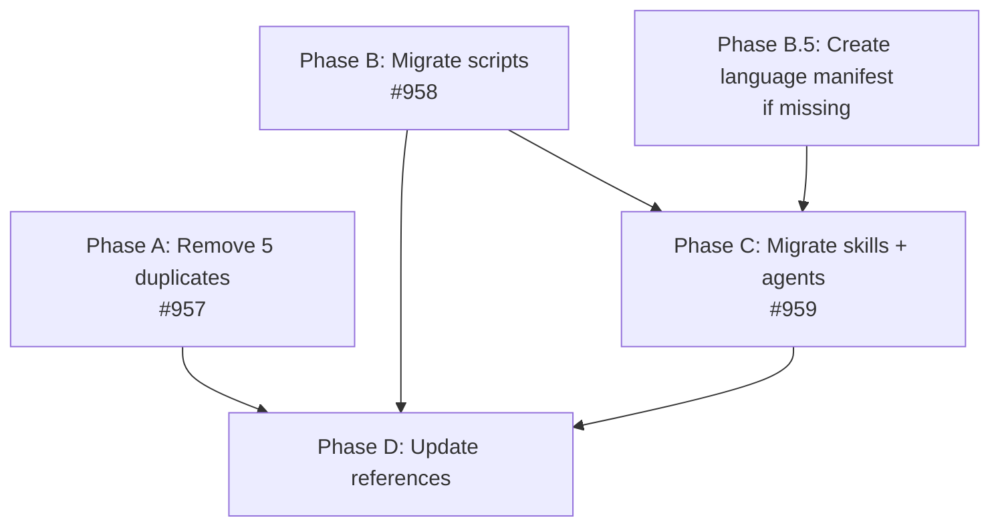

# Architecture Spec: Consolidate SAM Workflow Skills

## Document Metadata

- **Generated**: 2026-03-21
- **Source**: Backlog items #957, #958, #959
- **Input artifacts**:
  - [Skill migration comparison](./../.claude/reports/skill-migration-comparison-2026-03-21.md)
  - [Feature context](./feature-context-consolidate-sam-workflow-skills.md)
- **Scope**: Plugin file migration -- move language-agnostic SAM workflow skills, agents, and hook scripts from `python3-development` to `development-harness`

---

## 1. Design Decisions

### 1.1 Naming: Keep Current Skill Names

Migrated skills retain their current names (`implement-feature`, `start-task`, `complete-implementation`, `add-new-feature`). The dh plugin already has 7 workflow stage skills under `skills/workflows/` (`execution`, `discovery`, `planning`, etc.). The migrated skills land in `skills/` at the top level, not inside `skills/workflows/`.

**Rationale**: The `workflows/` stage skills are thin wrappers for the dh orchestrator's 7-stage pipeline. The migrated skills are the SAM execution engine used by `local-workflow.md` and invoked directly by users and orchestrators. They serve different purposes and coexist without conflict.

**Invocation after migration**:

- `/dh:implement-feature` (migrated SAM execution loop)
- `/dh:execution` (existing dh stage S5 wrapper)
- `/dh:start-task` (migrated per-task executor)
- `/dh:complete-implementation` (migrated quality gates)
- `/dh:add-new-feature` (migrated planning pipeline)

### 1.2 subagent-contract: Consolidate to dh

Create a single canonical copy at `plugins/development-harness/skills/subagent-contract/SKILL.md`. The `plugin-creator` copy (which adds a `## Workflow Reference` header) remains as-is -- it references a plugin-creator-specific path and serves that plugin's agents. The `python3-development` copy is deleted after migration since all agents that reference it (`t0-baseline-capture`, `tn-verification-gate`) will live in dh.

### 1.3 Language Manifest Role Resolution

Skills `add-new-feature` (Phase 3: `python-cli-design-spec`) and `complete-implementation` (Phase 1: `code-reviewer`) currently hardcode Python-specific agent names. After migration, these skills must resolve agents via the Voltron role resolution protocol documented in the dh orchestrator skill.

**Resolution mechanism**: The migrated skills will reference abstract roles (`design-spec`, `code-reviewer`) and include instructions for the orchestrator to resolve these roles from the active language manifest before delegating. The resolution follows the existing protocol in `plugins/development-harness/skills/development-harness/SKILL.md` lines 57-64.

**python3-development language manifest**: A `references/language-manifest.md` file must exist in the python3-development plugin declaring these role mappings. If it does not exist, creating it is a prerequisite task (Phase B.5).

**Role mapping for python3-development manifest**:

```yaml
roles:
  architect: python-cli-architect
  test-designer: python-pytest-architect
  code-reviewer: code-reviewer
  design-spec: python-cli-design-spec
  linting: null  # uses default ruff-based linting
```

---

## 2. Directory Mapping

### Phase A: Remove Duplicates (#957)

These 5 skills are identical in both plugins. Delete the python3-development copies; dh copies are canonical.

| Source (DELETE) | Canonical (KEEP) |
|---|---|
| `plugins/python3-development/skills/clear-cove-task-design/` | `plugins/development-harness/skills/clear-cove-task-design/` |
| `plugins/python3-development/skills/generate-task/` | `plugins/development-harness/skills/generate-task/` |
| `plugins/python3-development/skills/planner-rt-ica/` | `plugins/development-harness/skills/planner-rt-ica/` |
| `plugins/python3-development/skills/implementation-manager/SKILL.md` | `plugins/development-harness/skills/implementation-manager/SKILL.md` |
| `plugins/python3-development/skills/validation-protocol/` | `plugins/development-harness/skills/validation-protocol/` |

**implementation-manager special case**: Only the SKILL.md is deleted from python3-development. The `scripts/` subdirectory is retained until Phase B completes the script migration. The python3-development `implementation-manager/` directory itself is deleted only after Phase B moves all scripts out.

### Phase B: Migrate Scripts (#958)

Move hook scripts from python3-development to dh's implementation-manager scripts directory. Clean stale pyc files first.

| Source (MOVE) | Destination |
|---|---|
| `plugins/python3-development/skills/implementation-manager/scripts/task_status_hook.py` | `plugins/development-harness/skills/implementation-manager/scripts/task_status_hook.py` |
| `plugins/python3-development/skills/implementation-manager/scripts/task_format.py` | `plugins/development-harness/skills/implementation-manager/scripts/task_format.py` |
| `plugins/python3-development/skills/implementation-manager/scripts/get_task_context.py` | `plugins/development-harness/skills/implementation-manager/scripts/get_task_context.py` |

**Not migrated**:

- `implementation_manager.py` -- superseded by `sam` CLI; delete after confirming no remaining references
- `test_task_parsing.py` -- test file for the old CLI; delete with `implementation_manager.py`

**Cleanup**: Delete `plugins/development-harness/skills/implementation-manager/scripts/__pycache__/` (contains stale `.pyc` files from previously-removed scripts).

### Phase C: Migrate Skills and Agents (#959)

#### C.1 Skills

| Source (MOVE) | Destination |
|---|---|
| `plugins/python3-development/skills/implement-feature/` | `plugins/development-harness/skills/implement-feature/` |
| `plugins/python3-development/skills/start-task/` | `plugins/development-harness/skills/start-task/` |
| `plugins/python3-development/skills/complete-implementation/` | `plugins/development-harness/skills/complete-implementation/` |
| `plugins/python3-development/skills/add-new-feature/` | `plugins/development-harness/skills/add-new-feature/` |
| `plugins/python3-development/skills/subagent-contract/` | `plugins/development-harness/skills/subagent-contract/` |

#### C.2 Agents

| Source (MOVE) | Destination |
|---|---|
| `plugins/python3-development/agents/t0-baseline-capture.md` | `plugins/development-harness/agents/t0-baseline-capture.md` |
| `plugins/python3-development/agents/tn-verification-gate.md` | `plugins/development-harness/agents/tn-verification-gate.md` |

**Not migrated** (Python-specific, remain in python3-development):

- `agents/python-cli-architect.md`
- `agents/python-pytest-architect.md`
- `agents/python-code-reviewer.md`
- `agents/code-reviewer.md`
- `agents/python-cli-design-spec.md`
- `agents/semantic-code-search.md`
- `skills/orchestrate/` (Python entry-point orchestrator)

### Phase D: Update References

Update all consumer documentation to reflect new locations. This phase depends on A, B, and C being complete.

**Files requiring updates**:

- `.claude/rules/local-workflow.md` -- 30+ path references to migrating skills and scripts
- `plugins/python3-development/CLAUDE.md` -- skill and agent inventory
- `plugins/development-harness/CLAUDE.md` -- skill and agent inventory (add migrated items)
- `plugins/python3-development/commands/development/create-feature-task.md` -- references migrating skills
- `plugins/python3-development/commands/development/config/command-patterns.yml` -- references migrating skills

---

## 3. Hook Path Resolution Strategy

### How `${CLAUDE_SKILL_DIR}` and `${CLAUDE_PLUGIN_DIR}` Work

- `${CLAUDE_SKILL_DIR}` resolves to the directory containing the SKILL.md file that declared the hook. For a skill at `plugins/development-harness/skills/start-task/SKILL.md`, it resolves to `.../skills/start-task/`.
- `${CLAUDE_PLUGIN_DIR}` resolves to the plugin root directory. For `development-harness`, it resolves to `.../plugins/development-harness/`.

### Current Hook Paths (python3-development)

**start-task SKILL.md** (PostToolUse hook):

```text
${CLAUDE_SKILL_DIR}/../../implementation-manager/scripts/task_status_hook.py
```

This traverses: `start-task/` -> `../../` -> `skills/` -> `implementation-manager/scripts/task_status_hook.py`

**implement-feature SKILL.md** (SubagentStop hook):

```text
python3 "./plugins/python3-development/skills/implementation-manager/scripts/task_status_hook.py"
```

This uses a repo-relative hardcoded path.

### Post-Migration Hook Paths (development-harness)

After migration, the directory structure within dh mirrors the python3-development layout:

```text
plugins/development-harness/skills/
  start-task/SKILL.md
  implement-feature/SKILL.md
  implementation-manager/scripts/task_status_hook.py
```

**start-task**: The `${CLAUDE_SKILL_DIR}/../../implementation-manager/scripts/task_status_hook.py` path resolves identically because the relative position between `start-task/` and `implementation-manager/scripts/` is preserved.

**implement-feature**: The hardcoded path must change from:

```text
python3 "./plugins/python3-development/skills/implementation-manager/scripts/task_status_hook.py"
```

to:

```text
python3 "${CLAUDE_SKILL_DIR}/../implementation-manager/scripts/task_status_hook.py"
```

Using `${CLAUDE_SKILL_DIR}` instead of a hardcoded repo-relative path makes the hook portable across plugin installations.

### Verification

After migration, invoke `/dh:start-task` and `/dh:implement-feature` and confirm hook paths resolve by checking that `task_status_hook.py` executes without `FileNotFoundError`.

---

## 4. Language Manifest Role Resolution

### Problem

Two migrated skills hardcode Python-specific agent names:

- `add-new-feature` Phase 3 delegates to `python-cli-design-spec`
- `complete-implementation` Phase 1 delegates to `code-reviewer` (which resolves to `python3-development:code-reviewer`)

After migration to dh, these skills must be language-agnostic.

### Solution: Abstract Role References

Replace hardcoded agent names with abstract role references that the orchestrator resolves at runtime via the Voltron protocol.

**In `add-new-feature` SKILL.md**, Phase 3 changes from:

```text
Delegate to python-cli-design-spec agent
```

to:

```text
Delegate to the agent mapped to the design-spec role in the active language manifest.
If no language manifest is active, use the general-purpose agent.
```

**In `complete-implementation` SKILL.md**, Phase 1 changes from:

```text
Delegate to code-reviewer agent
```

to:

```text
Delegate to the agent mapped to the code-reviewer role in the active language manifest.
If no language manifest is active, use the general-purpose agent.
```

### Language Manifest Prerequisite

The python3-development plugin must provide a `references/language-manifest.md` file. Check whether this file already exists at `plugins/python3-development/skills/python3-development/references/language-manifest.md` or `plugins/python3-development/references/language-manifest.md`. If it does not exist, create it as a prerequisite task with the role mappings from section 1.3.

The manifest schema is defined at `plugins/development-harness/skills/development-harness/references/language-manifest-schema.md`.

---

## 5. Deletion Checklist

After migration is verified (Phase D complete, all verification steps pass), delete these files and directories from python3-development:

### Phase A Deletions (after verifying dh copies exist)

- [ ] `plugins/python3-development/skills/clear-cove-task-design/` (entire directory)
- [ ] `plugins/python3-development/skills/generate-task/` (entire directory)
- [ ] `plugins/python3-development/skills/planner-rt-ica/` (entire directory)
- [ ] `plugins/python3-development/skills/validation-protocol/` (entire directory)
- [ ] `plugins/python3-development/skills/implementation-manager/SKILL.md` (file only, keep scripts/ until Phase B)

### Phase B Deletions (after verifying scripts exist in dh)

- [ ] `plugins/python3-development/skills/implementation-manager/scripts/task_status_hook.py`
- [ ] `plugins/python3-development/skills/implementation-manager/scripts/task_format.py`
- [ ] `plugins/python3-development/skills/implementation-manager/scripts/get_task_context.py`
- [ ] `plugins/python3-development/skills/implementation-manager/scripts/implementation_manager.py` (superseded by sam CLI)
- [ ] `plugins/python3-development/skills/implementation-manager/scripts/test_task_parsing.py` (test for old CLI)
- [ ] `plugins/python3-development/skills/implementation-manager/` (entire directory, after all contents removed)
- [ ] `plugins/development-harness/skills/implementation-manager/scripts/__pycache__/` (stale pyc files)

### Phase C Deletions (after verifying skills/agents exist in dh)

- [ ] `plugins/python3-development/skills/implement-feature/` (entire directory)
- [ ] `plugins/python3-development/skills/start-task/` (entire directory)
- [ ] `plugins/python3-development/skills/complete-implementation/` (entire directory)
- [ ] `plugins/python3-development/skills/add-new-feature/` (entire directory)
- [ ] `plugins/python3-development/skills/subagent-contract/` (entire directory)
- [ ] `plugins/python3-development/agents/t0-baseline-capture.md`
- [ ] `plugins/python3-development/agents/tn-verification-gate.md`

---

## 6. Verification Strategy

### 6.1 Plugin Validator

Run after each phase:

```bash
uvx skilllint@latest check plugins/development-harness
uvx skilllint@latest check plugins/python3-development
```

Both must pass with zero errors. Warnings are acceptable if pre-existing.

### 6.2 sam CLI Smoke Test

Verify the sam CLI still functions after script migration:

```bash
uv run sam list
uv run sam status P1  # or any known plan
```

These commands exercise `task_format.py` indirectly. If they produce valid JSON output, the script migration is sound.

### 6.3 Skill Invocation Tests

After Phase C, invoke each migrated skill and verify it loads without error:

```text
Skill(skill="dh:implement-feature")   -- should load SKILL.md content
Skill(skill="dh:start-task")          -- should load SKILL.md content
Skill(skill="dh:complete-implementation") -- should load SKILL.md content
Skill(skill="dh:add-new-feature")     -- should load SKILL.md content
Skill(skill="dh:subagent-contract")   -- should load SKILL.md content
```

### 6.4 Hook Path Verification

Create a minimal test scenario:

1. Invoke `/dh:start-task` with a test plan file and task ID
2. Confirm `task_status_hook.py` executes (check for `LastActivity` timestamp update in the task file)
3. Confirm no `FileNotFoundError` or `ModuleNotFoundError` in hook output

### 6.5 Role Resolution Verification

After Phase C with role resolution changes:

1. In a project with `pyproject.toml`, invoke `/dh:add-new-feature`
2. Confirm Phase 3 resolves to `python-cli-design-spec` via the language manifest
3. Confirm that without a language manifest (e.g., in a plain-text project), Phase 3 falls back to `general-purpose`

### 6.6 Reference Integrity

After Phase D, search for stale references:

```bash
rg "python3-development/skills/implement-feature" plugins/ .claude/
rg "python3-development/skills/start-task" plugins/ .claude/
rg "python3-development/skills/complete-implementation" plugins/ .claude/
rg "python3-development/skills/add-new-feature" plugins/ .claude/
rg "python3-development/agents/t0-baseline" plugins/ .claude/
rg "python3-development/agents/tn-verification" plugins/ .claude/
```

Zero matches required. Any remaining references indicate incomplete Phase D updates.

---

## 7. Phase Dependencies



**Phase A** and **Phase B** are independent of each other and can execute in parallel.

**Phase B.5** (language manifest creation) is conditional -- only needed if the manifest does not already exist. It blocks Phase C because the migrated skills need role resolution to function correctly.

**Phase C** depends on Phase B (hook scripts must be in place before skills that reference them are moved).

**Phase D** depends on all other phases (cannot update references until all files are in their final locations).

---

## 8. Files Not In Scope

These files are explicitly excluded from this migration:

- `plugins/python3-development/skills/orchestrate/` -- Python-specific entry-point orchestrator
- `plugins/python3-development/agents/python-cli-architect.md` -- Python specialist
- `plugins/python3-development/agents/python-pytest-architect.md` -- Python specialist
- `plugins/python3-development/agents/python-code-reviewer.md` -- Python specialist
- `plugins/python3-development/agents/code-reviewer.md` -- Python specialist (distinct from the abstract `code-reviewer` role)
- `plugins/python3-development/agents/python-cli-design-spec.md` -- Python specialist
- `plugins/python3-development/agents/semantic-code-search.md` -- Python specialist
- `plugins/plugin-creator/skills/subagent-contract/` -- plugin-creator's own copy with plugin-specific references
- `plugins/development-harness/skills/workflows/` -- existing dh stage skills, unaffected by migration
- `plugins/development-harness/skills/development-harness/` -- dh orchestrator skill, unaffected

---

## 9. Risk Mitigation

### Risk: Hook path breaks after migration

**Mitigation**: Phase B moves scripts before Phase C moves skills. After Phase B, run `python3 -c "import importlib.util; print(importlib.util.find_spec('task_format'))"` from the dh scripts directory to verify the module is importable. After Phase C, run the hook path verification test (section 6.4).

### Risk: Language manifest missing or misconfigured

**Mitigation**: Phase B.5 checks for manifest existence before Phase C begins. If missing, create it with the role mappings from section 1.3. After creation, validate against the schema at `plugins/development-harness/skills/development-harness/references/language-manifest-schema.md`.

### Risk: Cross-plugin skill resolution fails for subagent-contract

**Mitigation**: After migrating `subagent-contract` to dh and moving `t0-baseline-capture` and `tn-verification-gate` to dh, the agents and the skill they reference are co-located in the same plugin. Resolution is local, eliminating the cross-plugin concern. The `plugin-creator` copy remains independent.

### Risk: Behavioral regression in Python projects

**Mitigation**: The role resolution mechanism adds one indirection layer (manifest lookup) but resolves to the same concrete agents. A Python project with `pyproject.toml` still gets `python-cli-design-spec` for Phase 3 and `code-reviewer` for Phase 1 -- just resolved dynamically instead of hardcoded. Verification step 6.5 confirms this.

### Risk: Stale documentation causes agent routing failures

**Mitigation**: Phase D updates all known consumer files. Verification step 6.6 runs a comprehensive search for stale path references. The `local-workflow.md` file is the highest-impact consumer with 30+ references and is prioritized first in Phase D.
