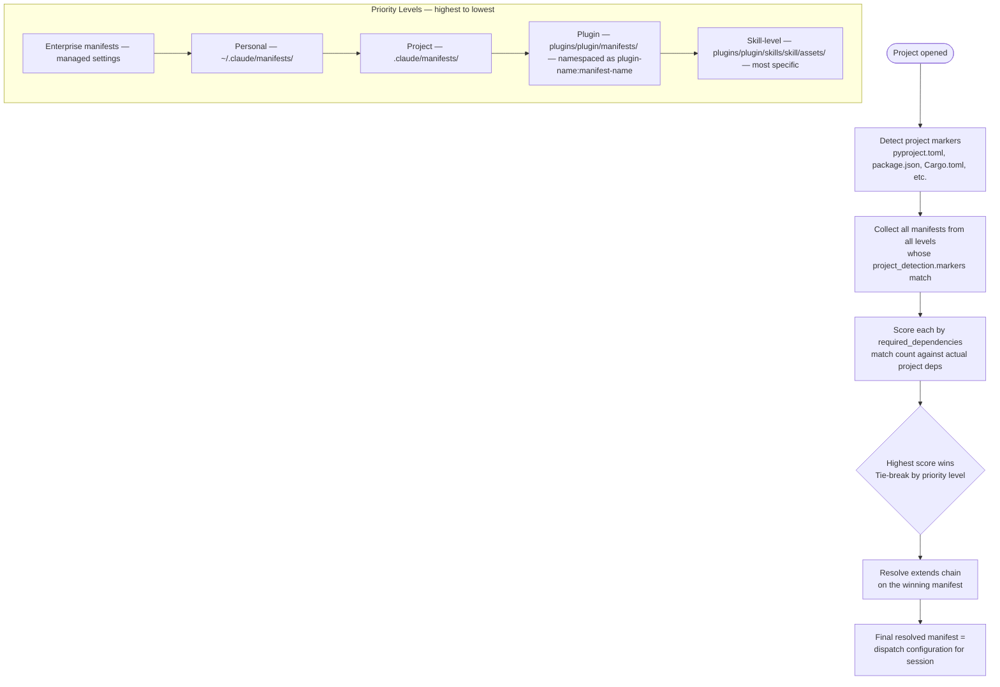
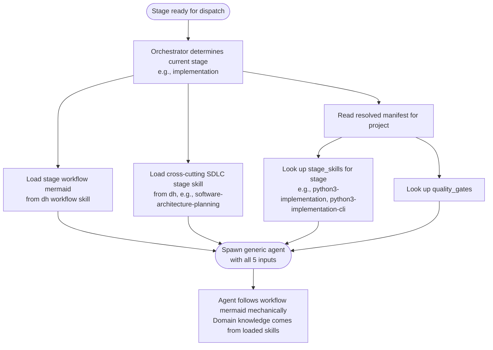
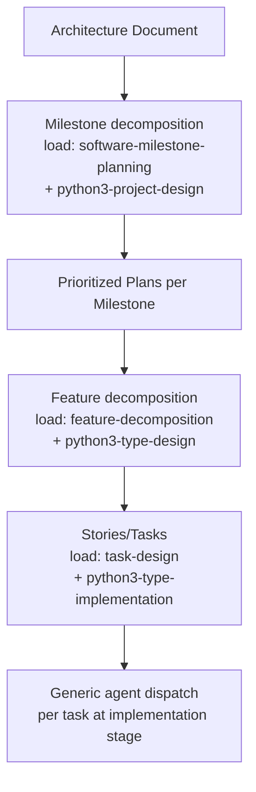
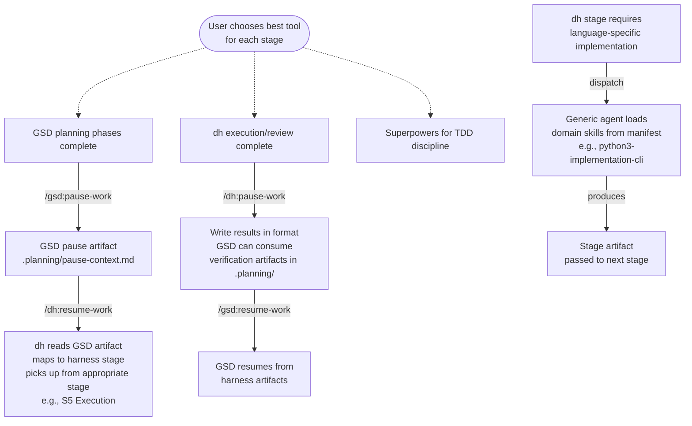
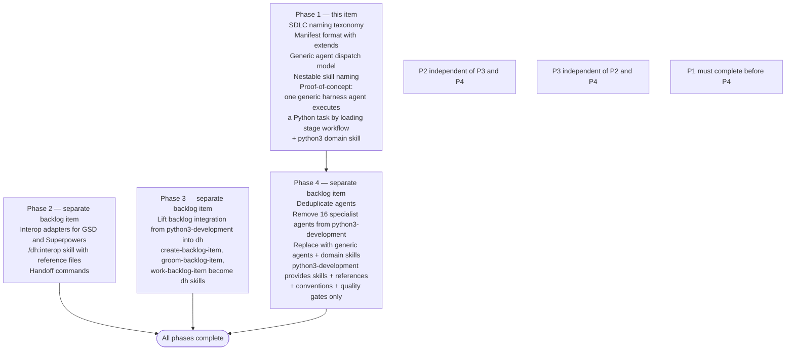

# Development Harness Architecture Refactor — Design Document

## Overview

Goal: Refactor the `development-harness` (`dh`) and `python3-development` plugins to establish clean separation of concerns — `dh` owns ALL process orchestration, language plugins provide ONLY domain knowledge (skills, references, conventions, quality gates).

**Current state**: Both plugins evolved independently. `python3-development` accumulated its own SAM-like workflow that duplicates the harness pipeline. 10 agents are duplicated across both plugins. The harness was created as a SAM abstraction layer but has received almost no updates since creation, while `python3-development` became the battle-tested working system.

**Target architecture**:

- `dh` owns: workflow definitions, job dispatch, CI monitoring, agent spawning, state management, backlog integration
- Language plugins (`python3-development`, future `typescript`, `embedded`, etc.) own: skills + references + conventions + quality gates — no agents
- Generic role-based agents in `dh` replace per-language specialist agents
- A generic agent loads workflow stage + domain skill(s) from a resolved language manifest at dispatch time

**Source of truth principle**: `python3-development` + backlog integration is the battle-tested working system. The harness should be rebuilt to match the working `python3-development` + backlog pipeline, then made language-agnostic — NOT the other way around.

## 1. SDLC Stage Naming Taxonomy

**Status**: RESOLVED (2026-03-11)

**Source**: Cross-source research (IEEE 12207, ISO 15288, SWEBOK, SAFe, GSD, Superpowers, BMAD) + SAM canonical system confirmation

Seven canonical stages with their identifiers:

| Stage | Identifier |
|-------|-----------|
| S1: Discovery | `discovery` |
| S2: Planning | `design` |
| S3: Context Integration | `planning-context-integration` |
| S4: Task Decomposition | `planning-task-decomposition` |
| S5: Execution | `implementation` |
| S6: Forensic Review | `testing-forensic-review` |
| S7: Final Verification | `testing-verification` |

Industry groups: `discovery`, `design`, `planning`, `implementation`, `testing`, `deployment` (future), `maintenance` (future)

Research artifacts:

- Full research: [.claude/reports/sdlc-naming-taxonomy-research-2026-03-11.md](./../.claude/reports/sdlc-naming-taxonomy-research-2026-03-11.md)
- SAM alignment brief: [.claude/reports/sam-harness-alignment-brief-2026-03-11.md](./../.claude/reports/sam-harness-alignment-brief-2026-03-11.md)

## 2. Language Manifest Format

### 2.1 Schema

YAML format. One manifest per stack — not one per language with conditional branches. Examples of manifest names: `python3` (base Python fallback), `python3-cli` (Typer/Click CLI projects), `python3-fastapi` (FastAPI web services), `python3-typer-django` (Typer CLI + Django backend).

**Selection**: highest specificity wins. Scoring counts the number of `required_dependencies` that match the project's actual dependencies. Base manifest (no `required_dependencies`) is always the fallback.

Full schema:

```yaml
name: python3-cli                    # manifest identifier for extends resolution
extends: python3-development:python3  # optional: parent manifest(s) — string or list
language: python
stack: typer-cli                     # discriminator for specificity scoring
version: "1.0"

project_detection:
  markers: [pyproject.toml]
  required_dependencies: [typer]     # scoring field
  source_patterns: ["src/**/*.py"]
  test_patterns: ["tests/**/*.py"]

stage_skills:                        # flat list per stage
  discovery: [python3-discovery]
  design: [python3-design, python3-design-cli]
  planning-context-integration: [python3-implementation]
  planning-task-decomposition: [python3-planning-task-decomposition]
  implementation: [python3-implementation, python3-implementation-cli]
  testing-forensic-review: [python3-testing-forensic-review]
  testing-verification: [python3-testing]

quality_gates:
  format: "uv run ruff format {files}"
  lint: "uv run ruff check {files}"
  typecheck: "uv run mypy {files}"
  test: "uv run pytest tests/ --tb=short"
  standards: "/python3-development:modernpython"
```

### 2.2 Manifest Inheritance (`extends`)

Modeled after the GitLab CI `extends:` keyword.

- `extends` accepts a string or list of strings
- Resolution by name: `{plugin-name}:{manifest-name}` syntax (default), e.g., `extends: python3-development:python3`
- Resolution by path: relative path as fallback, e.g., `extends: ./manifests/base.yaml`
- Recursive: each referenced manifest resolves its own `extends` first
- List order: resolved left to right, last wins on scalar conflict

Merge rules:

- Scalar fields: child replaces parent
- List fields: child appends to parent (replace modifier deferred to future)
- Dict fields: deep merge (child keys added, matching keys replaced)

Example of a skill-level manifest extending a stack manifest:

```yaml
# skills/demo-metrics/assets/language-manifest.yaml
name: demo-metrics-python3-cli
extends: python3-development:python3-cli

stage_skills:
  demo-metrics: [demo-slide-generator, metrics-collector]

quality_gates:
  demo: "uv run demo_metrics.py --output slides/"
```

After resolution, `stage_skills` contains all parent stages PLUS the child's `demo-metrics` stage. `quality_gates` contains all parent gates PLUS the child's `demo` gate.

### 2.3 Manifest Discovery and Resolution

Manifests follow the same priority hierarchy as Claude Code skills. Higher-priority locations win when manifests share the same `name`. Plugin manifests use `{plugin-name}:{manifest-name}` namespace so they cannot conflict with other levels. Skill-level manifests are the most specific and are loaded only when the skill is active.



### 2.4 Manifest Locations

- Plugin-level: `plugins/{plugin}/manifests/{manifest-name}/language-manifest.yaml`
- Skill-level: `plugins/{plugin}/skills/{skill}/assets/language-manifest.yaml`
- Project-level: `.claude/manifests/{manifest-name}/language-manifest.yaml`
- Personal-level: `~/.claude/manifests/{manifest-name}/language-manifest.yaml`

## 3. Generic Agent Dispatch Model

**Status**: RESOLVED (2026-03-11)

A generic agent receives 5 inputs at dispatch time:

1. **Stage workflow mermaid** — from dh workflow skill, defines steps, loops, exit conditions
2. **Cross-cutting SDLC stage skill** — from dh (e.g., `software-architecture-planning`)
3. **Domain skills** — from resolved manifest `stage_skills[current_stage]`
4. **Task/artifact file** — output from previous stage
5. **Quality gate commands** — from resolved manifest `quality_gates`



**Key properties**:

- No specialist agents in language plugins
- No role abstraction layer
- Stage name IS the lookup key into the manifest's `stage_skills` map
- The agent follows the workflow mermaid mechanically; domain knowledge comes from loaded skills

**What this replaces**: The current manifest schema uses 5 abstract roles (architect, test-designer, code-reviewer, design-spec, linting), role-to-agent mapping (`@plugin:agent-name`), and markdown format. All replaced by: YAML format, stage-to-skill mapping, one manifest per stack.

## 4. Nestable Skill Naming Convention

Pattern: `{domain}-{sdlc-stage}` with nesting depth:

```text
{domain}-{sdlc-stage}
  → {domain}-{sdlc-stage}-{substage}
    → {domain}-{sdlc-stage}-{substage}-{specialist}
```

Examples:

- Cross-cutting (dh): `implementation`
- Domain (language plugin): `python3-implementation`
- Specialist (language plugin): `python3-implementation-cli`

At stages requiring domain expertise, the generic agent loads TWO layers:

1. Cross-cutting SDLC stage skill (from dh): e.g., `software-architecture-planning`
2. Per-project-type domain skills (from language plugin): e.g., `python3-design-cli`, `python3-design-api`

The naming convention `{domain}-{sdlc-stage}` makes this nestable — the harness knows to look for `{detected-language}-{current-stage}` skills in the language plugin's manifest `stage_skills` map.

## 5. Workload Decomposition Hierarchy

A dedicated "workload-splitting" step decomposes work through multiple levels, each with its own skill loading:

```text
Architecture Document
  └─ Milestones   (load: software-milestone-planning + python3-project-design)
       └─ Prioritized Plans per Milestone
            └─ Features  (load: feature-decomposition + python3-{type}-design)
                 └─ Stories/Tasks  (load: task-design + python3-{type}-implementation)
```

At each decomposition level:

- A cross-cutting decomposition skill defines the structure and output format
- A domain skill provides language/framework-specific knowledge for sizing, sequencing, and dependency identification
- The naming convention follows `{domain}-{decomposition-level}` to keep it nestable



## 6. Interop Design

### 6.1 Skill Structure

**Status**: RESOLVED (2026-03-11)

Single skill: `/dh:interop` with reference files:

```text
skills/interop/
  SKILL.md              — entry point, when to use, how to detect external tools
  references/
    gsd-artifact-mapping.md         — ".planning/ dir maps to our stages like this: <mermaid>"
    superpowers-artifact-mapping.md — "docs/superpowers/ maps to our stages like this: <mermaid>"
    session-continuity.md           — ".continuehere.md file contains last pre-clear handoff doc"
```

Key properties:

- Agents learn the mapping by loading the interop skill — no format conversion scripts
- Detection is passive: "check for a `.planning/` dir; if it exists, the plans map to our processes like this"
- Session continuity: `.continuehere.md` is a pre-context-clear handoff document that any tool can write and any tool can read
- Future external tool support (BMAD, Gas Town) adds a new reference file — no skill changes needed

### 6.2 Bidirectional Handoff Model



Harness commands:

- `/dh:resume-work` — detect paused work from GSD/Superpowers/other tools, load their state, map to harness stage
- `/dh:pause-work` — capture harness state for external tools (`.continuehere.md` or tool-specific format)
- `/dh:handoff-to <tool>` — explicit transition at stage boundary

**Key principle**: The user chooses the best tool for each stage. GSD for research and planning. Superpowers for TDD discipline. The harness for structured execution with language-specific agents. The interop layer makes transitions seamless.

### 6.3 Superpowers Artifact Mapping

Two artifact directories:

- `docs/superpowers/specs/` — produced by `/superpowers:brainstorming`, contains design specs
- `docs/superpowers/plans/` — produced by `/superpowers:writing-plans`, contains TDD implementation plans

Plan format key properties:

- Each Task N maps to a harness execution unit
- Steps follow red-green-refactor TDD cycle
- Checkbox state (`- [ ]` / `- [x]`) maps to harness task status
- Plans chunked with `## Chunk N: <name>` headings, each 1000 lines or fewer

Mapping:

| Superpowers artifact field | Harness equivalent |
|---------------------------|-------------------|
| Task's Files section | File impact summary |
| Task's Steps | Execution sequence within single agent dispatch |
| Task's checkbox state | Task status: NOT STARTED / IN PROGRESS / COMPLETE |
| Plan's Goal + Architecture | Discovery/plan artifact equivalent |

## 7. Phased Implementation



## 8. Design Principles (from SAM)

These principles must be preserved during consolidation:

- **Stateless agents** — fresh context per agent, task file IS the complete prompt
- **Externalized memory** — all state in artifact files, not conversation
- **Single responsibility** — each agent does exactly one thing
- **Message passing** — agents communicate via artifacts, not shared context
- **Verification at boundaries** — every stage validates previous stage output
- **Deterministic backpressure** — always run tests/linters/static analysis, treat failures as ground truth
- **Independent verification** — producer and reviewer are structurally separate (SAM Principle 3)

**7 Autonomous Loop Principles** (from SAM's autonomous-loop-principles.md):

1. Structure Over Instruction — gates must be structural, not instructional
2. Front-Loading Reduces Runtime Human Gates
3. AI Cannot Reliably Self-Evaluate — producer must not be the evaluator
4. Compression Is Architectural — fixed output formats
5. Autonomous Loop Control Requires Iteration-Aware State
6. Parallelism Enables Independent Verification
7. Escalation Failure Paths Need More Compression

**Consolidation rule**: Do NOT discard harness design decisions in favor of `python3-development`'s working patterns without checking whether the harness decision was intentional SAM alignment. When the two diverge, document the divergence and SAM rationale before choosing which to keep.

**Source of truth note**: `python3-development` + backlog integration is the battle-tested, working system. The harness was created as a SAM abstraction but has received almost no updates since creation. The harness should be rebuilt to match the working `python3-development` + backlog pipeline, then made language-agnostic — NOT the other way around.

## 9. Design Decisions Log

| Date | Decision | Status | Source |
|------|----------|--------|--------|
| 2026-03-11 | SDLC naming taxonomy — 7 canonical stages | RESOLVED | IEEE/ISO/SAFe research + SAM confirmation |
| 2026-03-11 | YAML manifest format, one per stack | RESOLVED | Brainstorming session |
| 2026-03-11 | Generic agent dispatch — 5 inputs, no role abstraction | RESOLVED | Brainstorming session |
| 2026-03-11 | Interop — single `/dh:interop` skill with reference files | RESOLVED | User decision |
| 2026-03-11 | Bidirectional handoff model with 3 commands | RESOLVED | User decision |
| 2026-03-11 | User picks best tool per stage — design principle | RESOLVED | User decision |
| 2026-03-11 | Mermaid workflow per stage for generic agents | RESOLVED | User decision |
| 2026-03-11 | Nestable skill loading pattern `{domain}-{sdlc-stage}` | RESOLVED | User decision |
| 2026-03-11 | Workload decomposition hierarchy with per-level skill loading | RESOLVED | User decision |
| 2026-03-11 | Plugin name changed from `development-harness` to `dh` | RESOLVED | User decision |
| 2026-03-11 | Manifest `extends` field — GitLab CI semantics, name-based resolution | RESOLVED | User decision |
| 2026-03-11 | List fields append by default (replace modifier deferred) | RESOLVED | User decision |
| 2026-03-11 | Manifest discovery follows skill priority hierarchy | RESOLVED | User decision + Claude Code skills.md reference |

## References

- Backlog item #581: Development Harness Architecture Refactor
- SAM methodology: https://github.com/bitflight-devops/stateless-agent-methodology
- SDLC naming research: [.claude/reports/sdlc-naming-taxonomy-research-2026-03-11.md](./../.claude/reports/sdlc-naming-taxonomy-research-2026-03-11.md)
- SAM alignment brief: [.claude/reports/sam-harness-alignment-brief-2026-03-11.md](./../.claude/reports/sam-harness-alignment-brief-2026-03-11.md)
- Claude Code skills documentation: https://code.claude.com/docs/en/skills.md
- GitLab CI extends keyword: https://docs.gitlab.com/ci/yaml/#extends
