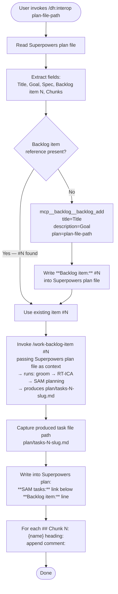

# DH Phase 2: Superpowers Plan Interop Adapter — Design

**Goal:** Route a Superpowers plan file through the `/work-backlog-item` pipeline to produce a SAM task file, then write back-references into the original plan.
**Phase:** 2 of the development-harness architecture refactor
**Depends on:** Phase 1 (complete)
**Design source:** This document

---

## Problem

Superpowers plans (`docs/superpowers/plans/YYYY-MM-DD-slug.md`) are self-contained execution documents for the `superpowers:subagent-driven-development` workflow. They describe chunks of work and drive implementation directly. They have three structural gaps:

1. **No backlog pipeline depth.** Superpowers plans bypass the groom → RT-ICA → SAM planning sequence that `/work-backlog-item` applies. Pre-flight trust gates (RT-ICA: requirements, technology, impact, constraints, architecture) are never run against the spec before implementation begins.

2. **No SAM task decomposition.** Without a `plan/tasks-N-slug.md`, there is no dependency graph, no per-task agent routing, and no hook-based status tracking. Implementation proceeds as a single undifferentiated agent run rather than a structured task sequence.

3. **No post-flight quality gates.** Code review, architecture review against the spec, and integration checking (`/complete-implementation`) are never encoded anywhere in the Superpowers workflow. They happen ad hoc or not at all.

The `/implement-feature` skill cannot process a Superpowers plan directly because it expects a SAM task file, not a Superpowers plan. The two formats are structurally incompatible.

---

## Solution

A `/dh:interop` skill acts as a routing adapter between the Superpowers format and the existing `/work-backlog-item` pipeline. It does not re-implement any pipeline logic. It:

1. Extracts structured fields from the Superpowers plan file.
2. Ensures a backlog item exists (creates one if absent).
3. Delegates entirely to `/work-backlog-item`, passing the plan file as context.
4. Writes back-references into the original Superpowers plan after the SAM task file is produced.

The Superpowers plan continues to drive execution via `superpowers:subagent-driven-development` unchanged. The SAM task file adds the pre-flight depth/trust gates (via `/work-backlog-item`'s groom + RT-ICA sequence) and encodes the post-flight quality gates (code review, architecture review, integration check) that `/complete-implementation` provides.

---

## Flow



---

## Superpowers Plan Format

The adapter reads the following fields from the Superpowers plan file:

| Field | Location in file | Required |
|-------|-----------------|----------|
| Title | First `# ` heading | Yes |
| Goal | `**Goal:**` field value | Yes |
| Spec | `**Spec:**` field value | No — logged if absent |
| Backlog item | `**Backlog item:** #N` field value | No — created if absent |
| Chunks | `## Chunk N: {name}` headings | Yes — at least one |

Example Superpowers plan header block:

```markdown
# Implement OAuth Token Refresh

**Goal:** Add automatic token refresh to the auth client so expired tokens are renewed without user intervention.
**Spec:** docs/specs/oauth-token-refresh.md
**Backlog item:** #47
**Status:** Draft
```

Example chunk heading:

```markdown
## Chunk 1: Token expiry detection
```

---

## Extraction Rules

Each field is extracted by exact pattern match against the raw file text. No inference or NLP.

### Title

- Pattern: first line matching `^# (.+)$`
- Fallback: if absent, abort with error — title is required to name the backlog item

### Goal

- Pattern: line matching `^\*\*Goal:\*\*\s*(.+)$`
- Captures the remainder of the line as the goal text
- Fallback: if absent, abort with error — goal is required as backlog item description

### Spec

- Pattern: line matching `^\*\*Spec:\*\*\s*(.+)$`
- Captures the remainder of the line (may be a file path or URL)
- Fallback: if absent, log a warning and continue — spec is not required for backlog creation

### Backlog item

- Pattern: line matching `^\*\*Backlog item:\*\*\s*#(\d+)$`
- Captures the integer issue number N
- Fallback: if absent, create a backlog item and write the reference into the file (see Flow step 3)

### Chunks

- Pattern: all lines matching `^## Chunk (\d+): (.+)$`
- Captures chunk number N and name for each heading
- Used only for back-reference annotation — not for SAM task creation (that is `/work-backlog-item`'s job)
- Fallback: if no chunks found, log a warning and skip the annotation step; do not abort

---

## Back-Reference Format

After `/work-backlog-item` completes and the SAM task file path is known, two writes are made to the Superpowers plan file.

### SAM tasks link

Inserted on the line immediately following the `**Backlog item:**` line:

```markdown
**SAM tasks:** [plan/tasks-N-slug.md](../../../plan/tasks-N-slug.md)
```

The relative path is computed from the Superpowers plan's directory (`docs/superpowers/plans/`) to the repo root and then to `plan/`. Three `../` levels are required for the standard Superpowers plan directory depth.

If the `**SAM tasks:**` line already exists (re-run scenario), it is replaced in-place rather than duplicated.

### Chunk annotations

Appended to the line immediately following each `## Chunk N:` heading — on a new line, as an HTML comment so it does not affect Superpowers rendering:

```markdown
## Chunk 3: Error handling and retry logic
<!-- SAM: T3 in plan/tasks-N-slug.md -->
```

The task number `T{N}` matches the chunk number `N`. This is a positional mapping — chunk 1 maps to T1, chunk 2 to T2, and so on. If the chunk count and SAM task count differ, annotations are written only for chunks that have a corresponding task number. Unmatched chunks get no annotation; unmatched tasks are silently ignored in this step.

If a chunk annotation already exists (re-run scenario), it is replaced in-place rather than duplicated.

---

## Skill Interface

**Skill location:** `plugins/development-harness/skills/interop/SKILL.md`

**Skill name (invocation):** `/dh:interop`

**Argument:** Path to a Superpowers plan file (relative to repo root or absolute)

**Example invocations:**

```text
/dh:interop docs/superpowers/plans/2026-03-11-oauth-token-refresh.md
/dh:interop docs/superpowers/plans/2026-02-28-manifest-discovery.md
```

**Argument validation:**

- File must exist and be readable — abort with error if not
- File must contain at least a `# ` heading and a `**Goal:**` field — abort if either is missing
- File path is passed as `$ARGUMENTS` in the SKILL.md

**Skill frontmatter:**

```yaml
---
description: Routes a Superpowers plan file through the /work-backlog-item pipeline — creates a SAM task file and writes back-references into the original plan
---
```

---

## Out of Scope

The following are explicitly not part of Phase 2:

- **Re-implementing groom, RT-ICA, or SAM planning.** These are delegated entirely to `/work-backlog-item`. The adapter does not reproduce any of that logic.
- **Converting the Superpowers plan into a SAM task file.** `/work-backlog-item` produces the SAM task file. The adapter only reads the Superpowers plan and writes back-references after the fact.
- **Modifying Superpowers workflow execution.** The plan still runs via `superpowers:subagent-driven-development` without any changes to that workflow. The SAM task file produced by the adapter is consumed by `/implement-feature` independently — the two pipelines run in parallel, not in sequence.
- **Automated chunk-to-task semantic mapping.** Chunk N maps to T{N} by position only. The adapter does not analyze chunk content to determine which SAM task corresponds to which chunk.
- **Bidirectional sync.** The adapter writes from Superpowers plan → SAM task file direction only. Changes to the SAM task file after creation are not propagated back to the Superpowers plan.
- **Parsing nested chunk structure.** Only top-level `## Chunk N:` headings are recognized. Sub-chunks or alternate heading levels are ignored.

---

## Success Criteria

Phase 2 is complete when all of the following are verified:

1. **Skill file exists and loads**: `plugins/development-harness/skills/interop/SKILL.md` exists and `/dh:interop` activates it without error.

2. **Extraction works on a real plan**: Given a Superpowers plan file with all four fields present (`# Title`, `**Goal:**`, `**Spec:**`, `**Backlog item:** #N`), the adapter extracts all four fields correctly without modification to the file.

3. **Backlog item creation**: Given a Superpowers plan file with no `**Backlog item:**` line, the adapter creates a backlog item via `mcp__backlog__backlog_add` and writes `**Backlog item:** #N` into the plan file. Verified by reading the plan file after execution and checking the `mcp__backlog__backlog_view` output for the new item.

4. **Pipeline delegation**: The adapter invokes `/work-backlog-item #N` with the plan file path as context, and a `plan/tasks-N-slug.md` file is produced. Verified by checking `plan/` for the new task file after execution.

5. **SAM tasks back-reference**: The Superpowers plan file contains `**SAM tasks:** [plan/tasks-N-slug.md](../../../plan/tasks-N-slug.md)` on the line immediately following `**Backlog item:**`. Verified by reading the file after execution.

6. **Chunk annotations**: Each `## Chunk N:` heading in the Superpowers plan file has `<!-- SAM: T{N} in plan/tasks-N-slug.md -->` on the following line. Verified by reading the file after execution.

7. **Re-run idempotency**: Running `/dh:interop` on the same plan file a second time does not duplicate `**SAM tasks:**` lines or chunk annotations — it replaces them in-place.

8. **Abort on missing required fields**: Running `/dh:interop` on a plan file missing either `# Title` or `**Goal:**` produces an error message and makes no changes to the file or backlog.
