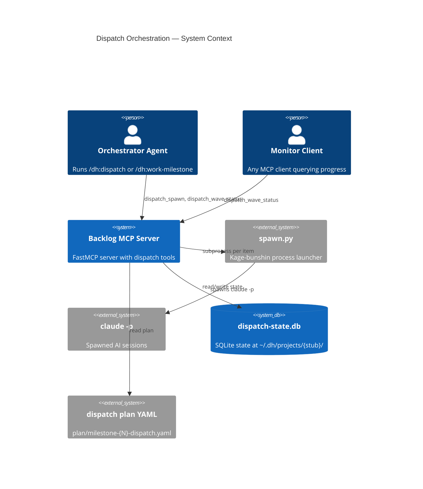
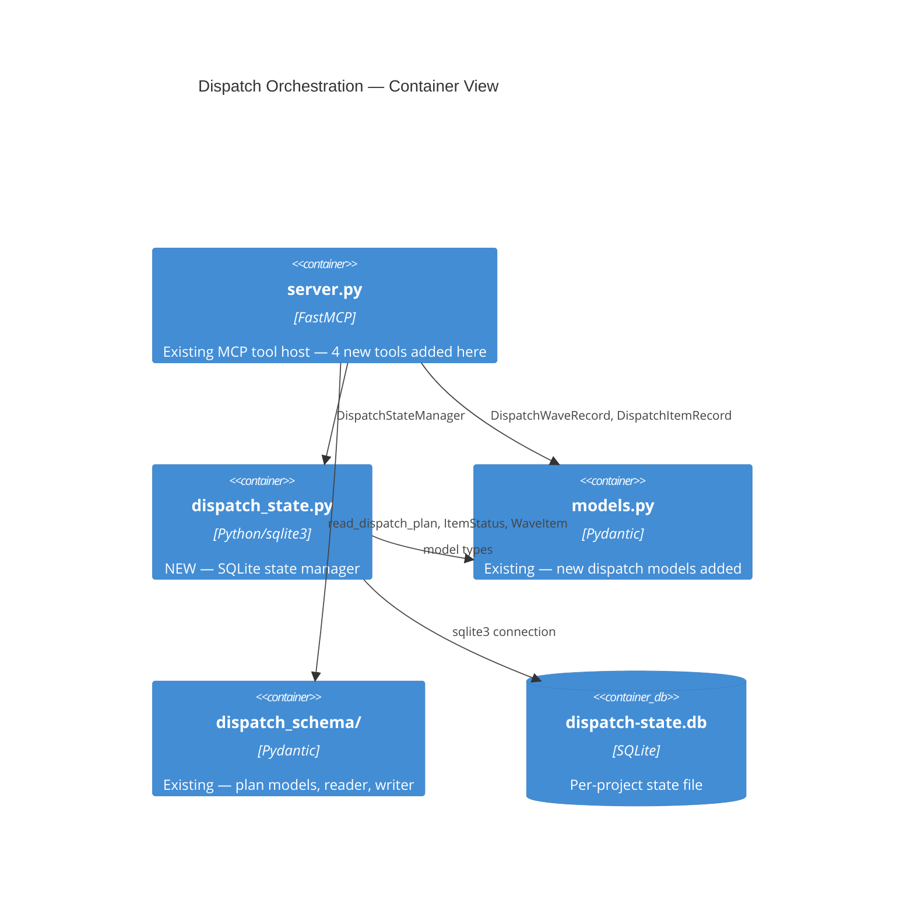
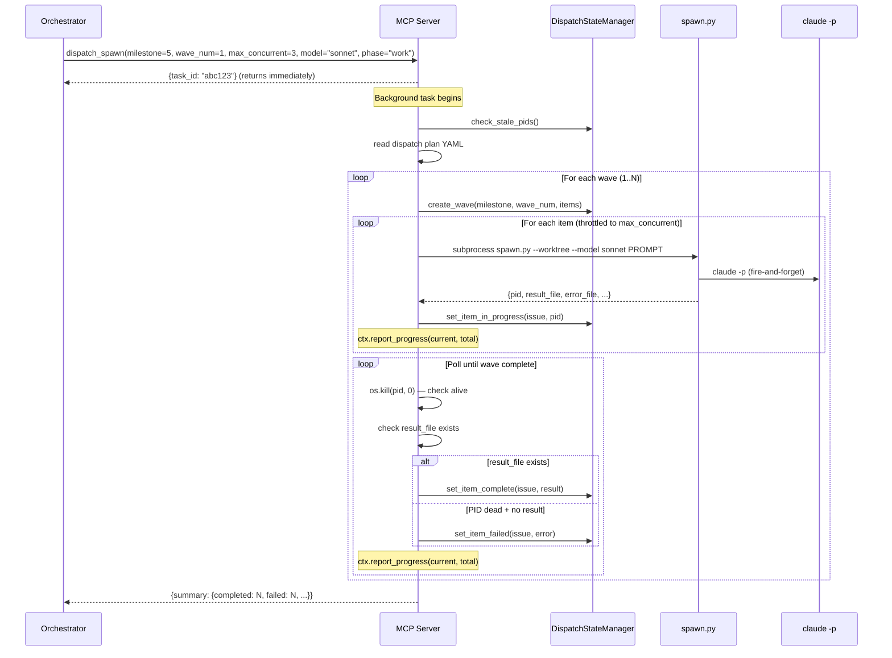
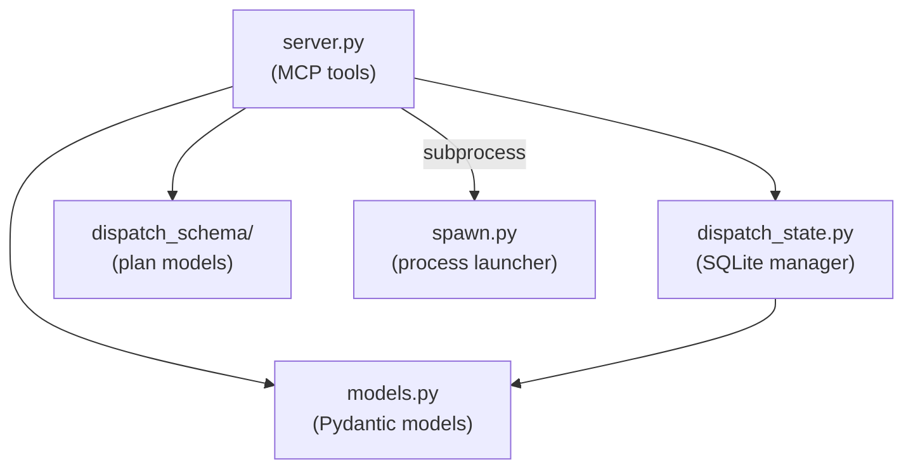
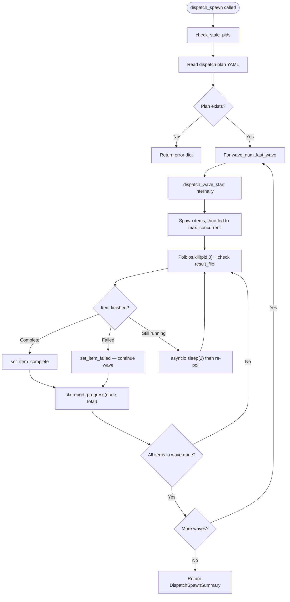
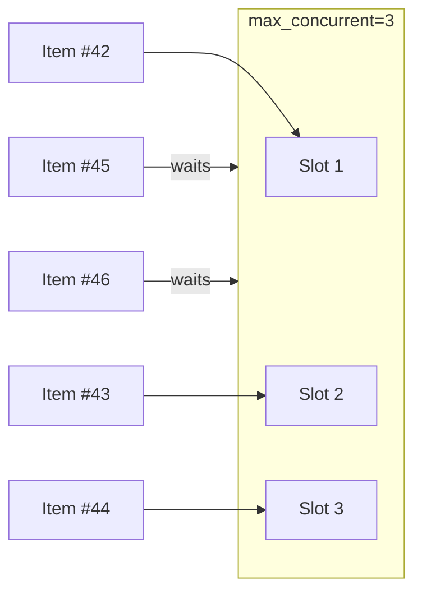

# Architecture: Dispatch Orchestration MCP Tools

## Document Metadata

- **Issue**: #986
- **Generated**: 2026-03-22
- **Status**: DRAFT
- **Inputs**: `plan/feature-context-dispatch-orchestration-mcp-tools.md`, `plan/codebase/dispatch-patterns.md`

---

## 1. Executive Summary

This architecture adds four MCP tools to the existing backlog server (`backlog_core/server.py`) that provide dispatch orchestration and state tracking for kage-bunshin process spawning. The tools bridge the gap between the existing dispatch DATA tools (read, validate, stale_check, conflicts) and the existing `spawn.py` process launcher by adding an EXECUTION and STATE layer.

The design introduces one new module (`dispatch_state.py`) containing a SQLite-backed state manager, and new Pydantic models in the existing `models.py`. All four tools are registered on the existing `mcp` FastMCP instance following the established `@mcp.tool` async pattern. The `dispatch_spawn` tool uses FastMCP's `task=True` parameter for background execution with Progress API reporting.

State is persisted to `~/.dh/projects/{project-stub}/dispatch-state.db` — outside git, shared across worktrees, surviving MCP server restarts. The `{project-stub}` is derived from the absolute repo root path using Claude Code's path-to-slug convention (replace `/` with `-`, strip leading `-`).

Key architectural decisions:
- **Multi-wave sequencing** in `dispatch_spawn` (iterates all waves, not single-wave)
- **PID monitoring by spawn loop** (spawned sessions do not call back)
- **Stale PID detection on startup** via `os.kill(pid, 0)`
- **Skip-on-failure** per item (wave continues when one item fails)
- **No quality gate integration** in v1 (caller's responsibility)
- **`fastmcp[tasks]`** dependency accepted for background task support

---

## 2. Architecture Overview

### C4 Context Diagram



### C4 Container Diagram



### Data Flow — dispatch_spawn Lifecycle



---

## 3. Technology Stack

All choices are drawn from the existing codebase or are minimal additions justified by the feature requirements.

| Component | Choice | Justification |
|-----------|--------|---------------|
| MCP framework | `fastmcp>=3.0.2` | Already in use. Server instance exists at `backlog_core/server.py` |
| Background tasks | `fastmcp[tasks]>=3.0.2` | Required for `task=True` on `dispatch_spawn`. Adds Docket dependency. Accepted per user decision |
| Data models | `pydantic>=2.12.3` | Already in use for all `backlog_core` models |
| SQLite | `sqlite3` (stdlib) | No additional dependency. User decision: stdlib sqlite3 |
| Process spawning | `subprocess` (stdlib) | Calls existing `spawn.py` as a subprocess |
| Dispatch plan I/O | `dispatch_schema` (local) | Already imported as `_ds` in server.py |
| YAML | `ruamel.yaml>=0.18.0` | Repo convention — already a dependency |
| Async wrapping | `asyncio.to_thread` (stdlib) | Established pattern for all sync I/O in server.py |

### No New Third-Party Dependencies Beyond `fastmcp[tasks]`

The `[tasks]` extra pulls in Docket for task scheduling. All other dependencies are already present in the PEP 723 block of `run_backlog_server.py` or are stdlib.

---

## 4. Component Design

### 4.1 New Module: `backlog_core/dispatch_state.py`

**Purpose**: SQLite-backed state manager for dispatch waves and items. Encapsulates all database I/O. No MCP or FastMCP awareness — pure state management.

**Class**: `DispatchStateManager`

```python
class DispatchStateManager:
    """SQLite state backend for dispatch orchestration.

    Creates database and tables on first use. All methods are synchronous
    (callers wrap in asyncio.to_thread). Thread-safe via sqlite3 check_same_thread=False.
    """

    def __init__(self, db_path: Path) -> None: ...

    # --- Lifecycle ---
    def ensure_schema(self) -> None: ...
    def close(self) -> None: ...

    # --- Wave operations ---
    def create_wave(
        self, milestone: int, wave_num: int, items: list[DispatchItemRecord],
    ) -> DispatchWaveRecord: ...

    def get_wave(self, milestone: int, wave_num: int) -> DispatchWaveRecord | None: ...

    def get_all_waves(self, milestone: int) -> list[DispatchWaveRecord]: ...

    # --- Item operations ---
    def set_item_in_progress(
        self, milestone: int, wave_num: int, issue: int, pid: int,
    ) -> None: ...

    def set_item_complete(
        self, milestone: int, wave_num: int, issue: int,
        result: str, cost: float | None = None,
    ) -> None: ...

    def set_item_failed(
        self, milestone: int, wave_num: int, issue: int,
        error: str,
    ) -> None: ...

    def get_item(
        self, milestone: int, wave_num: int, issue: int,
    ) -> DispatchItemRecord | None: ...

    def get_wave_items(
        self, milestone: int, wave_num: int,
    ) -> list[DispatchItemRecord]: ...

    # --- Stale PID detection ---
    def check_stale_pids(self) -> list[DispatchItemRecord]: ...
```

**Dependencies**: `sqlite3` (stdlib), `backlog_core.models` (for model types), `pathlib.Path`.

**Key design constraints**:
- All methods are synchronous. The server wraps calls in `asyncio.to_thread`.
- Connection uses `check_same_thread=False` because the same manager instance is used from multiple threads via `to_thread`.
- `ensure_schema()` is called in `__init__` — creates tables if they do not exist.
- `check_stale_pids()` queries all items with `status='in-progress'`, tests each PID via `os.kill(pid, 0)`, and marks dead PIDs as failed. Returns the list of items that were marked stale.

### 4.2 Modified Module: `backlog_core/models.py`

**Purpose**: Add dispatch state Pydantic models. No new file — extends existing module.

New models added (see Section 5 for full field definitions):
- `DispatchItemRecord` — per-item state row
- `DispatchWaveRecord` — per-wave summary with nested items
- `DispatchSpawnResult` — return shape from spawn.py JSON
- `DispatchWaveSummary` — aggregated wave status for tool return

### 4.3 Modified Module: `backlog_core/server.py`

**Purpose**: Register four new `@mcp.tool` functions. No business logic — tools delegate to `DispatchStateManager` and subprocess calls.

New additions:
- Module-level `_dispatch_state_manager()` lazy singleton (creates `DispatchStateManager` on first call)
- Module-level `_project_stub()` helper (derives project slug from `_models.BACKLOG_DIR`)
- `dispatch_wave_start` tool function
- `dispatch_item_status` tool function
- `dispatch_wave_status` tool function
- `dispatch_spawn` tool function (with `task=True`)

**Import additions**:
- `from .dispatch_state import DispatchStateManager`
- `from pathlib import Path` (move from TYPE_CHECKING to runtime — needed for db path construction)

### 4.4 Module Dependency Graph



### 4.5 Existing Module: No Changes Required

These modules are consumed as-is:
- `dispatch_schema/` — plan reading, `ItemStatus`, `WaveItem`, `DispatchPlan`
- `spawn.py` — invoked as subprocess, no code changes
- `dispatch_schema/paths.py` — `dispatch_plan_path()` via existing `_dispatch_plan_path()` helper

---

## 5. Data Architecture

### 5.1 SQLite Schema

Database location: `~/.dh/projects/{project-stub}/dispatch-state.db`

The `{project-stub}` derivation:
1. Take the absolute path of the project root (e.g., `/home/user/repos/claude_skills`)
2. Replace all `/` with `-`
3. Strip leading `-`
4. Result: `home-user-repos-claude_skills`

Two worktrees of the same repo produce different stubs (different absolute paths), which is correct — they may have different dispatch states. But the primary use case is the root worktree, and kage-bunshin worktrees do not run their own MCP servers.

```sql
CREATE TABLE IF NOT EXISTS waves (
    milestone    INTEGER NOT NULL,
    wave_num     INTEGER NOT NULL,
    status       TEXT NOT NULL DEFAULT 'pending',  -- pending | in-progress | complete | failed
    started_at   TEXT,          -- ISO 8601
    completed_at TEXT,          -- ISO 8601
    PRIMARY KEY (milestone, wave_num)
);

CREATE TABLE IF NOT EXISTS items (
    milestone    INTEGER NOT NULL,
    wave_num     INTEGER NOT NULL,
    issue        INTEGER NOT NULL,
    title        TEXT NOT NULL DEFAULT '',
    status       TEXT NOT NULL DEFAULT 'pending',  -- pending | in-progress | complete | failed | skipped
    pid          INTEGER,       -- OS process ID of spawned claude session
    started_at   TEXT,          -- ISO 8601
    completed_at TEXT,          -- ISO 8601
    result       TEXT,          -- JSON string from result_file, or error message
    error        TEXT,          -- error details on failure
    cost         REAL,          -- USD cost if available
    result_file  TEXT,          -- path to spawn.py result file
    error_file   TEXT,          -- path to spawn.py error file
    PRIMARY KEY (milestone, wave_num, issue),
    FOREIGN KEY (milestone, wave_num) REFERENCES waves(milestone, wave_num)
);

CREATE INDEX IF NOT EXISTS idx_items_status ON items(status);
CREATE INDEX IF NOT EXISTS idx_items_milestone ON items(milestone, wave_num);
```

### 5.2 Pydantic Models (added to `backlog_core/models.py`)

```python
class DispatchItemRecord(BaseModel):
    """State of a single dispatch item, maps to the items SQLite table."""

    milestone: int
    wave_num: int
    issue: int
    title: str = ""
    status: str = "pending"       # pending | in-progress | complete | failed | skipped
    pid: int | None = None
    started_at: str = ""          # ISO 8601
    completed_at: str = ""        # ISO 8601
    result: str = ""              # JSON string or summary
    error: str = ""
    cost: float | None = None
    result_file: str = ""
    error_file: str = ""


class DispatchWaveRecord(BaseModel):
    """State of a dispatch wave, maps to the waves SQLite table."""

    milestone: int
    wave_num: int
    status: str = "pending"       # pending | in-progress | complete | failed
    started_at: str = ""
    completed_at: str = ""
    items: list[DispatchItemRecord] = Field(default_factory=list)


class DispatchSpawnResult(BaseModel):
    """JSON output from spawn.py parsed into a typed model."""

    pid: int
    name: str = ""
    worktree: str | None = None
    result_file: str
    error_file: str
    model: str = "sonnet"
    lock_file: str | None = None


class DispatchWaveSummary(BaseModel):
    """Aggregated wave status returned by dispatch_wave_status tool."""

    milestone: int
    wave_num: int
    status: str
    total_items: int
    pending: int
    in_progress: int
    complete: int
    failed: int
    skipped: int
    started_at: str = ""
    completed_at: str = ""
    elapsed_seconds: float | None = None
    items: list[DispatchItemRecord] = Field(default_factory=list)


class DispatchSpawnSummary(BaseModel):
    """Final summary returned when dispatch_spawn background task completes."""

    milestone: int
    waves_executed: int
    total_items: int
    completed: int
    failed: int
    skipped: int
    elapsed_seconds: float
    per_wave: list[DispatchWaveSummary] = Field(default_factory=list)
    total_cost: float | None = None
```

### 5.3 Model Serialization Convention

New dispatch models are Pydantic `BaseModel` subclasses. They use `.model_dump()` for serialization — consistent with the Pydantic models in `backlog_core/models.py` (NOT `dataclasses.asdict()` which is only for `@dataclass(frozen=True)` types in `dispatch_schema/core/validator.py`).

### 5.4 Configuration Schema

No user-facing configuration files. The only configurable values are:
- **DB path**: derived automatically from project root
- **max_concurrent**: parameter on `dispatch_spawn` (default 3)
- **model**: parameter on `dispatch_spawn` (default "sonnet")

The `~/.dh/` directory is created by the `DispatchStateManager` on first use via `Path.mkdir(parents=True, exist_ok=True)`.

---

## 6. Tool Interface Contracts

### 6.1 `dispatch_wave_start`

Records the start of a wave in SQLite. Creates wave and item rows with status=pending.

```python
@mcp.tool
async def dispatch_wave_start(
    milestone: Annotated[int, Field(description="GitHub milestone number")],
    wave_num: Annotated[int, Field(description="Wave number from dispatch plan (1-based)")],
    items: Annotated[
        list[dict[str, object]],
        Field(description="List of items, each with 'issue' (int) and 'title' (str) keys"),
    ],
) -> dict:
    """Record the start of a dispatch wave.

    Creates wave and item entries in the state database. Items are initialized
    with status 'pending'. Call this before spawning processes for a wave.

    Returns:
        Dict with 'milestone', 'wave_num', 'items_count', 'status', and
        'messages'/'warnings'. Returns 'error' if the wave already exists.
    """
    ...
```

**Return shape (success)**:

```python
{
    "milestone": 5,
    "wave_num": 1,
    "items_count": 7,
    "status": "pending",
    "messages": ["Wave 1 created with 7 items"],
    "warnings": [],
    "errors": [],
}
```

**Return shape (error)**:

```python
{
    "error": "Wave 1 already exists for milestone 5",
    "milestone": 5,
    "wave_num": 1,
}
```

### 6.2 `dispatch_item_status`

Records completion or failure of a single item.

```python
@mcp.tool
async def dispatch_item_status(
    milestone: Annotated[int, Field(description="GitHub milestone number")],
    issue: Annotated[int, Field(description="Issue number of the item")],
    status: Annotated[
        str,
        Field(description="New status: 'complete', 'failed', or 'skipped'"),
    ],
    result: Annotated[str, Field(description="Result summary or JSON from result file")] = "",
    error: Annotated[str, Field(description="Error details on failure")] = "",
    cost: Annotated[float | None, Field(description="USD cost if available from claude output")] = None,
) -> dict:
    """Record completion or failure of a dispatch item.

    Looks up the item by milestone + issue across all waves. Updates status,
    result/error data, and completion timestamp.

    Returns:
        Dict with 'milestone', 'issue', 'wave_num', 'status', 'messages'/'warnings'.
        Returns 'error' key if item not found.
    """
    ...
```

**Return shape (success)**:

```python
{
    "milestone": 5,
    "issue": 42,
    "wave_num": 1,
    "status": "complete",
    "messages": ["Item #42 marked complete in wave 1"],
    "warnings": [],
    "errors": [],
}
```

**Design note**: The tool looks up the wave_num automatically from the items table (query by milestone + issue). The caller does not need to know which wave the item belongs to, though the return value includes it for transparency.

### 6.3 `dispatch_wave_status`

Queries current wave state from SQLite.

```python
@mcp.tool
async def dispatch_wave_status(
    milestone: Annotated[int, Field(description="GitHub milestone number")],
    wave_num: Annotated[int, Field(description="Wave number to query (1-based)")],
) -> dict:
    """Query the current status of a dispatch wave.

    Returns item-level detail grouped by status, with elapsed time and
    progress counts. Checks PIDs for in-progress items and marks dead ones
    as failed before returning.

    Returns:
        Dict with DispatchWaveSummary fields, or 'error' if wave not found.
    """
    ...
```

**Return shape (success)**:

```python
{
    "milestone": 5,
    "wave_num": 1,
    "status": "in-progress",
    "total_items": 7,
    "pending": 0,
    "in_progress": 2,
    "complete": 4,
    "failed": 1,
    "skipped": 0,
    "started_at": "2026-03-22T14:30:00Z",
    "completed_at": "",
    "elapsed_seconds": 342.5,
    "items": [
        {"milestone": 5, "wave_num": 1, "issue": 42, "title": "...", "status": "complete", ...},
        ...
    ],
    "messages": [],
    "warnings": ["PID 12345 for issue #99 is dead — marked failed"],
    "errors": [],
}
```

**Stale PID behavior**: Before returning, this tool checks all in-progress items. For each, it calls `os.kill(pid, 0)`. If the PID is dead (`ProcessLookupError`), the item is marked failed with error "Process died unexpectedly (PID {pid})". The warning is included in the response.

### 6.4 `dispatch_spawn`

Background orchestration loop. This is the primary tool for executing a dispatch.

```python
@mcp.tool(task=True)
async def dispatch_spawn(
    milestone: Annotated[int, Field(description="GitHub milestone number")],
    wave_num: Annotated[int, Field(description="Starting wave number (1-based). Runs this wave and all subsequent waves")],
    ctx: Context,
    max_concurrent: Annotated[int, Field(description="Maximum concurrent spawned sessions")] = 3,
    model: Annotated[str, Field(description="Model identifier for spawned sessions")] = "sonnet",
    phase: Annotated[str, Field(description="Dispatch phase: 'groom' (no worktree) or 'work' (with worktree)")] = "work",
) -> dict:
    """Spawn and monitor kage-bunshin sessions for a dispatch wave.

    Runs as a background task (task=True). Returns a task ID immediately.
    The background task:
    1. Detects and marks stale PIDs from prior runs
    2. Reads the dispatch plan to get wave items
    3. Iterates waves from wave_num through the last wave
    4. For each wave: spawns items throttled to max_concurrent, monitors PIDs,
       reads result files, and reports progress via ctx.report_progress()
    5. On item failure: marks failed, continues with remaining items
    6. Returns a DispatchSpawnSummary when all waves complete

    Returns:
        Dict with DispatchSpawnSummary fields on completion, or 'error' on failure.
    """
    ...
```

**Background task behavior**:



**spawn.py invocation**:

The tool constructs a subprocess command per item:

```text
uv run {spawn_script_path} [--worktree] [--branch {integration_branch}] --model {model} --name "dispatch-{milestone}-{issue}" PROMPT
```

- `--worktree` is included when `phase="work"`, omitted when `phase="groom"`
- `--branch` is the `integration_branch` from the dispatch plan's `MilestoneHeader`
- `spawn_script_path` is resolved relative to the plugin root: `skills/kage-bunshin/scripts/spawn.py`
- `PROMPT` is constructed from the wave item's title and issue number

**spawn.py location resolution**:

```python
_SPAWN_SCRIPT: Path  # resolved at module level or lazily
# plugins/development-harness/skills/kage-bunshin/scripts/spawn.py
# Resolved from: Path(__file__).parent.parent / "skills" / "kage-bunshin" / "scripts" / "spawn.py"
```

**Concurrency throttle mechanism**:

Uses an `asyncio.Semaphore(max_concurrent)` to limit concurrent spawns. Each item acquire-release cycle:
1. Acquire semaphore
2. Spawn subprocess (non-blocking — `asyncio.create_subprocess_exec`)
3. Parse JSON output to get PID, result_file, error_file
4. Record in-progress in SQLite
5. Start monitoring coroutine for this item
6. Monitoring coroutine releases semaphore when item completes

**Progress reporting**:

Uses FastMCP Context's `report_progress(progress, total)`:
- `total` = number of items across all waves being executed
- `progress` = number of items completed (any terminal status)
- Message via `ctx.info()`: `"Wave {N}: {done}/{total} items — {in_progress} running, {failed} failed"`

**Return shape (success)**:

```python
{
    "milestone": 5,
    "waves_executed": 2,
    "total_items": 12,
    "completed": 10,
    "failed": 2,
    "skipped": 0,
    "elapsed_seconds": 1834.7,
    "per_wave": [
        {"milestone": 5, "wave_num": 1, "status": "complete", "total_items": 7, ...},
        {"milestone": 5, "wave_num": 2, "status": "complete", "total_items": 5, ...},
    ],
    "total_cost": 2.47,
    "messages": ["Dispatch complete: 10/12 items succeeded"],
    "warnings": ["Item #88 failed: process exited with code 1"],
    "errors": [],
}
```

---

## 7. Security Architecture

### 7.1 Credential Management

- No new credentials introduced. The spawned `claude -p` sessions inherit the parent environment (including `GITHUB_TOKEN`, `ANTHROPIC_API_KEY`)
- SQLite database at `~/.dh/` is user-owned, mode 0700 directory — no cross-user access

### 7.2 Path Traversal

- `spawn.py` path is resolved at module level from `__file__`, not from user input
- SQLite DB path is derived from `_models.BACKLOG_DIR` (server-controlled), not user-supplied
- Dispatch plan path uses the existing `_dispatch_plan_path()` helper which delegates to `dispatch_schema.dispatch_plan_path()` — no user-controlled path components

### 7.3 Subprocess Safety

- `spawn.py` is invoked via `subprocess.Popen` with a list of arguments (no `shell=True`)
- The PROMPT argument passed to `spawn.py` is constructed from the wave item title (from the dispatch plan YAML, which is a committed file) and issue number — not from direct user input to the MCP tool
- PID validation uses `os.kill(pid, 0)` (signal 0 — does not actually send a signal, only checks existence)

### 7.4 Security Checklist

- [ ] No `shell=True` in subprocess calls
- [ ] No user-controlled file paths in SQLite operations
- [ ] DB directory created with restrictive permissions
- [ ] No secrets logged in result/error fields (spawn.py controls what goes into result files)
- [ ] PID check uses signal 0 only (no process manipulation)

---

## 8. Testing Architecture

### 8.1 Testing Stack

- `pytest` with `pytest-asyncio` for async tool tests
- `pytest-cov` for coverage reporting
- Coverage target: 80% minimum for `dispatch_state.py`, 60% for tool functions in `server.py` (integration-heavy)

### 8.2 Test File Location

```text
plugins/development-harness/tests/
    test_dispatch_state.py          # Unit tests for DispatchStateManager
    test_dispatch_tools.py          # Integration tests for MCP tool functions
```

### 8.3 Unit Tests: `test_dispatch_state.py`

Test the `DispatchStateManager` class in isolation with a temporary SQLite database.

**Fixtures**:
- `tmp_db(tmp_path)` — creates a `DispatchStateManager` with `tmp_path / "test.db"`
- `populated_wave(tmp_db)` — creates a wave with 3 items in various states

**Test cases**:
- Schema creation (tables exist after init)
- `create_wave` — creates wave + items, returns correct record
- `create_wave` duplicate — returns error or raises on duplicate wave
- `set_item_in_progress` — updates status, records PID and started_at
- `set_item_complete` — updates status, records result, completed_at
- `set_item_failed` — updates status, records error
- `get_wave` — returns wave with nested items
- `get_wave` not found — returns None
- `get_wave_items` — returns items for a wave
- `check_stale_pids` — with a dead PID, marks item failed
- `check_stale_pids` — with a live PID (own process), leaves item unchanged
- Thread safety — concurrent `to_thread` calls do not corrupt state

### 8.4 Integration Tests: `test_dispatch_tools.py`

Test the MCP tool functions with mocked subprocess and filesystem.

**Fixtures**:
- `mock_dispatch_plan(tmp_path)` — writes a valid dispatch YAML, patches `_dispatch_plan_path`
- `mock_spawn_py(monkeypatch)` — patches subprocess to return spawn.py JSON without launching real processes
- `mock_state_manager(tmp_path)` — patches `_dispatch_state_manager()` to use temp DB

**Test cases**:
- `dispatch_wave_start` — creates wave, returns correct shape
- `dispatch_wave_start` duplicate — returns error dict
- `dispatch_item_status` — marks item complete
- `dispatch_item_status` not found — returns error dict
- `dispatch_wave_status` — returns summary with correct counts
- `dispatch_wave_status` with stale PID — warnings included
- `dispatch_spawn` — end-to-end with mocked subprocess (verify items transition through states)

### 8.5 pytest Configuration

```toml
[tool.pytest.ini_options]
asyncio_mode = "auto"
testpaths = ["tests"]
```

This is added to the existing `pyproject.toml` if not already present.

---

## 9. Distribution Architecture

### 9.1 PEP 723 Update

The `scripts/run_backlog_server.py` PEP 723 block must be updated to add `fastmcp[tasks]`:

```python
# /// script
# requires-python = ">=3.11"
# dependencies = [
#   "fastmcp[tasks]>=3.0.2",    # changed from "fastmcp>=3.0.2"
#   "gitpython>=3.1.0",
#   "pygithub>=2.8.1",
#   "pydantic>=2.12.3",
#   "python-frontmatter>=1.1.0",
#   "ruamel.yaml>=0.18.0",
#   "tiktoken>=0.12.0",
#   "typer>=0.21.2",
# ]
# ///
```

### 9.2 Dev Dependencies

Per the PEP 723 dual-install rule, also add to the project's `pyproject.toml`:

```bash
uv add --dev "fastmcp[tasks]>=3.0.2"
```

This ensures IDE autocompletion, ruff, and ty/pyright resolve the `fastmcp` task imports.

### 9.3 No New Entry Points

No new scripts, CLIs, or MCP servers. All four tools are added to the existing `backlog` MCP server. No changes to `plugin.json` are needed — the server entry point (`scripts/run_backlog_server.py`) is unchanged.

---

## 10. Architectural Decisions (ADRs)

### ADR-1: SQLite over In-Memory State

**Context**: Dispatch state (wave progress, item PIDs, completion results) must survive MCP server restarts and be queryable by multiple clients.

**Decision**: Use SQLite at `~/.dh/projects/{project-stub}/dispatch-state.db` with stdlib `sqlite3`.

**Alternatives considered**:
- In-memory dict: lost on server restart, not queryable by other clients
- JSON file: no concurrent write safety, no atomic updates
- Redis/external DB: over-engineered for single-machine use case

**Consequences**: Adds filesystem state outside git. `~/.dh/` directory convention must be documented. No new dependencies.

### ADR-2: Multi-Wave Sequencing in dispatch_spawn

**Context**: `dispatch_spawn` could execute a single wave (caller manages sequencing) or iterate all waves.

**Decision**: Multi-wave. `dispatch_spawn` iterates from `wave_num` through the last wave in the plan. Each wave completes before the next starts.

**Rationale**: The background task model (task=True) makes multi-wave natural — the caller gets a task ID and can monitor progress. Single-wave would require the caller to chain multiple task invocations and handle inter-wave transitions.

**Consequences**: The tool is less composable (can't skip a wave mid-execution). Mitigation: the tool starts from `wave_num`, so partial execution is possible by specifying a later starting wave.

### ADR-3: PID Monitoring by Spawn Loop (Not Callback)

**Context**: Two options for tracking item completion: (A) the spawn loop monitors PIDs and reads result files, or (B) spawned sessions call `dispatch_item_status` via MCP.

**Decision**: Option A — the spawn loop monitors.

**Rationale**: Spawned kage-bunshin sessions are independent `claude -p` processes that do not have MCP client capability. Adding MCP client code to spawned sessions would require changes to spawn.py and the spawned prompts. PID monitoring + result file reading is simpler and keeps kage-bunshin sessions unchanged.

**Consequences**: The spawn loop must poll PIDs (via `os.kill(pid, 0)`) and check result files. This adds a polling loop with `asyncio.sleep()` intervals. The `dispatch_item_status` tool still exists for manual/external status updates — it is not solely for the spawn loop.

### ADR-4: fastmcp[tasks] Dependency

**Context**: `dispatch_spawn` needs to run as a background task with progress reporting. FastMCP's `task=True` parameter provides this natively but requires the `[tasks]` extra (Docket).

**Decision**: Accept the dependency. Add `fastmcp[tasks]>=3.0.2` to both PEP 723 block and dev deps.

**Alternatives considered**:
- Manual `asyncio.create_task` + custom polling: would require reimplementing task tracking, progress reporting, and the MCP tasks protocol from scratch
- Fire-and-forget with separate status tool: loses the structured progress reporting that MCP clients can consume

**Consequences**: Adds Docket to the dependency tree. Docket is a lightweight task runner — acceptable for a development tool.

### ADR-5: Skip-on-Failure (No Wave Halt)

**Context**: When a spawned item fails, the wave could halt (fail-fast) or continue (skip-on-failure).

**Decision**: Skip-on-failure. A failed item is marked failed, and remaining items in the wave continue.

**Rationale**: Dispatch items are independent backlog issues. One issue's failure does not invalidate another's work. Halting wastes the work already in-progress. The caller can inspect failures via `dispatch_wave_status` after completion.

**Consequences**: The final summary may show a mix of completed and failed items. Quality gates (if needed) are the caller's responsibility to run between waves.

### ADR-6: Project Stub Derivation

**Context**: The SQLite DB path includes `{project-stub}` to isolate per-project state.

**Decision**: Derive from absolute repo root path: replace `/` with `-`, strip leading `-`. Example: `/home/user/repos/claude_skills` becomes `home-user-repos-claude_skills`.

**Rationale**: This matches Claude Code's internal path-to-slug convention. It is deterministic, requires no git remote access, and distinguishes separate clones of the same repo (which may have different dispatch states).

**Alternatives considered**:
- Git remote URL slug: requires git remote access, fails in detached-HEAD or bare repos
- Repo directory name alone: collides when two repos share a name
- SHA256 hash of path: unique but opaque and hard to find on disk

**Consequences**: Different worktrees of the same repo get different stubs. This is acceptable because kage-bunshin worktrees do not run their own MCP servers — only the root worktree's server manages dispatch state.

---

## 11. Scalability Strategy

### 11.1 Async Pattern: to_thread for Sync I/O

All SQLite operations in `DispatchStateManager` are synchronous. The MCP tool functions wrap them in `asyncio.to_thread()`, consistent with every other tool in `server.py`.

```python
# Pattern used throughout:
wave = await asyncio.to_thread(state_mgr.create_wave, milestone, wave_num, items)
```

### 11.2 Concurrency: Semaphore-Based Throttle

`dispatch_spawn` uses `asyncio.Semaphore(max_concurrent)` to limit concurrent spawned processes.



Each item is spawned as an `asyncio.create_subprocess_exec` call (to run `spawn.py`). The subprocess itself is fire-and-forget (spawn.py returns immediately after launching `claude -p`). The semaphore controls how many items are in the "spawned and being monitored" state simultaneously.

### 11.3 Monitoring Loop

After spawning, each item is monitored by a coroutine that:
1. Sleeps for 2 seconds
2. Checks `os.kill(pid, 0)` — if `ProcessLookupError`, the process is dead
3. Checks if `result_file` exists and is non-empty — if yes, reads and parses result
4. If process dead and no result file: mark failed
5. If process dead and result file exists: mark complete (or failed based on result content)
6. If process alive: loop back to step 1
7. On completion (any terminal state): release semaphore slot

### 11.4 Resource Cleanup

- **SQLite connections**: `DispatchStateManager` holds a single connection. The `close()` method is called during server shutdown (registered via `atexit` or FastMCP lifecycle hooks if available).
- **Subprocess handles**: spawn.py launches `claude -p` via `Popen` and exits. The dispatch_spawn tool only holds the PID — no open file handles or subprocess objects persist after the spawn.py process exits.
- **Result files**: Located in `/tmp/kage-bunshin/` (spawn.py default). Not cleaned up by dispatch tools — they are diagnostic artifacts. Cleanup is the user's responsibility or a future enhancement.

### 11.5 Failure Modes and Recovery

| Failure | Detection | Recovery |
|---------|-----------|----------|
| spawn.py fails to launch | subprocess exit code != 0 | Mark item failed, continue wave |
| claude -p crashes mid-execution | PID dead + no result file | Mark item failed via stale PID check |
| MCP server restarts mid-dispatch | Stale PIDs in DB | `check_stale_pids()` on next tool call marks dead items failed |
| SQLite write failure | sqlite3.OperationalError propagates | Tool returns error dict — caller retries |
| Dispatch plan file missing | FileNotFoundError from `read_dispatch_plan` | dispatch_spawn returns error dict before spawning anything |

### 11.6 Lazy Singleton for State Manager

The `DispatchStateManager` is created lazily on first dispatch tool call, not at server startup. This avoids creating `~/.dh/` directories and SQLite databases for users who never use dispatch tools.

```python
_state_mgr: DispatchStateManager | None = None

def _dispatch_state_manager() -> DispatchStateManager:
    global _state_mgr  # noqa: PLW0603
    if _state_mgr is None:
        db_path = Path.home() / ".dh" / "projects" / _project_stub() / "dispatch-state.db"
        db_path.parent.mkdir(parents=True, exist_ok=True)
        _state_mgr = DispatchStateManager(db_path)
    return _state_mgr

def _project_stub() -> str:
    project_root = _models.BACKLOG_DIR.parent.parent
    return str(project_root).lstrip("/").replace("/", "-")
```
