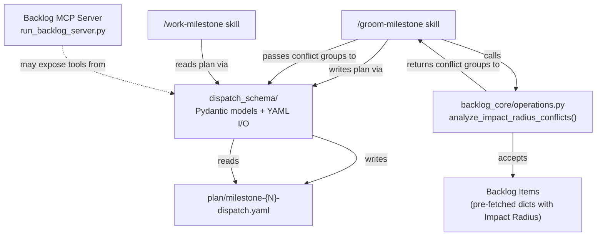
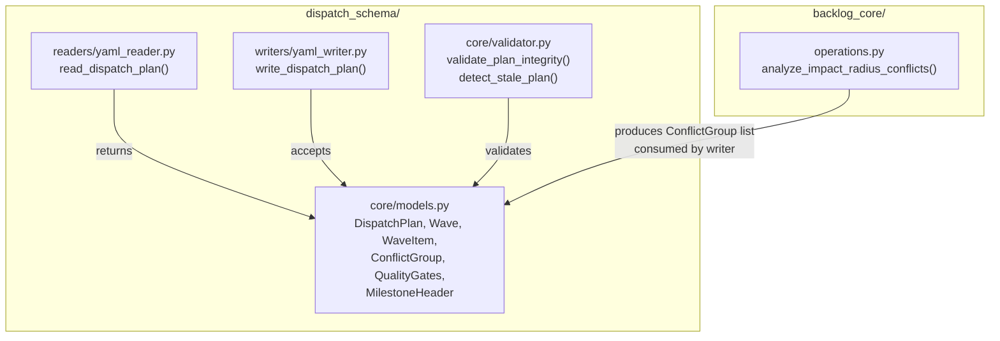

# Architecture Spec: Dispatch Plan Tooling for Milestone Orchestration

**Story Issue**: #920
**Feature Context**: [plan/feature-context-dispatch-plan-tooling.md](./feature-context-dispatch-plan-tooling.md)
**Design Source**: [.claude/reports/milestone-orchestration-design-20260320.md](../.claude/reports/milestone-orchestration-design-20260320.md)

---

## 1. Executive Summary

The dispatch plan tooling is a library-only Python module (`dispatch_schema/`) within the `development-harness` plugin that provides structured read, write, validation, and conflict analysis for milestone dispatch plan YAML files (`plan/milestone-{N}-dispatch.yaml`).

The module mirrors the established `sam_schema/` architecture: Pydantic models define the schema, `ruamel.yaml` handles I/O, and pure functions provide validation and conflict analysis. No CLI entry point is exposed -- consumers are the `/groom-milestone` and `/work-milestone` skills, plus the backlog MCP server which may expose dispatch operations as tools.

A companion function `analyze_impact_radius_conflicts()` is added to `backlog_core/operations.py` to compute file-path overlap between groomed backlog items, producing conflict groups that feed into wave assignment.

The design prioritizes:

- **Consistency**: same patterns as `sam_schema/` (Pydantic + ruamel.yaml + atomic writes)
- **Testability**: pure functions accepting pre-fetched data, no GitHub calls inside the module
- **Determinism**: wave assignment from the same input always produces the same plan

## 2. Architecture Overview

### C4 Context Diagram



### C4 Container Diagram



### Module Layout

```text
plugins/development-harness/
  dispatch_schema/
    __init__.py                 # Public API re-exports
    core/
      __init__.py
      models.py                 # Pydantic models
      validator.py              # Plan integrity + stale detection
    readers/
      __init__.py
      yaml_reader.py            # ruamel.yaml reader
    writers/
      __init__.py
      yaml_writer.py            # ruamel.yaml atomic writer
  backlog_core/
    operations.py               # + analyze_impact_radius_conflicts()
```

## 3. Technology Stack

| Component | Choice | Justification |
|-----------|--------|---------------|
| Data models | Pydantic v2 | Same as `sam_schema/core/models.py`. `ConfigDict(populate_by_name=True)`, `AliasChoices` for kebab-case YAML to snake_case Python. |
| YAML I/O | `ruamel.yaml` (round-trip mode) | Repository standard (`.claude/rules/yaml-toml-libraries.md`). Preserves comments and field order. Same as `sam_schema/`. |
| Enums | `StrEnum` | Python 3.11+ stdlib. Used by `sam_schema` for status enums. |
| Type hints | Python 3.11+ native | `from __future__ import annotations` for forward refs. No `Optional[]` or `List[]`. |
| Atomic writes | `tempfile` + `os.rename` | Same pattern as `sam_schema/writers/yaml_writer.py`. Prevents partial files on crash. |
| Testing | pytest 8+, pytest-mock, pytest-cov | Repository standard. See Testing Architecture section. |
| Type checking | Project-detected (basedpyright/mypy) | Repository standard. |
| Linting | ruff | Repository standard. |

## 4. Component Design

### 4.1 core/models.py -- Pydantic Models

**Purpose**: Define the canonical data model for dispatch plan YAML files. All readers normalize to these models; all writers serialize from them.

**Dependencies**: `pydantic`, `enum`

```python
from __future__ import annotations

from enum import StrEnum
from pydantic import AliasChoices, BaseModel, ConfigDict, Field, field_validator

class ItemPriority(StrEnum):
    P0 = "P0"
    P1 = "P1"
    P2 = "P2"
    P3 = "P3"

class ItemStatus(StrEnum):
    """Dispatch-level status for a wave item (not the same as SAM TaskStatus)."""
    PENDING = "pending"
    IN_PROGRESS = "in-progress"
    COMPLETE = "complete"
    FAILED = "failed"
    SKIPPED = "skipped"

class MilestoneHeader(BaseModel):
    """Top-level milestone identification block."""
    model_config = ConfigDict(populate_by_name=True, use_enum_values=True)

    number: int = Field(..., ge=1)
    title: str = Field(..., min_length=1)
    integration_branch: str = Field(
        ...,
        validation_alias=AliasChoices("integration_branch", "integration-branch"),
    )

class ConflictGroup(BaseModel):
    """A set of backlog items whose Impact Radii overlap at the file level."""
    model_config = ConfigDict(populate_by_name=True, use_enum_values=True)

    group_id: int = Field(
        ...,
        ge=1,
        validation_alias=AliasChoices("group_id", "group-id"),
    )
    reason: str = Field(..., min_length=1)
    items: list[str] = Field(..., min_length=2)

class WaveItem(BaseModel):
    """A single backlog item assigned to a wave."""
    model_config = ConfigDict(populate_by_name=True, use_enum_values=True)

    title: str = Field(..., min_length=1)
    issue: int = Field(..., ge=1)
    priority: ItemPriority
    conflict_group: int | None = Field(
        default=None,
        validation_alias=AliasChoices("conflict_group", "conflict-group"),
    )
    depends_on: list[int] = Field(
        default_factory=list,
        validation_alias=AliasChoices("depends_on", "depends-on"),
    )
    status: ItemStatus = Field(default=ItemStatus.PENDING)

class Wave(BaseModel):
    """An ordered execution wave containing parallelizable items."""
    model_config = ConfigDict(populate_by_name=True, use_enum_values=True)

    wave: int = Field(..., ge=1)
    parallel: bool = Field(default=True)
    items: list[WaveItem] = Field(..., min_length=1)

class QualityGates(BaseModel):
    """Commands to run at pre-merge and post-merge checkpoints."""
    model_config = ConfigDict(populate_by_name=True, use_enum_values=True)

    pre_merge: list[str] = Field(
        default_factory=list,
        validation_alias=AliasChoices("pre_merge", "pre-merge"),
    )
    post_merge: list[str] = Field(
        default_factory=list,
        validation_alias=AliasChoices("post_merge", "post-merge"),
    )

class DispatchPlan(BaseModel):
    """Root model for plan/milestone-{N}-dispatch.yaml."""
    model_config = ConfigDict(populate_by_name=True, use_enum_values=True)

    milestone: MilestoneHeader
    conflict_groups: list[ConflictGroup] = Field(
        default_factory=list,
        validation_alias=AliasChoices("conflict_groups", "conflict-groups"),
    )
    waves: list[Wave] = Field(..., min_length=1)
    quality_gates: QualityGates = Field(
        default_factory=QualityGates,
        validation_alias=AliasChoices("quality_gates", "quality-gates"),
    )
```

### 4.2 readers/yaml_reader.py

**Purpose**: Read `plan/milestone-{N}-dispatch.yaml` and return a validated `DispatchPlan` model.

**Dependencies**: `ruamel.yaml`, `dispatch_schema.core.models`

```python
from __future__ import annotations

from pathlib import Path
from dispatch_schema.core.models import DispatchPlan

def read_dispatch_plan(path: Path) -> DispatchPlan:
    """Read and validate a dispatch plan YAML file.

    Args:
        path: Path to milestone-{N}-dispatch.yaml file.

    Returns:
        Validated DispatchPlan model.

    Raises:
        FileNotFoundError: If path does not exist.
        ValueError: If YAML is malformed or fails Pydantic validation.
    """
    ...
```

### 4.3 writers/yaml_writer.py

**Purpose**: Write a `DispatchPlan` model to YAML with atomic rename. Uses kebab-case keys in output YAML (matching the schema in the design doc).

**Dependencies**: `ruamel.yaml`, `tempfile`, `os`, `dispatch_schema.core.models`

```python
from __future__ import annotations

from pathlib import Path
from dispatch_schema.core.models import DispatchPlan

def write_dispatch_plan(plan: DispatchPlan, path: Path) -> Path:
    """Write a dispatch plan to YAML using atomic rename.

    Serializes with kebab-case keys. Uses ruamel.yaml round-trip mode.
    Writes to a temp file in the same directory, then renames atomically.

    Args:
        plan: Validated DispatchPlan model to serialize.
        path: Target file path (e.g., plan/milestone-3-dispatch.yaml).

    Returns:
        The path written to (same as input path on success).

    Raises:
        OSError: If the write or rename fails.
    """
    ...
```

### 4.4 core/validator.py

**Purpose**: Validate plan structural integrity and detect stale plans.

**Dependencies**: `dispatch_schema.core.models`

```python
from __future__ import annotations

from dataclasses import dataclass

from dispatch_schema.core.models import DispatchPlan

@dataclass(frozen=True)
class ValidationResult:
    """Result of plan validation."""
    is_valid: bool
    errors: list[str]
    warnings: list[str]

@dataclass(frozen=True)
class StalePlanResult:
    """Result of stale plan detection."""
    is_stale: bool
    added_issues: list[int]
    removed_issues: list[int]
    message: str

def validate_plan_integrity(plan: DispatchPlan) -> ValidationResult:
    """Validate structural integrity of a dispatch plan.

    Checks:
    - All conflict_group references in WaveItems point to existing ConflictGroup.group_id values
    - All depends_on issue numbers exist in some wave
    - Wave ordering is consistent: depends_on references only point to items in earlier waves
    - No item appears in multiple waves
    - Items in the same conflict group are never in the same wave with parallel=True
      (unless they have a dependency chain forcing sequential execution)

    Args:
        plan: DispatchPlan model to validate.

    Returns:
        ValidationResult with is_valid=True if all checks pass, or errors/warnings.
    """
    ...

def detect_stale_plan(
    plan: DispatchPlan,
    current_issue_numbers: list[int],
) -> StalePlanResult:
    """Detect whether the plan matches the current milestone state.

    Compares issue numbers in the plan's waves against the provided current
    issue numbers. Reports added (in milestone but not in plan) and removed
    (in plan but not in milestone) items.

    Args:
        plan: DispatchPlan loaded from disk.
        current_issue_numbers: Issue numbers currently in the milestone
            (pre-fetched by caller from GitHub).

    Returns:
        StalePlanResult. is_stale=True if any added or removed issues found.
    """
    ...
```

### 4.5 backlog_core/operations.py -- analyze_impact_radius_conflicts()

**Purpose**: Compute conflict groups from Impact Radius overlap. Pure computation -- accepts pre-fetched item data, makes no GitHub calls.

**Dependencies**: `dispatch_schema.core.models.ConflictGroup`

Impact Radius is a markdown section in each backlog item body containing file paths. The function parses these as strings and extracts paths. Two items conflict if they share any file path.

```python
from __future__ import annotations

from dispatch_schema.core.models import ConflictGroup

def analyze_impact_radius_conflicts(
    items: list[dict[str, object]],
) -> list[ConflictGroup]:
    """Compute conflict groups from Impact Radius file-path overlap.

    Each item dict must contain:
    - "title" (str): item title for ConflictGroup.items list
    - "issue" (int): issue number
    - "impact_radius" (str): markdown section body containing file paths
      (one per line, optionally with bullet markers)

    Two items form a conflict group when they share any file path (exact
    string match after stripping whitespace and bullet markers).

    Items with no impact_radius or empty impact_radius are excluded from
    conflict analysis (they conflict with nothing).

    When three or more items overlap pairwise, they are merged into a
    single conflict group using union-find. Example: if A overlaps B and
    B overlaps C but A does not overlap C, all three are in one group.

    Args:
        items: Pre-fetched backlog item dicts with Impact Radius content.

    Returns:
        List of ConflictGroup models. Items with no file overlap are not
        included in any group. Returns empty list if no conflicts found.
    """
    ...
```

### 4.6 dispatch_schema/__init__.py -- Public API

```python
from dispatch_schema.core.models import (
    ConflictGroup,
    DispatchPlan,
    ItemPriority,
    ItemStatus,
    MilestoneHeader,
    QualityGates,
    Wave,
    WaveItem,
)
from dispatch_schema.core.validator import (
    StalePlanResult,
    ValidationResult,
    detect_stale_plan,
    validate_plan_integrity,
)
from dispatch_schema.readers.yaml_reader import read_dispatch_plan
from dispatch_schema.writers.yaml_writer import write_dispatch_plan

__all__: list[str] = [
    "ConflictGroup",
    "DispatchPlan",
    "ItemPriority",
    "ItemStatus",
    "MilestoneHeader",
    "QualityGates",
    "StalePlanResult",
    "ValidationResult",
    "Wave",
    "WaveItem",
    "detect_stale_plan",
    "read_dispatch_plan",
    "validate_plan_integrity",
    "write_dispatch_plan",
]
```

## 5. Data Architecture

### 5.1 YAML Schema (plan/milestone-{N}-dispatch.yaml)

The authoritative YAML schema is defined in the [design doc, lines 204-267](../.claude/reports/milestone-orchestration-design-20260320.md). The Pydantic models in Section 4.1 are a 1:1 mapping of this schema with these conventions:

- YAML keys use kebab-case (`conflict-groups`, `depends-on`, `pre-merge`)
- Python attributes use snake_case (`conflict_groups`, `depends_on`, `pre_merge`)
- `AliasChoices` accepts both forms during deserialization
- Serialization always emits kebab-case (writer responsibility)

### 5.2 Configuration Schema

No external configuration. The module reads and writes files at paths provided by callers. File naming convention is `plan/milestone-{N}-dispatch.yaml` where `N` is the milestone number.

### 5.3 Data Flow

```mermaid
flowchart LR
    ItemDicts["list[dict] with<br>title, issue, impact_radius"] -->|"analyze_impact_radius_conflicts()"| CG["list[ConflictGroup]"]
    CG -->|"passed to groom skill"| Groom["/groom-milestone"]
    Groom -->|"builds DispatchPlan model"| DP["DispatchPlan"]
    DP -->|"validate_plan_integrity()"| VR["ValidationResult"]
    VR -->|"is_valid=True"| Write["write_dispatch_plan()"]
    Write -->|"atomic write"| YAML["plan/milestone-{N}-dispatch.yaml"]
    YAML -->|"read_dispatch_plan()"| DP2["DispatchPlan"]
    DP2 -->|"detect_stale_plan(current_issues)"| SPR["StalePlanResult"]
    SPR -->|"is_stale=False"| Work["/work-milestone proceeds"]
    SPR -->|"is_stale=True"| Regroom["Re-run /groom-milestone"]
```



### 5.4 Impact Radius Parsing

Impact Radius is a markdown section in backlog item bodies. Expected format:

```markdown
## Impact Radius

- plugins/development-harness/sam_schema/core/models.py
- plugins/development-harness/backlog_core/operations.py
- .claude/rules/local-workflow.md
```

Parsing rules:
1. Split by newlines
2. Strip leading whitespace, `-`, `*`, and trailing whitespace from each line
3. Discard empty lines and lines that are pure markdown headers (`##`)
4. Remaining strings are file paths (relative to repo root)
5. Two items conflict if they share any parsed file path (exact string match)

## 6. Security Architecture

This module has minimal security surface:

- **No credentials**: The module reads/writes local YAML files only. No GitHub API calls. No secrets.
- **No subprocess calls**: Pure data transformation and file I/O.
- **Path traversal prevention**: `write_dispatch_plan()` must validate that the target path is under the project root or `plan/` directory. Do not follow symlinks for write targets.
- **Atomic writes**: Temp file + rename prevents partial file corruption.
- **Input validation**: Pydantic model validation rejects malformed data before it reaches the writer.

### Security Checklist

- [x] No credentials stored or transmitted
- [x] No `shell=True` subprocess calls
- [x] Atomic file writes (temp + rename)
- [x] Pydantic validation on all input
- [ ] Path traversal check on write target (implementation responsibility)

## 7. Testing Architecture

### Test Directory Structure

```text
plugins/development-harness/tests/
  test_dispatch_schema/
    __init__.py
    conftest.py                 # Shared fixtures: sample plans, temp dirs
    fixtures/
      valid-plan.yaml           # Known-good dispatch plan
      invalid-plan-bad-ref.yaml # ConflictGroup ref to nonexistent group
      stale-plan.yaml           # Plan with missing/extra issues
    test_models.py              # Pydantic model construction + validation
    test_yaml_reader.py         # Reader round-trip + error paths
    test_yaml_writer.py         # Writer output format + atomic behavior
    test_validator.py           # Integrity checks + stale detection
  test_backlog_core/
    test_impact_radius.py       # analyze_impact_radius_conflicts()
```

### Coverage Requirements

- **Overall**: 80% line and branch coverage minimum
- **Critical code**: `validate_plan_integrity()` and `analyze_impact_radius_conflicts()` require 95%+ coverage
- **Property-based testing**: `hypothesis` for `analyze_impact_radius_conflicts()` -- random item sets with varying overlap patterns

### Test Categories

**Unit tests** (`@pytest.mark.unit`):
- Model construction with valid/invalid data
- Field alias acceptance (kebab-case and snake_case)
- Enum coercion for `ItemPriority`, `ItemStatus`
- Conflict group merging (union-find correctness)
- Validator: all five integrity checks independently
- Stale detection: added, removed, unchanged scenarios

**Integration tests** (`@pytest.mark.integration`):
- Reader round-trip: write a plan, read it back, compare models
- Reader error paths: missing file, malformed YAML, schema violations
- Writer atomic behavior: verify no partial files on simulated crash (mock `os.rename` failure)

**Property-based tests** (`@pytest.mark.critical`):
- `analyze_impact_radius_conflicts()`: given N items with random path sets, verify:
  - Every returned group has at least 2 items
  - Every pair in a group shares at least one path
  - No item appears in multiple groups
  - Items with no overlap appear in no group

### pytest Configuration (additive to existing pyproject.toml)

```toml
[tool.pytest.ini_options]
markers = [
    "critical: marks tests requiring property-based or mutation testing",
]
```

## 8. Distribution Architecture

**Strategy: In-repo Python package** (not PEP 723 standalone).

`dispatch_schema/` is a multi-file package within the `development-harness` plugin, following the same pattern as `sam_schema/`. It is imported by other modules (`backlog_core/operations.py` imports `ConflictGroup` from it) and by the MCP servers.

No `pyproject.toml` entry point or `__main__.py` is needed -- this is a library, not a CLI tool. The package is installed as part of the `development-harness` plugin's dev dependencies for the project.

The module is added to the existing `pyproject.toml` packages list alongside `sam_schema` and `backlog_core`.

## 9. Architectural Decisions (ADRs)

### ADR-001: Library-only module, no CLI

**Decision**: `dispatch_schema/` is a library consumed by skills and MCP servers. No CLI entry point.

**Context**: The `sam_schema/` module has both a CLI (`__main__.py`, `cli.py`) and a library API. The dispatch plan has fewer operations and its consumers are exclusively skills and MCP tools, not humans at a terminal.

**Rationale**: Adding a CLI increases surface area without a consumer. If future needs arise, a CLI can be added following the `sam_schema` pattern without changing the library API.

### ADR-002: Union-find for conflict group merging

**Decision**: `analyze_impact_radius_conflicts()` uses union-find (disjoint set) to merge items with transitive file-path overlap into single conflict groups.

**Context**: If item A overlaps with B, and B overlaps with C, all three must be in one group -- even if A and C share no paths. A naive pairwise approach produces O(N^2) pairs; union-find merges transitively in near-linear time.

**Rationale**: Correctness requires transitive closure. Union-find is the standard algorithm for this. The item count per milestone is small (10-50), so performance is not a concern, but correctness of transitive merging is.

### ADR-003: Stale detection via issue number comparison

**Decision**: `detect_stale_plan()` compares issue numbers in the plan against a caller-provided list of current milestone issue numbers. It does not call GitHub itself.

**Context**: The reader has no GitHub credentials or API access. The caller (`/work-milestone`) already fetches the milestone's current items via MCP. Passing issue numbers in avoids coupling the validation layer to GitHub.

**Rationale**: Pure functions are easier to test and have no side effects. The caller is responsible for fetching current state; the validator is responsible for comparison logic.

### ADR-004: File-level conflict granularity

**Decision**: Two items conflict if they share any exact file path in their Impact Radius sections. No directory-prefix matching or depth thresholds.

**Context**: The original design doc mentioned "depth 2+" directory overlap. The resolved requirement (Q2) specifies file-level overlap: any shared file path creates a conflict.

**Rationale**: File-level matching is the simplest correct approach. It avoids false positives from shared top-level directories (`plugins/`) and false negatives from different files in the same directory. If finer or coarser granularity is needed later, the parsing step (Section 5.4) can be adjusted without changing the model or API.

## 10. Scalability Strategy

The dispatch plan module operates on small data sets (10-50 items per milestone). No async patterns, streaming, or resource management beyond atomic file writes are required.

- **Conflict analysis**: Union-find is O(N * alpha(N)) where N is item count. For 50 items this is effectively O(N).
- **YAML I/O**: Single file read/write. No streaming needed -- dispatch plans are under 10KB.
- **Validation**: Single pass over the plan model. O(W * I) where W is wave count and I is items per wave.
- **Memory**: All data fits in memory. No lazy loading or generators needed.

If milestones grow beyond 100 items, the conflict analysis remains efficient. The only scaling concern would be the pairwise path comparison, which is O(N^2 * P) where P is average paths per item. For 100 items with 20 paths each, this is ~200K comparisons -- still trivial.

## 11. MCP Server Integration

### Candidate MCP Tools

The backlog MCP server (`run_backlog_server.py`) and SAM MCP server (`run_sam_server.py`) are FastMCP v3 servers. Dispatch plan operations are candidates for exposure on one or both servers.

**Recommended: expose on the backlog MCP server** since dispatch plans are milestone-scoped and milestones are a backlog concept.

```python
# Candidate tool signatures for backlog MCP server

@server.tool()
def dispatch_read(milestone_number: int) -> dict:
    """Read and validate a dispatch plan for the given milestone.

    Returns the full plan as a dict, or an error dict if the plan
    file does not exist or fails validation.
    """
    ...

@server.tool()
def dispatch_validate(milestone_number: int) -> dict:
    """Validate an existing dispatch plan's structural integrity.

    Returns {"is_valid": true, "errors": [], "warnings": []} or
    {"is_valid": false, "errors": [...], "warnings": [...]}.
    """
    ...

@server.tool()
def dispatch_stale_check(milestone_number: int) -> dict:
    """Check if a dispatch plan is stale relative to the current milestone.

    Fetches current milestone issues from GitHub (via existing backlog
    operations), compares against the plan, and returns a stale/fresh
    indicator with added/removed issue lists.
    """
    ...

@server.tool()
def dispatch_conflicts(milestone_number: int) -> dict:
    """Analyze Impact Radius conflicts for items in a milestone.

    Fetches groomed items from the milestone, runs
    analyze_impact_radius_conflicts(), and returns the conflict groups.
    """
    ...
```

### Integration Notes

- `dispatch_read` and `dispatch_validate` are pure file operations -- they import from `dispatch_schema` directly.
- `dispatch_stale_check` and `dispatch_conflicts` need GitHub data. They call existing `backlog_core` operations to fetch items, then pass results to `dispatch_schema` functions. This keeps the library functions pure while the MCP tool layer handles I/O.
- The SAM MCP server does not need dispatch tools -- its domain is SAM task plans, not milestone dispatch plans.
- Tool registration follows the existing FastMCP v3 `@server.tool()` decorator pattern used in both servers.
