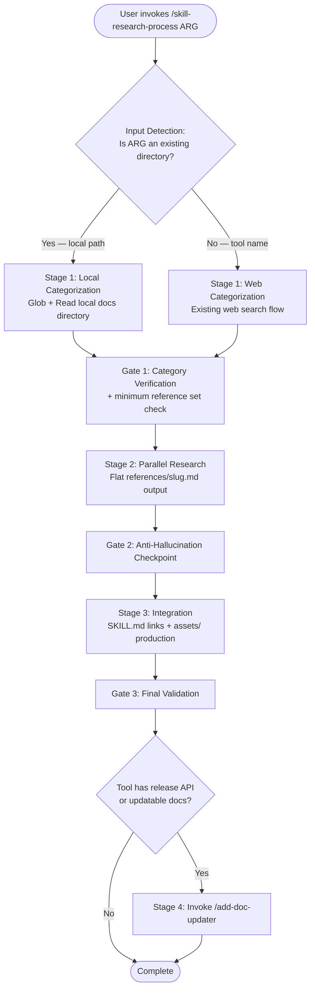

# Architecture Specification: Enhance skill-research-process for Complete CLI Tool Skill Production

## Executive Summary

Enhance the `skill-research-process` skill to accept local directory paths as input, produce flat `references/{slug}.md` layouts matching repository conventions, generate `assets/` directories with templates, and delegate sync script creation to the existing `/add-doc-updater` skill. Closes 8 gaps identified in the [feature context document](./feature-context-enhance-skill-research-process.md).

**Scope:** Architectural specification defining WHAT to build (input detection, output structure, agent prompt changes). Implementation details delegated to development agents.

**Source Issue:** #197

---

## Document Purpose and Boundaries

**This document specifies:**

- File-level change list with section-by-section modification targets
- Input detection logic and branching behavior
- Output directory structure specification
- Agent prompt template changes (categorization, research, integration)
- Question resolutions with codebase evidence
- Acceptance criteria with concrete verification commands

**This document does NOT specify:**

- Exact markdown prose for agent prompts (implementation agent writes final prose)
- Asset file contents for specific tools (tool-dependent at research time)
- Sync script implementation (delegated to `/add-doc-updater`)

**Rationale:** Architectural specs constrain WHAT to build while leaving HOW to specialized implementation agents who apply current best practices.

---

## Architecture Overview

### Current State

```text
skill-research-process/
├── SKILL.md                      # Orchestration workflow (3 stages + 3 gates)
└── references/
    ├── agent-prompts.md          # 3 agent prompt templates
    ├── gaps-analysis.md          # 9 process quality gaps
    └── mcp-tools.md              # MCP tool selection guide
```

**Current flow:** Tool name input only. Categorization agent web-searches. Research agents produce `references/{category}/index.md` (subdirectory layout). No assets, no scripts, no local path support.

### Target State

```text
skill-research-process/
├── SKILL.md                      # Enhanced orchestration (4 stages + 3 gates)
└── references/
    ├── agent-prompts.md          # 4 agent prompt templates (updated + new)
    ├── cli-tool-reference-templates.md  # NEW: standard reference type definitions
    ├── gaps-analysis.md          # Updated with output-structure gaps
    └── mcp-tools.md              # Unchanged
```

**Target flow:** Local path OR tool name input. Categorization agent branches on input type. Research agents produce flat `references/{slug}.md`. Integration agent produces `assets/` and delegates sync script to `/add-doc-updater`.

### Change Flow



---

## 1. Component Changes

### 1.1 SKILL.md Modifications

**File:** `.claude/skills/skill-research-process/SKILL.md`

| Section | Change Type | Description |
|---------|-------------|-------------|
| Frontmatter `argument-hint` | Modify | Change from `<tool-or-library-name>` to `<tool-name-or-local-docs-path>` |
| Process Overview diagram | Modify | Add Stage 4 (sync script delegation) to the flow |
| Stage 1: Initialize | Modify | Add input detection step before categorization; add minimum reference set check to Gate 1 |
| Stage 2: Parallel Category Research | Modify | Change `./references/{category}/` to `./references/{slug}.md`; add local-path variant for research agents |
| Stage 3: Integration | Modify | Replace `references/{category}/index.md` links with `references/{slug}.md` links; add assets/ production substep |
| Stage 4 (NEW) | Add | Sync script delegation step invoking `/add-doc-updater` |
| Quality Gate 1 | Modify | Add minimum reference set verification for CLI tools |
| Quality Gate 3 | Modify | Replace `index.md` checks with flat file checks; add assets/ existence check |
| Success Checklist | Modify | Replace `index.md` references with flat layout references; add assets/ and sync script items |
| References section | Modify | Add link to new `cli-tool-reference-templates.md` |

### 1.2 Agent Prompts Modifications

**File:** `.claude/skills/skill-research-process/references/agent-prompts.md`

| Section | Change Type | Description |
|---------|-------------|-------------|
| Categorization Agent | Modify | Add input detection preamble; add local-path variant that uses Glob/Read instead of web search; add minimum reference set output requirement |
| Research Agent | Modify | Replace `references/{category}/` + `index.md` output with flat `references/{slug}.md` output; add local-path variant that reads local files with Read tool |
| Integration Agent | Modify | Replace `references/{category}/index.md` link wiring with `references/{slug}.md` link wiring; add assets/ production substep |
| Sync Script Delegation (NEW) | Add | Stage 4 prompt template for invoking `/add-doc-updater` with collected template variables |

### 1.3 CLI Tool Reference Templates (NEW)

**File:** `.claude/skills/skill-research-process/references/cli-tool-reference-templates.md`

**Purpose:** Define standard reference file types that CLI tool skills should contain. The categorization agent consults this file to ensure its category list maps to the required minimum set.

**Content specification:**

| Reference Type | File Name | Required For | Description |
|---------------|-----------|-------------|-------------|
| CLI Reference | `cli_reference.md` | CLI tools | Complete command/subcommand/flag reference |
| Configuration | `configuration.md` | Tools with config files | Config file format, environment variables, settings |
| Migration Guide | `migration-guide.md` | Tools replacing others | Command mapping tables, step-by-step migration |
| Quick Reference | `quick-reference.md` | All tools | Cheat sheet organized by task |
| Troubleshooting | `troubleshooting.md` | All tools | Common errors, solutions, diagnostic steps |

**Minimum required set for CLI tools:** `cli_reference.md`, `configuration.md`, `troubleshooting.md`

**Minimum required set for libraries:** `quick-reference.md`, `troubleshooting.md`

**Additional references:** The categorization agent may propose tool-specific additions (e.g., `workflows.md` for uv, `integration-guide.md` for linters). These supplement, not replace, the minimum set.

### 1.4 Gaps Analysis Update

**File:** `.claude/skills/skill-research-process/references/gaps-analysis.md`

| Section | Change Type | Description |
|---------|-------------|-------------|
| Document structure | Modify | Add "Output Structure Gaps" section after existing "Identified Gaps" section |
| New gaps 10-14 | Add | 5 output-structure gaps from feature context (gaps #1-5 mapped to #10-#14 in the existing numbering) |
| Recommended Improvements table | Modify | Add P1 entries for the 5 new gaps |

---

## 2. Input Detection Design

### Detection Criteria

The skill detects input type by testing the argument against filesystem existence. This runs as a Bash step at the start of Stage 1, before the categorization agent launches.

```text
Detection Rule:
  IF $ARGUMENTS resolves to an existing directory (via test -d) → LOCAL_PATH mode
  ELSE → TOOL_NAME mode (existing web search flow)
```

**Path patterns that trigger LOCAL_PATH mode:**

- Relative paths: `./docs/`, `../ty/docs/`, `docs/`
- Absolute paths: `/home/user/repos/ty/docs/`
- Home-relative paths: `~/repos/ty/docs/`
- Any argument where `test -d "$ARGUMENTS"` succeeds

**No explicit flag required.** The auto-detect approach matches the pattern used by the `/external-pattern-integrator` skill (URL-vs-file detection at lines 68-72 of its SKILL.md). An explicit `--local` flag is not needed because:

1. Tool names (e.g., `kubectl`, `ruff`, `uv`) do not resolve to directories on the filesystem
2. The edge case of a tool name matching a directory name is handled by the detection step being a simple `test -d` check -- if the user names a directory, they want local mode
3. The `/external-pattern-integrator` has used auto-detect successfully without false positives

SOURCE: `.claude/skills/external-pattern-integrator/SKILL.md` lines 68-72 (accessed 2026-02-27)

### Behavior: LOCAL_PATH Mode

1. **Stage 1 categorization agent** receives modified prompt:
   - Uses `Glob` to enumerate `*.md` files in the local directory (and subdirectories)
   - Uses `Read` to sample file headers/first sections for topic identification
   - Produces category list mapped to local file paths (not web URLs)
   - Includes the minimum reference set from `cli-tool-reference-templates.md`

2. **Stage 2 research agents** receive modified prompt:
   - Use `Read` tool to read assigned local files (paths from categorization output)
   - Extract content into flat `references/{slug}.md` files
   - Citation format: `SOURCE: Local file {relative-path} (read {date})`
   - May supplement with web search if local docs have gaps (noted in category plan)

3. **Stage 3 integration agent** behaves identically for both modes (no change needed)

### Behavior: TOOL_NAME Mode

Existing web search flow. No changes except:

- Stage 2 output path changes from `references/{category}/` to `references/{slug}.md` (flat layout)
- Gate 1 adds minimum reference set verification

---

## 3. Output Structure Specification

### Produced Skill Directory Layout

The skill-research-process produces a skill directory conforming to this structure:

```text
skills/{tool-name}/
├── SKILL.md                           # Main skill file (<=5k words)
├── references/
│   ├── cli_reference.md               # Required for CLI tools
│   ├── configuration.md               # Required for CLI tools
│   ├── migration-guide.md             # Required when tool replaces others
│   ├── quick-reference.md             # Required for all tools
│   ├── troubleshooting.md             # Required for all tools
│   └── {additional-slug}.md           # Tool-specific additional references
├── assets/
│   └── {category}/
│       └── {template-file}            # Copy-paste templates, example configs
└── scripts/
    └── sync_{tool}_releases.py        # Sync script (produced by /add-doc-updater)
```

### Flat References Layout Rationale

Every production skill in the repository uses flat `references/{slug}.md`:

| Skill | Location | Reference Files |
|-------|----------|-----------------|
| uv | `plugins/python3-development/skills/uv/references/` | 5 flat `.md` files, 0 subdirectories |
| clang-format | `plugins/clang-format/skills/clang-format/references/` | Flat `.md` files |
| agent-browser | `.claude/skills/agent-browser/references/` | Flat `.md` files |
| brainstorming-skill | `plugins/brainstorming-skill/skills/brainstorming-skill/references/` | 14+ flat `.md` files |

SOURCE: Feature context document, Patterns 2-4 (accessed 2026-02-27)

Zero production skills use the `references/{category}/index.md` subdirectory layout that the current skill-research-process produces.

### Assets Directory Convention

Assets use purpose-based subdirectories within `assets/`:

```text
assets/
├── {purpose-category}/         # e.g., pyproject_templates, docker_examples
│   ├── {template-file}         # e.g., basic.toml, Dockerfile.simple
│   └── {template-file}
└── {purpose-category}/
    └── {template-file}
```

**Benchmark:** The uv skill has 4 asset subdirectories with 7 files:

- `pyproject_templates/` (3 files: `basic.toml`, `advanced.toml`, `gitlab.toml`)
- `script_examples/` (1 file: `data_analysis.py`)
- `docker_examples/` (2 files: `Dockerfile.simple`, `Dockerfile.multi-stage`)
- `github_actions/` (1 file: `ci.yml`)

SOURCE: `plugins/python3-development/skills/uv/assets/` directory listing (accessed 2026-02-27)

The integration agent determines which asset categories are relevant based on the researched content. Not all tools need all categories.

### Scripts Directory Convention

Scripts directory contains sync/release-tracking scripts. The skill-research-process does NOT generate these directly. Instead, Stage 4 delegates to `/add-doc-updater` which has a complete 5-phase pipeline for sync script creation.

**Benchmark:** The uv skill has `scripts/sync_uv_releases.py` (PEP 723 metadata, Typer CLI, GitHub API, cooldown with lock file, SKILL.md section replacement).

SOURCE: `plugins/python3-development/skills/uv/scripts/sync_uv_releases.py` lines 1-58 (accessed 2026-02-27)

---

## 4. Agent Prompt Changes

### 4.1 Categorization Agent Prompt

**Current state:** Single prompt template for web-based categorization.

**Target state:** Prompt with input-type preamble that branches behavior.

**Changes required:**

1. **Add input detection preamble** at the top of the prompt:

   ```text
   ## Input Type: {LOCAL_PATH | TOOL_NAME}
   ```

   - If `LOCAL_PATH`: Instructions to use `Glob` to enumerate `{path}/**/*.md`, then `Read` to sample file headers, then derive categories from directory structure and content topics
   - If `TOOL_NAME`: Existing web search instructions (unchanged)

2. **Add minimum reference set output requirement:**

   ```text
   Your category list MUST include mappings to these minimum reference files:
   - cli_reference.md (for CLI tools)
   - configuration.md (for CLI tools)
   - troubleshooting.md (for all tools)
   - quick-reference.md (for all tools)
   ```

   Reference: [CLI Tool Reference Templates](./cli-tool-reference-templates.md)

3. **Output format change:** Category output must include target filename slug:

   ```text
   - [ ] Category: {Name} → references/{slug}.md
     Topics: {list of topics for this category}
     Local files: {list of local file paths, if LOCAL_PATH mode}
   ```

### 4.2 Research Agent Prompt

**Current state:** Outputs to `references/{category}/` with `index.md`.

**Target state:** Outputs to `references/{slug}.md` (single flat file per category).

**Changes required:**

1. **Replace output path instructions:**
   - Remove: `Create files in: ./{skill-name}/references/{category}/`
   - Remove: `Create index.md (lowercase) in that directory`
   - Add: `Create a single file at: ./{skill-name}/references/{slug}.md`
   - Add: `The file should contain all documentation for this category with a table of contents at the top`

2. **Add local-path variant:**
   - When `LOCAL_PATH` mode: `Read the following local documentation files and extract content relevant to your category: {file-list-from-categorization}`
   - Citation format for local files: `SOURCE: Local file {path} (read YYYY-MM-DD)`
   - Instruction: `Prioritize local file content. Supplement with web search only for topics not covered in local files.`

3. **Remove index.md references from success criteria:**
   - Remove: `index.md contains working links to all created files`
   - Add: `references/{slug}.md contains a table of contents linking to internal sections`

### 4.3 Integration Agent Prompt

**Current state:** Reads `references/{category}/index.md` files, wires links into SKILL.md.

**Target state:** Reads flat `references/{slug}.md` files, wires links into SKILL.md, produces `assets/` directory.

**Changes required:**

1. **Replace path references:**
   - Remove: `Read all references/{category}/index.md files`
   - Add: `Read all references/*.md files`
   - Remove: `Ensure SKILL.md body links use ./references/{category}/index.md format`
   - Add: `Ensure SKILL.md body links use ./references/{slug}.md format`

2. **Add assets/ production substep:**

   ```text
   After updating SKILL.md references:
   1. Review researched content for template-worthy material:
      - Configuration file templates
      - Example scripts or code snippets
      - CI/CD workflow templates
      - Docker/container templates
   2. Create assets/{category}/ subdirectories for each template type
   3. Create template files with copy-paste-ready content
   4. Add assets/ section to SKILL.md listing available templates
   ```

3. **Replace validation path references:**
   - Remove: `Verify the skill follows skill-creator guidelines` (vague)
   - Add: `Run: uv run plugins/plugin-creator/scripts/plugin_validator.py ./{skill-name}/`

### 4.4 Sync Script Delegation Prompt (NEW -- Stage 4)

**Purpose:** Template for the orchestrator to invoke `/add-doc-updater` after Stage 3 completes.

**Content specification:**

```text
## Stage 4: Sync Script Delegation

After Stage 3 integration completes successfully:

1. Determine if the tool has:
   - A GitHub repository with releases (→ release-tracking sync script)
   - A documentation site that updates regularly (→ doc-download sync script)
   - Neither (→ skip Stage 4)

2. If sync script is appropriate, invoke:
   Skill(skill: "plugin-creator:add-doc-updater", args: "./{skill-name}/")

3. The /add-doc-updater skill handles its own 5-phase workflow including:
   - Variable collection (Phase 0)
   - Implementation (Phase 1)
   - Code review (Phase 2)
   - Quality gates (Phase 3)
   - Testing (Phase 4)
   - Integration (Phase 5)

4. After /add-doc-updater completes, verify:
   - scripts/ directory exists and contains sync script
   - SKILL.md has been updated with execution protocol section
```

This is NOT a subagent prompt. It is orchestrator-level instructions for invoking an existing skill.

---

## 5. Questions Resolution

### Q1: Local path vs. tool name detection

**Resolution:** Option A -- Auto-detect.

**Rationale:** The `/external-pattern-integrator` skill at `.claude/skills/external-pattern-integrator/SKILL.md` lines 68-72 uses auto-detect (URL vs file) and this has worked reliably in production. A `test -d "$ARGUMENTS"` check is deterministic and unambiguous: tool names like `kubectl`, `ruff`, `uv` do not resolve to existing directories. The edge case of a directory named after a tool is intentional -- if the user passes a path that exists, they want local mode.

**Evidence:** The `external-pattern-integrator` SKILL.md contains:

```text
**If URL**: Use WebFetch or curl to download to `/tmp/external-pattern-{slug}.md`
**If local file**: Read directly
```

No reports of false positives in the existing skill.

SOURCE: `.claude/skills/external-pattern-integrator/SKILL.md` lines 68-72 (accessed 2026-02-27)

### Q2: Hardcoded vs. configurable reference file set

**Resolution:** Option C -- Hybrid with minimum required set.

**Rationale:** The uv skill (benchmark) has 5 reference files. The clang-format skill has a different set. A hardcoded list would not accommodate tool diversity. The minimum required set ensures structural consistency while allowing the categorization agent to add tool-specific files.

**Minimum set (CLI tools):** `cli_reference.md`, `configuration.md`, `troubleshooting.md`
**Minimum set (libraries):** `quick-reference.md`, `troubleshooting.md`
**Categorization agent adds:** Tool-specific references (e.g., `migration-guide.md` for tools replacing others, `workflows.md` for workflow-heavy tools)

**Evidence:** The uv skill has `cli_reference.md`, `configuration.md`, `migration-guide.md`, `quick-reference.md`, `troubleshooting.md`. Of these, `migration-guide.md` is uv-specific (replacing pip/poetry). The other 4 are universal.

SOURCE: `plugins/python3-development/skills/uv/references/` directory listing (accessed 2026-02-27)

### Q3: Assets production inline vs. post-research

**Resolution:** Option B -- Post-research, during Stage 3 (Integration).

**Rationale:** Research agents focus on documentation extraction and citation. Asset creation requires different judgment: identifying template-worthy content, determining useful file formats, creating copy-paste-ready examples. The integration agent already reviews all researched content during Stage 3 and is best positioned to identify asset candidates.

**Evidence:** The uv skill's assets are derivative of its reference content -- `pyproject_templates/` mirrors configuration documentation, `github_actions/` mirrors CI/CD documentation. Assets are not independently researched; they are extracted from research output.

SOURCE: Cross-referencing `plugins/python3-development/skills/uv/assets/` contents against `plugins/python3-development/skills/uv/references/configuration.md` and `plugins/python3-development/skills/uv/SKILL.md` CI/CD section (accessed 2026-02-27)

### Q4: Sync script integrated vs. delegated

**Resolution:** Option B -- Delegated to `/add-doc-updater`.

**Rationale:** The `/add-doc-updater` skill at `plugins/plugin-creator/skills/add-doc-updater/SKILL.md` already has a complete 5-phase pipeline with quality gates (ruff, mypy, pyright, prek), code review delegation, and integration testing. Reimplementing this inside skill-research-process would duplicate 354+ lines of orchestration logic and miss existing quality gates.

**Evidence:** The `/add-doc-updater` skill handles:

- Phase 0: Variable collection (6 template variables)
- Phase 1: Implementation (delegates to `@python-cli-architect`)
- Phase 2: Code review (delegates to `@python-code-reviewer`)
- Phase 3: Quality gates (ruff, mypy, pyright, prek)
- Phase 4: Testing (7-point checklist)
- Phase 5: Integration (SKILL.md update, .gitignore, integration test)

SOURCE: `plugins/plugin-creator/skills/add-doc-updater/SKILL.md` lines 1-50 (accessed 2026-02-27)

### Q5: Gaps analysis merge strategy

**Resolution:** Option A -- Merge into single file with two sections.

**Rationale:** A single `gaps-analysis.md` file is the canonical gap tracker for the skill-research-process. The original 9 gaps cover process quality (verification, citations, hallucination checks). The new 5 gaps cover output structure. These are different concerns but belong in the same tracking file for discoverability.

**Evidence:** The existing `gaps-analysis.md` at `.claude/skills/skill-research-process/references/gaps-analysis.md` has 9 gaps and a recommendations table. Adding a new section with 5 gaps preserves the single-file convention and the numbered gap system (continuing from 10).

SOURCE: `.claude/skills/skill-research-process/references/gaps-analysis.md` (accessed 2026-02-27)

---

## 6. Acceptance Criteria

### Structural Verification

Each criterion includes the verification command to run.

```bash
# AC-1: SKILL.md argument-hint updated
grep -q 'argument-hint:.*path' .claude/skills/skill-research-process/SKILL.md

# AC-2: No references to {category}/index.md in SKILL.md
! grep -q 'index\.md' .claude/skills/skill-research-process/SKILL.md

# AC-3: No references to {category}/index.md in agent-prompts.md
! grep -q 'index\.md' .claude/skills/skill-research-process/references/agent-prompts.md

# AC-4: No references to references/{category}/ (subdirectory pattern) in SKILL.md
! grep -q 'references/{category}/' .claude/skills/skill-research-process/SKILL.md

# AC-5: No references to references/{category}/ (subdirectory pattern) in agent-prompts.md
! grep -q 'references/{category}/' .claude/skills/skill-research-process/references/agent-prompts.md

# AC-6: Flat layout references present in agent-prompts.md
grep -q 'references/{slug}\.md' .claude/skills/skill-research-process/references/agent-prompts.md

# AC-7: cli-tool-reference-templates.md exists
test -f .claude/skills/skill-research-process/references/cli-tool-reference-templates.md

# AC-8: cli-tool-reference-templates.md referenced from SKILL.md
grep -q 'cli-tool-reference-templates\.md' .claude/skills/skill-research-process/SKILL.md

# AC-9: Stage 4 (sync script delegation) present in SKILL.md
grep -q 'Stage 4' .claude/skills/skill-research-process/SKILL.md

# AC-10: /add-doc-updater reference present in agent-prompts.md or SKILL.md
grep -rq 'add-doc-updater' .claude/skills/skill-research-process/

# AC-11: assets/ production mentioned in integration agent prompt
grep -q 'assets/' .claude/skills/skill-research-process/references/agent-prompts.md

# AC-12: Local path detection logic present in SKILL.md
grep -q 'test -d' .claude/skills/skill-research-process/SKILL.md

# AC-13: gaps-analysis.md has output structure section
grep -q 'Output Structure' .claude/skills/skill-research-process/references/gaps-analysis.md

# AC-14: Linting passes on all modified files
uv run prek run --files .claude/skills/skill-research-process/SKILL.md
uv run prek run --files .claude/skills/skill-research-process/references/agent-prompts.md
uv run prek run --files .claude/skills/skill-research-process/references/cli-tool-reference-templates.md
uv run prek run --files .claude/skills/skill-research-process/references/gaps-analysis.md

# AC-15: Validator passes on skill directory
uv run plugins/plugin-creator/scripts/plugin_validator.py .claude/skills/skill-research-process/
```

### Behavioral Verification (Manual)

These require manual invocation of the skill:

- [ ] `/skill-research-process ./some-local-docs-dir/` triggers LOCAL_PATH mode (categorization uses Glob/Read, not web search)
- [ ] `/skill-research-process kubectl` triggers TOOL_NAME mode (web search, unchanged flow)
- [ ] Stage 2 output produces flat `references/{slug}.md` files, not subdirectories
- [ ] Stage 3 integration links in SKILL.md use `./references/{slug}.md` format
- [ ] Stage 3 produces `assets/` directory with at least one template (for tools with template-worthy content)
- [ ] Stage 4 correctly identifies whether to invoke `/add-doc-updater`

---

## Summary of Changes by File

| File | Action | Lines Changed (Estimated) |
|------|--------|--------------------------|
| `.claude/skills/skill-research-process/SKILL.md` | Modify | ~60 lines modified across 8 sections |
| `.claude/skills/skill-research-process/references/agent-prompts.md` | Modify | ~80 lines modified across 3 templates + 1 new template |
| `.claude/skills/skill-research-process/references/cli-tool-reference-templates.md` | Create | ~60 lines new file |
| `.claude/skills/skill-research-process/references/gaps-analysis.md` | Modify | ~30 lines added (new section) |

**Total estimated change:** ~230 lines across 4 files (3 modified, 1 new).

---

## Implementation Order

Implementation should proceed in this order to minimize merge conflicts and enable incremental verification:

1. **Create `cli-tool-reference-templates.md`** -- no dependencies, enables AC-7
2. **Update `gaps-analysis.md`** -- no dependencies, enables AC-13
3. **Update `agent-prompts.md`** -- depends on (1) for reference link; enables AC-3, AC-5, AC-6, AC-11
4. **Update `SKILL.md`** -- depends on (1) and (3) for consistent references; enables all remaining ACs
5. **Run linting and validation** -- depends on all above; enables AC-14, AC-15

---

## References

- [Feature Context Document](./feature-context-enhance-skill-research-process.md) -- Discovery document with gap analysis and codebase research
- [Current SKILL.md](../.claude/skills/skill-research-process/SKILL.md) -- Target skill being enhanced
- [Current Agent Prompts](../.claude/skills/skill-research-process/references/agent-prompts.md) -- Agent prompt templates
- [uv Skill (Benchmark)](../plugins/python3-development/skills/uv/SKILL.md) -- Production-quality CLI tool skill reference
- [External Pattern Integrator](../.claude/skills/external-pattern-integrator/SKILL.md) -- Auto-detect input pattern reference
- [Add Doc Updater](../plugins/plugin-creator/skills/add-doc-updater/SKILL.md) -- Sync script generation skill
