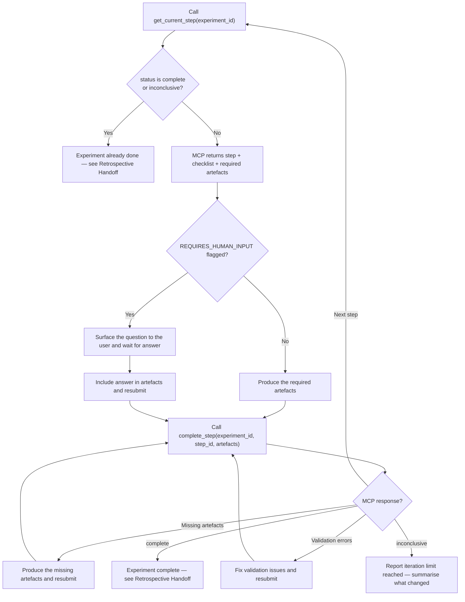

# Architecture: Experiment Protocol Validation

**Date:** 2026-03-04
**Input:** [Feature Context](./feature-context-experiment-protocol-validation.md), [Codebase Analysis](./codebase/ARCHITECTURE.md)
**Scope:** Content validation and enforcement for the experiment-registry MCP server
**Package:** `plugins/scientific-method/mcp/experiment-registry/`

---

## Executive Summary

The experiment-registry MCP server enforces a 5-step controlled experiment protocol (hypothesis, fixture, rubric, baseline, iterate) but currently validates only artefact key presence -- never content, integrity, or structured scoring. Eight gaps span content validation, trust-based self-reporting, freeze enforcement, rubric locking, iteration log validation, output tracking, phantom path detection, and SKILL.md flowchart safety.

This architecture introduces a **validation layer** between the artefact-merge step and the state-persistence step in `StateManager.complete_step()`. The layer is a new module (`validators.py`) containing composable validation functions driven by machine-readable rules extracted from the existing decorative `validation` field in `experiment_core.json`. The design preserves backward compatibility with existing state files, does not change the MCP tool API signatures, and maintains the current step progression model.

**Key architectural choices:**

- Artefact values remain `str` but are treated as **file paths relative to the experiment directory** -- the MCP reads file content for validation and hashing
- The `validation` field in JSON becomes a structured object (not a plain string) with machine-evaluable rules
- `criteria_passed` is replaced by a `rubric_scores` dict requiring per-criterion boolean values verified against the rubric definition
- Content hashes (SHA-256) of frozen artefacts are computed at freeze-point and verified on every subsequent `complete_step` call
- A new `ArtefactIntegrity` model tracks hashes and freeze timestamps inside `ExperimentState`
- All validation errors are returned as structured data in the existing `{"success": false, ...}` response pattern

---

## Design Decisions

These resolve the open questions (Q1-Q5) from the feature context document.

### D1: Artefact values are file paths (resolves Q4)

**Decision:** Artefact values in `dict[str, str]` are file paths relative to the experiment directory (`{project_root}/.claude/experiments/{id}/`).

**Rationale:** The artefact key names (`hypothesis.md`, `fixture.md`, `output-iter0.md`) already use file extensions. The current code treats values as opaque strings, but the retrospective-analyst agent reads artefacts from disk paths. Making this convention explicit enables file existence checks (Gap 2) and content hashing (Gap 4).

**Implication:** `complete_step` resolves each artefact value against the experiment directory. If the value is an absolute path, it is used as-is. If relative, it is resolved against `{project_root}/.claude/experiments/{id}/`. The MCP reads file content for validation and hashing -- it does not store file content in state.

**Exception:** `criteria_passed` (being replaced by `rubric_scores`) and any future non-file artefacts use a naming convention: keys without a file extension (no `.` in the key name) are treated as inline values, not file paths. This is backward-compatible since all current file artefacts have extensions.

### D2: Structured validation rules (resolves Q1)

**Decision:** Option B -- structured validation. The `validation` field in `experiment_core.json` becomes a structured object with machine-evaluable rules.

**Rationale:** Non-empty-only validation (Option A) is insufficient -- it allows structurally invalid artefacts like a hypothesis.md with no hypothesis statement. The existing `validation` strings already describe the rules; converting them to structured format makes the enforcement real without inventing new requirements.

**Format:** The `validation` field changes from `str` to `dict` (or remains `str` for backward compatibility with a new `validation_rules` field). See [Validation Rule Engine](#validation-rule-engine) for the rule format.

### D3: Per-criterion JSON scoring (resolves Q2)

**Decision:** Option A -- per-criterion JSON. The `criteria_passed` string is replaced by a `rubric_scores` dict where keys are criterion names and values are booleans.

**Rationale:** Keeping scoring inside the MCP (rather than in a separate file) enables the MCP to verify completeness: every criterion from the rubric must have a score entry. A separate scored-rubric file (Option B) would require the MCP to parse markdown, which is fragile.

**Format:** `rubric_scores: dict[str, bool]` where keys must match criterion names from `rubric_templates` (if using a registered type) or from the `rubric.md` artefact (parsed for criterion names). The MCP verifies: (1) all criteria have entries, (2) `criteria_passed` is derived by the MCP as `all(rubric_scores.values())`, not self-reported.

**Wire format change:** The `artefacts` parameter to `complete_step` gains an optional sibling parameter `rubric_scores: dict[str, bool] | None`. This is a new parameter on the MCP tool, not smuggled inside the artefacts dict.

### D4: Freeze at producing step (resolves Q3)

**Decision:** Option B -- freeze each artefact at the step that produces it. Fixture freezes after the fixture step completes. Rubric freezes after the rubric step completes. Task-prompt (if present) freezes after whatever step produces it.

**Rationale:** Option A (freeze everything after baseline) allows rubric modification during the baseline step, which violates the pre-registration principle. The existing checklist already says "written before baseline" for rubric and "frozen -- will not be edited after baseline" for fixture. Option B matches this intent: rubric is frozen the moment the rubric step completes (before baseline runs), fixture is frozen when fixture step completes.

**Implementation:** When `complete_step` succeeds for a step, any artefacts in that step's `required_artefacts` list that are file paths get their SHA-256 content hash computed and stored in `ExperimentState.artefact_integrity`. On every subsequent `complete_step` call, the MCP re-hashes all frozen artefacts and compares against stored hashes.

**Freeze registry:** A new field `frozen_artefacts: list[str]` on `StepDefinition` declares which artefact keys become frozen when that step completes. For `experiment_core.json`: fixture step freezes `["fixture.md"]`, rubric step freezes `["rubric.md"]`. This is explicit rather than implicit -- extensions can declare additional frozen artefacts.

### D5: Per-iteration output required (resolves Q5)

**Decision:** Option A -- require `output-iterN.md` for every iteration.

**Rationale:** The baseline step already requires `output-iter0.md`. The asymmetry where iterate requires only `log.md` means iteration outputs are not captured, making it impossible to diff between iterations or detect selective reporting. Requiring `output-iterN.md` (where N = current `iteration_count`) closes this gap.

**Implementation:** The iterate step's `required_artefacts` remains `["log.md"]` in the static JSON definition. The validation layer dynamically adds `output-iter{N}.md` to the required set based on `state.iteration_count + 1` (since iteration_count is incremented during the step). This keeps the JSON definition clean while enforcing per-iteration output.

---

## Component Architecture

### Module Layout (after changes)

```text
plugins/scientific-method/mcp/experiment-registry/
├── server.py              # MCP tool layer — gains rubric_scores parameter on complete_step
├── state_manager.py       # Lifecycle — calls validators before artefact merge and state save
├── validators.py          # NEW — composable validation functions
├── models.py              # Pydantic models — gains ArtefactIntegrity, ValidationRule, RubricScore
├── registry_loader.py     # Registry — unchanged (validation_rules parsed from JSON by models)
├── registry/
│   └── experiment_core.json  # validation field becomes structured; gains frozen_artefacts per step
└── tests/                 # NEW — pytest suite
    ├── conftest.py
    ├── test_validators.py
    ├── test_state_manager.py
    └── test_complete_step_integration.py
```

### Layer Dependency Changes

```text
server.py
  │  complete_step() adds rubric_scores parameter
  │  Passes rubric_scores to state_manager.complete_step()
  │
  ▼
state_manager.py
  │  complete_step() calls validators before artefact merge
  │  Calls validators after artefact merge (for freeze checks)
  │  Computes and stores content hashes on step completion
  │
  ├──▶ validators.py (NEW)
  │      validate_artefact_content(step_def, artefacts, experiment_dir) → list[ValidationError]
  │      validate_file_existence(artefacts, experiment_dir) → list[ValidationError]
  │      validate_freeze_integrity(state, experiment_dir) → list[ValidationError]
  │      validate_rubric_scores(rubric_scores, state) → list[ValidationError]
  │      validate_iteration_output(state, artefacts) → list[ValidationError]
  │      validate_terminal_state(state) → list[ValidationError]
  │
  └──▶ models.py
         ArtefactIntegrity (NEW) — hash, frozen_at timestamp, step_id
         ValidationRule (NEW) — type enum + parameters
         StepDefinition — gains validation_rules: list[ValidationRule], frozen_artefacts: list[str]
         ExperimentState — gains artefact_integrity: dict[str, ArtefactIntegrity]
```

### Validation Insertion Point

The validation layer inserts into `StateManager.complete_step()` at two points:

```text
complete_step(experiment_id, step_id, artefacts, rubric_scores=None)
  │
  1. Load state, verify step_id matches current_step (existing)
  2. Find step definition (existing)
  3. Check required artefacts keys present (existing)
  │
  ├── NEW: Pre-merge validation ──────────────────────────────┐
  │   a. validate_terminal_state(state)                       │
  │   b. validate_file_existence(artefacts, experiment_dir)   │
  │   c. validate_artefact_content(step_def, artefacts, dir)  │
  │   d. validate_freeze_integrity(state, experiment_dir)     │
  │   e. validate_iteration_output(state, artefacts)          │
  │   f. validate_rubric_scores(rubric_scores, state)         │
  │   If any errors → return {"success": false, "validation_errors": [...]}
  │   No state mutation occurs on validation failure.         │
  └───────────────────────────────────────────────────────────┘
  │
  4. Merge artefacts into state (existing)
  │
  ├── NEW: Post-merge hash computation ──────────────────────┐
  │   For each artefact in step_def.frozen_artefacts:        │
  │     Compute SHA-256 of file content                      │
  │     Store in state.artefact_integrity[key]               │
  └──────────────────────────────────────────────────────────┘
  │
  5. Iterate/advance logic (existing, modified for rubric_scores)
  6. Save state (existing)
```

### Error Response Extension

Validation failures return a new structured response alongside the existing patterns:

```python
# Existing patterns (unchanged):
{"success": False, "missing_artefacts": ["hypothesis.md"]}
{"success": False, "blocked_on_human_input": True, "description": "..."}

# New pattern:
{"success": False, "validation_errors": [
    {"code": "EMPTY_ARTEFACT", "artefact": "hypothesis.md", "message": "..."},
    {"code": "FILE_NOT_FOUND", "artefact": "fixture.md", "path": "/abs/path", "message": "..."},
    {"code": "FROZEN_ARTEFACT_MODIFIED", "artefact": "fixture.md", "expected_hash": "abc...", "actual_hash": "def...", "message": "..."},
    {"code": "MISSING_RUBRIC_SCORES", "missing_criteria": ["criterion_1"], "message": "..."},
    {"code": "CONTENT_VALIDATION_FAILED", "artefact": "hypothesis.md", "rule": "required_sections", "message": "..."},
    {"code": "MISSING_ITERATION_OUTPUT", "expected": "output-iter3.md", "message": "..."},
    {"code": "TERMINAL_STATE", "status": "complete", "message": "..."}
]}
```

Error codes are string constants defined in `validators.py`. Each error is a dict with at minimum `code` and `message` keys, plus context-specific fields.

---

## Data Model Changes

All model changes use Pydantic `Field(default_factory=...)` to ensure backward compatibility with existing persisted state files. Pydantic fills defaults for missing fields during deserialization.

### New Models

**`ValidationRule`** -- machine-evaluable rule parsed from the `validation_rules` field in JSON:

```text
class ValidationRule(BaseModel):
    type: Literal["required_sections", "non_empty", "no_forbidden_content", "min_criteria_count"]
    params: dict[str, Any] = Field(default_factory=dict)
```

Rule types:

| type | params | Description |
|------|--------|-------------|
| `required_sections` | `{"sections": ["HYPOTHESIS:", "CURRENT BEHAVIOUR:", "SUCCESS CRITERION:"]}` | File must contain all listed section headers |
| `non_empty` | `{}` | File content must be non-empty after stripping whitespace |
| `no_forbidden_content` | `{"patterns": ["EXPECTED:", "CORRECT ANSWER:"]}` | File must not contain any listed patterns (case-insensitive) |
| `min_criteria_count` | `{"min": 1}` | File must contain at least N binary criteria (for rubric) |

**`ArtefactIntegrity`** -- tracks content hash and freeze metadata:

```text
class ArtefactIntegrity(BaseModel):
    sha256: str                    # Hex digest of file content at freeze time
    frozen_at: str                 # ISO 8601 timestamp
    frozen_by_step: str            # Step ID that produced and froze this artefact
```

**`RubricScore`** -- structured scoring result (used in complete_step, not persisted separately):

The `rubric_scores` parameter on `complete_step` is `dict[str, bool]` -- simple enough to not need its own model. The MCP verifies completeness against known criteria.

### Modified Models

**`StepDefinition`** -- two new fields:

```text
class StepDefinition(BaseModel):
    # ... existing fields ...
    validation_rules: list[ValidationRule] = Field(default_factory=list)  # NEW
    frozen_artefacts: list[str] = Field(default_factory=list)            # NEW
```

- `validation_rules`: Replaces the decorative `validation: str` field. The old `validation` field is retained for backward compatibility (read-only, not evaluated).
- `frozen_artefacts`: Lists artefact keys that become frozen when this step completes.

**`ExperimentState`** -- one new field:

```text
class ExperimentState(BaseModel):
    # ... existing fields ...
    artefact_integrity: dict[str, ArtefactIntegrity] = Field(default_factory=dict)  # NEW
```

- `artefact_integrity`: Maps artefact keys to their integrity records. Populated when a step with `frozen_artefacts` completes. Checked on every subsequent `complete_step` call.

### JSON Schema Changes (`experiment_core.json`)

Each step gains `validation_rules` and `frozen_artefacts` fields:

```json
{
  "id": "hypothesis",
  "name": "State hypothesis",
  "required_artefacts": ["hypothesis.md"],
  "validation": "contains HYPOTHESIS:, CURRENT BEHAVIOUR:, SUCCESS CRITERION:",
  "validation_rules": [
    {"type": "non_empty", "params": {}},
    {"type": "required_sections", "params": {"sections": ["HYPOTHESIS:", "CURRENT BEHAVIOUR:", "SUCCESS CRITERION:"]}}
  ],
  "frozen_artefacts": [],
  "checklist": []
}
```

```json
{
  "id": "fixture",
  "required_artefacts": ["fixture.md"],
  "validation_rules": [
    {"type": "non_empty", "params": {}},
    {"type": "no_forbidden_content", "params": {"patterns": ["EXPECTED:", "CORRECT ANSWER:", "SUCCESS CRITERION:", "RUBRIC:"]}}
  ],
  "frozen_artefacts": ["fixture.md"]
}
```

```json
{
  "id": "rubric",
  "required_artefacts": ["rubric.md"],
  "validation_rules": [
    {"type": "non_empty", "params": {}},
    {"type": "min_criteria_count", "params": {"min": 1}}
  ],
  "frozen_artefacts": ["rubric.md"]
}
```

```json
{
  "id": "baseline",
  "required_artefacts": ["output-iter0.md", "log.md"],
  "validation_rules": [
    {"type": "non_empty", "params": {}}
  ],
  "frozen_artefacts": []
}
```

```json
{
  "id": "iterate",
  "required_artefacts": ["log.md"],
  "validation_rules": [
    {"type": "non_empty", "params": {}}
  ],
  "frozen_artefacts": []
}
```

The `validation` string field is preserved alongside `validation_rules` for human readability. Code evaluates only `validation_rules`.

---

## Validation Rule Engine

The `validators.py` module contains pure functions that accept state/artefact data and return a list of validation error dicts. No side effects, no state mutation, no file writes. This makes every validator independently testable.

### Rule Evaluation

Each `ValidationRule` maps to an evaluator function inside `validators.py`:

```text
_RULE_EVALUATORS: dict[str, Callable[[str, dict[str, Any]], str | None]]
```

Each evaluator receives file content (str) and rule params (dict), and returns `None` on success or an error message string on failure.

**`required_sections` evaluator:**
- For each section string in `params["sections"]`, check if it appears in the file content (case-sensitive, since section headers are conventions)
- Returns error listing all missing sections

**`non_empty` evaluator:**
- Strip whitespace from content. If empty, return error.
- This is the universal minimum -- every artefact must have content.

**`no_forbidden_content` evaluator:**
- For each pattern in `params["patterns"]`, check if it appears in the file content (case-insensitive)
- Returns error listing all found forbidden patterns
- Purpose: Catches embedded criteria in fixtures, model answers in inputs

**`min_criteria_count` evaluator:**
- Parse the file content for lines matching the pattern of a binary criterion (implementation detail: lines starting with `- [ ]` or `- [x]` or lines containing `pass:` / `fail:` patterns)
- Count matches. If count < `params["min"]`, return error.
- Purpose: Ensures rubric has at least one scorable criterion

### Validation Orchestration

`validate_artefact_content()` is the orchestrator function:

```text
def validate_artefact_content(
    step_def: StepDefinition,
    artefacts: dict[str, str],    # key -> file path
    experiment_dir: Path,
) -> list[dict[str, str | Any]]:
```

For each artefact key in `step_def.required_artefacts`:
1. Resolve file path from `artefacts[key]` relative to `experiment_dir`
2. Read file content
3. Apply each rule in `step_def.validation_rules` to the content
4. Collect all errors (do not short-circuit on first error)

The function returns all errors for all artefacts in one pass. The caller (state_manager) can return all of them to the MCP client, enabling the agent to fix multiple issues at once rather than playing whack-a-mole.

### Extension Compatibility

Domain-type JSON files can add `validation_rules` to their `step_extensions`. The merge logic in `registry_loader.py` appends extension validation rules to the base step's rules (same pattern as `required_artefacts` and `checklist`). This means domain types can add stricter validation without overriding core rules.

New field in `StepExtension`:

```text
class StepExtension(BaseModel):
    # ... existing fields ...
    additional_validation_rules: list[ValidationRule] = Field(default_factory=list)  # NEW
    additional_frozen_artefacts: list[str] = Field(default_factory=list)             # NEW
```

Merge rule in `_apply_extension`:
- `validation_rules` = base rules + `additional_validation_rules`
- `frozen_artefacts` = base frozen + `additional_frozen_artefacts`

---

## Gap-by-Gap Design

### Gap 1 (HIGH): No content validation

**Problem:** `complete_step` checks `if a not in artefacts` -- pure key presence. Empty strings pass.

**Fix location:** `validators.py:validate_artefact_content()` + `experiment_core.json` validation_rules

**Design:**
- Every step in `experiment_core.json` gains a `non_empty` validation rule at minimum
- Steps with structural requirements (hypothesis, fixture, rubric) gain additional rules (`required_sections`, `no_forbidden_content`, `min_criteria_count`)
- `validate_artefact_content()` reads file content from disk (per D1: values are file paths) and evaluates all rules
- Called in pre-merge validation block of `complete_step`

**Error code:** `EMPTY_ARTEFACT`, `CONTENT_VALIDATION_FAILED`

### Gap 2 (LOW): No file existence check on artefact paths

**Problem:** Artefact values accepted as opaque strings. Phantom paths reach retrospective-analyst.

**Fix location:** `validators.py:validate_file_existence()`

**Design:**
- For each artefact key that contains a `.` (file extension convention per D1), resolve the value as a file path relative to experiment directory
- Check `Path.exists()` and `Path.is_file()`
- Keys without a file extension (e.g., the old `criteria_passed`) are skipped -- they are inline values
- Called in pre-merge validation block, before content validation (no point validating content of a nonexistent file)

**Error code:** `FILE_NOT_FOUND`

### Gap 3 (CRITICAL): criteria_passed is trust-based self-report

**Problem:** `criteria_passed = artefacts.get("criteria_passed", "").lower() == "true"` -- the enforcer trusts the subject.

**Fix location:** `server.py:complete_step()` parameter addition + `validators.py:validate_rubric_scores()` + `state_manager.py` iterate logic

**Design:**
- `complete_step` MCP tool gains a new optional parameter: `rubric_scores: dict[str, bool] | None = None`
- When `step_id == "iterate"`, `rubric_scores` is required (non-None)
- `validate_rubric_scores()` checks:
  1. `rubric_scores` is not None and not empty
  2. Every criterion from the experiment's rubric templates has a corresponding key in `rubric_scores`
  3. No extra keys in `rubric_scores` that are not in the rubric (prevents typos/fabrication)
- The MCP computes `criteria_passed = all(rubric_scores.values())` -- not the caller
- The old `criteria_passed` string artefact is no longer read. If provided, it is ignored.
- `rubric_scores` is stored in `state.artefacts` as a JSON-serialized string under key `rubric_scores_iter{N}` for each iteration, providing an audit trail

**Rubric criterion discovery:**
- If the experiment type has `rubric_templates` (from registry JSON), criterion names are `[t.name for t in rubric_templates]`
- If no `rubric_templates` exist, the validator reads `rubric.md` from artefacts and extracts criterion names by parsing lines matching a pattern (lines starting with `## ` or `### ` or `- **criterion_name**:`)
- This two-path approach supports both registered types with structured rubrics and ad-hoc experiments

**Error codes:** `MISSING_RUBRIC_SCORES`, `INCOMPLETE_RUBRIC_SCORES`, `UNKNOWN_RUBRIC_CRITERIA`

### Gap 4 (HIGH): No freeze enforcement

**Problem:** `state.artefacts.update(artefacts)` at line 229 overwrites previous values without freeze check. Frozen artefacts can be silently modified on disk.

**Fix location:** `validators.py:validate_freeze_integrity()` + `state_manager.py` post-merge hash computation

**Design:**
- When a step with `frozen_artefacts` completes successfully, `state_manager` computes SHA-256 of each frozen artefact's file content and stores it in `state.artefact_integrity`
- On every subsequent `complete_step` call, `validate_freeze_integrity()` re-reads and re-hashes every file in `state.artefact_integrity` and compares against stored hashes
- This catches modifications made between `complete_step` calls -- whether by the agent editing files directly or by any external process
- The check runs in the pre-merge validation block, before any state mutation

**Hash computation:**
- Read file content as bytes (`Path.read_bytes()`)
- Compute `hashlib.sha256(content).hexdigest()`
- Store hex digest string in `ArtefactIntegrity.sha256`

**Frozen artefact declaration in experiment_core.json:**
- fixture step: `"frozen_artefacts": ["fixture.md"]`
- rubric step: `"frozen_artefacts": ["rubric.md"]`
- Other steps: `"frozen_artefacts": []`

**Error code:** `FROZEN_ARTEFACT_MODIFIED`

### Gap 5 (HIGH): Rubric modifiable post-creation

**Problem:** Rubric criteria can be changed after seeing baseline output, violating pre-registration.

**Fix:** This is addressed by Gap 4's freeze mechanism. The rubric step declares `"frozen_artefacts": ["rubric.md"]`. When the rubric step completes, the rubric's content hash is locked. Any modification to rubric.md detected on the next `complete_step` call (baseline or iterate) produces a `FROZEN_ARTEFACT_MODIFIED` error.

The rubric freezes at rubric step completion (per D4), which is before baseline runs. This enforces the pre-registration principle: rubric criteria are locked before the first observation.

### Gap 6 (MEDIUM): Iteration log content not validated

**Problem:** log.md content is not inspected. Selective reporting (omitting regressions) is undetectable.

**Fix location:** `validators.py:validate_artefact_content()` with `non_empty` rule on iterate step + structural validation for log entries

**Design:**
- At minimum, log.md must be non-empty (already covered by Gap 1's `non_empty` rule)
- For the iterate step, an additional validation rule `required_sections` with params `{"sections": ["## Iteration"]}` verifies the log contains iteration entries
- The MCP does not attempt to verify that regressions are accurately reported (that would require understanding the experiment domain). But it verifies the structural requirement: each iteration must have a log entry, and the entry must be non-empty
- The per-iteration output snapshot (Gap 7) provides raw data that the retrospective-analyst can compare against log claims

**Error code:** `CONTENT_VALIDATION_FAILED` (reuses Gap 1 error code with rule-specific details)

### Gap 7 (MEDIUM): No per-iteration output tracking

**Problem:** Baseline requires `output-iter0.md` but iterate requires only `log.md`. No per-iteration output captured.

**Fix location:** `validators.py:validate_iteration_output()` + dynamic required artefact injection in `state_manager.py`

**Design:**
- `validate_iteration_output()` is called only for the `iterate` step
- It computes expected output filename: `output-iter{state.iteration_count + 1}.md` (iteration_count is incremented during the step, but validation runs before increment, so +1 gives the current iteration number)
- Note: iteration_count starts at 0 and is incremented at line 237. After baseline (iter0), first iterate call has iteration_count=0 before increment, so expected output is `output-iter1.md`. This matches the convention.
- The validator checks that this key exists in `artefacts` and that the file exists
- This is a dynamic validation -- not declared in the static JSON `required_artefacts` list, since the filename changes per iteration

**Error code:** `MISSING_ITERATION_OUTPUT`

### Gap 8 (LOW): SKILL.md Phase 2 flowchart missing terminal-state guard

**Problem:** The Phase 2 flowchart enters the execution loop at `GetStep` without checking whether the experiment status is already `complete` or `inconclusive`.

**Fix location:** Two locations -- `validators.py:validate_terminal_state()` (server-side) + `plugins/scientific-method/skills/experiment-protocol/SKILL.md` (client-side flowchart)

**Server-side fix:**
- `validate_terminal_state()` checks `state.status` at the start of pre-merge validation
- If status is `"complete"` or `"inconclusive"`, returns error immediately
- This prevents `complete_step` calls on terminal-state experiments regardless of what the caller does

**Error code:** `TERMINAL_STATE`

**SKILL.md flowchart fix:**
- Add a terminal-state check node between `GetStep` and the step detail processing
- Updated flowchart:



Note the additions: (1) terminal-state guard after GetStep, (2) validation error handling branch from MCPResult.

---

## Backward Compatibility

### State File Migration

All new fields on `ExperimentState` and `StepDefinition` use `Field(default_factory=...)`:

- `ExperimentState.artefact_integrity: dict[str, ArtefactIntegrity] = Field(default_factory=dict)` -- existing state files load with an empty dict. No frozen artefacts tracked for pre-existing experiments. This means pre-existing experiments bypass freeze checks (they have no integrity records) but new experiments get full enforcement.
- `StepDefinition.validation_rules: list[ValidationRule] = Field(default_factory=list)` -- existing merged_steps in state files load with empty rules. No content validation applies to steps already persisted without rules. Steps loaded from updated JSON definitions (via registry) get the new rules.
- `StepDefinition.frozen_artefacts: list[str] = Field(default_factory=list)` -- same pattern.

**No migration script required.** Pydantic fills defaults for missing fields. Existing experiments continue to function. New validation applies only to new experiments or new `complete_step` calls on experiments whose merged_steps were created from updated JSON definitions.

### JSON Schema Backward Compatibility

The `validation` string field is **preserved** in `experiment_core.json` alongside the new `validation_rules` list. This means:

- Older versions of the code that read `validation` as a string continue to work
- Newer code reads `validation_rules` for enforcement and ignores `validation`
- The `validation` field serves as human-readable documentation

### API Backward Compatibility

The `complete_step` MCP tool gains an optional `rubric_scores` parameter with `default=None`. Callers that do not pass `rubric_scores` get the existing behavior for non-iterate steps. For the iterate step, `rubric_scores=None` triggers a validation error (`MISSING_RUBRIC_SCORES`), which is the intended behavioral change.

The old `criteria_passed` artefact key is silently ignored if provided. No error is raised for providing it -- it is simply not read. This prevents breaking callers that still pass it.

### Response Format Compatibility

The new `validation_errors` key in the response dict is additive. Existing response patterns (`missing_artefacts`, `blocked_on_human_input`) are unchanged. Callers that check only `success` continue to work correctly -- they see `success: false` and can inspect the response for details.

---

## Acceptance Criteria Mapping

| # | Acceptance Criterion | Gap(s) | Implementation |
|---|---------------------|--------|----------------|
| AC1 | `complete_step(hypothesis)` with empty hypothesis.md rejects | Gap 1 | `non_empty` validation rule on hypothesis step; `validate_artefact_content()` reads file, finds empty content, returns `EMPTY_ARTEFACT` error |
| AC2 | `complete_step(baseline)` verifies criteria scored, not just claimed | Gap 3 | N/A for baseline step directly. Baseline does not have `criteria_passed`. But baseline checklist says "All criteria scored for iter0" -- this is enforced by the checklist being visible to the caller. The MCP does not verify baseline scoring (baseline is the first observation, not a pass/fail gate). The structural enforcement is: rubric is frozen before baseline (Gap 5), so criteria exist and cannot change. |
| AC3 | Modifying fixture.md post-baseline rejects frozen artefact change | Gaps 4,5 | fixture step declares `frozen_artefacts: ["fixture.md"]`. On fixture step completion, SHA-256 stored. On baseline or iterate `complete_step`, `validate_freeze_integrity()` re-hashes fixture.md and compares. Mismatch returns `FROZEN_ARTEFACT_MODIFIED`. |
| AC4 | `complete_step(iterate)` with log.md only (no output-iterN.md) rejects | Gap 7 | `validate_iteration_output()` computes expected `output-iter{N}.md` and checks it exists in artefacts. Missing returns `MISSING_ITERATION_OUTPUT`. |
| AC5 | `criteria_passed: "true"` without rubric_scores rejects | Gap 3 | When `step_id == "iterate"` and `rubric_scores is None`, `validate_rubric_scores()` returns `MISSING_RUBRIC_SCORES` error. The old `criteria_passed` artefact is ignored. |
| AC6 | SKILL.md Phase 2 flowchart has terminal state check | Gap 8 | Flowchart gains `TermCheck` node between `GetStep` and `StepDetail`. Server-side `validate_terminal_state()` rejects `complete_step` on terminal experiments with `TERMINAL_STATE` error. |
| AC7 | All 8 gaps have corresponding fixes | All | Gap 1: content validation. Gap 2: file existence. Gap 3: structured scoring. Gap 4: freeze enforcement. Gap 5: rubric hash-lock (via Gap 4). Gap 6: log content validation. Gap 7: per-iteration output. Gap 8: terminal-state guard. |

### AC2 Clarification

The acceptance criterion says "complete_step(baseline) verifies criteria scored, not just claimed." On closer analysis, baseline is the first observation -- it produces `output-iter0.md` and `log.md`. The baseline step does not have a `criteria_passed` artefact. The scoring happens during the iterate step.

The architectural interpretation: baseline validation ensures that `output-iter0.md` exists and is non-empty (Gap 1), that the rubric is frozen before baseline runs (Gap 5), and that the rubric has at least one criterion (rubric step validation). The actual "criteria scored" enforcement happens at the iterate step via `rubric_scores` (Gap 3).

If the intent is to require rubric scoring at baseline too (score iter0 output against rubric), then `rubric_scores` should also be required for the baseline step. This is a scope decision for the implementer -- the architecture supports it by making `rubric_scores` validation configurable per step rather than hardcoded to `iterate` only.

---

## Testing Architecture

### Test Infrastructure Setup

**Location:** `plugins/scientific-method/mcp/experiment-registry/tests/`

**Dependencies** (add to `pyproject.toml` dev dependencies):
- `pytest>=8.0.0`
- `pytest-cov>=6.0.0`
- `pytest-mock>=3.14.0`

**Coverage target:** 80% minimum overall, 95%+ for `validators.py` (all validation logic is critical).

### Test Strategy by Module

**`test_validators.py`** -- Unit tests for every validator function in isolation:

- `validate_artefact_content`: Parametrize across all rule types with valid and invalid content. Test each rule evaluator independently. Test that multiple errors accumulate (not short-circuit).
- `validate_file_existence`: Create temp files, test with existing and nonexistent paths. Test the file-extension convention (keys without `.` are skipped).
- `validate_freeze_integrity`: Create files, compute expected hashes, then modify files and verify detection. Test with empty integrity dict (no frozen artefacts -- should pass).
- `validate_rubric_scores`: Test with complete scores, missing criteria, extra criteria, empty dict, None. Parametrize against rubric_templates vs. parsed rubric.md.
- `validate_iteration_output`: Test with correct and incorrect iteration filenames. Test iteration_count boundary.
- `validate_terminal_state`: Test with each status value ("in_progress", "complete", "inconclusive").

**`test_state_manager.py`** -- Integration tests for the modified `complete_step` flow:

- Test that validation errors prevent state mutation (state file unchanged after rejection)
- Test that frozen artefact hashes are stored after step completion
- Test the full iterate loop with `rubric_scores` parameter
- Test backward compatibility: load state file without `artefact_integrity` field

**`test_complete_step_integration.py`** -- End-to-end tests matching acceptance criteria:

- AC1: Create experiment, write empty hypothesis.md, call complete_step, verify rejection
- AC3: Complete through baseline, modify fixture.md, call complete_step(iterate), verify rejection
- AC4: Complete through baseline, call complete_step(iterate) without output-iter1.md, verify rejection
- AC5: Call complete_step(iterate) with criteria_passed but no rubric_scores, verify rejection
- AC6: Complete experiment fully, call complete_step again, verify TERMINAL_STATE rejection

### Fixture Strategy

- `tmp_path` (pytest built-in) for experiment directories and artefact files
- Factory fixture for creating experiment state with configurable step/artefact combinations
- Factory fixture for creating artefact files with configurable content
- Mock `RegistryLoader` that returns controlled step definitions (isolates state_manager tests from JSON files)

### Test Execution

```bash
cd plugins/scientific-method/mcp/experiment-registry
uv run pytest tests/ -v --cov=. --cov-report=term-missing
```

### Property-Based Testing Candidates

- `validate_artefact_content` with hypothesis-generated file content (fuzz for false positives/negatives on section detection)
- SHA-256 hash computation: verify that any byte change in file content produces a different hash (property: collision resistance)
- Rule evaluator registry: verify that every `ValidationRule.type` value has a corresponding evaluator (exhaustiveness property)
