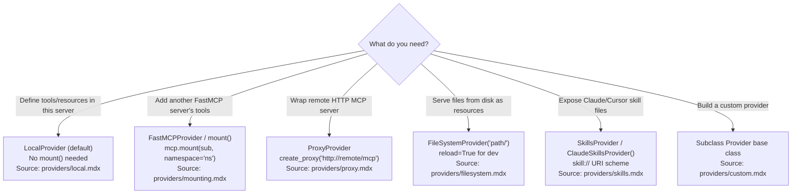
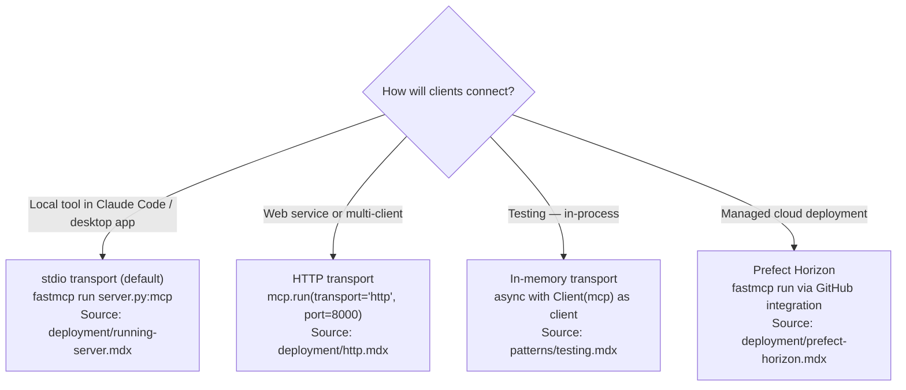
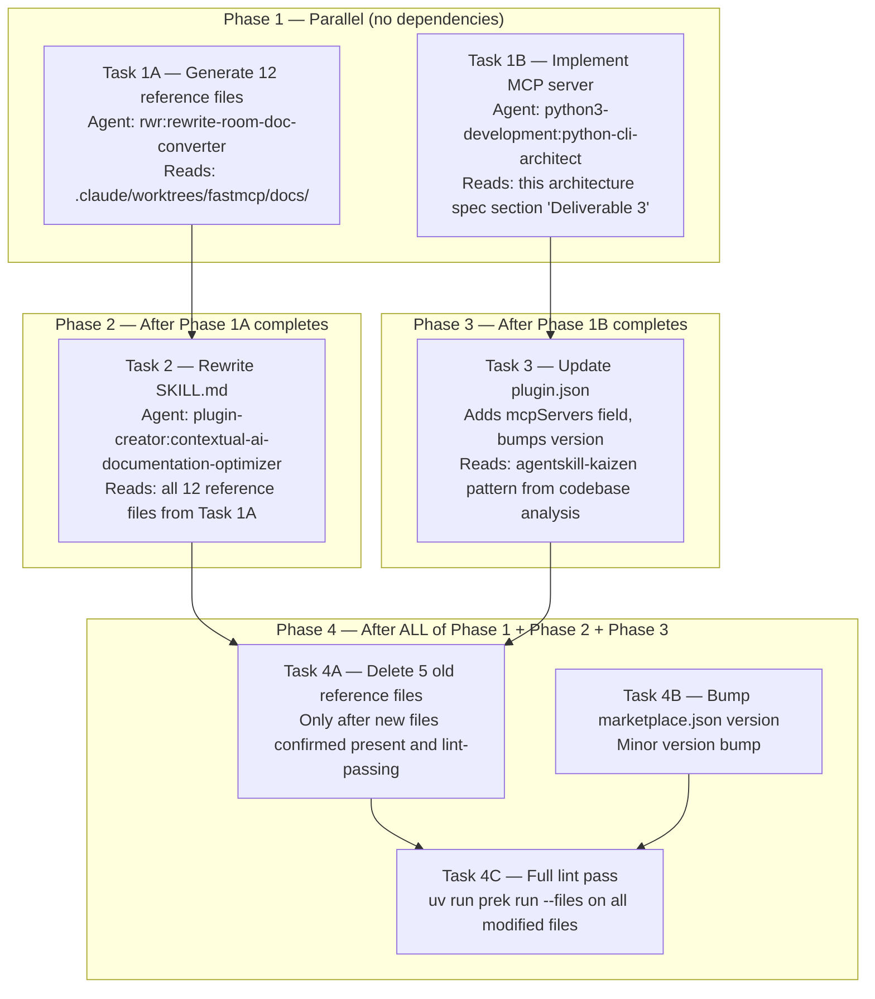

# Architecture: FastMCP Creator Plugin v3 Overhaul

**Generated**: 2026-03-05
**Status**: FINAL
**Sources**:
- `plan/feature-context-fastmcp-creator-v3-overhaul.md` (Q1–Q6 resolved)
- `plan/codebase/fastmcp-creator-architecture.md` (plugin conventions, mcpServers pattern)

---

## Table of Contents

1. [Executive Summary](#executive-summary)
2. [Component Inventory](#component-inventory)
3. [Data Flow](#data-flow)
4. [Deliverable 1 — Reference Files](#deliverable-1--reference-files)
5. [Deliverable 2 — SKILL.md Rewrite](#deliverable-2--skillmd-rewrite)
6. [Deliverable 3 — MCP Server](#deliverable-3--mcp-server)
7. [plugin.json Changes](#pluginjson-changes)
8. [Task Sequencing Constraints](#task-sequencing-constraints)
9. [Acceptance Criteria](#acceptance-criteria)
10. [Architectural Decisions](#architectural-decisions)

---

## Executive Summary

The fastmcp-creator plugin v3 overhaul replaces seven stale reference files with twelve new
source-cited files derived from `.claude/worktrees/fastmcp/docs/`, rewrites SKILL.md with
correct v3 decorator syntax and Mermaid decision flowcharts, and adds a runnable FastMCP v3
MCP server at `plugins/fastmcp-creator/server/` registered via `plugin.json mcpServers`.

Three deliverables in dependency order:

1. **Reference files** (12 new) — generated via `rwr:user-docs-to-ai-skill` from local v3 docs,
   then AI-optimized; replaces 5 of the current 9 files (4 are preserved).
2. **SKILL.md rewrite** — depends on reference files being finalized (links to them); uses
   `plugin-creator:contextual-ai-documentation-optimizer` for the trigger matrix and flowcharts.
3. **MCP server** — independent of SKILL.md; uses `FileSystemProvider` pointing at
   `references/` relative to `server.py`; registered in `plugin.json` via `mcpServers`.

All three must pass `uv run prek run --files <file>` with zero errors (SK001–SK009, FM001–FM009)
before the implementation is considered complete.

---

## Component Inventory

### Files to CREATE (new, do not exist today)

```text
plugins/fastmcp-creator/skills/fastmcp-creator/references/server-core.md
plugins/fastmcp-creator/skills/fastmcp-creator/references/providers.md
plugins/fastmcp-creator/skills/fastmcp-creator/references/transforms.md
plugins/fastmcp-creator/skills/fastmcp-creator/references/auth.md
plugins/fastmcp-creator/skills/fastmcp-creator/references/client-sdk.md
plugins/fastmcp-creator/skills/fastmcp-creator/references/apps.md
plugins/fastmcp-creator/skills/fastmcp-creator/references/advanced.md
plugins/fastmcp-creator/skills/fastmcp-creator/references/deployment.md
plugins/fastmcp-creator/skills/fastmcp-creator/references/testing.md
plugins/fastmcp-creator/skills/fastmcp-creator/references/integrations.md
plugins/fastmcp-creator/skills/fastmcp-creator/references/migration.md
plugins/fastmcp-creator/skills/fastmcp-creator/references/real-world-patterns.md
plugins/fastmcp-creator/server/server.py
plugins/fastmcp-creator/server/pyproject.toml
```

### Files to OVERWRITE (exist today, will be replaced)

```text
plugins/fastmcp-creator/skills/fastmcp-creator/SKILL.md
plugins/fastmcp-creator/.claude-plugin/plugin.json
plugins/fastmcp-creator/skills/fastmcp-creator/references/development-guidelines.md  → replaced by server-core.md + providers.md + transforms.md
plugins/fastmcp-creator/skills/fastmcp-creator/references/community-practices.md     → replaced by real-world-patterns.md
plugins/fastmcp-creator/skills/fastmcp-creator/references/mcp-best-practices.md      → replaced by advanced.md
plugins/fastmcp-creator/skills/fastmcp-creator/references/prompts-and-templates.md   → content folded into server-core.md
plugins/fastmcp-creator/skills/fastmcp-creator/references/example-projects.md        → replaced by real-world-patterns.md
```

The five files listed under "replaced by" must be deleted after the new reference files are
written and verified. They must NOT be deleted before the new files exist — a parallel-delete
risk in task planning.

### Files to PRESERVE (do not touch)

```text
plugins/fastmcp-creator/skills/fastmcp-creator/references/evaluation-guide.md
plugins/fastmcp-creator/skills/fastmcp-creator/references/typescript-mcp-server.md
plugins/fastmcp-creator/skills/fastmcp-creator/references/claude-code-mcp-integration.md
plugins/fastmcp-creator/skills/fastmcp-creator/references/accessing_online_resources.md
plugins/fastmcp-creator/skills/fastmcp-client-cli/SKILL.md
plugins/fastmcp-creator/skills/fastmcp-python-tests/SKILL.md
plugins/fastmcp-creator/skills/fastmcp-creator/scripts/  (entire directory)
plugins/fastmcp-creator/assets/hero.png
plugins/fastmcp-creator/README.md
plugins/fastmcp-creator/.claude-plugin/validator.json
```

### Files to MODIFY in place

```text
plugins/fastmcp-creator/.claude-plugin/plugin.json   — add mcpServers, bump version to 3.0.0
.claude-plugin/marketplace.json                      — bump metadata.version (minor bump)
```

### Summary counts

| Action | Count |
|--------|-------|
| Create | 14 (12 reference files + server.py + pyproject.toml) |
| Overwrite | 6 (SKILL.md + plugin.json + 5 old reference files) |
| Delete | 5 (old reference files, after new ones verified) |
| Preserve | 10 (sibling skills, eval scripts, assets, 4 reference files) |

---

## Data Flow

```mermaid
flowchart TD
    DocsSource["`.claude/worktrees/fastmcp/docs/`<br>97+ .mdx files — local v3 docs worktree"]

    subgraph Phase1["Phase 1 — Reference File Generation (parallel, 12 files)"]
        RWR["rwr:rewrite-room-doc-converter agent<br>Input: docs_path + topic file list<br>Output: references/*.md (draft)"]
        DocsSource --> RWR
        RWR --> RefDraft["12 draft reference files<br>(AI-readable, cited, language-tagged)"]
    end

    subgraph Phase2["Phase 2 — SKILL.md Authoring (sequential after Phase 1)"]
        RefDraft --> OPT["plugin-creator:contextual-ai-documentation-optimizer<br>Input: all 12 reference files + trigger matrix spec<br>Output: SKILL.md rewrite"]
        OPT --> SkillMD["plugins/fastmcp-creator/skills/fastmcp-creator/SKILL.md<br>(links to all 12 reference files via ./references/)"]
    end

    subgraph Phase3["Phase 3 — MCP Server (parallel with Phase 2)"]
        ServerSpec["Server architecture spec (this document)"]
        ServerSpec --> ServerImpl["python3-development:python-cli-architect agent<br>Input: server design spec<br>Output: server/server.py + server/pyproject.toml"]
        ServerImpl --> ServerPy["plugins/fastmcp-creator/server/server.py<br>FastMCP v3 server with FileSystemProvider + tools + prompts"]
    end

    subgraph Phase4["Phase 4 — Integration (requires Phase 1 + Phase 2 + Phase 3 complete)"]
        SkillMD --> PluginJSON
        ServerPy --> PluginJSON
        PluginJSON["plugin.json updated<br>mcpServers field added<br>version bumped to 3.0.0"]
        PluginJSON --> Cleanup["Delete 5 old reference files<br>(development-guidelines.md, community-practices.md,<br>mcp-best-practices.md, prompts-and-templates.md,<br>example-projects.md)"]
        Cleanup --> Lint["uv run prek run --files &lt;all modified files&gt;<br>Zero errors required"]
    end

    subgraph ServerRuntime["MCP Server Runtime — path resolution at startup"]
        ServerPy --> FSProvider["FileSystemProvider<br>path = Path(__file__).parent.parent /<br>'skills/fastmcp-creator/references'"]
        FSProvider --> Resources["MCP resources: mcp://references/*.md<br>Hot-reload enabled (reload=True)"]
    end
```

### Key data flow invariants

- Reference files are generated from the local worktree (``.claude/worktrees/fastmcp/docs/``),
  not from PyPI docs, training data, or the live `gofastmcp.com` website. Every claim must
  trace to a file path in the worktree.
- The SKILL.md is authored AFTER all 12 reference files are finalized, because it links to
  them and its trigger matrix reflects their contents.
- The MCP server resolves ``references/`` relative to ``server.py`` using ``Path(__file__)``
  at runtime — not via ``${CLAUDE_PLUGIN_ROOT}`` inside the Python code itself.
  ``${CLAUDE_PLUGIN_ROOT}`` is used only in ``plugin.json`` args to pass the root to the
  ``uv run fastmcp run`` command if needed, but the server code uses ``__file__`` for
  portability.
- Deletion of old reference files is a cleanup step in Phase 4, not Phase 1. Tasks must
  not delete old files before new files are confirmed present and lint-passing.

---

## Deliverable 1 — Reference Files

### Generation method

Delegate to `rwr:rewrite-room-doc-converter` agent (invoked via `rwr:user-docs-to-ai-skill` skill)
with:

- `docs_path`: `.claude/worktrees/fastmcp/docs/`
- `output_plugin`: `fastmcp-creator`
- `output_skill`: `fastmcp-creator`

The skill produces draft reference files. After generation, pass each file through
`plugin-creator:contextual-ai-documentation-optimizer` to ensure AI-facing density,
RULE/CONSTRAINT/PATTERN keyword usage, and citation format matches repo conventions.

### Topic-to-source mapping

The implementing agent MUST read each listed `.mdx` source file before writing the
corresponding reference file. No claim may appear in a reference file that cannot be traced
to one of the listed source files.

#### `server-core.md`

Source files (in read order):

```text
.claude/worktrees/fastmcp/docs/servers/server.mdx
.claude/worktrees/fastmcp/docs/servers/tools.mdx
.claude/worktrees/fastmcp/docs/servers/resources.mdx
.claude/worktrees/fastmcp/docs/servers/prompts.mdx
.claude/worktrees/fastmcp/docs/servers/context.mdx
```

Content requirements:

- `FastMCP("name")` constructor — required first step per `server.mdx`
- `@mcp.tool` decorator (NO parentheses) — canonical v3 syntax per `quickstart.mdx`
- `@mcp.resource("uri://pattern")` — resource URI template syntax
- `@mcp.prompt` — prompt registration
- `ctx: Context` parameter injection — how to access context inside tools
- `ctx.info()`, `ctx.warning()`, `ctx.error()` — logging via context
- `ctx.report_progress()` — progress reporting
- Lifespan context manager pattern (`@mcp.lifespan`)

Errors to correct from current SKILL.md:

- Remove all `@mcp.tool()` (with parentheses) examples
- Remove `ctx.get_state()` / `ctx.set_state()` — verify against `context.mdx` before
  including; if absent from source, do not include

#### `providers.md`

Source files:

```text
.claude/worktrees/fastmcp/docs/servers/providers/overview.mdx
.claude/worktrees/fastmcp/docs/servers/providers/local.mdx
.claude/worktrees/fastmcp/docs/servers/providers/mounting.mdx
.claude/worktrees/fastmcp/docs/servers/providers/proxy.mdx
.claude/worktrees/fastmcp/docs/servers/providers/filesystem.mdx
.claude/worktrees/fastmcp/docs/servers/providers/skills.mdx
.claude/worktrees/fastmcp/docs/servers/providers/custom.mdx
```

Content requirements:

- Provider taxonomy: `LocalProvider`, `FastMCPProvider` (aka `ProxyProvider`), `FileSystemProvider`,
  `SkillsProvider`, `OpenAPIProvider` — include only what is confirmed in source files
- `mcp.mount(sub_server, namespace="ns")` — composition pattern
- `create_proxy("http://remote/mcp")` — transport bridging pattern
- `FileSystemProvider("path/", reload=True)` — hot-reload development pattern
- `SkillsProvider` — exposing `skill://` URIs; `ClaudeSkillsProvider()` usage
- Custom provider: base class / protocol to implement
- RULE: state which providers are built-in vs require extras

#### `transforms.md`

Source files:

```text
.claude/worktrees/fastmcp/docs/servers/transforms/transforms.mdx
.claude/worktrees/fastmcp/docs/servers/transforms/namespace.mdx
.claude/worktrees/fastmcp/docs/servers/transforms/tool-transformation.mdx
.claude/worktrees/fastmcp/docs/servers/transforms/resources-as-tools.mdx
.claude/worktrees/fastmcp/docs/servers/transforms/prompts-as-tools.mdx
```

Content requirements:

- Five built-in transforms: `Namespace`, `ToolTransform`, `Enabled` (Visibility),
  `ResourcesAsTools`, `PromptsAsTools`
- How transforms are applied to a server or mount: `mcp.mount(sub, transforms=[...])`
- `ToolTransform` custom subclassing pattern (the `Transform` base class)
- Visibility / Enabled transform: `ctx.enable_components(tags={"tag"})` usage
- CONSTRAINT: correct transform names — the current SKILL.md has wrong names, these must
  come only from `transforms.mdx` source

#### `auth.md`

Source files:

```text
.claude/worktrees/fastmcp/docs/servers/auth/authentication.mdx
.claude/worktrees/fastmcp/docs/servers/auth/full-oauth-server.mdx
.claude/worktrees/fastmcp/docs/servers/auth/oauth-proxy.mdx
.claude/worktrees/fastmcp/docs/servers/auth/oidc-proxy.mdx
.claude/worktrees/fastmcp/docs/servers/auth/remote-oauth.mdx
.claude/worktrees/fastmcp/docs/servers/auth/token-verification.mdx
.claude/worktrees/fastmcp/docs/servers/authorization.mdx
```

Content requirements:

- `require_scopes("scope")` — endpoint-level auth (replaces removed `require_auth`)
- RULE: `require_auth` was removed in v3; `require_scopes` is the correct pattern
- OAuth flow variants: full-OAuth server, OAuth proxy, OIDC proxy, remote OAuth
- Token verification: how bearer tokens are validated
- Authorization: per-tool scope enforcement

#### `client-sdk.md`

Source files:

```text
.claude/worktrees/fastmcp/docs/clients/client.mdx
.claude/worktrees/fastmcp/docs/clients/transports.mdx
.claude/worktrees/fastmcp/docs/clients/auth/bearer.mdx
.claude/worktrees/fastmcp/docs/clients/auth/cimd.mdx
.claude/worktrees/fastmcp/docs/clients/auth/oauth.mdx
.claude/worktrees/fastmcp/docs/clients/sampling.mdx
.claude/worktrees/fastmcp/docs/clients/elicitation.mdx
```

Content requirements:

- `Client(mcp)` — in-memory transport (most common in testing)
- `Client("http://server/mcp")` — HTTP transport
- `Client(StdioTransport(...))` — stdio transport
- Bearer auth: `BearerAuth(token=...)`
- CIMD auth: new in Beta 2 — include with version citation
- OAuth client auth flow
- Sampling: how clients handle `sampling/createMessage`
- Elicitation: client-side `elicitation` response handling
- CONSTRAINT: This reference was previously excluded — the overhaul explicitly includes it
  (Q1 resolution). Remove any "EXCLUSION" language from SKILL.md.

#### `apps.md`

Source files:

```text
.claude/worktrees/fastmcp/docs/apps/overview.mdx
.claude/worktrees/fastmcp/docs/apps/low-level.mdx
```

Content requirements:

- v3.0 low-level HTML/JS API only — document what is in `low-level.mdx`
- Clearly marked callout for v3.1 Python-native framework:

  ```markdown
  > WARNING: FastMCP 3.1 (unreleased) — The Python-native app framework described in
  > `apps/overview.mdx` is NOT available in FastMCP 3.0. Do not generate code for it.
  > Source: apps/overview.mdx (accessed 2026-03-05)
  ```

- CONSTRAINT: Do not describe v3.1 App features as currently available

#### `advanced.md`

Source files:

```text
.claude/worktrees/fastmcp/docs/servers/tasks.mdx
.claude/worktrees/fastmcp/docs/servers/elicitation.mdx
.claude/worktrees/fastmcp/docs/servers/storage-backends.mdx
.claude/worktrees/fastmcp/docs/servers/middleware.mdx
.claude/worktrees/fastmcp/docs/servers/dependency-injection.mdx
.claude/worktrees/fastmcp/docs/servers/versioning.mdx
.claude/worktrees/fastmcp/docs/servers/visibility.mdx
```

Content requirements:

- Tasks: `@mcp.tool(task=True)` — NOT `task=TaskConfig(...)` (current SKILL.md is wrong)
  Requires `fastmcp[tasks]` extra; uses Docket + Redis
- Elicitation: multi-turn, multi-select, titled options, default values (v2.14.0+)
- Storage backends: pluggable in-memory/Redis for OAuth state and caching
- Middleware: request/response middleware pattern
- Dependency injection: how to inject services into tools via FastMCP DI system
- Versioning: server version declaration and negotiation
- Visibility: `ctx.enable_components(tags={"premium"})` per-session feature gating

#### `deployment.md`

Source files:

```text
.claude/worktrees/fastmcp/docs/deployment/running-server.mdx
.claude/worktrees/fastmcp/docs/deployment/http.mdx
.claude/worktrees/fastmcp/docs/deployment/server-configuration.mdx
.claude/worktrees/fastmcp/docs/deployment/prefect-horizon.mdx
```

Content requirements:

- `fastmcp run server.py:mcp` — canonical CLI run command
- HTTP transport: `mcp.run(transport="http", host=..., port=...)`
- Stdio transport: default for local tools
- Server configuration: environment variables, logging level
- Prefect Horizon: managed deployment via GitHub integration; free personal tier
- CONSTRAINT: No `.mcpb` packaging — this is not in official v3 deployment docs;
  `community-practices.md` (old file) will be deleted

#### `testing.md`

Source files:

```text
.claude/worktrees/fastmcp/docs/patterns/testing.mdx
.claude/worktrees/fastmcp/docs/development/tests.mdx
```

Content requirements:

- In-memory test pattern: `async with Client(mcp) as client:`
- `call_tool()`, `read_resource()`, `get_prompt()` — test assertion patterns
- pytest fixture patterns for FastMCP server setup
- CONSTRAINT: Cross-link to sibling skill `fastmcp-python-tests` for extended pytest patterns
  (do not duplicate what that skill covers)

#### `integrations.md`

Source files (top 8 by relevance):

```text
.claude/worktrees/fastmcp/docs/integrations/anthropic.mdx
.claude/worktrees/fastmcp/docs/integrations/openai.mdx
.claude/worktrees/fastmcp/docs/integrations/gemini.mdx
.claude/worktrees/fastmcp/docs/integrations/fastapi.mdx
.claude/worktrees/fastmcp/docs/integrations/github.mdx
.claude/worktrees/fastmcp/docs/integrations/auth0.mdx
.claude/worktrees/fastmcp/docs/integrations/azure.mdx
.claude/worktrees/fastmcp/docs/integrations/claude-code.mdx
```

Content requirements:

- Anthropic SDK: using FastMCP server tools with `anthropic` Python client
- OpenAI client: `openai` Python client calling MCP tools
- Gemini: Google GenAI client integration
- FastAPI: mounting FastMCP as a FastAPI sub-app
- GitHub: OAuth app integration
- Auth0, Azure: external OIDC providers for MCP auth
- Claude Code: `.mcp.json` config to connect Claude Code to a FastMCP server

#### `migration.md`

Source files:

```text
.claude/worktrees/fastmcp/docs/getting-started/upgrading/from-fastmcp-2.mdx
.claude/worktrees/fastmcp/docs/getting-started/upgrading/from-mcp-sdk.mdx
.claude/worktrees/fastmcp/docs/getting-started/upgrading/from-low-level-sdk.mdx
```

Content requirements:

- v2 → v3 breaking changes: decorator syntax, provider API, auth API (`require_auth` removed)
- `@mcp.tool()` → `@mcp.tool` (parens removal)
- `task=TaskConfig(...)` → `task=True`
- From MCP SDK: equivalent FastMCP patterns for raw SDK users
- From low-level SDK: high-level abstraction mapping

#### `real-world-patterns.md`

Source files:

```text
.claude/worktrees/fastmcp/docs/patterns/contrib.mdx
.claude/worktrees/fastmcp/docs/patterns/cli.mdx
.claude/worktrees/fastmcp/docs/community/showcase.mdx
```

Supplemental sources (GitHub research from feature-context, accessed 2026-03-05):

- ProxyProvider transport bridging pattern
- `mount()` + namespace for large codebase composition
- `FileSystemProvider(reload=True)` for dev, `reload=False` for prod
- `SkillsProvider` for AI tool skill sharing
- `@mcp.tool(task=True)` for long-running ops
- Visibility + `require_scopes` for access control

Content requirements:

- Every GitHub pattern must include a `SOURCE:` citation to the Exa search results or a
  specific GitHub repository URL (accessed 2026-03-05)
- CLI integration patterns from `patterns/cli.mdx`
- Community showcase links from `community/showcase.mdx`

### Reference file structural conventions

All 12 reference files must follow the pattern observed in `references/claude-code-mcp-integration.md`:

```text
# <Topic Title>

<one-line summary of what this file covers and when to read it>

SOURCE: <mdx file path or URL> (accessed 2026-03-05)

## <Section>

RULE: ...
CONSTRAINT: ...
PATTERN: ...

```python
# code example with language specifier
```

SOURCE: <specific mdx file that contains this example>
```

Rules from codebase analysis:

- No YAML frontmatter (frontmatter is for SKILL.md only)
- H1 title is required
- `SOURCE:` citation required per section that contains factual claims
- `RULE:` / `CONSTRAINT:` / `PATTERN:` prefixes for prescriptive guidance
- Language specifier on every code fence (`python`, `bash`, `json`, `toml`)
- Blank line before and after every code fence (MD031)
- Internal links use `./filename.md` relative paths

---

## Deliverable 2 — SKILL.md Rewrite

### Frontmatter specification

```yaml
---
name: fastmcp-creator
description: >-
  Use when building, extending, or debugging FastMCP v3 Python MCP servers.
  Covers tools, resources, prompts, providers, transforms, auth, client SDK,
  deployment, and testing. Grounded in local v3 docs — zero speculation.
version: 3.0.0
---
```

Validation constraints:

- `name`: `fastmcp-creator` — lowercase-hyphens only (SK001, SK002, SK003)
- `description`: must contain trigger phrase "Use when" (SK005); no colons (FM009);
  must be ≥ 20 chars (SK004)
- No `allowed-tools` field unless explicitly required (fastmcp-creator does not restrict tools)
- Body tokens must stay below SK007 error threshold (8800 tokens); SK006 (4400) is already
  suppressed in `validator.json`

### Trigger matrix

The SKILL.md body must contain a trigger matrix mapping user intent to the reference file
that answers it. Format: Markdown table is acceptable here (pure data lookup).

| User intent | v3 feature | Reference file |
|-------------|-----------|----------------|
| Build a new FastMCP server | `FastMCP()`, `@mcp.tool`, `@mcp.resource` | `./references/server-core.md` |
| Compose multiple servers | `mount()`, namespace, providers | `./references/providers.md` |
| Bridge remote HTTP server to stdio | `ProxyProvider`, `create_proxy()` | `./references/providers.md` |
| Serve files or skills as resources | `FileSystemProvider`, `SkillsProvider` | `./references/providers.md` |
| Rename or filter tools from sub-server | `ToolTransform`, `Namespace` | `./references/transforms.md` |
| Expose resources as tools | `ResourcesAsTools` | `./references/transforms.md` |
| Add authentication to a server | `require_scopes`, OAuth variants | `./references/auth.md` |
| Write a FastMCP client | `Client`, transports, `BearerAuth` | `./references/client-sdk.md` |
| Run long tasks without blocking | `@mcp.tool(task=True)` | `./references/advanced.md` |
| Add multi-turn user input to a tool | Elicitation API | `./references/advanced.md` |
| Deploy to production | Prefect Horizon, HTTP, stdio | `./references/deployment.md` |
| Write tests for FastMCP server | In-memory Client, pytest patterns | `./references/testing.md` |
| Integrate with Anthropic/OpenAI/FastAPI | Integration patterns | `./references/integrations.md` |
| Migrate from FastMCP v2 | Breaking changes, syntax fixes | `./references/migration.md` |
| Add web UI to a server | Apps low-level HTML API | `./references/apps.md` |
| Find real-world usage patterns | ProxyProvider, mount(), showcase | `./references/real-world-patterns.md` |

### Mermaid decision flowcharts (required in SKILL.md body)

Three flowcharts are required. Each must use `flowchart TD` syntax with `<br>` for line breaks
inside node labels. No bare colons inside quoted node label strings (use `=` or em dash).

#### Flowchart 1 — Choose provider type



#### Flowchart 2 — Choose transport



#### Flowchart 3 — Choose auth approach

```mermaid
flowchart TD
    Q1{Auth requirement?}
    Q1 -->|No auth needed| NA["No auth<br>Default FastMCP behavior"]
    Q1 -->|Validate bearer tokens per tool| RS["require_scopes('scope')<br>@mcp.tool(auth=require_scopes('write'))<br>Source: servers/auth/token-verification.mdx"]
    Q1 -->|Full OAuth2 server built-in| FO["Full OAuth server<br>Source: servers/auth/full-oauth-server.mdx"]
    Q1 -->|Delegate to external IdP (Auth0, Azure)| OP["OIDC proxy / OAuth proxy<br>Source: servers/auth/oidc-proxy.mdx<br>Source: servers/auth/oauth-proxy.mdx"]
    Q1 -->|Client calling protected server| CA["Client auth<br>BearerAuth / CIMDAuth / OAuthAuth<br>Source: clients/auth/*.mdx"]
```

### Quick-start examples (required in SKILL.md body)

Three inline code examples are required — short, correct, v3-canonical. Each must include
a `SOURCE:` comment citing the `.mdx` file.

Example 1 — Minimal server:

```python
# SOURCE: servers/server.mdx + servers/tools.mdx
from fastmcp import FastMCP

mcp = FastMCP("my-server")

@mcp.tool  # Note: no parentheses — v3 canonical syntax
def greet(name: str) -> str:
    """Return a greeting."""
    return f"Hello, {name}!"

if __name__ == "__main__":
    mcp.run()
```

Example 2 — Server composition:

```python
# SOURCE: servers/providers/mounting.mdx
from fastmcp import FastMCP

weather = FastMCP("weather")
main = FastMCP("main")

main.mount(weather, namespace="weather")
# Tools from weather are available as weather_<tool-name>
```

Example 3 — Background task:

```python
# SOURCE: servers/tasks.mdx — requires fastmcp[tasks]
from fastmcp import FastMCP

mcp = FastMCP("task-server")

@mcp.tool(task=True)  # Note: task=True, NOT task=TaskConfig(...)
async def long_running(data: str) -> str:
    """Process data in background."""
    # ... long operation ...
    return "done"
```

### Feature gating section (required in SKILL.md body)

A clearly marked section distinguishing available vs unreleased features:

```markdown
## Version Gating

### FastMCP 3.0 — Available Now

All features documented in this skill and its reference files are available in FastMCP 3.0
unless explicitly marked otherwise.

### FastMCP 3.1 — NOT YET RELEASED

The following features appear in local docs but are NOT available in 3.0:

- **Python-native App framework** (`apps/overview.mdx`) — do not generate code for this
- **CodeMode** (dynamic BM25 tool search + Python execution) — do not document as available

SOURCE: apps/overview.mdx states 3.1 features are unreleased (accessed 2026-03-05)
```

### Cross-skill links (required in SKILL.md body)

```markdown
## Related Skills

- For pytest patterns and in-memory testing fixtures:
  `Skill(skill: "fastmcp-creator:fastmcp-python-tests")`
- For `fastmcp list` / `fastmcp call` / `fastmcp discover` CLI usage:
  `Skill(skill: "fastmcp-creator:fastmcp-client-cli")`
- For evaluating MCP server quality:
  `./references/evaluation-guide.md`
- For Claude Code MCP config (`.mcp.json`):
  `./references/claude-code-mcp-integration.md`
```

### Sections to REMOVE from current SKILL.md

- Entire TypeScript/Node section (Q2 resolution: removed)
- `@mcp.tool()` with parentheses examples — replace with `@mcp.tool`
- `task=TaskConfig(mode="required")` — replace with `task=True`
- `require_auth` — replace with `require_scopes`
- `.mcpb` packaging section — remove entirely
- "Client-side MCP implementations" EXCLUSIONS line — removed (Q1 resolution: client-sdk included)
- Any state methods (`ctx.get_state`, `ctx.set_state`) — verify against `context.mdx` first;
  if not in source, omit

### Runtime shell command at skill load

Preserve the existing pattern at top of SKILL.md that injects Python version context:

```markdown
!`python3 --version 2>/dev/null || python --version 2>/dev/null || echo "Python not found in PATH"`
!`uv run python -c "import fastmcp; print(f'FastMCP {fastmcp.__version__}')" 2>/dev/null || echo "FastMCP not installed in active venv"`
```

The second command surfaces the installed FastMCP version so the agent knows whether it is
working with v3.0 or a pre-release. If fastmcp is not installed, the agent must note this
and offer to install it before scaffolding.

---

## Deliverable 3 — MCP Server

### Server location

```text
plugins/fastmcp-creator/server/server.py
plugins/fastmcp-creator/server/pyproject.toml
```

### Entry point and FileSystemProvider

The server uses PEP 723 inline script metadata so it runs via `uv run --script server.py`
without a separate install step. The `pyproject.toml` exists for IDE tooling support
(type checking, linting) per the PEP 723 dual-install rule.

**`server.py` API contracts** (signatures only — implementation delegated to
`python3-development:python-cli-architect`):

```python
# PEP 723 inline metadata block required at top of file
# /// script
# requires-python = ">=3.11"
# dependencies = ["fastmcp>=3.0"]
# ///

from pathlib import Path
from fastmcp import FastMCP
from fastmcp.server.providers import FileSystemProvider

# Path resolution: references/ is two levels up from server/server.py
_REFERENCES_DIR: Path  # = Path(__file__).parent.parent / "skills" / "fastmcp-creator" / "references"

mcp: FastMCP  # = FastMCP("fastmcp-creator-reference")

# FileSystemProvider mounted at server startup
# reload=True enables hot-reload when reference files change during development
```

**Tool signatures**:

```python
@mcp.tool
def scaffold_server(
    language: str,           # "python" only (TypeScript removed per Q2)
    features: list[str],     # e.g., ["auth", "filesystem-provider", "tasks"]
    server_name: str,        # e.g., "my-server"
) -> str:
    """Generate starter FastMCP v3 server code for the requested features."""
    ...

@mcp.tool
def validate_server(
    path: str,               # Path to Python file containing a FastMCP server
) -> dict[str, list[str]]:   # {"errors": [...], "warnings": [...]}
    """Check a FastMCP server file for v3 syntax errors and deprecated patterns.

    Validates:
    - @mcp.tool() with parentheses (should be @mcp.tool)
    - task=TaskConfig(...) usage (should be task=True)
    - require_auth usage (removed in v3; use require_scopes)
    - Missing mcp = FastMCP("name") constructor
    """
    ...

@mcp.tool
def version_check() -> dict[str, str]:
    """Return installed fastmcp version and latest available on PyPI.

    Returns {"installed": "3.0.x", "latest": "3.0.y", "up_to_date": "true|false"}.
    Compares installed vs PyPI latest. Does NOT compare against worktree version.
    """
    ...

@mcp.tool
def search_docs(
    query: str,              # Free-text search query
    max_results: int = 5,    # Maximum number of results to return
) -> list[dict[str, str]]:   # [{"file": "...", "section": "...", "snippet": "..."}]
    """Search the local FastMCP v3 docs worktree at .claude/worktrees/fastmcp/docs/.

    Performs case-insensitive substring + keyword search across .mdx files.
    Returns file paths and matching snippets — does not summarize or interpret results.
    """
    ...
```

**Prompt signatures**:

```python
@mcp.prompt
def scaffold_new_server() -> str:
    """Prompt: guide the user through scaffolding a new FastMCP v3 server.

    Asks: server name, features needed (auth/tasks/providers), transport type.
    Returns a structured prompt that calls scaffold_server() with the collected inputs.
    """
    ...

@mcp.prompt
def choose_provider() -> str:
    """Prompt: help the user choose the right FastMCP provider for their use case.

    Presents the provider decision flowchart and asks clarifying questions.
    """
    ...

@mcp.prompt
def migrate_from_v2() -> str:
    """Prompt: guide migration of a FastMCP v2 server to v3.

    Asks for the v2 server file path, then returns a checklist of required changes
    sourced from migration.md.
    """
    ...
```

### FileSystemProvider path resolution

The server resolves the references directory using `Path(__file__)` at runtime:

```python
_REFERENCES_DIR = Path(__file__).parent.parent / "skills" / "fastmcp-creator" / "references"
```

This path is valid when the server runs from `plugins/fastmcp-creator/server/server.py`.
It resolves to `plugins/fastmcp-creator/skills/fastmcp-creator/references/`.

The `${CLAUDE_PLUGIN_ROOT}` variable from `plugin.json` is NOT used inside `server.py` —
it is only used in `plugin.json` args if the server needs the plugin root passed as a
command-line argument. For this server, `__file__`-relative resolution is sufficient and
more portable.

### `pyproject.toml` structure

```toml
[project]
name = "fastmcp-creator-server"
version = "3.0.0"
requires-python = ">=3.11"
dependencies = [
    "fastmcp>=3.0",
]

[tool.ruff]
line-length = 100
target-version = "py311"

[tool.mypy]
python_version = "3.11"
strict = true
```

The `pyproject.toml` exists for IDE support only — `uv run --script` uses PEP 723 inline
metadata from `server.py` at runtime.

### validate_server tool — scope definition

`validate_server` checks Python syntax and FastMCP v3 pattern compliance only:

- `@mcp.tool()` with parentheses → error ("use `@mcp.tool` without parentheses")
- `task=TaskConfig(...)` → error ("use `task=True` instead")
- `require_auth` → error ("removed in v3; use `require_scopes`")
- Missing `mcp = FastMCP(...)` constructor → error
- Import of `fastmcp` v2-only modules → warning

It does NOT validate plugin YAML frontmatter (that is `plugin_validator.py`'s job) and does
NOT validate MCP protocol compliance (that is `fastmcp-python-tests`'s job).

### version_check tool — version source

Compares:

- Installed: `importlib.metadata.version("fastmcp")`
- Latest: PyPI JSON API at `https://pypi.org/pypi/fastmcp/json` (field `info.version`)

Does NOT compare against the local worktree version (which may be a development pre-release).
Returns a dict so the calling agent can format the comparison as needed.

---

## plugin.json Changes

### Target `plugin.json` structure

Following the `agentskill-kaizen` pattern exactly (SOURCE: `plan/codebase/fastmcp-creator-architecture.md`,
section 7 — only in-repo example using `mcpServers`):

```json
{
  "name": "fastmcp-creator",
  "description": "Build Model Context Protocol (MCP) servers with FastMCP v3. Authoritative v3 reference — tools, providers, transforms, auth, client SDK, deployment, testing.",
  "version": "3.0.0",
  "author": {
    "name": "Jamie Nelson",
    "url": "https://github.com/bitflight-devops"
  },
  "mcpServers": {
    "fastmcp-reference": {
      "command": "uv",
      "args": [
        "run",
        "--script",
        "${CLAUDE_PLUGIN_ROOT}/server/server.py"
      ]
    }
  }
}
```

### Field-by-field rationale

**`mcpServers` key**: `fastmcp-reference` — lowercase-hyphens, descriptive of what the server
does (exposes FastMCP reference docs), not the plugin name itself. Avoids collision if the
plugin name is used elsewhere.

**`command`**: `uv` — not `uvx` (which is for PyPI-published servers). The server is a local
PEP 723 script bundled with the plugin. `uv run --script` is the correct invocation pattern
(SOURCE: agentskill-kaizen uses `uv run --script` for its local `mcp/server.py`).

**`args`**: `["run", "--script", "${CLAUDE_PLUGIN_ROOT}/server/server.py"]` — `${CLAUDE_PLUGIN_ROOT}`
is the runtime variable for the plugin root directory. This resolves to the absolute path
of `plugins/fastmcp-creator/` at runtime.

**No `fastmcp run` wrapper**: Using `uv run --script server.py` directly (which starts the
server via its `if __name__ == "__main__": mcp.run()` block) is simpler than
`uv run fastmcp run server.py:mcp`. Both work; `--script` is the pattern agentskill-kaizen
uses and is consistent with PEP 723 script design.

**`version`**: `3.0.0` — major version bump from `2.4.3` signals the breaking change
(TypeScript removed, all references replaced, MCP server added).

**`description`**: Updated to reflect v3-only Python focus and the new reference scope.
No colons in the value (FM009 constraint) — the colon after "MCP" is inside the server name
string and acceptable; the description itself uses em dashes if needed.

### `marketplace.json` change

```json
{
  "metadata": {
    "version": "<current + minor bump>"
  }
}
```

The `fastmcp-creator` entry in `.claude-plugin/marketplace.json` does not change — its
`"source": "./plugins/fastmcp-creator"` remains valid. Only `metadata.version` is bumped
(minor, per repo convention for adding/updating plugins).

### validator.json — no changes required

The existing `validator.json` suppresses SK006 for `skills/fastmcp-creator`. This suppression
remains valid — the new SKILL.md will still be intentionally large. No changes needed.

---

## Task Sequencing Constraints



### Hard sequencing constraints

1. **Reference files before SKILL.md**: SKILL.md links to all 12 reference files by relative
   path. Writing SKILL.md before the reference files exist means dead links that will fail
   human review (though not validator checks).

2. **All files before deletion**: The 5 old reference files (`development-guidelines.md`,
   `community-practices.md`, `mcp-best-practices.md`, `prompts-and-templates.md`,
   `example-projects.md`) must NOT be deleted until the replacement files are confirmed
   present. A task that deletes first and creates second risks data loss if the create step
   fails.

3. **plugin.json after server.py exists**: `plugin.json` references `server/server.py` via
   `${CLAUDE_PLUGIN_ROOT}/server/server.py`. The file must exist before plugin.json is
   committed, otherwise the MCP server will fail to start.

4. **Lint after every write**: Each task should run `uv run prek run --files <file>` on
   its output before marking the task COMPLETE. Do not batch lint to Phase 4 — catch
   errors at the source task.

### Parallelism opportunities

- Task 1A (reference files) and Task 1B (MCP server) have no shared inputs and can run
  concurrently.
- Task 4B (marketplace version bump) can run in parallel with Task 4A (deletion) since
  they touch different files.
- Within Task 1A, individual reference files can be generated concurrently (each reads
  independent source `.mdx` files with no overlapping content).

### Blocked-by mapping

| Task | Blocked by |
|------|-----------|
| Task 2 (SKILL.md) | Task 1A (all 12 reference files complete) |
| Task 3 (plugin.json) | Task 1B (server.py exists) |
| Task 4A (delete old refs) | Task 1A + Task 2 (new refs + SKILL.md verified) |
| Task 4C (full lint) | Task 4A + Task 4B (all files finalized) |

---

## Acceptance Criteria

### Deliverable 1 — Reference Files

**AC-R01**: All 12 reference files exist at
`plugins/fastmcp-creator/skills/fastmcp-creator/references/<name>.md`.

**AC-R02**: Each reference file has an H1 title as its first line (no YAML frontmatter).

**AC-R03**: Every factual claim in each reference file has a `SOURCE:` citation to a specific
`.mdx` file in `.claude/worktrees/fastmcp/docs/` or a URL with access date.

**AC-R04**: All code fences in reference files have a language specifier (`python`, `bash`,
`json`, `toml`, `text`, etc.). No bare ` ``` ` fences.

**AC-R05**: All code fences are surrounded by blank lines (MD031). Running
`uv run prek run --files <file>` produces zero markdown linting errors.

**AC-R06**: `server-core.md` contains `@mcp.tool` (no parentheses) and does NOT contain
`@mcp.tool()` (with parentheses).

**AC-R07**: `advanced.md` contains `task=True` and does NOT contain `task=TaskConfig`.

**AC-R08**: `auth.md` contains `require_scopes` and does NOT contain `require_auth`.

**AC-R09**: `apps.md` contains the v3.1 unreleased warning callout and does NOT describe
Python-native app framework features as available in v3.0.

**AC-R10**: The 4 preserved reference files are unchanged:
`evaluation-guide.md`, `typescript-mcp-server.md`, `claude-code-mcp-integration.md`,
`accessing_online_resources.md`.

### Deliverable 2 — SKILL.md

**AC-S01**: SKILL.md frontmatter contains `name: fastmcp-creator` (exact, no uppercase,
no underscores). Passes SK001, SK002, SK003.

**AC-S02**: Description contains "Use when" trigger phrase. Passes SK005.

**AC-S03**: No colon characters in the `description` value (FM009). Running
`uv run prek run --files plugins/fastmcp-creator/skills/fastmcp-creator/SKILL.md`
produces zero errors (warnings acceptable if SK006 is suppressed in validator.json).

**AC-S04**: SKILL.md body contains the trigger matrix table covering all 16 intents listed
in this spec.

**AC-S05**: SKILL.md body contains all three Mermaid flowcharts: choose-provider,
choose-transport, choose-auth. Each uses `flowchart TD` syntax.

**AC-S06**: SKILL.md body contains all three quick-start code examples with `SOURCE:`
comments.

**AC-S07**: SKILL.md body contains the version gating section with FastMCP 3.1 unreleased
warning.

**AC-S08**: SKILL.md body links to both sibling skills via `Skill(skill: "...")` syntax.

**AC-S09**: SKILL.md does NOT contain the TypeScript/Node section (Q2 resolution).

**AC-S10**: SKILL.md does NOT contain `@mcp.tool()` with parentheses in any code example.

**AC-S11**: SKILL.md does NOT contain `task=TaskConfig` in any code example.

**AC-S12**: SKILL.md does NOT contain `require_auth` as a recommended pattern.

**AC-S13**: SKILL.md does NOT list "Client-side MCP implementations" as an exclusion
(Q1 resolution — client-sdk is now included).

**AC-S14**: All links to reference files in SKILL.md use `./references/<name>.md` relative
paths, and each linked file exists.

**AC-S15**: SKILL.md body token count does not exceed SK007 error threshold (8800 tokens).
Verify with: `uv run prek run --files plugins/fastmcp-creator/skills/fastmcp-creator/SKILL.md`.

### Deliverable 3 — MCP Server

**AC-M01**: `plugins/fastmcp-creator/server/server.py` exists and contains PEP 723 inline
metadata with `dependencies = ["fastmcp>=3.0"]`.

**AC-M02**: `server.py` defines `mcp = FastMCP("fastmcp-creator-reference")`.

**AC-M03**: `server.py` mounts a `FileSystemProvider` pointing at the `references/` directory
using `Path(__file__)` for path resolution.

**AC-M04**: `server.py` defines four tools: `scaffold_server`, `validate_server`,
`version_check`, `search_docs`.

**AC-M05**: `server.py` defines three prompts: `scaffold_new_server`, `choose_provider`,
`migrate_from_v2`.

**AC-M06**: `uv run --script plugins/fastmcp-creator/server/server.py` starts without
import errors (test with `timeout 5 uv run --script server.py && echo OK`).

**AC-M07**: `plugins/fastmcp-creator/server/pyproject.toml` exists with
`requires-python = ">=3.11"` and `fastmcp>=3.0` as a dependency.

**AC-M08**: `validate_server` tool correctly identifies `@mcp.tool()` with parentheses as
an error when given a test file containing that pattern.

### plugin.json and housekeeping

**AC-P01**: `plugin.json` contains `"mcpServers"` as a top-level field with key
`"fastmcp-reference"`.

**AC-P02**: `mcpServers["fastmcp-reference"]["command"]` is `"uv"`.

**AC-P03**: `mcpServers["fastmcp-reference"]["args"]` is
`["run", "--script", "${CLAUDE_PLUGIN_ROOT}/server/server.py"]`.

**AC-P04**: `plugin.json` version is `"3.0.0"`.

**AC-P05**: The 5 old reference files no longer exist after Phase 4 cleanup:
`development-guidelines.md`, `community-practices.md`, `mcp-best-practices.md`,
`prompts-and-templates.md`, `example-projects.md`.

**AC-P06**: `.claude-plugin/marketplace.json` `metadata.version` is bumped (minor) from
its current value.

**AC-P07**: `uv run prek run --files plugins/fastmcp-creator/.claude-plugin/plugin.json`
produces zero errors.

---

## Architectural Decisions

### ADR-001 — FileSystemProvider over SkillsProvider for resource serving

**Status**: Accepted (Q4 resolution)

**Context**: The MCP server needs to serve the plugin's reference files as MCP resources.
Three options were evaluated: `SkillsProvider` (self-referential `skill://` URIs),
`FileSystemProvider("references/")` (filesystem resources with hot-reload), and manual
per-file registration.

**Decision**: Use `FileSystemProvider` with path resolved relative to `server.py` via
`Path(__file__)`.

**Rationale**:

- `FileSystemProvider` requires no assumption about install location — `__file__` always
  resolves correctly regardless of how the plugin is installed
- Hot-reload (`reload=True`) is useful during skill development without server restart
- Manual registration requires updating `server.py` every time a reference file is added
- `SkillsProvider` would require knowing the plugin's root path at install time, which
  varies between users

**Trade-off**: `FileSystemProvider` exposes raw markdown files; `SkillsProvider` would
expose them via a structured `skill://` URI scheme. The raw markdown format is sufficient
for Claude Code agents reading the resources.

---

### ADR-002 — `uv run --script` over `uv run fastmcp run`

**Status**: Accepted (Q3 resolution)

**Context**: Two equivalent startup commands exist:

- `uv run --script plugins/fastmcp-creator/server/server.py` — PEP 723 script execution
- `uv run fastmcp run plugins/fastmcp-creator/server/server.py:mcp` — FastMCP CLI runner

**Decision**: Use `uv run --script server.py` in `plugin.json` args.

**Rationale**:

- `uv run --script` is the pattern used by `agentskill-kaizen` (the only in-repo example
  with a locally bundled MCP server) — consistency over novelty
- PEP 723 inline metadata declares `fastmcp>=3.0` as a dependency — `uv run --script`
  resolves it automatically without a separate install
- `fastmcp run` adds an extra CLI layer that provides no benefit for a simple always-on
  reference server

**Consequence**: `server.py` must contain `if __name__ == "__main__": mcp.run()` and the
PEP 723 metadata block at the top.

---

### ADR-003 — Hybrid rwr + optimizer approach for reference files

**Status**: Accepted (Q6 resolution)

**Context**: Reference files could be:
A) Generated entirely by `rwr:user-docs-to-ai-skill`
B) Authored manually from the `.mdx` sources
C) Generated by `rwr` then optimized by `contextual-ai-documentation-optimizer`

**Decision**: Option C — hybrid approach.

**Rationale**:

- `rwr:user-docs-to-ai-skill` is designed exactly for this: converting a docs directory into
  AI-facing reference files. Using it respects the repo's existing tooling investment.
- The rwr agent handles bulk extraction and grouping; it does not specialize in the RULE:/
  CONSTRAINT:/PATTERN: keyword conventions used in this repo's reference files.
- `contextual-ai-documentation-optimizer` applies those conventions and the SKILL.md trigger
  matrix design — a task that requires understanding the full 12-file scope, not just one file.
- The two tools have complementary strengths: rwr for breadth, optimizer for depth/density.

**Constraint**: The rwr agent must be given the exact topic-to-source mapping from this spec
(Deliverable 1 section), not a free-form "convert everything." Unconstrained conversion may
group files differently than the spec requires.

---

### ADR-004 — v3.1 features documented as unreleased, not omitted

**Status**: Accepted (Q5 resolution)

**Context**: FastMCP 3.1 features (Python-native Apps, CodeMode) appear in local docs but
are not yet released. Two options: document as "coming soon" or omit entirely.

**Decision**: Include in reference files with a clearly marked unreleased warning callout.
Do not document as currently available.

**Rationale**:

- Omitting creates a gap when users ask "what is CodeMode?" — the skill would have no answer
- Including with a warning prevents Claude Code from generating broken v3.1 code
- The `apps/overview.mdx` source itself describes v3.1 as unreleased — matching its framing
  in our docs is source-faithful

**Format**: Use a `> WARNING:` blockquote with explicit "NOT available in FastMCP 3.0"
language. Do not use "coming soon" (implies imminent release; we do not know the timeline).

---

### ADR-005 — Client SDK included as reference topic

**Status**: Accepted (Q1 resolution)

**Context**: The current SKILL.md lists "Client-side MCP implementations" as an explicit
exclusion. The overhaul request lists `client-sdk` as one of the 12 reference topics.

**Decision**: Include `client-sdk.md` covering `Client`, transports, auth (bearer/CIMD/OAuth),
sampling, and client-side elicitation.

**Rationale**:

- The brainstorming session (2026-03-05) explicitly listed `client-sdk` as a reference target
- `fastmcp-client-cli` covers only the CLI (`fastmcp list`, `fastmcp call`) — the Python
  `Client` class and programmatic SDK usage is distinct and not covered elsewhere
- Developers building agents that call FastMCP servers (e.g., the MCP server in this plugin
  itself uses `Client` in tests) need this reference

**Consequence**: Remove the "EXCLUSIONS: Client-side MCP implementations" line from SKILL.md.
The `fastmcp-client-cli` sibling skill remains for CLI-focused users.

---

## Post-Implementation Annotations

_Added by context-refinement agent on 2026-03-05_

### Design Refinements

1. **mcp.add_provider() is the correct API; scaffold template still uses mcp.include() (bug)**: The
   implemented server correctly calls `mcp.add_provider()` to attach the `FileSystemProvider`. The
   architecture spec did not explicitly specify which method to use (the spec body showed signatures
   and path resolution, not the mount call). However, the `scaffold_server()` tool's generated
   template still emits `mcp.include(FileSystemProvider(...))` — this is incorrect for FastMCP v3
   and will fail at runtime. A follow-up fix is required.
   - Original: Architecture spec was silent on `add_provider` vs `include` distinction
   - Actual: `server.py` line 40 uses `mcp.add_provider()`; `scaffold_server()` output on line 116
     uses `mcp.include()` (bug)
   - Recorded in: plan/tasks-1-fastmcp-creator-v3-overhaul.md, DN-1

2. **accessing_online_resources.md does not exist in the repository**: The architect spec listed
   this file under "Files to PRESERVE" but it was never present in the references directory. The
   preserve constraint was vacuously satisfied. This file can be dropped from all future preserve
   lists.
   - Original: `plugins/fastmcp-creator/skills/fastmcp-creator/references/accessing_online_resources.md` listed as preserve target
   - Actual: File does not exist; glob search returned no results
   - Recorded in: plan/tasks-1-fastmcp-creator-v3-overhaul.md, DN-2

3. **advanced.md sourced from only 2 of 7 planned .mdx files**: Five of the seven source files
   listed for `advanced.md` were absent from the local worktree. The sections they would have
   covered (storage backends, middleware, dependency injection, versioning, visibility) were
   omitted from `advanced.md` rather than fabricated from training data. The worktree at
   `.claude/worktrees/fastmcp/docs/` is incomplete relative to what this spec assumed.
   - Original: Seven source files listed for `advanced.md` including `storage-backends.mdx`,
     `middleware.mdx`, `dependency-injection.mdx`, `versioning.mdx`, `visibility.mdx`
   - Actual: Only `servers/tasks.mdx` and `servers/elicitation.mdx` existed; five files absent
   - Recorded in: plan/tasks-1-fastmcp-creator-v3-overhaul.md, DN-3

4. **apps.md mixed-stability treatment**: `apps/overview.mdx` interleaves v3.0 stable content with
   v3.1 unreleased content without clear separation. The implementation added a WARNING block at the
   file top as specified. The constraint "do not describe v3.1 features as available" was satisfied,
   but required source-level judgment to isolate stable from unreleased sections.
   - Original: "v3.0 low-level HTML/JS API only — document what is in `low-level.mdx`"
   - Actual: File written with v3.0 content from `low-level.mdx` plus WARNING block quoting
     `apps/overview.mdx` as source for the unreleased v3.1 warning
   - Recorded in: plan/tasks-1-fastmcp-creator-v3-overhaul.md, DN-4
