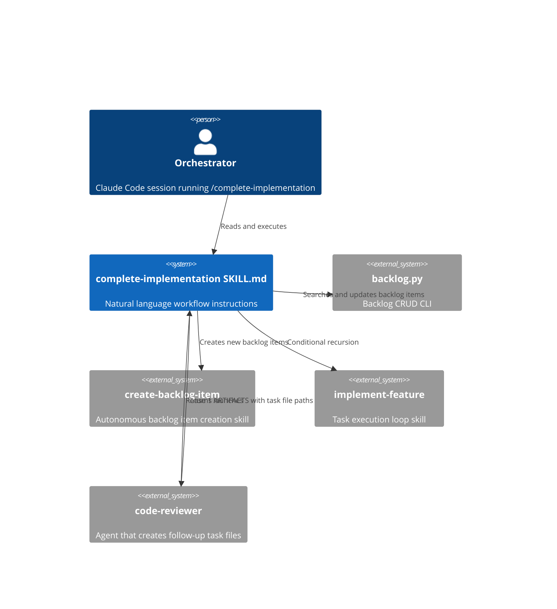
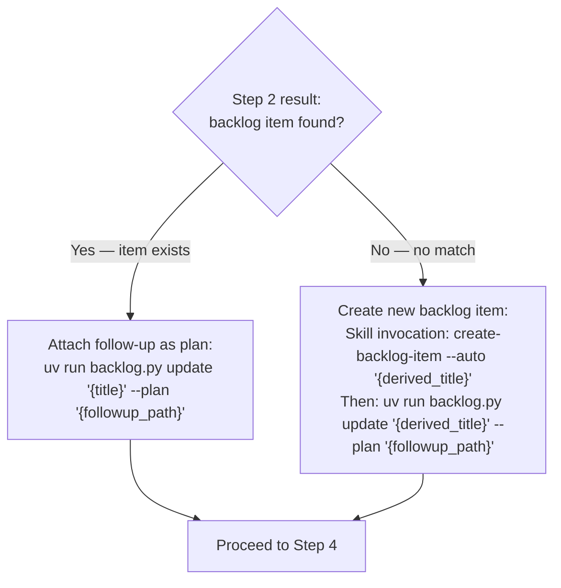
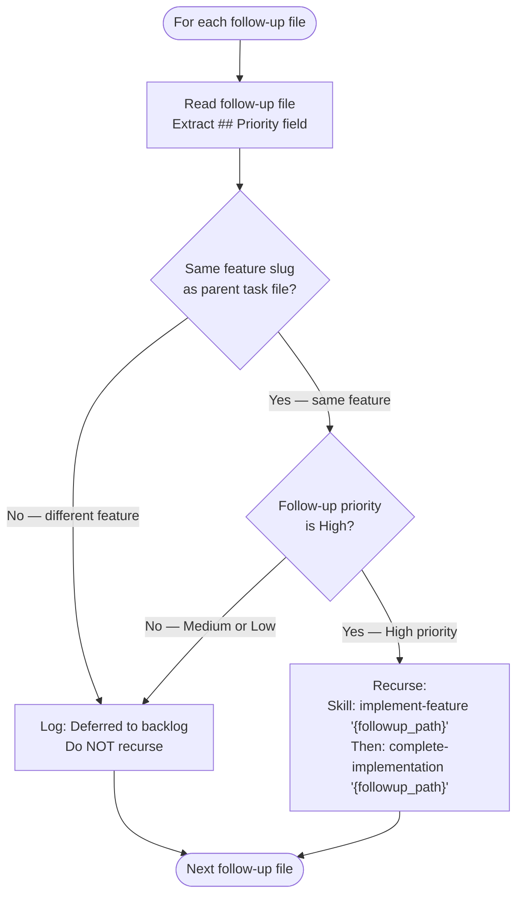
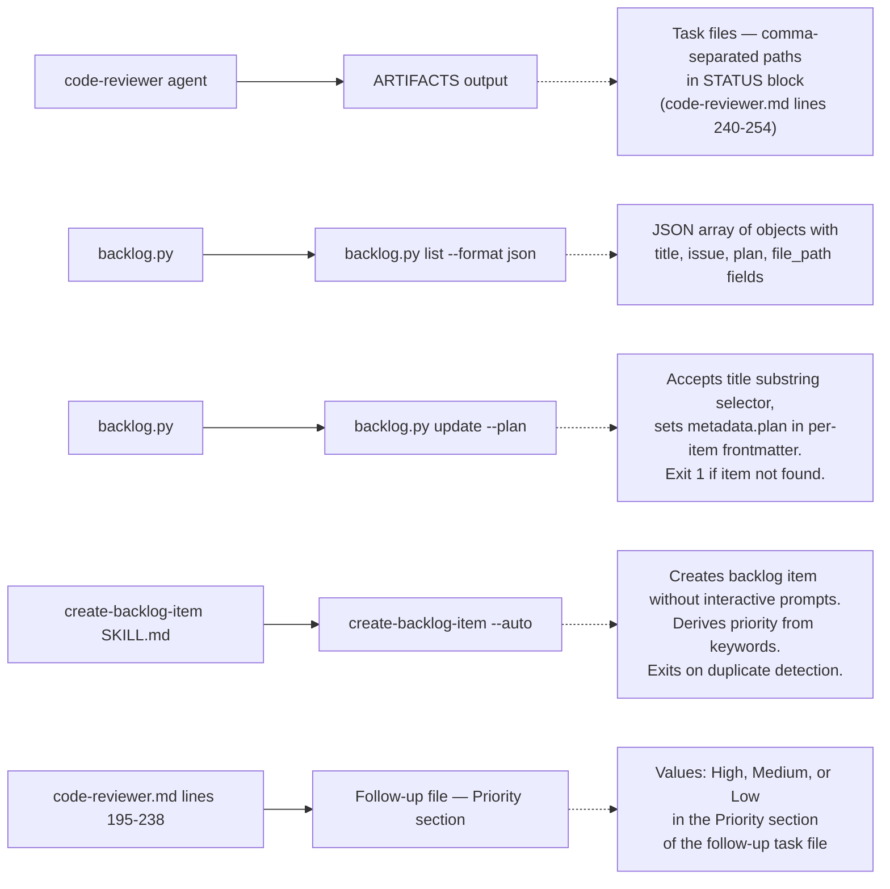
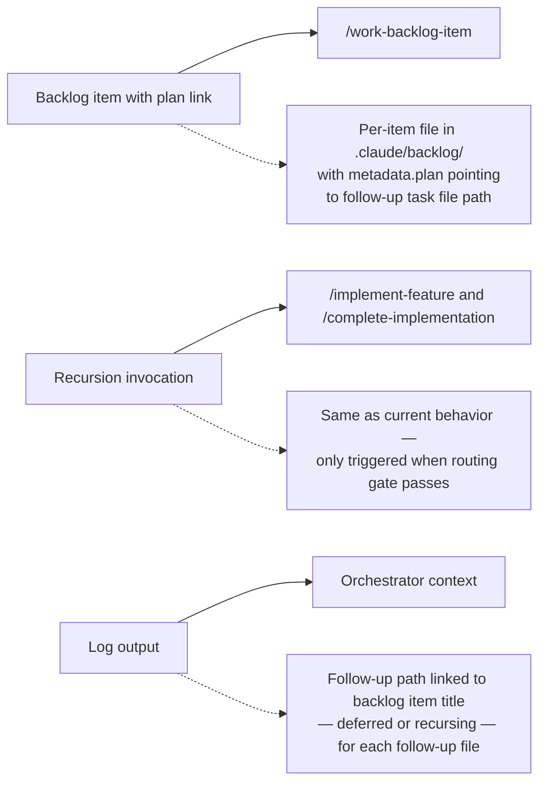

# Architecture: Follow-up Task File Routing to Backlog

## Executive Summary

Replace the unconditional recursion in `/complete-implementation`'s "Recursive Follow-up Handling" section with a routing step that ensures every follow-up task file is tracked in the backlog before any recursion decision is made. The routing step is expressed as orchestrator-level natural language instructions in the SKILL.md document, not as a Python script.

## Problem Statement

The current [complete-implementation SKILL.md](./../.claude/skills/complete-implementation/SKILL.md) (lines 57-65) unconditionally recurses with `/implement-feature` when the `code-reviewer` creates follow-up task files. When the orchestrator skips recursion (timeout, context compaction, deferred scope), follow-up files are orphaned at `plan/` with no backlog item, no GitHub issue, and no mechanism to rediscover them. This has occurred 3+ times in recent sessions.

SOURCE: GitHub Issue #381 (observed 2026-03-02)

## Architectural Decisions

### ADR-1: Routing Logic Lives in SKILL.md, Not a Script

**Status**: Accepted
**Context**: The routing step could be a Python script or orchestrator instructions in the SKILL.md.
**Decision**: Express routing as natural language workflow steps in [complete-implementation/SKILL.md](./../.claude/skills/complete-implementation/SKILL.md), consistent with the existing pattern where all phase logic is orchestrator instructions.
**Rationale**: The existing six phases (code-reviewer, feature-verifier, integration-checker, doc-drift-auditor, service-docs-maintainer, context-refinement) are all orchestrator instructions, not scripts. A script would break the pattern and require maintaining a separate execution context. The routing logic is a sequence of 4-5 CLI invocations with conditional branching -- well within the orchestrator's capability.
**Consequences**: The orchestrator must execute the routing steps sequentially. If the orchestrator fails mid-sequence, partial state may exist (backlog item created but plan not attached, or vice versa). This is acceptable because partial tracking is strictly better than no tracking.

### ADR-2: "Same Priority" Means Follow-up Priority Matches Parent Feature Priority

**Status**: Accepted (resolves feature-context Q1)
**Context**: The feature request says "only recurse if same priority" but does not define what values to compare.
**Decision**: Compare the follow-up file's `## Priority` field (High/Medium/Low) against the parent task file's feature priority. "High" follow-ups for a high-priority parent feature are "same priority." All other combinations defer to backlog.
**Rationale**: The follow-up task file structure (defined in [code-reviewer.md](./../plugins/python3-development/agents/code-reviewer.md) lines 195-238) includes a `## Priority` section with High/Medium/Low values. The parent task file's priority is available from its YAML frontmatter or the originating backlog item. Comparing these two values is deterministic and observable.
**Mapping**: Follow-up `High` maps to parent P0/P1. Follow-up `Medium` maps to parent P2. Follow-up `Low` maps to parent Ideas/deferred. "Same priority" = both are in the high band (High + P0/P1).

### ADR-3: "Same Session Scope" Means Same Feature Slug

**Status**: Accepted (resolves feature-context Q2)
**Context**: "Session scope" is not a defined concept in the current workflow.
**Decision**: A follow-up is "same session scope" when it shares the same feature slug as the parent task file. This is already encoded in the naming convention: `plan/tasks-{N}-{slug}-followup-{k}.md` inherits the slug from the parent `plan/tasks-{N}-{slug}.md`.
**Rationale**: The slug is deterministic, extractable from the filename, and already used by `implementation_manager.py` for task grouping. Context budget thresholds are non-deterministic and vary by model/session. User-declared boundaries require interactive input. The slug comparison is the only option that is both deterministic and automatable.
**Consequence**: Cross-feature follow-ups (where the code-reviewer identifies an issue in a different feature) always defer to backlog. This is the desired behavior -- cross-feature work should not be silently absorbed into the current session.

### ADR-4: Backlog Item Is Always Created Before Recursion Decision

**Status**: Accepted (resolves feature-context Q3)
**Context**: If a backlog item is created AND recursion succeeds, the backlog item exists for already-completed work.
**Decision**: Always create/link the backlog item first, then decide whether to recurse. If recursion completes successfully, the backlog item persists as a tracking record. It is NOT auto-closed.
**Rationale**: The backlog item serves two purposes: (1) tracking the follow-up if recursion is skipped, and (2) audit trail if recursion succeeds. Auto-closing introduces a race condition: the orchestrator would need to determine "success" of the recursive `/implement-feature` + `/complete-implementation` cycle, which itself may produce further follow-ups. Leaving the item open for manual closure via `/work-backlog-item` is safer and matches the existing pattern where backlog items are explicitly resolved.

### ADR-5: Follow-up Detection Uses Both ARTIFACTS and Glob

**Status**: Accepted (resolves feature-context Q5)
**Context**: Two detection methods exist -- parsing the code-reviewer's ARTIFACTS output, or globbing.
**Decision**: Use the code-reviewer's ARTIFACTS `Task files:` list as the primary source. After consuming ARTIFACTS, run a confirmatory glob for `plan/tasks-*-{slug}-followup-*.md` to catch any files not listed in ARTIFACTS (defensive).
**Rationale**: ARTIFACTS is the structured output contract of the code-reviewer agent ([code-reviewer.md](./../plugins/python3-development/agents/code-reviewer.md) lines 240-254). It is the most reliable source because it lists exactly the files created in this review. The glob is a defensive fallback that catches edge cases (agent created a file but forgot to list it, or output was truncated). The glob is scoped to the current feature slug to avoid picking up stale files from prior features.

## System Context



## Component Design

### Modified Component: Recursive Follow-up Handling Section

**Location**: [.claude/skills/complete-implementation/SKILL.md](./../.claude/skills/complete-implementation/SKILL.md) lines 57-65
**Change type**: Replace section content
**Purpose**: Route follow-up task files to backlog before deciding on recursion

The replacement section contains these sequential steps, expressed as orchestrator instructions:

#### Step 1: Detect Follow-up Files

**Input**: Code-reviewer ARTIFACTS output (from Phase 1)
**Action**: Extract file paths from the `Task files:` list in the ARTIFACTS section. If the list is empty or absent, run a confirmatory glob:

```bash
Glob pattern: plan/tasks-*-{slug}-followup-*.md
```

Where `{slug}` is extracted from the parent task file path (`plan/tasks-{N}-{slug}.md`).

**Output**: List of follow-up file paths. If empty, skip the entire routing section (no follow-ups to route).

#### Step 2: For Each Follow-up File, Search Backlog

**Input**: One follow-up file path (e.g., `plan/tasks-8-data-validation-followup-1.md`)
**Action**: Derive a search title from the filename:

1. Strip the `plan/tasks-{N}-` prefix
2. Strip the `-followup-{k}.md` suffix
3. Convert hyphens to spaces
4. Result: the feature slug in human-readable form (e.g., `data validation`)

Search backlog for an existing item matching these keywords:

```bash
uv run .claude/skills/backlog/scripts/backlog.py list --format json -R Jamie-BitFlight/claude_skills
```

Parse the JSON output. For each item, check if the derived title keywords appear (case-insensitive substring match) in the item's `title` field.

**Output**: Matched backlog item (title, file_path, issue), or null if no match.

#### Step 3: Link or Create Backlog Item

**Decision**: Based on Step 2 output.



**Match found** -- attach follow-up as plan to existing item:

```bash
uv run .claude/skills/backlog/scripts/backlog.py update "{matched_item_title}" --plan "{followup_file_path}" -R Jamie-BitFlight/claude_skills
```

**No match found** -- create a new backlog item then attach the plan:

```text
Skill(skill: "create-backlog-item", args: "--auto {derived_title}")
```

Then attach the follow-up file as the plan:

```bash
uv run .claude/skills/backlog/scripts/backlog.py update "{derived_title}" --plan "{followup_file_path}" -R Jamie-BitFlight/claude_skills
```

If `backlog.py update` exits code 1 (item not found after creation), this indicates a title mismatch between what `create-backlog-item` produced and what `update` searched for. In this case, re-run `backlog.py list --format json`, find the most recently added item, and retry the update with its exact title.

#### Step 4: Recursion Decision Gate

**Input**: Follow-up file path, parent task file path
**Decision criteria**: Two conditions must BOTH be true for recursion.



**Condition 1 -- Same session scope**: The follow-up file's slug (extracted from filename) matches the parent task file's slug. Both filenames follow `plan/tasks-{N}-{slug}...` so the slug extraction is: take the filename, strip `tasks-{N}-` prefix, and for the parent strip `.md`, for the follow-up strip `-followup-{k}.md`.

**Condition 2 -- Same priority**: The follow-up file's `## Priority` section contains `High`. Read the follow-up file content to extract this value. Only `High` priority follow-ups qualify for immediate recursion.

**If both conditions are met** -- recurse immediately (existing behavior):

```text
Skill(skill="implement-feature", args="{followup_task_file_path}")
```

Then re-run `complete-implementation` on the follow-up task file.

**If either condition is NOT met** -- defer to backlog (new behavior):

Log: `Follow-up {followup_path} linked to backlog item "{title}" -- deferred (priority: {priority}, scope: {same|different}).`

Do not recurse. The follow-up is tracked in the backlog and can be picked up later via `/work-backlog-item`.

### Modified Component: local-workflow.md Recursive Follow-up Section

**Location**: [.claude/rules/local-workflow.md](./../.claude/rules/local-workflow.md) lines 239-245
**Change type**: Replace the "Recursive Follow-up" subsection content

The replacement documents the new routing behavior:

1. Follow-up files detected from code-reviewer ARTIFACTS output (with glob fallback)
2. Each follow-up is searched against backlog by title keywords
3. Match found: `backlog update --plan` attaches the follow-up
4. No match: `create-backlog-item --auto` creates an item, then `backlog update --plan` attaches
5. Recursion only if: same feature slug AND High priority follow-up
6. Otherwise: deferred to backlog, no recursion

The data flow diagram (lines 294-349) should also be updated to reflect the routing step between code-reviewer output and the recursion decision.

## Data Flow

### Follow-up Routing Sequence

```text
/complete-implementation
  |
  +-- Phase 1: code-reviewer --> ARTIFACTS: Task files: [followup_path_1, ...]
  |
  +-- Phase 2-6: (unchanged)
  |
  +-- Follow-up Routing (NEW):
  |     |
  |     +-- Step 1: Extract follow-up paths from ARTIFACTS
  |     |     +-- Fallback: Glob plan/tasks-*-{slug}-followup-*.md
  |     |
  |     +-- For each follow-up file:
  |     |     |
  |     |     +-- Step 2: Derive title from filename
  |     |     |     e.g., plan/tasks-8-data-validation-followup-1.md
  |     |     |       --> "data validation"
  |     |     |
  |     |     +-- Step 3: Search backlog (list --format json)
  |     |     |     |
  |     |     |     +-- Found: backlog update "{title}" --plan "{path}"
  |     |     |     +-- Not found: create-backlog-item --auto "{title}"
  |     |     |                    backlog update "{title}" --plan "{path}"
  |     |     |
  |     |     +-- Step 4: Recursion gate
  |     |           |
  |     |           +-- Same slug AND High priority --> RECURSE
  |     |           +-- Otherwise --> DEFER (logged, backlog-linked)
  |     |
  |     +-- For each RECURSE decision:
  |           +-- Skill: implement-feature "{followup_path}"
  |           +-- Skill: complete-implementation "{followup_path}"
  |
  +-- Done
```

## Interface Contracts

<!-- Converted from markdown tables: Consumed Interfaces (5-row) and Produced Interfaces (3-row) -->

### Consumed Interfaces



### Produced Interfaces



## Filename-to-Title Derivation

The routing step derives a human-readable title from the follow-up filename for backlog search and creation.

**Algorithm**:

```text
Input:  plan/tasks-8-data-validation-followup-1.md
Step 1: Strip directory prefix     --> tasks-8-data-validation-followup-1.md
Step 2: Strip .md extension        --> tasks-8-data-validation-followup-1
Step 3: Strip tasks-{N}- prefix    --> data-validation-followup-1
Step 4: Strip -followup-{k} suffix --> data-validation
Step 5: Replace hyphens with spaces --> data validation
Output: "data validation"
```

**Regex pattern** (for reference, not implementation): `tasks-\d+-(.+?)-followup-\d+\.md` where capture group 1 is the slug.

This derived title is used for:

- Backlog search (case-insensitive substring match against existing item titles)
- Backlog item creation title (if no match found) -- the `create-backlog-item --auto` skill may enhance this title based on the follow-up file's content

## Error Handling

| Condition | Behavior |
|-----------|----------|
| ARTIFACTS has no `Task files:` line | Glob for follow-ups. If glob returns empty, skip routing (no follow-ups). |
| `backlog.py list --format json` fails | Log error. Skip backlog search. Proceed to create a new item for each follow-up. |
| `backlog.py update` exits code 1 (item not found) | Re-list backlog items, find most recently added item, retry update with exact title. If retry fails, log error and continue to next follow-up. The follow-up file path is logged so it can be manually linked later. |
| `create-backlog-item --auto` detects duplicate | The skill logs `[AUTO] STOP -- duplicate detected` and does not create. Treat this as "match found" -- run `backlog.py update` on the duplicate's title to attach the plan. |
| Follow-up file has no `## Priority` section | Default to `Medium` (defer to backlog, do not recurse). Log: `No priority found in {path}, defaulting to Medium (deferred).` |
| Follow-up filename does not match expected pattern | Log warning: `Unexpected filename format: {path}. Cannot derive slug. Deferring to backlog.` Create a new backlog item with the full filename as title. |
| Glob returns files from a different feature slug | Filter glob results to only include files matching the current parent task file's slug. |

## Constraints

1. **No new Python scripts**: The routing logic is orchestrator instructions in SKILL.md, not a new script. This is a design constraint from the feature requirements.
2. **backlog.py is the sole interface**: All backlog operations go through `uv run .claude/skills/backlog/scripts/backlog.py`. No direct file writes to `.claude/backlog/`.
3. **create-backlog-item --auto mode**: Uses `--no-create-issue` by default. Follow-up backlog items do not create GitHub issues unless the caller adds `--create-issue`.
4. **Follow-up naming convention**: `plan/tasks-{N}-{slug}-followup-{k}.md` is defined by the [code-reviewer agent](./../plugins/python3-development/agents/code-reviewer.md) (lines 175-192) and must not be changed by this feature.
5. **Backward compatibility**: If no follow-up files are detected, the routing section is a no-op. Existing behavior for non-follow-up completions is unchanged.

## Files to Modify

| File | Change | Lines |
|------|--------|-------|
| [.claude/skills/complete-implementation/SKILL.md](./../.claude/skills/complete-implementation/SKILL.md) | Replace "Recursive Follow-up Handling" section (lines 57-65) with routing steps | 57-65 |
| [.claude/rules/local-workflow.md](./../.claude/rules/local-workflow.md) | Update "Recursive Follow-up" subsection (lines 239-245) and data flow diagram (lines 344-348) | 239-245, 344-348 |

## Testing Strategy

### Scenario Tests (Manual Verification)

These scenarios should be verified by running `/complete-implementation` in controlled conditions:

| Scenario | Setup | Expected Outcome |
|----------|-------|------------------|
| No follow-ups | Code-reviewer finds no issues, ARTIFACTS `Task files:` is empty | Routing section is skipped entirely. No backlog operations. |
| Follow-up matches existing backlog item | Create a backlog item titled "SAM: Data Validation Coverage". Code-reviewer creates `plan/tasks-8-data-validation-followup-1.md`. | `backlog update "data validation" --plan "plan/tasks-8-data-validation-followup-1.md"` attaches the plan. No new item created. |
| Follow-up has no matching backlog item | Code-reviewer creates `plan/tasks-8-error-handling-followup-1.md`. No backlog item contains "error handling". | `create-backlog-item --auto "error handling"` creates item. `backlog update "error handling" --plan "plan/tasks-8-error-handling-followup-1.md"` attaches plan. |
| High priority, same slug -- recurse | Follow-up file has `## Priority` = `High`. Slug matches parent. | Backlog item created/linked first, then `/implement-feature` + `/complete-implementation` recurse on the follow-up. |
| Medium priority, same slug -- defer | Follow-up file has `## Priority` = `Medium`. Slug matches parent. | Backlog item created/linked. No recursion. Log: "deferred (priority: Medium)". |
| Different slug -- defer | Follow-up slug differs from parent slug. | Backlog item created/linked. No recursion. Log: "deferred (scope: different)". |
| Duplicate detection on create | `create-backlog-item --auto` detects duplicate. | Skill stops. Routing treats existing item as match. `backlog update` attaches plan to the duplicate. |
| Session ends before routing completes | Orchestrator context runs out mid-routing. | Partially routed follow-ups have backlog items. Un-routed follow-ups are catchable by subsequent glob in next session. |

### Invariant

After the routing step completes for all follow-up files, the following invariant holds:

> Every file matching `plan/tasks-*-{slug}-followup-*.md` for the current feature has a corresponding backlog item in `.claude/backlog/` with `metadata.plan` pointing to the follow-up file path.

This invariant can be verified by:

1. Glob for `plan/tasks-*-{slug}-followup-*.md`
2. For each path, run `backlog.py list --format json` and check that at least one item has `plan` equal to the path

## Acceptance Criteria Traceability

| Acceptance Criterion | Architecture Component |
|---------------------|----------------------|
| 1. SKILL.md Recursive Follow-up Handling section includes routing step | Steps 1-4 replace lines 57-65 |
| 2. Routing step searches backlog by title keywords from follow-up filename | Step 2: filename-to-title derivation + `backlog.py list --format json` search |
| 3. Match found: backlog update --plan is called | Step 3 "Match found" branch |
| 4. No match found: create-backlog-item --auto is called with derived title | Step 3 "No match found" branch |
| 5. Recursion only proceeds when priority AND session scope match | Step 4: recursion decision gate flowchart |
| 6. local-workflow.md reference doc is updated | "Modified Component: local-workflow.md" section |
| 7. No follow-up files can exist without corresponding backlog items | Invariant statement + ADR-4 (always create before recurse) + ADR-5 (glob fallback catches unlisted files) |

## References

- [1] GitHub Issue #381: complete-implementation: route follow-up task files to backlog instead of orphaning
- [2] [complete-implementation SKILL.md](./../.claude/skills/complete-implementation/SKILL.md) -- current skill document (version 1.0.0, 2026-02-28)
- [3] [code-reviewer.md](./../plugins/python3-development/agents/code-reviewer.md) -- code-reviewer agent definition with follow-up file format and output contract
- [4] [backlog.py](./../.claude/skills/backlog/scripts/backlog.py) -- backlog CRUD CLI with `find_item`, `update --plan`, `list --format json`
- [5] [create-backlog-item SKILL.md](./../.claude/skills/create-backlog-item/SKILL.md) -- `--auto` mode for autonomous backlog item creation
- [6] [local-workflow.md](./../.claude/rules/local-workflow.md) -- SAM workflow documentation with recursive follow-up section
- [7] [feature-context-followup-routing.md](./feature-context-followup-routing.md) -- feature discovery document
- [8] [followup-routing-patterns.md](./codebase/followup-routing-patterns.md) -- codebase analysis of existing patterns
