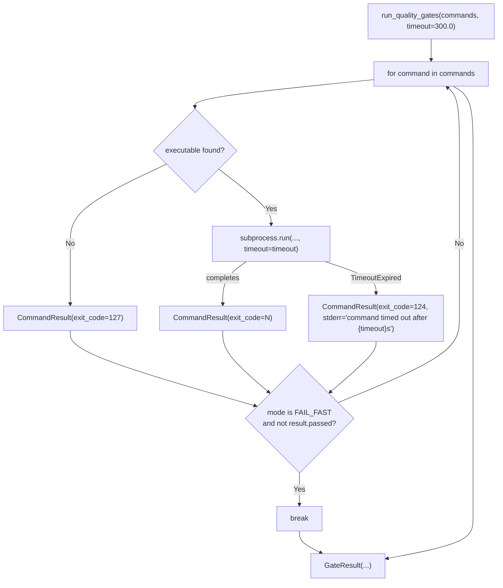

# Architecture Spec: Gates Subprocess Timeout

**Slug**: gates-subprocess-timeout
**Date**: 2026-03-21
**Scope**: Minimal bug fix — 3-5 lines of production code + 1 test class
**Source**: GitHub Issue #951, feature context at `plan/feature-context-gates-subprocess-timeout.md`

---

## 1. Executive Summary

`run_quality_gates()` in `dispatch_schema/gates.py` calls `subprocess.run` with no `timeout`
parameter. A hung gate command blocks the caller indefinitely with no recovery path.

The fix adds a `timeout: float = 300.0` keyword argument to `run_quality_gates()`, passes it
to `subprocess.run`, and catches `subprocess.TimeoutExpired` to produce a `CommandResult` with
`exit_code=124` — following the established `exit_code=127` pattern for `command-not-found`.
No new models, no new modules, no refactoring. The existing `GateRunMode` logic handles
`exit_code=124` results without modification.

---

## 2. Architecture Overview

This is a single-function patch, not a new system. No C4 container diagram is warranted.

**Change surface**:

```text
dispatch_schema/gates.py
└── run_quality_gates()
    ├── signature: add timeout: float = 300.0
    ├── subprocess.run call: add timeout=timeout
    ├── new except subprocess.TimeoutExpired block
    └── docstring: document timeout parameter and exit_code=124 convention

tests/test_dispatch_schema/test_gates.py
└── new class TestSubprocessTimeoutContract
    └── 1 test method verifying exit_code=124 on TimeoutExpired
```

**Data flow** (unchanged except for the new exception path):



---

## 3. Technology Stack

No new dependencies. This fix uses only the Python standard library (`subprocess.TimeoutExpired`
is part of `subprocess`).

**Existing stack in use**:

| Component | Library | Justification |
|-----------|---------|---------------|
| Testing | pytest + pytest-mock | Already in use; `mocker.patch` is the established mock pattern |
| Type hints | Python 3.11+ native | Already in use; `float` is the correct type for timeout seconds |

---

## 4. Component Design

### 4.1 Modified function signature

```python
def run_quality_gates(
    commands: list[str],
    *,
    mode: GateRunMode = GateRunMode.FAIL_FAST,
    cwd: Path | None = None,
    timeout: float = 300.0,
) -> GateResult:
```

`timeout` is keyword-only (after `*`). Adding it after `cwd` preserves backward compatibility —
existing callers that pass `mode` and `cwd` positionally are unaffected because all three are
already keyword-only.

### 4.2 subprocess.run call site

```python
# Current (line 75):
completed = subprocess.run(resolved_tokens, capture_output=True, text=True, cwd=cwd, check=False)

# New:
completed = subprocess.run(resolved_tokens, capture_output=True, text=True, cwd=cwd, check=False, timeout=timeout)
```

### 4.3 Exception handling block

The `TimeoutExpired` handler wraps only the `else` branch (lines 73-78), mirroring the
`executable is None` branch structure immediately above it.

Structure (signatures only — no implementation):

```python
if executable is None:
    result = CommandResult(command=command, exit_code=127, stdout="", stderr=f"command not found: {tokens[0]}")
else:
    try:
        # subprocess.run call with timeout=timeout
        # CommandResult construction from completed
    except subprocess.TimeoutExpired:
        result = CommandResult(
            command=command,
            exit_code=124,
            stdout="",
            stderr=f"command timed out after {timeout}s",
        )
```

`exit_code=124` is the Unix `timeout(1)` convention. It follows the same structural contract
as `exit_code=127`: a `CommandResult` with `passed=False` that flows through mode logic
without special casing.

### 4.4 Docstring additions

The `run_quality_gates()` docstring requires two additions:

- A new `timeout` entry in the `Args:` section describing the per-command timeout in seconds
  and the default of 300.0.
- A new paragraph in the body (after the `exit_code=127` paragraph) documenting that
  `subprocess.TimeoutExpired` is caught, not propagated, and produces `exit_code=124`.
- Preservation of the existing `OSError` propagation note — `TimeoutExpired` is a distinct
  exception type and does not alter that contract.

---

## 5. Data Architecture

No new data models. `CommandResult` already accepts any integer `exit_code` and derives
`passed` from `exit_code == 0`. A `CommandResult` with `exit_code=124` automatically has
`passed=False`.

**Existing model (no changes)**:

```python
class CommandResult:
    command: str
    exit_code: int
    stdout: str
    stderr: str
    passed: bool  # derived: exit_code == 0
```

---

## 6. Security Architecture

No new security surface. The fix does not introduce `shell=True`, does not modify input
handling, and does not change credential or path handling.

Security checklist (existing, verified unaffected):

- [x] No `shell=True` — command passed as list
- [x] Path traversal prevention — `shutil.which` resolves executables; no user-controlled paths
- [x] Command injection prevention — `shlex.split` tokenises; no shell interpolation
- [x] No credentials in subprocess arguments

---

## 7. Testing Architecture

### 7.1 Strategy

One new test class in the existing file
`plugins/development-harness/tests/test_dispatch_schema/test_gates.py`.
No new test files. No new fixtures beyond what the autouse `_clear_resolve_executable_cache`
fixture already provides.

The new class follows the naming and structure of `TestSubprocessInvocationContract`
(lines 568-651) — the most structurally similar existing class.

### 7.2 New test class interface

```python
class TestSubprocessTimeoutContract:
    """run_quality_gates when subprocess.run raises TimeoutExpired."""

    def test_timeout_produces_exit_code_124(self, mocker: MockerFixture) -> None: ...
    def test_timeout_stderr_contains_timeout_duration(self, mocker: MockerFixture) -> None: ...
    def test_timeout_result_has_passed_false(self, mocker: MockerFixture) -> None: ...
    def test_timeout_failfast_stops_after_first_timeout(self, mocker: MockerFixture) -> None: ...
    def test_timeout_runall_continues_after_timeout(self, mocker: MockerFixture) -> None: ...
    def test_custom_timeout_value_forwarded_to_subprocess(self, mocker: MockerFixture) -> None: ...
```

### 7.3 Mock target

```python
mocker.patch(
    "dispatch_schema.gates.subprocess.run",
    side_effect=subprocess.TimeoutExpired(cmd=["pytest"], timeout=300.0),
)
```

This is identical to the mock target used in all existing tests. `shutil.which` must also be
patched to return a non-None value so the code reaches the `subprocess.run` call site.

### 7.4 Acceptance criteria coverage mapping

| AC | Test method |
|----|-------------|
| AC1: subprocess.run includes timeout parameter | `test_custom_timeout_value_forwarded_to_subprocess` |
| AC2: TimeoutExpired → CommandResult(exit_code=124) | `test_timeout_produces_exit_code_124` |
| AC2: stderr message format | `test_timeout_stderr_contains_timeout_duration` |
| AC3: existing 8 tests pass | No change — inherent in not modifying existing code paths |
| AC4: new test verifies timeout | This class |
| AC5: docstring updated | Verified during code review, not via test |

### 7.5 Coverage requirements

- Overall: 80% line + branch (existing `fail_under=80` in pyproject.toml)
- The new `except subprocess.TimeoutExpired` branch must be covered by the new tests
- No mutation testing required (not a payment/auth/security path)

---

## 8. Distribution Architecture

Not applicable. This fix is a modification to an existing package
(`dispatch_schema`) within the `development-harness` plugin. No new scripts,
no new packages, no distribution changes.

---

## 9. Architectural Decisions (ADRs)

### ADR-001: timeout as keyword argument on run_quality_gates()

**Decision**: Add `timeout: float = 300.0` to the `run_quality_gates()` signature rather than
using a module-level constant.

**Rationale**: The feature context (Q1) presents two options. Option A (function parameter)
is chosen because the design decisions in the task spec explicitly state "Expose timeout as
function parameter". It also enables callers with different gate budgets (fast CI vs slow
integration suites) to configure per-call without modifying source. The default of 300.0
preserves existing behavior for all current callers.

**Alternatives rejected**: Module-level constant `_DEFAULT_GATE_TIMEOUT = 300.0` (Option B)
— less flexible, forces source modification for customisation, provides no additional safety.

---

### ADR-002: No explicit kill() after TimeoutExpired

**Decision**: Catch `subprocess.TimeoutExpired`, construct `CommandResult(exit_code=124)`,
and continue. No `process.kill()` / `process.wait()` call.

**Rationale**: The design decisions in the task spec explicitly state "No explicit kill needed
— subprocess.run with timeout already kills child and raises TimeoutExpired". Per Python docs,
`subprocess.run` sends SIGKILL to the child process before raising `TimeoutExpired` when the
timeout elapses — the child is already terminated when the exception is caught. No `Popen`
refactoring is required.

**Alternatives rejected**: Explicit `Popen` + `kill()` + `wait()` — requires refactoring
from `subprocess.run` to `subprocess.Popen`, expanding scope beyond the minimal fix.

---

### ADR-003: exit_code=124 for timeout result

**Decision**: Use `exit_code=124` for timed-out commands.

**Rationale**: 124 is the exit code produced by the Unix `timeout(1)` command when it kills a
process for exceeding its time limit. This is the established convention the task spec
explicitly requires. It follows the structural pattern of `exit_code=127` (command not found)
already in the codebase — a non-subprocess failure converted to a `CommandResult` with a
conventional exit code.

---

## 10. Scalability Strategy

Not applicable for this scope. The timeout parameter itself is the resource bound — it
prevents unbounded blocking per subprocess invocation.

If future work requires concurrent gate execution (multiple commands in parallel rather than
sequential), the async patterns in `architecture-spec-patterns.md` apply: `asyncio.create_subprocess_exec`
with `asyncio.wait_for(proc.communicate(), timeout=timeout)`. That is out of scope for this fix.

---

## Post-Implementation Annotations

Added by context-refinement agent on 2026-03-21

### Design Refinements

1. **Signature placement matches spec exactly**: `timeout: float = 300.0` was added as the third keyword-only parameter after `cwd`, matching §4.1 exactly. All existing callers unaffected.
   - Original: "timeout is keyword-only (after `*`). Adding it after `cwd` preserves backward compatibility"
   - Actual: Confirmed — `(commands: list[str], *, mode: GateRunMode = GateRunMode.FAIL_FAST, cwd: Path | None = None, timeout: float = 300.0)`

2. **6 test methods implemented (spec listed 6, all present)**: §7.2 listed 6 required test methods. Implementation contains all 6. Pre-existing test count was 32 (not 8 total — "8" referred to test classes, not methods), so post-implementation total is 38.
   - Original: §7.2 listed 6 methods; §7.4 AC3 said "existing 8 tests pass" (8 classes)
   - Actual: 32 pre-existing test methods across 8 classes + 6 new methods = 38 total

3. **ADR-002 validated by implementation**: `subprocess.run` kills the child before raising `TimeoutExpired` — confirmed by Python stdlib behaviour. No `Popen` refactoring was needed. The `except subprocess.TimeoutExpired` block receives a dead process and only needs to construct `CommandResult(exit_code=124)`.
