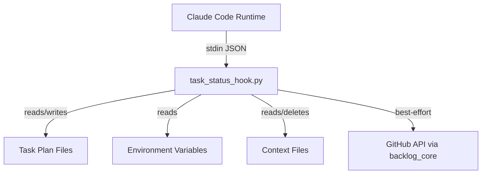
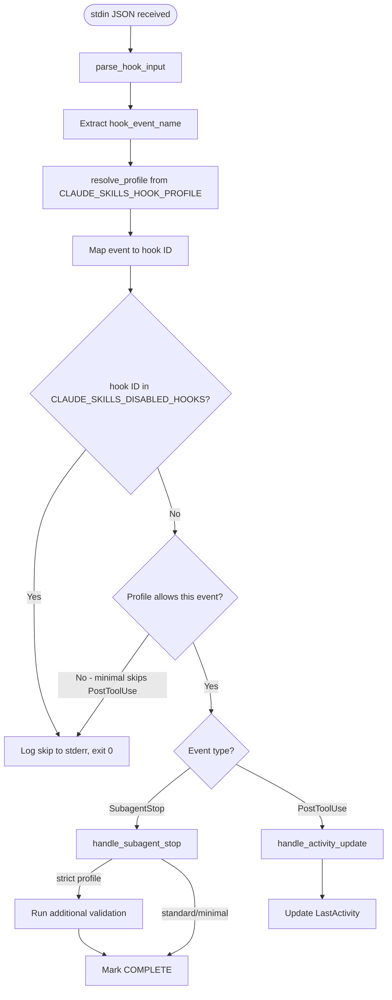
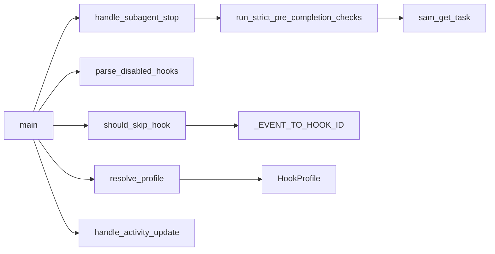

# Architecture Spec: Hook Runtime Profile Controls

**Feature**: Environment-variable-based profile controls for `task_status_hook.py`
**Source**: GitHub Issue #577
**Feature Context**: [./feature-context-hook-profile-controls.md](./feature-context-hook-profile-controls.md)

---

## 1. Executive Summary

Add two environment variables (`CLAUDE_SKILLS_HOOK_PROFILE` and `CLAUDE_SKILLS_DISABLED_HOOKS`) that control `task_status_hook.py` behavior at runtime without requiring SKILL.md edits. The implementation adds a thin profile-resolution layer between stdin parsing and handler dispatch in `main()`. When no environment variables are set, behavior is identical to the current codebase. All changes are confined to `task_status_hook.py` itself -- no new files, no new dependencies, no SKILL.md modifications. The script remains stdlib-only (plus `sam_schema` which is already imported).

## 2. Architecture Overview

### C4 Context

The hook script runs inside the Claude Code hook subprocess. It receives JSON on stdin from the Claude Code runtime and interacts with task files on disk via `sam_schema`.



### Control Flow with Profile Controls



### Key Design Constraint

Profile resolution and disabled-hook checking happen AFTER stdin is consumed (parse_hook_input) but BEFORE any sam_schema operations. This satisfies the constraint that stdin must always be consumed (avoiding pipe errors) while skipping expensive I/O when hooks are disabled.

## 3. Technology Stack

| Component | Choice | Justification |
|-----------|--------|---------------|
| Language | Python 3.11+ | Matches existing script and project minimum |
| Dependencies | stdlib + sam_schema | Hook scripts run in Claude Code subprocess -- no Typer, no Rich, no new deps. sam_schema is already imported. |
| Enum type | `enum.StrEnum` | Python 3.11+ stdlib. Provides string comparison, iteration, membership testing. No import cost beyond stdlib. |
| Env var parsing | `os.environ.get()` | stdlib. No validation library needed for two simple variables. |
| Type hints | Native 3.11+ syntax | `str | None`, `set[str]`, no `Optional` or `Union` imports |
| Testing | pytest + pytest-mock + monkeypatch | Standard project test stack. `monkeypatch.setenv` for env var testing. |

### What is NOT used (and why)

- **Typer/Rich**: Hook scripts run in a subprocess with no TTY. Output goes to stderr only. CLI framework adds latency and zero value.
- **Pydantic**: Two env vars with 3+N valid values do not justify a validation library dependency in a latency-sensitive hook.
- **argparse**: The script takes no command-line arguments. All input is stdin JSON + env vars.

## 4. Component Design

All new code lives in `task_status_hook.py`. No new files are created. The changes add four functions and modify `main()`.

### New Functions

```python
class HookProfile(enum.StrEnum):
    """Runtime profile controlling hook behavior."""
    MINIMAL = "minimal"
    STANDARD = "standard"
    STRICT = "strict"

# --- Constants ---

HOOK_ID_POST_TOOL_USE: str  # "task-status:post-tool-use"
HOOK_ID_SUBAGENT_STOP: str  # "task-status:subagent-stop"
_EVENT_TO_HOOK_ID: dict[str, str]  # Maps event names to hook IDs

# --- Profile Resolution ---

def resolve_profile() -> HookProfile:
    """Read CLAUDE_SKILLS_HOOK_PROFILE from env, return validated profile.

    Returns HookProfile.STANDARD when env var is unset or empty.
    Prints warning to stderr and returns STANDARD for unrecognized values.
    Never raises. Never returns a value outside HookProfile.
    """
    ...

def parse_disabled_hooks() -> set[str]:
    """Read CLAUDE_SKILLS_DISABLED_HOOKS from env, return set of hook IDs.

    Splits on comma, strips whitespace from each ID.
    Returns empty set when env var is unset or empty.
    Does NOT validate hook IDs against known values -- unknown IDs are
    silently ignored (they simply never match). This allows forward
    compatibility when new hook IDs are added.
    """
    ...

def should_skip_hook(event_name: str, profile: HookProfile, disabled_hooks: set[str]) -> bool:
    """Determine whether the current hook invocation should be skipped.

    Decision logic:
    1. Map event_name to hook_id via _EVENT_TO_HOOK_ID
    2. If hook_id is in disabled_hooks: return True
    3. If profile is MINIMAL and event is PostToolUse: return True
    4. Otherwise: return False

    Returns False for unknown event names (let them fall through to
    the existing dispatch logic which already handles unknowns).
    """
    ...

def run_strict_pre_completion_checks(
    task_file_path: Path, task_id: str, hook_input: dict[str, Any]
) -> list[str]:
    """Run additional validation checks for strict profile before marking complete.

    Checks performed:
    1. Task was claimed (status is IN_PROGRESS, not NOT_STARTED)
    2. Task has non-empty acceptance criteria

    Returns list of warning messages (empty list = all checks pass).
    Warnings are printed to stderr but do NOT prevent completion.
    Strict mode adds observability, not gates.
    """
    ...
```

### Modified Function: `main()`

The existing `main()` gains three lines between stdin parsing and event dispatch:

```python
def main() -> None:
    """Main entry point for the hook script."""
    try:
        hook_input = parse_hook_input()
    except (ValueError, json.JSONDecodeError) as e:
        print(f"Failed to parse hook input: {e}", file=sys.stderr)
        sys.exit(2)

    event_name = hook_input.get("hook_event_name", "")

    # --- NEW: Profile and disable checks ---
    profile = resolve_profile()
    disabled_hooks = parse_disabled_hooks()
    if should_skip_hook(event_name, profile, disabled_hooks):
        sys.exit(0)
    # --- END NEW ---

    if event_name == "SubagentStop":
        handle_subagent_stop(hook_input)  # pass profile for strict checks
    elif event_name == "PostToolUse":
        tool_name = hook_input.get("tool_name", "")
        if tool_name in {"Write", "Edit", "Bash"}:
            handle_activity_update(hook_input)
    sys.exit(0)
```

### Modified Function: `handle_subagent_stop()`

When `profile == HookProfile.STRICT`, call `run_strict_pre_completion_checks()` after resolving `task_file_path` and `task_id` but before calling `sam_update_status()`. Warnings are printed to stderr. Completion proceeds regardless -- strict mode is observational, not blocking.

The `profile` parameter is threaded through from `main()`:

```python
def handle_subagent_stop(hook_input: dict[str, Any], profile: HookProfile = HookProfile.STANDARD) -> None:
    ...
```

### Dependency Graph



No existing functions change their signature or behavior except `handle_subagent_stop` (gains optional `profile` parameter with default `STANDARD`) and `main` (gains profile/disable logic before dispatch).

## 5. Data Architecture

### HookProfile Enum

```python
class HookProfile(enum.StrEnum):
    MINIMAL = "minimal"    # Skip PostToolUse, run SubagentStop normally
    STANDARD = "standard"  # Current behavior (default)
    STRICT = "strict"      # Current behavior + pre-completion validation warnings
```

Being a `StrEnum`, values compare directly with strings: `profile == "minimal"` works. Membership testing: `value in HookProfile.__members__` or `value in {e.value for e in HookProfile}`.

### Hook ID Format

```text
{script-name}:{handler-name}
```

Where:
- `script-name` = `task-status` (identifies `task_status_hook.py`)
- `handler-name` = `post-tool-use` or `subagent-stop` (identifies the handler function)

This follows the ECC colon-separated convention adapted to this repo's structure.

### Constants

```python
HOOK_ID_POST_TOOL_USE = "task-status:post-tool-use"
HOOK_ID_SUBAGENT_STOP = "task-status:subagent-stop"

_EVENT_TO_HOOK_ID: dict[str, str] = {
    "PostToolUse": HOOK_ID_POST_TOOL_USE,
    "SubagentStop": HOOK_ID_SUBAGENT_STOP,
}
```

### Environment Variable Contracts

#### `CLAUDE_SKILLS_HOOK_PROFILE`

- **Type**: string
- **Valid values**: `"minimal"`, `"standard"`, `"strict"` (case-sensitive, lowercase)
- **Default when unset/empty**: `"standard"`
- **Invalid value behavior**: Print warning to stderr, use `"standard"`. Warning format: `[hook] Unknown profile '{value}', using 'standard'`
- **Case sensitivity**: Values are case-sensitive. `"Minimal"` is invalid and triggers the warning.

#### `CLAUDE_SKILLS_DISABLED_HOOKS`

- **Type**: comma-separated string
- **Valid hook IDs**: `"task-status:post-tool-use"`, `"task-status:subagent-stop"`
- **Default when unset/empty**: empty set (no hooks disabled)
- **Whitespace handling**: Each ID is stripped (`" task-status:post-tool-use , task-status:subagent-stop "` -> `{"task-status:post-tool-use", "task-status:subagent-stop"}`)
- **Unknown ID behavior**: Silently ignored. Unknown IDs never match any event, so they have no effect. No warning is emitted -- this preserves forward compatibility.
- **Empty segments**: Consecutive commas or trailing commas produce empty strings after split+strip. Empty strings are excluded from the result set.

### Profile Behavior Matrix

```text
                    PostToolUse         SubagentStop        Strict Checks
minimal             SKIP                RUN                 NO
standard            RUN                 RUN                 NO
strict              RUN                 RUN                 YES (warnings only)
```

### Interaction: Profile vs Disabled Hooks

`CLAUDE_SKILLS_DISABLED_HOOKS` takes precedence over profile. If `CLAUDE_SKILLS_HOOK_PROFILE=strict` but `CLAUDE_SKILLS_DISABLED_HOOKS=task-status:subagent-stop`, the SubagentStop handler is skipped entirely (no strict checks run).

Rationale: explicit disable is a stronger signal than profile-level configuration. A user who disables a specific hook ID has made a deliberate choice that should not be overridden by profile semantics.

## 6. Security Architecture

This feature has a minimal security surface:

- **No new file paths are accepted**: The script already reads task file paths from stdin JSON. No new path inputs are introduced.
- **No new subprocess calls**: Profile resolution uses `os.environ.get()` only.
- **No credential handling**: Environment variables are profile names and hook IDs, not secrets.
- **Fail-safe default**: Unrecognized profile values fall back to `standard` (current behavior). The system never silently gains capabilities from bad input.
- **No injection surface**: Hook IDs are compared via set membership, not interpolated into commands or paths.

Security checklist:
- [x] No path traversal vectors (no new path inputs)
- [x] No command injection vectors (no subprocess changes)
- [x] No secret handling (env vars contain non-sensitive configuration)
- [x] Fail-closed on invalid input (defaults to `standard`)

## 7. Testing Architecture

### Test Stack

```text
pytest >= 8.0.0
pytest-mock >= 3.14.0
```

No additional test dependencies. `monkeypatch` (built into pytest) handles all env var manipulation.

### Test File Location

```text
tests/test_task_status_hook_profiles.py
```

A dedicated test file for the profile controls. Existing `task_status_hook` tests (if any) remain separate.

### Test Categories

#### 1. Unit: `resolve_profile()`

- Unset env var returns `STANDARD`
- Empty string returns `STANDARD`
- Each valid value returns the corresponding `HookProfile` member
- Invalid value returns `STANDARD` and prints warning to stderr
- Case-sensitive: `"Minimal"` is invalid

#### 2. Unit: `parse_disabled_hooks()`

- Unset env var returns empty set
- Empty string returns empty set
- Single hook ID returns `{hook_id}`
- Multiple comma-separated IDs returns the full set
- Whitespace is stripped from each ID
- Trailing commas and empty segments are excluded
- Unknown IDs are included in the set (no validation against known IDs)

#### 3. Unit: `should_skip_hook()`

- PostToolUse + minimal profile -> True
- PostToolUse + standard profile -> False
- SubagentStop + minimal profile -> False
- SubagentStop + disabled set containing `task-status:subagent-stop` -> True
- Disabled hooks take precedence over profile
- Unknown event name -> False

#### 4. Unit: `run_strict_pre_completion_checks()`

- Task in IN_PROGRESS status -> no warnings
- Task in NOT_STARTED status -> warning about unclaimed task
- Task with empty acceptance criteria -> warning
- Task with non-empty acceptance criteria -> no warning
- sam_get_task raises KeyError -> returns warning about task not found
- Returns list of strings, never raises

#### 5. Integration: `main()` end-to-end

- Default env (no vars set): identical behavior to current codebase
- `HOOK_PROFILE=minimal` + PostToolUse event: exits 0 without calling `handle_activity_update`
- `HOOK_PROFILE=minimal` + SubagentStop event: calls `handle_subagent_stop` normally
- `HOOK_PROFILE=strict` + SubagentStop event: calls `handle_subagent_stop` with strict checks
- `DISABLED_HOOKS=task-status:subagent-stop` + SubagentStop: exits 0 without calling handler
- `DISABLED_HOOKS=task-status:post-tool-use` + PostToolUse: exits 0 without calling handler
- Both vars set, conflicting: disabled takes precedence

#### 6. Backward compatibility

- No env vars set, SubagentStop event: behavior matches current exactly (same exit code, same file mutations, same stderr output)
- No env vars set, PostToolUse event: behavior matches current exactly

### Coverage Target

- **New code**: 95%+ line and branch coverage (profile logic is critical path)
- **Overall file**: maintain existing coverage level

### Fixture Pattern

```python
@pytest.fixture
def hook_input_subagent_stop() -> dict[str, Any]:
    """Minimal valid stdin JSON for SubagentStop event."""
    ...

@pytest.fixture
def hook_input_post_tool_use() -> dict[str, Any]:
    """Minimal valid stdin JSON for PostToolUse event."""
    ...
```

Use `monkeypatch.setenv("CLAUDE_SKILLS_HOOK_PROFILE", "minimal")` for env var control.
Use `mocker.patch("task_status_hook.handle_subagent_stop")` to verify handler is/isn't called.

## 8. Distribution Architecture

No distribution changes. The script remains a single file at its current path:

```text
plugins/development-harness/skills/implementation-manager/scripts/task_status_hook.py
```

- No PEP 723 metadata (script is invoked by Claude Code hooks, not `uv run`)
- No package changes (no new `__init__.py`, no new modules)
- No `pyproject.toml` changes (no new dependencies)
- The script continues to use the `sys.path` manipulation at the top of the file for `sam_schema` and `backlog_core` imports

## 9. Architectural Decisions (ADRs)

### ADR-001: Strict Mode Warns, Does Not Block

**Context**: The `strict` profile adds pre-completion validation. Should failed checks prevent task completion (exit non-zero) or warn and continue?

**Decision**: Warn only. Print validation failures to stderr, then proceed with completion.

**Rationale**:
1. Hook scripts that exit non-zero kill the hook chain. A validation failure in strict mode would prevent task completion marking, leaving the task in IN_PROGRESS state permanently.
2. The SubagentStop hook fires after the sub-agent has already finished its work. Blocking completion at this point cannot undo the work -- it only loses the status update.
3. Users who enable strict mode want observability ("was this task claimed before completion?"), not enforcement. Enforcement belongs in the orchestrator (`/implement-feature`), not in a post-hoc hook.

**Consequences**: Strict mode violations are visible in stderr but require human attention. No automated remediation.

### ADR-002: Disabled Hooks Take Precedence Over Profile

**Context**: If `HOOK_PROFILE=strict` and `DISABLED_HOOKS=task-status:subagent-stop`, should strict mode force the SubagentStop handler to run, or should the explicit disable win?

**Decision**: Explicit disable wins. A hook ID in `DISABLED_HOOKS` causes immediate exit 0 regardless of profile.

**Rationale**: The disable mechanism is per-hook-ID and explicit. The profile mechanism is coarse-grained and implicit. When a user explicitly disables a specific handler, that is a stronger signal than a profile setting. Overriding explicit disables with profile semantics would make the disable mechanism unreliable.

### ADR-003: No Validation of Hook IDs in DISABLED_HOOKS

**Context**: Should `parse_disabled_hooks()` warn when it encounters an unknown hook ID?

**Decision**: No. Unknown IDs are silently ignored.

**Rationale**: Forward compatibility. When new hook scripts or handlers are added, users may set `DISABLED_HOOKS` values that the current version does not recognize. Warning on unknown IDs would generate noise during version transitions. Since unknown IDs simply never match any event, they have no effect and no risk.

### ADR-004: Case-Sensitive Profile Values

**Context**: Should `CLAUDE_SKILLS_HOOK_PROFILE=MINIMAL` be treated as valid?

**Decision**: No. Values are case-sensitive, lowercase only. `MINIMAL` triggers the unknown-value warning and falls back to `standard`.

**Rationale**: The ECC pattern reference uses lowercase values. `StrEnum` members have lowercase values. Case-insensitive matching adds complexity for zero benefit -- environment variables are set by developers who can type lowercase. Consistent casing reduces ambiguity.

### ADR-005: Single File, No New Modules

**Context**: Should profile logic live in a separate module (e.g., `hook_profiles.py`) imported by `task_status_hook.py`?

**Decision**: No. All new code goes directly into `task_status_hook.py`.

**Rationale**:
1. The additions are ~60-80 lines (one enum, four functions, three lines in main). This does not justify a separate module.
2. Hook scripts use `sys.path` manipulation for imports. Adding another module would require either placing it on `sys.path` or using relative imports, both adding fragility.
3. The script is already self-contained. Keeping profile logic inline preserves the single-file deployment property that makes hook scripts easy to reason about.

## 10. Scalability Strategy

### Performance Budget

The PostToolUse hook fires on every Write/Edit/Bash call (30-50 times per task). Profile resolution must add negligible overhead:

- `os.environ.get()`: ~1 microsecond
- `str.split(",")` + set construction: ~1 microsecond
- `set.__contains__()`: ~0.1 microsecond
- Total added latency per invocation: <5 microseconds

Compare to the current per-invocation cost (stdin parse + context file read + sam_get_task + sam_update_plan_fields): ~50-200 milliseconds. The profile check is 4-5 orders of magnitude cheaper than the operations it gates.

### Early Exit Savings

When `HOOK_PROFILE=minimal`:
- PostToolUse invocations skip: stdin JSON parse (already done), context file read, sam_get_task, sam_update_plan_fields
- Estimated savings per invocation: ~50-200ms
- Estimated savings per task (40 tool calls): ~2-8 seconds of cumulative I/O

### Resource Management

- No new file handles opened
- No new network connections
- No new threads or async operations
- `os.environ.get()` does not cache -- each invocation reads the current env. This is correct because env vars can be changed between hook invocations within a session.

---

## Acceptance Criteria Mapping

| AC | Component | Verification |
|----|-----------|-------------|
| `HOOK_PROFILE=minimal` skips PostToolUse | `should_skip_hook()` + `main()` | Integration test: mock handler, verify not called |
| `HOOK_PROFILE=standard` matches current behavior | `resolve_profile()` default + no changes to handlers | Backward compat test: compare behavior with/without env var |
| `HOOK_PROFILE=strict` adds validation warnings | `run_strict_pre_completion_checks()` + `handle_subagent_stop()` | Unit test: verify warnings emitted for unclaimed task |
| `DISABLED_HOOKS` disables specific handlers | `parse_disabled_hooks()` + `should_skip_hook()` | Integration test: mock handler, verify not called |
| No env vars = identical to current behavior | All functions default to standard/empty | Backward compat test suite |
| Disabled hooks exit 0 | `main()` calls `sys.exit(0)` on skip | Integration test: verify exit code |
| stdin consumed even on skip | Skip check runs after `parse_hook_input()` | Integration test: provide stdin, verify no pipe error |
| No SKILL.md changes | N/A | Verify no modifications to SKILL.md files in diff |

## Open Questions from Feature Context

### Q1: Strict profile scope

**Resolution for architect spec**: Start with two checks -- (1) task was claimed (status IN_PROGRESS, not NOT_STARTED), (2) task has acceptance criteria fields. These are cheap to implement, use existing sam_schema queries, and cover the most common process violations. Additional checks can be added later by extending `run_strict_pre_completion_checks()` without interface changes.

### Q2: Logging on skip

**Resolution for architect spec**: Print a single-line stderr message when a hook is skipped. Format: `[hook] Skipped: {handler_name} (profile={profile})` or `[hook] Skipped: {handler_name} (disabled)`. This provides observability without affecting hook success/failure (stderr does not change exit code).

### Q3: Hook ID namespace

**Resolution for architect spec**: Document the `{script-name}:{handler-name}` convention in a code comment above the constants. Do not create a separate reference file. The convention is simple enough to be self-documenting. If a second hook script is added in the future, that is the appropriate time to formalize the namespace in a shared document.
