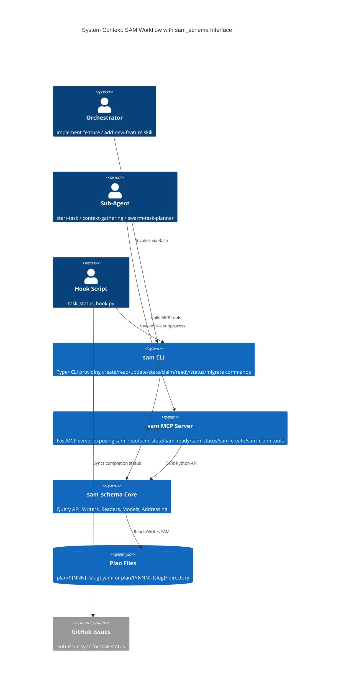
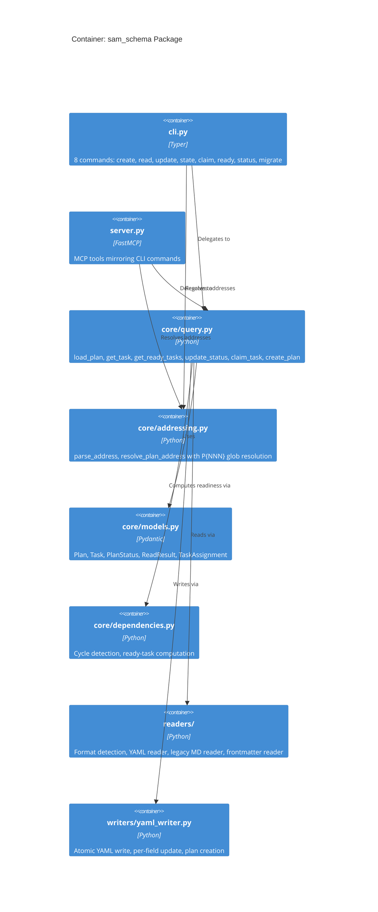

# Architecture: Integrate sam_schema as Sole Task File Interface

**Issue**: #719 | **Priority**: P0 | **Date**: 2026-03-15

---

## 1. Executive Summary

Seven SAM workflow components access task files through direct file operations with 4 independent parsers, producing format drift and silent data loss. The `sam_schema` package (`packages/sam_schema/`) already provides a unified data layer with CLI, MCP, query API, and writer API -- but no component enforces its use.

This architecture routes all task file I/O through the `sam` CLI and MCP interface by:

1. **Extending the sam CLI** with 3 new commands (`create`, `update`, `claim`) and enhancing `read` to include plan-level context alongside task details
2. **Updating the addressing module** to resolve the new `P{NNN}-{slug}` naming convention
3. **Migrating 7 consumer components** from direct file operations to sam CLI/MCP calls
4. **Removing `task_format.py`** and all fallback parsers once consumers are migrated
5. **Renaming 64 existing plan files** from `tasks-{N}-{slug}` to `P{NNN}-{slug}.yaml`
6. **Rewriting TASK_FILE_FORMAT.md** as the canonical entry point documenting sam CLI usage

The result: a single interface contract between workflow components and task data, enabling future backing-store migration (GitHub sub-issues, SQLite) without changing any consumer. Format detection, validation, and atomic writes are handled centrally by sam_schema.

## 2. Architecture Overview

### C4 Context Diagram



### C4 Container Diagram



### Data Flow: Before and After

**Before** (current state -- 4 parsers, direct file I/O):

```text
orchestrator ---> implementation_manager.py ---> sam_schema (partial)
                                            \--> task_format.py (fallback)
hook ---------> task_status_hook.py ---------> sam_schema (.yaml only)
                                            \--> task_format.py (.md fallback)
agent --------> Read/Edit tools ------------> filesystem (direct)
planner ------> Write tool -----------------> filesystem (direct, embedded schema)
```

**After** (single interface):

```text
orchestrator ---> sam CLI -------> sam_schema core -------> filesystem
hook ----------> sam CLI -------> sam_schema core -------> filesystem
agent ---------> sam MCP -------> sam_schema core -------> filesystem
planner -------> sam CLI -------> sam_schema core -------> filesystem
                                       |
                                       v
                              (future: GitHub / SQLite)
```

## 3. Technology Stack

This feature extends the existing `sam_schema` package. No new packages or frameworks are introduced.

| Component | Technology | Justification |
|-----------|-----------|---------------|
| CLI Framework | Typer 0.21.2+ (existing) | Already used by sam CLI; `Annotated` syntax for all new commands |
| Data Models | Pydantic v2 (existing) | `Plan`, `Task`, `TaskAssignment` models with validation |
| YAML I/O | ruamel.yaml (existing) | Round-trip YAML with comment preservation for `update` command |
| MCP Server | FastMCP (existing) | MCP tool exposure for new commands |
| Addressing | Custom module (existing) | Extended for P{NNN} glob resolution |
| Atomic Writes | `tempfile` + `os.replace` (existing) | Prevents partial writes on crash |
| Testing | pytest 8+, pytest-cov, pytest-mock | 421 existing tests; new commands add ~60 tests |
| Type Checking | basedpyright (project standard) | Strict mode for all new code |
| Migration Script | PEP 723 standalone script | One-time rename tool; no package dependency |

**Not used / explicitly excluded**:

- `task_format.py` -- removed after migration; replaced by sam_schema readers
- `implementation_manager.py` local parsers -- removed; sam_schema query API replaces
- Direct `Read`/`Edit`/`Write` on task files by agents -- prohibited by updated agent prompts

## 4. Component Design

### 4.1 New CLI Commands (packages/sam_schema/sam_schema/cli.py)

#### `sam create`

**Purpose**: Create a new plan file with plan metadata and task definitions.

**Interface**:

```python
@app.command()
def create(
    slug: Annotated[str, typer.Argument(help="Feature slug for the plan")],
    goal: Annotated[str, typer.Option(help="Plan goal statement")],
    plan_dir: Annotated[Path, typer.Option(help="Plan directory")] = Path("plan"),
    context: Annotated[str | None, typer.Option(help="Plan context")] = None,
    issue: Annotated[int | None, typer.Option(help="GitHub issue number")] = None,
    stdin: Annotated[bool, typer.Option("--stdin", help="Read task definitions from stdin as YAML")] = False,
    format: Annotated[OutputFormat, typer.Option(help="Output format")] = OutputFormat.YAML,
) -> None: ...
```

**Behavior**:
- Scans `plan/P*` to find highest NNN, assigns `P{NNN+1}`
- If `--stdin`: reads YAML document from stdin containing `tasks:` array
- Validates all tasks against `Task` Pydantic model
- Writes `plan/P{NNN}-{slug}.yaml` (single file) or `plan/P{NNN}-{slug}/` (directory if task count exceeds threshold)
- Returns JSON with `{"path": "plan/P001-feature-name.yaml", "plan_number": 1, "task_count": 5}`

**Agent usage**: `swarm-task-planner` pipes YAML task definitions to stdin:

```bash
echo "$YAML_CONTENT" | uv run sam create my-feature --goal "Implement X" --stdin
```

#### `sam update`

**Purpose**: Update plan-level or task-level fields.

**Interface**:

```python
@app.command()
def update(
    address: Annotated[str, typer.Argument(help="Plan address (P1) or task address (P1/T3)")],
    plan_dir: Annotated[Path, typer.Option(help="Plan directory")] = Path("plan"),
    set_field: Annotated[list[str] | None, typer.Option("--set", help="field=value pairs")] = None,
    context: Annotated[str | None, typer.Option(help="Set plan context (shorthand for --set context=...)")] = None,
    append_section: Annotated[str | None, typer.Option(help="Append named section to task body")] = None,
    section_content: Annotated[str | None, typer.Option(help="Content for --append-section")] = None,
    format: Annotated[OutputFormat, typer.Option(help="Output format")] = OutputFormat.JSON,
) -> None: ...
```

**Behavior**:
- `sam update P1 --context "..."` -- updates plan-level context field
- `sam update P1 --set goal="New goal"` -- updates arbitrary plan field
- `sam update P1/T3 --set priority=1` -- updates task field
- `sam update P1/T3 --append-section "Divergence Notes" --section-content "..."` -- appends markdown section to task body
- Returns JSON with `{"updated": true, "fields": ["context"], "path": "plan/P001-feature.yaml"}`

**Agent usage**: `context-gathering` sets plan context:

```bash
uv run sam update P1 --context "Context manifest content here"
```

#### `sam claim`

**Purpose**: Claim a task for execution (prevents duplicate dispatch).

**Interface**:

```python
@app.command()
def claim(
    address: Annotated[str, typer.Argument(help="Task address (P1/T3)")],
    plan_dir: Annotated[Path, typer.Option(help="Plan directory")] = Path("plan"),
    format: Annotated[OutputFormat, typer.Option(help="Output format")] = OutputFormat.JSON,
) -> None: ...
```

**Behavior**:
- Calls existing `claim_task()` from `query.py:177`
- Sets status to `in-progress`, adds `started` timestamp
- Exits non-zero if task already claimed or not found
- Returns JSON `{"claimed": true, "task_id": "T3", "started": "2026-03-15T..."}`

### 4.2 Enhanced `sam read` (packages/sam_schema/sam_schema/cli.py)

**Current behavior**: Returns task fields only when given `P{N}/T{M}` address.

**New behavior**: When reading a task, include plan-level fields in the response.

**New output schema** (`TaskAssignment` model):

```python
class TaskAssignment(BaseModel):
    """Complete context an agent needs to execute a task."""
    # Plan-level fields
    plan_number: int
    plan_slug: str
    plan_goal: str
    plan_context: str | None
    plan_acceptance_criteria: list[str] | None

    # Task-level fields
    task: Task  # existing Task model with all fields
```

**CLI change**: `sam read P1/T3` returns `TaskAssignment` JSON by default. `sam read P1` (no task) returns `Plan` JSON (existing behavior, unchanged).

**MCP change**: `sam_read` MCP tool returns `TaskAssignment` when task address is provided.

### 4.3 Addressing Module Update (packages/sam_schema/sam_schema/core/addressing.py)

**Current**: `resolve_plan_address()` resolves `tasks-{N}-{slug}` filenames by alphabetical index.

**New**: `resolve_plan_address()` globs for `P{NNN}-*` patterns.

**Resolution logic**:

```python
def resolve_plan_address(address_part: str, plan_dir: Path) -> Path:
    """
    Resolve plan address to filesystem path.

    Address formats:
    - "P1" or "P001" -> glob plan/P001-*.yaml or plan/P001-*/
    - "my-slug"      -> glob plan/P*-my-slug.yaml or plan/P*-my-slug/
    - "P1" with collision -> error listing matches, suggest slug disambiguation
    """
    ...
```

**Backward compatibility**: If no `P{NNN}-*` match found, fall back to `tasks-{N}-{slug}` pattern for unmigrated files. This fallback is removed after all files are renamed.

### 4.4 Core Query API Extensions (packages/sam_schema/sam_schema/core/query.py)

**New function** -- `create_plan()`:

```python
def create_plan(
    slug: str,
    goal: str,
    tasks: list[dict[str, Any]],
    plan_dir: Path = Path("plan"),
    context: str | None = None,
    issue: int | None = None,
) -> tuple[Path, Plan]: ...
```

**New function** -- `get_task_assignment()`:

```python
def get_task_assignment(plan: Plan, task_id: str) -> TaskAssignment: ...
```

**Enhanced function** -- `claim_task()` (already exists at query.py:177, expose via CLI):

```python
def claim_task(plan: Plan, task_id: str) -> bool: ...
```

**New function** -- `update_plan_fields()`:

```python
def update_plan_fields(plan: Plan, fields: dict[str, Any]) -> bool: ...
```

### 4.5 Writer Extensions (packages/sam_schema/sam_schema/writers/yaml_writer.py)

**New function** -- `append_section()`:

```python
def append_section(path: Path, task_id: str, section_name: str, content: str) -> bool:
    """Append a named markdown section to a task's body content."""
    ...
```

**New function** -- `create_plan_file()`:

```python
def create_plan_file(
    path: Path,
    plan_metadata: dict[str, Any],
    tasks: list[dict[str, Any]],
) -> None:
    """Write a new plan file with atomic write."""
    ...
```

### 4.6 MCP Server Extensions (packages/sam_schema/sam_schema/server.py)

New MCP tools mirroring CLI commands:

```python
@mcp.tool()
async def sam_create(slug: str, goal: str, tasks_yaml: str, ...) -> str: ...

@mcp.tool()
async def sam_update(address: str, fields: dict[str, Any] | None = None, ...) -> str: ...

@mcp.tool()
async def sam_claim(address: str) -> str: ...
```

Existing `sam_read` tool updated to return `TaskAssignment` when task address is provided.

## 5. Data Architecture

### 5.1 Plan File Naming Convention

**Convention**: `P{NNN}-{slug}` with zero-padded sequential numbering (user decision 2026-03-15).

**Single file** (plan under 500 lines):

```text
plan/P001-backlog-state-reconciliation.yaml
```

**Split directory** (plan at or above 500 lines):

```text
plan/P001-backlog-state-reconciliation/
+-- P001-PLAN.yaml        # plan-level metadata, goal, context, task list
+-- P001-ARCHITECT.md      # architecture spec
+-- P001-CONTEXT.md        # feature context
+-- tasks/
    +-- T01.yaml
    +-- T02.yaml
    +-- T03.yaml
```

**Numbering**: Sequential, local. `sam create` scans `plan/P*`, extracts highest NNN, writes `P{NNN+1}`.

**Collision handling**: Allowed. The slug makes each plan unique. The number is for sort order, not identity. `P004-backlog-state-reconciliation` and `P004-sam-schema-followup` are unambiguous.

**Task numbering**: `T{NN}` zero-padded, local to the plan. `T01` in `P001` is independent of `T01` in `P002`.

### 5.2 Addressing Scheme

**Address format**: `P{N}/T{M}` where N matches P{NNN} by numeric value and M matches T{NN}.

```text
sam read P1/T3     -> globs plan/P001-*/ -> finds T03.yaml
sam read P719/T1   -> globs plan/P719-*/ -> finds T01 in matching plan
sam read my-slug/T3 -> globs plan/P*-my-slug* -> finds T03
```

**Disambiguation**: If `P{N}` matches multiple plans (collision), error with list of matches. User provides slug to disambiguate.

### 5.3 Plan YAML Schema (from Pydantic models)

**Plan-level fields** (in `Plan` model, `core/models.py`):

```yaml
# plan/P001-my-feature.yaml
plan_number: 1
slug: my-feature
goal: "Implement the feature"
context: "Background context for all tasks"
acceptance_criteria:
  - "Criterion 1"
  - "Criterion 2"
issue: 719                    # GitHub issue number (optional)
feature: "My Feature Name"
description: "Detailed description"
status: in-progress           # not-started | in-progress | complete
created: "2026-03-15T00:00:00Z"
tasks:
  - task: T01
    title: "First task"
    status: not-started
    agent: python-cli-architect
    dependencies: []
    priority: 1
    complexity: medium
    skills: ["python3-development"]
    body: |
      ## Objective
      ...
      ## Acceptance Criteria
      ...
```

**Task-level fields** (in `Task` model):

| Field | Type | Required | Description |
|-------|------|----------|-------------|
| `task` | `str` | Yes | Task ID (T01, T02, ...) |
| `title` | `str` | Yes | Human-readable task title |
| `status` | `str` | Yes | not-started, in-progress, complete, blocked, deferred, skipped |
| `agent` | `str` | Yes | Agent name for execution |
| `dependencies` | `list[str]` | Yes | Task IDs this depends on |
| `priority` | `int` | Yes | 1-5 (1=critical) |
| `complexity` | `str` | Yes | low, medium, high |
| `skills` | `list[str]` | No | Skills for the sub-agent to load |
| `accuracy-risk` | `str` | No | low, medium, high |
| `started` | `str` | No | ISO 8601 timestamp (set by claim) |
| `completed` | `str` | No | ISO 8601 timestamp (set by hook) |
| `last-activity` | `str` | No | ISO 8601 timestamp (set by hook) |
| `github_issue` | `int` | No | Linked GitHub sub-issue number |
| `body` | `str` | No | Markdown body with Objective, Requirements, Acceptance Criteria, Verification Steps |

### 5.4 TaskAssignment Output Schema

The `sam read P1/T3` response provides everything an agent needs:

```json
{
  "plan_number": 1,
  "plan_slug": "my-feature",
  "plan_goal": "Implement the feature",
  "plan_context": "Background context for all tasks",
  "plan_acceptance_criteria": ["Criterion 1", "Criterion 2"],
  "task": {
    "task": "T03",
    "title": "Third task",
    "status": "not-started",
    "agent": "python-cli-architect",
    "dependencies": ["T01", "T02"],
    "priority": 2,
    "complexity": "medium",
    "skills": ["python3-development"],
    "body": "## Objective\n..."
  }
}
```

### 5.5 JSON Schema Export

The `sam` CLI provides a `schema` command for documentation:

```bash
uv run sam schema --model Plan > plan-schema.json
uv run sam schema --model Task > task-schema.json
uv run sam schema --model TaskAssignment > assignment-schema.json
```

These JSON Schema files are referenced by TASK_FILE_FORMAT.md instead of embedding schema definitions inline.

## 6. Security Architecture

No new credential management or secret handling is introduced by this feature. Security considerations are limited to:

- **Path traversal prevention**: `resolve_plan_address()` validates that resolved paths are within the `plan/` directory. Reject addresses containing `..` or absolute paths.
- **Atomic writes**: All write operations use `tempfile.NamedTemporaryFile` + `os.replace()` to prevent partial writes from corrupting task files.
- **No `shell=True`**: All subprocess invocations of `sam` CLI use list arguments.
- **Input validation**: All task data passes through Pydantic model validation before write. Invalid field values, missing required fields, and type mismatches produce validation errors with actionable messages.
- **Concurrent write safety**: `claim_task()` uses atomic read-modify-write to prevent duplicate dispatch. The `started` timestamp serves as a claim lock -- if present, task is already claimed.

**Security checklist**:

- [x] Path traversal prevention (addressing module validates paths)
- [x] No command injection (no shell=True, no string interpolation in commands)
- [x] Secure temp file handling (atomic writes via tempfile)
- [x] Input validation (Pydantic models with strict typing)
- [ ] N/A: No API calls, no HTTPS, no rate limiting needed

## 7. Testing Architecture

### Testing Stack

```text
pytest>=8.0.0              # test execution
pytest-cov>=6.0.0          # coverage (80% minimum, 95%+ critical code)
pytest-mock>=3.14.0        # mocking (never unittest.mock directly)
typer.testing.CliRunner    # CLI integration testing
hypothesis>=6.100.0        # property-based testing for addressing/parsing
```

### Coverage Requirements

- **Overall**: 80% line and branch coverage (existing: 93%)
- **New CLI commands** (`create`, `update`, `claim`): 95%+ coverage -- these are critical path
- **Addressing module changes**: 95%+ coverage -- incorrect resolution produces silent wrong-file access
- **Migration script**: 80% coverage -- one-time tool

### Test Categories

**1. CLI Integration Tests** (`@pytest.mark.cli`):

- `test_sam_create_*` -- create plan from stdin YAML, verify file written, verify round-trip with `sam read`
- `test_sam_update_*` -- update plan fields, update task fields, append sections, verify persistence
- `test_sam_claim_*` -- claim unclaimed task (success), claim already-claimed task (exit 1), claim nonexistent task (exit 1)
- `test_sam_read_assignment` -- read task returns `TaskAssignment` with plan-level fields included
- All tested with `CliRunner(mix_stderr=False)` and `env={"NO_COLOR": "1"}`

**2. Addressing Tests** (`@pytest.mark.unit`):

- `test_resolve_p_number` -- P1 matches P001-*, P719 matches P719-*
- `test_resolve_slug` -- slug matches P*-{slug}*
- `test_resolve_collision` -- multiple P{N} matches produce error with disambiguation list
- `test_resolve_backward_compat` -- tasks-{N}-{slug} fallback works for unmigrated files
- Property-based: `@given(st.integers(min_value=1, max_value=9999))` for plan number resolution

**3. Writer Tests** (`@pytest.mark.unit`):

- `test_create_plan_file` -- writes valid YAML, readable by `load_plan()`
- `test_append_section` -- appends to task body, preserves existing content
- `test_atomic_write_on_error` -- original file preserved if write fails mid-operation

**4. Migration Script Tests** (`@pytest.mark.integration`):

- `test_rename_single_file` -- tasks-5-my-feature.md renamed to P{NNN}-my-feature.yaml
- `test_rename_directory` -- tasks-my-feature/ renamed to P{NNN}-my-feature/
- `test_backlog_plan_field_update` -- backlog items pointing to old path are updated
- `test_dry_run` -- no files modified, report generated

**5. Consumer Migration Tests** (updates to existing test suites):

- `test_task_status_hook/` -- remove extension-branch tests, add format-agnostic tests via sam CLI
- `test_implementation_manager/` -- remove fallback-parser tests, verify sam_schema-only paths
- `test_task_parsing.py` -- rewrite to test sam_schema interface, not task_format.py

### pytest Configuration

```toml
[tool.pytest.ini_options]
addopts = [
    "--cov=packages/sam_schema",
    "--cov-report=term-missing",
    "-v",
]
testpaths = ["packages/sam_schema/tests", "tests"]
pythonpath = [".", "packages/"]
markers = [
    "slow: marks tests as slow",
    "integration: marks tests as integration tests",
    "cli: marks tests as CLI integration tests",
    "critical: marks tests requiring mutation testing",
]

[tool.coverage.run]
branch = true

[tool.coverage.report]
show_missing = true
fail_under = 80
```

## 8. Distribution Architecture

**Strategy 2 -- Python Package** (existing `packages/sam_schema/`).

The `sam_schema` package is already a multi-file package with Hatchling build system. No distribution change is needed.

```toml
[build-system]
requires = ["hatchling"]
build-backend = "hatchling.build"

[tool.hatchling.build.targets.wheel]
packages = ["packages/sam_schema"]
```

**New CLI entry points**: The 3 new commands (`create`, `update`, `claim`) are added to the existing `cli.py` Typer app. No new entry points in `pyproject.toml` are needed -- the existing `sam` command picks them up automatically.

**Migration script**: PEP 723 standalone script (`scripts/rename_plan_files.py`). One-time use, no package dependency. Shebang: `#!/usr/bin/env -S uv --quiet run --active --script`.

```python
# /// script
# requires-python = ">=3.11"
# dependencies = ["ruamel.yaml", "typer", "rich"]
# ///
```

## 9. Architectural Decisions (ADRs)

### ADR-001: sam CLI as sole interface (not Python API imports)

**Decision**: Components invoke `sam` CLI commands (via Bash tool or subprocess) rather than importing `sam_schema` Python API directly.

**Context**: Hook scripts and `implementation_manager.py` currently import `sam_schema` Python API directly. Agent prompts instruct direct file operations. Two integration paths are possible: (a) all callers import Python API, (b) all callers use CLI/MCP interface.

**Rationale**: CLI/MCP provides a stable contract independent of Python API internals. Agent prompts cannot import Python; they must use CLI or MCP. Hook scripts calling CLI match the same interface agents use, reducing the number of integration patterns from 3 (Python API, CLI, MCP) to 2 (CLI, MCP). The CLI also provides format-agnostic addressing (`P1/T3`) that the Python API requires manual path resolution for.

**Exception**: `task_status_hook.py` may continue to use Python API directly for performance (hook scripts run on every tool call). If so, it imports from `sam_schema.core.query` only -- not from `task_format.py` or local parsers.

**Consequences**: CLI output is the contract. Changes to CLI output format are breaking changes. JSON output must be stable and versioned.

### ADR-002: P{NNN}-{slug} naming over tasks-{N}-{slug}

**Decision**: Plan files are named `P{NNN}-{slug}.yaml` with zero-padded sequential numbering.

**Context**: Current convention is `tasks-{N}-{slug}.md` where N is the task count. User decided P{NNN}-{slug} naming on 2026-03-15.

**Rationale**: P{NNN} sorts lexicographically. The prefix `P` distinguishes plan files from other artifacts in `plan/`. Zero-padding ensures `P001` sorts before `P010`. The slug provides human-readable identification. Collisions on NNN are allowed because the slug disambiguates.

**Consequences**: Addressing module must support both patterns during migration. 64 existing files need renaming. All backlog `plan:` field references need updating.

### ADR-003: TaskAssignment composite response over separate calls

**Decision**: `sam read P1/T3` returns both plan-level context and task details in a single `TaskAssignment` response.

**Context**: Agents need plan goal, shared context, and task-specific fields. Two designs possible: (a) single call returns everything, (b) two calls (`sam status P1` for plan + `sam read P1/T3` for task).

**Rationale**: Agents operate in constrained environments (limited turns, context window). A single call reduces interaction count. The `TaskAssignment` model is a read-only composite -- it does not create a new entity, just aggregates existing Plan and Task data. The backlog item explicitly requires "plan goal, shared context, and its task details" in one call.

**Consequences**: `TaskAssignment` model must be kept in sync with `Plan` and `Task` models. Any new plan-level field that agents need requires updating `TaskAssignment`.

### ADR-004: Stdin YAML for sam create over CLI arguments

**Decision**: `sam create` accepts task definitions via stdin as a YAML document, not as individual CLI arguments.

**Context**: The `swarm-task-planner` agent generates 5-20 tasks with complex fields (dependencies, body content, acceptance criteria). Three input approaches: (a) CLI arguments per task, (b) file path argument, (c) stdin YAML.

**Rationale**: CLI arguments cannot express nested structures (task body, acceptance criteria lists). File path approach requires the agent to Write a temporary file then pass the path -- adding a step. Stdin YAML allows the agent to pipe generated YAML directly. The `swarm-task-planner` already produces YAML -- it writes YAML content via Write tool today. Piping to `sam create` replaces Write with stdin, adding schema validation.

**Consequences**: Agent prompts must instruct `echo "$YAML" | sam create ...` pattern. The CLI must handle stdin parsing robustly (including empty stdin error).

### ADR-005: Backward-compatible addressing during migration

**Decision**: The addressing module supports both `P{NNN}-{slug}` and `tasks-{N}-{slug}` patterns during migration. The `tasks-{N}-{slug}` fallback is removed after all files are renamed.

**Context**: 64 existing files use `tasks-{N}-{slug}` naming. Renaming all files atomically is not possible -- migration happens over time.

**Rationale**: Dual-pattern support prevents breaking existing workflows during migration. The fallback is explicitly temporary -- a migration task removes it after all files are renamed. This avoids a flag day where all 64 files must be renamed in a single commit.

**Consequences**: Addressing module has a deprecation path. After migration, a test verifies no `tasks-*` files remain in `plan/`, and the fallback code is removed.

## 10. Scalability Strategy

**Concurrency**: Task claiming uses atomic read-modify-write via `os.replace()`. Two agents claiming the same task simultaneously: first write wins, second `claim` call sees `started` timestamp and exits non-zero.

**Resource management**: All file operations use context managers. No file handles are held open across CLI command boundaries. Each CLI invocation is stateless -- reads file, operates, writes file, exits.

**Future backing stores**: The `sam_schema.core.query` API is the abstraction boundary. Current implementation reads/writes YAML files. Future implementations can read/write GitHub Issues or SQLite by swapping the reader/writer layer without changing the query API or CLI interface.

**Plan file size**: Plans with 50+ tasks use split directory format automatically. `sam create` checks task count against the 500-line threshold and writes directory format when exceeded.

**Lazy loading**: `sam read P1/T3` loads only the target task file in directory format, not the entire plan. In single-file format, the entire file is loaded (YAML parsing is the bottleneck, not file I/O).

## 11. Component Migration Map

For each of the 7 SAM workflow components, this section specifies what changes, what sam commands replace current operations, and what code/prompt modifications are needed.

### 11.1 swarm-task-planner (P1, P2)

**Files**: `plugins/python3-development/agents/swarm-task-planner.md`, `plugins/development-harness/agents/swarm-task-planner.md`

**Current**: Writes task files via Write tool with YAML schema embedded in agent prompt (lines 258-320).

**After**: Agent generates YAML task content and pipes to `sam create`.

**Changes to agent prompt**:
- Remove inline YAML schema definition (lines 258-320)
- Replace with instruction: "Generate task definitions as YAML and create the plan using: `echo "$YAML_CONTENT" | uv run sam create {slug} --goal "{goal}" --stdin`"
- Reference `TASK_FILE_FORMAT.md` for field definitions instead of embedding schema
- The `sam create` command validates all fields -- agent does not need to know the full schema

**sam commands replacing current operations**:

| Current Operation | Replacement |
|-------------------|-------------|
| `Write(plan/tasks-{N}-{slug}.md, content)` | `echo "$YAML" \| uv run sam create {slug} --goal "..." --stdin` |

**Code changes**: None (agent prompt only).

### 11.2 start-task (A1)

**File**: `plugins/python3-development/skills/start-task/SKILL.md`

**Current**: Reads full task file via Read tool, scans for task section, claims via `implementation_manager.py claim-task`.

**After**: Claims via `sam claim`, reads assignment via `sam read`.

**Changes to SKILL.md**:
- Remove instruction to use `Read` tool on task file
- Replace `uv run implementation_manager.py claim-task {file} {task_id}` with `uv run sam claim P{N}/T{M}`
- Replace task reading with `uv run sam read P{N}/T{M} --format json`
- Agent receives `TaskAssignment` JSON with plan goal + context + task details

**sam commands replacing current operations**:

| Current Operation | Replacement |
|-------------------|-------------|
| `Read(task_file_path)` | `uv run sam read P{N}/T{M} --format json` |
| `uv run implementation_manager.py claim-task {file} {id}` | `uv run sam claim P{N}/T{M}` |
| `Edit(task_file_path, status change)` | `uv run sam state P{N}/T{M} in-progress` |

**Code changes**: None (skill prompt only).

### 11.3 task_status_hook (C2)

**File**: `plugins/python3-development/skills/implementation-manager/scripts/task_status_hook.py`

**Current**: Split parser -- uses sam_schema for `.yaml` files, `task_format.py` for `.md` files. Branch at lines 548-557 and 615-624.

**After**: Single code path using `sam state` CLI or `sam_schema.core.query.update_status()` Python API for all formats.

**Changes to script**:
- Remove `from task_format import ...` imports
- Remove `.suffix == ".yaml"` branch in `handle_subagent_stop()` and `handle_activity_update()`
- Replace both branches with single call: `sam_update_status(plan, task_id, new_status)`
- The sam_schema reader handles format detection internally -- hook does not need to know file format
- Keep Python API import (not CLI) for performance -- hooks fire on every tool call

**sam commands replacing current operations**:

| Current Operation | Replacement |
|-------------------|-------------|
| `update_task_status()` from task_format.py (.md branch) | `sam_update_status()` from sam_schema (all formats) |
| `add_timestamp_to_task()` from task_format.py | `sam_update_field()` from sam_schema |
| `parse_yaml_frontmatter()` from task_format.py | `load_plan()` from sam_schema |

**Code changes**: Yes -- script rewrite to remove dual-parser branches. Remove `task_format` import. Unify on `sam_schema.core.query` API.

### 11.4 implementation_manager.py (C1)

**File**: `plugins/python3-development/skills/implementation-manager/scripts/implementation_manager.py`

**Current**: Uses sam_schema as primary reader for `status` and `ready-tasks`, but own parser for `validate` and `claim-task`.

**After**: All operations delegate to sam_schema. See Section 12 for full deprecation path.

**Changes to script**:
- Remove `parse_task_file()`, `parse_task_content()`, `_apply_claim_to_content()` functions
- Remove `from task_format import ...` imports
- `validate` command: delegate to `sam_schema.core.query.load_plan()` -- if it parses without error, the file is valid
- `claim-task` command: delegate to `sam_schema.core.query.claim_task()` (already exists at query.py:177)

**sam commands replacing internal operations**:

| Current Operation | Replacement |
|-------------------|-------------|
| `parse_task_file()` (local parser) | `load_plan()` from sam_schema |
| `parse_task_content()` with `"\n---\n"` splitting | `load_plan()` from sam_schema |
| `_apply_claim_to_content()` (raw string manipulation) | `claim_task()` from sam_schema |
| `validate` command (local parser) | `load_plan()` + `get_plan_status()` from sam_schema |

**Code changes**: Yes -- remove local parser functions, replace with sam_schema API calls.

### 11.5 implement-feature (A2)

**File**: `plugins/python3-development/skills/implement-feature/SKILL.md`

**Current**: Calls `implementation_manager.py status . {slug}` and `ready-tasks . {slug}`.

**After**: Calls `sam status` and `sam ready` directly.

**Changes to SKILL.md**:
- Replace `uv run implementation_manager.py status . {slug}` with `uv run sam status P{N}`
- Replace `uv run implementation_manager.py ready-tasks . {slug}` with `uv run sam ready P{N} --format json`
- Update JSON output shape references if they differ

**sam commands replacing current operations**:

| Current Operation | Replacement |
|-------------------|-------------|
| `uv run implementation_manager.py status . {slug}` | `uv run sam status P{N}` |
| `uv run implementation_manager.py ready-tasks . {slug}` | `uv run sam ready P{N} --format json` |

**Code changes**: None (skill prompt only).

### 11.6 complete-implementation (A3)

**File**: `plugins/python3-development/skills/complete-implementation/SKILL.md`

**Current**: Passes raw file paths to quality gate agents. Reads task file for metadata.

**After**: Passes `sam read` output to agents. Agents receive structured data, not file paths.

**Changes to SKILL.md**:
- Replace file-path passing with instruction to use `uv run sam read P{N}/T{M}` for task data
- For plan-level status: use `uv run sam status P{N}` instead of parsing task file headers
- Quality gate agents receive `TaskAssignment` JSON, not raw file content

**sam commands replacing current operations**:

| Current Operation | Replacement |
|-------------------|-------------|
| `Read(task_file_path)` for task metadata | `uv run sam read P{N}/T{M} --format json` |
| `Read(task_file_path)` for plan status | `uv run sam status P{N} --format json` |

**Code changes**: None (skill prompt only).

### 11.7 context-gathering / context-refinement (A7, A8)

**Files**: `plugins/python3-development/agents/context-gathering.md`, `plugins/python3-development/agents/context-refinement.md`

**Current**: Reads task file via Read tool, appends Context Manifest via Edit tool.

**After**: Uses `sam update` to set context or append sections.

**Changes to agent prompts**:
- Remove instruction to use `Read` tool on task file
- Remove instruction to use `Edit` tool to append Context Manifest
- Replace with: `uv run sam update P{N} --context "Context Manifest content"`
- For divergence notes: `uv run sam update P{N}/T{M} --append-section "Divergence Notes" --section-content "..."`

**sam commands replacing current operations**:

| Current Operation | Replacement |
|-------------------|-------------|
| `Read(task_file_path)` | `uv run sam read P{N} --format json` |
| `Edit(task_file_path, append Context Manifest)` | `uv run sam update P{N} --context "..."` |
| `Edit(task_file_path, append Divergence Notes)` | `uv run sam update P{N}/T{M} --append-section "Divergence Notes" --section-content "..."` |

**Code changes**: None (agent prompt only).

## 12. implementation_manager.py Deprecation Path

### Command Migration Table

| `implementation_manager.py` Command | sam CLI Equivalent | Migration Action |
|--------------------------------------|-------------------|------------------|
| `list-features .` | `uv run sam status --all` (new flag) | Add `--all` flag to `sam status` to list all plans |
| `status . {slug}` | `uv run sam status P{N}` | Already exists in sam CLI |
| `ready-tasks . {slug}` | `uv run sam ready P{N}` | Already exists in sam CLI |
| `validate . {slug}` | `uv run sam validate P{N}` (new command) | Add `sam validate` -- calls `load_plan()` and reports errors |
| `claim-task {file} {task_id}` | `uv run sam claim P{N}/T{M}` | New command (Section 4.1) |

### Deprecation Timeline

**Phase 1** (this feature): Add all replacement commands to sam CLI. `implementation_manager.py` continues to work but is no longer invoked by any skill or agent prompt.

**Phase 2** (follow-up): Add deprecation warnings to `implementation_manager.py` commands that print "DEPRECATED: use `sam {command}` instead" to stderr, then delegate to sam CLI internally.

**Phase 3** (removal): After verification that no caller uses `implementation_manager.py` directly:
- `grep -r "implementation_manager" plugins/ .claude/` returns no matches
- Remove `implementation_manager.py`
- Remove `task_format.py` (C3) -- the shared dependency
- Remove `test_task_parsing.py` (C5) -- tests the old parser
- Update `local-workflow.md` to remove all `implementation_manager.py` references

### What Remains

After full deprecation, `implementation_manager.py` is deleted entirely. No commands remain in it. All functionality lives in the `sam` CLI within `packages/sam_schema/sam_schema/cli.py`.

The `get_task_context.py` script (C4) needs separate evaluation -- it reads `active-task-{session_id}.json` context files, not task files directly. If it uses sam_schema for task file access, it can remain. If it uses local parsers, it joins the migration scope.

### New sam CLI Command: validate

```python
@app.command()
def validate(
    address: Annotated[str, typer.Argument(help="Plan address (P1)")],
    plan_dir: Annotated[Path, typer.Option(help="Plan directory")] = Path("plan"),
    format: Annotated[OutputFormat, typer.Option(help="Output format")] = OutputFormat.JSON,
) -> None:
    """Validate a plan file against the schema."""
    ...
```

Returns `{"valid": true, "errors": [], "warnings": []}` or `{"valid": false, "errors": ["..."], "warnings": ["..."]}`.

### New sam CLI Flag: status --all

```python
@app.command()
def status(
    address: Annotated[str | None, typer.Argument(help="Plan address")] = None,
    all_plans: Annotated[bool, typer.Option("--all", help="List all plans")] = False,
    plan_dir: Annotated[Path, typer.Option(help="Plan directory")] = Path("plan"),
    format: Annotated[OutputFormat, typer.Option(help="Output format")] = OutputFormat.JSON,
) -> None: ...
```

When `--all` is passed with no address, globs `plan/P*` and returns status summary for each plan.

## 13. TASK_FILE_FORMAT.md Rewrite Specification

TASK_FILE_FORMAT.md is the canonical entry point with 47 existing references across the codebase. It must be rewritten to describe the sam CLI as the canonical interface while remaining the single source of truth for task file structure.

### New Document Structure

```text
# SAM Task File Format

## Quick Reference
  - sam CLI command summary (create, read, update, state, claim, ready, status, validate, migrate)
  - MCP tool summary

## Naming Convention
  - P{NNN}-{slug}.yaml (single file)
  - P{NNN}-{slug}/ (directory format)
  - Addressing: P{N}/T{M}

## Plan Schema
  - Plan-level fields (goal, context, acceptance_criteria, etc.)
  - Link to JSON Schema: plan-schema.json

## Task Schema
  - Task-level fields (task, title, status, agent, dependencies, etc.)
  - Status values and transitions
  - Link to JSON Schema: task-schema.json

## Authorized Writers
  - Which component writes which field (updated table)
  - sam CLI is the sole write interface

## sam CLI Usage Guide
  - sam create (with stdin YAML example)
  - sam read (TaskAssignment output)
  - sam update (plan fields, task fields, append sections)
  - sam state (status transitions)
  - sam claim (task claiming)
  - sam ready (ready task query)
  - sam status (plan progress)
  - sam validate (schema validation)
  - sam migrate (legacy to pure YAML)

## Legacy Format Support
  - Read-only support for tasks-{N}-{slug}.md and YAML frontmatter .md
  - Migration path via sam migrate
  - Deprecation timeline
```

### Authorized Writers Table (Updated)

| Field | Written By | Via |
|-------|-----------|-----|
| `status` | task_status_hook.py | `sam state P{N}/T{M} {status}` or `sam_update_status()` API |
| `started` | start-task skill | `sam claim P{N}/T{M}` |
| `completed` | task_status_hook.py (SubagentStop) | `sam state P{N}/T{M} complete` |
| `last-activity` | task_status_hook.py (PostToolUse) | `sam_update_field()` API |
| `context` | context-gathering agent | `sam update P{N} --context "..."` |
| All task fields at creation | swarm-task-planner | `sam create {slug} --goal "..." --stdin` |
| Plan metadata | orchestrator / add-new-feature | `sam update P{N} --set field=value` |

### JSON Schema References

TASK_FILE_FORMAT.md links to generated JSON Schema files rather than embedding schema definitions:

```markdown
For the complete field specification, see the JSON Schema files:
- [Plan Schema](./plan-schema.json) -- generated by `uv run sam schema --model Plan`
- [Task Schema](./task-schema.json) -- generated by `uv run sam schema --model Task`
- [TaskAssignment Schema](./assignment-schema.json) -- generated by `uv run sam schema --model TaskAssignment`
```

This eliminates the embedded-schema-copy problem that caused `swarm-task-planner` to drift.

## 14. File Renaming Automation

### Migration Script: `scripts/rename_plan_files.py`

**Purpose**: Rename 64 existing `plan/tasks-{N}-{slug}` files/directories to `P{NNN}-{slug}.yaml` format.

**Interface**:

```python
@app.command()
def rename(
    plan_dir: Annotated[Path, typer.Argument(help="Plan directory to scan")] = Path("plan"),
    dry_run: Annotated[bool, typer.Option("--dry-run", help="Report changes without executing")] = False,
    update_backlog: Annotated[bool, typer.Option("--update-backlog", help="Update backlog plan: fields")] = True,
) -> None: ...
```

**Behavior**:

1. Glob `plan/tasks-*` to find all legacy-named files and directories
2. For each match:
   - Extract slug from filename (e.g., `tasks-5-my-feature.md` -> `my-feature`)
   - Assign next available P{NNN} number
   - If linked to a GitHub issue (via backlog item lookup), use issue number as P{NNN} where possible
   - Rename file/directory: `tasks-5-my-feature.md` -> `P005-my-feature.yaml`
   - If `.md` format: run `sam migrate` to convert to pure YAML first, then rename
3. If `--update-backlog`: for each renamed file, call `mcp__backlog__backlog_update(selector=..., plan=new_path)` to update backlog plan references
4. Output report: list of old -> new path mappings

**Files without linked issues**: Assigned sequential P{NNN} numbers starting from max(existing P numbers) + 1.

**Files with linked issues**: If a backlog item references the file and has an issue number, use that issue number as the P number (e.g., issue #719 -> P719).

**Dry run output**:

```text
Would rename:
  plan/tasks-5-backlog-state-reconciliation.md -> plan/P005-backlog-state-reconciliation.yaml
  plan/tasks-8-sam-schema-followup.md -> plan/P719-sam-schema-integration.yaml (issue #719)
  ...

Total: 64 files
Backlog items to update: 12
```

### Backlog Plan Field Updates

After renaming, all backlog items with `plan:` fields pointing to old paths must be updated:

```python
# For each renamed file:
old_path = "plan/tasks-5-backlog-state.md"
new_path = "plan/P005-backlog-state.yaml"
# Find backlog items referencing old_path
# Update via: mcp__backlog__backlog_update(selector=item_title, plan=new_path)
```

The migration script handles this automatically with `--update-backlog` (default on).

### Addressing Module Fallback Removal

After migration is complete and verified (`ls plan/tasks-* 2>/dev/null` returns nothing):

1. Remove `tasks-{N}-{slug}` fallback from `resolve_plan_address()`
2. Add a test that asserts no `tasks-*` files exist in `plan/`
3. Remove backward-compatibility code from addressing module

## 15. development-harness Sync Strategy

### Agent Files Requiring Updates

The `development-harness` plugin contains copies of these agents from `python3-development`:

| Agent | python3-development Path | development-harness Path | Changes Needed |
|-------|--------------------------|--------------------------|----------------|
| swarm-task-planner | `plugins/python3-development/agents/swarm-task-planner.md` | `plugins/development-harness/agents/swarm-task-planner.md` | Remove inline schema, add sam create instruction |
| context-gathering | `plugins/python3-development/agents/context-gathering.md` | `plugins/development-harness/agents/context-gathering.md` | Replace Read+Edit with sam update |
| context-refinement | `plugins/python3-development/agents/context-refinement.md` | `plugins/development-harness/agents/context-refinement.md` | Replace Read+Edit with sam update |

### Skill Files

| Skill | development-harness Path | Changes Needed |
|-------|--------------------------|----------------|
| implementation-manager | `plugins/development-harness/skills/implementation-manager/SKILL.md` | Update CLI references from implementation_manager.py to sam CLI |

### Sync Strategy Going Forward

**Problem**: Manual duplication of agent files across plugins produces drift (the exact problem this feature solves for task file parsers).

**Immediate action**: Update all development-harness copies as part of this feature. Each agent file change in python3-development is mirrored to development-harness in the same task.

**Future recommendation** (out of scope for this feature): Investigate symlinks or a single-source mechanism so development-harness agents reference python3-development agents instead of copying them. This is a separate backlog item.

### Workshop Copies

Workshop files also need updates to stop teaching direct file manipulation:

| File | Changes Needed |
|------|----------------|
| `workshops/.claude/skills/implement-embedded-feature/SKILL.md` | Replace Read/Edit task file instructions with sam CLI |
| `workshops/.cursor/skills/implement-embedded-feature/SKILL.md` | Same as above |

### Acceptance Criteria Cross-Reference

The 13 acceptance criteria from the groomed backlog item are covered by these architecture sections:

| AC# | Criterion | Covered In |
|-----|-----------|------------|
| 1 | `task_format` removed from implementation-manager scripts | Section 11.4 (C1 migration) |
| 2 | Local parsers removed | Section 11.4 (C1 migration) |
| 3 | No `.yaml` extension branch in task_status_hook | Section 11.3 (C2 migration) |
| 4 | `sam create` round-trip | Section 4.1 (sam create command) |
| 5 | `sam read` includes plan context | Section 4.2 (enhanced sam read) |
| 6 | `sam update` for context | Section 4.1 (sam update command) |
| 7 | No inline schema in swarm-task-planner | Section 11.1 (P1/P2 migration) |
| 8 | No Read tool instruction in start-task | Section 11.2 (A1 migration) |
| 9 | No Edit instruction in context-gathering | Section 11.7 (A7/A8 migration) |
| 10 | Tests pass with sam_schema interface | Section 7 (testing architecture) |
| 11 | development-harness migrated | Section 15 (this section) |
| 12 | Workshop copies updated | Section 15 (this section) |
| 13 | TASK_FILE_FORMAT.md describes sam CLI | Section 13 (format doc rewrite) |
| 14 | Format-agnostic state write on .md files | Section 11.3 (C2 migration, single code path) |
