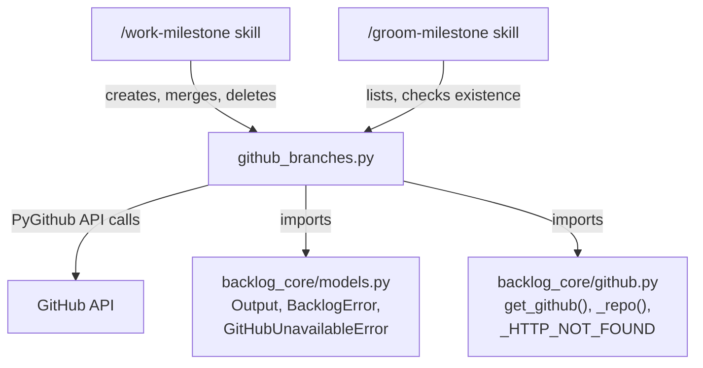
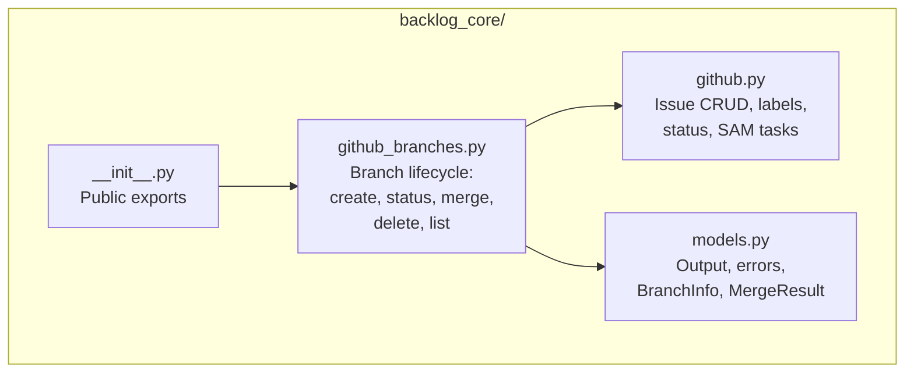

# Architecture: Integration Branch Lifecycle Management

## 1. Executive Summary

A new module `github_branches.py` in `plugins/development-harness/backlog_core/` provides five
PyGithub functions for integration branch lifecycle management. The module follows the established
patterns from `github.py` -- `get_github()` for auth, `Output` parameter for status messages,
`GithubException` catch-and-warn, `_repo()` for repo slug resolution. Functions are library calls
consumed by the `/work-milestone` and `/groom-milestone` skills. No MCP exposure initially.

Branch naming convention: `milestone/{N}-{slug}` (e.g., `milestone/3-v1.1-milestone-workflow`).

Merge strategy: squash merge via PyGithub's `repo.merge()` with `merge_method` parameter where
available, or via the pull request merge endpoint for squash support.

---

## 2. Architecture Overview

### C4 Context



### C4 Container



---

## 3. Technology Stack

| Component | Choice | Justification |
|-----------|--------|---------------|
| GitHub API client | PyGithub | Already used across 28 files in the project; `github.py` provides connection helpers |
| Python version | 3.11+ | Project baseline; enables `TypedDict`, `StrEnum`, `tomllib` |
| Data models | `TypedDict` | Matches existing pattern in `github.py` (`_LabelNode`); lightweight, no Pydantic overhead for internal return types |
| Error types | Existing `BacklogError`, `GitHubUnavailableError` | Reuse from `models.py`; add `BranchConflictError` subclass |
| Output | Existing `Output` model | Matches all other `github.py` functions |

---

## 4. Component Design

### Module: `backlog_core/github_branches.py`

**Purpose**: Integration branch CRUD operations via PyGithub.

**Dependencies**: `github.py` (connection helpers), `models.py` (Output, errors, data types).

**Imports from `github.py`**: `get_github`, `_repo`, `_HTTP_NOT_FOUND`

**Imports from `models.py`**: `Output`, `GitHubUnavailableError`, `BacklogError`

**New types defined in `models.py`**: `BranchInfo`, `MergeResult`, `BranchConflictError`

### Function Signatures

```python
# --- github_branches.py ---

from __future__ import annotations

from typing import TYPE_CHECKING

from github import GithubException

from .github import _HTTP_NOT_FOUND, _repo, get_github
from .models import (
    BranchConflictError,
    BranchInfo,
    GitHubUnavailableError,
    MergeResult,
    Output,
)

if TYPE_CHECKING:
    from github.Repository import Repository

BRANCH_PREFIX = "milestone/"


def create_integration_branch(
    milestone_number: int,
    slug: str,
    *,
    base_branch: str = "main",
    repo: str = "",
    output: Output | None = None,
) -> BranchInfo:
    """Create a branch named ``milestone/{N}-{slug}`` from the HEAD of ``base_branch``.

    Args:
        milestone_number: Milestone number (e.g. 3).
        slug: Hyphenated slug (e.g. ``v1.1-milestone-workflow``).
        base_branch: Branch to fork from. Defaults to ``main``.
        repo: Repository in ``owner/repo`` format.
        output: Optional Output collector.

    Returns:
        BranchInfo with branch name and HEAD SHA.

    Raises:
        GitHubUnavailableError: If GITHUB_TOKEN is not set.
        BacklogError: If the branch already exists (caller decides delete-and-recreate vs resume).
        GithubException: On unexpected GitHub API failure.
    """
    ...


def get_integration_branch_status(
    branch_name: str,
    *,
    repo: str = "",
    output: Output | None = None,
) -> BranchInfo | None:
    """Return HEAD SHA and last-commit timestamp for a branch.

    Non-raising on branch-not-found: returns ``None`` if the branch does not exist.

    Args:
        branch_name: Full branch name (e.g. ``milestone/3-v1.1-milestone-workflow``).
        repo: Repository in ``owner/repo`` format.
        output: Optional Output collector.

    Returns:
        BranchInfo if the branch exists, None otherwise.

    Raises:
        GitHubUnavailableError: If GITHUB_TOKEN is not set.
        GithubException: On unexpected GitHub API failure (not 404).
    """
    ...


def merge_integration_branch(
    head_branch: str,
    base_branch: str,
    commit_message: str,
    *,
    repo: str = "",
    output: Output | None = None,
) -> MergeResult:
    """Squash-merge ``head_branch`` into ``base_branch``.

    Uses PyGithub's ``repo.merge()`` for the merge operation. The merge is a
    squash merge with a descriptive commit message.

    Two merge directions are supported by the same function:
    - Worker -> integration: ``merge_integration_branch("worktree/item-42-auth", "milestone/3-slug", "...")``
    - Integration -> main: ``merge_integration_branch("milestone/3-slug", "main", "...")``

    Args:
        head_branch: Source branch name to merge from.
        base_branch: Target branch name to merge into.
        commit_message: Descriptive commit message for the squash merge.
        repo: Repository in ``owner/repo`` format.
        output: Optional Output collector.

    Returns:
        MergeResult with the new HEAD SHA and merge status.

    Raises:
        GitHubUnavailableError: If GITHUB_TOKEN is not set.
        BranchConflictError: If the merge has conflicts. Contains ``conflict_files``
            attribute with the list of conflicting file paths. The caller (orchestrator)
            classifies conflict severity.
        GithubException: On unexpected GitHub API failure.
    """
    ...


def delete_integration_branch(
    branch_name: str,
    *,
    repo: str = "",
    output: Output | None = None,
) -> bool:
    """Delete a branch by name. Idempotent: returns True even if already deleted.

    Args:
        branch_name: Full branch name (e.g. ``milestone/3-v1.1-milestone-workflow``).
        repo: Repository in ``owner/repo`` format.
        output: Optional Output collector.

    Returns:
        True if the branch was deleted or already absent. False on unexpected failure
        (logged via output.warn).

    Raises:
        GitHubUnavailableError: If GITHUB_TOKEN is not set.
    """
    ...


def list_integration_branches(
    *,
    repo: str = "",
    output: Output | None = None,
) -> list[BranchInfo]:
    """List all branches matching the ``milestone/`` prefix.

    Args:
        repo: Repository in ``owner/repo`` format.
        output: Optional Output collector.

    Returns:
        List of BranchInfo for each matching branch, sorted by last commit date
        (most recent first). Empty list if none found or on GitHub error.
    """
    ...
```

### Helper: Branch Name Construction

```python
def _branch_name(milestone_number: int, slug: str) -> str:
    """Construct canonical branch name: ``milestone/{N}-{slug}``."""
    ...
```

---

## 5. Data Architecture

### New Types in `models.py`

```python
# --- Add to backlog_core/models.py ---

from datetime import datetime


class BranchInfo(TypedDict):
    """Information about a Git branch."""

    name: str
    """Full branch name (e.g. ``milestone/3-v1.1-milestone-workflow``)."""

    sha: str
    """HEAD commit SHA."""

    last_commit_date: str
    """ISO 8601 timestamp of the last commit (e.g. ``2026-03-20T14:30:00Z``)."""

    age_days: int
    """Number of days since the last commit. Computed at query time."""


class MergeResult(TypedDict):
    """Result of a successful merge operation."""

    sha: str
    """New HEAD SHA of the base branch after merge."""

    message: str
    """Commit message used for the merge."""


class BranchConflictError(BacklogError):
    """Raised when a merge fails due to conflicts.

    Attributes:
        head_branch: Source branch that was being merged.
        base_branch: Target branch that was being merged into.
        conflict_files: List of file paths with conflicts (when available from API).
    """

    head_branch: str
    base_branch: str
    conflict_files: list[str]

    def __init__(
        self,
        head_branch: str,
        base_branch: str,
        conflict_files: list[str] | None = None,
    ) -> None:
        self.head_branch = head_branch
        self.base_branch = base_branch
        self.conflict_files = conflict_files or []
        files_str = ", ".join(self.conflict_files[:5]) if self.conflict_files else "unknown"
        super().__init__(
            f"Merge conflict: {head_branch} -> {base_branch} (files: {files_str})"
        )
```

### Validation Rules

| Field | Rule |
|-------|------|
| `milestone_number` | Positive integer (> 0) |
| `slug` | Non-empty string; alphanumeric + hyphens only |
| `branch_name` | Must start with `milestone/` for integration branch operations |
| `head_branch` / `base_branch` | Non-empty strings; must differ from each other |
| `commit_message` | Non-empty string |

---

## 6. Security Architecture

| Concern | Approach |
|---------|----------|
| Authentication | `GITHUB_TOKEN` from environment via `get_github()` -- no new auth paths |
| Token exposure | Never logged, never in Output messages, never in error messages |
| Branch name injection | Validate `slug` against `^[a-zA-Z0-9][a-zA-Z0-9._-]*$` before constructing ref |
| Rate limiting | Inherited from PyGithub's built-in rate limit handling |
| Permissions | Requires `repo` scope on token (same as existing operations) |

---

## 7. Testing Architecture

### Strategy

Unit tests mock PyGithub objects. No live API calls in tests.

### Test File

`plugins/development-harness/tests/test_github_branches.py`

### Coverage Requirements

- Each of the 5 public functions has at least:
  - 1 happy-path test
  - 1 error-path test (GithubException handling)
  - 1 edge-case test (branch already exists, already deleted, conflict)
- Minimum 15 test cases total
- Coverage target: >90% line coverage for `github_branches.py`

### Test Categories

| Category | Tests |
|----------|-------|
| `create_integration_branch` | Success from main; branch already exists raises BacklogError; invalid slug rejected |
| `get_integration_branch_status` | Branch exists returns BranchInfo; branch not found (404) returns None; other GithubException propagates |
| `merge_integration_branch` | Clean merge returns MergeResult; conflict raises BranchConflictError with file list; same branch rejected |
| `delete_integration_branch` | Success returns True; already deleted (404) returns True (idempotent); other error returns False with warning |
| `list_integration_branches` | Returns matching branches sorted by date; no matches returns empty list; GitHub error returns empty list |

### Mock Strategy

```python
# Pattern: mock get_github to return a mock Repository
@pytest.fixture
def mock_repo(mocker: MockerFixture) -> MagicMock:
    """Mock Repository returned by get_github()."""
    repo = MagicMock()
    mocker.patch("backlog_core.github_branches.get_github", return_value=repo)
    return repo
```

### pytest Configuration

From project `pyproject.toml`:

```toml
[tool.pytest.ini_options]
testpaths = ["tests"]
addopts = "--strict-markers --tb=short -q"
```

---

## 8. Distribution Architecture

**Strategy**: Module within existing package.

The new module is part of the `backlog_core` package inside `plugins/development-harness/`.
No separate distribution needed. Installed as part of the development-harness plugin.

### File Layout

```text
plugins/development-harness/
  backlog_core/
    __init__.py          # Add exports for new functions and types
    github.py            # Existing -- provides get_github, _repo, _HTTP_NOT_FOUND
    github_branches.py   # NEW -- 5 branch lifecycle functions
    models.py            # MODIFIED -- add BranchInfo, MergeResult, BranchConflictError
  tests/
    test_github_branches.py  # NEW -- unit tests
```

### Export Surface (`__init__.py` additions)

```python
from .github_branches import (
    create_integration_branch,
    delete_integration_branch,
    get_integration_branch_status,
    list_integration_branches,
    merge_integration_branch,
)
from .models import BranchConflictError, BranchInfo, MergeResult
```

---

## 9. Architectural Decisions

### ADR-001: Separate `github_branches.py` Module

**Decision**: Place branch operations in a new `github_branches.py` rather than extending `github.py`.

**Context**: `github.py` is 813 lines covering issue CRUD, PRs, labels, status management, and
SAM task sub-issues. Adding 5 functions with their imports and helpers would push it past 950 lines.

**Rationale**: Branch lifecycle is a distinct domain (refs and merges) from the existing module's
domain (issues, PRs, labels). Separate modules improve discoverability and reduce merge conflicts
when both areas are developed in parallel.

**Consequences**: Import paths differ (`from .github_branches import ...` vs `from .github import ...`).
Both modules share helpers from `github.py` (`get_github`, `_repo`, `_HTTP_NOT_FOUND`).

### ADR-002: `BranchConflictError` Instead of Return-Value Conflict Indicator

**Decision**: Merge conflicts raise `BranchConflictError` rather than returning a result with a
conflict flag.

**Context**: The orchestrator classifies conflict severity (trivial/medium/heavy) based on the
conflict file list. Two approaches: (A) return a union type `MergeResult | ConflictResult`, or
(B) raise with conflict data attached.

**Rationale**: Conflicts are exceptional -- they prevent the merge from completing. The caller
must handle them differently from success. An exception forces handling; a return value can be
silently ignored. The `conflict_files` attribute on the exception provides the data the
orchestrator needs for severity classification.

**Consequences**: Callers must wrap `merge_integration_branch()` in try/except for
`BranchConflictError`. This matches the existing pattern where `BacklogError` subclasses
carry structured data (e.g., `ItemNotFoundError.selector`).

### ADR-003: Squash Merge via PyGithub `repo.merge()`

**Decision**: Use PyGithub's `repo.merge(base, head, commit_message)` for merge operations.

**Context**: PyGithub's `Repository.merge()` creates a merge commit. True squash merges require
the PR merge endpoint (`pull.merge(merge_method="squash")`). The design doc specifies squash
merge for worker-to-integration merges.

**Rationale**: `repo.merge()` is the simplest API for branch-to-branch merges. For squash
semantics, the implementation may need to create a temporary PR and merge it with
`merge_method="squash"`, or use `repo.merge()` which produces a merge commit (acceptable if
the integration branch is itself squash-merged into main). The function signature abstracts
this -- the implementation chooses the best available mechanism.

**Consequences**: The function signature is stable regardless of whether the implementation uses
`repo.merge()` or the PR merge endpoint internally. If true squash is required, the implementation
creates an ephemeral PR, merges with squash, and cleans up.

### ADR-004: Idempotent Delete

**Decision**: `delete_integration_branch()` treats 404 (branch already gone) as success.

**Context**: The `/work-milestone` skill may retry cleanup steps. Race conditions between
parallel workers or manual deletion could result in delete being called on an already-deleted
branch.

**Rationale**: Idempotent operations are safer in automated workflows. The caller does not need
to check existence before deleting. This matches the existing pattern in `github.py` where
read operations return empty results on 404 rather than raising.

**Consequences**: The caller cannot distinguish "deleted by this call" from "was already gone."
This is acceptable because the post-condition is the same: branch does not exist.

### ADR-005: No MCP Exposure Initially

**Decision**: Branch functions are internal Python library calls, not exposed as MCP tools.

**Context**: The MCP server (`server.py`) exposes backlog operations as tools callable from
Claude sessions. Branch operations are consumed by `/work-milestone` skill scripts.

**Rationale**: The initial consumers are Python skill scripts that can import and call the
functions directly. MCP exposure adds boilerplate (tool definitions, parameter validation,
async wrappers) without benefit until a non-Python consumer needs branch operations.

**Consequences**: Branch operations are not callable via `mcp__plugin_dh_backlog__*`. If MCP
exposure is needed later, the function signatures are already designed for it (string parameters,
TypedDict returns, Output collectors).

---

## 10. Scalability Strategy

### Resource Management

- Each function creates its own `Github` instance via `get_github()` (matches existing pattern).
  No connection pooling needed at this scale.
- PyGithub handles rate limiting internally. Functions do not add additional rate limiting.
- `list_integration_branches` uses PyGithub's `get_branches()` which returns a `PaginatedList`.
  Filter client-side by prefix. For repositories with many branches, this is acceptable because
  the `milestone/` prefix is narrow.

### Concurrency

- Functions are synchronous (matches existing `github.py` pattern).
- Thread-safe: each call creates its own `Github` instance via `get_github()`.
- When called from MCP server via `asyncio.to_thread()`, the 15-second timeout on `get_github()`
  prevents blocking the event loop (matches existing pattern).

### Future Extensions

- If MCP exposure is added: wrap each function with `@mcp.tool()` in `server.py`, following
  the existing pattern for backlog tools.
- If branch protection rules need checking: add a `get_branch_protection()` helper that wraps
  PyGithub's `Branch.get_protection()`.
- If webhook-based branch event handling is needed: outside scope of this module.

## Post-Implementation Annotations

Added by context-refinement agent on 2026-03-21

### Design Refinements

1. **`_get_repo()` Private Helper**: Implementation introduced a `_get_repo(repo: str) -> Repository` private helper not specified in the architecture spec. It wraps the two-step `get_github().get_repo(_repo(repo))` pattern that all five public functions share. The `ty` type checker flags a mismatch because `Repository` is only imported under `TYPE_CHECKING`, not at runtime. This is a design-level addition that future functions in this module should reuse.
   - Original: "Functions call `get_github()` for auth" (implied inline per function)
   - Actual: Centralized in `_get_repo()` helper; all five public functions delegate to it
   - Recorded in: plan/tasks-1-integration-branch-management.md

2. **`_branch_info_from_branch()` Helper Added**: Implementation introduced a `_branch_info_from_branch(branch: Branch) -> BranchInfo` private helper not specified in the architecture spec. Required to handle the undocumented PyGithub behavior where `commit.commit.author.date` returns either a `datetime` object or an ISO string depending on fetch mode.
   - Original: Architecture spec did not describe this helper or the datetime/str polymorphism
   - Actual: Helper added; uses `isinstance(raw_date, datetime)` check before tzinfo handling
   - Recorded in: plan/tasks-1-integration-branch-management.md

3. **`repo.merge()` Returns `None` on No-Op**: Architecture spec described `repo.merge()` as returning a dict-like with `'sha'`. In practice, PyGithub returns `None` when the head branch is already merged (no new commits). The implementation handles this by reading the base branch HEAD SHA via `get_branch()` when the return value is `None`.
   - Original: "Merge: `repo.merge(base=base_branch, head=head_branch, commit_message=message)` → returns dict-like with 'sha'" (Section 5, Critical Implementation Details)
   - Actual: Returns `None` on already-up-to-date; implementation falls back to `gh_repo.get_branch(base_branch).commit.sha`
   - Recorded in: plan/tasks-1-integration-branch-management.md

4. **Status Constants Defined Locally**: `_HTTP_CONFLICT = 409`, `_HTTP_NO_CONTENT = 204`, and `_HTTP_UNPROCESSABLE = 422` are defined in `github_branches.py` rather than imported from `github.py`. Only `_HTTP_NOT_FOUND` is imported. The architecture spec referenced these values without specifying where they would live.
   - Original: Architecture spec referenced 409/422 status codes without specifying source
   - Actual: Defined as module-level constants in `github_branches.py`
   - Recorded in: plan/tasks-1-integration-branch-management.md

### Design Gaps Remaining (not implemented, not classified as intent divergence)

1. **Input Validation Absent**: Section 6 (Security Architecture) required slug regex validation (`^[a-zA-Z0-9][a-zA-Z0-9._-]*$`), `milestone_number > 0` guard, and `head_branch != base_branch` check. None were implemented. Code review flagged this. Tests do not cover invalid-input rejection. This is a known gap — not an intent divergence — as the feature's primary purpose (branch CRUD) is fully delivered.
   - Recorded in: plan/tasks-1-integration-branch-management.md
