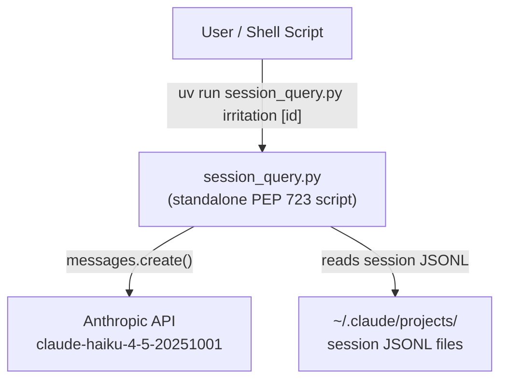
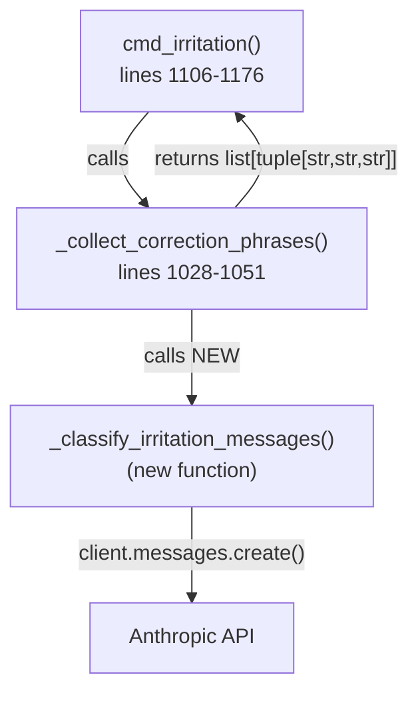

# Architecture Spec: Irritation LLM Fix

**Slug**: `irritation-llm-fix`
**File**: `plan/architect-irritation-llm-fix.md`
**Date**: 2026-03-11
**Status**: READY

---

## 1. Executive Summary

Replace the `_CORRECTION_PHRASES` substring matcher in `session_query.py` with a single
batched Claude API call that classifies all user messages from a session in one request.
The change is confined to a single file (`session_query.py`): remove the constant, add an
`anthropic` dependency to the PEP 723 metadata block, introduce one new function
`_classify_irritation_messages`, and rewrite the inner loop of `_collect_correction_phrases`
to delegate to that function. Output shape `(timestamp, phrase_label, excerpt)` is preserved
exactly. API failures raise immediately — no fallback to substring matching.

---

## 2. Architecture Overview

### C4 Context



### C4 Container (affected components only)



The `_CORRECTION_PHRASES` constant (lines 71-82) is **removed**. No other component changes.

---

## 3. Technology Stack

| Component | Choice | Justification |
|-----------|--------|---------------|
| HTTP client | `anthropic>=0.80.0` SDK | Already a dev dep; correct SDK for Claude API; handles auth, retries, streaming |
| Model | `claude-haiku-4-5-20251001` | Fast and cheap; sufficient for binary classification of short texts |
| Response format | JSON via `json.loads()` | Structured output; reliable parsing; no regex fragility |
| Script distribution | PEP 723 inline metadata | Script already uses this strategy; no package structure needed |

No new libraries beyond `anthropic`. No async — the single batch call is synchronous; latency
is acceptable for an interactive audit command.

---

## 4. Component Design

### 4.1 PEP 723 Metadata Change

The `dependencies` block in the PEP 723 header (lines 1-8 of `session_query.py`) gains one entry:

```text
# dependencies = [
#     "anthropic>=0.80.0",
#     "duckdb>=1.0.0",
#     "typer>=0.21.0"
# ]
```

Dependencies remain alphabetically sorted. `anthropic` is already present in
`pyproject.toml [dependency-groups] dev` — no change needed there (per CLAUDE.md PEP 723
dual-install rule, the script's runtime resolver and the project venv are already consistent
because the dev dep was added first).

### 4.2 New import

One import added at the top-level third-party block (after existing imports):

```python
import anthropic
```

No conditional import. The dependency is declared unconditionally in PEP 723 metadata.

### 4.3 `_classify_irritation_messages` — function signature and contract

```python
def _classify_irritation_messages(
    messages: list[tuple[str, str]],
) -> list[tuple[str, str, str]]:
    ...
```

**Parameters**

- `messages` — a `list[tuple[str, str]]` of `(timestamp, text)` pairs. Only user messages
  that have already passed the noise filter are included. The caller (`_collect_correction_phrases`)
  is responsible for pre-filtering.

**Returns**

- `list[tuple[str, str, str]]` — each element is `(timestamp, phrase_label, excerpt)` for
  messages the LLM determined are genuine irritation signals.
  - `timestamp` — passed through from input unchanged.
  - `phrase_label` — the first 50 characters of the message text (not LLM-generated; derived
    locally after the LLM identifies the message index). This fills the `matched_phrase` slot
    in the output tuple without requiring an extra LLM token for a label.
  - `excerpt` — first 200 characters of the message text (matches existing excerpt truncation).

**Behavior contract**

- If `messages` is empty, return `[]` immediately (no API call).
- Make exactly one `client.messages.create()` call with all messages in a single prompt.
- Parse the JSON response to obtain the set of flagged message indices.
- For each flagged index, construct the output tuple using local string slicing.
- If `ANTHROPIC_API_KEY` is not set in the environment, `anthropic.Anthropic()` raises
  `anthropic.AuthenticationError` — let this propagate unhandled (fail loud).
- If the API call raises any `anthropic.APIError` subclass, let it propagate unhandled.
- If the JSON response cannot be parsed (malformed output from the model), raise
  `ValueError` with the raw response text included in the message.

### 4.4 Modified `_collect_correction_phrases` — structural change

```python
def _collect_correction_phrases(records: list[dict]) -> list[tuple[str, str, str]]:
    ...
```

**Before** (inner loop body, lines 1046-1050):

```python
lower = content.lower()
for phrase in _CORRECTION_PHRASES:
    if phrase in lower:
        results.append((ts, phrase, content[:200]))
        break
```

**After** (structural replacement):

1. Accumulate a `candidates: list[tuple[str, str]]` of `(ts, content)` for every record
   that passes the existing `type != "user"`, `toolUseResult`, and `_is_noise` filters.
2. After the record loop completes, pass `candidates` to `_classify_irritation_messages`.
3. Assign the returned list directly to `results`.
4. Return `results`.

The filter logic (lines ~1028-1045) is unchanged. Only the inner matching block is replaced.

### 4.5 Removed symbol

`_CORRECTION_PHRASES` (lines 71-82) is deleted. No other call sites exist in the file.
The `cmd_irritation` docstring (line ~1115-1116) that references `_CORRECTION_PHRASES` is
updated to describe LLM-based detection instead.

---

## 5. Data Architecture

### Input to `_classify_irritation_messages`

```python
messages: list[tuple[str, str]]
# [(timestamp_0, text_0), (timestamp_1, text_1), ...]
```

Indexed 0-based. The LLM response references messages by their list index.

### Output from `_classify_irritation_messages`

```python
list[tuple[str, str, str]]
# [(timestamp, phrase_label, excerpt), ...]
# phrase_label = text[:50]
# excerpt      = text[:200]
```

### Preserved output contract of `_collect_correction_phrases`

```python
list[tuple[str, str, str]]
# (timestamp, matched_phrase_or_label, excerpt)
```

The `cmd_irritation` command's render code and `--raw` output format require this shape.
The `phrase_label` is now the first 50 chars of the message rather than a matched token
string. This is a semantic change in the `phrase` column but the structural type is
identical. Downstream `--raw` consumers that parse the second tab-separated column will
receive a different string than before — this is unavoidable and is acceptable per the
feature context (Scenario 4: raw output mode preserved, with the note that `<phrase>` field
"will now be an LLM-derived label or empty string — downstream consumers must tolerate this").

---

## 6. Security Architecture

- `ANTHROPIC_API_KEY` is read by the `anthropic` SDK from the environment automatically.
  It is never written to a file, logged, or included in any output.
- No user-supplied data is interpolated into shell commands (no subprocess calls).
- Message text is sent to the Anthropic API over HTTPS; the SDK enforces certificate
  validation by default.
- The prompt includes raw session message text. No sanitization is required because the
  content is sent to an LLM, not interpreted as code or shell.

Security checklist:

- [x] Path traversal prevention — not applicable (no new file paths introduced)
- [x] Command injection prevention — no subprocess calls
- [x] Secure temp file handling — no temp files
- [x] Rate limiting for API calls — single batch call per command invocation; no loop
- [x] Certificate validation for HTTPS — enforced by `anthropic` SDK default

---

## 7. Testing Architecture

### Strategy

This change introduces an external API dependency into a previously pure-local script.
The critical test requirement is that `_classify_irritation_messages` can be tested with
a mocked `anthropic.Anthropic` client without making real API calls.

### Test structure (collocated with session-historian)

```text
.claude/skills/session-historian/tests/
├── conftest.py                    # shared fixtures: mock anthropic client
├── test_classify_irritation.py    # unit tests for _classify_irritation_messages
└── test_collect_correction.py     # integration: _collect_correction_phrases with mock
```

### Coverage requirements

- `_classify_irritation_messages`: 95%+ coverage (this is the new critical path)
- `_collect_correction_phrases`: 80%+ (filter logic already exists; new delegation path added)
- `cmd_irritation` output shape: at least one end-to-end CLI test with mocked API

### Test cases to specify

**`test_classify_irritation.py`:**

| Test | Input | Expected output |
|------|-------|-----------------|
| Empty input — no API call | `[]` | `[]` |
| Single neutral message | `[("ts", "don't use tabs")]` | `[]` |
| Single irritation message | `[("ts", "that's wrong, you keep doing the same thing")]` | `[("ts", "that's wrong, you keep doing the", "that's wrong...")]` |
| Mixed batch | 3 messages: 1 neutral, 1 irritation, 1 neutral | Only the irritation message returned |
| API auth failure | SDK raises `AuthenticationError` | Exception propagates (no catch) |
| API network failure | SDK raises `APIConnectionError` | Exception propagates (no catch) |
| Malformed JSON response | Model returns non-JSON | `ValueError` raised with raw text |
| ANTHROPIC_API_KEY absent | Not set | `AuthenticationError` propagates |

**`test_collect_correction.py`:**

| Test | Input | Expected output |
|------|-------|-----------------|
| Records with noise filtered | Mixed record types | Only user non-noise records passed to classifier |
| toolUseResult records skipped | Record with `toolUseResult` key | Not in candidates |
| Non-user type skipped | `type: "assistant"` record | Not in candidates |

**CLI test (pytest with CliRunner):**

- Mock `anthropic.Anthropic` at module level
- Assert output format unchanged for `--raw` mode
- Assert exit code 0 when signals found, 0 with stderr when none found

### pytest configuration

```toml
[tool.pytest.ini_options]
addopts = [
    "--cov=.claude/skills/session-historian/scripts",
    "--cov-report=term-missing",
    "-v",
]
testpaths = [".claude/skills/session-historian/tests"]
markers = [
    "unit: marks unit tests",
    "cli: marks CLI integration tests",
    "critical: marks tests requiring high coverage",
]

[tool.coverage.run]
branch = true

[tool.coverage.report]
show_missing = true
fail_under = 80
```

---

## 8. Distribution Architecture

**Strategy: PEP 723 Standalone Script** — unchanged from current.

The script already uses `#!/usr/bin/env -S uv --quiet run --active --script` with inline
metadata. Adding `anthropic>=0.80.0` to the `dependencies` block is the only distribution
change. No packaging, no `pyproject.toml` runtime dependency addition, no entry points.

Per CLAUDE.md PEP 723 dual-install rule: `anthropic>=0.80.0` is already present in
`pyproject.toml [dependency-groups] dev`. The dual-install requirement is satisfied. No
additional `uv add` is needed.

---

## 9. Architectural Decisions (ADRs)

### ADR-001: Single batch API call, not per-message calls

**Context**: Sessions can contain hundreds of user messages. Per-message API calls would be
expensive (e.g., 200 messages × ~$0.003 = $0.60 per irritation query) and slow.

**Decision**: Collect all candidate messages into a list, send them in a single
`messages.create()` call with a numbered list in the user prompt. The model returns a JSON
array of flagged indices.

**Consequences**: Prompt grows linearly with session length. For very long sessions (500+
messages), the prompt may approach context limits. This is an acceptable edge case for an
audit command — the vast majority of sessions have far fewer user messages.

### ADR-002: `phrase_label = text[:50]` (not LLM-generated label)

**Context**: The output tuple requires a non-empty string in the `phrase` slot. Four options
were evaluated (see feature-context Q1): fixed label, LLM-generated label, empty string,
first N chars of message.

**Decision**: Use `text[:50]` (first 50 characters of the flagged message).

**Rationale**: Avoids extra tokens and response complexity; provides meaningful context in
`--raw` output; matches option D from the feature context with the specific resolution that
the prompt instructs "first 50 chars". Empty string was ruled out as it breaks `--raw`
consumers. LLM-generated label was ruled out as it requires structural response changes
(returning both indices and labels) and costs more tokens.

### ADR-003: Fail loud on API failure (no fallback to substring matching)

**Context**: The Debugging Protocol prohibits silent fallback without explicit approval.
Three options were evaluated (see feature-context Q3): fail loud, warn + empty, fallback
with warning.

**Decision**: API errors propagate unhandled. The command exits non-zero with the SDK's
error message.

**Rationale**: Falling back to substring matching would silently produce the incorrect
(false-positive-prone) results the feature is designed to eliminate. Option C (fallback with
warning) was not approved by the user in the requirements — the key facts explicitly state
"API failure: fail loud (raise, no silent fallback)". Option A is the Debugging Protocol
default and the user's stated choice.

### ADR-004: `claude-haiku-4-5-20251001` model

**Context**: The classification task is binary (irritation / not irritation) per message.
No complex reasoning is required.

**Decision**: Use `claude-haiku-4-5-20251001`.

**Rationale**: Haiku is the fastest and cheapest Claude model; sufficient for binary
classification of short texts; specified explicitly in the key facts. Sonnet would be
unnecessarily expensive for this task.

### ADR-005: No new files

**Context**: This is a surgical fix to one function in one script.

**Decision**: Modify `session_query.py` only. No helper modules, no config files, no
separate classifier module.

**Rationale**: The script is already a standalone PEP 723 file. Splitting it would require
changing how it is invoked. The new function is small (~40 lines) and fits naturally in the
existing file alongside other `_collect_*` helpers.

---

## 10. Scalability Strategy

### Prompt size management

The batch prompt grows linearly with the number of candidate messages. The Haiku context
window (200K tokens as of 2025) accommodates sessions with thousands of messages safely.
No chunking is needed for current session sizes.

If future sessions exceed practical prompt limits, the implementation agent may add chunked
batching (e.g., 100 messages per call) without changing the function signature — `messages`
is still `list[tuple[str, str]]` and the return type is unchanged.

### Latency

A single Haiku API call with a batch of 50 messages takes approximately 1-3 seconds.
This is acceptable for an interactive audit command. No progress bar is required.

For sessions with 0 candidate messages (all filtered as noise), `_classify_irritation_messages`
returns immediately with no API call — the fast path is preserved.

---

## Prompt Design

This section specifies the exact prompt structure for `_classify_irritation_messages`.

### System prompt

```text
You are a session analyzer. Your task is to identify user messages that express genuine
frustration, irritation, or correction directed at an AI assistant.

Flag a message if it contains ANY of:
- Direct accusations that the assistant is not listening or ignoring instructions
- Escalated corrections with elevated tone or repeated emphasis
- Sarcasm or mockery aimed at the assistant
- Arguments with the assistant
- Expressions of disbelief at repeated or obvious failure

Do NOT flag:
- Neutral workflow instructions that happen to contain words like "stop", "don't", "revert"
  (e.g., "don't use tabs", "stop after step 3", "revert to the original approach")
- Questions without emotional charge
- Self-directed frustration not aimed at the assistant
- Mild disappointment or gentle corrections ("please try again", "that's not quite right")

Return ONLY a JSON object in this exact format, with no other text:
{"flagged": [0, 2, 5]}

Where the numbers are the 0-based indices of flagged messages. Return {"flagged": []} if
none are flagged.
```

### User message

```text
Classify the following {N} user messages. Return the indices of messages that are genuine
irritation signals directed at the AI assistant.

{for i, (ts, text) in enumerate(messages)}
[{i}] {text}
{end for}
```

Each message is prefixed with its 0-based index in brackets. No timestamp is included in
the prompt (the classifier does not need it; timestamps are tracked locally).

### Response parsing

The model returns a JSON object `{"flagged": [int, ...]}`. Parse with `json.loads()`.
Validate that `"flagged"` key exists and its value is a list of integers. For each index
in `flagged`, construct `(timestamp, text[:50], text[:200])` from the input `messages` list.

If `json.loads()` raises `json.JSONDecodeError`, raise `ValueError(f"LLM returned
non-JSON response: {raw_text!r}")`.

If any index in `flagged` is out of range for the `messages` list, raise `ValueError(
f"LLM returned out-of-range index {idx} for {len(messages)} messages")`.

---

## Change Summary

| Location | Change |
|----------|--------|
| PEP 723 header (lines 1-8) | Add `"anthropic>=0.80.0"` to `dependencies` |
| Line ~20 (imports) | Add `import anthropic` |
| Lines 71-82 | Delete `_CORRECTION_PHRASES` constant |
| Lines ~1028-1051 | Rewrite `_collect_correction_phrases` inner loop; accumulate candidates then call `_classify_irritation_messages` |
| New function (after line ~1051) | Add `_classify_irritation_messages(messages)` |
| Line ~1115-1116 | Update docstring to remove reference to `_CORRECTION_PHRASES` |

Total: one file modified. Estimated net line change: +55 lines (new function) -15 lines
(removed constant + inner loop) = +40 lines net.
