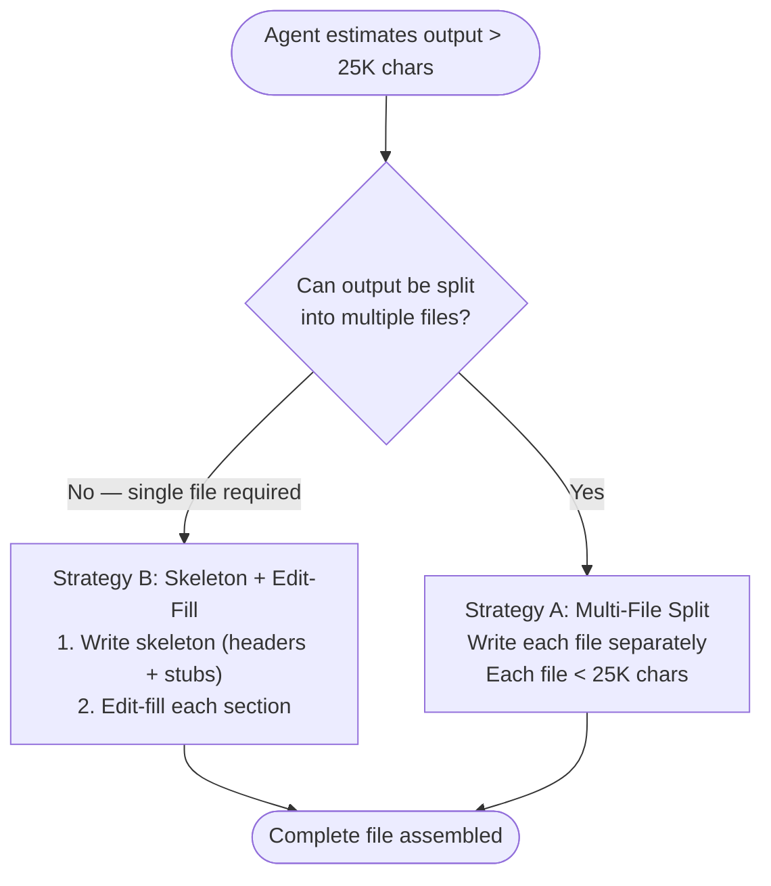
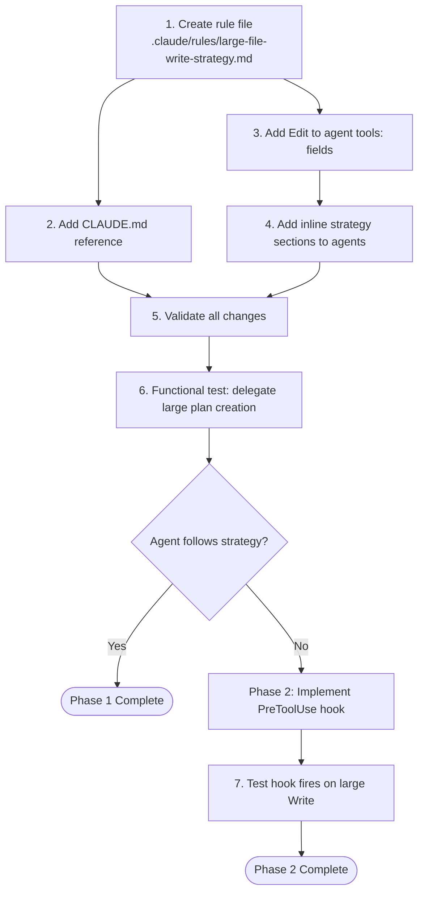

# Architecture: Agent Large File Write Strategy

## Document Metadata

- **Feature**: Agent Large File Write Strategy
- **Issue**: #367
- **Priority**: P1
- **Status**: DESIGN_COMPLETE
- **Input Documents**:
  - [Feature Context](./feature-context-large-file-write-strategy.md)
  - [Codebase Analysis](./codebase/large-file-write-patterns.md)
- **Date**: 2026-03-02

---

## Executive Summary

Sub-agents writing large files (>30K characters) via single Write tool calls stall or timeout. This architecture defines a three-layer mitigation: (1) a canonical guidance rule file that teaches agents the skeleton-first, Edit-fill pattern, (2) agent tool list updates adding Edit to five large-output agents, and (3) an optional PreToolUse enforcement hook that warns agents attempting oversized Write calls. The design complements the existing swarm-task-planner progressive disclosure (multi-file split) strategy rather than replacing it.

---

## Design Decisions

### ADR-001: Character Threshold — 25,000 Characters

**Status**: Accepted

**Context**: The observed failure was a 57,800-character single Write call that stalled. The safe upper bound for a single Write call is empirically unknown. Three options were considered: 20K (conservative), 30K (moderate), 25K (midpoint).

**Decision**: Set the threshold at 25,000 characters.

**Rationale**:

- 57.8K failed. A 50% safety margin from the failure point yields ~29K. Rounding down to 25K provides additional buffer.
- 25K characters is approximately 400-500 lines of structured markdown with YAML frontmatter — a natural inflection point where skeleton+Edit-fill provides measurable value versus a single Write call.
- The threshold is not a hard tool limitation but a behavioral guidance boundary. Agents writing 26K characters in a single Write will not crash; they risk stalling. The threshold signals "switch strategy."
- This avoids being so low (20K) that medium-sized documents (200-300 lines) unnecessarily trigger the incremental pattern, adding overhead without risk reduction.

**Consequences**:

- Agents producing documents in the 25K-57K range will use incremental writes, avoiding the observed failure mode.
- Documents under 25K continue using single Write calls with no overhead.
- The threshold is tunable — if stalls are observed below 25K, reduce it. If agents use incremental writes unnecessarily, raise it.

**Evidence**: Observed failure at 57,800 chars (commit 8beddfb, file `plan/tasks-14-console-forwarding-mcp-server-plugin.md`, 821 lines). No failures observed below 30K in session history.

---

### ADR-002: Two-Strategy Model — Split-First, Edit-Fill as Complement

**Status**: Accepted

**Context**: The swarm-task-planner already has a Document Structure Policy that splits plans into a `PLAN/` directory when >= 500 lines. The skeleton+Edit-fill pattern is a second strategy for large file writes. The relationship between these two strategies needs resolution (Gap #5 from feature context).

**Decision**: Adopt a two-strategy model with clear selection criteria.

**Strategy A — Multi-File Split** (preferred when feasible):

- Split the output into multiple smaller files, each under 25K characters.
- Applicable when the document structure permits logical decomposition (task plans with independent tasks, codebase analyses with separate focus areas).
- The existing swarm-task-planner 500-line threshold triggers this strategy for task plans.

**Strategy B — Skeleton + Edit-Fill** (when single file is required):

- Write a structural skeleton (headers, frontmatter, section stubs) as a single Write call.
- Fill each section incrementally using Edit calls.
- Applicable when the output must be a single file (architecture specs, feature context documents, consolidated reports).

**Selection Flowchart**:



**Rationale**:

- Multi-file split eliminates the large-Write problem entirely — each file is small.
- Skeleton+Edit-fill handles cases where a single file is structurally required (e.g., architecture specs consumed by downstream agents expecting one file path).
- Making both strategies explicit prevents agents from choosing arbitrarily or defaulting to single large writes.
- The swarm-task-planner's existing 500-line split policy remains valid and is subsumed by Strategy A.

**Consequences**:

- Agents must estimate output size before writing. This is a cognitive overhead but prevents stalls.
- The guidance document must explain both strategies with concrete examples.
- Agents that currently only have Write (no Edit) need Edit added for Strategy B.

---

### ADR-003: Soft Warning Hook, Not Hard Block

**Status**: Accepted

**Context**: PreToolUse hooks can either deny a Write call (hard block, exit code 2) or inject `additionalContext` while allowing the call (soft warning, exit code 0). Hard block with current agents lacking Edit tool causes immediate failure. Soft warning relies on agent compliance but is non-disruptive.

**Decision**: Implement a soft-warning hook that injects `additionalContext` when a Write call exceeds 25K characters. Do not deny the Write.

**Rationale**:

- Five agents currently lack Edit in their tools list. Until all are updated, a hard block would cause those agents to fail entirely — they cannot comply with the skeleton+Edit-fill instruction.
- The orchestrator-discipline plugin already uses this pattern: `pre-tool-orchestrator-read-warning.cjs` injects `additionalContext` without blocking. This is a proven, non-disruptive approach in this codebase.
- A soft warning surfaces the decision point to the agent without breaking existing workflows.
- After all agents have Edit in their tools list and the guidance is embedded in agent prompts, the hook can be upgraded to a hard block if soft warnings prove insufficient.

**Consequences**:

- Agents may ignore the warning. This is acceptable as a transitional measure.
- The hook provides telemetry — if warnings are frequently emitted, it indicates agents are not following the guidance, motivating a hard block upgrade.
- No breaking changes to existing agent behavior.

---

### ADR-004: All Five Large-Output Agents Get Edit Tool

**Status**: Accepted

**Context**: Five agents produce large document artifacts and have Write but not Edit: swarm-task-planner, python-cli-design-spec, codebase-analyzer, ecosystem-researcher, feature-researcher. The skeleton+Edit-fill strategy requires Edit.

**Decision**: Add Edit to the `tools:` field of all five agents, in both the `python3-development` and `development-harness` plugin copies where they exist.

**Rationale**:

- Strategy B (skeleton+Edit-fill) requires Edit. Agents without Edit cannot comply with the guidance even when instructed.
- All five agents are document producers. Edit is a natural tool for document assembly — it is not a risky capability addition.
- Updating only one agent (swarm-task-planner) would leave four others vulnerable to the same stall failure.
- The Edit tool does not introduce new risk: these agents already have Write, which is strictly more powerful (full file replacement vs. targeted edit).

**Consequences**:

- All five agents can use either strategy (split or Edit-fill).
- Agent prompt files in two plugins need updating (10 files total if all have development-harness copies).
- `plugin.json` files do not need updating — tool lists are in agent frontmatter, not plugin manifests.

---

### ADR-005: Guidance as `.claude/rules/` File Referenced from CLAUDE.md

**Status**: Accepted

**Context**: The guidance must reach agents at runtime. Three locations were considered: `.claude/rules/` file with `paths:` globs, CLAUDE.md section, or inline in each agent's prompt.

**Decision**: Create `.claude/rules/large-file-write-strategy.md` with no `paths:` frontmatter. Reference it from CLAUDE.md via the standard bullet-link pattern under the Tool Usage section.

**Rationale**:

- Rules files with `paths:` globs auto-load when Claude Code opens matching files. This strategy applies to all agents producing files, not to specific file patterns being opened. A `paths:` glob targeting agent files would only load when the agent file itself is read — not when the agent is executing and about to write.
- CLAUDE.md applies globally to all sessions. Referencing the rule from CLAUDE.md ensures it is loaded in the orchestrator context and available when delegation prompts are constructed.
- The orchestrator constructs delegation prompts that include guidance. The rule content flows to agents via delegation context, not via auto-loading. This aligns with the existing delegation model where the orchestrator passes instructions and file paths to agents.
- Inline guidance in each agent's prompt is the most reliable delivery mechanism for the agent itself, but creates maintenance burden (5+ agents to keep synchronized). A brief inline reference pointing to the canonical rule file provides discoverability without duplication.

**Consequences**:

- The rule is available to the orchestrator via CLAUDE.md.
- Agents receive the guidance through delegation prompts, not auto-loading.
- Each agent file gets a brief inline instruction (2-3 lines) referencing the strategy, not the full rule content.

---

### ADR-006: Hook Deferred to Phase 2

**Status**: Accepted

**Context**: The PreToolUse hook adds enforcement but requires Node.js development, testing, and deployment decisions (plugin vs. project-level). The guidance-only approach (rule file + agent updates) is lighter weight and may be sufficient.

**Decision**: Implement in two phases. Phase 1: guidance rule file, agent tool list updates, agent prompt additions, CLAUDE.md reference. Phase 2: PreToolUse enforcement hook, contingent on Phase 1 validation.

**Rationale**:

- Phase 1 is documentation and frontmatter changes only — zero code, zero runtime risk.
- Phase 1 can be validated immediately: delegate a task plan write to swarm-task-planner and observe whether it uses the incremental pattern.
- If Phase 1 is sufficient (agents comply with guidance), the hook adds complexity without benefit.
- If Phase 1 is insufficient (agents ignore guidance and stall), Phase 2 provides the enforcement mechanism.

**Consequences**:

- Phase 1 is deployable immediately with low risk.
- Phase 2 has a clear trigger: observed stalls after Phase 1 deployment.
- The hook design is specified here for Phase 2 implementation readiness, but implementation is deferred.

---

## Component Design

### Component 1: Guidance Rule File

**File**: `.claude/rules/large-file-write-strategy.md`

**Purpose**: Canonical strategy document for agents producing large file output.

**No `paths:` frontmatter** — loaded via CLAUDE.md reference, not auto-loading.

**Required Sections (Interface Contract)**:

The rule file MUST contain these sections in this order:

1. **Title**: `# Large File Write Strategy`

2. **Scope Statement**: Which agents and situations this applies to. Explicitly names the five large-output agents. States the 25K character threshold.

3. **Decision Flowchart**: Mermaid flowchart showing the strategy selection logic:
   - Estimate output size
   - If < 25K chars: single Write call (no special handling)
   - If >= 25K chars and splittable: Strategy A (multi-file split)
   - If >= 25K chars and single file required: Strategy B (skeleton + Edit-fill)

4. **Strategy A: Multi-File Split**: Description of when and how to split output into multiple files. References the swarm-task-planner's existing 500-line progressive disclosure policy as the canonical example. Specifies that each individual file must be < 25K characters.

5. **Strategy B: Skeleton + Edit-Fill**: Step-by-step procedure:
   - Step 1: Plan the document structure (sections, headers, approximate content per section)
   - Step 2: Write the skeleton — YAML frontmatter, all section headers, placeholder text (e.g., `<!-- PENDING: section description -->`) — as a single Write call. Target skeleton size: < 5K characters.
   - Step 3: Fill each section using individual Edit calls, replacing the placeholder with actual content. Each Edit call targets one section.
   - Step 4: Final verification read to confirm all placeholders are replaced.

6. **Wrong/Right Examples**: Concrete examples following the rules file convention:
   - **Wrong**: Single Write call with 40K characters of content
   - **Right**: Write skeleton (2K chars), then 8 Edit calls filling sections (3-5K chars each)

7. **Relationship to No Invented Limits**: Explicit statement that this strategy does NOT truncate content. The full document is written — incrementally instead of atomically. The threshold governs write mechanics, not content completeness.

**Content Constraints**:

- Under 200 lines (this is procedural guidance, not a reference document).
- Present-tense imperative voice.
- No temporal language.
- Code fences with language specifiers on all examples.
- Mermaid decision flowchart for strategy selection.

---

### Component 2: Agent Tool List Updates

**Files to modify** (add `Edit` to `tools:` frontmatter field):

| # | Agent File | Current tools: value | Plugin |
|---|-----------|---------------------|--------|
| 1 | `plugins/python3-development/agents/swarm-task-planner.md` | `Read, Write, Glob, Grep, mcp__ref__*, mcp__exa__*, TodoWrite, mcp__sequential-thinking__*` | python3-development |
| 2 | `plugins/python3-development/agents/python-cli-design-spec.md` | `Read, Write, Glob, Grep, mcp__ref__*, mcp__exa__*, TodoWrite, mcp__sequential-thinking__*` | python3-development |
| 3 | `plugins/python3-development/agents/codebase-analyzer.md` | (to be read at implementation time) | python3-development |
| 4 | `plugins/python3-development/agents/ecosystem-researcher-v1.1-rt-ica.md` | (to be read at implementation time) | python3-development |
| 5 | `plugins/python3-development/agents/feature-researcher.md` | (to be read at implementation time) | python3-development |

**For development-harness copies**: Check for corresponding files at `plugins/development-harness/agents/` and update those as well. Not all agents have development-harness copies — verify at implementation time.

**Modification**: Insert `Edit` after `Write` in the comma-separated `tools:` string. Example:

Before:

```yaml
tools: Read, Write, Glob, Grep, mcp__ref__*, ...
```

After:

```yaml
tools: Read, Write, Edit, Glob, Grep, mcp__ref__*, ...
```

**Validation**: After modification, run `uv run plugins/plugin-creator/scripts/plugin_validator.py {agent-file}` to confirm frontmatter remains valid.

---

### Component 3: Agent Prompt Additions

**Files**: Same five agent `.md` files listed in Component 2.

**Modification**: Add a brief inline instruction in the agent body (not frontmatter) referencing the large file write strategy. The instruction is placed in or near the agent's existing output/writing section.

**Required Content (Contract)**:

Each agent must contain text equivalent to:

```text
## Large File Write Strategy

When producing output files that may exceed 25,000 characters:

1. If the output can be split into multiple files (each < 25K chars): split it.
2. If a single file is required: write a skeleton first (headers, frontmatter, section
   stubs as a single Write call), then fill each section using individual Edit calls.

Do not attempt to write more than 25,000 characters in a single Write call.
```

**Placement**: Near existing output format or document structure instructions. For swarm-task-planner, this goes adjacent to the existing "Document Structure Policy" section (line ~168). For python-cli-design-spec, near the output artifact section.

**The text above is a content contract** — the implementation agent writes the actual prose following this structure. It is not a verbatim copy-paste template.

---

### Component 4: CLAUDE.md Integration

**File**: `.claude/CLAUDE.md`

**Modification**: Add a bullet-link reference to the new rule file, following the existing pattern.

**Placement**: After the existing "Tool Usage" section (line ~57-61) and before "Reference notation" (line ~63). This groups all tool-related guidance together.

**Content**:

```markdown
- Large File Write Strategy: `.claude/rules/large-file-write-strategy.md`
```

Followed by the standard `---` separator that this repo uses between rule references.

---

### Component 5: PreToolUse Enforcement Hook (Phase 2 — Deferred)

**Deployment**: As a plugin hook in `orchestrator-discipline` (aligns with existing PreToolUse hooks in that plugin).

**File**: `plugins/orchestrator-discipline/hooks/pre-tool-large-write-warning.cjs`

**hooks.json update**: Add a new entry to `plugins/orchestrator-discipline/hooks.json`:

```json
{
  "matcher": "Write",
  "hooks": [
    {
      "type": "command",
      "command": "node \"${CLAUDE_PLUGIN_ROOT}/hooks/pre-tool-large-write-warning.cjs\""
    }
  ]
}
```

**Hook Behavior Contract**:

- **Input**: Reads `tool_input` from stdin JSON. Extracts `tool_input.content` string.
- **Threshold check**: If `tool_input.content.length <= 25000`, emit empty JSON `{}` and exit 0 (no action).
- **Warning output**: If `tool_input.content.length > 25000`, emit:

```json
{
  "hookSpecificOutput": {
    "hookEventName": "PreToolUse",
    "additionalContext": "<large-write-warning>\nWRITE SIZE WARNING: This Write call contains {N} characters, exceeding the 25,000 character safe threshold.\n\nLarge single-Write calls risk stalling or timing out.\n\nRECOMMENDED APPROACH:\n1. If the content can be split into multiple files: cancel this Write, split into smaller files, write each separately.\n2. If a single file is required: cancel this Write, write a skeleton (headers + stubs only), then use Edit calls to fill each section.\n\nSee .claude/rules/large-file-write-strategy.md for the full strategy.\n</large-write-warning>"
  }
}
```

- **Exit code**: Always 0 (non-blocking). The hook warns but does not deny.
- **No `permissionDecision`**: Omitting `permissionDecision` means the Write proceeds normally. The `additionalContext` is injected into the agent's context before the Write executes.

**Pattern reference**: Follows the exact structure of `plugins/orchestrator-discipline/hooks/pre-tool-orchestrator-read-warning.cjs` — stdin JSON parse, field extraction, conditional output, always exit 0.

**Upgrade path to hard block**: Change output to include `"permissionDecision": "deny"` and `"permissionDecisionReason"` with the remediation instructions. This converts the soft warning to a hard block. Only do this after all five agents have Edit in their tools list and the guidance is embedded in their prompts.

---

## File-by-File Change List

### Phase 1 (Immediate — Documentation + Frontmatter)

| # | File | Action | Description |
|---|------|--------|-------------|
| 1 | `.claude/rules/large-file-write-strategy.md` | **CREATE** | New rule file. Canonical strategy document (~150-200 lines). Contains decision flowchart, both strategies, wrong/right examples, 25K threshold. |
| 2 | `.claude/CLAUDE.md` | **EDIT** | Add bullet-link reference: `- Large File Write Strategy: \`.claude/rules/large-file-write-strategy.md\`` after Tool Usage section (~line 62). |
| 3 | `plugins/python3-development/agents/swarm-task-planner.md` | **EDIT** | Add `Edit` to `tools:` frontmatter. Add "Large File Write Strategy" section in body near Document Structure Policy. |
| 4 | `plugins/python3-development/agents/python-cli-design-spec.md` | **EDIT** | Add `Edit` to `tools:` frontmatter. Add "Large File Write Strategy" section in body near output artifact section. |
| 5 | `plugins/python3-development/agents/codebase-analyzer.md` | **EDIT** | Add `Edit` to `tools:` frontmatter. Add "Large File Write Strategy" section in body. |
| 6 | `plugins/python3-development/agents/ecosystem-researcher-v1.1-rt-ica.md` | **EDIT** | Add `Edit` to `tools:` frontmatter. Add "Large File Write Strategy" section in body. |
| 7 | `plugins/python3-development/agents/feature-researcher.md` | **EDIT** | Add `Edit` to `tools:` frontmatter. Add "Large File Write Strategy" section in body. |
| 8-12 | `plugins/development-harness/agents/{corresponding-agents}.md` | **EDIT** (if exist) | Same changes as #3-7 for development-harness copies. Verify existence at implementation time. |

### Phase 2 (Deferred — Hook Enforcement)

| # | File | Action | Description |
|---|------|--------|-------------|
| 13 | `plugins/orchestrator-discipline/hooks/pre-tool-large-write-warning.cjs` | **CREATE** | PreToolUse hook script. Node.js CommonJS. Reads stdin, checks content length, emits additionalContext warning if > 25K chars. |
| 14 | `plugins/orchestrator-discipline/hooks.json` | **EDIT** | Add Write matcher entry pointing to `pre-tool-large-write-warning.cjs`. |

---

## Guidance Layer Architecture

The strategy reaches agents through a layered system. Each layer serves a different purpose and audience.

```text
Layer 1: Rule File (.claude/rules/large-file-write-strategy.md)
  Purpose: Canonical reference. Full strategy, flowchart, examples, threshold.
  Audience: Orchestrator (loaded via CLAUDE.md), agent authors (for reference).
  Delivery: Read by orchestrator at session start via CLAUDE.md reference chain.

Layer 2: CLAUDE.md Reference (bullet-link in Tool Usage section)
  Purpose: Discovery. Ensures the rule file is loaded in orchestrator context.
  Audience: Orchestrator.
  Delivery: CLAUDE.md is always loaded.

Layer 3: Agent Inline Instructions (brief section in each agent's body)
  Purpose: Direct agent guidance. The agent sees this in its own prompt.
  Audience: The sub-agent itself during execution.
  Delivery: Part of the agent file, loaded when the agent is spawned.

Layer 4: PreToolUse Hook (Phase 2 — deferred)
  Purpose: Runtime enforcement. Catches agents that ignore Layers 1-3.
  Audience: Any agent attempting an oversized Write.
  Delivery: Hook fires on Write tool calls, injects context into agent.
```

**Why four layers?**

- Layer 1 alone is insufficient: agents do not read `.claude/rules/` files during execution unless `paths:` globs match.
- Layer 2 ensures the orchestrator knows the strategy and can include it in delegation prompts.
- Layer 3 ensures agents have the guidance even if the orchestrator's delegation prompt omits it.
- Layer 4 catches the case where an agent has the guidance but does not follow it.

**Information flow**:

```text
CLAUDE.md (Layer 2)
  └─> Orchestrator reads rule file (Layer 1) at session start
       └─> Orchestrator constructs delegation prompt
            └─> Sub-agent receives guidance via prompt
                 └─> Sub-agent also has inline instructions (Layer 3)
                      └─> If agent still attempts large Write,
                           hook injects warning (Layer 4)
```

---

## Relationship to Existing Constraints

### "No Invented Limits" (CLAUDE.md)

The 25K threshold does NOT violate the "No Invented Limits" rule. That rule prohibits truncation — removing content from consumer-facing output. This strategy changes the write mechanics (incremental vs. atomic) while producing the identical complete document. No content is lost, truncated, or hidden.

The rule file must include an explicit statement about this relationship to prevent agents from interpreting the threshold as a content truncation limit.

### swarm-task-planner Document Structure Policy

The existing 500-line split policy at `swarm-task-planner.md:168` is subsumed by Strategy A (Multi-File Split). The two are compatible:

- The 500-line threshold triggers directory split for task plans specifically.
- The 25K character threshold triggers strategy selection for all agents and all document types.
- A task plan that is 500+ lines is almost certainly > 25K characters, so both thresholds align.
- The swarm-task-planner's existing split implementation needs no changes — it already implements Strategy A.

### Skill Content Optimization

The `skill-content-optimization.md` rule targets SKILL.md and reference files with a 500-line guideline. This is a separate concern from agent output files. No conflict.

---

## Validation Criteria

### Phase 1 Acceptance

1. `.claude/rules/large-file-write-strategy.md` exists and contains all required sections (decision flowchart, both strategies, wrong/right examples, threshold statement, No Invented Limits clarification).
2. CLAUDE.md contains the bullet-link reference to the rule file.
3. All five agents in `python3-development` have `Edit` in their `tools:` frontmatter.
4. All five agents have a "Large File Write Strategy" section in their body.
5. `uv run plugins/plugin-creator/scripts/plugin_validator.py` passes on all modified agent files.
6. `uv run prek run --files .claude/rules/large-file-write-strategy.md` passes linting.

### Phase 1 Functional Validation

Delegate a task plan creation to swarm-task-planner for a feature complex enough to produce > 25K characters of output. Observe whether the agent:

- Uses Strategy A (multi-file split) for large plans, OR
- Uses Strategy B (skeleton + Edit-fill) for single-file output

If the agent writes a single file > 25K characters without using either strategy, the guidance is insufficient and Phase 2 (hook enforcement) should be prioritized.

### Phase 2 Acceptance (When Implemented)

1. `plugins/orchestrator-discipline/hooks/pre-tool-large-write-warning.cjs` exists and follows the Node.js CommonJS hook pattern.
2. `plugins/orchestrator-discipline/hooks.json` contains the Write matcher entry.
3. The hook emits `additionalContext` when `tool_input.content.length > 25000`.
4. The hook emits empty JSON `{}` when content is <= 25000 characters.
5. The hook always exits with code 0 (non-blocking).
6. `claude plugin validate plugins/orchestrator-discipline` passes.

---

## Risk Assessment

| Risk | Probability | Impact | Mitigation |
|------|-------------|--------|------------|
| Agents ignore guidance and continue single large writes | Medium | High (stalls recur) | Phase 2 hook enforcement; inline agent instructions are harder to ignore than external rules |
| Edit tool addition causes agents to use Edit inappropriately (editing files they should write fresh) | Low | Medium (unexpected file mutations) | Edit is strictly less powerful than Write; agents already have Write. Agent instructions specify Edit for section-fill only. |
| 25K threshold is too high (stalls occur at lower sizes) | Low | High (stalls at 25K-30K) | Threshold is tunable. Lower to 20K if stalls are observed. The hook makes threshold changes a one-line edit. |
| 25K threshold is too low (unnecessary overhead on medium documents) | Low | Low (slight performance cost) | Skeleton+Edit-fill adds ~2-3 extra tool calls. Cost is negligible compared to the stall-prevention benefit. Raise threshold if performance data warrants. |
| Phase 2 hook interferes with legitimate large writes | Low | Medium | Hook is soft warning only. No blocking. Agent can proceed. |

---

## Implementation Dependencies



**Task ordering**:

- Tasks 1-2 (rule file + CLAUDE.md) have no dependencies and can be done in parallel with Tasks 3-4 (agent updates).
- Task 5 (validation) depends on all prior tasks.
- Task 6 (functional test) depends on Task 5.
- Phase 2 is conditionally triggered by Task 6 results.

---

## Out of Scope

- **Modifying the Write tool itself**: The Write tool has no documented size limit. This architecture works around the tool's observed behavior, not its specification.
- **Changing the Read tool**: The Read tool already supports `offset`/`limit` for large file consumption. No changes needed.
- **Modifying the implementation_manager.py**: The task status management scripts handle both single-file and directory task layouts. No changes needed.
- **Changing the hook infrastructure**: Using existing PreToolUse hook patterns. No hook framework changes.
- **Retroactively splitting existing large files**: Existing plan artifacts that were successfully written are stable. This strategy applies to future writes.
