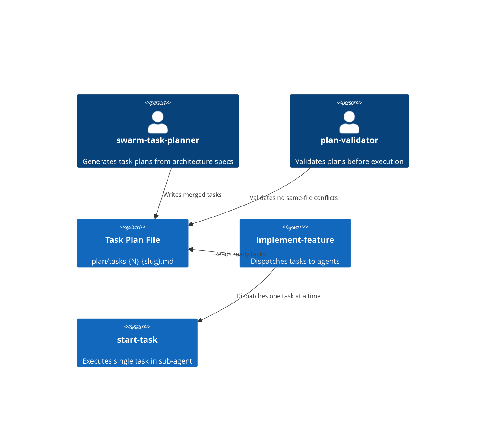
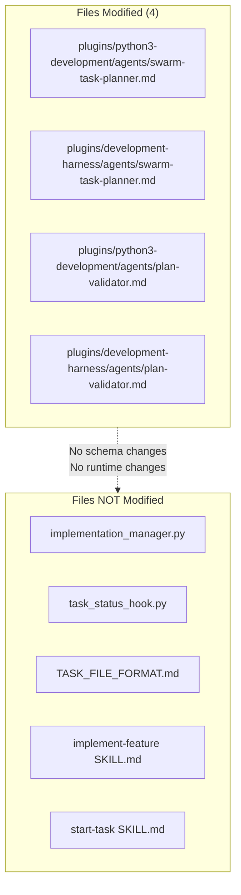

# Architecture Spec: Merge Same-File Tasks into Single Agent Assignment

## Executive Summary

When the swarm-task-planner generates tasks where multiple tasks modify the same output file, those tasks must be merged into a single task at planning time. This eliminates edit conflicts during execution, avoids hook bypass workarounds, and reduces wasted context-window cost from multiple agents independently reading the same file.

The change is scoped to two agent prompt files (swarm-task-planner in both plugins) and one agent prompt file (plan-validator in both plugins). No runtime code, schema, hook scripts, or orchestrator logic changes are required.

---

## Architecture Overview

### System Context



### Change Boundary



**Rationale**: The user selected Option C (planner merges at writing time) and Option A (planning-time only). This means:

- The planner writes ONE task where multiple tasks would have shared output files. The original sub-task IDs never exist in the plan.
- No new YAML frontmatter fields are needed.
- No runtime grouping logic is needed in `implementation_manager.py`.
- Since compound tasks have a single task ID, the existing `SubagentStop` handler, `start-task` skill, and `implement-feature` dispatch loop all work unchanged.

---

## Component Design

### Component 1: swarm-task-planner — Same-File Task Merging Section

**Purpose**: Detect when multiple tasks in the architecture spec would modify the same output file and merge them into a single task at plan-writing time.

**Location**: New section in `swarm-task-planner.md`, inserted after the existing "Parallelization and Conflict Avoidance" section in both copies:

- [plugins/python3-development/agents/swarm-task-planner.md](./../../plugins/python3-development/agents/swarm-task-planner.md)
- [plugins/development-harness/agents/swarm-task-planner.md](./../../plugins/development-harness/agents/swarm-task-planner.md)

**Section Name**: `## Same-File Task Merging`

**Behavioral Contract**:

The swarm-task-planner MUST, during Phase 3 (Task Decomposition), perform the following before writing tasks:

1. **Detect overlap**: After decomposing the architecture spec into candidate tasks, build a mapping of `output file path -> list of candidate tasks`. Any output file path that appears in the Expected Outputs of more than one candidate task is a "shared file."

2. **Merge decision**: For each shared file, merge all candidate tasks that write to that file into a single task. The merged task:
   - Receives a single task ID (following the plan's ID scheme, not a compound ID).
   - Has a title that reflects the combined scope (e.g., "Update SKILL.md: prerequisites, error recovery, and syntax annotations" rather than the narrowest sub-scope).
   - Lists all dependencies from the constituent candidate tasks (union of dependency sets, deduplicated).
   - Uses the highest `complexity` among the constituents.
   - Uses the highest `accuracy-risk` among the constituents.
   - Uses the agent/role appropriate for the merged task's file type and combined scope.

3. **Merge requirements and acceptance criteria**: The merged task's body sections combine content from all constituent candidate tasks, organized by scope:
   - **Requirements**: Combined numbered list, grouped by subsection headings that describe the scope of each group (e.g., `### SKILL.md content additions`, `### SKILL.md structural changes`).
   - **Acceptance Criteria**: Combined numbered list, grouped by subsection headings matching the requirement groups. Each group's criteria trace to the requirements in the corresponding subsection.
   - **Verification Steps**: Combined, deduplicated. If multiple constituents had the same verification command (e.g., `uv run prek run --files SKILL.md`), it appears once.
   - **Expected Outputs**: Combined, deduplicated. The shared file appears once.
   - **Constraints**: Combined, deduplicated.

4. **Document the merge rationale**: Add a note at the top of the merged task's Context section explaining that this task was merged from multiple planned changes to avoid edit conflicts. List the scope areas (not IDs, since the sub-tasks were never created).

**Exception — sequential dependency already exists**: If tasks sharing an output file are already chained by dependencies (Task A depends on Task B, both write file X), no merge is required. The dependency chain already serializes execution, preventing edit conflicts. However, the planner SHOULD note in the plan that merging would reduce agent launch overhead.

**Exception — different agents required**: If the constituent tasks require different agent types (e.g., one requires `python-cli-architect` for code changes and another requires `service-docs-maintainer` for documentation), the planner should evaluate whether one agent can handle the combined scope. If not, chain the tasks with dependencies instead of merging.

**Illustrative example** (showing structure, not prescriptive content):

Before merging (three candidate tasks):

```text
Candidate Task A: "Add inline comment to SKILL.md line 155"
  Expected Outputs: .claude/skills/agent-browser/SKILL.md
  Agent: general-purpose

Candidate Task B: "Add Prerequisites section to SKILL.md"
  Expected Outputs: .claude/skills/agent-browser/SKILL.md
  Agent: general-purpose

Candidate Task C: "Add Error Recovery and Validation Status to SKILL.md"
  Expected Outputs: .claude/skills/agent-browser/SKILL.md
  Agent: general-purpose
```

After merging (one task):

```text
Task 2: "Update SKILL.md: prerequisites, error recovery, validation status, and syntax annotation"
  Expected Outputs: .claude/skills/agent-browser/SKILL.md
  Agent: general-purpose
  Requirements:
    ### Syntax annotation
    1. Add inline comment to line 155 clarifying body is a CSS selector
    ### Prerequisites section
    2. Insert Prerequisites section before Core Workflow
    3. Include Node.js version check, browser install, system libraries, network check
    ### Error recovery section
    4. Add Error Recovery section with three named failure modes
    ### Validation status table
    5. Add Validation Status table with actual version strings
  Acceptance Criteria:
    ### Syntax annotation
    1. SKILL.md line 155 contains the clarifying comment
    ### Prerequisites section
    2. ## Prerequisites exists before ## Core Workflow
    3. Section contains actual Node.js version
    ### Error recovery and validation status
    4. ## Error Recovery section exists with all three failure modes
    5. ## Validation Status table has actual version strings
    6. No placeholder text remains
  Verification Steps:
    1. Read relevant sections and confirm content
    2. uv run prek run --files .claude/skills/agent-browser/SKILL.md exits 0
```

### Component 2: swarm-task-planner — Updated Parallelization Section

**Purpose**: Update the existing "Parallelization and Conflict Avoidance" section to reference the new Same-File Task Merging section as the primary mitigation for shared-file conflicts.

**Current content** (both copies):

```text
## Parallelization and Conflict Avoidance

Parallel tasks must not collide on the same files unless a merge protocol is specified.

If parallel tasks must touch the same file:

- Split by non-overlapping sections with explicit line/section ownership, OR
- Create an integration task that performs the merge at a sync checkpoint
```

**Specified change**: Add a third option (merge into single task) as the PREFERRED approach, and reorder so that merging is listed first:

```text
## Parallelization and Conflict Avoidance

Parallel tasks must not collide on the same files unless a merge protocol is specified.

If multiple candidate tasks would write to the same file:

- PREFERRED: Merge into a single task (see Same-File Task Merging below)
- ALTERNATIVE: Chain with dependencies to serialize execution
- LAST RESORT: Split by non-overlapping sections with explicit line/section ownership, and create an integration task at a sync checkpoint

The merge approach is preferred because it avoids edit conflicts entirely, reduces agent launch overhead, and keeps the hook-based status tracking pipeline intact.
```

### Component 3: swarm-task-planner — Updated Phase 5 Validation

**Purpose**: Add a validation step to the planner's self-check that detects unmerged same-file tasks.

**Location**: Phase 5 (Plan Validation) in swarm-task-planner.md, in the existing numbered validation list.

**Specified change**: Add a new validation item after the existing items:

For `python3-development` copy (which has items numbered through 8):

```text
9. Same-file conflict check (NEW)

- For each Expected Output file path, count how many tasks list it
- If count > 1 and tasks are not dependency-chained: MERGE required
- If count > 1 and tasks are dependency-chained: WARNING (consider merging to reduce overhead)
```

For `development-harness` copy (which also has items numbered through 8):

```text
9. Same-file conflict check (NEW)

- For each Expected Output file path, count how many tasks list it
- If count > 1 and tasks are not dependency-chained: MERGE required
- If count > 1 and tasks are dependency-chained: WARNING (consider merging to reduce overhead)
```

### Component 4: swarm-task-planner — Updated Success Metrics

**Purpose**: Add a verification question to confirm same-file merging was applied.

**Location**: "Verification Questions" list at the end of swarm-task-planner.md.

**Specified change**: Add one verification question to the existing list:

```text
- Do any two tasks share an Expected Output file path without being dependency-chained or merged?
```

### Component 5: plan-validator — Upgraded Dimension 5 Red Flag

**Purpose**: Upgrade the "Two tasks write to same file without dependency" red flag from a warning to a blocker that recommends merging.

**Location**: Dimension 5 (Input/Output Validity) in both plan-validator copies:

- [plugins/python3-development/agents/plan-validator.md](./../../plugins/python3-development/agents/plan-validator.md)
- [plugins/development-harness/agents/plan-validator.md](./../../plugins/development-harness/agents/plan-validator.md)

**Current content** (line 174 in development-harness, similar in python3-development):

```text
**Red flags:**

- Input doesn't exist and isn't created by earlier task
- Two tasks write to same file without dependency
- Output not used by any later task (orphaned)
```

**Specified change**: Replace the second red flag with an expanded version that specifies severity and remediation:

```text
**Red flags:**

- Input doesn't exist and isn't created by earlier task
- Two or more tasks write to same file without dependency chain — **BLOCKER**: These tasks must be merged into a single task by the planner. Separate sub-agents editing the same file cause edit conflicts (stale reads, failed exact-match replacements). Report as: "Tasks {IDs} all write to {file path} — merge into single task or add sequential dependencies."
- Output not used by any later task (orphaned)
```

### Component 6: plan-validator — New Structured Issue Example

**Purpose**: Add a structured YAML issue example for the same-file conflict blocker.

**Location**: The `<issue_structure>` section in plan-validator.md, after the existing aggregated issue examples.

**Specified change**: Add a new example to the aggregated issues list:

```yaml
  - task: null
    dimension: "input_output_validity"
    severity: "blocker"
    description: "Tasks T2.1, T2.2, T2.3 all write to .claude/skills/agent-browser/SKILL.md without dependency chain"
    fix_hint: "Merge into single task with combined requirements grouped by scope"
```

### Component 7: plan-validator — Updated Severity Definition

**Purpose**: Add the same-file conflict to the blocker severity definition.

**Location**: Severity Levels in `<issue_structure>` section.

**Specified change**: Add to the **blocker** list:

```text
- Multiple tasks write to same file without dependency chain (edit conflict risk)
```

---

## Cross-Plugin Synchronization

Both `python3-development` and `development-harness` contain copies of `swarm-task-planner.md` and `plan-validator.md`. The two swarm-task-planner files have minor divergences:

| Aspect | python3-development | development-harness |
|--------|-------------------|-------------------|
| YAML field for agent | `agent:` | `role:` |
| Agent assignment table | Concrete agent names | Abstract role names |
| Section headers | Some marked `(UPDATED)` / `(NEW)` | Clean headers |
| Task Structure Requirements header | `(UPDATED)` suffix | No suffix |

The two plan-validator files have similar divergences:

| Aspect | python3-development | development-harness |
|--------|-------------------|-------------------|
| Role element | Mentions "Python projects" | Mentions "software projects" |
| Dimension 4 name | "Agent Capability Match" | "Role-Agent Capability Match" |
| Core principle example | Uses "SSH helper" | Uses generic "helper module" |

**Synchronization contract**: The Same-File Task Merging section content is identical in both swarm-task-planner copies. The Dimension 5 upgrade is identical in both plan-validator copies. These are process-level concerns, not language-specific. The implementation task must apply the same textual changes to both files.

---

## Acceptance Criteria (Feature-Level)

1. Both swarm-task-planner files contain a `## Same-File Task Merging` section with the behavioral contract (detect, merge, document rationale).
2. Both swarm-task-planner files have an updated `## Parallelization and Conflict Avoidance` section listing merge as the preferred approach.
3. Both swarm-task-planner files have a new validation item 9 (same-file conflict check) in Phase 5.
4. Both swarm-task-planner files have the new verification question about shared Expected Output file paths.
5. Both plan-validator files have an upgraded Dimension 5 red flag that treats same-file writes without dependency as a blocker with merge recommendation.
6. Both plan-validator files have the new structured issue example for the same-file conflict.
7. Both plan-validator files list the same-file conflict in the blocker severity definition.
8. No changes to `TASK_FILE_FORMAT.md`, `implementation_manager.py`, `task_status_hook.py`, `start-task` SKILL.md, or `implement-feature` SKILL.md.
9. `uv run prek run --files` passes on all four modified files.

---

## Verification Strategy

### Verification Step 1: Content Presence

Read each of the four modified files and confirm the new sections/changes exist with the specified content.

### Verification Step 2: Cross-Plugin Consistency

Diff the Same-File Task Merging sections between the two swarm-task-planner copies. They must be identical. Diff the Dimension 5 changes between the two plan-validator copies. They must be identical.

### Verification Step 3: Linting

```bash
uv run prek run --files plugins/python3-development/agents/swarm-task-planner.md
uv run prek run --files plugins/development-harness/agents/swarm-task-planner.md
uv run prek run --files plugins/python3-development/agents/plan-validator.md
uv run prek run --files plugins/development-harness/agents/plan-validator.md
```

All four must exit 0.

### Verification Step 4: Negative Check

Confirm none of the excluded files were modified:

```bash
git diff --name-only | grep -E "(implementation_manager|task_status_hook|TASK_FILE_FORMAT|start-task/SKILL|implement-feature/SKILL)"
```

Must return empty (no matches).

---

## Architectural Decisions

### ADR-001: Planning-Time Merge, Not Runtime Grouping

**Status**: Accepted (user decision)

**Context**: Same-file conflicts can be resolved at planning time (planner merges tasks) or at runtime (orchestrator groups ready tasks before dispatch).

**Decision**: Planning-time only. The swarm-task-planner merges tasks. No changes to `implementation_manager.py` or runtime dispatch logic.

**Consequences**:

- Positive: Zero runtime code changes. Zero schema changes. Minimal blast radius.
- Positive: Merged tasks work with existing hook pipeline unchanged.
- Negative: Existing plans with same-file conflicts are not retroactively fixed. They must be re-planned or manually edited.
- Negative: If the planner fails to detect overlap, the conflict still occurs at execution time.

**Mitigation for negatives**: The plan-validator upgrade (Component 5) catches planner failures before execution begins. For existing plans, the validator can be run retroactively.

### ADR-002: No New Schema Fields

**Status**: Accepted (user decision)

**Context**: Options included adding `compound-group`, `subtasks`, or `merged-from` fields to YAML frontmatter.

**Decision**: No new fields. The planner simply writes one task. The original sub-task IDs never exist.

**Consequences**:

- Positive: No parser changes. No schema migration. Forward compatibility preserved.
- Positive: Downstream consumers (start-task, hooks, orchestrator) require zero changes.
- Negative: No machine-readable record of which candidate tasks were merged. Traceability relies on the Context section prose and subsection headings in Requirements/Acceptance Criteria.

### ADR-003: Descriptive Grouping for Acceptance Criteria

**Status**: Accepted (user decision)

**Context**: Merged acceptance criteria could be a flat list or grouped by origin task ID.

**Decision**: Group by descriptive scope (e.g., "### SKILL.md content additions") rather than by task ID, since the original sub-task IDs do not exist.

**Consequences**:

- Positive: Readable and self-documenting. The agent executing the task sees logically grouped requirements.
- Positive: No dependency on a compound ID scheme.
- Negative: Grouping relies on planner judgment for subsection names. No mechanical validation of grouping correctness.

---

## Risk Assessment

| Risk | Likelihood | Impact | Mitigation |
|------|-----------|--------|------------|
| Planner fails to detect shared output files | Medium | High (edit conflicts at runtime) | Plan-validator blocker catches this before execution |
| Merged task becomes too large (scope sanity) | Low | Medium (agent context overload) | Existing Dimension 8 scope sanity check (7+ files = blocker) still applies |
| Planner merges tasks that should stay separate (different agent types) | Low | Medium (wrong agent for some requirements) | Exception clause in behavioral contract addresses this |
| Cross-plugin files drift after this change | Medium | Low (inconsistent planner behavior) | Synchronization contract in this spec. Existing #316 backlog item tracks divergence |

---

## Files Modified (Summary)

| File | Change Type | Component |
|------|------------|-----------|
| `plugins/python3-development/agents/swarm-task-planner.md` | Add section, update section, add validation item, add verification question | Components 1-4 |
| `plugins/development-harness/agents/swarm-task-planner.md` | Add section, update section, add validation item, add verification question | Components 1-4 |
| `plugins/python3-development/agents/plan-validator.md` | Update red flag, add issue example, add severity item | Components 5-7 |
| `plugins/development-harness/agents/plan-validator.md` | Update red flag, add issue example, add severity item | Components 5-7 |

---

## References

- [Feature context document](./feature-context-merge-same-file-tasks.md)
- [TASK_FILE_FORMAT.md](../../../.claude/docs/TASK_FILE_FORMAT.md) — schema reference (no changes)
- [swarm-task-planner (python3-development)](./../../plugins/python3-development/agents/swarm-task-planner.md)
- [swarm-task-planner (development-harness)](./../../plugins/development-harness/agents/swarm-task-planner.md)
- [plan-validator (python3-development)](./../../plugins/python3-development/agents/plan-validator.md)
- [plan-validator (development-harness)](./../../plugins/development-harness/agents/plan-validator.md)
- [Concrete conflict example: tasks-10-validate-agent-browser.md Tasks 2.1-2.3](./tasks-10-validate-agent-browser.md) — three tasks all writing to `.claude/skills/agent-browser/SKILL.md`
- [SAM local workflow documentation](./../.claude/rules/local-workflow.md)
- GitHub Issue #316 — source issue for this feature

SOURCE: Feature context generated 2026-03-01 from session observation in #128 validate-agent-browser. Architecture spec authored 2026-03-01.
