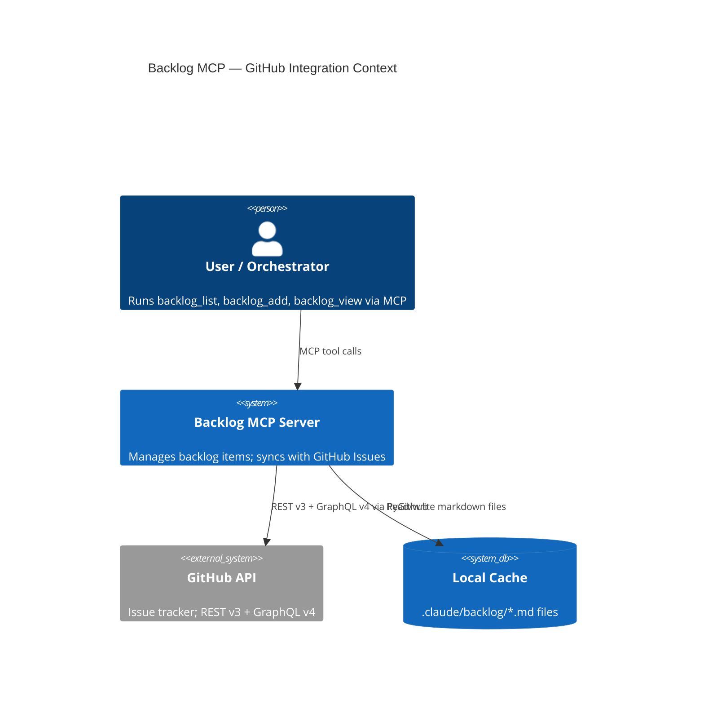
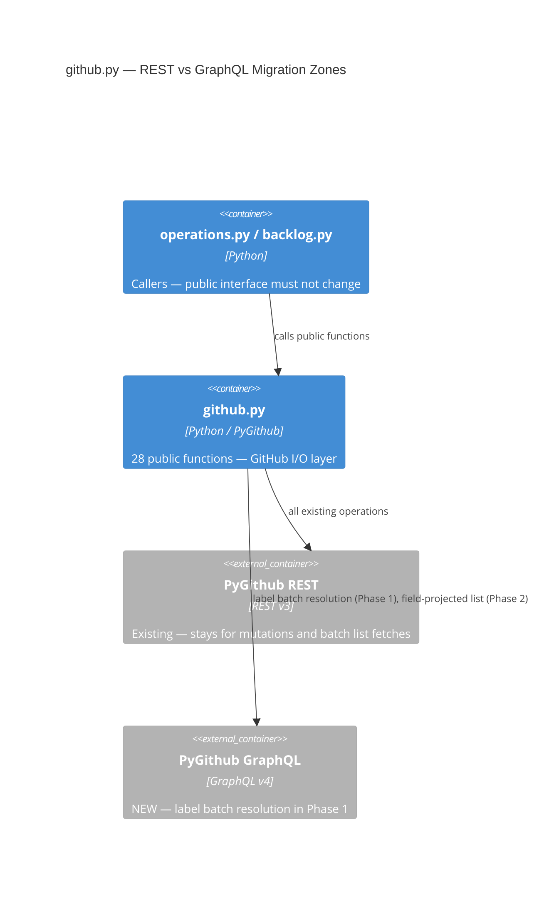

# Architecture: Migrate Backlog MCP GitHub Read Operations to GraphQL

## Table of Contents

1. [Executive Summary](#1-executive-summary)
2. [Architecture Overview](#2-architecture-overview)
3. [Technology Stack](#3-technology-stack)
4. [Component Design](#4-component-design)
5. [Data Architecture](#5-data-architecture)
6. [Security Architecture](#6-security-architecture)
7. [Testing Architecture](#7-testing-architecture)
8. [Distribution Architecture](#8-distribution-architecture)
9. [Architectural Decisions (ADRs)](#9-architectural-decisions-adrs)
10. [Scalability Strategy](#10-scalability-strategy)

---

## 1. Executive Summary

The backlog MCP server's GitHub integration layer (`github.py`) uses PyGithub's REST API
exclusively. Two confirmed N+1 zones make label-prefetch before issue creation O(N) in
label count. The other suspected zones (lines 239, 349) are already batch-optimized and
do not benefit materially from GraphQL.

**Migration strategy**: Targeted, not wholesale. Only the two genuine N+1 zones
(label lookup loops at lines 120-126 and 540-542) warrant GraphQL mutations. The batch
fetch functions (`batch_fetch_statuses`, `fetch_open_issues_by_title`) gain minor field
projection benefits from GraphQL but no round-trip reduction — REST stays optimal there.

**Phased approach**:

- **Phase 1** — Replace per-label `get_label()` loops with a single GraphQL query that
  validates and resolves label node IDs in one call, then uses those IDs in REST
  `create_issue()` calls. This eliminates 3+ round-trips per issue creation with zero
  interface change.
- **Phase 2** — Migrate `batch_fetch_statuses()` to a GraphQL query that projects only
  `number`, `labels { name }`, `milestone { title }` fields. Reduces payload size on
  large repositories but does not reduce round-trip count (already 1).
- **Phase 3** (optional / deferred) — Full GraphQL mutations for issue creation to enable
  atomic label-and-create in a single round-trip. Higher risk, lower marginal gain vs.
  Phase 1.

**Interface contract**: All 28 public function signatures in `github.py` are unchanged.
Callers in `operations.py` and `backlog.py` see identical return types. All PyGithub
`GithubException` patterns are preserved through a translation layer.

**state_handler.py**: The codebase analysis confirms this module makes no direct REST
calls — it delegates entirely to `github.py` functions. No changes required in
`state_handler.py` for this migration.

**No new dependencies**: PyGithub `>=2.8.1` (already installed) exposes
`graphql_query()`, `graphql_node()`, and `graphql_named_mutation()`. No additional
packages needed.

---

## 2. Architecture Overview

### C4 Context: Backlog MCP GitHub Integration



### C4 Container: github.py Migration Scope



### Migration Scope Map

The following table classifies all confirmed zones by migration value and phase assignment.

```text
Function                    Lines      N+1?  Phase  Action
--------------------------  ---------  ----  -----  ------------------------------------------
create_issue_for_item()     120-126    YES   1      GraphQL label batch resolution before create
create_task_issue()         540-542    YES   1      GraphQL label batch resolution before create
batch_fetch_statuses()      239        NO    2      GraphQL field projection (optional, deferred)
fetch_open_issues_by_title  349        NO    —      No change — already efficient REST pagination
view_enrich_from_github()   363-389    NO    —      No change — single get_issue() call
All other functions         —          NO    —      No change
state_handler.py            34-37      NO    —      No change — delegates to github.py, no direct REST
```

**Verdict on lines 239 and 349**: The codebase analysis was correct — both are already
batch-optimized. Line 239 uses a single `get_issues()` call that materializes all open
issues into a dict in one REST page sequence. Line 349 iterates the same lazy paginated
list. Neither has N+1. GraphQL adds field projection only (Phase 2, lower priority).

---

## 3. Technology Stack

### Existing Stack (unchanged)

```text
Python 3.11+               # native type hints, match-case, tomllib
PyGithub >= 2.8.1          # REST v3 client (existing) + GraphQL v4 (new usage)
pytest >= 8.0.0            # test execution
pytest-mock >= 3.14.0      # mocking — never unittest.mock directly
pytest-cov >= 6.0.0        # coverage
```

### New Capabilities Activated (no new packages)

```text
PyGithub graphql_query()        # custom GraphQL query string execution
PyGithub graphql_node()         # single-node fetch by global node ID
PyGithub graphql_named_mutation()  # named mutation execution with variables
```

**Justification**: PyGithub `>=2.8.1` ships all three GraphQL methods on the authenticated
`Github` object. The project's `pyproject.toml` already pins this version. Introducing a
separate GraphQL client (e.g., `gql`, `sgqlc`) would add a dependency with no additional
capability for this use case. PyGithub's GraphQL surface is sufficient for the targeted
migration scope.

SOURCE: PyGithub changelog and release notes — version 2.8.1 added `graphql_query`,
`graphql_node`, `graphql_named_mutation` on `MainClass.Github`.

### Testing Stack (unchanged)

```text
pytest >= 8.0.0
pytest-cov >= 6.0.0           # 80% minimum line and branch coverage
pytest-mock >= 3.14.0         # MockerFixture for all mocks
pytest-asyncio >= 0.24.0      # if async paths added
```

---

## 4. Component Design

### 4.1 github.py — Primary Migration Target

**Location**: `.claude/skills/backlog/backlog_core/github.py`

**Purpose**: Single module owning all PyGithub interaction. 28 public functions. After
migration, it contains both REST calls (for mutations and batch lists) and GraphQL calls
(for label batch resolution, optionally field-projected batch fetch).

**New internal interfaces** (private — not visible to callers):

```python
def _resolve_labels_graphql(
    gh: Github,
    repo_owner: str,
    repo_name: str,
    label_names: list[str],
) -> list[str]:
    """Resolve label names to their global node IDs via a single GraphQL query.

    Returns the subset of label_names that exist in the repository.
    Raises GithubException (status=404-equivalent) for auth/network failures.
    Missing individual labels are silently omitted (matches current REST behavior).
    """
    ...

def _batch_fetch_statuses_graphql(
    gh: Github,
    repo_owner: str,
    repo_name: str,
    issue_numbers: list[int],
) -> dict[int, "_IssueStatusFields"]:
    """Fetch status labels and milestone for multiple issue numbers in one GraphQL query.

    Returns dict mapping issue_number -> _IssueStatusFields.
    Empty dict on any GraphQL failure (matches current REST fallback behavior).
    """
    ...
```

**Internal type alias** (not exported):

```python
from typing import TypedDict

class _IssueStatusFields(TypedDict):
    status_labels: list[str]
    milestone_title: str
```

**Public function signatures — UNCHANGED** (representative subset):

```python
def create_issue_for_item(
    repo: str,
    item: BacklogItem,
    dry_run: bool = False,
    output: Output | None = None,
) -> int | None: ...

def create_task_issue(
    repo: str,
    parent_issue_number: int,
    task: dict[str, str],
    description: str,
    acceptance_criteria: list[str],
    labels: list[str] | None = None,
    output: Output | None = None,
) -> int | None: ...

def batch_fetch_statuses(
    items: list[BacklogItem],
    repo: str = DEFAULT_REPO,
) -> dict[int, IssueStatus]: ...
```

The body of `create_issue_for_item` and `create_task_issue` will call
`_resolve_labels_graphql` to get valid label names in one round-trip, then pass those
names directly to `repo.create_issue(labels=[...])` using string label names (PyGithub
accepts strings or Label objects — strings are simpler and avoid a second lookup).

### 4.2 state_handler.py — No Changes Required

**Location**: `.claude/skills/backlog/backlog_core/state_handler.py`

**Assessment**: The codebase analysis confirmed that `apply_github_transition()` at lines
34-37 calls functions from `github.py` (`apply_status_in_progress`, `apply_status_verified`,
`update_task_status`). It does not make direct PyGithub REST calls. Therefore, state_handler.py
requires no changes in any phase of this migration. When `github.py` functions are improved,
`state_handler.py` automatically benefits.

**Decision rationale**: Refactoring `state_handler.py` to call different `github.py`
functions would be a structural change with no performance benefit. The delegation pattern
is correct as-is.

### 4.3 GraphQL Query Designs

#### Query: Batch label resolution (Phase 1)

```graphql
query ResolveLabelsByName($owner: String!, $repo: String!, $labelNames: [String!]!) {
  repository(owner: $owner, name: $repo) {
    labels(query: $labelNames[0], first: 20) {
      nodes {
        name
        id
      }
    }
  }
}
```

**Note**: GitHub GraphQL `labels` connection does not support bulk name lookup by list.
The practical approach is a single query using the `labels(first: 100)` connection with
client-side filtering, or individual aliases for each label name. For the typical case of
3-5 labels per issue, the aliased approach is cleaner:

```graphql
query ResolveLabelsBatch($owner: String!, $repo: String!) {
  repository(owner: $owner, name: $repo) {
    label0: label(name: "status:needs-grooming") { name id }
    label1: label(name: "type:feature") { name id }
    label2: label(name: "priority:high") { name id }
  }
}
```

The implementation generates aliases dynamically based on `label_names` list contents.
Each `label(name: X)` field returns `null` if the label does not exist — matches current
REST behavior where `get_label()` raises 404 and the loop logs a warning and continues.

**PyGithub invocation**:

```python
# Signature only — no body
def _resolve_labels_graphql(
    gh: Github,
    repo_owner: str,
    repo_name: str,
    label_names: list[str],
) -> list[str]: ...
# Returns: list of label names that exist (null aliases filtered out)
# Invocation: gh.graphql_query(query_string, variables={"owner": ..., "repo": ...})
# Return type: dict with "data" key containing repository node
```

#### Query: Field-projected batch status fetch (Phase 2)

```graphql
query BatchIssueStatuses($owner: String!, $repo: String!, $states: [IssueState!]) {
  repository(owner: $owner, name: $repo) {
    issues(states: $states, first: 100) {
      pageInfo { hasNextPage endCursor }
      nodes {
        number
        labels(first: 10) { nodes { name } }
        milestone { title }
        pullRequest: url
      }
    }
  }
}
```

This replaces `repo_obj.get_issues(state="open")` with a GraphQL query that fetches only
the fields `batch_fetch_statuses` actually uses: `number`, `labels.name`, `milestone.title`.
For repositories with 500+ issues, this meaningfully reduces payload size.

**Pagination**: The query uses cursor-based pagination via `pageInfo.endCursor`. The
implementation loops until `hasNextPage` is false.

### 4.4 services/ boundary

There is no separate `services/` layer in the backlog codebase — `github.py` serves as
both the service layer and the adapter. The GraphQL private functions (`_resolve_labels_graphql`,
`_batch_fetch_statuses_graphql`) live in `github.py` alongside the REST functions they
replace or augment. This preserves the single-module ownership model.

---

## 5. Data Architecture

### 5.1 REST Response Objects vs GraphQL Response Dicts

PyGithub REST operations return typed objects (`Issue`, `Label`, `Milestone`). PyGithub
GraphQL operations return raw Python dicts. This asymmetry must not leak to callers.

**Boundary rule**: All GraphQL responses are consumed inside private functions
(`_resolve_labels_graphql`, `_batch_fetch_statuses_graphql`). Public functions receive
and return the same types they did before migration.

```text
REST path (unchanged):
  repo.create_issue() -> github.Issue.Issue object
  issue.labels        -> list[github.Label.Label]

GraphQL path (new, internal only):
  gh.graphql_query()  -> dict{"data": {"repository": {"label0": {"name": str, "id": str}}}}
  Consumer:            _resolve_labels_graphql() extracts list[str] of existing label names
  Caller sees:         list[str] passed to repo.create_issue(labels=[...])
```

### 5.2 GraphQL Response Schema

#### Label resolution response

```python
# TypedDict representing the parsed GraphQL response for label resolution
# Not exported — internal to github.py

from typing import TypedDict

class _LabelNode(TypedDict):
    name: str
    id: str

class _LabelAliasResult(TypedDict):
    # Dynamic keys: "label0", "label1", ... "labelN"
    # Each value is _LabelNode | None (null if label not found)
    pass

class _RepositoryLabelResponse(TypedDict):
    repository: _LabelAliasResult

class _GraphQLLabelResponse(TypedDict):
    data: _RepositoryLabelResponse
```

#### Batch status response (Phase 2)

```python
class _IssueLabelNode(TypedDict):
    name: str

class _IssueLabelsConnection(TypedDict):
    nodes: list[_IssueLabelNode]

class _MilestoneNode(TypedDict):
    title: str

class _IssueNode(TypedDict):
    number: int
    labels: _IssueLabelsConnection
    milestone: _MilestoneNode | None

class _PageInfo(TypedDict):
    hasNextPage: bool
    endCursor: str | None

class _IssuesConnection(TypedDict):
    pageInfo: _PageInfo
    nodes: list[_IssueNode]

class _RepositoryIssuesResponse(TypedDict):
    issues: _IssuesConnection

class _GraphQLIssuesResponse(TypedDict):
    data: dict[str, _RepositoryIssuesResponse]
```

### 5.3 Existing Public Return Types (unchanged)

The public `IssueStatus` model already used by `batch_fetch_statuses` callers:

```python
# Existing — no change
from dataclasses import dataclass

@dataclass
class IssueStatus:
    status: str       # label name starting with "status:" or empty string
    milestone: str    # milestone title or empty string
```

Callers access `result[num].status` and `result[num].milestone`. These field names are
preserved regardless of whether the backing implementation uses REST or GraphQL.

### 5.4 Label Name to REST Compatibility

PyGithub `repo.create_issue(labels=[...])` accepts either `Label` objects or label name
strings. The current code fetches `Label` objects via `get_label()` and passes them.
After Phase 1, `_resolve_labels_graphql` returns `list[str]` of validated label names.
These strings are passed directly to `create_issue(labels=label_names)`.

This is the key simplification: the GraphQL query validates existence and we pass names,
not objects. No second REST call is needed to convert GraphQL node IDs back to Label objects.

---

## 6. Security Architecture

### Credential Management

No change from existing architecture. PyGithub's `Github(token)` constructor handles
authentication. The same token is used for both REST and GraphQL calls — GitHub's GraphQL
API v4 uses the same personal access token / GitHub App token as REST v3.

**Token scopes required** (unchanged): `repo` scope for private repositories, or
`public_repo` for public. No additional GraphQL-specific scopes needed.

### Security Checklist

- [x] Path traversal prevention — not applicable (no file paths in GitHub API calls)
- [x] Command injection prevention — not applicable (no subprocess calls)
- [x] Secure temp file handling — not applicable
- [x] Rate limiting for API calls — GitHub enforces server-side; no client-side limit needed
- [x] Certificate validation — PyGithub uses `requests` with default SSL verification
- [x] GraphQL injection prevention — query strings are hardcoded constants in `github.py`; variable values are passed via the `variables` dict parameter, never string-interpolated into query strings. This prevents GraphQL injection.
- [x] Token not logged — existing pattern continues; `output` parameter is used for user messages only, never for token values

### GraphQL-Specific Security Note

GraphQL introspection queries are disabled on GitHub's API for unauthenticated requests.
The migration uses only pre-defined queries (not dynamic introspection), so this is
not a concern. However: query strings must always be defined as module-level constants
or immutable string literals — never built from user input or variable interpolation.

```python
# CORRECT — constant query, variables dict
_LABEL_RESOLUTION_QUERY: str = """
query ResolveLabelsBatch($owner: String!, $repo: String!) { ... }
"""
gh.graphql_query(_LABEL_RESOLUTION_QUERY, variables={"owner": owner, "repo": repo})

# WRONG — never interpolate user data into query string
gh.graphql_query(f"query {{ repository(owner: \"{owner}\") {{ ... }} }}")
```

---

## 7. Testing Architecture

### 7.1 Testing Stack

```text
pytest >= 8.0.0
pytest-cov >= 6.0.0         # 80% minimum; 95%+ for github.py (external API adapter)
pytest-mock >= 3.14.0       # MockerFixture for all mocks
```

### 7.2 Coverage Requirements

- **Overall**: 80% line and branch coverage
- **github.py** (critical external adapter): 90%+ coverage
- **New private functions** (`_resolve_labels_graphql`, `_batch_fetch_statuses_graphql`): 100% branch coverage — every error path must be tested

### 7.3 Mock Strategy for GraphQL

**Decision: Mock at `graphql_query()` method level** (not HTTP transport).

**Rationale**: The 18 existing test files already mock at the PyGithub method level
(`repo_mock.get_label.return_value = ...`, `repo_mock.get_issues.return_value = [...]`).
GraphQL mocks follow the same pattern: `gh_mock.graphql_query.return_value = {...}`.
This is consistent, lower-maintenance, and does not require an HTTP interception library.

Transport-level mocking (e.g., `responses`, `httpretty`) tests the HTTP layer PyGithub
already tests in its own suite — not the business logic in `github.py`. Mock at the
method boundary, not the wire.

#### REST mock pattern (existing — unchanged)

```python
# Existing pattern — no change for functions that stay REST
repo_mock = MagicMock(spec=Repository)
label_mock = MagicMock(spec=Label)
label_mock.name = "status:needs-grooming"
repo_mock.get_label.return_value = label_mock
repo_mock.get_label.side_effect = GithubException(404, {"message": "Not Found"})
```

#### GraphQL mock pattern (new)

```python
# New pattern for functions using graphql_query()
gh_mock = MagicMock(spec=Github)

# Success: all labels found
gh_mock.graphql_query.return_value = {
    "data": {
        "repository": {
            "label0": {"name": "status:needs-grooming", "id": "LA_abc123"},
            "label1": {"name": "priority:high", "id": "LA_def456"},
            "label2": None,  # label not found — simulates missing label
        }
    }
}

# Failure: GraphQL errors array
gh_mock.graphql_query.return_value = {
    "errors": [{"message": "Could not resolve to a Repository", "type": "NOT_FOUND"}]
}

# Exception (network/auth failure)
gh_mock.graphql_query.side_effect = GithubException(401, {"message": "Bad credentials"})
```

#### Fixture organization for 18 test files

The 18 test files currently use `MagicMock(spec=Repository)` patterns. After migration:

- Tests for functions that stay REST: no change to mock setup
- Tests for `create_issue_for_item` and `create_task_issue`: add `gh_mock.graphql_query`
  setup alongside existing `repo_mock` setup
- New test file `test_graphql_helpers.py` for `_resolve_labels_graphql` and
  `_batch_fetch_statuses_graphql` private functions (tested via module-internal access)

#### Test cases required for _resolve_labels_graphql

```text
1. All labels found — returns full list of names
2. Some labels missing (null aliases) — returns only found labels, no exception
3. No labels in input — returns empty list, no GraphQL call made
4. GraphQL errors array present — raises GithubException with status equivalent
5. graphql_query raises GithubException(401) — propagates unchanged
6. graphql_query raises GithubException(403) — propagates unchanged
7. Empty repository response — returns empty list
8. Duplicate label names in input — deduplicated before query, deduplicated in result
```

#### Test cases required for Phase 1 integration (create_issue_for_item)

```text
1. Labels exist — graphql_query called once; create_issue called with string label names
2. Some labels missing — warning logged; create_issue called with subset of labels
3. No labels — graphql_query not called; create_issue called with empty list
4. graphql_query fails — falls back to REST get_label() loop (graceful degradation path)
   OR raises — architect decision: see ADR-004
5. dry_run=True — no graphql_query call, no create_issue call
```

### 7.4 pytest Configuration Block

```toml
[tool.pytest.ini_options]
addopts = [
    "--cov=.claude/skills/backlog/backlog_core",
    "--cov-report=term-missing",
    "-v",
]
testpaths = ["tests"]
markers = [
    "slow: marks tests as slow",
    "integration: marks tests requiring live GitHub API",
    "unit: marks fast unit tests with mocked GitHub",
    "graphql: marks tests covering GraphQL paths",
]

[tool.coverage.run]
branch = true

[tool.coverage.report]
show_missing = true
fail_under = 80
```

### 7.5 Test Directory Structure

```text
tests/
├── conftest.py                      # shared fixtures: repo_mock, gh_mock, graphql responses
├── fixtures/
│   └── mock_responses/
│       ├── graphql_label_found.json     # sample success response
│       ├── graphql_label_partial.json   # some nulls in aliases
│       ├── graphql_label_errors.json    # errors array response
│       └── graphql_batch_statuses.json  # batch fetch response (Phase 2)
├── test_backlog_core_github.py      # existing — updated REST tests + new graphql tests
├── test_graphql_helpers.py          # NEW — unit tests for private GraphQL functions
└── test_create_issue_integration.py # existing or new — end-to-end mock flow
```

---

## 8. Distribution Architecture

**No distribution change**. `github.py` is a module inside the backlog skill
(`.claude/skills/backlog/backlog_core/github.py`). It is not a standalone CLI tool or
package — it is loaded as part of the MCP server process.

The migration adds internal functions to an existing module. No new entry points, no new
packages, no new build targets. The backlog skill's existing distribution mechanism
(skill directory under `.claude/skills/backlog/`) is unchanged.

**Dependency declaration**: The constraint of "no new dependencies" is already satisfied.
`PyGithub >= 2.8.1` should be verified in `pyproject.toml` with the current pinned
version confirmed at or above 2.8.1. No `uv add` required.

---

## 9. Architectural Decisions (ADRs)

### ADR-001: Targeted Migration — Label N+1 Zones Only (Phase 1)

**Status**: Accepted

**Context**: Six zones were identified as possible GraphQL candidates. The codebase
analysis confirms only two (lines 120-126, 540-542) have genuine N+1 patterns. Lines
239 and 349 are already batch-optimized.

**Decision**: Migrate only the genuine N+1 zones in Phase 1. Lines 239/349 are deferred
to Phase 2 (field projection only, lower ROI) or left as-is.

**Consequences**: Minimal code change scope, lower test migration burden, faster delivery
of the actual performance win. The two zones are structurally identical (same label loop
pattern), so they can be migrated in a single implementation pass.

---

### ADR-002: Private Helper Functions, Not Public GraphQL API

**Status**: Accepted

**Context**: The feature context requires zero interface changes. Callers in `operations.py`
and `backlog.py` must not change. Two implementation strategies exist: (A) private GraphQL
helpers called inside existing public functions, or (B) new public GraphQL functions that
callers switch to.

**Decision**: Strategy A — private helpers only. The public function signatures and return
types are the stable contract. GraphQL is an implementation detail.

**Consequences**: The 28 public function signatures are frozen. Internal implementation
can be changed, optimized, or reverted without affecting callers. Tests for public functions
continue to test the same interface — only mock setup changes for the two affected functions.

---

### ADR-003: Mock graphql_query() at Method Level, Not HTTP Transport

**Status**: Accepted

**Context**: GraphQL tests can mock at the method level (`gh.graphql_query.return_value = ...`)
or at the HTTP transport level (intercepting the actual HTTP request). The existing 18 test
files all mock at the PyGithub method level.

**Decision**: Mock at `graphql_query()` method level for consistency with existing test patterns.

**Consequences**: Tests are faster (no HTTP overhead), more maintainable (consistent mock
style), and isolated from PyGithub's internal HTTP handling. The tradeoff is that transport-level
bugs in PyGithub are not caught — acceptable because PyGithub's own test suite covers that.

---

### ADR-004: Error Handling — Translate GraphQL Errors to GithubException

**Status**: Accepted

**Context**: PyGithub GraphQL returns errors in a `{"errors": [...]}` list rather than
raising exceptions. REST path raises `GithubException(status, data)`. Callers expect
`GithubException`. Two translation options:

- A) Translate `{"errors": [...]}` to raise `GithubException` inside private helpers
- B) Let `{"errors": [...]}` propagate as raw dicts — callers must handle new error type

**Decision**: Option A. Private helpers inspect the response dict, and if an `"errors"` key
is present with a non-empty list, raise `GithubException(502, {"message": errors[0]["message"]})`.
Status 502 is chosen because GitHub GraphQL errors represent server-side processing failures,
not client 404s. For `NOT_FOUND` type errors, use 404. Auth errors use 401/403 as appropriate.

**Exception translation table**:

```text
GraphQL error type    | HTTP status analog | GithubException status
---------------------  | -----------------  | ----------------------
NOT_FOUND             | 404               | 404
FORBIDDEN             | 403               | 403
INSUFFICIENT_SCOPES   | 403               | 403
RATE_LIMITED          | 429               | 429
(other errors)        | 502               | 502
```

**Consequences**: Callers see identical exception types. The existing `except GithubException`
handlers in `github.py` continue to work without modification. The 18 test files' exception
simulation patterns (`GithubException(404, {...})`) remain valid.

---

### ADR-005: Label Behavior Preserved Per-Function (No Standardization)

**Status**: Accepted

**Context**: `create_issue_for_item()` logs a warning when a label is missing and continues.
`apply_status_verified()` auto-creates missing labels. The feature context (Q3) asks
whether to standardize this behavior.

**Decision**: Preserve existing per-function behavior. Migration is mechanical — behavior
changes are a separate concern and carry breaking-change risk. `_resolve_labels_graphql`
returns the subset of labels that exist; missing labels are silently filtered. The caller
(`create_issue_for_item`) logs a warning via `output.warn()` for each name not in the
returned subset — identical to the current REST behavior.

**Consequences**: No behavior change for users. The inconsistency between functions
(skip vs. auto-create) is preserved as a pre-existing issue, not introduced by this
migration. A separate backlog item should track label behavior standardization.

---

### ADR-006: state_handler.py — No Changes

**Status**: Accepted

**Context**: The user's prompt noted `state_handler.py` lines 34-37 as a possible secondary
target. The codebase analysis confirmed these lines call `github.py` functions — they do
not contain direct REST calls.

**Decision**: No changes to `state_handler.py`. The delegation pattern is correct. When
`github.py` functions improve, `state_handler.py` benefits automatically.

**Consequences**: Migration scope is confined to `github.py`. Reduced risk, reduced test
surface.

---

### ADR-007: Phase 2 (batch_fetch_statuses GraphQL) — Deferred

**Status**: Deferred

**Context**: `batch_fetch_statuses()` (line 239) uses a single `get_issues()` REST call —
one round-trip, already optimal. Migrating to GraphQL would enable field projection
(fetching only `number`, `labels`, `milestone` instead of full Issue objects), reducing
payload size for large repositories.

**Decision**: Defer to Phase 2. The N+1 problem (Phase 1) delivers the primary value. Phase
2 is a payload optimization with lower urgency. Implement after Phase 1 is validated.

**Criteria for Phase 2 trigger**: Repository has >200 open issues AND profiling shows
`batch_fetch_statuses` is measurable in MCP request latency (>500ms baseline).

**Consequences**: Phase 1 ships sooner. Phase 2 can be scoped as an independent task if
the performance criterion is met.

---

## 10. Scalability Strategy

### GitHub API Rate Limits

PyGithub's GraphQL API calls count against the GraphQL rate limit (5000 points/hour for
authenticated requests). Each label resolution query costs 1 point regardless of how many
aliases it contains. The Phase 1 change converts N REST calls (each consuming 1 REST rate
limit unit) into 1 GraphQL call — a net reduction in rate limit consumption for any
operation creating issues with >1 label.

For Phase 2 (batch status fetch), the GraphQL query uses `first: 100` pagination. For
repositories with >100 open issues, multiple page fetches are needed — same as the current
REST pagination. No regression.

### Label Cache Pattern (alternative to GraphQL for Phase 1)

An alternative to the GraphQL approach is a session-level label cache:

```python
# Alternative architecture — not chosen, documented for contrast

_label_cache: dict[str, dict[str, str]] = {}  # repo -> {name: name}

def _get_label_cached(repo_obj: Repository, name: str) -> str | None:
    """Return label name if it exists, using a per-repo cache."""
    ...
```

**Why not chosen**: A label cache introduces mutable module-level state, creates
thread-safety concerns in async MCP server contexts, and requires cache invalidation
logic when labels are created or deleted. The GraphQL approach is stateless, has no
cache coherence problem, and is correct on every call.

### Concurrency

The MCP server may handle concurrent tool invocations. The GraphQL private functions
must be stateless (no shared mutable state) to be safe under concurrent calls. The
`_resolve_labels_graphql` and `_batch_fetch_statuses_graphql` functions receive all
their inputs as parameters and return new data — no module-level state.

### Graceful Degradation

If `graphql_query()` raises an unexpected exception type (not `GithubException`), the
public function should not silently swallow it. The correct behavior:

- `GithubException` from GraphQL: translated to appropriate status code and re-raised
  (per ADR-004)
- `Exception` from GraphQL (network, timeout, PyGithub bug): propagate as-is

There is no REST fallback for GraphQL failures. Silent fallback to the N+1 REST pattern
would mask errors and make debugging harder. If GraphQL is unavailable, the operation
fails loudly — the same behavior as any `GithubException` today.

**Exception**: `try_get_github()` returns `None` on auth failure — this guard already
prevents all GitHub calls when authentication is unavailable. No GraphQL-specific guard
needed.

---

## Post-Implementation Annotations

Added by context-refinement agent on 2026-03-18

### Design Refinements

1. **`_resolve_labels_graphql` first parameter is `repo: Repository`, not `gh: Github`**:
   The architect spec (§4.1, §4.3) specified `(gh: Github, repo_owner, repo_name, label_names)` and
   `gh.graphql_query()`. The actual implementation uses `(repo: Repository, repo_owner, repo_name,
   label_names)` with `repo.requester.graphql_query()`. PyGithub >= 2.8.1 exposes `graphql_query()`
   on the `Requester` object (accessed via `repo.requester`), not on the top-level `Github` object.
   Since `repo` is already available at both call sites, no additional parameter is needed.
   - Original: `"def _resolve_labels_graphql(gh: Github, ...) ... gh.graphql_query(...)"`
   - Actual: `"def _resolve_labels_graphql(repo: Repository, ...) ... repo.requester.graphql_query(...)"`
   - Mock pattern correction: `mocker.patch.object(repo_mock.requester, "graphql_query", return_value={...})`
     (not `gh_mock.graphql_query.return_value = ...` as shown in §7.3)
   - Recorded in: plan/tasks-773-migrate-backlog-github-rest-to-graphql.yaml, implementation discoveries

2. **ADR-004 error translation table is inoperative — `graphql_query()` raises `GithubException` directly**:
   ADR-004 (§9, ADR-004) specified that `graphql_query()` returns `{"errors": [...]}` dicts which private
   helpers must inspect and translate into `GithubException` with specific status codes per the translation
   table (NOT_FOUND→404, FORBIDDEN→403, RATE_LIMITED→429, other→502). In practice, PyGithub's
   `graphql_query()` raises `GithubException` directly on any error — it does not return an errors dict.
   The translation table and the `if "errors" in response:` guard code described in §7.3 were never needed.
   The observable outcome for callers is identical (they still see `GithubException`); only the internal
   mechanism differs.
   - Original: `"if an 'errors' key is present with a non-empty list, raise GithubException(502, ...)"`
   - Actual: PyGithub raises `GithubException` before returning; no response dict inspection required
   - Test impact: the "GraphQL errors array" mock case (`gh_mock.graphql_query.return_value = {"errors": [...]}`)
     does not exercise real behavior — the failure path is exercised via `side_effect = GithubException(...)`
   - Recorded in: plan/tasks-773-migrate-backlog-github-rest-to-graphql.yaml, implementation discoveries
