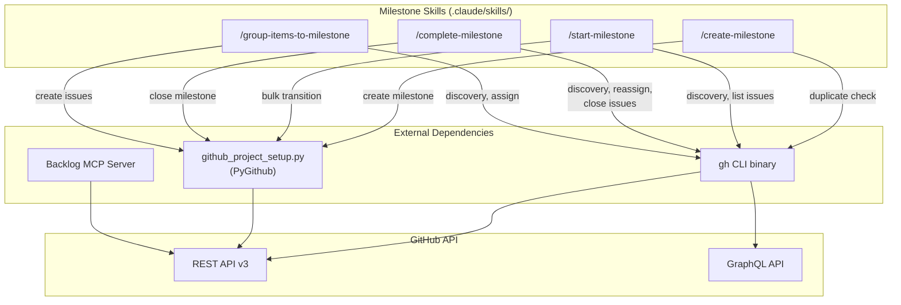
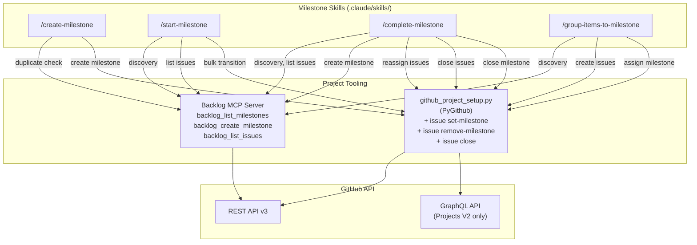
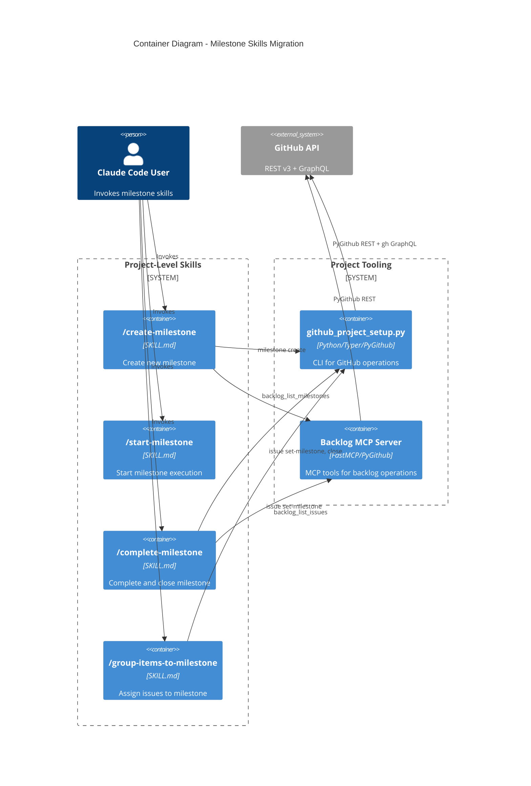

# Architecture Spec: Migrate Milestone Skills from gh CLI to Project Tooling

**Backlog item**: #923
**Date**: 2026-03-21
**Status**: Design

---

## 1. Executive Summary

Four project-level milestone skills (`/create-milestone`, `/start-milestone`, `/complete-milestone`, `/group-items-to-milestone`) depend on the `gh` CLI for GitHub API operations including milestone discovery, issue listing, issue milestone assignment, and issue closing. This architecture replaces all `gh` CLI usage with two existing alternatives: backlog MCP tools (for read operations) and PyGithub subcommands in `github_project_setup.py` (for write operations).

The migration requires:

- **Phase 1**: Add 3 new Typer subcommands to `github_project_setup.py` -- `issue set-milestone`, `issue remove-milestone`, `issue close`
- **Phase 2**: Rewrite 4 SKILL.md files to replace every `gh` CLI call with the corresponding MCP tool or PyGithub subcommand

Phase 1 must complete before Phase 2 because the SKILL.md rewrites reference the new subcommands. The `dh` plugin is already migrated (#968) and is out of scope. The `gh` skill itself is not modified -- this item only removes milestone skill dependencies on it.

## 2. Architecture Overview

### Current State (gh CLI dependency)



### Target State (gh CLI removed)



### Container Diagram



## 3. Technology Stack

This migration modifies an existing PEP 723 standalone script and 4 SKILL.md files. No new packages or tools are introduced.

### Existing Stack (unchanged)

- **CLI Framework**: Typer 0.21+ with `Annotated` syntax (already in `github_project_setup.py`)
- **GitHub Client**: PyGithub 2.1.1+ (already a dependency)
- **Package Manager**: uv for script execution via PEP 723 shebang
- **MCP Server**: Backlog MCP (`mcp__plugin_dh_backlog__*`) -- already deployed, PyGithub-based
- **Testing**: pytest 8+ with pytest-mock (project standard)
- **Linting**: ruff (project standard)
- **Type Checking**: ty (project standard)

### Justification for No New Dependencies

The 3 new subcommands use only `PyGithub` API calls already present in the script (`issue.edit()`, `issue.as_completed()`). No additional libraries are needed. The backlog MCP tools already expose the read operations that replace `gh api` discovery calls.

## 4. Component Design

### Phase 1: New PyGithub Subcommands

All 3 subcommands are added to the existing `issue_app` Typer group in `.claude/skills/gh/scripts/github_project_setup.py`.

#### 4.1 `issue set-milestone`

**Purpose**: Assign an issue to a milestone by number.

**Interface**:

```python
@issue_app.command("set-milestone")
def issue_set_milestone(
    issue: Annotated[int, typer.Option("--issue", "-i", help="Issue number")],
    milestone: Annotated[int, typer.Option("--milestone", "-m", help="Milestone number")],
    repo: Annotated[str, typer.Option("--repo", "-R")] = DEFAULT_REPO,
) -> None: ...
```

**Behavior**:
1. Fetch issue via `repository.get_issue(issue)`
2. Fetch milestone via `repository.get_milestone(milestone)`
3. Call `issue.edit(milestone=milestone_obj)`
4. Print confirmation: `Issue #{N} assigned to milestone #{M} "{title}"`

**Error cases**:
- Issue not found -> exit 1 with message
- Milestone not found -> exit 1 with message
- API error on edit -> exit 1 with error detail

#### 4.2 `issue remove-milestone`

**Purpose**: Remove milestone assignment from an issue.

**Interface**:

```python
@issue_app.command("remove-milestone")
def issue_remove_milestone(
    issue: Annotated[int, typer.Option("--issue", "-i", help="Issue number")],
    repo: Annotated[str, typer.Option("--repo", "-R")] = DEFAULT_REPO,
) -> None: ...
```

**Behavior**:
1. Fetch issue via `repository.get_issue(issue)`
2. Call `issue.edit(milestone=github.GithubObject.NotSet)` to clear the milestone (PyGithub uses `NotSet` sentinel, but for setting to null, pass the `InputGitTreeElement` pattern -- the implementation agent must verify the correct PyGithub API for clearing a milestone)
3. Print confirmation: `Issue #{N} milestone removed`

**Error cases**:
- Issue not found -> exit 1
- Issue has no milestone -> print warning, exit 0 (idempotent)

#### 4.3 `issue close`

**Purpose**: Close an issue with an optional comment.

**Interface**:

```python
@issue_app.command("close")
def issue_close(
    number: Annotated[int, typer.Option("--number", "-n", help="Issue number")],
    comment: Annotated[str, typer.Option("--comment", "-c", help="Comment to add before closing")] = "",
    repo: Annotated[str, typer.Option("--repo", "-R")] = DEFAULT_REPO,
) -> None: ...
```

**Behavior**:
1. Fetch issue via `repository.get_issue(number)`
2. If `comment` is non-empty, call `issue.create_comment(comment)`
3. Call `issue.edit(state="closed")`
4. Print confirmation: `Issue #{N} closed`

**Error cases**:
- Issue not found -> exit 1
- Issue already closed -> print warning, exit 0 (idempotent)
- Comment creation fails -> exit 1 (do not close issue if comment fails)

### Phase 2: SKILL.md Replacement Mapping

#### 4.4 gh CLI Command Replacement Table

Each row maps a specific `gh` CLI call in a skill to its replacement.

**`/create-milestone`** (`.claude/skills/create-milestone/SKILL.md`):

| Step | gh CLI Call | Replacement |
|------|-----------|-------------|
| Step 2: Duplicate check | `gh api repos/{owner}/{repo}/milestones --jq '.[] \| select(.state=="open") \| .title'` | `backlog_list_milestones(state="open")` -- returns JSON with title, number, state fields |
| Step 3: Create | Already PyGithub (`github_project_setup.py milestone create`) | No change |
| Error handling | `gh` not installed -> references `setup_gh.py` | Remove entire block |

**`/start-milestone`** (`.claude/skills/start-milestone/SKILL.md`):

| Step | gh CLI Call | Replacement |
|------|-----------|-------------|
| Step 1: Resolve milestone | `gh api repos/{owner}/{repo}/milestones/{N}` | `backlog_list_milestones(state="open")` + filter by number from result list |
| Step 2: List issues | `gh issue list --milestone "{title}" --state open` | `backlog_list_issues(milestone="{title}", state="open")` |
| Step 4: Ensure label | `gh label create "status:in-progress"` | Remove -- `github_project_setup.py milestone start` handles label creation via `_ensure_label()` |
| Step 5: Bulk transition | `gh issue edit` fallback | Remove fallback -- PyGithub script (`milestone start`) is the only path |
| Step 6: Project V2 | `gh project list --owner` | Remove -- `github_project_setup.py project update-status` handles project existence |
| Error handling | `gh` not installed -> references `setup_gh.py` | Remove entire block |

**`/complete-milestone`** (`.claude/skills/complete-milestone/SKILL.md`):

| Step | gh CLI Call | Replacement |
|------|-----------|-------------|
| Step 1: Resolve milestone | `gh api repos/{owner}/{repo}/milestones/{N}` | `backlog_list_milestones(state="open")` + filter by number |
| Step 1: List open issues | `gh issue list --milestone "{title}" --state open` | `backlog_list_issues(milestone="{title}", state="open")` |
| Step 1: List closed issues | `gh issue list --milestone "{title}" --state closed` | `backlog_list_issues(milestone="{title}", state="closed")` |
| Step 3A: Create new milestone | `gh api POST repos/{owner}/{repo}/milestones` | `backlog_create_milestone(title=, due_on=, description=)` |
| Step 3A/B: Reassign issues | `gh api PATCH repos/{owner}/{repo}/issues/{N}` with milestone body | `uv run .claude/skills/gh/scripts/github_project_setup.py issue set-milestone --issue N --milestone M` |
| Step 3C: Unassign milestone | `gh api PATCH repos/{owner}/{repo}/issues/{N}` with null milestone | `uv run .claude/skills/gh/scripts/github_project_setup.py issue remove-milestone --issue N` |
| Step 3D: Close issues | `gh issue close {N} --comment "..."` | `uv run .claude/skills/gh/scripts/github_project_setup.py issue close --number N --comment "..."` |
| Step 4: Close milestone | `gh` fallback for milestone close | Remove fallback -- PyGithub script (`milestone close`) is the only path |
| Step 5: Project V2 | References `projects-v2.md` | `uv run .claude/skills/gh/scripts/github_project_setup.py project update-status` |
| Error handling | `gh` not installed -> references `setup_gh.py` | Remove entire block |

**`/group-items-to-milestone`** (`.claude/skills/group-items-to-milestone/SKILL.md`):

| Step | gh CLI Call | Replacement |
|------|-----------|-------------|
| Step 1: Resolve milestone | `gh api repos/{owner}/{repo}/milestones/{N}` | `backlog_list_milestones(state="open")` + filter by number |
| Step 4: Create issues | Already PyGithub (`github_project_setup.py issue create`) | No change |
| Step 5: Assign milestone | `gh api PATCH repos/{owner}/{repo}/issues/{N}` with milestone body | `uv run .claude/skills/gh/scripts/github_project_setup.py issue set-milestone --issue N --milestone M` |
| Step 6: Project V2 | `gh project list --owner` | `uv run .claude/skills/gh/scripts/github_project_setup.py project update-status` |
| Error handling | `gh` not installed -> references `setup_gh.py` | Remove entire block |

#### 4.5 Milestone Discovery Pattern

All 4 skills resolve a milestone by number. The replacement pattern is:

```text
BEFORE (gh CLI):
  gh api repos/{owner}/{repo}/milestones/{N} --jq '.title, .state, .open_issues, .closed_issues'

AFTER (MCP):
  Call backlog_list_milestones(state="open")
  Filter returned list for entry where number == N
  If not found in open, call backlog_list_milestones(state="all") and filter
  Extract: title, state, open_issues, closed_issues from the matching entry
```

This avoids adding a `milestone get` subcommand. The MCP tool returns all milestones; client-side filtering is sufficient given the typical milestone count (under 20).

## 5. Data Architecture

No new data models are introduced. The existing types are sufficient.

### Existing Types Used

**PyGithub objects** (from `github` library):
- `Issue` -- `.number: int`, `.title: str`, `.state: str`, `.milestone: Milestone | None`, `.labels: list[Label]`
- `Milestone` -- `.number: int`, `.title: str`, `.state: str`, `.open_issues: int`, `.closed_issues: int`, `.due_on: datetime | None`
- `Label` -- `.name: str`, `.color: str`

**Backlog MCP response shapes** (JSON):

```text
backlog_list_milestones(state="open") -> {
    "milestones": [
        {"number": int, "title": str, "state": str, "open_issues": int, "closed_issues": int, "due_on": str | null}
    ]
}

backlog_list_issues(milestone=str, state=str) -> {
    "issues": [
        {"number": int, "title": str, "state": str, "labels": [str], "milestone": str | null}
    ]
}

backlog_create_milestone(title=str, due_on=str, description=str) -> {
    "number": int, "title": str, "html_url": str
}
```

### Configuration

No configuration files are added or modified. The script reads `GITHUB_TOKEN` from the environment and uses `DEFAULT_REPO = "Jamie-BitFlight/claude_skills"` as the default `--repo` value, consistent with all existing subcommands.

## 6. Security Architecture

No security changes. The migration preserves the existing security posture:

- **Authentication**: `GITHUB_TOKEN` from environment variable (unchanged)
- **No credential storage**: No config files contain secrets (unchanged)
- **Subprocess safety**: Projects V2 GraphQL calls use `subprocess.run([...], shell=False)` via `_gh_graphql()` (unchanged -- this function remains for Projects V2 which has no PyGithub equivalent)
- **Input validation**: Issue and milestone numbers are validated as `int` by Typer type coercion before reaching PyGithub

### Security Checklist

- [x] No new credential sources introduced
- [x] No `shell=True` subprocess calls
- [x] No path traversal vectors (only integer IDs passed to API)
- [x] Token not logged or printed in output
- [x] Existing `_gh_graphql` subprocess pattern preserved for Projects V2 only

## 7. Testing Architecture

### Scope

Tests cover only Phase 1 (the 3 new subcommands). Phase 2 (SKILL.md rewrites) is validated by the acceptance criteria grep checks, not by automated tests.

### Test File

`.claude/skills/gh/tests/test_github_project_setup.py` -- create if absent, extend if present.

### Test Stack

```text
pytest>=8.0.0
pytest-mock>=3.14.0
typer.testing.CliRunner
```

### Test Cases per Subcommand

**`issue set-milestone`**:
- Success: mock `get_issue()` and `get_milestone()`, verify `issue.edit(milestone=...)` called
- Issue not found: mock `get_issue()` to raise `GithubException`, assert exit code 1
- Milestone not found: mock `get_milestone()` to raise `GithubException`, assert exit code 1

**`issue remove-milestone`**:
- Success: mock `get_issue()` with a milestone set, verify milestone cleared
- Issue not found: assert exit code 1
- Issue has no milestone: assert exit code 0 (idempotent), warning printed

**`issue close`**:
- Success without comment: verify `issue.edit(state="closed")` called, no `create_comment`
- Success with comment: verify `issue.create_comment(comment)` called before `issue.edit(state="closed")`
- Issue not found: assert exit code 1
- Issue already closed: assert exit code 0, warning printed
- Comment creation fails: assert exit code 1, issue NOT closed

### Coverage Requirements

- 80% line and branch coverage on the new subcommands
- All error paths tested (not just happy path)

### pytest Configuration

Uses existing project `pyproject.toml` pytest configuration. No changes needed.

## 8. Distribution Architecture

**Strategy 1 -- PEP 723 Standalone Script** (existing pattern, unchanged).

`github_project_setup.py` is a single-file PEP 723 script with shebang:

```text
#!/usr/bin/env -S uv --quiet run --active --script
```

Dependencies declared inline:

```python
# /// script
# requires-python = ">=3.11"
# dependencies = [
#   "typer>=0.21.0",
#   "PyGithub>=2.1.1",
# ]
# ///
```

No new dependencies are added. The 3 new subcommands use only existing imports (`typer`, `github`).

Invocation from SKILL.md files:

```bash
uv run .claude/skills/gh/scripts/github_project_setup.py issue set-milestone --issue N --milestone M
uv run .claude/skills/gh/scripts/github_project_setup.py issue remove-milestone --issue N
uv run .claude/skills/gh/scripts/github_project_setup.py issue close --number N --comment "..."
```

## 9. Architectural Decisions (ADRs)

### ADR-001: MCP for reads, PyGithub script for writes

**Context**: Both the backlog MCP server and `github_project_setup.py` can perform GitHub API calls. Need to decide which tool handles which operations.

**Decision**: Use backlog MCP tools for read operations (list milestones, list issues, get milestone by filtering). Use PyGithub script subcommands for write operations (set milestone, remove milestone, close issue).

**Rationale**:
- MCP tools are already available in the Claude Code session without subprocess overhead
- MCP tools return structured JSON that skills can reference directly in instructions
- Write operations benefit from CLI invocation because SKILL.md files can express them as `uv run` commands with clear arguments, making the skill instructions auditable
- The existing `milestone start`, `milestone close` subcommands already follow this pattern (PyGithub for mutations)

**Alternatives rejected**:
- All-MCP: Would require adding `backlog_set_milestone`, `backlog_remove_milestone`, `backlog_close_issue` MCP tools. More code to write and maintain when the PyGithub script pattern already exists.
- All-PyGithub-script: Would require adding read subcommands that duplicate MCP. The MCP server already handles reads with proper JSON formatting.

### ADR-002: Client-side filter instead of `milestone get` subcommand

**Context**: All 4 skills resolve a milestone by number. Could add a `milestone get --number N` subcommand or filter from `backlog_list_milestones()` results.

**Decision**: Use `backlog_list_milestones()` + client-side filter in SKILL.md instructions. Do not add a `milestone get` subcommand.

**Rationale**:
- Typical repository has fewer than 20 milestones. Fetching all and filtering is negligible overhead.
- Avoids adding code that duplicates MCP capability.
- The MCP response already contains all needed fields (number, title, state, open_issues, closed_issues).
- SKILL.md instructions can express filtering naturally: "From the milestones list, find the one where number == N."

### ADR-003: Idempotent subcommands

**Context**: Skills may retry operations. Should subcommands fail or succeed silently when the target state is already achieved?

**Decision**: Subcommands are idempotent -- they succeed (exit 0) with a warning when the target state is already achieved.

**Rationale**:
- `issue close` on an already-closed issue prints a warning and exits 0
- `issue remove-milestone` on an issue with no milestone prints a warning and exits 0
- This matches the existing `_transition_issues` pattern which skips already-transitioned issues
- Skills do not need conditional logic to check pre-state before calling subcommands

## 10. Scalability Strategy

No scalability changes required. The migration is a 1:1 replacement of call mechanisms.

### Resource Management

- **API rate limiting**: PyGithub handles rate limiting internally with automatic retry. This is an improvement over raw `gh api` calls which had no built-in rate limiting.
- **Concurrency**: Not applicable -- skills execute sequentially within a Claude Code session.
- **Batch operations**: The existing `_bulk_update_project_status` and `_transition_issues` functions handle multi-issue operations. The new subcommands operate on single issues, called in a loop by the skill instructions.

### Future Considerations

- If milestone count exceeds 100 (GitHub API pagination boundary), `backlog_list_milestones()` may need pagination support. Current milestone count is well under this threshold.
- The `_gh_graphql` function remains for Projects V2 operations which have no PyGithub REST equivalent. A future migration to `gql` or `sgqlc` library could eliminate this last `gh` CLI dependency, but that is out of scope for this item.
