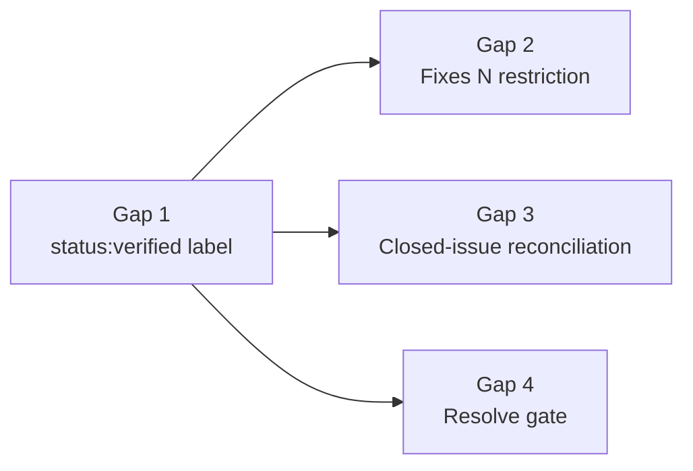
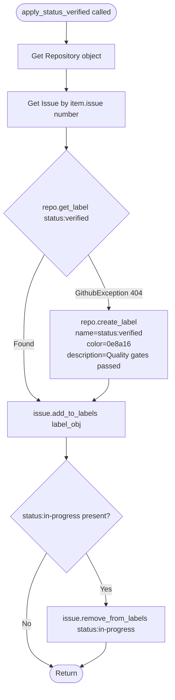
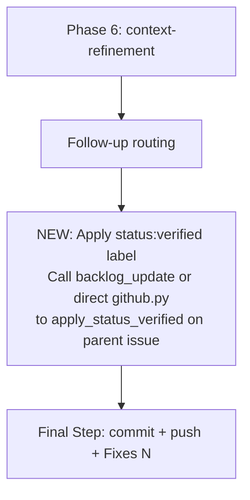
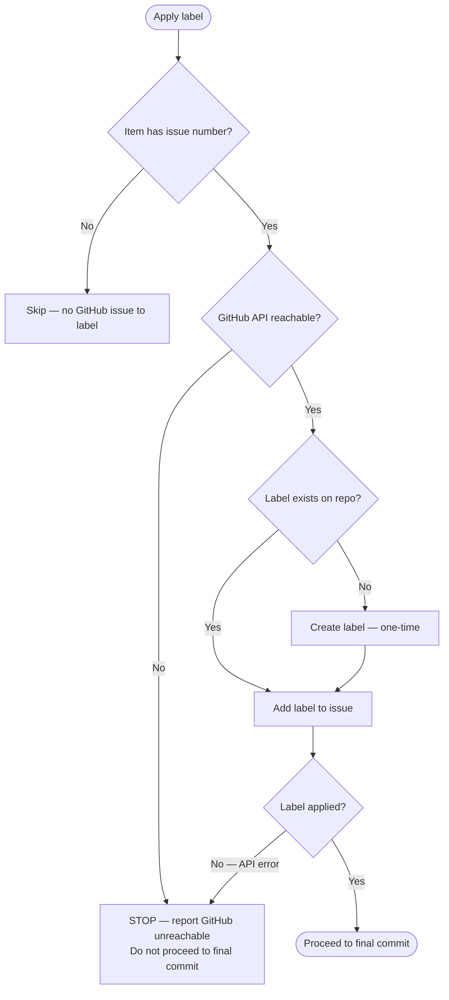
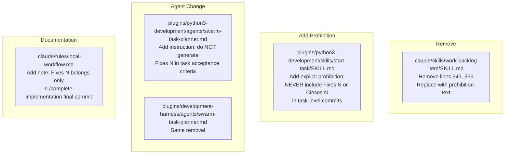
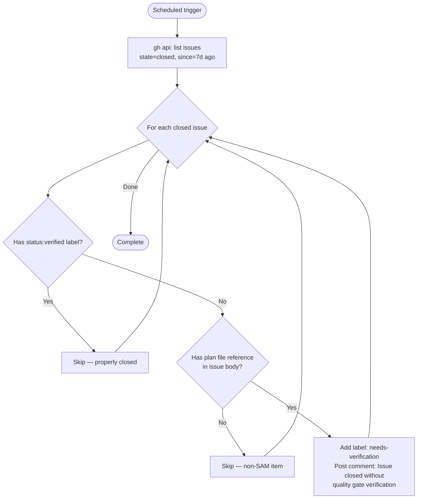
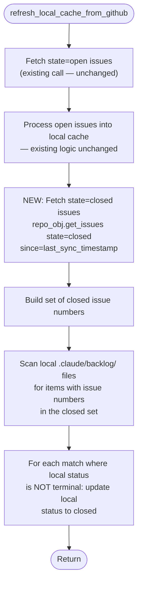
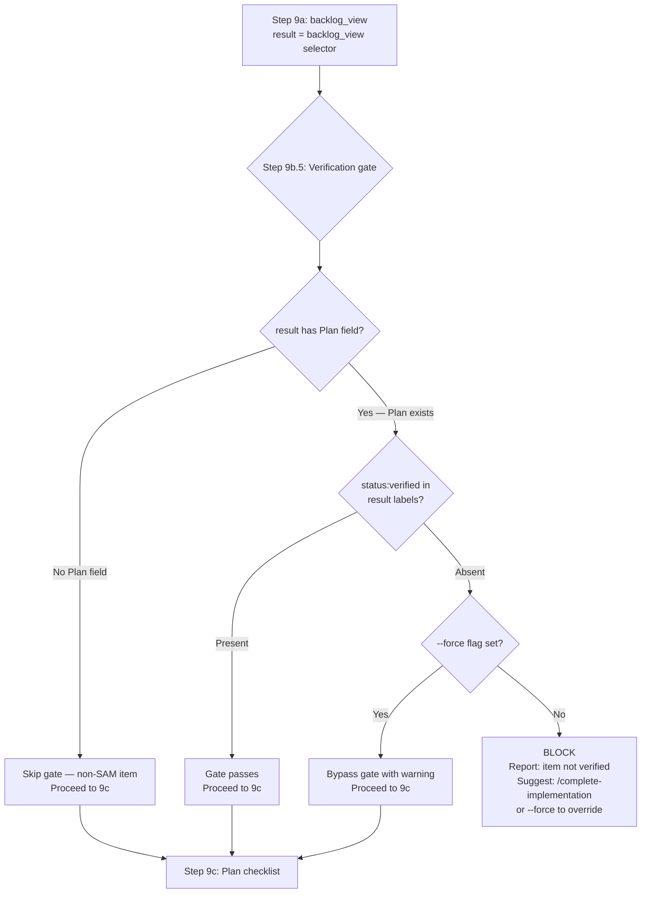
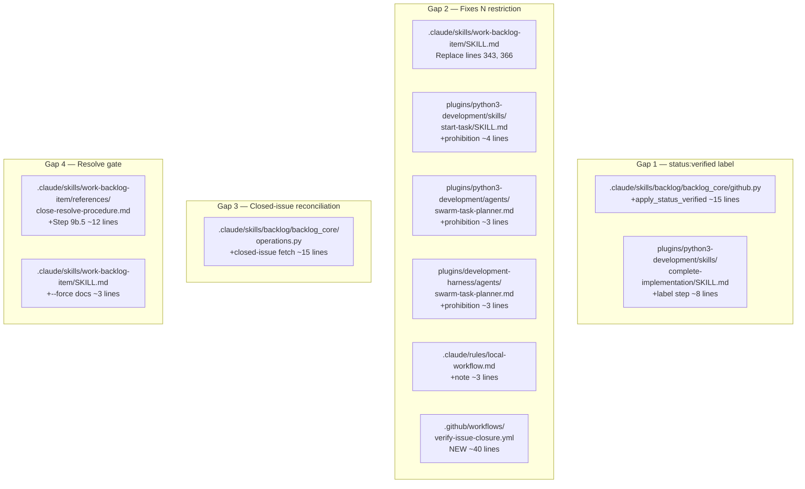

# Architecture: Pipeline Completion-to-Closure Enforcement

**Date**: 2026-03-17
**Backlog Item**: [#762](https://github.com/Jamie-BitFlight/claude_skills/issues/762)
**Feature Context**: [plan/feature-context-pipeline-completion-enforcement.md](./feature-context-pipeline-completion-enforcement.md)

---

## Implementation Order



Gap 1 must complete first. Gaps 2, 3, and 4 proceed in parallel after Gap 1.

---

## Gap 1: Durable Completion Evidence via `status:verified` Label

### Function: `apply_status_verified()`

**File**: `.claude/skills/backlog/backlog_core/github.py`

**Model**: `apply_status_in_progress()` (same file, ~line 277). That function adds `status:in-progress` and removes `status:needs-grooming`. The new function follows the same pattern.

```python
def apply_status_verified(
    item: BacklogItem,
    repo: str = DEFAULT_REPO,
    output: Output | None = None,
) -> None:
    """Set GitHub issue label to status:verified after quality gates pass."""
```

**Internal logic**:



**Label auto-creation**: Unlike `apply_status_in_progress()` which assumes labels pre-exist, `apply_status_verified()` must handle first-time deployment. On `GithubException` with status 404 from `repo.get_label("status:verified")`, the function calls `repo.create_label(name="status:verified", color="0e8a16", description="Quality gates passed via /complete-implementation")`. This is a one-time operation; subsequent calls find the label.

**Label removal**: Removes `status:in-progress` if present (same pattern as `apply_status_in_progress()` removing `status:needs-grooming`). The `status:verified` label coexists with other labels (priority, type).

### Integration Point: `/complete-implementation` SKILL.md

**File**: `plugins/python3-development/skills/complete-implementation/SKILL.md`

**Location**: After Phase 6 (context-refinement), before the Final Step (commit + push). New step inserted between the follow-up routing block and the final commit block.



**Skill instruction text** (inserted into SKILL.md):

> After all 6 quality gate phases pass and follow-up routing completes, apply the `status:verified` label to the parent backlog issue. Query the backlog for the feature issue number using `backlog_list(title="{slug}")`. If found, invoke the backlog infrastructure to apply the `status:verified` label. If no issue number is found, skip this step (no issue to label). This step must succeed before the final commit proceeds. If the label application fails, report the error and stop.

**Exposure path**: The `apply_status_verified()` function needs to be callable from the orchestrator. Two options:

1. **MCP tool**: Add a `backlog_apply_label` tool (general-purpose) or `backlog_mark_verified` (specific). The MCP server already has `backlog_update` which could be extended with a `verified=True` parameter.
2. **Direct call via `uv run`**: Add a CLI command `uv run backlog.py mark-verified {selector}` that calls `apply_status_verified()`.

**Recommended**: Extend `backlog_update` MCP tool with a `verified: bool = False` parameter. When `verified=True`, the tool calls `apply_status_verified(item)` in addition to any other updates. This avoids a new tool registration and keeps the MCP surface minimal.

### Error Handling



**Failure is blocking**: If the label cannot be applied, the final commit must not proceed. The label is the durable evidence that quality gates ran. A commit with `Fixes #N` that closes the issue without the label defeats the purpose. The orchestrator reports the error and stops.

---

## Gap 2: Restrict `Fixes #N` to `/complete-implementation` Only

### SKILL.md Changes

**Three files modified, one file added with prohibition**:



#### `/work-backlog-item` SKILL.md

**Lines 343 and 366** currently instruct agents to include `Fixes #N` in commits during implementation. Replace both with:

> Do NOT include `Fixes #N` or `Closes #N` in commit messages during implementation. Issue closure is handled exclusively by `/complete-implementation` after quality gates pass.

#### `/start-task` SKILL.md

Add a new section (or append to existing commit guidance):

> **Issue closure trailer prohibition**: Task-level commits must NEVER include `Fixes #N`, `Closes #N`, or `Resolves #N` trailers. These trailers cause GitHub to auto-close the parent issue before quality gates run. Issue closure belongs exclusively to the `/complete-implementation` final commit.

#### `swarm-task-planner` agent (both variants)

Add instruction to the agent prompt:

> When generating task acceptance criteria, do NOT include `Fixes #N`, `Closes #N`, or `Resolves #N` in commit message instructions. Issue closure is handled by `/complete-implementation`, not by individual tasks.

#### `local-workflow.md`

Add to the "Execution Loop" section:

> **`Fixes #N` restriction**: Only `/complete-implementation` Final Step may include `Fixes #N` in commit messages. Task agents, `/start-task`, and `/work-backlog-item` implementation commits must not include this trailer. Premature issue closure bypasses quality gates.

### Existing Plan Files (Forward-Only)

20+ existing `plan/tasks-*.md` files contain baked-in `Fixes #N` in acceptance criteria. These are static generated artifacts. The changes above are forward-only — they prevent new plan files from generating the pattern. Existing plan files must be manually audited before task agents execute them.

**Audit procedure**: Search `plan/tasks-*.md` for `Fixes #` and `Closes #`. For each match, determine if the plan is active (has NOT STARTED or IN PROGRESS tasks). If active, edit the acceptance criteria to remove the trailer. If all tasks are COMPLETE, no action needed.

### GitHub Actions Audit Workflow

**File**: `.github/workflows/verify-issue-closure.yml` (new)

**Purpose**: Detect issues that closed without `status:verified` and flag them.

```yaml
name: Verify Issue Closure
on:
  schedule:
    - cron: '0 */6 * * *'  # Every 6 hours
  workflow_dispatch: {}

permissions:
  issues: write

jobs:
  audit-closures:
    runs-on: ubuntu-latest
    steps:
      - uses: actions/checkout@v4
      - name: Check recently closed issues
        env:
          GH_TOKEN: ${{ secrets.GITHUB_TOKEN }}
        run: |
          # Fetch issues closed in the last 7 days without status:verified
          # For each: add "needs-verification" label and post comment
```

**Logic**:



**Actions taken on flagged issues**:
- Add `needs-verification` label (not re-open — re-opening creates noise and may re-trigger automation)
- Post comment explaining the issue closed without `status:verified`
- The label is queryable: `gh issue list --label needs-verification` surfaces all unverified closures

**Why not re-open**: Re-opening an issue that was closed by a merged PR creates confusion. The PR is merged, the code is in `main`. The right action is to flag it for human review, not to re-open a resolved code change.

---

## Gap 3: Closed-Issue Reconciliation in `refresh_local_cache_from_github`

### Current Code (operations.py ~line 987)

```python
issues = repo_obj.get_issues(state="open", labels=label_objs or GithubObject.NotSet)
```

This fetches only open issues. Closed issues are invisible.

### Change: Fetch Both Open and Closed



**Implementation details**:

1. **New API call**: `repo_obj.get_issues(state="closed", since=last_sync_cutoff)` where `last_sync_cutoff` is either the most recent `metadata.last_synced` across all items or a default of 30 days ago. The `since` parameter limits the result set to recently closed issues, avoiding fetching the entire closed-issue history.

2. **Cross-reference logic**: Build `closed_numbers = {issue.number for issue in closed_issues if issue.pull_request is None}` (filter out PRs, same as existing open-issue logic). For each local item with `item.issue in closed_numbers` and `item.status not in _TERMINAL_STATUSES`, update the local file's `status` to `"closed"` and set `metadata.last_synced`.

3. **No label update on local close**: This is a cache update only. The local file reflects what GitHub says. No GitHub API write occurs (the issue is already closed on GitHub).

**API cost**: One additional paginated call. With `since` parameter, typically 1 page (100 items). For repos with high closure velocity, 2-3 pages. This runs only when `from_github=True` is passed to `list_items`.

### Function Signature Change

No signature change needed. `refresh_local_cache_from_github` already takes `repo_obj`, `backlog_dir`, `label_objs`, and `output`. The new logic is additive — appended after the existing open-issue processing.

### Edge Cases

- **Issue closed and reopened**: The `since` parameter may return an issue that was closed then reopened. The open-issue fetch (first call) will also return it. Open takes precedence — process open issues first, then closed. If an issue appears in both sets, the open-issue processing already updated the local file to open status.
- **Issue closed before local file exists**: The closed-issue scan only updates existing local files. If no local file exists for a closed issue number, no action is taken (the item was never tracked locally).
- **Rate limiting**: One extra paginated call per `backlog_list --from-github` invocation. At ~200 closed issues with `since` filtering, this is 1-2 API calls. Well within GitHub rate limits.

---

## Gap 4: Verification Gate on `/work-backlog-item resolve`

### New Step 9b.5 in close-resolve-procedure.md

**File**: `.claude/skills/work-backlog-item/references/close-resolve-procedure.md`

**Location**: Between Step 9a (backlog_view) and Step 9c (plan checklist). The `backlog_view` result from Step 9a is already in context.



### Gate Logic (Pseudocode)

```python
# Step 9b.5: Verification gate
plan_field = result.get("plan", "")
if not plan_field:
    # No plan → non-SAM item (quick-mode, docs-only, research, manual)
    # Skip verification gate entirely
    pass  # proceed to 9c
else:
    labels = result.get("labels", [])
    if "status:verified" in labels:
        pass  # proceed to 9c
    elif force:
        warn("Bypassing verification gate with --force")
        pass  # proceed to 9c
    else:
        block(
            f'"{title}" has not passed /complete-implementation.\n'
            f'Plan file exists at {plan_field} but status:verified label is absent.\n'
            f'Run: /complete-implementation {plan_field}\n'
            f'Or: /work-backlog-item resolve {title} --force'
        )
```

### `--force` Semantics Extension

**File**: `.claude/skills/work-backlog-item/references/close-resolve-procedure.md`

The `force` parameter on `backlog_resolve` MCP tool already bypasses the Step 9e open-PR check. Extending it to also bypass the Step 9b.5 verification gate is consistent with its documented purpose: "override process guards."

**Updated `--force` documentation** (in close-resolve-procedure.md):

> `--force` bypasses two process guards:
>
> 1. **Step 9b.5**: Skips the `status:verified` label check (for historical items or explicit overrides)
> 2. **Step 9e**: Skips the open-PR check (existing behavior)

### SKILL.md Argument Hint Update

**File**: `.claude/skills/work-backlog-item/SKILL.md`

Add `--force` to the `argument-hint` frontmatter so users know it exists:

```yaml
argument-hint: "{title} [--force]"
```

And add a line in the resolve section description:

> Pass `--force` to bypass the `status:verified` verification gate and the open-PR check. Use for historical items created before the verification system, or when explicitly overriding process.

---

## Testing Strategy

### Gap 1 Tests

**File**: `.claude/skills/backlog/tests/test_backlog_core_github.py`

| Test | Verifies |
|------|----------|
| `test_apply_status_verified_adds_label` | Label added to issue when it exists |
| `test_apply_status_verified_creates_label_when_missing` | Label auto-created on 404, then applied |
| `test_apply_status_verified_removes_in_progress` | `status:in-progress` removed when present |
| `test_apply_status_verified_no_issue_number` | Skips gracefully when item has no issue |
| `test_apply_status_verified_api_failure` | Raises/propagates when GitHub API fails |

### Gap 2 Tests

**No unit tests for SKILL.md text changes** — these are instruction changes, not code. Verification is via:

1. **Manual audit**: `grep -r "Fixes #" plan/tasks-*.md` confirms no new plan files generate the pattern after the `swarm-task-planner` change
2. **GHA workflow test**: The `verify-issue-closure.yml` workflow can be triggered via `workflow_dispatch` to verify it detects unverified closures

### Gap 3 Tests

**File**: `.claude/skills/backlog/tests/test_backlog_core_operations.py` (or `test_reconciliation.py`)

| Test | Verifies |
|------|----------|
| `test_refresh_fetches_closed_issues` | API call includes `state="closed"` with `since` parameter |
| `test_refresh_updates_local_status_for_closed` | Local file updated to `status: closed` when GitHub issue is closed |
| `test_refresh_skips_already_terminal` | Items already in terminal status not modified |
| `test_refresh_open_takes_precedence` | Issue in both open and closed sets treated as open |
| `test_refresh_no_local_file_for_closed` | Closed issue with no local file causes no error |

### Gap 4 Tests

**File**: `.claude/skills/backlog/tests/test_scenarios.py`

| Test | Verifies |
|------|----------|
| `test_resolve_blocks_without_verified_label` | Resolve with plan but no `status:verified` is blocked |
| `test_resolve_passes_with_verified_label` | Resolve proceeds when `status:verified` present |
| `test_resolve_skips_gate_without_plan` | Items without Plan field skip the gate entirely |
| `test_resolve_force_bypasses_verified_gate` | `force=True` bypasses the verification gate |
| `test_resolve_force_bypasses_both_gates` | `force=True` bypasses both verified and open-PR gates |

### Integration Test (Cross-Gap)

**File**: `.claude/skills/backlog/tests/test_scenarios.py`

| Test | Verifies |
|------|----------|
| `test_full_pipeline_label_then_resolve` | Gap 1 applies label, Gap 4 gate passes, resolve succeeds |
| `test_premature_close_detected_by_reconciliation` | Gap 3 detects issue closed without verified label, local file updated |

---

## Files Changed Summary



**Total**: 10 files modified/created, ~106 lines of changes.

---

## Open Decisions (Deferred from Feature Context)

1. **Branch protection on `main`**: Not included in this architecture. The GHA audit workflow (Gap 2) is the compensating control. Branch protection is a repository settings change that can be enabled independently.

2. **Audit workflow trigger frequency**: Specified as every 6 hours (`0 */6 * * *`). Can be adjusted without code changes. Daily is too infrequent for active development; hourly is excessive.

3. **`backlog_update` MCP extension vs. new CLI command**: Architecture recommends extending `backlog_update` with `verified=True` parameter. Alternative: standalone `backlog.py mark-verified {selector}` command. The implementing agent should evaluate which fits the existing MCP tool registration pattern.

---

## References

1. [Feature Context](./feature-context-pipeline-completion-enforcement.md) (2026-03-17)
2. [Codebase Patterns](./codebase/pipeline-completion-patterns.md) (2026-03-17)
3. [Gap 1 Research](./../.claude/reports/process-gap-1-completion-evidence.md) (2026-03-16)
4. [Gap 2 Research](./../.claude/reports/process-gap-2-enforcement-point.md) (2026-03-16)
5. [Gap 3 Research](./../.claude/reports/process-gap-3-reconciliation.md) (2026-03-16)
6. [Gap 4 Research](./../.claude/reports/process-gap-4-resolve-gate.md) (2026-03-16)
