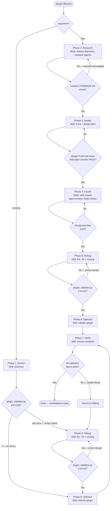

# Architecture Spec: Plugin Lifecycle Orchestration Skill

## Document Metadata

- **Feature**: Plugin Lifecycle Orchestration Skill
- **Issue**: #427
- **Date**: 2026-03-04
- **Input**: `plan/feature-context-plugin-lifecycle.md` (QUESTIONS_RESOLVED)

---

## Overview

Create `/plugin-creator:plugin-lifecycle` — a single user-invocable skill that orchestrates the
full plugin development lifecycle through seven phases. It **replaces** the existing
`/plugin-creator:plugin-creator` skill as the primary orchestration entry point.

Two explicit entry points:
- **New plugin path**: Research → Design → Create → Debug → Optimize → Verify
- **Existing plugin path**: Assess → Debug → Optimize → Verify

---

## Deliverables

| # | Artifact | Path | Description |
|---|----------|------|-------------|
| 1 | SKILL.md | `plugins/plugin-creator/skills/plugin-lifecycle/SKILL.md` | The lifecycle orchestration skill |
| 2 | Deprecation notice | `plugins/plugin-creator/skills/plugin-creator/SKILL.md` | Add deprecation header pointing to plugin-lifecycle |
| 3 | CLAUDE.md update | `plugins/plugin-creator/CLAUDE.md` | Update routing flowchart to reference plugin-lifecycle |
| 4 | plugin.json update | `plugins/plugin-creator/.claude-plugin/plugin.json` | Register the new skill |

---

## SKILL.md Structure

### Frontmatter

```yaml
---
name: plugin-lifecycle
description: >-
  Orchestrate the full plugin development lifecycle from blank canvas to
  marketplace-ready. Use when creating a new plugin, improving an existing
  plugin, fixing validation errors, or taking a plugin through assessment,
  research, design, creation, debugging, optimization, and verification.
argument-hint: <new|existing> <plugin-path-or-concept>
model: sonnet
user-invocable: true
hooks: {}
---
```

### Content Sections

1. **Title + Mission** — One-paragraph mission statement
2. **Arguments** — `new <concept>` vs `existing <plugin-path>`
3. **Workflow Overview** — Mermaid flowchart with both entry points
4. **Phase 1: Assess** (existing plugins only)
5. **Phase 2: Research** (new plugins only)
6. **Phase 3: Design** (both paths converge here or at Debug)
7. **Phase 4: Create** (new plugins only — create skills/agents/hooks)
8. **Phase 5: Debug** (both paths — fix validation errors)
9. **Phase 6: Optimize** (both paths — improve quality)
10. **Phase 7: Verify** (both paths — multi-layer validation)
11. **Decision Gates** — Observable conditions for each phase transition
12. **Phase-to-Skill Mapping** — Reference table mapping each phase to existing skills/agents
13. **Artifact System** — Work directory structure and STATE.md format (inherited from plugin-creator)

---

## Mermaid Flowchart (Two Entry Points)



---

## Phase Specifications

### Phase 1: Assess (Existing Plugin Path Only)

- **Entry condition**: User provides `existing <plugin-path>`
- **Skill/Agent**: `/plugin-creator:assessor` (4-tier assessment pipeline)
- **Input**: Plugin directory path
- **Output**: Assessment report, design map, task file in `.claude/plan/{plugin-name}/`
- **Gate**: `uv run plugins/plugin-creator/scripts/plugin_validator.py <path>` — exit 0 = skip to Optimize; non-zero = go to Debug

### Phase 2: Research (New Plugin Path Only)

- **Entry condition**: User provides `new <concept>`
- **Skill/Agent**: `/plugin-creator:feature-discovery` for context, then parallel research agents (ecosystem, Claude docs, existing patterns, reference implementations — inherited from plugin-creator's 4-way parallel research)
- **Input**: Plugin concept description
- **Output**: `research-FINDINGS.md` in `.claude/plan/{plugin-name}/`
- **Gate**: `research-FINDINGS.md` file exists and is non-empty

### Phase 3: Design (New Plugin Path Only)

- **Entry condition**: Research gate passed
- **Skill/Agent**: `/plugin-creator:rt-ica` for prerequisite check, then design plan creation (inherited from plugin-creator Phase 2)
- **Input**: `research-FINDINGS.md`, user requirements from discuss phase
- **Output**: `design-PLAN.md` with XML task specs in `.claude/plan/{plugin-name}/`
- **Gate**: `design-PLAN.md` exists AND plan-checker returns PASS

### Phase 4: Create (New Plugin Path Only)

- **Entry condition**: Design gate passed
- **Skill/Agent**: `/plugin-creator:skill-creator`, `/plugin-creator:agent-creator`, `/plugin-creator:hook-creator` — one per planned component
- **Input**: `design-PLAN.md` task specs
- **Output**: Created SKILL.md files, agent .md files, hook scripts, plugin.json
- **Gate**: All files listed in design-PLAN.md exist at their specified paths

### Phase 5: Debug (Both Paths)

- **Entry condition**: Create gate passed (new path) OR Assess gate failed (existing path)
- **Skill/Agent**: `/plugin-creator:lint` for diagnosis, then routing based on error type:
  - SK006/SK007 warnings → `/plugin-creator:refactor-skill` or `@subagent-refactorer`
  - Broken links → direct Edit fix
  - Frontmatter issues → `/plugin-creator:lint --fix`
  - Tool format issues → `uv run plugins/plugin-creator/scripts/fix_tool_formats.py`
- **Input**: Plugin path + validator output
- **Output**: Fixed files passing validation
- **Gate**: `uv run plugins/plugin-creator/scripts/plugin_validator.py <path>` — exit 0, zero errors (warnings acceptable)

### Phase 6: Optimize (Both Paths)

- **Entry condition**: Debug gate passed OR Assess gate passed (no errors)
- **Skill/Agent**: `/plugin-creator:refactor-plugin` for structural improvements, `@contextual-ai-documentation-optimizer` for content quality, `@subagent-refactorer` for agent prompt optimization
- **Input**: Plugin path + assessment report (if available)
- **Output**: Improved plugin files
- **Gate**: Assessment score meets target threshold (default: 80/100) OR user accepts current quality

### Phase 7: Verify (Both Paths)

- **Entry condition**: Optimize gate passed
- **Skill/Agent**: `/plugin-creator:ensure-complete` for recursive validation, then multi-layer validation:
  - Layer 1: `plugin_validator.py` structural validation
  - Layer 2: `claude plugin validate` runtime validation
  - Layer 3: Token complexity / size checks
  - Layer 4: Cross-reference integrity
- **Input**: Plugin path
- **Output**: Validation report, SUMMARY.md
- **Gate**: All 4 validation layers pass — if not, loop back to Debug

---

## Artifact System (Inherited from plugin-creator)

```text
.claude/plan/{plugin-name}/
├── PROJECT.md                # Vision and goals
├── STATE.md                  # Current phase, decisions, blockers
├── research-FINDINGS.md      # Phase 2 output (new path only)
├── design-PLAN.md            # Phase 3 output (new path only)
├── assessment-REPORT.md      # Phase 1 output (existing path only)
├── validation-REPORT.md      # Phase 7 output
└── SUMMARY.md                # Completion record
```

STATE.md tracks which phase the plugin is currently in, enabling resume after interruption (Scenario 3 from feature context).

---

## Deprecation Strategy for `/plugin-creator:plugin-creator`

1. Add deprecation header to `plugins/plugin-creator/skills/plugin-creator/SKILL.md`:
   ```text
   > **DEPRECATED**: This skill is superseded by `/plugin-creator:plugin-lifecycle`.
   > Use `/plugin-lifecycle new <concept>` for new plugins.
   ```
2. Keep the file for reference but mark `user-invocable: false` in frontmatter
3. Update `plugins/plugin-creator/CLAUDE.md` routing flowchart to point to plugin-lifecycle
4. Update `plugin.json` skills list to include plugin-lifecycle

---

## Constraints

- SKILL.md must pass `plugin_validator.py` with 0 SK006/SK007 warnings
- No re-implementation of existing skill logic — delegate only
- All decision gate conditions must be observable (command exit codes, file existence)
- Mermaid flowchart uses `<br>` not `\n`, `=` not `:` inside quoted labels
- Follows delegation format standard from `.claude/rules/delegation-format.md`
