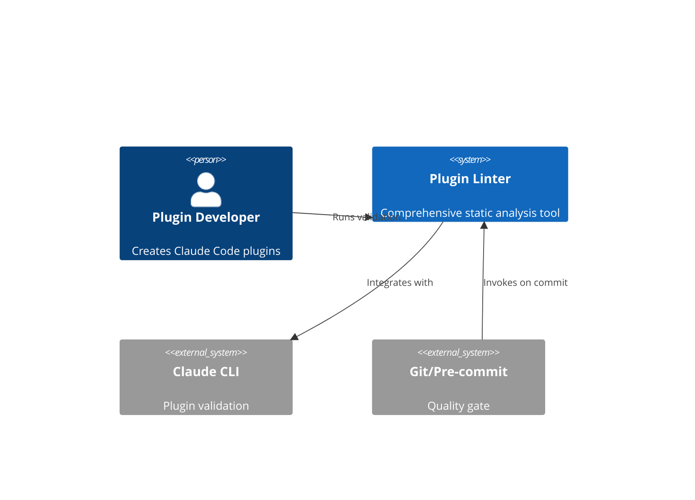
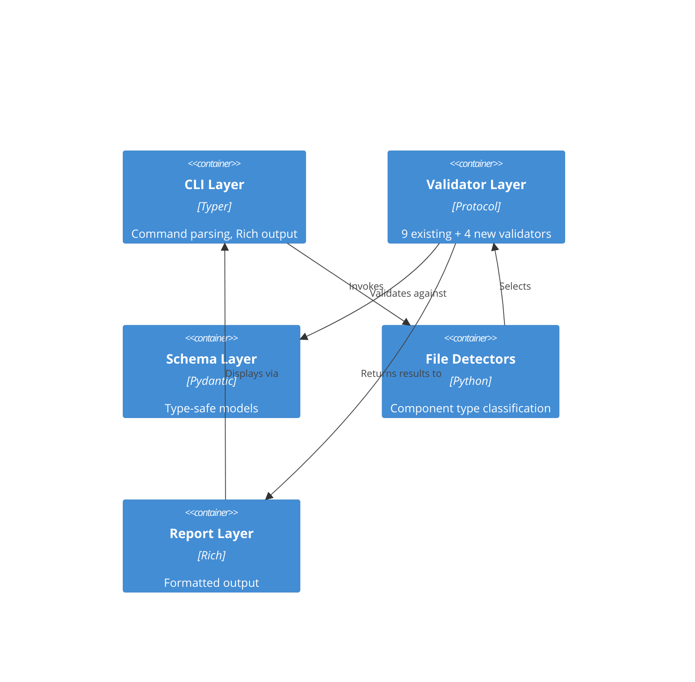
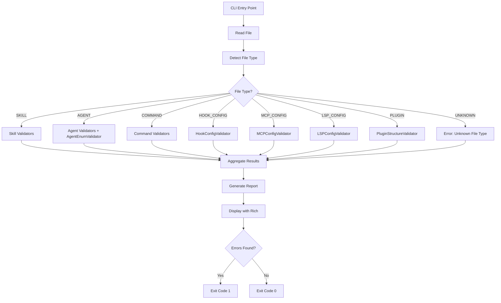

# Architecture Specification: Comprehensive Claude Code Plugin Linter

## Executive Summary

Extend `plugin_validator.py` (2934+ lines, Typer/Rich CLI with Pydantic validation) into a comprehensive static analysis linter covering all 7 Claude Code plugin component types. Add validation for hooks.json, .mcp.json, .lsp.json configurations with 30+ new error codes while maintaining token-based complexity measurement and auto-fix capabilities.

**Scope:** Architectural specification defining WHAT to build (interfaces, contracts, schemas). Implementation details delegated to development agents.

---

## Document Purpose and Boundaries

**This document specifies:**
- Component interfaces and type contracts
- Pydantic schema models with field requirements
- Error code registry and categorization
- Validator class responsibilities and protocols
- Data flow and validation pipeline architecture
- Testing strategy and coverage requirements

**This document does NOT specify:**
- Implementation code (function bodies, algorithms)
- Concrete test implementations
- CLI command implementations
- Error handling implementation details

**Rationale:** Architectural specs constrain WHAT to build while leaving HOW to specialized implementation agents who apply current best practices.

---

## Architecture Overview

### System Context



### Container Diagram



---

## Technology Stack

### Unchanged (Current)
- **CLI Framework:** Typer 0.21.0+ with Rich 13.0.0+ for terminal output
- **Type System:** Python 3.11+ native type hints with mypy strict mode
- **Schema Validation:** Pydantic 2.0.0+ with field validators
- **Token Measurement:** tiktoken 0.8.0+ (cl100k_base encoding)
- **Testing:** pytest with fixtures, pytest-mock for mocking
- **Distribution:** PEP 723 inline script metadata for standalone execution

### Validation Tools
- **YAML Parsing:** pyyaml 6.0+ (frontmatter validation)
- **JSON Parsing:** stdlib json module (config file validation)
- **Regex Validation:** stdlib re module (matcher pattern validation)

---

## Component Architecture

### Extended FileType Enum

**Purpose:** Classify all plugin component types for validator selection

**New Variants Required:**

| Enum Value | File Pattern | Detection Rule |
|------------|-------------|----------------|
| `HOOK_CONFIG` | `hooks.json` | Exact filename match `hooks.json` |
| `MCP_CONFIG` | `.mcp.json` | Exact filename match `.mcp.json` |
| `LSP_CONFIG` | `.lsp.json` | Exact filename match `.lsp.json` |
| `HOOK_SCRIPT` | `hooks/*.{js,py,sh}` | File in `hooks/` directory (not hooks.json) |

**Existing Variants (Unchanged):**
- `SKILL` - SKILL.md files
- `AGENT` - files in `agents/` directory
- `COMMAND` - files in `commands/` directory
- `PLUGIN` - plugin.json or directory containing `.claude-plugin/`
- `UNKNOWN` - unrecognized files

**Enhanced Detection Method:**

```python
@staticmethod
def detect_file_type(path: Path) -> FileType:
    """Detect file type from path structure and filename.

    Detection priority order:
    1. Exact filename matches (hooks.json, .mcp.json, .lsp.json)
    2. Special filenames (SKILL.md, plugin.json)
    3. Directory-based (agents/, commands/, hooks/)
    4. UNKNOWN fallback

    Args:
        path: Path to file or directory to classify

    Returns:
        FileType enum value
    """
```

**Type Signature Contract:**
- Input: `Path` (absolute or relative)
- Output: `FileType` enum value (never raises exceptions)
- Side effects: None (pure function, no I/O)

---

## Pydantic Schema Models

### Hook Configuration Schema

**Official Schema Source:** <https://docs.anthropic.com/en/docs/claude-code/hooks.md> (cited as comment in model)

**Data Model Requirements:**

```python
class HookType(StrEnum):
    """Hook execution type."""
    COMMAND = "command"  # Shell command execution
    PROMPT = "prompt"    # LLM prompt injection
    AGENT = "agent"      # Sub-agent invocation

class HookDefinition(BaseModel):
    """Individual hook action specification."""
    type: HookType
    # Type-specific fields (discriminated union)
    command: str | None = None      # Required if type=command
    prompt: str | None = None       # Required if type=prompt
    agent: str | None = None        # Required if type=agent
    timeout: int | None = None      # Optional timeout in seconds
    model: str | None = None        # Optional model override

class EventMatcher(BaseModel):
    """Event matcher with hooks."""
    matcher: str | None = None      # Optional regex pattern
    hooks: list[HookDefinition]     # Required: hook actions

class HookConfig(BaseModel):
    """hooks.json structure."""
    hooks: dict[str, list[EventMatcher]]  # Event name → matchers
```

**Valid Event Names (Enum):**

```python
class HookEventType(StrEnum):
    """Valid Claude Code hook events."""
    SESSION_START = "SessionStart"
    USER_PROMPT_SUBMIT = "UserPromptSubmit"
    PRE_TOOL_USE = "PreToolUse"
    PERMISSION_REQUEST = "PermissionRequest"
    POST_TOOL_USE = "PostToolUse"
    POST_TOOL_USE_FAILURE = "PostToolUseFailure"
    NOTIFICATION = "Notification"
    SUBAGENT_START = "SubagentStart"
    SUBAGENT_STOP = "SubagentStop"
    STOP = "Stop"
    TEAMMATE_IDLE = "TeammateIdle"
    TASK_COMPLETED = "TaskCompleted"
    PRE_COMPACT = "PreCompact"
    SESSION_END = "SessionEnd"
```

**Field Validators Required:**
- Event name MUST be in HookEventType enum
- Hook type field MUST match discriminator (command/prompt/agent fields present)
- Matcher MUST be valid Python regex (if present)
- Timeout MUST be positive integer (if present)

---

### MCP Server Configuration Schema

**Official Schema Source:** <https://modelcontextprotocol.io/docs/server> (cited as comment)

**Data Model Requirements:**

```python
class MCPServer(BaseModel):
    """Individual MCP server configuration."""
    command: str                        # Required: executable path
    args: list[str] = Field(default_factory=list)   # Optional: CLI arguments
    env: dict[str, str] = Field(default_factory=dict)  # Optional: environment vars
    cwd: str | None = None              # Optional: working directory

class MCPConfig(BaseModel):
    """MCP server configuration file (.mcp.json)."""
    mcpServers: dict[str, MCPServer]    # Server name → config
```

**Field Validators Required:**
- Command MUST be non-empty string
- Command SHOULD exist in PATH or be absolute path (warning only)
- Args MUST be list of strings (not single string)
- Env keys/values MUST be strings
- CWD MUST be valid directory path (if present)

---

### LSP Server Configuration Schema

**Official Schema Source:** <https://docs.anthropic.com/en/docs/claude-code/plugins.md#lsp-servers> (cited as comment)

**Data Model Requirements:**

```python
class LSPTransport(StrEnum):
    """LSP communication transport."""
    STDIO = "stdio"
    SOCKET = "socket"

class LSPServer(BaseModel):
    """Language server configuration."""
    command: str                        # Required: LSP binary
    extensionToLanguage: dict[str, str] # Required: .py → python mapping
    args: list[str] = Field(default_factory=list)
    transport: LSPTransport = LSPTransport.STDIO
    env: dict[str, str] = Field(default_factory=dict)
    initializationOptions: dict[str, Any] = Field(default_factory=dict)
    settings: dict[str, Any] = Field(default_factory=dict)
    workspaceFolder: str | None = None
    startupTimeout: int | None = None   # Milliseconds
    shutdownTimeout: int | None = None
    restartOnCrash: bool = False
    maxRestarts: int | None = None

class LSPConfig(BaseModel):
    """LSP configuration file (.lsp.json)."""
    lspServers: dict[str, LSPServer]    # Language name → server config
```

**Field Validators Required:**
- Command MUST be non-empty string
- extensionToLanguage MUST have at least one mapping
- Extension keys MUST start with dot (e.g., ".py")
- Language values MUST be lowercase identifiers
- Timeouts MUST be positive integers (if present)
- maxRestarts MUST be positive (if present)

---

### Enhanced Agent Frontmatter Schema

**Purpose:** Add enum validation for agent-specific fields

**Official Schema Source:** <https://docs.anthropic.com/en/docs/claude-code/sub-agents.md> (cited)

**New Field Validators Required:**

```python
class AgentModel(StrEnum):
    """Valid agent model values."""
    SONNET = "sonnet"
    OPUS = "opus"
    HAIKU = "haiku"
    INHERIT = "inherit"

class AgentPermissionMode(StrEnum):
    """Valid permission modes."""
    DEFAULT = "default"
    ACCEPT_EDITS = "acceptEdits"
    DELEGATE = "delegate"
    DONT_ASK = "dontAsk"
    BYPASS_PERMISSIONS = "bypassPermissions"
    PLAN = "plan"

class AgentMemory(StrEnum):
    """Valid memory scopes."""
    USER = "user"
    PROJECT = "project"
    LOCAL = "local"

class AgentFrontmatter(BaseModel):
    """Agent frontmatter schema with enum validation."""
    name: str  # Required
    description: str  # Required
    model: AgentModel | None = None
    permissionMode: AgentPermissionMode | None = None
    memory: AgentMemory | None = None
    # ... other fields (existing validators unchanged)
```

**Validation Enhancements:**
- Model field MUST be valid AgentModel value (if present)
- permissionMode MUST be valid AgentPermissionMode value (if present)
- memory MUST be valid AgentMemory value (if present)

---

## Validator Classes Architecture

### Validator Protocol (Unchanged)

**Existing interface maintained for compatibility:**

```python
class Validator(Protocol):
    """Protocol defining validator interface."""

    def validate(self, path: Path, content: str) -> ValidationResult:
        """Validate content and return issues.

        Args:
            path: Path to file being validated
            content: File content as string

        Returns:
            ValidationResult with issues list
        """

    def can_fix(self, issue: ValidationIssue) -> bool:
        """Check if issue can be auto-fixed.

        Args:
            issue: ValidationIssue to check

        Returns:
            True if auto-fix available, False otherwise
        """

    def fix(self, path: Path, content: str) -> str:
        """Auto-fix issues and return corrected content.

        Args:
            path: Path to file being fixed
            content: Original file content

        Returns:
            Fixed content string
        """
```

---

### New Validator Classes

#### HookConfigValidator

**Purpose:** Validate hooks.json structure against official schema

**Responsibilities:**
- Parse JSON structure (detect syntax errors)
- Validate event names against HookEventType enum
- Validate hook type discriminators (command/prompt/agent fields)
- Validate regex patterns in matcher fields
- Check timeout values are positive integers
- Detect unknown event types (suggest valid ones)

**Error Codes Generated:**
- `HK001` - Invalid JSON syntax in hooks.json
- `HK002` - Unknown event type (not in 15 valid events)
- `HK003` - Invalid hook type (not command/prompt/agent)
- `HK004` - Hook type field mismatch (type=command but no command field)
- `HK005` - Invalid regex pattern in matcher field
- `HK006` - Negative or zero timeout value
- `HK007` - Missing required field (type, hooks array)
- `HK008` - Empty hooks array (no actions defined)
- `HK009` - Invalid model value (not sonnet/opus/haiku)
- `HK010` - Type field present but value is invalid

**Auto-Fix Capabilities:**
- NONE - JSON config auto-fix too risky due to nested structure

**Type Signatures:**

```python
class HookConfigValidator:
    def validate(self, path: Path, content: str) -> ValidationResult:
        """Validate hooks.json against official schema.

        Process:
        1. Parse JSON (catch syntax errors → HK001)
        2. Validate top-level structure (hooks dict exists)
        3. For each event name: check against HookEventType enum → HK002
        4. For each matcher: validate structure
        5. For each hook: validate type discriminator → HK003/HK004
        6. For regex matchers: compile to check validity → HK005
        7. For timeouts: check positive integer → HK006

        Args:
            path: Path to hooks.json file
            content: File content as JSON string

        Returns:
            ValidationResult with HK errors
        """

    def can_fix(self, issue: ValidationIssue) -> bool:
        """No auto-fix for hooks.json.

        Returns:
            Always False (JSON config too complex for auto-fix)
        """
```

---

#### MCPConfigValidator

**Purpose:** Validate .mcp.json server configurations

**Responsibilities:**
- Parse JSON structure
- Validate required fields (command per server)
- Check command executability (warning if not in PATH)
- Validate args is array not string
- Validate env is string→string dict
- Check cwd is valid directory (if present)

**Error Codes Generated:**
- `MC001` - Invalid JSON syntax in .mcp.json
- `MC002` - Missing required field 'command'
- `MC003` - Command field is empty string
- `MC004` - Command not found in PATH (warning)
- `MC005` - Args field is string not array
- `MC006` - Env values are not strings
- `MC007` - CWD path does not exist
- `MC008` - Server name is empty string
- `MC009` - No servers defined (empty mcpServers dict)
- `MC010` - Args contains non-string value

**Auto-Fix Capabilities:**
- NONE - JSON config auto-fix too risky

**Type Signatures:**

```python
class MCPConfigValidator:
    def validate(self, path: Path, content: str) -> ValidationResult:
        """Validate .mcp.json against MCP schema.

        Process:
        1. Parse JSON → MC001
        2. Check mcpServers dict exists
        3. For each server: validate required command field → MC002/MC003
        4. Check command exists in PATH → MC004 (warning)
        5. Validate args is list of strings → MC005/MC010
        6. Validate env is dict[str,str] → MC006
        7. Check cwd exists if specified → MC007

        Args:
            path: Path to .mcp.json file
            content: File content as JSON string

        Returns:
            ValidationResult with MC errors/warnings
        """
```

---

#### LSPConfigValidator

**Purpose:** Validate .lsp.json language server configurations

**Responsibilities:**
- Parse JSON structure
- Validate required fields (command, extensionToLanguage)
- Check extension keys start with dot
- Validate language identifiers are lowercase
- Check timeout values are positive
- Validate maxRestarts is positive (if present)
- Validate transport is stdio or socket

**Error Codes Generated:**
- `LS001` - Invalid JSON syntax in .lsp.json
- `LS002` - Missing required field 'command'
- `LS003` - Missing required field 'extensionToLanguage'
- `LS004` - Extension key does not start with dot
- `LS005` - Language identifier not lowercase
- `LS006` - Invalid transport value (not stdio/socket)
- `LS007` - Negative timeout value
- `LS008` - maxRestarts is zero or negative
- `LS009` - Empty extensionToLanguage mapping
- `LS010` - Language server name is empty string

**Auto-Fix Capabilities:**
- NONE - JSON config auto-fix too risky

**Type Signatures:**

```python
class LSPConfigValidator:
    def validate(self, path: Path, content: str) -> ValidationResult:
        """Validate .lsp.json against LSP schema.

        Process:
        1. Parse JSON → LS001
        2. Check lspServers dict exists
        3. For each server: validate required fields → LS002/LS003
        4. Validate extensionToLanguage structure → LS004/LS005/LS009
        5. Check transport enum → LS006
        6. Validate timeout values → LS007
        7. Validate maxRestarts → LS008

        Args:
            path: Path to .lsp.json file
            content: File content as JSON string

        Returns:
            ValidationResult with LS errors
        """
```

---

#### AgentEnumValidator

**Purpose:** Validate agent-specific enum fields (model, permissionMode, memory)

**Responsibilities:**
- Parse agent frontmatter
- Validate model field against AgentModel enum
- Validate permissionMode against AgentPermissionMode enum
- Validate memory against AgentMemory enum
- Provide suggestions for invalid enum values

**Error Codes Generated:**
- `AG001` - Invalid model value (not sonnet/opus/haiku/inherit)
- `AG002` - Invalid permissionMode value
- `AG003` - Invalid memory value (not user/project/local)
- `AG004` - Missing required field 'name'
- `AG005` - Missing required field 'description'
- `AG006` - maxTurns is zero or negative
- `AG007` - color value is not valid CSS color
- `AG008` - disallowedTools contains invalid tool name
- `AG009` - tools field conflicts with disallowedTools
- `AG010` - hooks field references non-existent hook file

**Auto-Fix Capabilities:**
- NONE - Enum value auto-fix would be guessing user intent

**Type Signatures:**

```python
class AgentEnumValidator:
    def validate(self, path: Path, content: str) -> ValidationResult:
        """Validate agent enum fields.

        Process:
        1. Parse YAML frontmatter
        2. Extract model/permissionMode/memory fields
        3. Validate against respective enums → AG001/AG002/AG003
        4. Check required fields → AG004/AG005
        5. Validate maxTurns positive → AG006
        6. Check hooks reference exists → AG010

        Args:
            path: Path to agent .md file
            content: File content with frontmatter

        Returns:
            ValidationResult with AG errors
        """
```

---

### Modified Validator: DescriptionValidator

**Purpose:** Skip SK005 trigger phrase check for commands (fix false positives)

**Required Change:** Add file type awareness to validate() method

**Current Signature:**
```python
def validate(self, path: Path, content: str) -> ValidationResult:
```

**New Signature Required:**
```python
def validate(self, path: Path, content: str, file_type: FileType) -> ValidationResult:
```

**Behavior Change:**
- If `file_type == FileType.COMMAND`: Skip SK005 check
- If `file_type == FileType.SKILL`: Run SK005 check as normal
- If `file_type == FileType.AGENT`: Run SK005 check (agents need triggers)

**Type Signature Contract:**

```python
class DescriptionValidator:
    def validate(
        self,
        path: Path,
        content: str,
        file_type: FileType  # NEW PARAMETER
    ) -> ValidationResult:
        """Validate description field with file-type awareness.

        Checks:
        - Minimum length (SK004)
        - Trigger phrases (SK005) - ONLY for skills and agents

        Args:
            path: Path to file
            content: File content
            file_type: FileType enum (determines SK005 behavior)

        Returns:
            ValidationResult with SK errors (SK005 skipped for commands)
        """
```

---

## Validator Registration Architecture

### Validator Selection Strategy

**Current Architecture:** Hard-coded validator list in `validate_path()` function

**Required Architecture:** File-type-based validator dispatch

**Dispatch Table Structure:**

```python
VALIDATORS_BY_TYPE: dict[FileType, list[type[Validator]]] = {
    FileType.SKILL: [
        FrontmatterValidator,
        NameFormatValidator,
        DescriptionValidator,
        ComplexityValidator,
        InternalLinkValidator,
        ProgressiveDisclosureValidator,
        NamespaceReferenceValidator,
    ],
    FileType.AGENT: [
        FrontmatterValidator,
        NameFormatValidator,
        DescriptionValidator,
        AgentEnumValidator,  # NEW
        NamespaceReferenceValidator,
    ],
    FileType.COMMAND: [
        FrontmatterValidator,
        DescriptionValidator,  # SK005 skipped via file_type parameter
        NamespaceReferenceValidator,
    ],
    FileType.HOOK_CONFIG: [
        HookConfigValidator,  # NEW
    ],
    FileType.MCP_CONFIG: [
        MCPConfigValidator,  # NEW
    ],
    FileType.LSP_CONFIG: [
        LSPConfigValidator,  # NEW
    ],
    FileType.PLUGIN: [
        PluginStructureValidator,
    ],
}
```

**Selection Algorithm:**

```python
def select_validators(file_type: FileType) -> list[Validator]:
    """Select validators appropriate for file type.

    Args:
        file_type: Detected file type

    Returns:
        List of validator instances for this file type

    Raises:
        ValueError: If file_type is UNKNOWN
    """
```

---

## Error Code Registry

### New Error Code Series

**Hook Configuration Errors (HK001-HK010):**

| Code | Description | Severity |
|------|-------------|----------|
| HK001 | Invalid JSON syntax in hooks.json | error |
| HK002 | Unknown event type (not in 15 valid events) | error |
| HK003 | Invalid hook type (not command/prompt/agent) | error |
| HK004 | Hook type field mismatch | error |
| HK005 | Invalid regex pattern in matcher field | error |
| HK006 | Negative or zero timeout value | error |
| HK007 | Missing required field | error |
| HK008 | Empty hooks array | warning |
| HK009 | Invalid model value | error |
| HK010 | Type field present but value invalid | error |

**MCP Configuration Errors (MC001-MC010):**

| Code | Description | Severity |
|------|-------------|----------|
| MC001 | Invalid JSON syntax in .mcp.json | error |
| MC002 | Missing required field 'command' | error |
| MC003 | Command field is empty string | error |
| MC004 | Command not found in PATH | warning |
| MC005 | Args field is string not array | error |
| MC006 | Env values are not strings | error |
| MC007 | CWD path does not exist | warning |
| MC008 | Server name is empty string | error |
| MC009 | No servers defined | warning |
| MC010 | Args contains non-string value | error |

**LSP Configuration Errors (LS001-LS010):**

| Code | Description | Severity |
|------|-------------|----------|
| LS001 | Invalid JSON syntax in .lsp.json | error |
| LS002 | Missing required field 'command' | error |
| LS003 | Missing required field 'extensionToLanguage' | error |
| LS004 | Extension key does not start with dot | error |
| LS005 | Language identifier not lowercase | error |
| LS006 | Invalid transport value | error |
| LS007 | Negative timeout value | error |
| LS008 | maxRestarts is zero or negative | error |
| LS009 | Empty extensionToLanguage mapping | error |
| LS010 | Language server name is empty string | error |

**Agent Enum Errors (AG001-AG010):**

| Code | Description | Severity |
|------|-------------|----------|
| AG001 | Invalid model value | error |
| AG002 | Invalid permissionMode value | error |
| AG003 | Invalid memory value | error |
| AG004 | Missing required field 'name' | error |
| AG005 | Missing required field 'description' | error |
| AG006 | maxTurns is zero or negative | error |
| AG007 | color value is not valid CSS color | warning |
| AG008 | disallowedTools contains invalid tool name | warning |
| AG009 | tools conflicts with disallowedTools | error |
| AG010 | hooks references non-existent file | error |

**Documentation URL Pattern:**

```
{ERROR_CODE_BASE_URL}#{code-lowercase}
```

Example: `https://github.com/.../ERROR_CODES.md#hk001`

---

## Data Flow Architecture

### Validation Pipeline



### File Reading Strategy

**Performance Optimization:** Read files once, pass content to all validators

**Current Issue:** Multiple validators may re-read same file

**Required Pattern:**

```python
def validate_path(path: Path) -> ValidationResult:
    """Validate file or directory.

    Process:
    1. Read file content ONCE
    2. Detect file type from path
    3. Select validators for file type
    4. Pass same content to all validators
    5. Aggregate results

    Args:
        path: Path to validate

    Returns:
        Aggregated ValidationResult
    """
```

**No Multiprocessing:** Performance optimization out of scope. Single-threaded sequential execution sufficient for pre-commit use case.

---

## Report Generation Architecture

### Current Issue

**Lines 2928-2931 in plugin_validator.py:**

```python
# Current: counts validators not files
console.print(f"\n✅ Passed {len(validators)} validators")
```

**Problem:** Developer sees "9 validators passed" instead of "5 files validated"

### Required Fix

**Track files validated instead of validators run:**

```python
def generate_report(results: dict[Path, ValidationResult]) -> None:
    """Generate validation report.

    Displays:
    - Files validated count (not validator count)
    - Issues grouped by file (not by validator)
    - Summary statistics

    Args:
        results: Mapping of file paths to validation results

    Output:
        Rich formatted report to console
    """
```

**Report Structure Requirements:**

```
Validation Report
─────────────────

File: plugins/example/skills/test/SKILL.md
  ❌ [SK006] complexity: Token count 4200 exceeds warning threshold
  ⚠️ [SK005] description: Missing trigger phrases

File: plugins/example/hooks.json
  ❌ [HK002] hooks.SessionStartup: Unknown event type
      → Did you mean 'SessionStart'?
      → https://github.com/.../ERROR_CODES.md#hk002

─────────────────
✅ Validated 2 files
❌ Found 3 errors across 2 files
⚠️ Found 1 warning
```

**Grouping Strategy:** Group by file path, then by error code within file

---

## Testing Architecture

### Test Coverage Requirements

**Minimum Coverage Thresholds:**
- Overall: 80% line and branch coverage
- Critical validators: 95%+ coverage
- New validators (HK/MC/LS/AG): 90%+ coverage

### Test File Structure

```
tests/
├── conftest.py                    # Shared fixtures
├── test_hook_config_validator.py  # NEW - HookConfigValidator tests
├── test_mcp_config_validator.py   # NEW - MCPConfigValidator tests
├── test_lsp_config_validator.py   # NEW - LSPConfigValidator tests
├── test_agent_enum_validator.py   # NEW - AgentEnumValidator tests
├── test_file_type_detection.py    # NEW - FileType.detect_file_type() tests
├── test_report_generation.py      # NEW - Report fix verification
├── test_frontmatter_validator.py  # EXISTING
├── test_description_validator.py  # MODIFIED - add file_type parameter tests
└── ... (9 existing test files)
```

### Test Strategy by Validator

#### HookConfigValidator Test Requirements

**Test Categories:**
- Valid hook configurations (all 15 event types)
- Invalid JSON syntax → HK001
- Unknown event types → HK002
- Invalid hook types → HK003
- Type field mismatches → HK004
- Invalid regex patterns → HK005
- Invalid timeouts → HK006
- Missing required fields → HK007
- Empty hooks arrays → HK008

**Parametrize Patterns:**
- Valid event types (15 test cases)
- Invalid event type suggestions (fuzzy matching)
- Hook type discriminators (command/prompt/agent)
- Regex validity (valid vs invalid patterns)

**Fixture Requirements:**
- Valid hooks.json template
- Invalid hooks.json with each error type
- Regex pattern test cases

#### MCPConfigValidator Test Requirements

**Test Categories:**
- Valid MCP configurations
- Invalid JSON syntax → MC001
- Missing command field → MC002
- Empty command → MC003
- Command not in PATH → MC004 (warning)
- Args as string → MC005
- Env with non-string values → MC006
- Invalid CWD path → MC007

**Mock Requirements:**
- Mock `shutil.which()` for command existence checks
- Mock file system for CWD validation

#### LSPConfigValidator Test Requirements

**Test Categories:**
- Valid LSP configurations
- Invalid JSON syntax → LS001
- Missing required fields → LS002/LS003
- Extension format validation → LS004
- Language identifier validation → LS005
- Invalid transport → LS006
- Invalid timeouts → LS007/LS008
- Empty extension mapping → LS009

**Parametrize Patterns:**
- Valid extension formats (.py, .js, .ts)
- Invalid extension formats (py, *.py)
- Valid/invalid language identifiers

#### AgentEnumValidator Test Requirements

**Test Categories:**
- Valid agent enum values
- Invalid model values → AG001
- Invalid permissionMode values → AG002
- Invalid memory values → AG003
- Missing required fields → AG004/AG005
- Invalid maxTurns → AG006

**Parametrize Patterns:**
- All valid enum combinations
- Each invalid enum value with suggestions

#### File Type Detection Tests

**Test Categories:**
- SKILL.md detection
- Agent file detection (agents/ directory)
- Command file detection (commands/ directory)
- hooks.json exact match
- .mcp.json exact match
- .lsp.json exact match
- Hook script detection (hooks/*.js)
- plugin.json detection
- UNKNOWN fallback

**Edge Cases:**
- Files named "hooks.json" outside plugin context
- Files with .json extension but not config files
- Nested directory structures

#### Report Generation Tests

**Test Categories:**
- File count accuracy (not validator count)
- Issue grouping by file
- Issue grouping by error code within file
- Summary statistics
- Error vs warning separation

**Verification Method:**
- Capture Rich console output
- Parse text output
- Assert file counts match input
- Assert grouping structure

### Testing Framework Standards

**MANDATORY Requirements:**

**Fixture Type Hints:**
- All fixtures MUST have complete type hints including return types
- Generator fixtures: `Generator[YieldType, None, None]`
- Async generator fixtures: `AsyncGenerator[YieldType, None]`

**Test Function Signatures:**
- All test functions MUST have typed parameters
- All test functions MUST have `-> None` return type
- Use Python 3.11+ syntax: `str | None` NOT `Optional[str]`

**Mocking Standards:**
- Use pytest-mock (`mocker: MockerFixture`) NEVER unittest.mock
- NEVER import from `unittest.mock`
- AAA (Arrange-Act-Assert) pattern with comments

**Property-Based Testing:**
- Use hypothesis for validation functions
- Minimum 500 examples for confidence
- Custom strategies for domain-specific data (event types, enum values)

**Test Organization:**
- One test file per validator class
- Shared fixtures in conftest.py
- Test isolation with no shared state

---

## Performance Requirements

### Pre-Commit Performance Budget

**Target:** <5 seconds for typical changes (1-3 files modified)

**Performance Strategy:**

**Single File Read:**
- Read each file once
- Pass content string to all validators
- No redundant I/O operations

**Sequential Validation:**
- No multiprocessing overhead
- Simple for-loop over validators
- Aggregate results after all validators complete

**Lazy Loading:**
- Load Pydantic models only when needed
- Parse JSON/YAML once per file
- Cache compiled regex patterns

**Performance Measurement:**

```bash
# Benchmark typical pre-commit scenario
time uv run plugin_validator.py plugins/example/skills/test/SKILL.md

# Benchmark full plugin validation
time uv run plugin_validator.py plugins/example/
```

**Target Thresholds:**
- Single file: <1 second
- Plugin with 10 components: <5 seconds
- Full repository scan: <30 seconds

---

## Backward Compatibility

### CLI Interface (Maintained)

**Existing invocation patterns MUST continue working:**

```bash
# Unchanged behavior
uv run plugin_validator.py <path>
uv run plugin_validator.py --fix <path>
uv run plugin_validator.py --check <path>
uv run plugin_validator.py --verbose <path>
uv run plugin_validator.py --no-color <path>
```

**New behavior (additive only):**
- New validators run automatically when relevant files detected
- New error codes appear in output
- Report format improved (file counts vs validator counts)

**Breaking Changes (None):**
- Exit codes unchanged (0=pass, non-zero=fail)
- Existing error codes unchanged
- CLI flags unchanged
- Auto-fix behavior unchanged (frontmatter only)

### Pre-Commit Hook Compatibility

**Existing hook configuration MUST work without changes:**

```yaml
# .pre-commit-config.yaml (unchanged)
- id: plugin-validator
  name: Validate Plugin Components
  entry: plugins/plugin-creator/scripts/plugin_validator.py
  language: script
  files: '^plugins/.*(SKILL\.md|agents/.*\.md|commands/.*\.md|plugin\.json)$'
```

**Required Enhancement:** Update file pattern to include new config files:

```yaml
files: '^plugins/.*(SKILL\.md|agents/.*\.md|commands/.*\.md|plugin\.json|hooks\.json|\.mcp\.json|\.lsp\.json)$'
```

---

## Dead Code Removal

### Issue Identified

**Lines 904-911 in plugin_validator.py:**

Nested skill reference resolution code is unreachable due to early return on line 903.

**Required Action:**
- Verify unreachability with code coverage tools
- Remove dead code after verification
- Document removal in commit message with evidence

**Verification Strategy:**
- Run test suite with coverage enabled
- Assert lines 904-911 have 0% coverage
- Review git history to determine original purpose
- If never executed, safe to remove

---

## Integration Patterns

### Validator Invocation Flow

```python
def validate_path(path: Path) -> ValidationResult:
    """Main validation entry point.

    Algorithm:
    1. Read file content once
    2. Detect file type via FileType.detect_file_type(path)
    3. Select validators via VALIDATORS_BY_TYPE[file_type]
    4. For each validator:
        a. Instantiate validator instance
        b. Call validator.validate(path, content, file_type*)
           * file_type param only for DescriptionValidator
        c. Collect issues
    5. Aggregate all issues into single ValidationResult
    6. Return aggregated result

    Args:
        path: File or directory path to validate

    Returns:
        ValidationResult with all issues from all validators

    Raises:
        FileNotFoundError: If path does not exist
        PermissionError: If path is not readable
    """
```

### Error Aggregation Strategy

**Result Merging:**

```python
def merge_results(results: list[ValidationResult]) -> ValidationResult:
    """Merge multiple validation results.

    Combines issues from multiple validators while:
    - Deduplicating identical issues
    - Preserving severity ordering (errors before warnings)
    - Maintaining file:line location information

    Args:
        results: List of ValidationResult objects

    Returns:
        Single ValidationResult with all unique issues
    """
```

---

## Security Considerations

### Regex Pattern Validation

**Risk:** User-provided regex patterns in hooks.json matcher fields

**Mitigation Strategy:**

```python
def validate_regex_pattern(pattern: str) -> bool:
    """Safely validate regex pattern without executing.

    Process:
    1. Attempt to compile with re.compile()
    2. Catch re.error exceptions
    3. Do NOT execute regex against any input
    4. Return True if compiles, False if error

    Args:
        pattern: Regex pattern string to validate

    Returns:
        True if valid regex, False otherwise

    Security:
        - No regex execution (no ReDoS risk)
        - No arbitrary code evaluation
        - Only compilation check
    """
```

### Command Execution Checks

**Risk:** Validating command existence requires PATH traversal

**Mitigation Strategy:**

```python
def check_command_exists(command: str) -> bool:
    """Check if command exists without executing.

    Uses shutil.which() to search PATH without execution.

    Args:
        command: Command name or path

    Returns:
        True if found in PATH, False otherwise

    Security:
        - No command execution
        - No shell injection risk
        - Read-only PATH traversal
    """
```

---

## Documentation Requirements

### ERROR_CODES.md Updates

**Required Structure:**

```markdown
## Hook Configuration Errors (HK001-HK010)

### HK001 - Invalid JSON Syntax

**Description:** The hooks.json file contains invalid JSON syntax.

**Examples:**

```json
// INVALID: Trailing comma
{
  "hooks": {
    "SessionStart": [],
  }
}
```

**How to Fix:** Validate JSON syntax with `python -m json.tool hooks.json`

**Source:** <https://docs.anthropic.com/en/docs/claude-code/hooks.md>

---

### HK002 - Unknown Event Type

**Description:** Hook event type is not one of the 15 valid event names.

**Valid Event Types:**
- SessionStart, UserPromptSubmit, PreToolUse, PermissionRequest
- PostToolUse, PostToolUseFailure, Notification
- SubagentStart, SubagentStop, Stop
- TeammateIdle, TaskCompleted, PreCompact, SessionEnd

**Examples:**

```json
// INVALID: SessionStartup is not a valid event
{
  "hooks": {
    "SessionStartup": []  // Should be "SessionStart"
  }
}
```

**How to Fix:** Use exact event name from valid list (case-sensitive).

---
```

**Documentation Requirements for Each Error Code:**
- Description (what the error means)
- Valid examples (correct usage)
- Invalid examples (what triggers error)
- How to fix (actionable steps)
- Official documentation URL

---

## Architectural Decision Records

### ADR-001: No Auto-Fix for JSON Configs

**Status:** Accepted

**Context:** Hook/MCP/LSP configs are nested JSON structures where auto-fix could corrupt data

**Decision:** Disable auto-fix for all JSON config validators (HK/MC/LS)

**Consequences:**
- Positive: No risk of data corruption from automated edits
- Positive: Forces developers to understand structure before fixing
- Negative: More manual work to fix issues

**Alternatives Considered:**
- Simple auto-fixes (add missing fields with defaults) - Rejected: Guesses user intent
- Interactive fix mode - Deferred: Out of scope for this phase

---

### ADR-002: Token-Based Complexity Maintained

**Status:** Accepted

**Context:** Line count is poor proxy for AI processing cost

**Decision:** Continue using tiktoken-based token counting for complexity measurement

**Consequences:**
- Positive: Accurate AI cost estimation
- Positive: Matches actual Claude processing behavior
- Negative: Additional dependency (tiktoken)

**Alternatives Considered:**
- Line count - Rejected: Inaccurate for token-heavy files
- Character count - Rejected: Doesn't account for token encoding

---

### ADR-003: FileType Dispatch Over Validator Registration

**Status:** Accepted

**Context:** Need type-safe validator selection based on file type

**Decision:** Use VALIDATORS_BY_TYPE dict mapping FileType → validators

**Consequences:**
- Positive: Type-safe dispatch with mypy checking
- Positive: Clear validator→file type relationship
- Negative: Manual registration required for new validators

**Alternatives Considered:**
- Decorator-based registration - Rejected: Runtime registration, no type safety
- Plugin system - Rejected: Over-engineering for this use case

---

### ADR-004: Sequential Validation (No Multiprocessing)

**Status:** Accepted

**Context:** Pre-commit validation of 1-3 files needs <5s performance

**Decision:** Single-threaded sequential validation, read files once, pass content

**Consequences:**
- Positive: Simple implementation, no concurrency bugs
- Positive: Sufficient performance for use case
- Negative: Slower on full repository scans (acceptable trade-off)

**Alternatives Considered:**
- Multiprocessing - Rejected: Overhead exceeds benefit for small file counts
- Async I/O - Rejected: Disk I/O not bottleneck

---

## Success Criteria

### Functional Requirements

- [ ] Validates all 7 component types (skills, commands, agents, hooks, plugin.json, .mcp.json, .lsp.json)
- [ ] Detects file types correctly with new FileType variants
- [ ] Reports errors with file:line:column precision
- [ ] Provides actionable error messages with suggestions
- [ ] Returns exit code 0 on pass, non-zero on fail
- [ ] SK005 no longer fires on commands (file-type awareness)
- [ ] Report counts files validated, not validators run

### New Validator Requirements

- [ ] HookConfigValidator validates hooks.json against 15 event types
- [ ] MCPConfigValidator validates .mcp.json server configs
- [ ] LSPConfigValidator validates .lsp.json language server configs
- [ ] AgentEnumValidator validates agent enum fields
- [ ] All validators follow Validator protocol interface

### Error Code Requirements

- [ ] 30 new error codes documented (HK001-HK010, MC001-MC010, LS001-LS010, AG001-AG010)
- [ ] ERROR_CODES.md updated with examples and fixes
- [ ] Error URLs follow pattern: {BASE_URL}#{code-lowercase}

### Performance Requirements

- [ ] Single file validation <1s
- [ ] Plugin validation (10 components) <5s
- [ ] Files read once, content passed to validators

### Quality Requirements

- [ ] Test coverage >80% overall
- [ ] New validators have 90%+ test coverage
- [ ] No false positives on valid plugins (verified with test suite)
- [ ] Type hints pass mypy strict mode

---

## Implementation Delegation Notes

**This specification defines:**
- ✅ Component interfaces (Pydantic models, Validator protocol)
- ✅ Type contracts (method signatures, return types)
- ✅ Error code registry (codes, descriptions, severities)
- ✅ Testing strategy (coverage requirements, test categories)
- ✅ Data flow (validation pipeline, aggregation strategy)

**Implementation agents MUST provide:**
- Function implementations following protocol contracts
- Test implementations achieving coverage requirements
- Error message text and formatting
- Regex compilation and validation logic
- JSON/YAML parsing with error handling
- CLI command implementations

**Boundary:** Architecture constrains WHAT validators do, implementation determines HOW they do it using current Python best practices.

---

## References

**Official Schema Sources:**
- Hooks: https://docs.anthropic.com/en/docs/claude-code/hooks.md
- Agents: https://docs.anthropic.com/en/docs/claude-code/sub-agents.md
- MCP: https://modelcontextprotocol.io/docs/server
- LSP: https://docs.anthropic.com/en/docs/claude-code/plugins.md#lsp-servers
- Plugins: https://docs.anthropic.com/en/docs/claude-code/plugins.md

**Codebase References:**
- Existing validator: `/home/ubuntulinuxqa2/repos/claude_skills/plugins/plugin-creator/scripts/plugin_validator.py`
- Feature context: `/home/ubuntulinuxqa2/repos/claude_skills/plan/feature-context-plugin-linter.md`
- Error code docs: `plugins/plugin-creator/scripts/ERROR_CODES.md`

**Architecture Patterns:**
- Python CLI Architecture: `/python-cli-design-spec` skill (Type-safe Typer/Rich patterns)
- Testing Architecture: pytest with property-based testing (hypothesis)

---

## Version History

- **1.0.0** (2026-02-13): Initial architecture specification
  - Defined 4 new validators (HookConfig, MCPConfig, LSPConfig, AgentEnum)
  - Extended FileType enum with 4 new variants
  - Defined 30 new error codes (HK/MC/LS/AG series)
  - Specified Pydantic models for hook/MCP/LSP schemas
  - Defined testing strategy with 90%+ coverage requirements
  - Fixed SK005 false positive via file-type awareness
  - Fixed report UX (file counts vs validator counts)
