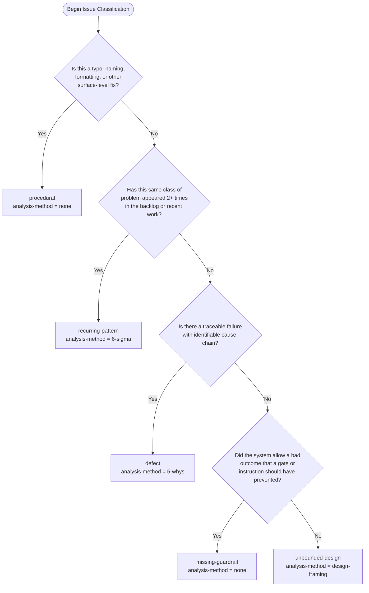
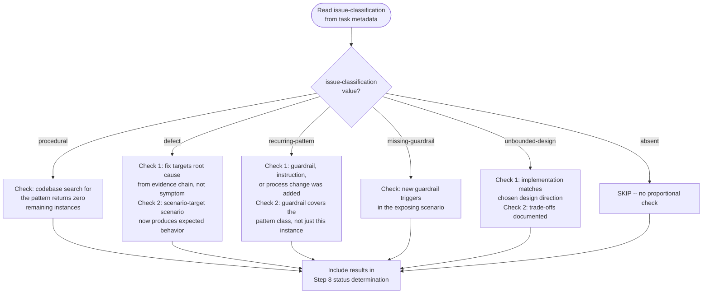
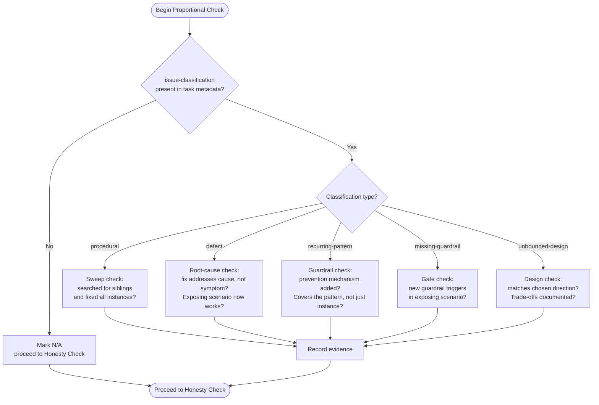

# Architecture Spec: Process Quality Discipline for SAM Pipeline

**Feature**: Add Process Quality Discipline to SAM Pipeline
**GitHub Issue**: #314
**Date**: 2026-03-01
**Status**: ARCHITECTURE COMPLETE
**Input Documents**:

- [Feature Context](./feature-context-process-quality-discipline.md)
- [Codebase Analysis](./codebase/sam-pipeline-quality.md)
- [Task File Format Spec](../plugins/development-harness/docs/TASK_FILE_FORMAT.md)
- [Groomed Backlog Item](../.claude/backlog/p1-add-ux-impact-assessment-to-sam-task-template-grooming-and-c.md)

---

## Executive Summary

This feature adds process quality discipline to the SAM pipeline through four coordinated changes to AI instruction documents (SKILL.md files and agent markdown files). No Python code changes are required. The changes introduce issue classification, analysis method routing, scenario-as-target tracking, and proportional response verification across the grooming, task metadata, completion, and verification stages of the pipeline.

All changes are additive. Existing tasks and backlog items without the new fields continue to work unchanged.

---

## Question Resolutions (Q1-Q7)

### Q1: Taxonomy coexistence with existing backlog `type` field

**Resolution: Option A -- Independent taxonomies.**

The backlog `type` field (`Feature|Bug|Refactor|Docs|Chore`) describes the WORK CATEGORY -- what kind of deliverable this produces. The new `issue-classification` field describes the ANALYTICAL DEPTH needed -- how much investigation the problem requires before a proportional response can be designed.

These are orthogonal. A `Bug` can be `procedural` (typo in error message) or `defect` (root cause needed) or `recurring-pattern` (third time this class of bug appeared). A `Feature` can be `unbounded-design` (no clear right answer) or `missing-guardrail` (the feature is a gate that should have existed).

**Interaction rule**: `type` determines the work template (feature plan vs bug fix vs refactor). `issue-classification` determines the analysis depth and verification criteria. Both are set during grooming. Neither overrides the other.

**No mapping table needed.** The groomer classifies `issue-classification` independently of `type` based on the problem characteristics described in the item.

### Q2: Groomer agent capability for root-cause analysis

**Resolution: Option C -- Reuse `/find-cause` skill as pre-grooming analysis step, with Option B as the structural pattern.**

The `@backlog-item-groomer` agent stays on `model: haiku`. It does not perform root-cause analysis. Instead, a new step is added to the `/groom-backlog-item` SKILL.md workflow BETWEEN Step 5 (RT-ICA) and Step 6 (Spawn Groomer Agents). This new step conditionally invokes the `/find-cause` skill for `defect` and `recurring-pattern` classifications.

**Rationale**:

- The `/find-cause` skill already implements evidence-chain root-cause investigation (symptom -> mechanism -> proximate cause -> root cause) with structured CLAIM/EVIDENCE/VERIFIED output.
- The skill runs in the orchestrator context (not a haiku agent), so it has full reasoning capability.
- The groomer agent receives the root-cause analysis output as additional context alongside RT-ICA and fact-check summaries.
- No model upgrade needed for the groomer agent.

For `recurring-pattern` (type 3), the orchestrator also performs a lightweight frequency search (see Grooming Integration below) before invoking `/find-cause`.

### Q3: Recurring pattern detection method

**Resolution: Option A -- Human-only classification, with Option B as a future enhancement.**

For the initial implementation, the human creating or reviewing the backlog item explicitly classifies it as `recurring-pattern` (or the orchestrator does during grooming based on explicit human input). The groomer does NOT auto-search past items for similar patterns.

**Rationale**: Automated detection requires cross-referencing past backlog items with semantic similarity matching, which adds significant complexity. The human operator has session context and memory of recurring problems that an automated search would miss or over-match.

**Future enhancement path**: When the taxonomy is validated and adoption is established, add a semi-automated search in the grooming workflow that suggests "this may be a recurring pattern" based on keyword overlap with closed items. This is NOT in scope for this feature.

### Q4: 5 Whys output format and storage location

**Resolution: Option A -- New groomed section `### Root-Cause Analysis` in the backlog item.**

The `/find-cause` skill produces an evidence chain. The grooming orchestrator extracts the chain and writes it to the backlog item as a new groomed section:

```markdown
### Root-Cause Analysis

**Method**: 5-whys | 6-sigma
**Issue Classification**: defect | recurring-pattern

#### Evidence Chain

1. CLAIM: [symptom observed]
   EVIDENCE: [source]
   VERIFIED: yes

2. CLAIM: [why 1]
   EVIDENCE: [source]
   VERIFIED: yes
   DEPENDS ON: 1

...

**Root Cause**: [single statement]
**Scenario Target**: [what scenario exposed this + what should improve]
```

This section is written via `backlog groom "{title}" --section "Root-Cause Analysis" --content "{chain}"`.

**Storage**: In the backlog item file under `## Groomed`, alongside existing sections. NOT a separate artifact file. This keeps the analysis co-located with the item it analyzes.

### Q5: Proportional verification -- concrete pass/fail criteria per type

**Resolution: Concrete criteria defined below, embedded in feature verifier and verify skill.**

See [Proportional Verification Criteria](#proportional-verification-criteria) section below for the full criteria table.

### Q6: Scope of feature verifier changes across plugins

**Resolution: Option A -- Identical check added to both agents.**

Both `plugins/python3-development/agents/feature-verifier.md` and `plugins/development-harness/agents/feature-verifier.md` receive the same new Step (inserted before the final status determination step). The only difference is the existing skill reference difference (`python3-development` vs `development-harness`).

**Rationale**: A shared reference document (Option C) adds indirection that makes the agent prompt harder to read and debug. The check is small (one step with a decision table). Copy-paste with the existing skill reference difference is acceptable for a single check step. Drift risk is mitigated by the fact that this feature itself will be verified against both agents.

### Q7: Retroactive application to existing items

**Resolution: Option A -- Forward-only.**

New fields are optional. Existing task files and backlog items work without them. Classification happens when items are next groomed. No migration script or batch classification.

**Rationale**: Forward-only is the simplest approach and matches the existing YAML schema extensibility guarantee: "All parsers MUST ignore unknown fields to maintain forward compatibility. New fields added in future versions will be optional and will not break existing task files." (SOURCE: [TASK_FILE_FORMAT.md:914](../plugins/development-harness/docs/TASK_FILE_FORMAT.md))

---

## Component Architecture

### System Context

```text
SAM Pipeline -- Process Quality Discipline Integration Points

                          GROOMING PHASE
                               |
           +---------+---------+---------+---------+
           |         |         |         |         |
       Fact-Check  RT-ICA  Classify  Root-Cause  Groom
       (existing) (existing) (NEW)   (NEW, cond)  (existing)
                               |         |
                        issue-class   /find-cause
                        determined    (types 2,3)
                               |         |
                               v         v
                          TASK METADATA
                     (new fields carried forward)
                               |
                               v
                        IMPLEMENTATION
                          (unchanged)
                               |
                               v
                       COMPLETION GATES
                               |
           +---------+---------+---------+
           |         |         |         |
       Code Review  Feature   Verify   (existing
       (existing)   Verifier  Skill    phases)
                    (ENHANCED) (ENHANCED)
```

### Change Inventory

All changes are to AI instruction documents (markdown files). No Python code is modified.

| File | Change Type | Description |
|------|-------------|-------------|
| `plugins/development-harness/docs/TASK_FILE_FORMAT.md` | EXTEND | Add 3 optional fields to schema |
| `.claude/docs/backlog-item-groomed-schema.md` | EXTEND | Add 2 new groomed sections |
| `.claude/skills/groom-backlog-item/SKILL.md` | EXTEND | Add classification step + root-cause step |
| `.claude/skills/complete-implementation/SKILL.md` | EXTEND | Enhance Phase 2 description |
| `.claude/skills/verify/SKILL.md` | EXTEND | Add Section 6: Proportional Check |
| `plugins/python3-development/agents/feature-verifier.md` | EXTEND | Add Step 6.5: Root-Cause vs Symptom Check |
| `plugins/development-harness/agents/feature-verifier.md` | EXTEND | Add Step 6.5: Root-Cause vs Symptom Check |

---

## Schema Definitions

### New Task Metadata Fields

Add to `plugins/development-harness/docs/TASK_FILE_FORMAT.md` in the **Optional Fields** table (after `skills` row, line ~150) and in the **JSON Schema** (line ~352).

#### Field: `issue-classification`

| Property | Value |
|----------|-------|
| **Name** | `issue-classification` |
| **Type** | enum (string) |
| **Values** | `procedural`, `defect`, `recurring-pattern`, `missing-guardrail`, `unbounded-design` |
| **Default** | None (field absent means "not classified") |
| **Required** | No |
| **Description** | Analytical depth classification for the issue this task addresses |

**Value semantics**:

| Value | Meaning | Analysis Required | Example |
|-------|---------|-------------------|---------|
| `procedural` | Typo, naming, formatting -- fix and sweep | None | "Skill description has wrong verb tense" |
| `defect` | Traceable failure with identifiable cause chain | 5 Whys | "SubagentStop hook does not fire for Agent tool invocations" |
| `recurring-pattern` | Same defect class appeared 2+ times | 6 Sigma / DMAIC measurement | "Completion gates missed quality issues in 3 consecutive features" |
| `missing-guardrail` | System allowed a bad outcome it should have prevented | Gap analysis | "Orchestrator wrote code directly instead of delegating" |
| `unbounded-design` | No clear right answer; decision space must be framed | Design framing | "How should the pipeline handle partial completion across sessions?" |

#### Field: `scenario-target`

| Property | Value |
|----------|-------|
| **Name** | `scenario-target` |
| **Type** | string (free text) |
| **Default** | None (field absent means "not specified") |
| **Required** | No |
| **Description** | What scenario exposed this issue and what specifically should improve |

**Format guidance**: "{scenario that exposed the problem} -> {what should improve}"

**Examples**:

- `"Sub-agent lifecycle hooks unreliable when agent spawned via Agent tool -> hook fires regardless of invocation method"`
- `"Completion gates evaluated task success but not scenario improvement -> gate process includes scenario verification"`
- `"User wanted to modify before committing -> interaction design includes confirmation/edit step"`

#### Field: `analysis-method`

| Property | Value |
|----------|-------|
| **Name** | `analysis-method` |
| **Type** | enum (string) |
| **Values** | `none`, `5-whys`, `6-sigma`, `design-framing` |
| **Default** | `none` |
| **Required** | No |
| **Description** | Root-cause analysis method applied during grooming |

**Mapping from `issue-classification` to `analysis-method`**:

| Classification | Default Analysis Method |
|----------------|----------------------|
| `procedural` | `none` |
| `defect` | `5-whys` |
| `recurring-pattern` | `6-sigma` |
| `missing-guardrail` | `none` |
| `unbounded-design` | `design-framing` |

The mapping is a DEFAULT. The groomer may override if context warrants (e.g., a `defect` with obvious cause may use `none`).

### JSON Schema Extension

Add to the `properties` object in the JSON Schema at `plugins/development-harness/docs/TASK_FILE_FORMAT.md:270-353`:

```json
"issue-classification": {
  "type": "string",
  "enum": ["procedural", "defect", "recurring-pattern", "missing-guardrail", "unbounded-design"],
  "description": "Analytical depth classification for the issue this task addresses"
},
"scenario-target": {
  "type": "string",
  "description": "What scenario exposed this issue and what specifically should improve"
},
"analysis-method": {
  "type": "string",
  "enum": ["none", "5-whys", "6-sigma", "design-framing"],
  "default": "none",
  "description": "Root-cause analysis method applied during grooming"
}
```

### YAML Frontmatter Example

```yaml
---
task: T3
title: Add scenario verification to completion gates
status: not-started
agent: python-cli-architect
dependencies: [T1, T2]
priority: 2
complexity: medium
issue-classification: recurring-pattern
scenario-target: "Completion gates evaluated task success but not scenario improvement -> gate process includes scenario verification"
analysis-method: 6-sigma
skills:
  - python3-development
---
```

### Legacy Format Extension

For legacy markdown format (still supported), the fields appear as bold markers:

```markdown
**Issue Classification**: recurring-pattern
**Scenario Target**: Completion gates evaluated task success but not scenario improvement -> gate process includes scenario verification
**Analysis Method**: 6-sigma
```

### Backward Compatibility

**No breaking changes.** All three fields are optional with no required default. Tasks without these fields are treated as "not classified" -- existing pipeline behavior applies unchanged.

The `implementation_manager.py` parser does NOT need modification. Per the codebase analysis, the parser already ignores fields it does not consume (e.g., `accuracy-risk`, `complexity`, `created`, `blocked-by`, `parallelize-with`). The new fields follow the same pattern -- they are consumed by AI agents reading the task file markdown, not by the Python parser.

SOURCE: Observed in [codebase analysis](./codebase/sam-pipeline-quality.md): "Fields not consumed by `implementation_manager.py`: `complexity`, `created`, `blocked-by`, `parallelize-with`, `accuracy-risk`"

### Possible Future Fields Update

Add the three new fields to the "Possible Future Fields" appendix in `TASK_FILE_FORMAT.md` (lines 896-910) -- or rather, REMOVE them from "possible future" since they are now defined. Update the appendix to note they were added in this feature.

---

## New Groomed Sections

### Additions to Backlog Item Groomed Schema

Add to `.claude/docs/backlog-item-groomed-schema.md` in the groomed sections table (line ~52):

| Section | Purpose | Required |
|---------|---------|----------|
| **Issue Classification** | Classification type and rationale | When groomed after this feature |
| **Root-Cause Analysis** | Evidence chain from `/find-cause` or 6 Sigma measurement | When `issue-classification` is `defect` or `recurring-pattern` |

### Issue Classification Section Format

```markdown
### Issue Classification

**Type**: procedural | defect | recurring-pattern | missing-guardrail | unbounded-design
**Rationale**: {1-2 sentence explanation of why this classification was chosen}
**Analysis Method**: none | 5-whys | 6-sigma | design-framing
**Scenario Target**: {what scenario exposed this} -> {what should improve}
```

### Root-Cause Analysis Section Format

```markdown
### Root-Cause Analysis

**Method**: 5-whys | 6-sigma
**Classification**: defect | recurring-pattern

#### Evidence Chain

1. CLAIM: {symptom observed}
   EVIDENCE: {source -- command output, file:line, or direct observation}
   VERIFIED: yes
   DEPENDS ON: none (symptom)

2. CLAIM: {why 1}
   EVIDENCE: {source}
   VERIFIED: yes
   DEPENDS ON: 1

3. CLAIM: {why 2}
   EVIDENCE: {source}
   VERIFIED: yes
   DEPENDS ON: 2

[continue until root cause reached]

**Root Cause**: {single actionable statement supported by chain above}
**Scenario Target**: {what scenario exposed this} -> {what should improve}
```

For `6-sigma` method, replace the evidence chain with:

```markdown
#### Measurement

- **Frequency**: {N occurrences in {time period or batch}}
- **Common factors**: {what the occurrences share}
- **Affected scope**: {what parts of the system are impacted}

#### Analysis

- **Root cause pattern**: {why this class of defect recurs}
- **Missing guardrail**: {what gate or instruction should prevent this}

#### Improvement

- **Proposed guardrail**: {specific instruction, gate, or check to add}
- **Verification**: {how to confirm the guardrail works}
```

### Valid Section Names Update

Add to the valid section names list in `/groom-backlog-item` SKILL.md (line 230):

Current:

```text
Valid section names — top-level: Fact-Check, RT-ICA. Groomed subsections: Reproducibility, Priority, Impact, Scope, Output / Evidence, Dependencies, Research, Skills, Agents, Prior Work, Files, Decision.
```

Updated:

```text
Valid section names — top-level: Fact-Check, RT-ICA. Groomed subsections: Issue Classification, Root-Cause Analysis, Reproducibility, Priority, Impact, Scope, Output / Evidence, Dependencies, Research, Skills, Agents, Prior Work, Files, Decision.
```

---

## Grooming Integration

### Insertion Point

New steps are added to `.claude/skills/groom-backlog-item/SKILL.md` BETWEEN Step 5 (RT-ICA Assessment) and Step 6 (Spawn Groomer Agents). Current Step 6 becomes Step 8. Current Step 7 becomes Step 9.

### New Step 6: Issue Classification

**Location**: After Step 5 (RT-ICA), before the new Step 7 (Root-Cause Analysis).

**Purpose**: Classify the issue type to determine analysis depth and verification criteria.

**Step specification** (architectural -- implementation agents write the actual SKILL.md markdown):

The orchestrator reads the item description, RT-ICA assessment, and fact-check verdicts, then assigns one of the 5 classification values based on these decision criteria:



The classification and scenario target are written to the backlog item immediately:

```text
backlog groom "{title}" --section "Issue Classification" --content "{classification section}"
```

### New Step 7: Root-Cause Analysis (Conditional)

**Location**: After Step 6 (Issue Classification), before Step 8 (Spawn Groomer Agents).

**Condition**: Only runs when `issue-classification` is `defect` or `recurring-pattern`.

**Step specification**:

For `defect`:

```text
Skill(skill: "find-cause", args: "{description of the traceable failure from item}")
```

The orchestrator captures the evidence chain output and writes it to the backlog item:

```text
backlog groom "{title}" --section "Root-Cause Analysis" --content "{evidence chain}"
```

The evidence chain and root cause are then passed to the groomer agent in Step 8 alongside RT-ICA and fact-check summaries.

For `recurring-pattern`:

The orchestrator performs a lightweight frequency search:

1. Search closed/resolved backlog items for similar keywords:

   ```bash
   uv run .claude/skills/backlog/scripts/backlog.py list --format json --status resolved
   ```

2. Filter results for items matching the current item's topic keywords.
3. Count matches and document the frequency and common factors.
4. Write the 6 Sigma measurement section to the backlog item.

If the human has already identified the recurrence pattern (in the item description), skip the search and use the human's assessment.

For `procedural`, `missing-guardrail`, `unbounded-design`: skip this step entirely.

### Modified Step 8 (was Step 6): Spawn Groomer Agents

**Change**: The groomer agent prompt now includes the issue classification and (when present) root-cause analysis output as additional context:

```text
Agent(
  description: "Groom backlog item",
  subagent_type: "backlog-item-groomer",
  prompt: "Groom this backlog item. Output groomed content in the standard template format (see .claude/docs/backlog-item-groomed-schema.md). Output only the groomed body (no ## Groomed header).\n\nItem title: {item title}\nItem description: {item description}\nItem source: {item source}\nItem priority: {item priority}\nItem file path: {item file path}\n\nRT-ICA Assessment:\n{rt-ica summary}\n\nFact-Check Verdicts:\n{fact-check summary}\n\nIssue Classification:\n{classification section from Step 6}\n\nRoot-Cause Analysis:\n{evidence chain from Step 7, or 'N/A - not applicable for this issue type'}\n\nAdditional context from conversation:\n{any relevant user messages or discussion context}",
  model: "haiku"
)
```

The groomer agent does NOT perform classification or root-cause analysis. It receives these as inputs and incorporates them into the groomed output.

### Grooming Completion Criteria Update

Add to the completion criteria list at the end of `groom-backlog-item/SKILL.md`:

- Issue classification assigned for each item (Step 6)
- Root-cause analysis performed for `defect` and `recurring-pattern` items (Step 7)
- Classification and analysis passed to groomer agent as context
- Issue Classification section written to item file
- Root-Cause Analysis section written to item file (when applicable)

---

## Proportional Verification Criteria

### Criteria Table

This table defines the concrete pass/fail checks per issue classification, used by both the feature verifier agents and the `/verify` skill.

| Classification | Verification Check | Pass Criteria | Fail Criteria |
|---------------|-------------------|---------------|---------------|
| `procedural` | **Sweep completeness**: Were all instances found and fixed? | Codebase search for the pattern returns zero remaining instances | Instances of the same pattern remain unfixed |
| `defect` | **Root cause addressed**: Does the fix target the root cause identified in the evidence chain? | The code/instruction change addresses the root cause claim (not just the symptom) | Fix addresses only the symptom; root cause remains |
| `defect` | **Scenario verification**: Does the scenario that exposed the defect now succeed? | The scenario described in `scenario-target` produces the expected behavior | The exposing scenario still fails or has been worked around rather than fixed |
| `recurring-pattern` | **Guardrail added**: Was a guardrail, instruction, or process change added? | A new gate, check, instruction, or validation exists that would catch this class of defect | No prevention mechanism added; only the specific instance was fixed |
| `recurring-pattern` | **Guardrail coverage**: Does the guardrail cover the pattern, not just the instance? | The guardrail applies to the defect CLASS (not hardcoded to the specific case) | The guardrail only catches the exact case observed, not the pattern |
| `missing-guardrail` | **Gate gap filled**: Does the new guardrail trigger in the exposing scenario? | Running the exposing scenario with the new guardrail active produces a gate failure or warning | The guardrail does not trigger in the scenario that exposed the gap |
| `unbounded-design` | **Design implemented as specified**: Was the chosen direction implemented? | The implementation matches the design direction selected by the human, with documented trade-offs | Implementation deviates from the chosen design without documented rationale |
| `unbounded-design` | **Trade-offs documented**: Are trade-offs from the design framing recorded? | Architecture spec or task file documents what was chosen and what was rejected | No documentation of the decision space or trade-offs |
| (no classification) | **No additional checks** | Existing verification (WORKS, FIXED, Quality Gates) applies | N/A |

### Handling Unclassified Tasks

When a task has no `issue-classification` field (existing tasks, tasks created before this feature), the proportional verification checks are SKIPPED. Only the existing WORKS/FIXED/Quality Gates checks apply. This ensures backward compatibility.

---

## Completion Gate Integration

### Enhancement to Phase 2 in `/complete-implementation`

**File**: `.claude/skills/complete-implementation/SKILL.md`
**Location**: Phase 2 description (line ~28)

**Current** (line 28-29):

```markdown
## Phase 2: Feature Verification (goal-backward)

Launch `feature-verifier` with the task file path.
```

**New** (add context instruction):

```markdown
## Phase 2: Feature Verification (goal-backward)

Launch `feature-verifier` with the task file path. If the task file contains `issue-classification` metadata, include it in the agent prompt so the feature verifier can apply proportional verification checks.
```

This is a minimal change. The feature verifier itself contains the proportional verification logic (see next section). The orchestrator just needs to ensure the metadata is visible to the agent.

No new phases are added to `/complete-implementation`. The proportional verification is embedded within the existing Phase 2 (feature verifier) and does not warrant a separate phase.

---

## Feature Verifier Enhancement

### New Step in Both Feature Verifier Agents

**Files**:

- `plugins/python3-development/agents/feature-verifier.md`
- `plugins/development-harness/agents/feature-verifier.md`

**Insertion point**: Between Step 6 (Test Edge Cases) and Step 7 (Determine Overall Status). The new step becomes Step 6.5 (or renumber Step 7 to Step 8 and insert Step 7).

### Step Specification: Proportional Response Check

**Location**: Inside `<verification_process>`, before the final status determination step.

**Step content** (architectural -- implementation agents write the actual markdown):

```text
## Step 7: Proportional Response Check

Read the task file YAML frontmatter for `issue-classification`, `scenario-target`, and `analysis-method` fields.

If `issue-classification` is absent: SKIP this step. Existing verification is sufficient.

If `issue-classification` is present, apply the proportional check for that type:
```



**Status output for this step**:

- VERIFIED: All proportional checks pass for the given classification
- FAILED: One or more proportional checks fail -- include which check and why
- SKIPPED: No `issue-classification` in task metadata

### Update to Status Determination Step

The existing final step (Determine Overall Status) adds proportional response check results to its determination:

**Status: VERIFIED** -- requires all existing checks PLUS proportional response check is VERIFIED or SKIPPED.

**Status: GAPS_FOUND** -- if proportional response check is FAILED, include in gaps with specific failure description.

### Update to Success Criteria

Add to `<success_criteria>` in both agents:

```text
### Proportional Response (Step 7)

- [ ] issue-classification read from task metadata
- [ ] Proportional checks applied per classification type
- [ ] Root-cause vs symptom fix verified (for defect type)
- [ ] Guardrail added and pattern-scoped (for recurring-pattern type)
- [ ] Results included in overall status determination
```

---

## Verify Skill Enhancement

### New Section in `/verify` Skill

**File**: `.claude/skills/verify/SKILL.md`
**Insertion point**: After Section 4 (Quality Gates, line ~98), before Section 5 (Honesty Check). Current Section 5 becomes Section 6.

### Section Specification: Proportional Response Check

**Section content** (architectural -- implementation agents write the actual markdown):

```text
## 5. Proportional Response Check

If the task has an `issue-classification` field in its metadata, verify the response matched the issue type.
If no `issue-classification` is present, mark N/A and proceed.
```



**Evidence template**:

```text
EVIDENCE:
- Issue Classification: [type or "not classified"]
- Scenario Target: [scenario -> improvement, or "not specified"]
- Proportional Check: [PASS/FAIL/N/A]
- Check detail: [what was verified and result]
```

### Quick Reference Update

Update the quick reference template at the end of `/verify` (line ~128):

```text
VERIFICATION SUMMARY:
Task Type: [FIX/FEATURE/REFACTOR/DOCS/INVESTIGATION]
Works Check: [PASS/FAIL] - Evidence: ___
Fixed Check: [PASS/FAIL/N/A] - Evidence: ___
Proportional Check: [PASS/FAIL/N/A] - Evidence: ___
Quality Gates: [PASS/FAIL] - Evidence: ___
Honesty Check: [PASS/FAIL]

VERDICT: [COMPLETE / NOT COMPLETE - reason]
```

### Golden Rule Table Update

Add row to the Golden Rule table (line ~115):

| Claim | Required Evidence |
|-------|-------------------|
| "Root cause fixed" | Evidence chain from grooming + fix addresses root cause claim |
| "Guardrail added" | New gate/check exists and triggers in exposing scenario |

---

## Backlog Item Groomer Agent -- No Changes

The `@backlog-item-groomer` agent (`.claude/agents/backlog-item-groomer.md`) does NOT change. It continues to run on `model: haiku` and produces groomed content in the standard template format. The new `Issue Classification` and `Root-Cause Analysis` sections are written by the orchestrator (Steps 6-7 in the grooming workflow) BEFORE the groomer agent is spawned. The groomer receives these as input context and incorporates them into its output.

The groomer's output format already supports arbitrary groomed sections via the schema at `.claude/docs/backlog-item-groomed-schema.md`. No template changes are needed in the groomer agent.

---

## Data Flow Diagram

```text
GROOMING PHASE (groom-backlog-item/SKILL.md)

Step 1: Parse Arguments
Step 2: Validity Check
Step 3: Extract Item Details
Step 4: Fact-Check
Step 5: RT-ICA Assessment
                |
                v
Step 6: Issue Classification (NEW)
  Input:  item description, RT-ICA, fact-check
  Output: issue-classification, scenario-target, analysis-method
  Write:  backlog groom --section "Issue Classification"
                |
                v
Step 7: Root-Cause Analysis (NEW, CONDITIONAL)
  Condition: issue-classification in {defect, recurring-pattern}
  Input:  item description, classification
  Action: Skill(skill: "find-cause") for defect
          Frequency search for recurring-pattern
  Output: evidence chain or measurement
  Write:  backlog groom --section "Root-Cause Analysis"
                |
                v
Step 8: Spawn Groomer Agents (was Step 6)
  Input:  item + RT-ICA + fact-check + classification + root-cause
  Agent:  @backlog-item-groomer (haiku)
  Output: groomed content
                |
                v
Step 9: Write Groomed Content (was Step 7)

================================================================

TASK CREATION PHASE (swarm-task-planner)

Task metadata carries forward:
  issue-classification: {from groomed item}
  scenario-target: {from groomed item}
  analysis-method: {from groomed item}

================================================================

IMPLEMENTATION PHASE (unchanged)

================================================================

VERIFICATION PHASE

/complete-implementation Phase 2: feature-verifier
  Step 7 (NEW): Proportional Response Check
    Read issue-classification from task metadata
    Apply type-specific verification criteria
    Include in overall status determination

/verify Section 5 (NEW): Proportional Response Check
    Read issue-classification from task metadata
    Apply type-specific verification criteria
    Include in verification summary
```

---

## File Modification Map

Each entry specifies the exact file, section, and type of change.

### 1. `plugins/development-harness/docs/TASK_FILE_FORMAT.md`

| Location | Change |
|----------|--------|
| Line ~150 (Optional Fields table) | Add 3 rows: `issue-classification`, `scenario-target`, `analysis-method` |
| Line ~352 (JSON Schema properties) | Add 3 property definitions |
| Line ~896 (Possible Future Fields appendix) | Note these fields are now defined; remove from "possible future" if listed |
| Line ~644 (Template Contents) | Add 3 optional fields to template YAML block |

### 2. `.claude/docs/backlog-item-groomed-schema.md`

| Location | Change |
|----------|--------|
| Line ~52 (Groomed Sections table) | Add 2 rows: `Issue Classification`, `Root-Cause Analysis` |
| Line ~67 (after table) | Add format specifications for both new sections |
| Line ~80 (Example Groomed Body) | Add example showing Issue Classification section |

### 3. `.claude/skills/groom-backlog-item/SKILL.md`

| Location | Change |
|----------|--------|
| After Step 5 (line ~157) | Insert Step 6: Issue Classification |
| After new Step 6 | Insert Step 7: Root-Cause Analysis (Conditional) |
| Current Step 6 (line ~159) | Renumber to Step 8; add classification + root-cause to groomer prompt |
| Current Step 7 (line ~187) | Renumber to Step 9 |
| Line ~230 (valid section names) | Add `Issue Classification`, `Root-Cause Analysis` |
| Completion Criteria (line ~271) | Add classification and root-cause criteria |

### 4. `.claude/skills/complete-implementation/SKILL.md`

| Location | Change |
|----------|--------|
| Phase 2 (line ~28) | Add instruction to pass `issue-classification` metadata to feature verifier |

### 5. `.claude/skills/verify/SKILL.md`

| Location | Change |
|----------|--------|
| After Section 4 (line ~98) | Insert Section 5: Proportional Response Check with decision flowchart and evidence template |
| Current Section 5 (line ~103) | Renumber to Section 6: Honesty Check |
| Quick Reference (line ~128) | Add `Proportional Check` row |
| Golden Rule table (line ~115) | Add rows for "Root cause fixed" and "Guardrail added" |

### 6. `plugins/python3-development/agents/feature-verifier.md`

| Location | Change |
|----------|--------|
| After Step 6 (line ~180) | Insert Step 7: Proportional Response Check with decision flowchart |
| Current Step 7 (line ~185) | Renumber to Step 8: Determine Overall Status; add proportional check to status logic |
| `<success_criteria>` (line ~301) | Add Proportional Response checklist items |

### 7. `plugins/development-harness/agents/feature-verifier.md`

| Location | Change |
|----------|--------|
| After Step 6 (line ~196) | Insert Step 7: Proportional Response Check with decision flowchart (identical to python3-development version) |
| Current Step 7 (line ~202) | Renumber to Step 8: Determine Overall Status; add proportional check to status logic |
| `<success_criteria>` (line ~298) | Add Proportional Response checklist items |

---

## Architectural Decisions

### ADR-001: AI Instruction Documents Only, No Python Code Changes

**Status**: Accepted
**Context**: The SAM pipeline's behavior is defined by AI instruction documents (SKILL.md, agent .md files). The `implementation_manager.py` parser already ignores unknown YAML fields.
**Decision**: All changes are to markdown instruction files. No Python code is modified.
**Consequences**:
- Positive: No risk of breaking the parser, status tracking, or hook scripts
- Positive: Changes can be tested by running the pipeline, not by running unit tests
- Negative: New fields are not validated by the Python parser (they are validated by AI agents reading the schema documentation)
- Mitigation: The YAML schema in TASK_FILE_FORMAT.md serves as the validation specification for any future parser that wants to consume these fields

### ADR-002: Reuse `/find-cause` for Root-Cause Analysis

**Status**: Accepted
**Context**: Need structured root-cause analysis for `defect` and `recurring-pattern` classifications. `/find-cause` already implements evidence-chain investigation with CLAIM/EVIDENCE/VERIFIED format.
**Decision**: Invoke `/find-cause` skill from the grooming orchestrator for defect-classified items.
**Consequences**:
- Positive: Reuses proven investigation methodology without duplication
- Positive: Evidence chain format is already documented and understood
- Negative: `/find-cause` is interactive (Step 1 asks user to disambiguate). The grooming orchestrator must provide a clear, unambiguous investigation description to skip disambiguation.
- Mitigation: The orchestrator formulates the investigation request from the item description and classification, making it specific enough that `/find-cause` can proceed without disambiguation

### ADR-003: Classification by Orchestrator, Not by Groomer Agent

**Status**: Accepted
**Context**: Classification requires reasoning about problem type (is this a symptom or root cause? has this pattern recurred?). The groomer agent runs on `model: haiku`.
**Decision**: Classification happens in the grooming orchestrator (which runs on the main Claude session model, typically opus or sonnet), not in the haiku-based groomer agent.
**Consequences**:
- Positive: Classification gets full reasoning capability
- Positive: Groomer agent stays fast and cheap
- Positive: Root-cause analysis (via `/find-cause`) runs with full tool access
- Negative: Two more steps in the grooming workflow (Steps 6-7)
- Mitigation: Steps 6-7 are quick for `procedural` and `missing-guardrail` types (no analysis needed). The overhead is proportional to the issue complexity.

### ADR-004: Forward-Only Field Introduction

**Status**: Accepted
**Context**: Existing tasks and backlog items do not have `issue-classification`, `scenario-target`, or `analysis-method` fields.
**Decision**: New fields are optional. Existing items work unchanged. Classification happens when items are next groomed.
**Consequences**:
- Positive: Zero migration cost
- Positive: Matches YAML schema extensibility guarantee
- Negative: Cannot validate the taxonomy against historical items without manual effort
- Mitigation: The groomed backlog item for this feature already asks the human to validate the taxonomy against 10 representative recent issues (Acceptance Criteria #7)

### ADR-005: Identical Feature Verifier Changes in Both Plugins

**Status**: Accepted
**Context**: `feature-verifier.md` exists in both `python3-development` and `development-harness` plugins with nearly identical content.
**Decision**: Add identical proportional response check step to both agents.
**Consequences**:
- Positive: Both agents have the same verification capability
- Positive: No indirection through shared reference files
- Negative: Two files to maintain in sync
- Mitigation: The added step is small (one decision flowchart + criteria table). The risk of drift is low for a single well-defined check.

---

## Testing Strategy

This feature modifies AI instruction documents, not code. Testing is behavioral -- run the pipeline and observe whether the instructions produce the correct behavior.

### Validation Approach

1. **Taxonomy validation**: Classify at least 5 recent backlog items using the 5-type taxonomy. Verify each item fits exactly one type. Document any items that do not fit or fit multiple types.

2. **Grooming workflow test**: Groom one item of each classification type and verify:
   - `procedural`: classification assigned, no root-cause analysis performed, groomer receives classification context
   - `defect`: classification assigned, `/find-cause` invoked, evidence chain written to item, groomer receives chain
   - `recurring-pattern`: classification assigned, frequency search performed, measurement written, groomer receives measurement
   - `missing-guardrail`: classification assigned, no root-cause analysis, groomer receives classification
   - `unbounded-design`: classification assigned, no root-cause analysis, groomer receives classification

3. **Verification test**: After implementing a task with `issue-classification` metadata, run `/verify` and `/complete-implementation` and verify:
   - Proportional check section appears in verification output
   - Type-specific criteria are checked
   - Unclassified tasks skip the proportional check

4. **Backward compatibility test**: Run the pipeline on an existing task file WITHOUT the new fields. Verify no errors, no behavioral changes, proportional check reports N/A.

### Acceptance Criteria (from groomed backlog item)

1. Task metadata includes `issue-classification` field with documented 5-type taxonomy
2. Task metadata includes `scenario-target` field
3. Task metadata includes `analysis-method` field
4. Grooming skill classifies issues before planning; requires root-cause analysis for types 2-3
5. Completion gates verify scenario was addressed (not just symptom), and proportional response occurred
6. Feature verifier checks root-cause vs symptom-only fix; checks QoL for human and AI users
7. At least 5 recent backlog items successfully classified using the new taxonomy to validate granularity

---

## References

- [Feature Context Document](./feature-context-process-quality-discipline.md) -- Feature discovery with 8 similar patterns, 5 use scenarios, 9 gaps, 7 questions
- [Codebase Analysis](./codebase/sam-pipeline-quality.md) -- 22 patterns across 13 files in the SAM pipeline
- [Task File Format Spec v2.0](../plugins/development-harness/docs/TASK_FILE_FORMAT.md) -- Current task metadata schema
- [Backlog Item Groomed Schema](../.claude/docs/backlog-item-groomed-schema.md) -- Groomed content structure
- [Grooming Skill](../.claude/skills/groom-backlog-item/SKILL.md) -- Current grooming workflow
- [Complete Implementation Skill](../.claude/skills/complete-implementation/SKILL.md) -- Current completion gates
- [Verify Skill](../.claude/skills/verify/SKILL.md) -- Current verification checklist
- [Feature Verifier (python3-development)](../plugins/python3-development/agents/feature-verifier.md) -- Current feature verifier agent
- [Feature Verifier (development-harness)](../plugins/development-harness/agents/feature-verifier.md) -- Current feature verifier agent (language-agnostic variant)
- [Find Cause Skill](../.claude/skills/find-cause/SKILL.md) -- Evidence-chain root-cause investigation
- [Backlog Item Groomer Agent](../.claude/agents/backlog-item-groomer.md) -- Groomer agent (haiku)
- Five Whys methodology -- FlowFuse (https://flowfuse.com/blog/2025/12/five-whys-root-cause-analysis-definition-examples/), Lean.org (https://www.lean.org/the-lean-post/articles/five-whys-animation/) -- accessed 2026-03-01
- Six Sigma DMAIC -- GoLeanSixSigma.com (https://goleansixsigma.com/dmaic-five-basic-phases-of-lean-six-sigma/), SixSigma.us (https://www.6sigma.us/six-sigma-in-focus/defect-management/) -- accessed 2026-03-01
- GitHub Issue #314 -- Source feature request
