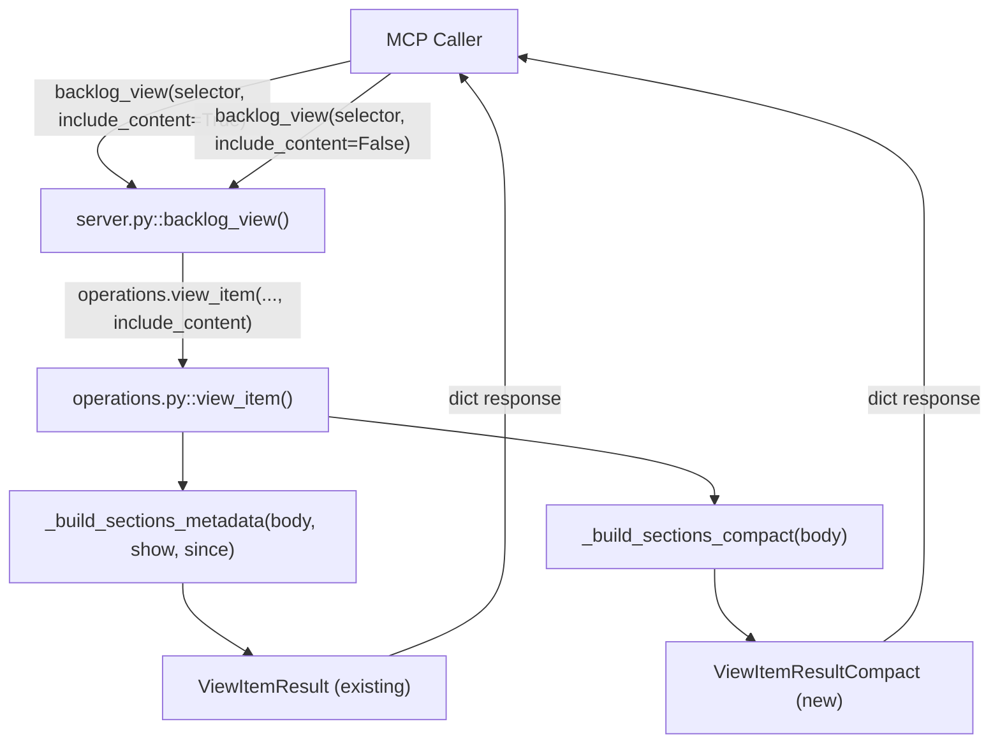

# Architecture Spec: Progressive Disclosure for backlog_view

**Issue**: #987
**Type**: Refactor (non-breaking addition)
**Scope**: Phase 1 only (add `include_content` parameter and `ViewItemResultCompact` model)

## 1. Executive Summary

Add an `include_content: bool = True` parameter to `backlog_view()` that controls whether full entry content is included in the response. When `False`, the tool returns a `ViewItemResultCompact` model containing all metadata fields plus a `sections_metadata` list with section names and entry counts -- without the `body` field or entry content. Default `True` preserves backward compatibility; all existing callers and tests continue working without modification.

Three files change: `models.py` (new model + TypedDict), `server.py` (new parameter), `operations.py` (conditional assembly). Two test files get new test cases.

## 2. Architecture Overview



**Data flow**:

1. `server.py::backlog_view()` receives `include_content` parameter (default `True`)
2. Passes it through to `operations.view_item()`
3. `view_item()` branches:
   - `include_content=True`: existing path -- `ViewItemResult` with `body`, `sections` (full entries)
   - `include_content=False`: new path -- `ViewItemResultCompact` with `sections_metadata` (counts only), no `body`

## 3. Technology Stack

No new dependencies. This change uses:

- **Pydantic BaseModel** (already in use) for `ViewItemResultCompact`
- **TypedDict** (already in use) for `SectionMetadata`
- **FastMCP 3.x** parameter injection via `Annotated[..., Field(...)]` (existing pattern in `server.py`)

## 4. Component Design

### 4.1 models.py -- New Types

**File**: `plugins/development-harness/backlog_core/models.py`

Add after `ViewItemResult` (line ~505):

```python
class SectionMeta(TypedDict):
    """Compact section descriptor without entry content."""

    name: str
    """Section heading text (e.g. 'Groomed (2026-03-22)')."""

    num_entries: int
    """Count of non-struck (active) entries in this section."""

    num_struck: int
    """Count of struck-through entries in this section."""


class ViewItemResultCompact(BaseModel):
    """Compact view of a backlog item -- metadata and section inventory only.

    Returned by ``view_item()`` when ``include_content=False``. Contains all
    metadata fields from ``ViewItemResult`` except ``body`` and ``sections``.
    Instead provides ``sections_metadata`` -- a list of section names with
    entry counts.
    """

    title: str = ""
    priority: str = ""
    description: str = ""
    source: str = ""
    added: str = ""
    plan: str = ""
    issue: str = ""
    file_path: str = ""
    groomed: bool = False
    status: str = ""
    number: int | None = None
    state: str = ""
    labels: list[str] = Field(default_factory=list)
    milestone: str = ""
    sections_metadata: list[SectionMeta] = Field(default_factory=list)
```

**Design decisions**:

- `SectionMeta` is a `TypedDict` (not a Pydantic model) because it is a simple data carrier returned inside a list. This matches the existing pattern where `sections` values are plain dicts.
- `ViewItemResultCompact` deliberately omits `body: str` and `sections: dict` -- these are the expensive fields. Their absence is the signal to callers that this is a compact response.
- All metadata fields are duplicated from `ViewItemResult` rather than using inheritance. Inheritance would couple the two models; if `ViewItemResult` gains a field, the compact model should not automatically inherit it without explicit review.

### 4.2 server.py -- Parameter Addition

**File**: `plugins/development-harness/backlog_core/server.py`

Modify `backlog_view()` signature (line ~271):

```python
async def backlog_view(
    selector: Annotated[str, Field(description="Item selector: GitHub issue URL, #N, bare number, or title substring")],
    include_content: Annotated[
        bool,
        Field(
            description=(
                "When True (default), returns full body and section entries. "
                "When False, returns metadata and section inventory only "
                "(section names with entry counts, no body or entry content)."
            )
        ),
    ] = True,
    offset: Annotated[int, Field(ge=0, description="Skip N entry blocks from body start (for pagination)")] = 0,
    limit: Annotated[int, Field(ge=0, description="Show at most N entry blocks (0 = all, no truncation)")] = 0,
    show: Annotated[
        str | None,
        Field(description="Entry filter: 'all', 'last', 'first', 'struck', or integer N (first N active entries)"),
    ] = None,
    since: Annotated[
        str | None, Field(description="ISO date/datetime. Only entries at or after this timestamp are included.")
    ] = None,
) -> dict:
```

Update the `operations.view_item` call to pass `include_content`:

```python
result = await asyncio.to_thread(
    operations.view_item,
    selector=selector,
    offset=offset,
    limit=limit,
    show=parsed_show,
    since=since,
    include_content=include_content,
    output=out,
)
```

**Parameter placement**: `include_content` is placed as the second parameter (after `selector`, before `offset`) because it changes the response shape -- a more fundamental choice than pagination/filtering parameters.

### 4.3 operations.py -- Routing Logic

**File**: `plugins/development-harness/backlog_core/operations.py`

#### 4.3.1 view_item() signature change

Add `include_content: bool = True` parameter:

```python
def view_item(
    selector: str,
    repo: str = "",
    offset: int = 0,
    limit: int = 0,
    show: str | int | None = None,
    since: str | None = None,
    include_content: bool = True,
    output: Output | None = None,
) -> dict[str, str | int | bool | list[str] | dict | None]:
```

#### 4.3.2 Routing logic in view_item()

Replace the current body/sections/pagination block (lines ~1472-1481) with:

```python
data = result.model_dump()

if include_content:
    # Full content path (existing behavior)
    body = data.get("body", "")
    if body:
        data["sections"] = _build_sections_metadata(body, parsed_show, since)
    if body and (offset > 0 or limit > 0):
        _paginate_body(data, body, offset, limit)
else:
    # Compact path -- metadata + section inventory only
    body = data.pop("body", "")
    data.pop("sections", None)
    if body:
        data["sections_metadata"] = _build_sections_compact(body)
```

#### 4.3.3 New function: _build_sections_compact()

Add after `_build_sections_metadata()` (line ~1371):

```python
def _build_sections_compact(body: str) -> list[dict[str, str | int]]:
    """Extract section names and entry counts without parsing entry content.

    This is the lightweight counterpart to ``_build_sections_metadata()``.
    It parses section headers and counts entries but does not extract entry
    content, making it suitable for compact/metadata-only responses.

    Args:
        body: Full issue/item body text.

    Returns:
        List of dicts, each with ``name``, ``num_entries``, ``num_struck``.
    """
    section_re = re.compile(r"^### (.+?)$", re.MULTILINE)
    section_headers = list(section_re.finditer(body))

    result: list[dict[str, str | int]] = []
    for i, hdr in enumerate(section_headers):
        sec_name = hdr.group(1).strip()
        start = hdr.end()
        end = section_headers[i + 1].start() if i + 1 < len(section_headers) else len(body)
        sec_body = body[start:end]
        entries = parse_entries(sec_body, show="all")
        active_count = sum(1 for e in entries if not e.struck)
        struck_count = sum(1 for e in entries if e.struck)
        result.append({"name": sec_name, "num_entries": active_count, "num_struck": struck_count})
    return result
```

**Note on Phase 3 optimization**: In Phase 1, `_build_sections_compact()` still calls `parse_entries()` to get accurate counts. Phase 3 would replace this with a regex-only count that avoids parsing entry content entirely. This is intentional -- Phase 1 prioritizes correctness and minimal code change over performance.

## 5. Data Architecture

### 5.1 Response Shape: include_content=True (unchanged)

```python
{
    "title": str,
    "priority": str,
    "description": str,
    "source": str,
    "added": str,
    "plan": str,
    "issue": str,
    "file_path": str,
    "groomed": bool,
    "status": str,
    "number": int | None,
    "state": str,
    "body": str,                    # Full body text
    "labels": list[str],
    "milestone": str,
    "sections": {                   # Full section data
        "Section Name": {
            "num_entries": int,
            "num_struck": int,
            "entries": [{"id": str, "struck": bool, "content": str}]
        }
    },
    "messages": list[str],
    "warnings": list[str],
}
```

### 5.2 Response Shape: include_content=False (new)

```python
{
    "title": str,
    "priority": str,
    "description": str,
    "source": str,
    "added": str,
    "plan": str,
    "issue": str,
    "file_path": str,
    "groomed": bool,
    "status": str,
    "number": int | None,
    "state": str,
    # NO "body" key
    "labels": list[str],
    "milestone": str,
    "sections_metadata": [          # Compact section inventory
        {"name": str, "num_entries": int, "num_struck": int}
    ],
    "messages": list[str],
    "warnings": list[str],
}
```

**Key differences**:

- `body` key is absent (not empty string -- absent)
- `sections` key is absent
- `sections_metadata` key is present (list of dicts, not nested dict)

## 6. Security Architecture

No security implications. This change adds a read-only response mode to an existing read-only tool. No new credentials, no new external calls, no new file access patterns.

## 7. Testing Architecture

### 7.1 Test File: `plugins/development-harness/tests/test_backlog_core_server.py`

**New tests**:

```python
async def test_backlog_view_compact_mode_omits_body():
    """include_content=False response has no 'body' key and no 'sections' key."""

async def test_backlog_view_compact_mode_includes_sections_metadata():
    """include_content=False response has 'sections_metadata' list with name/count dicts."""

async def test_backlog_view_default_includes_content():
    """Default call (no include_content arg) returns body and sections -- backward compat."""
```

**Existing test update**:

- `test_backlog_view_success_returns_item_detail()` -- add assertion that `body` key is present (documents current contract explicitly)

### 7.2 Test File: `plugins/development-harness/tests/test_scenarios.py`

**New scenario**:

- Scenario C1: `backlog_view(selector=..., include_content=False)` returns compact response with `sections_metadata`

### 7.3 Coverage Requirements

- All 15 existing tests pass without modification (backward compatibility gate)
- 3 new unit tests for compact mode
- 1 new scenario test for compact mode pagination interaction
- Target: 100% branch coverage on the new `include_content` conditional in `view_item()`

### 7.4 Test Pattern

Tests should mock `operations.view_item` at the server layer and test the actual function at the operations layer. Follow existing patterns in `test_backlog_core_server.py`:

```python
@pytest.fixture
def mock_view_item(monkeypatch):
    """Mock operations.view_item to return a known ViewItemResult."""
    # ... existing fixture pattern
```

For compact mode tests, the mock should return a result that includes body and sections, then the test asserts that `include_content=False` strips them from the response.

## 8. Distribution Architecture

No distribution changes. This is an internal refactor of an existing MCP server tool within the `development-harness` plugin.

## 9. Architectural Decisions (ADRs)

### ADR-1: Separate Model vs. Optional Fields

**Decision**: Create `ViewItemResultCompact` as a separate model rather than making `body` and `sections` optional on `ViewItemResult`.

**Context**: Two approaches were considered:
- (A) Add `body: str | None = None` and `sections: dict | None = None` to `ViewItemResult`
- (B) Create `ViewItemResultCompact` without those fields

**Rationale**: Option B chosen because:
1. Type safety -- callers handling compact responses get a type that cannot have `body`, preventing accidental access
2. Schema clarity -- MCP tool schema documents two distinct response shapes
3. No mutation of existing model -- `ViewItemResult` contract unchanged
4. Explicit over implicit -- `None` body is ambiguous (empty item? compact mode?); absent key is unambiguous

### ADR-2: `_build_sections_compact()` as Separate Function

**Decision**: Create a new `_build_sections_compact()` function rather than adding an `include_content` parameter to `_build_sections_metadata()`.

**Context**: The existing `_build_sections_metadata()` has complex logic for `show` and `since` filtering. Adding `include_content` would require branching inside the entry assembly loop.

**Rationale**:
1. Single Responsibility -- compact mode does not need `show` or `since` filtering (it returns all sections)
2. Simpler Phase 3 optimization -- the compact function can be independently optimized to skip `parse_entries()` without touching the full-content path
3. No risk of breaking existing behavior -- `_build_sections_metadata()` is untouched

### ADR-3: Body Key Absent vs. Empty String

**Decision**: In compact mode, the `body` key is absent from the response dict (via `data.pop("body", "")`), not set to empty string.

**Rationale**:
1. Callers can distinguish compact mode from an empty item using `"body" in response`
2. Prevents callers from accidentally operating on an empty body
3. Consistent with the "No Invented Limits" principle -- we are not truncating, we are not returning; the caller knows to request full content if needed

## 10. Scalability Strategy

### Phase 1 (this spec): Correct behavior, minimal change

- `_build_sections_compact()` still calls `parse_entries()` -- correct counts, not yet optimized
- Response size reduction comes from omitting body text and entry content from the serialized dict

### Phase 3 (future): Performance optimization

- Replace `parse_entries()` in `_build_sections_compact()` with regex-only entry counting
- Skip body text extraction entirely when `include_content=False`
- Expected reduction: 53K+ tokens to under 2K tokens for heavily-groomed items

No async changes needed -- `view_item()` is already run via `asyncio.to_thread()` in the server layer.

## Summary of Changes

| File | Change | Lines |
|------|--------|-------|
| `backlog_core/models.py` | Add `SectionMeta` TypedDict + `ViewItemResultCompact` model | ~30 |
| `backlog_core/server.py` | Add `include_content` parameter to `backlog_view()`, pass to `view_item()` | ~10 |
| `backlog_core/operations.py` | Add `include_content` to `view_item()` signature, routing logic, `_build_sections_compact()` | ~35 |
| `tests/test_backlog_core_server.py` | 3 new tests + 1 assertion addition | ~40 |
| `tests/test_scenarios.py` | 1 new scenario (C1) | ~15 |
| **Total** | | **~130** |
