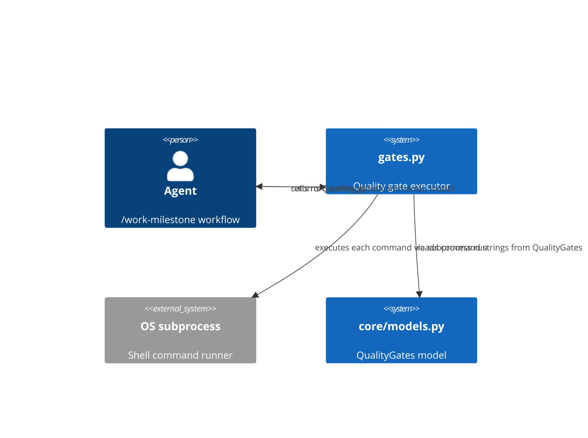
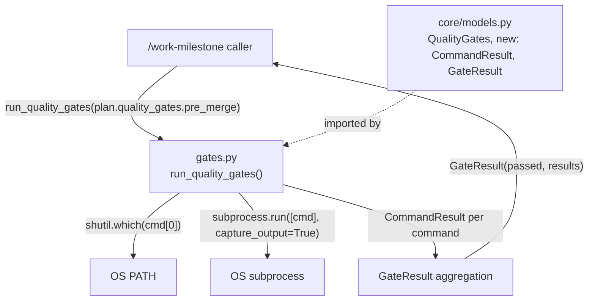

# Architecture Spec: Quality Gates Runner

**Slug**: `quality-gates-runner`
**Story**: GitHub issue #922
**Feature context**: [./feature-context-quality-gates-runner.md](./feature-context-quality-gates-runner.md)

---

## 1. Executive Summary

A single new module — `dispatch_schema/gates.py` — adds structured quality gate execution to the
existing `dispatch_schema` package. The module defines two Pydantic result models
(`CommandResult`, `GateResult`) and one public function (`run_quality_gates`). It slots into the
established package pattern: models in `core/models.py`, logic in a purpose-named module,
re-exported from `__init__.py`. No new dependencies are introduced. The function is a library
call, not an MCP tool.

---

## 2. Architecture Overview

### C4 Context



### C4 Container



---

## 3. Technology Stack

| Layer | Choice | Justification |
|---|---|---|
| Language | Python 3.11+ | Required by project; `shlex`, `subprocess`, `shutil` are stdlib |
| Data models | Pydantic BaseModel | Matches existing `core/models.py` — `CommandResult` and `GateResult` follow the same `ConfigDict(populate_by_name=True)` pattern |
| Subprocess | stdlib `subprocess.run` | Already used in this project; `capture_output=True` + list args is the established safe pattern |
| Command splitting | stdlib `shlex.split` | Safe tokenisation of shell-style strings without `shell=True` |
| Command discovery | stdlib `shutil.which` | Matches architecture-spec-patterns.md §Integration Patterns; raises `FileNotFoundError` with actionable message |
| Testing | pytest 8+, pytest-mock | Matches project testing stack; subprocess mocked via `pytest-mock` |
| Distribution | Package module (no PEP 723) | gates.py is a library module inside an existing package, not a standalone script |

---

## 4. Component Design

### 4.1 New file: `dispatch_schema/gates.py`

**Purpose**: Execute a list of shell command strings via subprocess, capture results, return a
structured `GateResult`.

**Dependencies**: `shlex`, `shutil`, `subprocess` (stdlib); `pydantic` (existing dep);
`dispatch_schema.core.models.CommandResult`, `dispatch_schema.core.models.GateResult`
(added in §5).

**Public interface**:

```python
from __future__ import annotations

import shlex
import shutil
import subprocess
from enum import StrEnum
from pathlib import Path

from dispatch_schema.core.models import CommandResult, GateResult, GateRunMode


def run_quality_gates(
    commands: list[str],
    *,
    mode: GateRunMode = GateRunMode.FAIL_FAST,
    cwd: Path | None = None,
) -> GateResult: ...
```

**Behaviour contract**:

1. For each command string in `commands`:
   a. Call `shlex.split(command)` to tokenise.
   b. Call `shutil.which(tokens[0])` to locate the executable.
   c. If `which` returns `None`: produce a `CommandResult` with `exit_code=127`,
      `stdout=""`, `stderr=f"command not found: {tokens[0]}"`, `passed=False`.
      Do NOT raise — record and apply mode logic.
   d. Replace `tokens[0]` with the resolved absolute path from `which`.
   e. Call `subprocess.run(tokens, capture_output=True, text=True, cwd=cwd)`.
   f. Produce `CommandResult` from the `CompletedProcess`.
2. In `FAIL_FAST` mode: stop after the first `CommandResult` with `passed=False`.
   Return a `GateResult` containing only the results collected so far.
3. In `RUN_ALL` mode: collect all `CommandResult` values regardless of individual pass/fail.
4. `GateResult.passed` is `True` iff every `CommandResult.passed` is `True`.

**Error handling boundary**: `subprocess.run` may raise `OSError` if the resolved path
becomes invalid after `which` succeeds (race condition). This exception propagates to the
caller — it is a bug condition, not an expected gate failure.

### 4.2 Modified file: `dispatch_schema/core/models.py`

Add three new definitions after `QualityGates`:

- `GateRunMode` (StrEnum)
- `CommandResult` (BaseModel)
- `GateResult` (BaseModel)

See §5 for full schema.

### 4.3 Modified file: `dispatch_schema/__init__.py`

Re-export the new public symbols:

```python
from dispatch_schema.core.models import CommandResult, GateResult, GateRunMode
from dispatch_schema.gates import run_quality_gates
```

Add to `__all__`: `"CommandResult"`, `"GateResult"`, `"GateRunMode"`, `"run_quality_gates"`.

---

## 5. Data Architecture

### 5.1 `GateRunMode` — add to `dispatch_schema/core/models.py`

```python
class GateRunMode(StrEnum):
    """Execution strategy for a quality gate run."""

    FAIL_FAST = "fail-fast"
    """Stop after the first failing command."""

    RUN_ALL = "run-all"
    """Run all commands and collect all results."""
```

### 5.2 `CommandResult` — add to `dispatch_schema/core/models.py`

```python
class CommandResult(BaseModel):
    """Result of executing one gate command."""

    model_config = ConfigDict(populate_by_name=True, use_enum_values=True)

    command: str = Field(..., description="Original command string as declared in the dispatch plan.")
    exit_code: int = Field(..., description="Process exit code. 127 when command was not found.")
    stdout: str = Field(default="")
    stderr: str = Field(default="")
    passed: bool = Field(..., description="True iff exit_code == 0.")
```

**Validation rule**: `passed` must equal `exit_code == 0`. This is a computed value — the
implementation sets it; do not make it a validator that can be overridden by a caller.

### 5.3 `GateResult` — add to `dispatch_schema/core/models.py`

```python
class GateResult(BaseModel):
    """Aggregate result of a quality gate run."""

    model_config = ConfigDict(populate_by_name=True, use_enum_values=True)

    passed: bool = Field(..., description="True iff every CommandResult.passed is True.")
    results: list[CommandResult] = Field(default_factory=list)
    mode: GateRunMode = Field(..., description="Execution mode used for this run.")
```

**Invariants**:

- `passed` is `True` iff `all(r.passed for r in results)`.
- In `FAIL_FAST` mode, `len(results)` equals the index of the first failure + 1 (or
  `len(commands)` if all passed).
- In `RUN_ALL` mode, `len(results)` always equals `len(commands)`.
- An empty `commands` list produces `GateResult(passed=True, results=[], mode=mode)`.

### 5.4 Relationship to existing `QualityGates` model

`QualityGates` (already in `core/models.py`) holds `pre_merge: list[str]` and
`post_merge: list[str]`. The caller passes one of those lists to `run_quality_gates`.
`GateResult` and `CommandResult` are the return types — they are not embedded in
`QualityGates`.

---

## 6. Security Architecture

- **No `shell=True`**: `subprocess.run` receives a list of tokens produced by `shlex.split`.
  This prevents shell injection from maliciously crafted command strings in the YAML.
- **`shutil.which` path resolution**: Resolves to absolute path before execution. Eliminates
  PATH-relative ambiguity at execution time.
- **`cwd` parameter**: Accepts `Path | None`. When `None`, inherits the process working
  directory. The caller is responsible for passing a safe, validated path.
- **No credential handling**: Gate commands are assumed to operate on the repository working
  tree. Any secrets required by those commands come from the process environment — gates.py
  does not handle or log environment variables.

Security checklist:

- [x] Command injection prevention (`shlex.split` + list arg to `subprocess.run`)
- [x] Path traversal prevention (commands are tool invocations, not file paths; `cwd` validated by caller)
- [x] No `shell=True`
- [x] No secrets in logs (`stdout`/`stderr` captured but not logged by gates.py itself)
- [ ] Rate limiting — not applicable (gate runs are sequential, not concurrent API calls)
- [ ] Certificate validation — not applicable (no network calls)

---

## 7. Testing Architecture

### Strategy

Unit tests for `gates.py` mock `subprocess.run` and `shutil.which` via `pytest-mock`.
Integration tests (marked `@pytest.mark.integration`) run real commands in a temp directory.

### Test file location

```text
tests/
└── test_gates.py          # unit + integration tests for run_quality_gates
```

### Coverage requirements

- **Overall**: 80% line and branch (enforced via `fail_under=80`)
- **gates.py**: 95%+ — this is path-critical logic that gates merges
- All branches of `GateRunMode` (FAIL_FAST and RUN_ALL) must be exercised
- `command-not-found` branch (exit_code=127) must be covered

### Key test scenarios

| Scenario | Mode | Expected `GateResult.passed` |
|---|---|---|
| All commands exit 0 | FAIL_FAST | `True` |
| All commands exit 0 | RUN_ALL | `True` |
| First command exits non-zero | FAIL_FAST | `False`, `len(results)==1` |
| First command exits non-zero | RUN_ALL | `False`, `len(results)==N` |
| Second command exits non-zero | FAIL_FAST | `False`, `len(results)==2` |
| Command not found | FAIL_FAST | `False`, `exit_code==127` |
| Empty commands list | either | `True`, `len(results)==0` |

### pytest configuration (addition to existing `pyproject.toml`)

```toml
[tool.pytest.ini_options]
# existing options preserved; gates module added to coverage target
addopts = [
    "--cov=dispatch_schema",
    "--cov-report=term-missing",
    "-v",
]
markers = [
    "integration: marks tests requiring real subprocess execution",
]

[tool.coverage.report]
show_missing = true
fail_under = 80
```

---

## 8. Distribution Architecture

`gates.py` is a module within the existing `dispatch_schema` package. It follows
**Strategy 2 (Python Package)** from `architecture-spec-patterns.md` — it is not a standalone
script and requires no PEP 723 metadata.

The package is already installed as a development dependency of the `development-harness`
plugin. No additional packaging changes are required. The new module is discoverable
immediately upon file creation.

---

## 9. Architectural Decisions (ADRs)

### ADR-001: Library function, not MCP tool

**Decision**: `run_quality_gates` is a Python function, not an MCP tool endpoint.

**Rationale**: The consumer (`/work-milestone`) runs in the same process context and calls
Python functions directly. Exposing this as an MCP tool would require a running server,
network serialisation, and async transport for a synchronous blocking operation with no
benefits. The existing `dispatch_schema` public API uses functions (e.g., `read_dispatch_plan`,
`validate_plan_integrity`) — this follows that established pattern.

**Consequences**: Callers must import from `dispatch_schema`; the function is not callable from
an MCP client without wrapping.

### ADR-002: Models in `core/models.py`, not in `gates.py`

**Decision**: `CommandResult`, `GateResult`, and `GateRunMode` are defined in
`core/models.py`, not in `gates.py`.

**Rationale**: The existing package convention places all Pydantic models in `core/models.py`
and re-exports them from `__init__.py`. Scattering models across modules would break the
single-import pattern (`from dispatch_schema import CommandResult`). Callers who need to type-
hint against `GateResult` should not need to know where in the package it lives.

**Consequences**: `gates.py` imports from `dispatch_schema.core.models`. Adding `gates.py`
tests requires importing models from the same path.

### ADR-003: `command-not-found` as a `CommandResult`, not a raised exception

**Decision**: When `shutil.which` returns `None`, produce a `CommandResult` with
`exit_code=127` and `passed=False` rather than raising `FileNotFoundError`.

**Rationale**: A missing command is an expected gate failure (e.g., a tool that was not
installed in CI). The caller already handles `GateResult.passed=False` — it does not need a
separate exception branch. Exit code 127 is the POSIX convention for "command not found" and
is meaningful to consumers reading the result. The error message in `stderr` provides the
actionable detail.

**Exception to this ADR**: `OSError` from `subprocess.run` itself (after `which` succeeded)
propagates — that is a runtime environment failure, not a gate check failure.

### ADR-004: `shlex.split` for command tokenisation

**Decision**: Gate command strings are tokenised with `shlex.split`, not Python `str.split`.

**Rationale**: Commands in the dispatch YAML may contain quoted arguments
(e.g., `pytest tests/ -k "not slow"`). `str.split` would break quoted arguments into separate
tokens. `shlex.split` handles POSIX quoting correctly. `shell=True` is explicitly prohibited
by project security policy.

---

## 10. Scalability Strategy

### Sequential execution (current scope)

Gate commands run sequentially. This is the correct default because:

- Gates are typically fast (lint, test, check commands)
- Ordering matters: a format check should precede a type check
- Sequential output is easier to reason about in CI logs

### Async extension (out of scope for #922)

If future requirements call for parallel gate execution, the function signature accommodates
this via an `async` variant:

```python
async def run_quality_gates_async(
    commands: list[str],
    *,
    mode: GateRunMode = GateRunMode.FAIL_FAST,
    cwd: Path | None = None,
    max_concurrent: int = 4,
) -> GateResult: ...
```

`asyncio.create_subprocess_exec` with a `Semaphore(max_concurrent)` would replace
`subprocess.run`. The `GateResult` and `CommandResult` models are unchanged.

### Resource management

- `subprocess.run` is blocking; gates.py holds no open handles after each call returns.
- No connection pools, thread pools, or shared state — the function is stateless and
  re-entrant.
- Large stdout/stderr: `capture_output=True` buffers in memory. Gate commands are assumed
  to produce bounded output. If a gate command streams gigabytes (unlikely), the caller
  should impose a timeout via `subprocess.run(timeout=N)` — this can be added as an optional
  parameter in a follow-up.
