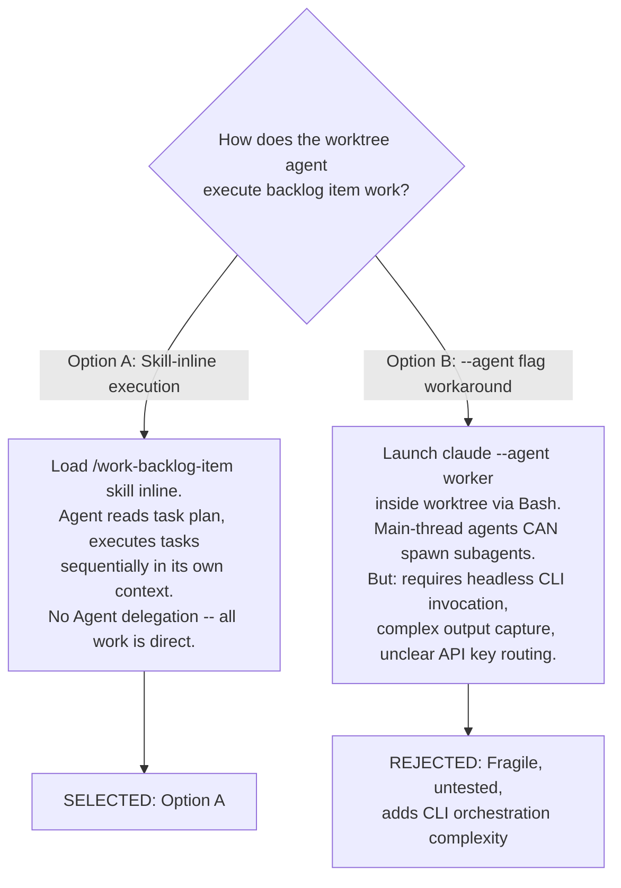
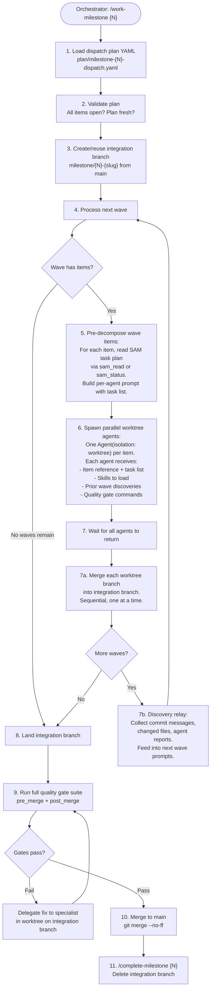
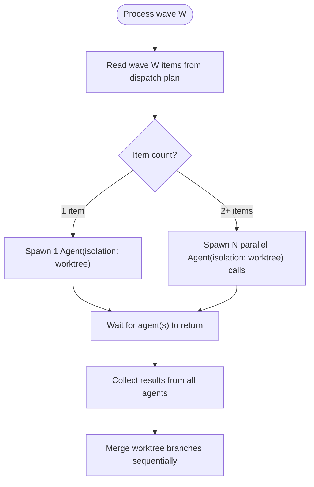
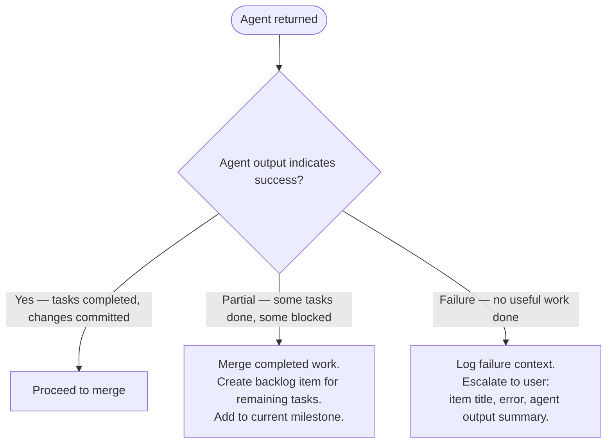
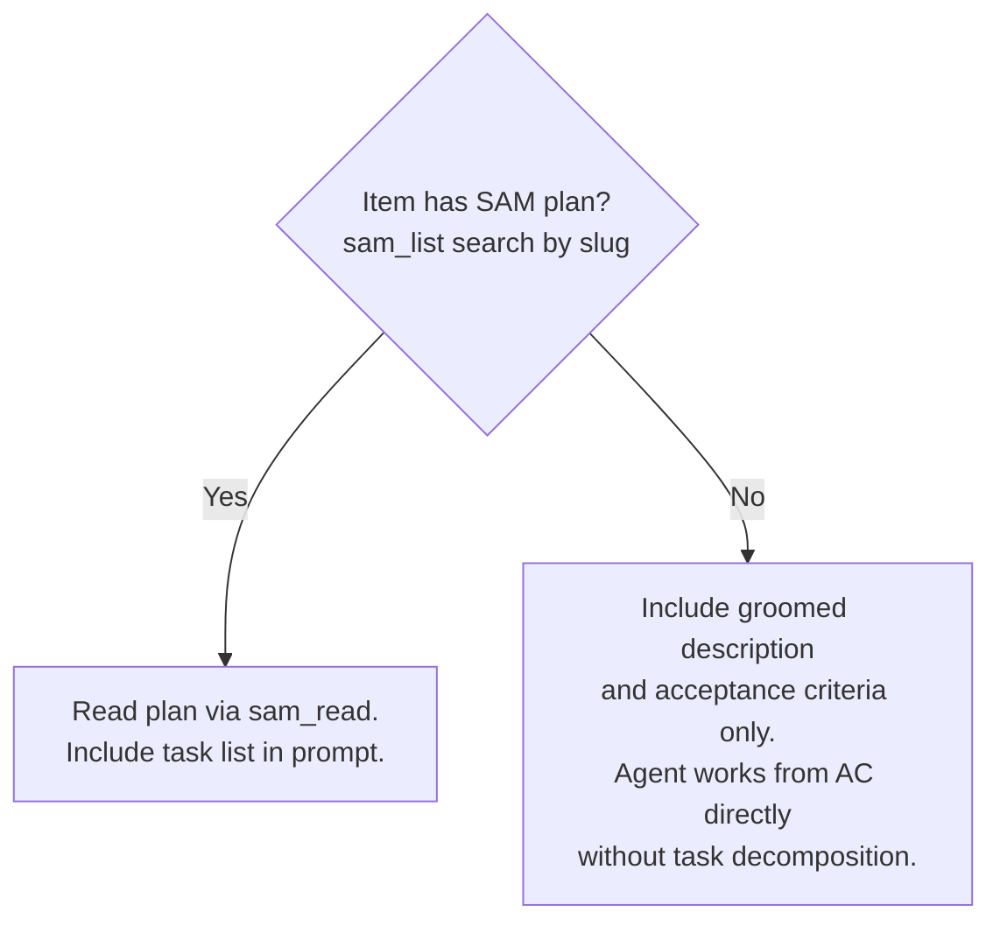
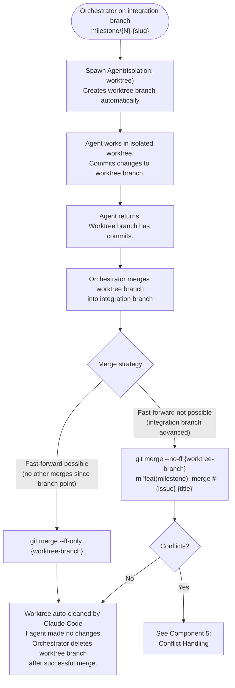
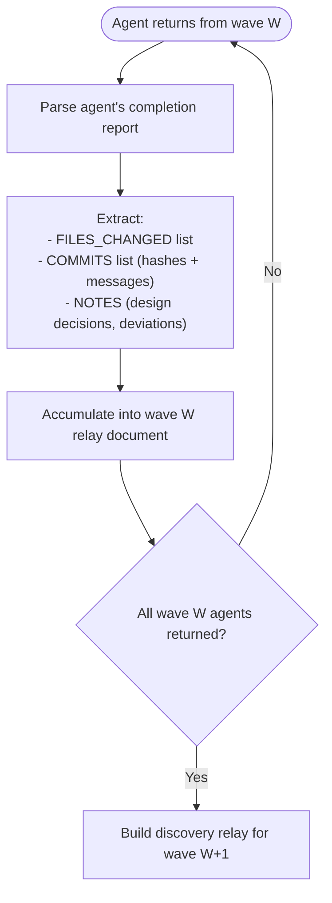
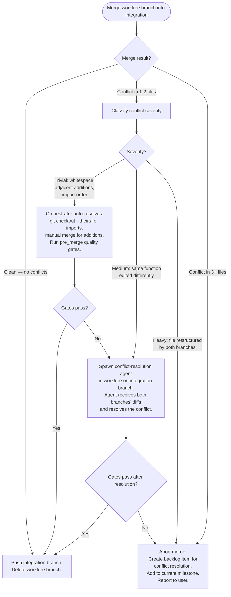
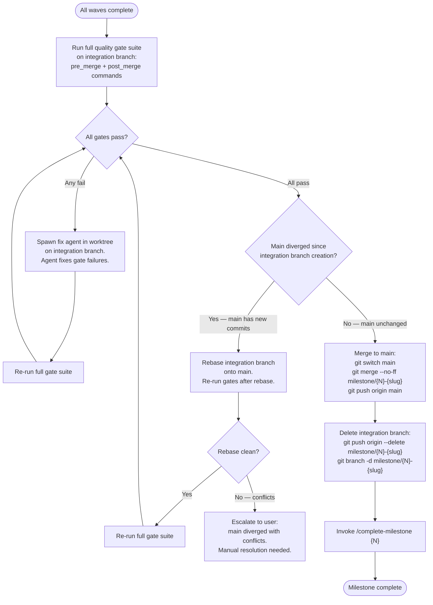

# Architecture Spec: Redesign /work-milestone from TeamCreate to Worktree Agents

**Backlog item**: #970
**Status**: Draft
**Date**: 2026-03-21

## Problem Statement

`/work-milestone` currently dispatches parallel workers via TeamCreate. Teammates lack the Agent tool (verified 2026-03-21 via ToolSearch and official docs: "No nested teams: teammates cannot spawn their own teams or teammates"). The SAM pipeline (`/implement-feature` -> `/start-task` -> Agent delegation per task) requires agent spawning. Teammates cannot run `/work-backlog-item --auto` because the internal SAM execution loop hits a hard wall on the first Agent delegation call.

## Critical Design Constraint: Subagent Nesting Prohibition

The official Claude Code docs state:

> "Subagents cannot spawn other subagents. If your workflow requires nested delegation, use Skills or chain subagents from the main conversation."

SOURCE: https://docs.anthropic.com/en/docs/claude-code/sub-agents.md (accessed 2026-03-21)

`Agent(isolation: "worktree")` spawns a **subagent** -- not a main-thread agent. Therefore worktree agents **cannot call the Agent tool**. This directly contradicts the backlog item's Expected Behavior point 6 ("Each worktree agent has full Agent tool access and can delegate to the SAM pipeline without restriction").

### Impact on Design

`/work-backlog-item --auto` internally invokes `/implement-feature`, which loops through SAM tasks and delegates each to a specialist agent via the Agent tool. A worktree subagent running `/work-backlog-item --auto` will fail on the first Agent delegation call.

### Resolution: Direct Execution Model

Each worktree agent must execute work **directly** rather than delegating through the SAM pipeline. Two approaches:



**Option A is selected.** The worktree agent loads required skills via its `skills` frontmatter field, reads the task plan directly, and executes each task inline. This is the same pattern teammates use successfully for direct file work -- the difference is that worktree agents get an isolated repository copy.

### What This Means for /work-backlog-item

The `/work-backlog-item --auto` skill cannot be used as-is inside worktree agents because it internally delegates to `/implement-feature` which uses Agent tool. Two sub-options:

1. **Refactor /work-backlog-item to detect context**: When running inside a subagent (no Agent tool available), execute tasks directly instead of delegating. This is out of scope per the constraint "The /work-backlog-item --auto skill is unchanged."

2. **Orchestrator decomposes before dispatch**: The orchestrator reads each item's task plan (via SAM MCP) before spawning the worktree agent. The orchestrator includes the task list in the worktree agent's prompt. The worktree agent executes tasks sequentially without needing `/work-backlog-item` or `/implement-feature`.

**Sub-option 2 is selected** -- it respects the constraint that `/work-backlog-item --auto` is unchanged and avoids modifying the SAM pipeline.

## Architecture Overview



### Key Differences from Current Design

| Aspect | Current (TeamCreate) | New (Worktree Agents) |
|---|---|---|
| Worker spawning | TeamCreate with N members | N parallel Agent(isolation: "worktree") calls |
| Worker capabilities | No Agent tool, no SAM delegation | No Agent tool, but direct task execution via skill loading |
| Inter-worker communication | SendMessage broadcasts | None -- agents are isolated; orchestrator relays between waves |
| Completion signaling | SendMessage COMPLETE to orchestrator | Agent call returns (synchronous from orchestrator's perspective) |
| Blocker handling | SendMessage to orchestrator, wait for reply | Agent cannot message orchestrator mid-flight; blockers cause agent failure, orchestrator retries or escalates |
| Merge coordination | Orchestrator holds merge slot, workers queue | Orchestrator merges sequentially after all wave agents return |
| Domain overlap detection | Peer-to-peer via SendMessage | Eliminated -- conflict groups in dispatch plan already serialize overlapping items into separate waves |

### Why Inter-Worker Communication Is Unnecessary

The dispatch plan produced by `/groom-milestone` already solves the coordination problem:

- **Conflict groups** serialize items that touch overlapping files into separate waves
- **Wave ordering** ensures dependencies complete before dependents start
- **Discovery relay** (orchestrator-mediated) passes context between waves

TeamCreate's SendMessage-based peer coordination was designed to handle runtime overlap discovery. With proper pre-grooming (which `/groom-milestone` provides), runtime coordination is unnecessary. Items in the same wave are guaranteed non-overlapping by the conflict group analysis.

## Component 1: Wave Dispatch via Agent(isolation: "worktree")

For each wave in the dispatch plan, the orchestrator spawns one `Agent(isolation: "worktree")` call per item. All items in a wave launch simultaneously.

### Dispatch Flow



### Pre-Dispatch Preparation

Before spawning agents for a wave, the orchestrator prepares context for each item:

1. **Read SAM task plan**: If the item has a SAM plan (checked via `sam_status` or `sam_list`), read the full plan via `sam_read`. Extract the task list with acceptance criteria.

2. **Read backlog item**: Via `backlog_view(selector="#{issue}")`, extract the groomed description, acceptance criteria, and architect spec reference.

3. **Determine skills**: Read the item's SAM plan metadata for the `skills` field per task. Aggregate unique skill names across all tasks. These go into the agent prompt as `Skill()` invocations.

4. **Build agent prompt**: Assemble the prompt from template (see Component 2).

### Parallel Agent Invocation

The orchestrator invokes agents using the standard Agent tool:

```text
Agent(
  isolation: "worktree",
  prompt: "<assembled prompt for item>"
)
```

For waves with 2+ items, all Agent calls are made in the same tool-call block to enable parallel execution. The orchestrator waits for all to return before proceeding to merge.

### Wave Completion

A wave is complete when all Agent calls for that wave have returned (either successfully or with an error). There is no polling, no SendMessage monitoring. The Agent tool call is synchronous from the orchestrator's perspective.

If an agent returns an error or reports failure in its output:



## Component 2: Worktree Agent Prompt Template

Each worktree agent receives a prompt assembled by the orchestrator. The prompt must contain everything the agent needs to execute independently -- no mid-flight communication is possible.

### Template Structure

```text
## Your Task

You are executing backlog item #{issue}: "{title}" inside an isolated git worktree
on the integration branch `{integration_branch}`.

You have NO Agent tool -- you cannot delegate to subagents. Execute all work directly.
Commit your changes frequently using conventional commits: `type(scope): description`.

## Item Description

{groomed_description}

## Acceptance Criteria

{acceptance_criteria}

## Task Plan

{task_list_from_sam_plan_or_inline}

Execute each task sequentially. For each task:
1. Read the task's acceptance criteria
2. Implement the required changes
3. Run the task's verification commands (if any)
4. Commit the changes

## Skills to Load

{for each skill_name in skills_list}
Load the following skill before starting work:
- Skill(skill="{skill_name}")
{end for}

## Architecture Reference

{architect_spec_path — agent reads this file directly}

## Quality Gates

Before signaling completion, run these commands and fix any failures:
{for each command in pre_merge_gates}
- `{command}`
{end for}

## Prior Wave Context

{discovery_relay_content — empty for wave 1}

## Completion Protocol

When all tasks are complete and quality gates pass:
1. Ensure all changes are committed
2. Output a structured completion report:

   ```text
   STATUS: COMPLETE
   BRANCH: {your worktree branch name}
   TASKS_COMPLETED: {count}
   FILES_CHANGED: {list of files}
   COMMITS: {list of commit hashes and messages}
   NOTES: {any design decisions or deviations}
   ```

If you encounter a blocker you cannot resolve:
1. Complete as many tasks as possible
2. Commit all completed work
3. Output:

   ```text
   STATUS: PARTIAL
   BRANCH: {your worktree branch name}
   TASKS_COMPLETED: {count of completed}
   TASKS_BLOCKED: {count and IDs of blocked tasks}
   BLOCKER: {description of what blocked progress}
   FILES_CHANGED: {list of files}
   COMMITS: {list of commit hashes and messages}
   ```
```

### Template Variables

| Variable | Source | How Orchestrator Obtains It |
|---|---|---|
| `issue` | Dispatch plan wave item | `wave.items[i].issue` |
| `title` | Dispatch plan wave item | `wave.items[i].title` |
| `integration_branch` | Dispatch plan | `milestone.integration_branch` |
| `groomed_description` | Backlog MCP | `backlog_view(selector="#{issue}")` -> description section |
| `acceptance_criteria` | Backlog MCP | `backlog_view(selector="#{issue}")` -> acceptance criteria section |
| `task_list_from_sam_plan` | SAM MCP | `sam_read(plan="P{N}")` -> tasks with acceptance criteria |
| `skills_list` | SAM task metadata | Aggregated from `skills` field across all tasks in the plan |
| `architect_spec_path` | SAM plan or backlog item | Path to `plan/architect-{slug}.md` referenced in the plan |
| `pre_merge_gates` | Dispatch plan | `quality_gates.pre_merge` commands |
| `discovery_relay_content` | Orchestrator state | Collected from prior wave agent outputs (see Component 4) |

### When No SAM Plan Exists

Some backlog items may not have a SAM task plan (e.g., simple items that were groomed but not decomposed into SAM tasks). In this case:



The agent prompt template handles both cases. The `task_list_from_sam_plan_or_inline` variable is either the full SAM task list or a note saying "No task decomposition exists. Work directly from the acceptance criteria above."

## Component 3: Worktree Branch Lifecycle

### Worktree Creation

`Agent(isolation: "worktree")` automatically creates a temporary git worktree. Per the official docs: "Set to `worktree` to run the subagent in a temporary git worktree, giving it an isolated copy of the repository. The worktree is automatically cleaned up if the subagent makes no changes."

SOURCE: https://docs.anthropic.com/en/docs/claude-code/sub-agents.md (accessed 2026-03-21)

The worktree is created from the **current branch** of the orchestrator's working directory. The orchestrator must ensure it is on the integration branch before spawning worktree agents.

### Branch Flow



### Merge Order Within a Wave

When a wave has multiple items, all agents run in parallel and return independently. The orchestrator merges their branches **sequentially** in the order agents return:

1. First agent to return -> merge its branch into integration branch
2. Second agent to return -> rebase onto updated integration branch, then merge
3. Continue until all wave branches are merged

This sequential merge ensures each merge sees the cumulative state. The first merge is always a fast-forward (no other changes since branch point). Subsequent merges may require a merge commit.

### Branch Naming

Worktree branches are created automatically by Claude Code. The orchestrator does not control the branch name. The agent's completion report includes `BRANCH: {name}` so the orchestrator knows which branch to merge.

### Post-Merge Cleanup

After a successful merge:

```bash
# Delete the worktree branch (local only -- never pushed to origin)
git branch -d {worktree-branch}
```

Worktree branches are local-only. They are never pushed to origin. The integration branch is the only branch pushed to origin.

## Component 4: Discovery Relay Between Waves

Between waves, the orchestrator collects outputs from completed agents and feeds relevant context into the next wave's agent prompts. This replaces the TeamCreate SendMessage broadcasts.

### What Gets Relayed



### Relay Document Format

The orchestrator builds a markdown document summarizing prior wave outcomes. This is injected into the `discovery_relay_content` template variable for the next wave's agent prompts.

```text
## Prior Wave Results

### Wave 1 Results

#### Item: #{issue1} — {title1}
- Status: COMPLETE
- Files changed: {file_list}
- Key commits:
  - {hash}: {message}
  - {hash}: {message}
- Design notes: {notes_if_any}

#### Item: #{issue2} — {title2}
- Status: COMPLETE
- Files changed: {file_list}
- Key commits:
  - {hash}: {message}
- Design notes: {notes_if_any}

### Wave 2 Results
...
```

### Why This Is Sufficient

The dispatch plan's conflict group analysis ensures items in the same wave do not overlap. Therefore:

- **Same-wave agents** do not need to know about each other (no overlapping files)
- **Cross-wave agents** need to know what changed in prior waves only when their item has a `depends_on` relationship or shares a `conflict_group` with a prior-wave item

The relay document provides this cross-wave awareness. The orchestrator can optionally filter the relay to include only items relevant to each agent (those in the same conflict group or dependency chain), but including the full relay is simpler and adds minimal prompt overhead.

### Relay Size Management

For milestones with many waves and items, the relay document could grow large. Mitigation:

- Include only FILES_CHANGED and NOTES for items not in the current agent's dependency chain
- Include full COMMITS for items the current agent directly depends on
- Cap the relay at the most recent 3 waves if the milestone has 5+ waves

## Component 5: Conflict Handling

The existing merge-queue-protocol.md conflict classification is retained with modifications for the new dispatch model.

### Conflict Prevention (Pre-Dispatch)

The primary conflict prevention mechanism is the dispatch plan itself:

- Items sharing a conflict group are serialized into separate waves
- Items with `depends_on` are ordered into later waves
- Items in the same wave are guaranteed non-overlapping by `/groom-milestone` analysis

This means **merge conflicts within a wave should be rare**. They can still occur when:

1. Two items modify a shared generated file (e.g., `__init__.py` re-exports)
2. The conflict group analysis missed an indirect overlap
3. Both items add to the same section of a file (adjacent-line additions)

### Conflict Resolution Strategy



### Key Difference from Current Design

The current merge-queue-protocol uses `assign_back` with SendMessage to notify workers and create PRs. The new design:

- **No assign_back to workers** -- worktree agents have already terminated when merging happens
- **No PR creation for worktree branches** -- branches are local-only
- **Conflict resolution agent** -- for medium conflicts, a new worktree agent is spawned to resolve the conflict in-place on the integration branch
- **Backlog item creation** -- for heavy conflicts, a new backlog item is created and added to the milestone for the next wave or a follow-up session

### Conflict Resolution Agent Prompt

For medium conflicts, the orchestrator spawns a resolution agent:

```text
You are resolving a merge conflict on the integration branch.

Branch being merged: {worktree_branch}
Integration branch: {integration_branch}

Conflicting files:
{list_of_conflicting_files}

Diff from worktree branch:
{git diff integration_branch...worktree_branch}

Context:
- Item #{issue_a}: {title_a} — changed {files_a}
- Item #{issue_b}: {title_b} — changed {files_b}

Resolve the conflicts, preferring the worktree branch's changes where
both approaches are valid. Run quality gates after resolution:
{pre_merge_gate_commands}
```

## Component 6: Completion and Landing

After all waves complete and all worktree branches are merged into the integration branch, the orchestrator lands the integration branch to main.

### Landing Flow



### Merge Commit Message

The merge to main uses:

```text
feat(milestone): complete milestone {N} — {title}

Closes #{milestone_tracking_issue_if_any}

Items completed:
- #{issue1}: {title1}
- #{issue2}: {title2}
...
```

This is the ONLY commit that may include `Fixes #N` or `Closes #N` trailers, consistent with the existing SAM workflow restriction.

## Component 7: Reference File Changes

### 7.1 team-member-protocol.md -> worktree-worker-protocol.md

**Rename**: `team-member-protocol.md` -> `worktree-worker-protocol.md`

**Sections to remove entirely:**

- M2 (Announce to Team via SendMessage) -- no team to announce to
- M3/M3a (Domain Overlap / Initial Alignment) -- handled by dispatch plan conflict groups
- M4a (State Broadcasts via SendMessage) -- no recipients
- M4b/M4c (Peer Overlap Alert / Runtime Alignment) -- no peers in same wave
- M5/M6/M7 (Blocker reporting via SendMessage) -- agent cannot message orchestrator mid-flight
- M10 (Signal Completion via SendMessage) -- agent returns directly
- M11/M12 (Await Merge Outcome / Assign Back) -- agent has terminated before merge
- State Broadcast Fields section -- no SendMessage payloads
- Design Decision Persistence section -- agent writes to files, not issue body
- Design Alignment Protocol -- no peers
- Blocker Types table -- blockers handled by agent failure + orchestrator retry

**Sections to retain (modified):**

- M1 (Setup) -- verify worktree is on correct branch, enable constant commits
- M4 (Execute Work) -- change from `/work-backlog-item --auto` to direct task execution
- M8 (Item Complete) -- completion check
- M9 (Pre-Verify) -- run quality gates, commit all changes
- Constant Commits Protocol -- retained as-is
- Domain Detection -- retained for informational context in agent prompt

**New sections to add:**

- Completion Report Format -- structured output for orchestrator parsing
- Blocker Handling -- complete what you can, report blocked tasks in completion report
- Skill Loading -- how the agent loads required skills at startup

### 7.2 merge-queue-protocol.md

**Changes:**

- Add note at the top: "Completion signaling is via Agent call return, not SendMessage COMPLETE. The orchestrator merges worktree branches after all wave agents return."
- Remove references to "Worker signals COMPLETE" and "SendMessage to worker" -- replace with "Agent returns" and "orchestrator processes return"
- Remove "Gate failure sent to worker via SendMessage" -- replace with "Orchestrator spawns fix agent"
- Retain all conflict classification logic unchanged
- Retain assign_back procedure but modify: no PR creation (branches are local), no SendMessage to workers; instead, create backlog item for next wave
- Retain quality gate commands section unchanged
- Retain integration branch landing section unchanged

### 7.3 dispatch-plan-schema.md

**No changes required.** The existing wave/item schema fields (`title`, `issue`, `priority`, `conflict_group`, `depends_on`) contain everything the orchestrator needs to build agent prompts. No new fields (e.g., `agent_name`, `isolation`) are needed because:

- Agent isolation mode is always `worktree` -- hardcoded in the orchestrator logic
- Agent type is not configurable per item -- all worktree agents use the same prompt template
- Skills are read from the SAM task plan, not the dispatch plan

### 7.4 local-workflow.md

**Add a forward reference** in the Phase 2 section clarifying the boundary:

```text
Note: Phase 2 describes the SAM task execution loop within a single backlog item
(/implement-feature -> /start-task per task). Milestone-level dispatch (multiple
backlog items in parallel across worktrees) is handled by /work-milestone, which
uses Agent(isolation: "worktree") per item -- not the SAM execution loop. See
plugins/development-harness/skills/work-milestone/SKILL.md.
```

### 7.5 work-milestone SKILL.md

**Complete rewrite of the dispatch flow** (Steps 4-7 and surrounding context):

- Remove all TeamCreate, SendMessage, teammate references
- Replace Step 5 (TeamCreate) with parallel Agent(isolation: "worktree") dispatch
- Replace Step 6 (Monitor via SendMessage) with "Wait for all agents to return"
- Replace Step 7 (Merge Queue with SendMessage coordination) with sequential merge of worktree branches
- Update Tools Used table: remove TeamCreate, SendMessage; add Agent(isolation: "worktree")
- Update Error Conditions: remove "Worker no heartbeat"; add "Agent returned with PARTIAL status"
- Update references section: team-member-protocol.md -> worktree-worker-protocol.md

## Revised Workflow Diagram

This replaces the current SKILL.md flowchart entirely.

```mermaid
flowchart TD
    Start(["Input: milestone number N"]) --> LoadPlan["Step 1: Load Dispatch Plan<br>Read plan/milestone-{N}-dispatch.yaml<br>Output: waves, conflict groups, quality gates"]

    LoadPlan --> Validate{"Step 2: Validate Plan<br>File exists?<br>All items still open?<br>Observable: file + backlog_list_issues(milestone=N)"}

    Validate -->|"Plan missing"| Block1(["BLOCKED — run /groom-milestone {N}"])
    Validate -->|"Items changed since groom"| Regroom["Re-run /groom-milestone {N}"]
    Validate -->|"Plan valid"| CreateBranch
    Regroom --> LoadPlan

    CreateBranch["Step 3: Create Integration Branch<br>github_branches create<br>milestone/{N}-{slug} from main.<br>Switch to integration branch locally."]

    CreateBranch --> WaveLoop["Step 4: Wave Dispatch Loop<br>Read next wave from dispatch plan"]

    WaveLoop --> WaveItems{"Wave has items?"}
    WaveItems -->|"No waves remain"| Land

    WaveItems -->|"Yes"| PreDecompose["Step 5: Pre-Decompose<br>For each item in wave:<br>- backlog_view for groomed description<br>- sam_read for task plan (if exists)<br>- Aggregate skills from task metadata<br>- Build agent prompt from template"]

    PreDecompose --> SpawnAgents["Step 6: Spawn Worktree Agents<br>For each item: Agent(isolation: worktree)<br>with assembled prompt.<br>All items in wave launch in parallel."]

    SpawnAgents --> WaitReturn["Step 7: Wait for All Agents<br>Agent calls are synchronous.<br>No polling, no SendMessage monitoring."]

    WaitReturn --> ParseResults["Step 7a: Parse Completion Reports<br>Extract STATUS, BRANCH, FILES_CHANGED,<br>COMMITS, NOTES from each agent."]

    ParseResults --> MergeLoop["Step 7b: Merge Worktree Branches<br>Sequential merge into integration branch.<br>One at a time, in return order."]

    MergeLoop --> MergeResult{"Any merge conflicts?"}
    MergeResult -->|"All clean"| WaveComplete
    MergeResult -->|"Trivial/Medium conflict"| Resolve["Auto-resolve or spawn<br>conflict-resolution agent"]
    Resolve --> ResolveGates{"Resolution gates pass?"}
    ResolveGates -->|"Yes"| WaveComplete
    ResolveGates -->|"No"| EscalateConflict["Create backlog item<br>for conflict resolution.<br>Add to milestone."]

    MergeResult -->|"Heavy conflict"| EscalateConflict

    WaveComplete["Step 7c: Wave Complete<br>All branches merged.<br>Delete worktree branches."]

    WaveComplete --> DiscoveryRelay["Step 7d: Discovery Relay<br>Build relay document from agent outputs.<br>Include in next wave prompts."]

    DiscoveryRelay --> PartialCheck{"Any agents returned PARTIAL?"}
    PartialCheck -->|"Yes"| HandlePartial["Create backlog items for<br>blocked tasks. Add to milestone.<br>They may dispatch in a later wave."]
    PartialCheck -->|"No"| NextWaveCheck

    HandlePartial --> NextWaveCheck{"More waves?"}
    NextWaveCheck -->|"Yes"| WaveLoop
    NextWaveCheck -->|"No"| Land

    Land["Step 8: Land Integration Branch<br>Run full quality gate suite<br>pre_merge + post_merge"]

    Land --> FinalResult{"Gates pass?"}
    FinalResult -->|"Fail"| FinalFix["Spawn fix agent in worktree<br>on integration branch."]
    FinalFix --> Land

    FinalResult -->|"Pass"| MergeMain["Step 9: Merge to Main<br>git switch main<br>git merge --no-ff milestone/{N}-{slug}<br>git push origin main"]

    MergeMain --> Complete["Step 10: Complete Milestone<br>/complete-milestone {N}.<br>Delete integration branch."]

    Complete --> Done(["Exit: milestone complete"])
```



## Constraints and Non-Goals

### Constraints

1. **Dispatch schema unchanged** -- No modifications to `dispatch_schema` models, readers, writers, or validators. The existing wave/item structure supports all data the orchestrator needs.

2. **`/work-backlog-item --auto` unchanged** -- The skill is not modified. Worktree agents bypass it and execute tasks directly.

3. **`/groom-milestone` unchanged** -- Dispatch plan generation is unaffected.

4. **No TeamCreate, SendMessage, or teammate patterns** -- All removed from work-milestone and its reference files.

5. **Subagent nesting prohibition** -- Worktree agents cannot call the Agent tool. All work must be executed directly by the worktree agent. This is an official Claude Code constraint, not a design choice.

6. **Worktree branches are local-only** -- Never pushed to origin. Only the integration branch is pushed.

### Non-Goals

1. **Real-time inter-worker communication** -- Items in the same wave are non-overlapping by construction. No runtime coordination needed.

2. **Mid-flight blocker resolution** -- Worktree agents cannot message the orchestrator during execution. Blockers are handled post-hoc via PARTIAL status reports.

3. **Agent resumption** -- If a worktree agent fails, the orchestrator does not resume it. Failed work becomes a new backlog item.

4. **Custom agent types per item** -- All worktree agents use the same prompt template structure. Per-item specialization is via skills and task content, not agent type.

5. **Dispatch plan schema extensions** -- No new fields added to the dispatch plan YAML. All agent configuration comes from the orchestrator's prompt construction logic.

## Open Questions

### Q1: Worktree base branch

`Agent(isolation: "worktree")` creates a worktree from the orchestrator's current branch. The orchestrator must be on the integration branch when spawning agents. **Verify**: Does Claude Code's worktree isolation use the current branch or `HEAD`? If it uses `HEAD` and the orchestrator has uncommitted changes, behavior may differ.

**Assumption**: The orchestrator switches to the integration branch before spawning any worktree agents. All worktree agents branch from the integration branch HEAD.

### Q2: Worktree branch name discovery

The agent's completion report includes `BRANCH: {name}`. **Risk**: If the agent fails to output a structured report (e.g., context window exhaustion), the orchestrator cannot determine which branch to merge.

**Mitigation**: The orchestrator can discover worktree branches via `git worktree list` or `git branch --list` after an agent returns. Branches created by worktree isolation follow a naming pattern that can be matched.

### Q3: Parallel Agent call limit

The Agent tool may have limits on concurrent invocations. A wave with 10 items would spawn 10 parallel Agent calls.

**Assumption**: Claude Code handles parallel Agent invocations. If a practical limit exists, the orchestrator batches items within a wave into sub-batches of N (configurable, default 5).

### Q4: Agent context window for large items

Some backlog items may have extensive task plans (10+ tasks with detailed acceptance criteria). The agent prompt plus skill content may exceed the agent's effective context window.

**Mitigation**: For items with large task plans, the orchestrator can write the task plan to a file in the worktree and instruct the agent to read it, rather than inlining the full plan in the prompt.

### Q5: Quality gate execution inside worktree

Pre-merge quality gates run inside the worktree agent's isolated copy. Some gate commands (e.g., `uv run pytest tests/ -x`) may need the full project virtualenv.

**Assumption**: `uv run` inside a worktree creates or reuses a virtualenv in the worktree directory. The worktree has a full copy of `pyproject.toml` and `uv.lock`, so `uv` can resolve dependencies. **Verify**: Does `uv` create a separate virtualenv per worktree, or share one?

### Q6: SAM task status tracking

The current SAM pipeline tracks task status (NOT STARTED -> IN PROGRESS -> COMPLETE) via `sam_claim` and `sam_state`. Worktree agents executing tasks directly do not call these MCP tools.

**Options**:
1. Worktree agents call `sam_claim` and `sam_state` as they progress (preferred -- SAM MCP is available to subagents)
2. Orchestrator updates SAM status after agent returns based on completion report
3. Skip SAM status tracking for milestone-dispatched items

**Recommendation**: Option 1 -- worktree agents call SAM MCP tools. The prompt template should instruct them to claim tasks before starting and update status on completion. This keeps SAM state consistent regardless of dispatch mechanism.
