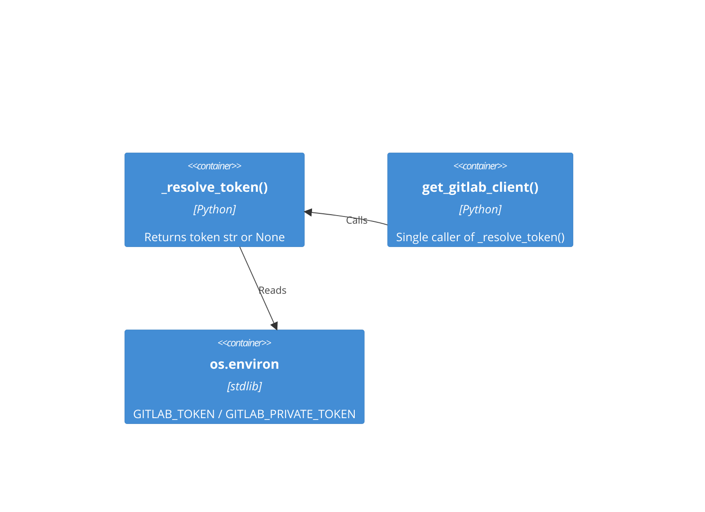

# Architecture Spec: Replace subprocess glab call with env-var-only token resolution

- **GitHub Issue**: #368
- **Feature Context**: [plan/feature-context-replace-glab-subprocess.md](./feature-context-replace-glab-subprocess.md)
- **Target File**: [.claude/skills/create-merge-request-changelog/scripts/fetch_gitlab_mr.py](../.claude/skills/create-merge-request-changelog/scripts/fetch_gitlab_mr.py)
- **Scope**: SMALL — single function simplification, two import deletions, one string update
- **Date**: 2026-03-02

---

## Executive Summary

`_resolve_token()` in `fetch_gitlab_mr.py` currently falls back to shelling out to the `glab`
binary when environment variables are absent. This creates a binary dependency, a split auth
path, and a ruff S607 linting violation. The fix is a deletion: remove the subprocess block
entirely, leaving only the already-present env-var early return. The `shutil` and `subprocess`
imports become unused and must be removed. The caller's error message must drop the glab
reference. No new logic is introduced. The reference implementation already exists in
`gitlab_context.py`.

---

## Current State (What Exists)

### `_resolve_token()` — lines 91-115

```text
Current structure:
  Lines 102-103  env var early return (KEEP — this becomes the complete function body)
  Lines 105      shutil.which("glab") call (DELETE)
  Lines 106-107  None return if glab not on PATH (DELETE)
  Lines 109-115  subprocess.run([glab_path, ...]) block (DELETE)
```

### Unused imports after deletion

```text
Line 17  import shutil     (DELETE — no remaining callers)
Line 18  import subprocess (DELETE — no remaining callers)
```

### Error message requiring update — line 129

```text
Current:  "No GitLab token found. Set GITLAB_TOKEN or configure glab."
Required: "No GitLab token found. Set GITLAB_TOKEN or GITLAB_PRIVATE_TOKEN env var."
```

---

## Target State (What to Build)

### `_resolve_token()` — contracted form

**Signature** (unchanged):

```python
def _resolve_token() -> str | None:
```

**Contract**:

- Docstring: state that token resolution is env-var-only; list `GITLAB_TOKEN` then
  `GITLAB_PRIVATE_TOKEN`; no mention of glab
- Body: single expression — `return` the result of `os.environ.get("GITLAB_TOKEN") or
  os.environ.get("GITLAB_PRIVATE_TOKEN") or None`
- No subprocess call
- No shutil call
- No call to `_get_gitlab_host()`
- Return type: `str | None` (unchanged)

**Reference implementation** (verbatim body from
`plugins/gitlab-skill/skills/gitlab-skill/scripts/gitlab_context.py` line 107):

```text
return os.environ.get("GITLAB_TOKEN") or os.environ.get("GITLAB_PRIVATE_TOKEN") or None
```

### Import block — lines 14-21

Remove `import shutil` and `import subprocess`. All other imports are unchanged. The remaining
`os` import at line 15 is still required (used by `_resolve_token()` and `_parse_git_origin()`).

**Required imports after change** (stdlib block, lines 14-21 area):

```text
from __future__ import annotations

import json
import os
import re
from functools import lru_cache
from pathlib import Path
from typing import TYPE_CHECKING, Annotated, Any, cast
```

### `get_gitlab_client()` error message — line 129

```text
Replace: "No GitLab token found. Set GITLAB_TOKEN or configure glab."
With:    "No GitLab token found. Set GITLAB_TOKEN or GITLAB_PRIVATE_TOKEN env var."
```

No other changes to `get_gitlab_client()`.

---

## Component Map



The `glab` binary and `subprocess` / `shutil` modules are absent from the target-state diagram.

---

## Change Inventory

| Location | Line(s) | Action | Constraint |
|----------|---------|--------|------------|
| `import shutil` | 17 | Delete | No other callers in file after change |
| `import subprocess` | 18 | Delete | No other callers in file after change |
| `_resolve_token()` docstring | 92-98 | Replace | Remove glab mention; describe env-var-only |
| `_resolve_token()` body | 102-115 | Replace with one-line return | Keep lines 102-103 logic; delete 105-115 |
| `get_gitlab_client()` error string | 129 | Update string | No other changes to the function |

Total lines deleted: approximately 12 (subprocess block) + 2 (imports) = 14.
Total lines added: 0 (the env-var return at 102-103 already exists; body shrinks).

---

## Behavioral Contracts

### Unchanged behavior

- `_resolve_token()` returns the token string when `GITLAB_TOKEN` is set.
- `_resolve_token()` returns the token string when `GITLAB_TOKEN` is unset but
  `GITLAB_PRIVATE_TOKEN` is set.
- `get_gitlab_client()` raises `GitLabFetchError` when `_resolve_token()` returns `None`.
- All functions other than `_resolve_token()` and the error string in `get_gitlab_client()` are
  untouched.

### Changed behavior (intentional)

- When both env vars are absent and `glab` is installed, the old code returned the token from
  glab config. The new code returns `None` and raises `GitLabFetchError`. This is the desired
  outcome per the feature request.

---

## Verification Steps

The implementing agent must confirm each item before marking the task complete.

### Acceptance criteria (from issue #368)

1. `_resolve_token()` contains no `subprocess.run()` call — verify by reading the function.
2. `_resolve_token()` contains no `shutil.which()` call — verify by reading the function.
3. `ruff check .claude/skills/create-merge-request-changelog/scripts/fetch_gitlab_mr.py`
   exits 0 with no S607 errors.
4. CLI runs successfully when `GITLAB_TOKEN` env var is set — verify by running:

   ```bash
   GITLAB_TOKEN=test uv run \
     .claude/skills/create-merge-request-changelog/scripts/fetch_gitlab_mr.py \
     --help
   ```

   Exit code must be 0.
5. Error message no longer contains the word "glab" — verify by reading line 129 after change.

### Linting gate

```bash
uv run prek run --files \
  .claude/skills/create-merge-request-changelog/scripts/fetch_gitlab_mr.py
```

Must exit 0.

### Import hygiene gate

After the change, grep confirms no remaining `shutil` or `subprocess` references:

```bash
grep -n "shutil\|subprocess" \
  .claude/skills/create-merge-request-changelog/scripts/fetch_gitlab_mr.py
```

Must produce no output.

---

## Out of Scope

- `plugins/gitlab-skill/skills/gitlab-skill/scripts/get_gitlab_context.py` also uses
  `shutil.which("glab")`. That file is explicitly out of scope for this item per the feature
  context gap analysis (Gap #1). A separate backlog item covers it.
- No tests exist for `fetch_gitlab_mr.py`. Adding tests is out of scope for this change. The
  absence of tests is a pre-existing gap; it should be tracked as a separate backlog item if
  not already recorded.
- No changes to the PEP 723 metadata block or other imports.

---

## Architectural Decisions

### ADR-001: Deletion only — no new code

**Decision**: Remove the subprocess block. Do not add any alternative token-discovery mechanism
(python-gitlab config files, keyring, credential helpers).

**Rationale**: The acceptance criteria explicitly require env-var-only. The reference
implementation in `gitlab_context.py` is a single-line return. Adding anything beyond that
diverges from the established codebase pattern.

### ADR-002: Match reference implementation verbatim

**Decision**: The body of `_resolve_token()` must match
`plugins/gitlab-skill/skills/gitlab-skill/scripts/gitlab_context.py` line 107 exactly.

**Rationale**: Two files in the same codebase solving the same problem should use the same
pattern. Divergence introduces future maintenance cost with no benefit.

### ADR-003: Error message names both env vars

**Decision**: Updated error message reads "Set GITLAB_TOKEN or GITLAB_PRIVATE_TOKEN env var."

**Rationale**: The function checks both env vars in sequence. The error message must inform
users of all valid options. The reference in `gitlab_context.py` names only `GITLAB_TOKEN`;
this spec extends that to name both since `fetch_gitlab_mr.py` explicitly checks both.
