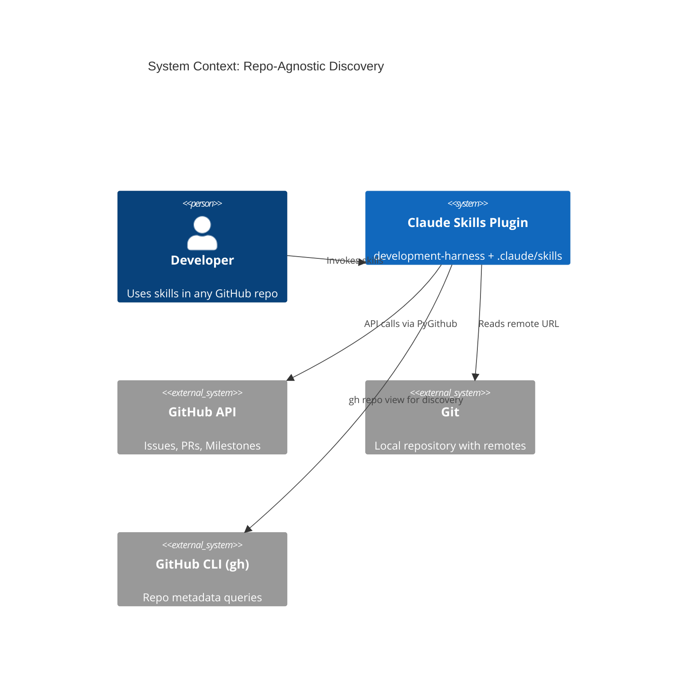
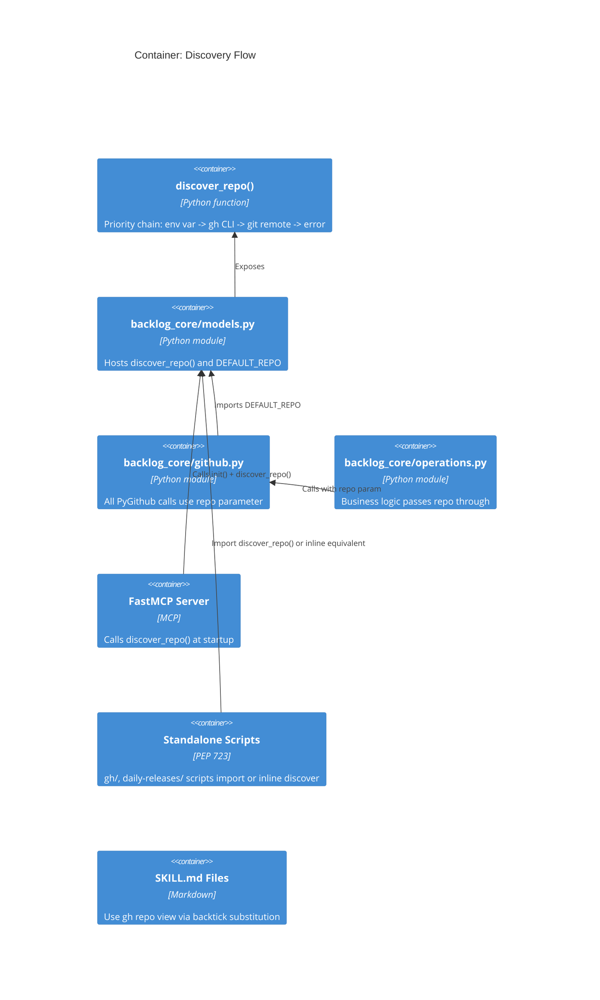
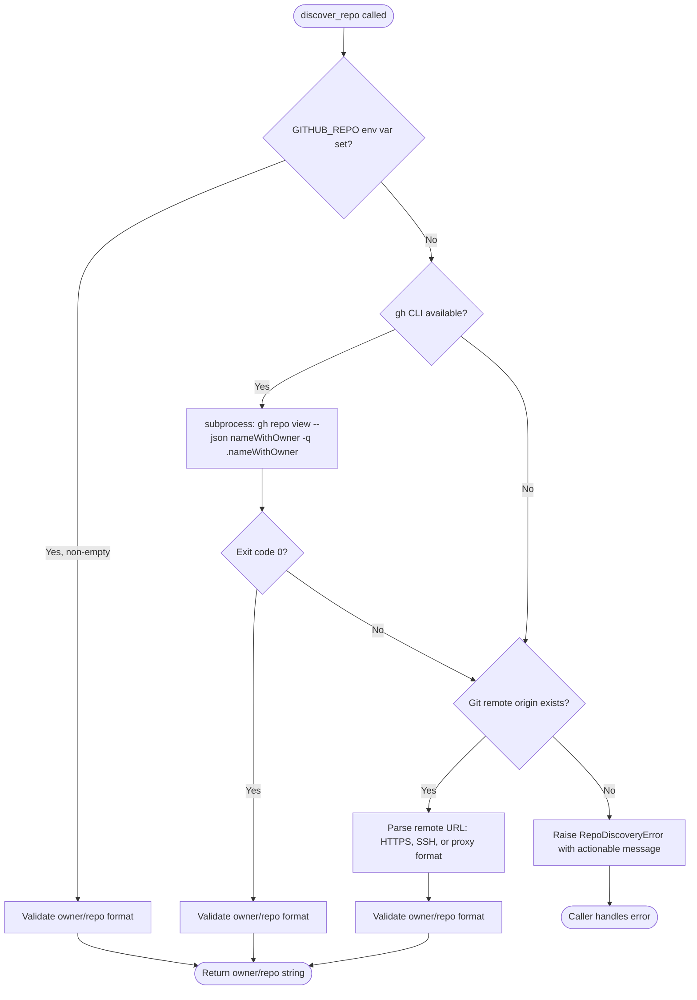

# Architecture Spec: Repo-Agnostic Backlog and GitHub Skills

**Feature**: Remove all hardcoded `Jamie-BitFlight/claude_skills` references; replace with dynamic auto-discovery.
**Backlog**: #852 (P1)
**Date**: 2026-03-20

---

## 1. Executive Summary

This architecture replaces ~500 hardcoded `Jamie-BitFlight/claude_skills` references across ~25 files with a single auto-discovery function and consistent patterns for each file type. The approach is:

1. **One Python function** (`discover_repo()`) in `backlog_core/models.py` that resolves `owner/repo` via a priority chain: `GITHUB_REPO` env var, then `gh` CLI, then git remote URL parsing, then error.
2. **`DEFAULT_REPO` becomes a lazy module global** initialized by `discover_repo()` at first access, replacing the hardcoded constant.
3. **SKILL.md files** use inline `!` backtick command substitution (`!`gh repo view --json nameWithOwner -q .nameWithOwner``) to resolve the repo at skill load time, injecting the result as literal text.
4. **Reference docs** replace hardcoded examples with `{REPO}` placeholder and a preamble explaining how the repo is discovered.
5. **All existing function signatures are preserved** -- the `repo: str = DEFAULT_REPO` pattern continues to work because `DEFAULT_REPO` now resolves dynamically.

No new dependencies. No schema changes. No API modifications. The change is fully backward-compatible: users who set `GITHUB_REPO` get explicit control; users in a normal git repo get auto-discovery; users of the original repo see no behavior change.

## 2. Architecture Overview

### C4 Context Diagram



### C4 Container Diagram



### Data Flow: Discovery Priority Chain



## 3. Technology Stack

All technologies are already in the project. No new dependencies.

| Technology | Version | Role | Justification |
|---|---|---|---|
| GitPython | >=3.1.45 | Parse git remote URLs | Already in pyproject.toml; provides `Repo().remote().url` |
| PyGithub | >=2.8.1 | GitHub API calls | Already used throughout; accepts `owner/repo` strings |
| `subprocess` | stdlib | Run `gh repo view` | Fallback when GitPython cannot parse proxy URLs |
| `re` | stdlib | URL pattern matching | Extract owner/repo from HTTPS, SSH, proxy URL formats |
| `os.environ` | stdlib | Read `GITHUB_REPO` | Standard env var override mechanism |
| `shutil.which` | stdlib | Check `gh` availability | Safe command existence check before subprocess |
| `functools.lru_cache` | stdlib | Cache discovery result | Avoid repeated subprocess/git calls within a session |

### Not Used

| Technology | Why Not |
|---|---|
| `pydantic-settings` | Overkill for a single env var; `os.environ.get()` suffices |
| New CLI flags | Existing `--repo` parameters already cover explicit override |
| Config file (`.repo.toml`) | Adds maintenance burden; env var + git remote covers all cases |

## 4. Component Design

### 4.1 Core: `discover_repo()` in `backlog_core/models.py`

**Purpose**: Single source of truth for `owner/repo` resolution. All Python code in the plugin calls this function (or uses the `DEFAULT_REPO` global it populates).

**Location**: `plugins/development-harness/backlog_core/models.py` -- alongside the existing `_resolve_repo_root()`.

**Interface**:

```python
class RepoDiscoveryError(Exception):
    """Raised when repository owner/repo cannot be determined."""
    ...

def _parse_repo_from_remote_url(url: str) -> str | None:
    """Extract 'owner/repo' from a git remote URL.

    Handles:
    - HTTPS: https://github.com/OWNER/REPO.git
    - SSH: git@github.com:OWNER/REPO.git
    - Proxy: http://127.0.0.1:PORT/OWNER/REPO.git
    - Bare: github.com:OWNER/REPO (no protocol)

    Returns None if URL does not match any known pattern.
    """
    ...

def _discover_via_gh_cli() -> str | None:
    """Run 'gh repo view --json nameWithOwner -q .nameWithOwner'.

    Returns owner/repo string on success, None on any failure
    (gh not installed, not in a repo, network error, non-zero exit).
    """
    ...

def _discover_via_git_remote() -> str | None:
    """Parse git remote origin URL using GitPython.

    Returns owner/repo string on success, None if no git repo,
    no origin remote, or URL cannot be parsed.
    """
    ...

def _validate_repo_slug(slug: str) -> str:
    """Validate that slug matches 'owner/repo' format.

    Raises RepoDiscoveryError if format is invalid.
    Returns the validated slug unchanged.
    """
    ...

@functools.lru_cache(maxsize=1)
def discover_repo() -> str:
    """Discover the current repository's owner/repo slug.

    Priority chain:
    1. GITHUB_REPO environment variable (if set and non-empty)
    2. gh CLI: gh repo view --json nameWithOwner
    3. Git remote: parse origin URL via GitPython
    4. Raise RepoDiscoveryError with actionable message

    Returns: 'owner/repo' string.
    Raises: RepoDiscoveryError if all methods fail.

    Result is cached for the process lifetime via lru_cache.
    """
    ...
```

**Module-level constant replacement**:

```python
# BEFORE (hardcoded):
DEFAULT_REPO = "Jamie-BitFlight/claude_skills"

# AFTER (lazy discovery):
def _get_default_repo() -> str:
    """Lazy wrapper so DEFAULT_REPO triggers discovery on first access."""
    ...

# For backward compatibility, DEFAULT_REPO is set at module level.
# The init() function can override it.
DEFAULT_REPO: str  # Assigned by _initialize_default_repo() at bottom of module
```

**Integration with existing `init()`**:

```python
def init(project_dir: str | None = None, repo: str | None = None) -> None:
    """Re-initialise module-level constants.

    Args:
        project_dir: Explicit project directory (existing parameter).
        repo: Explicit repo slug override. If None, calls discover_repo().
    """
    ...
```

**Key design decisions**:

- `discover_repo()` is cached with `lru_cache(maxsize=1)` -- discovery runs once per process.
- `init(repo=...)` clears the cache and sets `DEFAULT_REPO` explicitly, supporting MCP server startup with `--repo` flag.
- All helper functions are private (`_` prefix) -- only `discover_repo()` and `DEFAULT_REPO` are the public interface.

### 4.2 Consumers: `backlog_core/github.py` and `backlog_core/operations.py`

**Change**: No signature changes needed. These modules already use `repo: str = DEFAULT_REPO` in all function signatures. Since `DEFAULT_REPO` will now resolve dynamically, all consumers automatically get the discovered repo.

**Verification**: Confirm that `DEFAULT_REPO` is imported at module level (`from .models import DEFAULT_REPO`) and used as a default parameter. Python evaluates default parameters at function definition time, so the import must happen after `DEFAULT_REPO` is assigned. The existing code already does this correctly because `DEFAULT_REPO` is a module-level assignment.

**Important**: Python default parameter values are evaluated once at function definition time. Since `DEFAULT_REPO` is assigned a string value at module import time (via `discover_repo()`), all functions defined after that assignment will capture the discovered value. This is the same behavior as the current hardcoded string -- no semantic change.

### 4.3 Standalone Scripts: `.claude/skills/gh/scripts/`, `.claude/skills/daily-releases/scripts/`

**Pattern A -- Scripts that can import from backlog_core** (e.g., when run via `uv run` in the repo):

```python
# Replace:
DEFAULT_REPO = "Jamie-BitFlight/claude_skills"

# With:
from backlog_core.models import discover_repo
DEFAULT_REPO = discover_repo()
```

**Pattern B -- PEP 723 standalone scripts** (e.g., daily-releases scripts that declare their own deps):

These scripts cannot import `backlog_core` because they run in isolated environments. They need an inline discovery function.

```python
# Inline discovery for standalone scripts (no backlog_core import)
def _discover_repo() -> str:
    """Discover owner/repo from environment or git remote."""
    ...

DEFAULT_REPO: str = _discover_repo()
```

The inline function implements the same priority chain but without GitPython (which may not be in the script's PEP 723 deps). It uses:
1. `GITHUB_REPO` env var
2. `gh repo view --json nameWithOwner -q .nameWithOwner` via subprocess
3. `git config --get remote.origin.url` via subprocess + regex parsing
4. Error

### 4.4 SKILL.md Files

**Constraint**: SKILL.md files cannot use `$VARIABLE` (triggers argument substitution). Environment variables are empty for project-level skills.

**Pattern**: Use `!` backtick command substitution to resolve repo at skill load time.

```markdown
<!-- In SKILL.md, the repo is resolved at load time: -->
All gh commands use `-R` with the current repository: `!`gh repo view --json nameWithOwner -q .nameWithOwner``

Example:
gh issue list -R !`gh repo view --json nameWithOwner -q .nameWithOwner`
```

**Alternative for code fence examples** where backtick nesting is problematic:

Instruct the agent to discover the repo as its first step, storing it in working memory:

```markdown
## Setup (run first)

Discover the current repository for all gh commands in this skill:

gh repo view --json nameWithOwner -q .nameWithOwner

Use the output as the `-R` value for every `gh` command below.
```

**Decision**: Use the "agent discovery preamble" pattern (second approach) for SKILL.md files. Rationale:
- Avoids nested backtick complexity in code fences
- Works even if `gh` is not available at skill load time (degrades gracefully)
- The agent runs the command once and reuses the result
- No risk of `$` substitution corruption

### 4.5 Reference Documentation

**Pattern**: Replace all hardcoded `Jamie-BitFlight/claude_skills` with a preamble + placeholder.

```markdown
> **Repository**: All `gh` commands in this document use `-R OWNER/REPO`.
> Discover your repo: `gh repo view --json nameWithOwner -q .nameWithOwner`

## Example

gh issue list -R OWNER/REPO --label "bug"
```

Reference docs are not subject to `$` substitution, so `OWNER/REPO` is safe as a literal placeholder.

### 4.6 MCP Server (FastMCP)

**Change**: The MCP server's startup path calls `models.init(project_dir=...)`. Extend this to also discover the repo.

```python
# In MCP server startup:
models.init(project_dir=args.project_dir)
# DEFAULT_REPO is now set via discover_repo() inside init()
```

No additional changes needed -- all MCP tool functions already use `repo: str = DEFAULT_REPO` parameters.

### 4.7 `.claude/CLAUDE.md` (In Scope per user decision)

**Change**: Replace hardcoded examples in the `gh_cli_usage` section with the discovery preamble pattern.

```markdown
### Authentication and Repo Detection

GITHUB_TOKEN set in environment. Discover the repo for -R flag:

gh repo view --json nameWithOwner -q .nameWithOwner
```

### 4.8 `.claude/scripts/` Utility Scripts (In Scope per user decision)

**Pattern**: Same as Pattern B (section 4.3) -- inline discovery function for standalone scripts.

### 4.9 Agent Instruction Files (In Scope per user decision)

**Change**: Replace any hardcoded repo references with instructions to use `gh repo view` for discovery. Agent files are not subject to `$` substitution.

## 5. Data Architecture

### Configuration

No new configuration files. The discovery mechanism uses:

| Source | Format | Example |
|---|---|---|
| `GITHUB_REPO` env var | `owner/repo` string | `GITHUB_REPO=myorg/myrepo` |
| Git remote URL | Standard git URL | `https://github.com/owner/repo.git` |
| `--repo` CLI flag | `owner/repo` string | `--repo myorg/myrepo` |

### Validation Schema

The `owner/repo` slug must match:

```python
REPO_SLUG_PATTERN: re.Pattern[str] = re.compile(
    r"^[a-zA-Z0-9._-]+/[a-zA-Z0-9._-]+$"
)
```

Validation rejects:
- Empty strings
- Strings without exactly one `/`
- Strings with path components (e.g., `github.com/owner/repo`)
- Strings with `.git` suffix (stripped before validation)

### Git Remote URL Patterns

```python
# HTTPS: https://github.com/OWNER/REPO.git
# SSH: git@github.com:OWNER/REPO.git
# Proxy: http://127.0.0.1:PORT/OWNER/REPO.git
# Proxy HTTPS: https://127.0.0.1:PORT/OWNER/REPO.git

REMOTE_URL_PATTERN: re.Pattern[str] = re.compile(
    r"(?:https?://[^/]+/|git@[^:]+:|ssh://[^/]+/)"  # protocol + host
    r"([^/]+/[^/]+?)(?:\.git)?/?$"                    # owner/repo
)
```

### Error Model

```python
class RepoDiscoveryError(Exception):
    """All discovery methods failed.

    Attributes:
        methods_tried: list of method names attempted
        message: user-facing actionable error message
    """
    methods_tried: list[str]
    message: str
```

Error message template:

```text
Could not determine the GitHub repository.

Tried:
  1. GITHUB_REPO environment variable: not set
  2. gh CLI (gh repo view): gh not found in PATH
  3. Git remote (origin): no git repository found

To fix, either:
  - Set GITHUB_REPO=owner/repo in your environment
  - Ensure you are in a git repository with a GitHub remote
  - Install the GitHub CLI (gh) and authenticate
```

## 6. Security Architecture

### Credential Management

- `GITHUB_TOKEN`: Already required; no change. Never logged or displayed.
- `GITHUB_REPO`: Not a secret; safe to log in error messages.
- Git remote URLs may contain embedded credentials (`https://token@github.com/...`). The `_parse_repo_from_remote_url()` function must strip credentials before logging.

### Security Checklist

- [x] No `shell=True` in subprocess calls -- all `subprocess.run()` uses list arguments
- [x] `GITHUB_REPO` validated against `REPO_SLUG_PATTERN` before use (prevents injection via env var)
- [x] Git remote URLs sanitized (credentials stripped) before inclusion in error messages
- [x] `shutil.which("gh")` used before subprocess call (no path traversal risk)
- [x] No user input flows into subprocess command construction without validation
- [x] `subprocess.run()` uses `capture_output=True` and `timeout=10` to prevent hangs

## 7. Testing Architecture

### Testing Stack

```text
pytest>=8.0.0
pytest-cov>=6.0.0
pytest-mock>=3.14.0
```

### Test Structure

```text
plugins/development-harness/tests/
    test_repo_discovery.py          # Unit tests for discover_repo() and helpers
    test_backlog_core_models.py     # Existing tests updated
    test_live_validation.py         # Integration test updated to use discovery
```

### Unit Tests: `test_repo_discovery.py`

Test the priority chain with mocked externals:

| Test Case | Setup | Expected |
|---|---|---|
| Env var set | `GITHUB_REPO=myorg/myrepo` | Returns `myorg/myrepo` |
| Env var empty | `GITHUB_REPO=""` | Falls through to gh CLI |
| Env var invalid format | `GITHUB_REPO=invalid` | Raises `RepoDiscoveryError` |
| gh CLI success | Mock subprocess returns `myorg/myrepo` | Returns `myorg/myrepo` |
| gh CLI not found | `shutil.which` returns None | Falls through to git remote |
| gh CLI fails | subprocess non-zero exit | Falls through to git remote |
| Git remote HTTPS | `https://github.com/owner/repo.git` | Returns `owner/repo` |
| Git remote SSH | `git@github.com:owner/repo.git` | Returns `owner/repo` |
| Git remote proxy | `http://127.0.0.1:8080/owner/repo.git` | Returns `owner/repo` |
| Git remote no origin | No remote configured | Raises `RepoDiscoveryError` |
| No git repo | Not in a git directory | Raises `RepoDiscoveryError` |
| All methods fail | No env, no gh, no git | Raises `RepoDiscoveryError` with all methods listed |
| Cache hit | Call twice | Second call returns cached result, no subprocess |

### URL Parsing Tests

| Input URL | Expected Output |
|---|---|
| `https://github.com/Jamie-BitFlight/claude_skills.git` | `Jamie-BitFlight/claude_skills` |
| `git@github.com:Jamie-BitFlight/claude_skills.git` | `Jamie-BitFlight/claude_skills` |
| `http://127.0.0.1:3000/Jamie-BitFlight/claude_skills.git` | `Jamie-BitFlight/claude_skills` |
| `https://127.0.0.1:443/owner/repo` | `owner/repo` |
| `ssh://git@github.com/owner/repo.git` | `owner/repo` |
| `not-a-url` | `None` |
| `https://github.com/owner` | `None` (no repo component) |

### Integration Tests

- Run `discover_repo()` in the actual repository (no mocks) -- verify it returns a valid `owner/repo` string
- Set `GITHUB_REPO` env var, verify it takes precedence over git remote
- Clear `lru_cache` between tests using `discover_repo.cache_clear()`

### Coverage

- Target: 95% for `discover_repo()` and helpers (critical path -- all GitHub operations depend on this)
- Branch coverage required (each fallback path exercised)

### Acceptance Test

```bash
# Final grep verification (run after all changes)
grep -r "Jamie-BitFlight/claude_skills" \
    --include="*.py" --include="*.md" \
    plugins/development-harness .claude/skills \
    --exclude-dir=plan --exclude-dir=.claude/backlog
# Expected: 0 matches
```

## 8. Distribution Architecture

**Strategy**: No change to distribution. The `discover_repo()` function lives inside the existing `backlog_core` package which is already distributed as part of the `development-harness` plugin.

- **Plugin package** (`plugins/development-harness/`): Contains `discover_repo()` in `backlog_core/models.py`. Distributed via marketplace.
- **PEP 723 standalone scripts** (`.claude/skills/*/scripts/`): Each script that cannot import `backlog_core` gets an inline `_discover_repo()` function. This is intentional duplication -- standalone scripts must be self-contained per PEP 723 design.
- **SKILL.md files**: No code distribution; they contain agent instructions that reference `gh repo view`.

### Inline Discovery Deduplication Strategy

The inline `_discover_repo()` in standalone scripts duplicates logic from `backlog_core/models.py`. This is acceptable because:

1. Standalone scripts run in isolated environments (own venv via PEP 723)
2. The inline version is simpler (subprocess only, no GitPython)
3. The function is ~20 lines and unlikely to diverge
4. Alternative (shared package dependency) would add complexity to every script's PEP 723 metadata

## 9. Architectural Decisions (ADRs)

### ADR-001: `gh` CLI Before GitPython in Priority Chain

**Context**: Two methods can discover `owner/repo` from the local environment: `gh repo view` (subprocess) and GitPython remote URL parsing.

**Decision**: `gh` CLI is tried before GitPython.

**Rationale**: In Claude Code sessions, git remote points to a local proxy (`127.0.0.1:PORT`), not `github.com`. The `gh` CLI authenticates via `GITHUB_TOKEN` and resolves the actual GitHub repo regardless of the remote URL format. GitPython would need to parse the proxy URL, which may not contain the real `owner/repo` in all proxy configurations. The `gh` CLI is the more reliable method in the primary deployment environment.

**Tradeoff**: Adds ~100-500ms subprocess overhead on first call. Mitigated by `lru_cache`.

### ADR-002: `lru_cache` Instead of Module-Level Eager Discovery

**Context**: `DEFAULT_REPO` could be assigned eagerly at import time (like the current hardcoded value) or lazily on first use.

**Decision**: Use `@functools.lru_cache(maxsize=1)` on `discover_repo()`. Assign `DEFAULT_REPO` at module level by calling `discover_repo()` during module initialization, but allow `init()` to override.

**Rationale**: Eager discovery at import time preserves the existing behavior where `DEFAULT_REPO` is available as a module-level constant. The `lru_cache` ensures the subprocess/git calls happen only once. The `init()` function can clear the cache and re-discover when the MCP server starts with explicit `--project-dir`.

**Tradeoff**: Module import triggers a subprocess call. Acceptable because this module is only imported when GitHub operations are needed.

### ADR-003: Agent Discovery Preamble for SKILL.md Instead of Backtick Substitution

**Context**: SKILL.md files could use `!` backtick substitution (`!`gh repo view ...``) to inline the repo at load time, or instruct the agent to discover the repo as its first action.

**Decision**: Use the agent discovery preamble pattern -- instruct the agent to run `gh repo view` and use the result.

**Rationale**:
- Backtick substitution in SKILL.md runs at skill load time. If `gh` is not available or fails, the substitution produces an empty string or error text, corrupting all commands in the skill.
- The preamble pattern degrades gracefully: the agent can report the failure and ask the user.
- Nested backticks inside code fences create markdown rendering issues.
- The preamble is human-readable and self-documenting.

**Tradeoff**: Requires the agent to run one extra command per skill invocation. This is negligible compared to the GitHub API calls that follow.

### ADR-004: Inline Discovery in PEP 723 Scripts Instead of Shared Import

**Context**: Standalone scripts in `.claude/skills/*/scripts/` could import `discover_repo()` from `backlog_core` or include an inline equivalent.

**Decision**: Inline discovery function in each standalone script.

**Rationale**: PEP 723 scripts declare their own dependencies and run in isolated environments. Adding `backlog_core` as a dependency would require the entire development-harness package to be installable as a pip package, which is not currently the case. The inline function is ~20 lines, uses only stdlib + subprocess, and is unlikely to drift.

**Tradeoff**: Code duplication (~20 lines per script). Acceptable given the isolation constraint.

### ADR-005: No Hardcoded Fallback Value

**Context**: The current code falls back to `"Jamie-BitFlight/claude_skills"` when no other discovery method works. The new design could retain this as a last resort or raise an error.

**Decision**: Raise `RepoDiscoveryError` instead of falling back to a hardcoded value.

**Rationale**: A hardcoded fallback silently targets the wrong repository when discovery fails. This violates the silent failure prevention rule. An explicit error with actionable guidance is safer than silently operating on a repo the user did not intend.

**Tradeoff**: Users in environments without git, gh, or GITHUB_REPO will see an error instead of defaulting. This is the correct behavior -- operating on the wrong repo would cause data corruption (e.g., creating issues in the wrong repository).

## 10. Scalability Strategy

### Caching

- `discover_repo()` is cached via `@lru_cache(maxsize=1)` -- one subprocess/git call per process lifetime
- Cache cleared by `init()` when MCP server re-initializes with explicit parameters
- Cache cleared by `discover_repo.cache_clear()` in tests between test cases

### Subprocess Timeout

- All subprocess calls use `timeout=10` seconds
- `gh repo view` typically completes in <500ms; 10s covers slow networks
- `git config --get` is local-only, completes in <50ms

### Resource Management

- No persistent connections or file handles
- GitPython `Repo()` object is created and discarded within `_discover_via_git_remote()`
- No async patterns needed -- discovery is synchronous and fast

### Scaling Considerations

- Discovery runs once per process (cached). No scaling concern for concurrent operations.
- If the MCP server handles multiple repos in the future, `init(repo=...)` allows per-request override without cache invalidation. The `repo` parameter in function signatures takes precedence over `DEFAULT_REPO`.

## Appendix A: Migration Checklist

### Python Files -- Replace `DEFAULT_REPO` Constant

| File | Current Pattern | Target Pattern |
|---|---|---|
| `plugins/development-harness/backlog_core/models.py` | `DEFAULT_REPO = "Jamie-BitFlight/claude_skills"` | `DEFAULT_REPO = discover_repo()` + add `discover_repo()` function |
| `plugins/development-harness/backlog_core/github.py` | `from .models import DEFAULT_REPO` (used in signatures) | No change needed (imports updated DEFAULT_REPO) |
| `plugins/development-harness/backlog_core/operations.py` | `from .models import DEFAULT_REPO` (used in signatures) | No change needed |
| `.claude/skills/gh/scripts/github_project_setup.py` | `DEFAULT_REPO = "Jamie-BitFlight/claude_skills"` | Inline `_discover_repo()` or import |
| `.claude/skills/daily-releases/scripts/cleanup_stale_releases.py` | Bare hardcode | Inline `_discover_repo()` |
| `.claude/skills/daily-releases/scripts/publish_daily_release.py` | Bare hardcode | Inline `_discover_repo()` |
| `.claude/skills/daily-releases/scripts/collect_day_dataset.py` | `os.environ.get("DEFAULT_REPO") or "Jamie-BitFlight/..."` | Inline `_discover_repo()` |
| `.claude/skills/daily-releases/scripts/list_daily_ranges.py` | `os.environ.get("DEFAULT_REPO") or "Jamie-BitFlight/..."` | Inline `_discover_repo()` |

### Python Files -- `.claude/scripts/` Utility Scripts

| File | Change |
|---|---|
| `.claude/scripts/sync_issues_to_project.py` | Inline `_discover_repo()` or env var |
| `.claude/scripts/rebuild_issue_bodies.py` | Inline `_discover_repo()` or env var |
| `.claude/scripts/repair_from_original_register.py` | Inline `_discover_repo()` or env var |

### Test Files

| File | Change |
|---|---|
| `plugins/development-harness/tests/test_live_validation.py` | Replace `g.get_repo("Jamie-BitFlight/claude_skills")` with `g.get_repo(discover_repo())` or fixture |
| `plugins/development-harness/tests/test_backlog_core_models.py` | Update `test_default_repo_format` to verify discovery, not hardcoded value |

### SKILL.md Files -- Agent Discovery Preamble

| File | Occurrences | Change |
|---|---|---|
| `.claude/skills/gh/SKILL.md` | 27 | Add discovery preamble; replace all `-R Jamie-BitFlight/claude_skills` with `-R` + discovered value |
| `.claude/skills/complete-milestone/SKILL.md` | 10 | Same pattern |
| `.claude/skills/create-milestone/SKILL.md` | 5 | Same pattern |
| `.claude/skills/start-milestone/SKILL.md` | 6 | Same pattern |
| `.claude/skills/group-items-to-milestone/SKILL.md` | varies | Same pattern |
| `plugins/development-harness/skills/work-backlog-item/SKILL.md` | varies | Same pattern |
| `.claude/skills/daily-releases/SKILL.md` | varies | Same pattern |

### Reference Documentation

| File | Change |
|---|---|
| `.claude/skills/gh/references/labels.md` | Replace hardcoded repo with `OWNER/REPO` placeholder + preamble |
| `.claude/skills/gh/references/issue-stories.md` | Same |
| `.claude/skills/gh/references/milestones.md` | Same |
| `.claude/skills/gh/references/projects-v2.md` | Same |
| `plugins/development-harness/skills/work-backlog-item/references/github-integration.md` | Same |
| `plugins/development-harness/skills/work-backlog-item/references/milestones.md` | Same |
| `plugins/development-harness/skills/work-backlog-item/references/labels.md` | Same |
| `plugins/development-harness/skills/work-backlog-item/references/issue-stories.md` | Same |
| `plugins/development-harness/skills/work-backlog-item/references/step-procedures.md` | Same |
| `plugins/development-harness/skills/work-backlog-item/references/validation-plan.md` | Same |

### Agent Instruction Files

| File | Change |
|---|---|
| `.claude/agents/backlog-item-groomer.md` | Replace hardcoded repo if present |
| `.claude/agents/backlog-mcp-validator.md` | Replace hardcoded repo if present |

### Project Instructions

| File | Change |
|---|---|
| `.claude/CLAUDE.md` (gh_cli_usage section) | Replace hardcoded examples with discovery preamble |

### Out of Scope (Confirmed)

- `plan/` directory -- historical artifacts, immutable
- `.claude/backlog/` directory -- historical artifacts, immutable
- Template files for archive formatting -- generated content, not executed

### Post-Migration Verification

Each modified SKILL.md must be invoked after changes to verify:
1. It renders correctly (no broken markdown)
2. Discovery command executes successfully
3. No unwanted prompts or extra steps introduced
4. Existing behavior preserved
