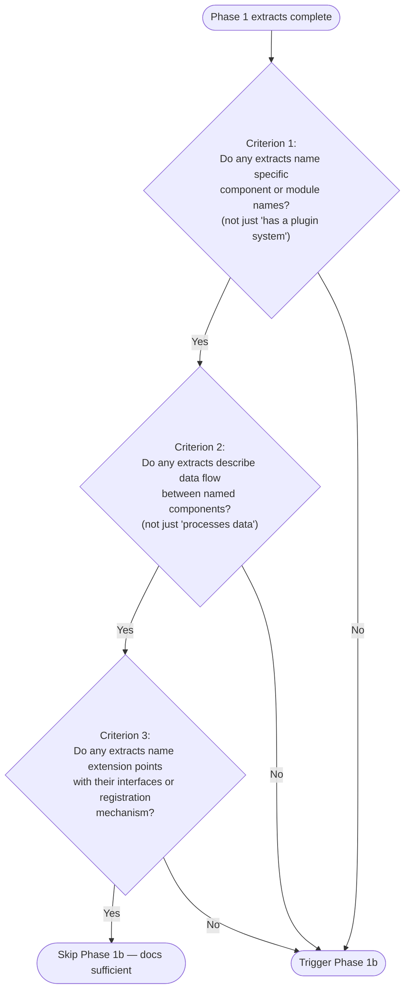

# Architecture Spec: Research Curator Code Analysis Pass

---

## Overview

This design adds a conditional Phase 1b (Code Analysis) to the `@research-curator` agent that triggers when Phase 1 extracts lack sufficient architectural detail to meet the Depth Requirements for the Technical Architecture and Key Features sections. Phase 1b reads a bounded set of source files from the existing shallow clone (`.worktrees/{repo-name}/`), extracts architectural evidence using the same quote-grounded methodology as Phase 1, and feeds those extracts into Phase 2 alongside doc-derived extracts. The goal: entries for doc-thin repos contain concrete component names, data flow descriptions, and extension points sourced from code rather than shallow README paraphrases.

---

## Design Decisions

### D1: Doc-Sufficiency Check

The check runs immediately after Phase 1 completes. The agent evaluates its Phase 1 extracts against three binary criteria. Each criterion is a yes/no question answerable by scanning the extract list — no qualitative judgment required.



**Checklist form for the agent prompt** (imperative, enumerated):

1. Scan your Phase 1 extracts tagged with Relevance: Architecture or Features.
2. Answer each question with YES or NO:
   - Q1: Do any extracts name at least 2 specific component, module, or class names (not generic descriptions)?
   - Q2: Do any extracts describe how data or control flows between at least 2 named components?
   - Q3: Do any extracts name an extension point, plugin interface, hook system, or registration mechanism with its concrete API?
3. If ANY answer is NO, proceed to Phase 1b.
4. If ALL answers are YES, skip Phase 1b and continue to Phase 2.

**Rationale**: Three binary questions with concrete examples of what does/does not qualify. Haiku can evaluate "does this extract name a specific module?" reliably. The threshold is deliberately low (any single NO triggers) because code analysis is cheap (files are already cloned locally) and the cost of a shallow Architecture section is high.

### D2: Depth Budget

**Recommendation: 12 source files maximum per analysis pass.**

Justification:

- Haiku's context window is 200K tokens. A typical source file averages 150-300 lines (3,000-6,000 tokens). 12 files at the high end consume ~72K tokens for file content, leaving ample room for the agent's existing doc extracts, instructions, and tool call overhead.
- Each `Read` tool call costs ~500 tokens of overhead (tool envelope, path, response framing). 12 calls add ~6K tokens of overhead — acceptable.
- Empirically, most projects expose their architecture through 5-8 key files (entrypoints, schema definitions, and barrel/index files). 12 provides headroom for projects with deeper module structures without encouraging exhaustive reading.
- The tiered selection system (D3) ensures the most informative files are read first. If the budget is exhausted at Tier 2, the agent still has entrypoints and schemas — the two most architecturally informative file types.

The 15-file cap in AC#2 is reduced to 12 here because the additional 3 files provide diminishing returns while consuming ~9K tokens that could push Haiku closer to degraded reasoning at the tail of its context window.

### D3: File Selection Tiers

The agent reads files in tier order, advancing to the next tier only after exhausting the current one or finding no matches. Stop when the depth budget (12 files) is reached.

**Tier 1: Entrypoints** (highest priority — reveals top-level architecture, dispatch logic, component wiring)

| Ecosystem | Glob Patterns |
|-----------|---------------|
| Python | `**/main.py`, `**/cli.py`, `**/app.py`, `**/__main__.py`, `**/server.py`, `**/wsgi.py`, `**/asgi.py` |
| Node.js/TypeScript | `**/index.ts`, `**/index.js`, `**/main.ts`, `**/main.js`, `**/app.ts`, `**/app.js`, `**/server.ts`, `**/server.js` |
| Go | `**/main.go`, `**/cmd/**/main.go` |
| Rust | `**/main.rs`, `**/lib.rs` |
| Java/Kotlin | `**/Application.java`, `**/Main.java`, `**/App.kt` |
| Ruby | `**/config.ru`, `**/Rakefile`, `**/bin/*` (executable scripts) |

**Tier 2: Type and schema declarations** (reveals data model, domain concepts)

| Ecosystem | Glob Patterns |
|-----------|---------------|
| Python | `**/models.py`, `**/schema.py`, `**/schemas.py`, `**/types.py`, `**/models/*.py` |
| Node.js/TypeScript | `**/types.ts`, `**/types.d.ts`, `**/schema.ts`, `**/models/*.ts`, `**/interfaces.ts` |
| Go | `**/types.go`, `**/models.go` |
| Rust | `**/types.rs`, `**/models.rs`, `**/schema.rs` |
| Cross-language | `**/*.proto`, `**/openapi.yaml`, `**/openapi.yml`, `**/openapi.json`, `**/schema.graphql`, `**/schema.json` |

**Tier 3: Index/barrel files and public API surface** (reveals what the project exports and how modules connect)

| Ecosystem | Glob Patterns |
|-----------|---------------|
| Python | `**/__init__.py` (only those in `src/` or top-level package directories, skip deeply nested), `**/api.py`, `**/routes.py`, `**/urls.py` |
| Node.js/TypeScript | `**/index.ts` (in subdirectories — barrel exports), `**/exports.ts` |
| Go | `**/doc.go` |
| Rust | `**/mod.rs` |
| Cross-language | `**/plugin.py`, `**/plugins/*.py`, `**/extensions/*.ts`, `**/middleware/*.py`, files matching `**/register*` |

**Selection procedure** (imperative instructions for the agent):

1. Determine the primary language from `pyproject.toml`, `package.json`, `Cargo.toml`, `go.mod`, or file extension frequency via `Glob("**/*.{ext}")`.
2. Start with Tier 1 patterns for the detected language. Glob each pattern. Collect matching file paths.
3. Read files from Tier 1 matches (most informative first — prefer `src/` over `tests/`, prefer shorter paths over deeper paths). Increment the file counter after each Read.
4. If file counter < 12, advance to Tier 2. Glob, collect, read.
5. If file counter < 12, advance to Tier 3. Glob, collect, read.
6. Stop when file counter reaches 12 or all tiers are exhausted.

**Exclusions** (never read these during Phase 1b):

- `**/test_*.py`, `**/*_test.go`, `**/*.test.ts`, `**/*.spec.ts` — test files
- `**/node_modules/**`, `**/.venv/**`, `**/vendor/**` — dependency directories
- `**/*.min.js`, `**/*.bundle.js` — build artifacts
- Files larger than 500 lines — skip and note in extracts: "Skipped {path}: {line_count} lines (over 500-line limit)"

### D4: Citation Format

Code-derived findings appear inline within the Architecture and Key Features sections, using the same prose style as doc-derived content. The source attribution appends to the relevant bullet or paragraph:

```text
Source: `{relative-path}` — {exported-name or description}
```

Examples:

- `Source: src/core/engine.py — class TaskEngine` — for a class definition
- `Source: src/api/routes.py — register_routes()` — for a function
- `Source: proto/schema.proto — message EventPayload` — for a schema definition
- `Source: src/plugins/__init__.py — PLUGIN_REGISTRY dict` — for a data structure

When multiple code files corroborate a single architectural claim, list sources comma-separated:

```text
Source: src/core/engine.py — class TaskEngine, src/core/graph.py — class DependencyGraph
```

This format integrates with the existing extract methodology — each code-derived extract recorded during Phase 1b uses:

```text
N. "{exact code passage — function signature, class definition, or schema excerpt}"
   Source: {relative-path}:{line-range} — {name}
   Relevance: Architecture | Features
```

---

## Workflow Changes

### Phase 1b: Code Analysis (new)

The following instructions are written as they would appear in the agent prompt file, inside the `<methodology>` section, after Phase 1 and before Phase 2.

```markdown
### Phase 1b: Code Analysis (conditional)

This phase triggers ONLY when the doc-sufficiency check fails. It reads source files from the
shallow clone to extract architectural evidence that documentation did not provide.

**Doc-Sufficiency Check** — run this immediately after Phase 1 completes:

1. Scan your Phase 1 extracts tagged with Relevance: Architecture or Features.
2. Answer each question YES or NO:
   - Q1: Do any extracts name at least 2 specific component, module, or class names
     (not generic descriptions like "has a plugin system")?
   - Q2: Do any extracts describe how data or control flows between at least 2 named
     components (not generic statements like "processes data")?
   - Q3: Do any extracts name an extension point, plugin interface, hook system, or
     registration mechanism with its concrete API?
3. If ANY answer is NO: proceed to Phase 1b below.
4. If ALL answers are YES: skip Phase 1b, proceed to Phase 2.

**Phase 1b Procedure** (when triggered):

1. **Detect primary language**: Check for `pyproject.toml` (Python), `package.json`
   (Node.js/TypeScript), `Cargo.toml` (Rust), `go.mod` (Go), `pom.xml` / `build.gradle`
   (Java/Kotlin). If none found, count file extensions via Glob to determine the dominant
   language.

2. **Read files in tier order** — stop at 12 files total:

   **Tier 1 — Entrypoints** (read these first):
   - Python: `**/main.py`, `**/cli.py`, `**/app.py`, `**/__main__.py`, `**/server.py`
   - Node/TS: `**/index.ts`, `**/index.js`, `**/main.ts`, `**/app.ts`, `**/server.ts`
   - Go: `**/main.go`, `**/cmd/**/main.go`
   - Rust: `**/main.rs`, `**/lib.rs`

   **Tier 2 — Type/schema declarations** (read after Tier 1):
   - Python: `**/models.py`, `**/schema.py`, `**/types.py`
   - Node/TS: `**/types.ts`, `**/types.d.ts`, `**/schema.ts`, `**/interfaces.ts`
   - Go: `**/types.go`, `**/models.go`
   - Rust: `**/types.rs`, `**/models.rs`
   - Any language: `**/*.proto`, `**/openapi.yaml`, `**/openapi.json`, `**/schema.graphql`

   **Tier 3 — Index/barrel files** (read last):
   - Python: `**/__init__.py` (top-level package only), `**/api.py`, `**/routes.py`
   - Node/TS: `**/index.ts` (subdirectory barrels), `**/exports.ts`
   - Go: `**/doc.go`
   - Rust: `**/mod.rs`
   - Any language: `**/plugin.py`, `**/plugins/*.py`, files matching `**/register*`

   **Exclusions** — never read:
   - Test files (`**/test_*`, `**/*_test.*`, `**/*.test.*`, `**/*.spec.*`)
   - Dependency dirs (`**/node_modules/**`, `**/.venv/**`, `**/vendor/**`)
   - Build artifacts (`**/*.min.js`, `**/*.bundle.js`)
   - Files over 500 lines (skip and note: "Skipped {path}: {N} lines, over limit")

   **Selection within a tier**: Prefer files in `src/` over root. Prefer shorter paths over
   deeper paths. Read each file fully (do not use line limits).

3. **Extract architectural evidence** from each file read. Record extracts using the same
   format as Phase 1:

   ```text
   N. "{exact code passage — class definition, function signature, import block, or schema}"
      Source: {relative-path}:{start-end lines} — {exported name}
      Relevance: Architecture | Features
      Confidence: code-read
   ```

   Focus extraction on:
   - Class/struct definitions with their public methods (architecture)
   - Function signatures that reveal data flow (architecture)
   - Import statements that reveal component dependencies (architecture)
   - Schema/model field definitions (architecture)
   - Registration patterns — decorators, register() calls, plugin lists (extension points)
   - Configuration handling that reveals supported options (features)

4. **Merge code extracts with Phase 1 extracts**. Both sets feed into Phase 2 identically.
   Code extracts are distinguished only by their `Confidence: code-read` tag.
```

### Phase 1 Modification

Phase 1 requires one small change: when recording extracts, the agent must tag each extract's Relevance field so the doc-sufficiency check can filter by `Architecture` and `Features` tags. The current Phase 1 instructions already require a `Relevance` field per extract (`Relevance: {which entry section this feeds}`), so the only change is an explicit instruction to use the section names from the template as values:

Add to Phase 1, after the extract format example:

```markdown
**Relevance values**: Use the exact section names from the entry template — Overview,
Problem Addressed, Key Statistics, Key Features, Technical Architecture, Installation & Usage,
Relevance to Claude Code Development, References, Freshness Tracking. This enables the
doc-sufficiency check after Phase 1 to filter extracts by section.
```

### Entry Template Changes

The entry template (`references/entry-template.md`) requires one addition to the Freshness Tracking section to support the `code-read` confidence qualifier from AC#4.

Add to the Freshness Tracking table in the template, after the existing fields:

```markdown
| Confidence Map | `section: level (qualifier)` |
```

And add a note below the template:

```markdown
> **Confidence qualifiers**: When a section's claims derive from code analysis rather than
> documentation, append `(code-read)` to the confidence level — e.g., `Architecture: medium
> (code-read)`. This distinguishes entries where architectural claims come from source code
> inspection (verifiable but potentially incomplete) versus official documentation (authoritative
> but potentially outdated). Sections with mixed sources use the lower confidence level and
> note both qualifiers: `Architecture: medium (doc + code-read)`.
```

The structural template itself (the 10-section layout) does not change. No new required sections are added. The `Source: path — name` citation format appears inline within existing sections (Technical Architecture, Key Features) as part of normal prose — it does not require template schema changes.

---

## Files Modified

| File | Change Type | Description |
|------|-------------|-------------|
| `.claude/agents/research-curator.md` | Modified | Add Phase 1b code-analysis instructions inside `<methodology>` section, add doc-sufficiency check between Phase 1 and Phase 2, add Relevance value guidance to Phase 1, add code extract format with `Confidence: code-read` tag |
| `.claude/skills/research-curator/references/entry-template.md` | Modified | Add Confidence Map field to Freshness Tracking table, add note explaining `code-read` qualifier and mixed-source annotation |

No other files require modification. The orchestrator skill (`SKILL.md`), validation rules, and validation script are unaffected — the code analysis pass is entirely internal to the agent's Phase 1 workflow.

---

## Verification Approach

### Test 1: Doc-thin repository (Phase 1b triggers)

1. Run `/research-curator https://github.com/{repo-with-minimal-readme}` on a repository known to have a thin README and no docs site (e.g., a small utility library with just installation instructions in the README).
2. Verify the entry's Technical Architecture section contains specific component/module names with `Source: {path} — {name}` citations.
3. Verify the Freshness Tracking section includes a Confidence Map with `code-read` qualifier on Architecture.
4. Verify the entry file passes `validate_research.py` without errors.

### Test 2: Doc-rich repository (Phase 1b skips)

1. Run `/research-curator https://github.com/{repo-with-comprehensive-docs}` on a repository with extensive documentation (e.g., FastAPI, which has thorough architecture docs).
2. Verify the entry's Technical Architecture section contains component names sourced from documentation (no `code-read` qualifier).
3. Verify Phase 1b was skipped (no `Source: {path}` code citations in Architecture section).
4. Verify the entry file passes `validate_research.py` without errors.

### Test 3: Depth budget enforcement

1. Run on a large monorepo. Verify the agent reads at most 12 source files by checking the extract list for code-sourced entries.
2. Verify tier ordering is respected — Tier 1 files appear before Tier 2 files in the extract sequence.

### Test 4: AC traceability

| AC | Verification |
|----|-------------|
| AC1 (auto-trigger on < 3 claims) | Test 1: doc-thin repo triggers Phase 1b. Test 2: doc-rich repo skips it. The "fewer than 3" threshold maps to the 3-question check — any NO means at least one architectural dimension is uncovered. |
| AC2 (max 15 files) | Test 3: count code-sourced extracts. Design uses 12 (within the 15 cap). |
| AC3 (source file attribution) | Test 1: verify `Source: path — name` format in Architecture section. |
| AC4 (code-read confidence qualifier) | Test 1: verify Freshness Tracking Confidence Map contains `code-read`. |
| AC5 (no new scripts) | Inspect: only `.claude/agents/research-curator.md` and `references/entry-template.md` are modified. |
| AC6 (enumerated rules for Haiku) | Inspect: Phase 1b instructions are numbered steps with explicit glob patterns and a concrete file counter — no prose reasoning required. |

---

## Risks

- **Haiku may not follow complex file-selection logic.** Mitigation: the tier system is an ordered numbered list with explicit glob patterns per language. The agent globs, collects paths, reads in order, and counts. No conditional reasoning beyond "is counter < 12?" is required. The language detection step uses a single if-chain on manifest file existence, which Haiku handles reliably.

- **Code analysis may read irrelevant files.** Mitigation: tier ordering places the most architecturally informative files first (entrypoints reveal component wiring, schemas reveal data model). Even if Tier 3 files are less useful, the entry already has Tier 1 and Tier 2 evidence by that point. The exclusion list prevents reading test files, dependencies, and build artifacts.

- **Depth budget (12 files) may miss key architectural files.** Mitigation: Tier 3 includes index/barrel files (`__init__.py`, barrel `index.ts`) that re-export from multiple submodules. Reading one barrel file reveals the public API surface of an entire package without counting each submodule file against the budget. For monorepos with many packages, 12 files may not cover all packages — but the entry's Architecture section is meant to describe the high-level architecture, not document every module.

- **500-line file limit may skip important large files.** Mitigation: the agent logs skipped files with their line count. If a critical entrypoint (e.g., `main.py`) exceeds 500 lines, this is noted in the extracts. The orchestrator or user can manually inspect. This limit prevents Haiku from consuming excessive context on a single file at the expense of breadth.

- **Phase 1b adds latency to every doc-thin research run.** Mitigation: the files are already on disk (shallow clone created before Phase 1). Each Read is a local file operation — no network calls. 12 file reads add approximately 5-10 seconds of wall time, which is negligible compared to the web fetches and MCP calls in Phase 1.

- **Code extracts may be stale relative to the latest release.** Mitigation: the shallow clone uses `--depth 1`, which clones the default branch HEAD. The entry's Freshness Tracking already records "Version at Research" — code-derived findings are as current as the clone. The `code-read` confidence qualifier signals that these findings may change between releases.
