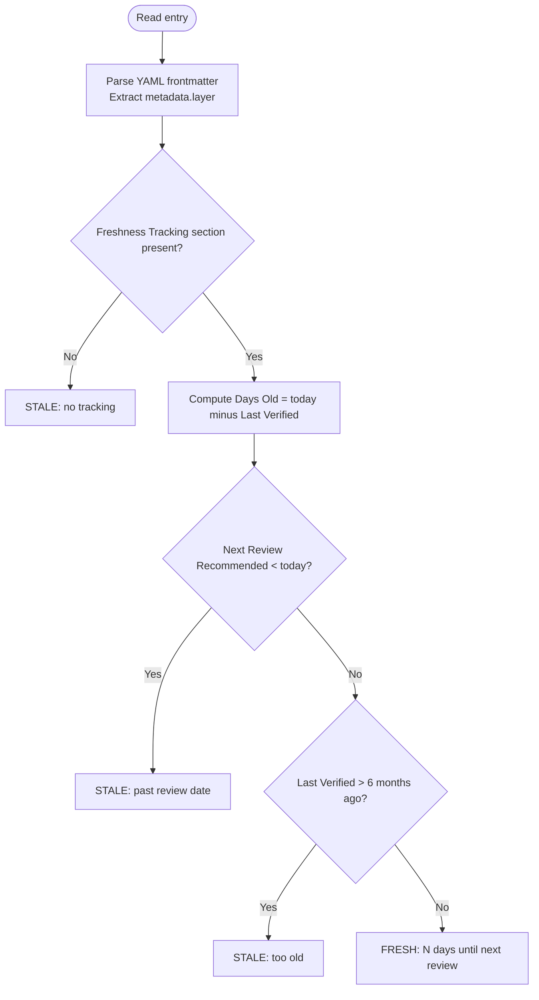

# Architecture Spec: Research Freshness Delta Indicator

## Executive Summary

Three documentation files change. No Python scripts, no agent files, no new flags. The changes
convert freshness dates from stop conditions into informational delta output. Batch Mode in
`/research-curator` auto-reruns duplicate URLs instead of skipping them. The inventory table in
`/refresh-research` gains a "Days Old" column. Fresh entries skipped by `--stale` are enumerated
in the summary report. The entry template gains two clarifying notes about the semantics of
"Next Review Recommended" and the 3-month schedule baseline.

---

## 1. Summary of Changes

### File 1: `.claude/skills/research-curator/SKILL.md`

Section changed: `## Batch Mode > ### Duplicate Detection` (line 166).

Current behavior: when a URL submitted to `--batch` already has an entry in `./research/`, the
orchestrator emits an info message suggesting `--rerun` and skips that URL. The entry is not
refreshed; no freshness data is shown.

New behavior: the orchestrator reads the entry's Freshness Tracking section, computes days since
Last Verified, emits a freshness delta message, and proceeds with `--rerun` instead of skipping.
The user receives context ("Entry is N days old") without any blocking or confirmation prompt.

Why: submitting a URL to `--batch` a second time is an explicit act of intent — the user wants
current data for that resource. The skip-and-redirect pattern forces the user to know the exact
file path to call `--rerun`, which is friction proportional to the number of URLs being
re-researched. Resolved design decision Q2: auto-rerun.

---

### File 2: `.claude/skills/refresh-research/SKILL.md`

Four sections change:

**(a) Step 1 inventory table** — adds a "Days Old" column.

Current: `| File | Category | Layer | Last Verified | Next Review | Stale? |`
New: `| File | Category | Layer | Last Verified | Next Review | Days Old | Stale? |`

Why: the delta is computed during inventory regardless of which scope filter will be applied.
Resolved design decision Q3: show days old (integer), last verified date, and version at
verification.

**(b) Step 1 staleness flowchart** — `FRESH: skip` terminal node becomes
`FRESH: N days until next review`. The node remains a non-continuing branch — fresh entries are
still excluded from the target set under `--stale` — but the node records the delta rather than
labeling the outcome as a silent skip.

Why: "FRESH: skip" is misleading about what information is retained. The new label clarifies
that (1) the entry's freshness delta is computed and available, and (2) the exclusion is a
scope-filter outcome, not a permanent gate.

**(c) Step 2 scope filter** — when `--stale` excludes a fresh entry, that entry appears in a
"Skipped (fresh)" subsection of output with its per-entry delta ("N days until next review").

Current: fresh entries contribute to the aggregate count `Skipped (fresh): {K}` in the summary
header but receive no per-entry listing.
New: fresh entries are individually listed in a "Skipped (fresh)" block before Step 3 begins,
with their delta. The listing appears regardless of whether `--dry-run` is active.

Why: the aggregate count tells the user how many were skipped but not which ones or how fresh
they are. Per-entry listing makes the freshness state auditable without needing to run Step 1
manually. Resolved design decision Q5.

**(d) Step 6 summary report** — adds "Skipped (fresh)" row to the Results table with count and
days-old range.

Current Results table rows: Updated, Unchanged, Failed.
New: adds Skipped (fresh) with range "(N–M days until next review)".

---

### File 3: `.claude/skills/research-curator/references/entry-template.md`

Two sections change:

**(a) Freshness Tracking section** — adds a note after the table clarifying that "Next Review
Recommended" is a suggestion, not an execution gate. The orchestrator always proceeds when
explicitly asked.

Why: the field name is accurate but surrounding context has historically implied it is enforced.
The note removes that ambiguity for any agent or human reading the template.

**(b) Freshness Schedule section** — adds a clause clarifying that the 3-month default is a
conservative baseline, and that high-activity repositories benefit from more frequent
verification.

Why: the triggering incident was a project that shipped two major releases and gained 10K stars
within 8 days of its last entry. The 3-month default is not wrong for most resources, but the
schedule section should acknowledge that rapidly-moving projects warrant shorter intervals.

---

## 2. File 1 — `.claude/skills/research-curator/SKILL.md`

### Changed Section: `### Duplicate Detection`

Replace the current single-sentence description (line 166):

```text
CURRENT:
Before spawning, check if ./research/ already contains an entry for the URL's resource.
If found, skip with info message suggesting --rerun instead.
```

With:

```text
NEW:
Before spawning, check if ./research/ already contains an entry for the URL's resource.
If found:
  1. Read the entry's Freshness Tracking section.
  2. Compute days since Last Verified (see section 5 of this spec).
  3. Emit: "Entry is N days old (last verified: YYYY-MM-DD, vX.Y.Z). Proceeding with refresh."
  4. Pass --rerun ./research/{category}/{name}.md to the agent instead of skipping.

If the Freshness Tracking section is absent or Last Verified is unreadable, emit:
  "Entry exists but freshness data unavailable. Proceeding with refresh."
and pass --rerun ./research/{category}/{name}.md to the agent.
```

### Changed Section: `### Progress Reporting` (wave output)

The per-wave log gains a `refreshed` outcome label alongside the existing `created` and `failed`:

```text
Wave N complete: M/N succeeded
  created    -- category/resource-name.md
  refreshed  -- category/resource-name.md (was N days old)
  failed     -- https://url.com -- {exact reason from agent}
```

### Changed Section: Batch Mode Output Format (end of `<output_format>`)

The Batch Mode output template gains a "Refreshed" subsection:

```text
## Batch Research Complete

**Total**: X URLs processed
**Created**: Y new entries
**Refreshed**: Z existing entries
**Failed**: W

### Entries Created
- ./research/{category}/{name}.md

### Entries Refreshed
- ./research/{category}/{name}.md (was N days old, last: YYYY-MM-DD, vX.Y.Z)

### Failures
- {URL} -- {exact reason from agent output}
```

---

## 3. File 2 — `.claude/skills/refresh-research/SKILL.md`

### Changed Section: Step 1 Inventory Table Header

Replace:

```text
CURRENT:
Build inventory table: `| File | Category | Layer | Last Verified | Next Review | Stale? |`
```

With:

```text
NEW:
Build inventory table:
`| File | Category | Layer | Last Verified | Next Review | Days Old | Stale? |`

The `Days Old` column holds an integer: today's date minus the Last Verified date in days.
See section 5 of this spec for the computation rule and edge-case handling.
```

### Changed Section: Step 1 Staleness Flowchart

Replace the `Fresh` terminal node and insert a `ComputeDays` action before the first decision.

Full replacement flowchart block:



Changes from current:

- `ComputeDays` action node inserted between `HasFreshness |Yes|` and `PastDue`. Computing the
  delta happens for every entry with a Freshness Tracking section, before the staleness
  decision, so the value is available in all branches (STALE and FRESH).
- `Fresh[FRESH: skip]` becomes `Fresh[FRESH: N days until next review]`. The node remains a
  non-continuing leaf — no edge exits from it to a next step — so fresh entries are still
  excluded from the STALE target set. The label change reflects that the delta is computed and
  retained, not discarded.

### Changed Section: Step 2 Scope Filter — Skipped (fresh) Listing

After the existing five filter steps and before the zero-entries stop condition, add:

```text
NEW — append to Step 2:

When the --stale filter excludes entries because they are FRESH, list each excluded entry
in a "Skipped (fresh)" block with its freshness delta:

  Skipped (fresh):
    ./research/{category}/{name}.md — N days until next review (last: YYYY-MM-DD, vX.Y.Z)
    ./research/{category}/{name}.md — N days until next review (last: YYYY-MM-DD, vX.Y.Z)

This listing appears in output before Step 3 begins, regardless of whether --dry-run is
active. Under --all (no staleness filter), no entries are excluded by staleness, so this
block does not appear.
```

### Changed Section: Step 6 Summary Report — Results Table

Replace the Results table:

```text
CURRENT:
| Outcome | Count |
|---------|-------|
| Updated | {N} |
| Unchanged | {N} |
| Failed | {N} |

NEW:
| Outcome | Count | Notes |
|---------|-------|-------|
| Updated | {N} | |
| Unchanged | {N} | |
| Failed | {N} | |
| Skipped (fresh) | {K} | {min}–{max} days until next review |
```

When K = 0, omit the Skipped (fresh) row entirely.
When K = 1, Notes column: `{N} days until next review` (single value, no range dash).

Also update the summary header line:

```text
CURRENT:
**Total scanned**: {N} | **Targeted**: {M} | **Skipped (fresh)**: {K}

NEW:
**Total scanned**: {N} | **Targeted**: {M} | **Skipped (fresh)**: {K} ({min}–{max} days until next review)
```

When K = 0: `**Skipped (fresh)**: 0`
When K = 1: `**Skipped (fresh)**: 1 ({N} days until next review)`

---

## 4. File 3 — `.claude/skills/research-curator/references/entry-template.md`

### Changed Section: Freshness Tracking Table — Appended Note

After the Freshness Tracking table (currently ends at the closing backticks of the entry
template markdown block), append:

```text
NEW — add after the Freshness Tracking table inside the entry template block:

> **Note**: "Next Review Recommended" is a suggestion, not a gate. When a user or
> orchestrator explicitly requests re-research for this entry — via `--rerun`, via
> `--batch` URL resubmission, or via `--all` — the refresh proceeds regardless of this
> date. This field provides context ("how stale is this?") and informs scheduling
> decisions. It does not block operations.
```

### Changed Section: Freshness Schedule — 3-Month Default Clause

Replace the first bullet of the Freshness Schedule section:

```text
CURRENT:
- **Next Review**: Set to 3 months from research date

NEW:
- **Next Review**: Set to 3 months from research date. This is a conservative baseline
  appropriate for stable or slow-moving projects. High-activity repositories — those with
  frequent major or minor releases, rapidly growing star or fork counts, or active breaking
  API changes — benefit from shorter intervals (4–6 weeks). The agent setting this date
  should calibrate to the observed activity level of the resource at time of research.
```

The second and third bullets are unchanged:

```text
- **Stale threshold**: 6 months without verification
- **Review required**: Version change, significant star/fork growth, breaking API changes
```

---

## 5. Delta Computation

### Source Field

Source: the entry's `## Freshness Tracking` section, `Last Verified` row.

Format in source: `YYYY-MM-DD` (ISO 8601 date string).

### Parsing Rule

1. Locate the `## Freshness Tracking` header in the entry file.
2. Find the markdown table within that section (starts with `| Field | Value |`).
3. Find the row where column 1 (trimmed of whitespace and pipe characters) equals
   `Last Verified`.
4. Extract column 2 (trimmed) as the date string.
5. Parse as ISO 8601: `YYYY-MM-DD`. If not parseable, treat as absent (see Edge Cases).

Apply the same row-lookup for:

- `Version at Verification` — column 2 is the version string (verbatim, not normalized)
- `Next Review Recommended` — column 2 is the date string (same parse rule as Last Verified)

### Arithmetic

```text
days_old          = today - last_verified_date          (integer, days)
days_until_review = next_review_date - today            (integer, days; negative = past due)
```

`today` is the date at the moment the skill or orchestrator runs — not a cached or
session-start date. No time-zone adjustment is specified; use the local calendar date.

### Formatting Rules

```text
days_old → render as integer (no decimal, no sign character)
last_verified → render as YYYY-MM-DD exactly as parsed
version → render verbatim as read from the entry (e.g., "v1.7.0", "2025.12.1", "nightly")
```

Delta message templates use these values — see section 6 for exact templates.

For `days_until_review`:

```text
days_until > 0  → "{days_until} days until next review"
days_until == 0 → "next review due today"
days_until < 0  → "{abs(days_until)} days past review date"
                  (this branch only appears under --all or explicit --rerun, since
                   negative days_until means the entry is already classified STALE)
```

---

## 6. Output Format Spec

### Template A: Batch Mode Duplicate — Freshness Delta Message

Context: `/research-curator` Batch Mode, URL already has an entry, Freshness Tracking readable.

```text
Entry is {N} days old (last verified: {YYYY-MM-DD}, {vX.Y.Z}). Proceeding with refresh.
```

Example:

```text
Entry is 8 days old (last verified: 2026-02-26, v1.7.0). Proceeding with refresh.
```

When version is absent or unreadable, omit the version token:

```text
Entry is {N} days old (last verified: {YYYY-MM-DD}). Proceeding with refresh.
```

---

### Template B: Batch Mode Duplicate — Freshness Data Unavailable

Context: `/research-curator` Batch Mode, URL already has an entry, Freshness Tracking section
absent or Last Verified not parseable.

```text
Entry exists but freshness data unavailable. Proceeding with refresh.
```

---

### Template C: Batch Mode Wave Progress — Refreshed Outcome Line

Context: per-wave log entry when an existing entry was refreshed (not created fresh).

```text
  refreshed  -- {category}/{name}.md (was {N} days old)
```

Example:

```text
  refreshed  -- agent-frameworks/agno.md (was 8 days old)
```

---

### Template D: refresh-research Step 2 Skipped-Fresh Entry Line

Context: per-entry line in the "Skipped (fresh)" listing emitted before Step 3.

Full version (version available):

```text
  ./research/{category}/{name}.md — {N} days until next review (last: {YYYY-MM-DD}, {vX.Y.Z})
```

No version:

```text
  ./research/{category}/{name}.md — {N} days until next review (last: {YYYY-MM-DD})
```

Next review date absent:

```text
  ./research/{category}/{name}.md — review date unknown (last: {YYYY-MM-DD}, {vX.Y.Z})
```

Example:

```text
  ./research/agent-frameworks/agno.md — 82 days until next review (last: 2026-02-26, v1.7.0)
```

---

### Template E: refresh-research Step 6 Summary Header

Multiple skipped (K > 1):

```text
**Total scanned**: {N} | **Targeted**: {M} | **Skipped (fresh)**: {K} ({min}–{max} days until next review)
```

Single skipped (K = 1):

```text
**Total scanned**: {N} | **Targeted**: {M} | **Skipped (fresh)**: 1 ({N} days until next review)
```

Zero skipped (K = 0):

```text
**Total scanned**: {N} | **Targeted**: {M} | **Skipped (fresh)**: 0
```

---

### Template F: refresh-research Step 6 Results Table — Skipped (fresh) Row

Multiple entries:

```text
| Skipped (fresh) | {K} | {min}–{max} days until next review |
```

Single entry:

```text
| Skipped (fresh) | 1 | {N} days until next review |
```

K = 0: row is omitted from the table entirely.

---

## 7. Edge Cases

### EC-1: No Freshness Tracking Section

Condition: the entry file does not contain a `## Freshness Tracking` header.

In **Batch Mode duplicate detection**:
- Cannot compute days_old or version.
- Emit Template B and proceed with `--rerun`.

In **refresh-research Step 1**:
- Entry is already classified `STALE: no tracking` by the existing first branch
  (`HasFreshness -->|No| Stale1`). No Days Old value can be computed.
- Inventory table Days Old column: render as `—` (em-dash).

---

### EC-2: Last Verified Field Absent

Condition: the Freshness Tracking section exists but the `Last Verified` row is missing or
the value cell is empty.

In **Batch Mode**: emit Template B. Proceed with `--rerun`.

In **refresh-research Step 1**: `ComputeDays` produces no value. Classify the entry as STALE
(equivalent to `STALE: no tracking`) so it is not silently excluded from the target set.
Inventory table Days Old: render as `—`.

---

### EC-3: Last Verified Field Malformed

Condition: the `Last Verified` row exists but the date value is not parseable as `YYYY-MM-DD`
(e.g., `"TBD"`, `"unknown"`, `"2026-03"`, `"March 2026"`).

Behavior: same as EC-2. Do not attempt date arithmetic on a non-conforming string. Treat as
absent.

---

### EC-4: Next Review Recommended Absent or Malformed

Condition: cannot compute `days_until_review`.

In the "Skipped (fresh)" listing, render as:

```text
  ./research/{category}/{name}.md — review date unknown (last: {YYYY-MM-DD}, {vX.Y.Z})
```

In the Step 6 summary table Notes column: render as `—`.

This entry cannot appear in the FRESH branch of the flowchart if both Next Review and the
6-month threshold are needed to determine FRESH status. If Next Review is absent and the entry
is not yet 6 months old by Last Verified, it will reach the `TooOld -->|No|` branch and be
classified FRESH. In that case the "days until next review" value is simply unavailable —
use the "review date unknown" template.

---

### EC-5: Last Verified Date Is in the Future

Condition: the parsed Last Verified date is after today (data entry error in the entry file).

Behavior: `days_old` would be negative. Render as `0` days old in all output templates. Do
not emit a negative number. Optionally include a warning line in the Step 2 Skipped (fresh)
listing:

```text
  ./research/{category}/{name}.md — review date unknown (Last Verified date {date} is in the future)
```

---

### EC-6: Version String Contains Unusual Characters

Condition: version is `"0.8.2-rc1"`, `"2025.12.1"`, `"nightly-20260305"`, `"v2.0.0-beta.3"`.

Behavior: use the string verbatim as read from the entry. Do not normalize, strip, or reformat
it. Render in message templates exactly as stored.

---

### EC-7: Entry Path Does Not Match `{category}/{name}` Structure

Condition: a file is found directly under `./research/` (no subdirectory), e.g.,
`./research/orphan.md`.

Behavior in Batch Mode: use the full path `./research/orphan.md` in Template A/B and in the
`--rerun` argument. Do not fabricate a category name.

Behavior in refresh-research inventory: the Category column renders as `—`. Days Old and Stale
classification proceed normally based on the Freshness Tracking section.

---

### EC-8: All Entries Fresh Under --stale

Condition: `--stale` is the active filter and every inventoried entry is classified FRESH.

Behavior: the existing stop condition message is retained:
`"All entries are fresh. Nothing to refresh."`

The "Skipped (fresh)" listing — all entries with their deltas — is emitted before this message.
The user sees the full freshness state of the research directory before the skill halts.

---

## 8. What Does NOT Change

### Agent `--rerun` Mode

The `@research-curator` agent's `--rerun` mode (`.claude/agents/research-curator.md` lines
324–338) is unchanged. It already reads the existing entry, re-gathers fresh data from primary
sources, re-extracts passages noting changes, updates content and freshness tracking, and returns
a structured result listing what changed and what was confirmed unchanged.

The orchestrator-level changes in this spec ensure `--rerun` is reached more often (by removing
the batch-mode skip gate), but the agent's behavior when it receives `--rerun` is identical to
today. Resolved design decision Q4: agent is unchanged.

---

### `--all` Flag Behavior

`--all` already bypasses the staleness filter (Step 2 keeps all entries). This behavior is
unchanged. The `--all` path does gain the "Days Old" column in the Step 1 inventory table —
that column is computed for every entry regardless of scope — but the scope filter logic
"keep all entries" is unchanged. The "Skipped (fresh)" listing does not appear under `--all`
because no entries are excluded by staleness.

---

### `--dry-run` Flag

`--dry-run` behavior is unchanged: display the filtered target list and stop without spawning
agents. The "Days Old" column appears in the inventory table regardless of `--dry-run` state,
meaning `--dry-run` output already shows the delta without any additional logic. The "Skipped
(fresh)" listing also appears under `--dry-run --stale` since it is emitted at Step 2, before
the dry-run stop. Resolved design decision Q5.

---

### `--category` and `--layer` Filters

These filters operate on the target set after staleness classification. Their logic is
unchanged. The "Skipped (fresh)" listing reflects all entries excluded by the staleness filter
before category or layer filters narrow the STALE set further — it does not interact with
those filters.

---

### `--stale` Default for Automation

`--stale` remains the default and continues to exclude fresh entries from the agent-spawn target
set. Automated pipelines using `--stale` will not over-refresh. The only change is that
excluded entries now appear in the "Skipped (fresh)" listing and the summary table's new row,
providing visibility without changing the refresh behavior. Resolved design decision Q1.

---

### Validate Mode

`/research-curator --validate` is not in scope for this feature. Its three-severity gating
(error / warning / info) and auto-fix workflow are unchanged.

---

### Single-URL Default Mode in `research-curator`

The Default Mode (single URL, no flags) spawns `@research-curator` unconditionally. There is no
duplicate check in Default Mode today, and this spec does not add one. The feature context
identifies this as Gap #3 but it is out of scope for issue #444.

---

### Python Scripts

No Python scripts are changed. `validate_research.py` and all other scripts in
`.claude/skills/research-curator/scripts/` are unmodified. The three files changed are all
Markdown documentation files read by orchestrators and agents as instructions.

---

## Source References

- `.claude/skills/research-curator/SKILL.md` lines 164–166 (Batch Mode Duplicate Detection);
  lines 369–417 (Output Format templates) — source of changed sections in File 1
- `.claude/skills/refresh-research/SKILL.md` lines 23–58 (Step 1 and Step 2); lines 106–138
  (Step 6 Summary Report); line 158 (Error Handling stop condition) — source of changed
  sections in File 2
- `.claude/skills/research-curator/references/entry-template.md` lines 168–183 (Freshness
  Tracking and Freshness Schedule sections) — source of changed sections in File 3
- `.claude/agents/research-curator.md` lines 324–338 (`--rerun` mode, confirmed unchanged)
- `plan/feature-context-research-freshness-delta.md` — resolved design decisions Q1–Q5,
  gap analysis, use scenarios
- `plan/codebase/skill-conventions.md` — Mermaid node type conventions, `<br>` for multi-line
  node labels, stop vs. skip encoding, `=` not `:` in Mermaid quoted strings
