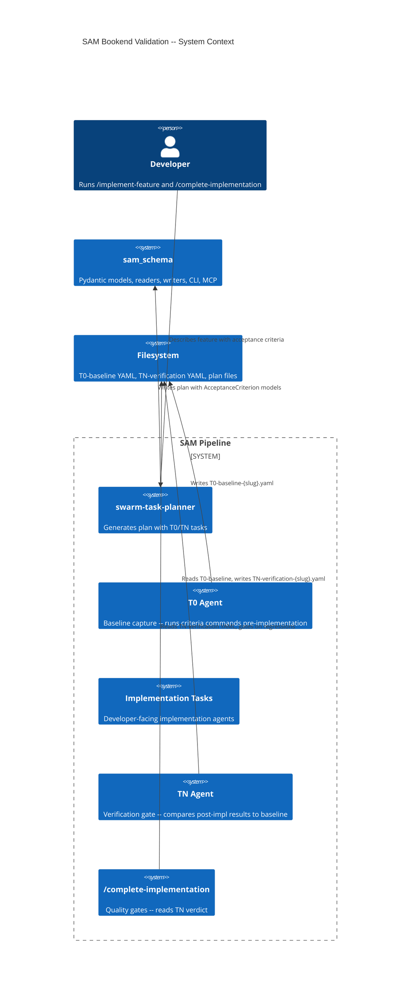
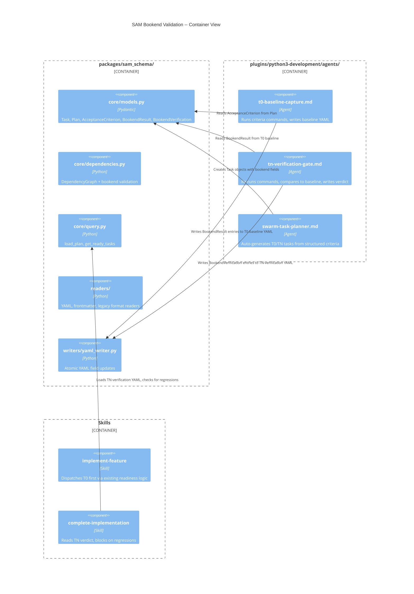
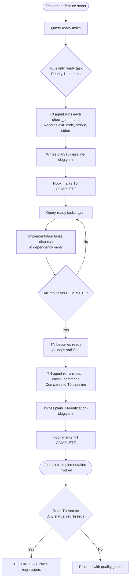
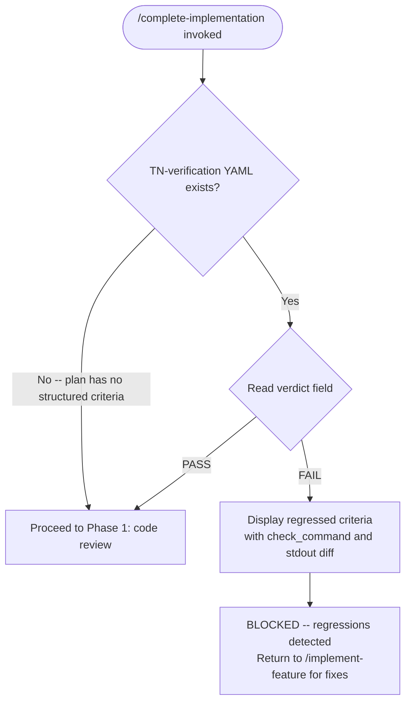

# Architecture Spec: SAM Bookend Validation (T0/TN)

**Feature**: SAM bookend validation -- baseline capture (T0) and verification gate (TN)
**Date**: 2026-03-15
**Status**: DRAFT
**Backlog**: #718
**Input artifacts**:

- [Feature context](./feature-context-sam-bookend-validation.md)
- [Codebase analysis](./codebase/SAM-BOOKEND-ARCHITECTURE.md)

---

## 1. Executive Summary

Extend the SAM pipeline with two mandatory bookend tasks that bracket implementation work. T0 (baseline capture) executes plan-level acceptance criteria commands before any implementation task starts, recording exit codes and output. TN (verification gate) re-executes the same commands after all implementation tasks complete, comparing results against the T0 baseline to produce a per-criterion verdict: `passed`, `regressed`, `pre-existing-fail`, or `newly-passing`. Regressions block `/complete-implementation`.

The architecture adds five components to the existing SAM infrastructure:

1. **AcceptanceCriterion model** in `sam_schema` -- structured criteria with `check_command` fields, coexisting with the existing prose `acceptance_criteria` string field.
2. **T0 agent** -- reads plan criteria, runs commands via Bash, writes `plan/T0-baseline-{slug}.yaml`.
3. **TN agent** -- reads T0 baseline, re-runs commands, computes per-criterion status, writes `plan/TN-verification-{slug}.yaml`.
4. **swarm-task-planner update** -- auto-generates T0 and TN tasks when structured criteria exist.
5. **Workflow integration** -- `/implement-feature` dispatches T0 first; `/complete-implementation` reads TN verdict before proceeding.

No changes to the task dispatch loop, readiness logic, or hook system. T0 and TN are regular tasks with correct priority and dependency declarations -- the existing `DependencyGraph` handles ordering.

## 2. Architecture Overview

### C4 Context Diagram



### C4 Container Diagram



### Execution Flow



## 3. Technology Stack

This feature extends existing infrastructure. No new libraries are introduced.

**Existing stack (no changes)**:

- **Data models**: Pydantic (BaseModel, Field, field_validator) -- already used in `sam_schema`
- **YAML**: `ruamel.yaml` -- already used by readers/writers
- **CLI**: Typer -- already used by `sam_schema` CLI
- **Testing**: pytest 8+, pytest-cov, pytest-mock -- already configured
- **Type checking**: basedpyright -- already configured in `pyproject.toml`
- **Linting**: ruff -- already configured

**New components (no new deps)**:

- `AcceptanceCriterion`, `BookendResult`, `BookendVerification` -- Pydantic models in existing `models.py`
- `BookendValidator` -- validation class in existing `dependencies.py`
- Two agent markdown files -- no code dependencies
- T0/TN YAML files -- written by agents using existing `ruamel.yaml` infrastructure

## 4. Component Design

### 4.1 core/models.py -- New Models

**File**: `packages/sam_schema/sam_schema/core/models.py`

Three new Pydantic models are added. The existing `Task` and `Plan` models gain new optional fields.

```python
class CriterionStatus(StrEnum):
    """Verdict for a single acceptance criterion after TN comparison."""
    PASSED = "passed"               # exit 0 at both T0 and TN
    REGRESSED = "regressed"         # exit 0 at T0, non-zero at TN
    PRE_EXISTING_FAIL = "pre-existing-fail"  # non-zero at both T0 and TN
    NEWLY_PASSING = "newly-passing" # non-zero at T0, exit 0 at TN


class AcceptanceCriterion(BaseModel):
    """A single executable acceptance criterion for a SAM plan.

    Lives in Plan.acceptance_criteria_structured (list). Coexists with
    the existing Plan.acceptance_criteria prose string field.
    """
    model_config = ConfigDict(populate_by_name=True)

    criterion_id: str = Field(..., alias="criterion-id", min_length=1)
    description: str = ""
    check_command: str = Field(..., alias="check-command", min_length=1)
    expected_baseline: str = Field(
        default="any", alias="expected-baseline"
    )  # "pass" | "fail" | "any"
    expected_final: str = Field(
        default="pass", alias="expected-final"
    )  # "pass" | "fail" | "any"


class BookendResult(BaseModel):
    """Result of running a single check_command during T0 or TN.

    Written to T0-baseline-{slug}.yaml and used as comparison input by TN.
    """
    model_config = ConfigDict(populate_by_name=True)

    criterion_id: str = Field(..., alias="criterion-id")
    check_command: str = Field(..., alias="check-command")
    exit_code: int = Field(..., alias="exit-code")
    stdout: str = ""
    stderr: str = ""
    timestamp: str = ""  # ISO 8601
    duration_seconds: float = Field(default=0.0, alias="duration-seconds")


class BookendVerification(BaseModel):
    """Per-criterion comparison result from TN verification gate.

    Written to TN-verification-{slug}.yaml.
    """
    model_config = ConfigDict(populate_by_name=True)

    criterion_id: str = Field(..., alias="criterion-id")
    check_command: str = Field(..., alias="check-command")
    t0_exit_code: int = Field(..., alias="t0-exit-code")
    tn_exit_code: int = Field(..., alias="tn-exit-code")
    status: CriterionStatus
    stdout_diff_summary: str = Field(default="", alias="stdout-diff-summary")
```

**Existing model extensions**:

```python
# Plan model gains:
class Plan(BaseModel):
    # ... existing fields ...
    acceptance_criteria_structured: list[AcceptanceCriterion] = Field(
        default_factory=list, alias="acceptance-criteria-structured"
    )

# Task model -- id field pattern change:
class Task(BaseModel):
    id: str = Field(..., pattern=r"^[A-Za-z]?\d+(\.\d+)?[A-Za-z]?$")
    # ... existing fields ...
    is_bookend: bool = Field(default=False, alias="is-bookend")
    bookend_type: str | None = Field(default=None, alias="bookend-type")
    # bookend_type values: "t0-baseline" | "tn-verification" | None
```

**Task ID resolution**: `T0` matches the existing pattern `^[A-Za-z]?\d+(\.\d+)?[A-Za-z]?$` (letter T, digit 0). For TN, use a computed numeric ID: the `swarm-task-planner` assigns the ID `T99` (or `T{max_task_number + 1}` if 99 conflicts). The `bookend_type` field provides semantic identification independent of the ID value.

### 4.2 core/dependencies.py -- BookendValidator

**File**: `packages/sam_schema/sam_schema/core/dependencies.py`

New validation class added alongside the existing `DependencyGraph`.

```python
class BookendValidator:
    """Validates structural constraints on bookend tasks within a plan.

    Constraints enforced:
    - At most one T0 (bookend_type == "t0-baseline") per plan
    - At most one TN (bookend_type == "tn-verification") per plan
    - T0 must have dependencies: [] (no dependencies)
    - TN must depend on all non-bookend tasks
    - If structured acceptance criteria exist, both T0 and TN must exist
    """

    def __init__(self, plan: Plan) -> None: ...

    def validate(self) -> list[str]:
        """Return list of validation error strings. Empty = valid."""
        ...

    def get_t0_task(self) -> Task | None:
        """Return the T0 task, or None if not present."""
        ...

    def get_tn_task(self) -> Task | None:
        """Return the TN task, or None if not present."""
        ...

    def get_implementation_task_ids(self) -> list[str]:
        """Return IDs of all non-bookend tasks."""
        ...
```

### 4.3 readers/ -- Structured Criteria Parsing

**Files**: `packages/sam_schema/sam_schema/readers/yaml_reader.py`, `frontmatter_reader.py`, `legacy_reader.py`

All readers gain support for the `acceptance-criteria-structured` field on the Plan model. This is a YAML list of objects:

```yaml
acceptance-criteria-structured:
  - criterion-id: AC-1
    description: "Body content preserved during format conversion"
    check-command: "uv run pytest tests/test_conversion.py::test_body_preserved -v"
    expected-baseline: any
    expected-final: pass
  - criterion-id: AC-2
    description: "Task count matches after roundtrip"
    check-command: "uv run pytest tests/test_roundtrip.py -v"
    expected-baseline: pass
    expected-final: pass
```

The existing `acceptance-criteria` string field continues to work as-is. Plans without `acceptance-criteria-structured` produce no T0/TN tasks.

### 4.4 T0 Agent -- Baseline Capture

**File**: `plugins/python3-development/agents/t0-baseline-capture.md`

**Purpose**: Read plan's structured acceptance criteria, execute each `check_command`, write results to `plan/T0-baseline-{slug}.yaml`.

**Tools**: Read, Bash, Write, Glob

**Agent interface** (inputs and outputs):

- **Input**: Plan file path (from `/start-task` delegation). Agent reads the plan, extracts `acceptance_criteria_structured`.
- **Output**: `plan/T0-baseline-{slug}.yaml` containing a list of `BookendResult` entries.
- **Behavior**: For each `AcceptanceCriterion`, run `check_command` via Bash. Capture exit code, stdout, stderr. Record timestamp and duration. Non-zero exit codes are expected (pre-existing failures). The agent does NOT fail on non-zero exit codes from check commands.

**T0 baseline YAML schema**:

```yaml
# plan/T0-baseline-{slug}.yaml
feature: "{slug}"
captured_at: "2026-03-15T10:00:00Z"
plan_path: "plan/tasks-5-{slug}.md"
criteria_count: 2
results:
  - criterion-id: AC-1
    check-command: "uv run pytest tests/test_conversion.py::test_body_preserved -v"
    exit-code: 1
    stdout: |
      FAILED tests/test_conversion.py::test_body_preserved - AssertionError
    stderr: ""
    timestamp: "2026-03-15T10:00:01Z"
    duration-seconds: 2.3
  - criterion-id: AC-2
    check-command: "uv run pytest tests/test_roundtrip.py -v"
    exit-code: 0
    stdout: |
      PASSED tests/test_roundtrip.py - 3 passed
    stderr: ""
    timestamp: "2026-03-15T10:00:04Z"
    duration-seconds: 1.8
```

### 4.5 TN Agent -- Verification Gate

**File**: `plugins/python3-development/agents/tn-verification-gate.md`

**Purpose**: Re-run acceptance criteria commands, compare against T0 baseline, write verification report.

**Tools**: Read, Bash, Write

**Agent interface**:

- **Input**: Plan file path and T0-baseline YAML path (from `/start-task` delegation or inferred from slug).
- **Output**: `plan/TN-verification-{slug}.yaml` containing a list of `BookendVerification` entries plus a summary verdict.
- **Behavior**: For each criterion, re-run `check_command`. Compare `tn_exit_code` against `t0_exit_code` from baseline. Compute `CriterionStatus`. Write report. If any criterion has `status: regressed`, the verdict is `FAIL`. Otherwise `PASS`.

**TN verification YAML schema**:

```yaml
# plan/TN-verification-{slug}.yaml
feature: "{slug}"
verified_at: "2026-03-15T14:00:00Z"
plan_path: "plan/tasks-5-{slug}.md"
t0_baseline_path: "plan/T0-baseline-{slug}.yaml"
verdict: "PASS"  # or "FAIL"
criteria_count: 2
regressions: 0
newly_passing: 1
results:
  - criterion-id: AC-1
    check-command: "uv run pytest tests/test_conversion.py::test_body_preserved -v"
    t0-exit-code: 1
    tn-exit-code: 0
    status: newly-passing
    stdout-diff-summary: "Was FAILED, now PASSED (3 tests passed)"
  - criterion-id: AC-2
    check-command: "uv run pytest tests/test_roundtrip.py -v"
    t0-exit-code: 0
    tn-exit-code: 0
    status: passed
    stdout-diff-summary: ""
```

### 4.6 swarm-task-planner Update

**File**: `plugins/python3-development/agents/swarm-task-planner.md`

**Change**: Add rules for auto-generating T0 and TN tasks when the plan contains `acceptance-criteria-structured`.

**T0 task template**:

```yaml
id: "T0"
title: "T0: Capture baseline state"
status: not-started
agent: t0-baseline-capture
dependencies: []
priority: 1
complexity: low
is-bookend: true
bookend-type: t0-baseline
objective: "Run all structured acceptance criteria commands and record baseline results"
acceptance-criteria: "T0-baseline-{slug}.yaml exists with one entry per structured criterion"
verification-steps: "cat plan/T0-baseline-{slug}.yaml and confirm criteria_count matches plan"
expected-outputs: "plan/T0-baseline-{slug}.yaml"
```

**TN task template**:

```yaml
id: "T99"  # or T{max+1} if 99 conflicts
title: "TN: Verify implementation against baseline"
status: not-started
agent: tn-verification-gate
dependencies: ["T1", "T2", "T3"]  # all non-bookend task IDs
priority: 5
complexity: low
is-bookend: true
bookend-type: tn-verification
objective: "Re-run acceptance criteria and compare against T0 baseline"
acceptance-criteria: "TN-verification-{slug}.yaml exists with verdict PASS (no regressions)"
verification-steps: "cat plan/TN-verification-{slug}.yaml and confirm verdict is PASS"
expected-outputs: "plan/TN-verification-{slug}.yaml"
```

**Dependency rule**: Every non-bookend implementation task must include `T0` in its `dependencies` list. TN must include all non-bookend task IDs in its `dependencies`.

### 4.7 Workflow Integration

**Skill**: `/implement-feature` -- no code changes needed. T0 is dispatched first because it has Priority 1 and no dependencies. TN is dispatched last because it depends on all implementation tasks. The existing `DependencyGraph.get_ready_tasks()` handles this ordering.

**Skill**: `/complete-implementation` -- instruction update only. Before invoking Phase 1 (code review), read `plan/TN-verification-{slug}.yaml`. If `verdict` is `FAIL`, report regressions and stop. If the file does not exist (plan has no structured criteria), proceed as today.



## 5. Data Architecture

### 5.1 Configuration Schema

No new configuration files. Structured acceptance criteria live in existing plan YAML files as a new field (`acceptance-criteria-structured`). T0 and TN output files are generated artifacts, not configuration.

### 5.2 Data Models Summary

All models live in `packages/sam_schema/sam_schema/core/models.py`.

**New models**:

| Model | Purpose | Key Fields |
|-------|---------|------------|
| `CriterionStatus` | StrEnum for TN verdicts | `PASSED`, `REGRESSED`, `PRE_EXISTING_FAIL`, `NEWLY_PASSING` |
| `AcceptanceCriterion` | Executable criterion definition | `criterion_id`, `check_command`, `expected_baseline`, `expected_final` |
| `BookendResult` | T0/TN command execution result | `criterion_id`, `check_command`, `exit_code`, `stdout`, `stderr`, `timestamp`, `duration_seconds` |
| `BookendVerification` | TN comparison result per criterion | `criterion_id`, `t0_exit_code`, `tn_exit_code`, `status`, `stdout_diff_summary` |

**Extended models**:

| Model | New Field | Type | Default |
|-------|-----------|------|---------|
| `Plan` | `acceptance_criteria_structured` | `list[AcceptanceCriterion]` | `[]` |
| `Task` | `is_bookend` | `bool` | `False` |
| `Task` | `bookend_type` | `str \| None` | `None` |

### 5.3 T0 Baseline File Schema

**Path**: `plan/T0-baseline-{slug}.yaml`
**Written by**: T0 agent
**Read by**: TN agent

Top-level fields:

| Field | Type | Description |
|-------|------|-------------|
| `feature` | `str` | Feature slug |
| `captured_at` | `str` (ISO 8601) | When T0 ran |
| `plan_path` | `str` | Path to the plan file |
| `criteria_count` | `int` | Number of criteria executed |
| `results` | `list[BookendResult]` | One entry per criterion |

### 5.4 TN Verification File Schema

**Path**: `plan/TN-verification-{slug}.yaml`
**Written by**: TN agent
**Read by**: `/complete-implementation` skill

Top-level fields:

| Field | Type | Description |
|-------|------|-------------|
| `feature` | `str` | Feature slug |
| `verified_at` | `str` (ISO 8601) | When TN ran |
| `plan_path` | `str` | Path to plan file |
| `t0_baseline_path` | `str` | Path to T0 baseline file |
| `verdict` | `str` | `"PASS"` or `"FAIL"` |
| `criteria_count` | `int` | Total criteria |
| `regressions` | `int` | Count of `regressed` criteria |
| `newly_passing` | `int` | Count of `newly-passing` criteria |
| `results` | `list[BookendVerification]` | One entry per criterion |

### 5.5 Status Computation Logic

The TN agent computes `CriterionStatus` using this matrix:

| T0 exit code | TN exit code | Status |
|-------------|-------------|--------|
| 0 | 0 | `passed` |
| 0 | non-zero | `regressed` |
| non-zero | non-zero | `pre-existing-fail` |
| non-zero | 0 | `newly-passing` |

**Verdict**: `FAIL` if any criterion has `status: regressed`. `PASS` otherwise.

**Pre-existing failures do not block**. The design is purely observational at T0 -- it records whatever happens. This handles the case where test files do not yet exist at T0 time (they fail with "file not found", which is recorded as a pre-existing failure).

## 6. Security Architecture

### 6.1 Command Execution

T0 and TN agents execute `check_command` strings via the Bash tool. These commands originate from plan files authored by trusted agents (swarm-task-planner) or the developer.

**Security constraints**:

- [x] Commands are read from plan YAML, not from user input at runtime -- the trust boundary is plan authorship
- [x] Bash tool provides sandboxing via Claude Code's permission system -- agents cannot execute commands without tool approval
- [x] No `shell=True` in subprocess calls from Python code -- agents use the Bash tool directly
- [x] stdout/stderr are captured as strings, not interpreted or executed
- [x] T0/TN YAML output files are written to the `plan/` directory (project-local), not to system paths

### 6.2 Credential Management

No credentials are introduced by this feature. Check commands may reference tools that use credentials (e.g., `uv run pytest` may access test databases), but credential management is the responsibility of those tools, not the bookend system.

### 6.3 Security Checklist

- [x] Path traversal prevention: output paths are `plan/T0-baseline-{slug}.yaml` and `plan/TN-verification-{slug}.yaml` -- slug is validated by the plan's `feature` field
- [x] Command injection prevention: commands come from YAML parsed by `ruamel.yaml`, not from string interpolation
- [x] No temp files: all output goes to deterministic paths in `plan/`
- [x] No network calls: bookend agents run local commands only
- [x] No certificate handling: not applicable

## 7. Testing Architecture

### 7.1 Testing Stack

```text
pytest>=8.0.0              # test execution
pytest-cov>=6.0.0          # coverage (80% minimum)
pytest-mock>=3.14.0        # mocking
hypothesis>=6.100.0        # property-based testing for model validation
```

All tests live in `packages/sam_schema/tests/` alongside existing sam_schema tests.

### 7.2 Coverage Requirements

- **Overall**: 80% line and branch coverage (existing `fail_under=80` in pyproject.toml)
- **Critical code**: `BookendValidator.validate()` and status computation logic require 95%+ coverage
- **Mutation testing**: status matrix (4 cases) requires 100% kill rate

### 7.3 Test Categories

**Unit tests (core models)**:

- `AcceptanceCriterion` construction with valid/invalid inputs
- `BookendResult` serialization/deserialization roundtrip
- `BookendVerification` status computation for all 4 matrix cells
- `CriterionStatus` enum values and serialization
- `Plan.acceptance_criteria_structured` coexistence with `Plan.acceptance_criteria` string
- `Task.is_bookend` and `Task.bookend_type` defaults and validation
- Property-based: `@given` strategies for `AcceptanceCriterion` with arbitrary `check_command` strings

**Unit tests (BookendValidator)**:

- Valid plan with T0 and TN -- no errors
- Plan with T0 but no TN -- error
- Plan with TN but no T0 -- error
- T0 with dependencies -- error
- TN missing a dependency on an implementation task -- error
- Multiple T0 tasks -- error
- Plan without structured criteria and no bookends -- no errors (backward compatible)
- `get_t0_task()` and `get_tn_task()` return correct tasks or None

**Unit tests (readers)**:

- YAML reader parses `acceptance-criteria-structured` list
- Frontmatter reader parses structured criteria from YAML header
- Legacy reader ignores structured criteria (not supported in legacy format)
- Plans without the field produce empty list (backward compatible)

**Integration tests**:

- End-to-end: create plan YAML with structured criteria, load via `load_plan()`, verify `AcceptanceCriterion` objects are populated
- Roundtrip: write plan with structured criteria via `yaml_writer`, re-read, verify equality
- `get_ready_tasks()` returns T0 first on a fresh plan with bookend tasks

### 7.4 Test Directory Structure

```text
packages/sam_schema/tests/
  test_core/
    test_models.py           # existing + new AcceptanceCriterion, BookendResult, BookendVerification tests
    test_dependencies.py     # existing + new BookendValidator tests
  test_readers/
    test_yaml_reader.py      # existing + structured criteria parsing
    test_frontmatter_reader.py
  fixtures/
    plan_with_bookends.yaml  # test fixture with T0, TN, structured criteria
    t0_baseline_sample.yaml  # sample T0 output for reader tests
    tn_verification_sample.yaml
```

### 7.5 pytest Configuration

Existing `pyproject.toml` configuration applies. No changes needed:

```toml
[tool.pytest.ini_options]
addopts = ["--cov=packages/sam_schema", "--cov-report=term-missing", "-v"]
testpaths = ["packages/sam_schema/tests"]
```

## 8. Distribution Architecture

**Strategy 2 -- Python Package** applies. All code changes go into the existing `packages/sam_schema/` package. No new packages or standalone scripts are created.

**Agent files** are markdown (not Python), placed in `plugins/python3-development/agents/`. They are distributed as part of the `python3-development` plugin.

**No PEP 723 scripts** are introduced. The T0 and TN agents are Claude Code agents that use the Bash tool to run commands -- they do not invoke Python scripts of their own.

**Build system**: Existing Hatchling configuration in `packages/sam_schema/pyproject.toml`. The new models are automatically included in the wheel.

```toml
[build-system]
requires = ["hatchling"]
build-backend = "hatchling.build"

[tool.hatchling.build.targets.wheel]
packages = ["packages/sam_schema"]
```

## 9. Architectural Decisions (ADRs)

### ADR-001: Plan-Level Criteria Only (Not Task-Level)

**Context**: Acceptance criteria exist on both `Task` and `Plan` models. T0/TN could execute criteria from either level.

**Decision**: T0/TN execute only plan-level structured criteria (`Plan.acceptance_criteria_structured`). Task-level `acceptance_criteria` remains a prose string for agent guidance.

**Rationale**: T0/TN operate on the whole plan as a unit. Plan-level criteria represent the feature's behavioral contract. Task-level criteria guide individual agent work and are verified by the existing feature-verifier. Mixing levels would create ambiguity about which criteria block completion.

**Consequences**: Developers must write executable criteria at the plan level. The swarm-task-planner generates these from the architecture spec's acceptance criteria section.

### ADR-002: TN as Plan Task (Not /complete-implementation Phase)

**Context**: TN could be a task in the plan (dispatched by `/implement-feature`) or a new phase inside `/complete-implementation`.

**Decision**: TN is a regular plan task with `is_bookend: true` and `bookend_type: tn-verification`. It is dispatched by the existing task loop in `/implement-feature`.

**Rationale**: Keeps TN inside the plan's dependency graph -- visible in `sam status`, tracked by hooks, subject to the same lifecycle as implementation tasks. Avoids modifying `/complete-implementation` execution logic. The existing `DependencyGraph` handles ordering via TN's dependency on all implementation tasks.

**Consequences**: `/complete-implementation` needs only a read-and-gate step (check TN YAML verdict), not a full execution phase. Plans without structured criteria have no TN task and skip the gate.

### ADR-003: Additive Field (acceptance_criteria_structured) Instead of Union Type

**Context**: The existing `acceptance_criteria` field is a plain string. Options: replace with union type, or add a separate structured field.

**Decision**: Add `acceptance_criteria_structured: list[AcceptanceCriterion]` as a new field. The existing `acceptance_criteria: str` field is unchanged.

**Rationale**: Zero migration required. All existing plans continue to work. The structured field is optional (defaults to empty list). Readers that encounter plans without the field produce an empty list. No union-type complexity in validators or serializers.

**Consequences**: Two fields hold acceptance criteria in different forms. The prose field is for human/agent reading. The structured field is for T0/TN execution. They may diverge -- this is acceptable because they serve different consumers.

### ADR-004: T0 and T99 IDs with bookend_type Semantic Field

**Context**: The task ID pattern `^[A-Za-z]?\d+(\.\d+)?[A-Za-z]?$` accepts `T0` but not `TN` (N is not a digit).

**Decision**: Use `T0` for baseline and `T99` (or `T{max+1}` if 99 conflicts) for verification. Add `bookend_type` field (`"t0-baseline"` | `"tn-verification"`) for semantic identification.

**Rationale**: Avoids changing the task ID regex (which would affect all validators, readers, and dependency resolution). `T99` sorts last numerically. The `bookend_type` field provides unambiguous identification regardless of the specific ID assigned. The swarm-task-planner computes the actual TN ID at generation time.

**Consequences**: The TN task ID is not fixed -- it varies per plan. Code that needs to find TN must query by `bookend_type`, not by ID. This is more robust than ID-based lookup.

### ADR-005: Purely Observational T0 (No Expected-State Gating)

**Context**: T0 could either record whatever happens (observational) or gate on expected states (fail if a criterion marked `expected_baseline: pass` actually fails).

**Decision**: T0 is purely observational. It records exit codes and output for every criterion without evaluating expectations. The `expected_baseline` field is metadata for documentation, not a gate.

**Rationale**: At T0 time, the codebase is pre-implementation. Test files for new features do not exist. Commands that reference those files fail with "file not found." Gating on expected state would require the plan author to correctly predict which criteria pass before implementation -- an unreasonable burden. The value of T0 is the baseline record, not pre-implementation validation.

**Consequences**: The `expected_baseline` and `expected_final` fields on `AcceptanceCriterion` are informational. Future enhancements could use them for richer reporting (e.g., "criterion AC-1 was expected to fail at T0 and did").

## 10. Scalability Strategy

### 10.1 Command Execution

T0 and TN run acceptance criteria commands sequentially (not in parallel). Rationale: commands may share state (filesystem, database), and parallel execution introduces race conditions. Sequential execution is simpler and deterministic.

If sequential execution becomes a bottleneck for plans with many criteria, a future enhancement could add a `parallelizable: true` flag to `AcceptanceCriterion` to enable safe concurrent execution of independent checks.

### 10.2 Output Size

stdout and stderr are captured in full per the No Invented Limits rule. If a criterion produces very large output (e.g., verbose test suite), the T0/TN YAML files grow proportionally. This is acceptable -- the files are machine-generated artifacts, not human-authored documents.

Future enhancement: if output size becomes a problem, add an `output_path` field to `BookendResult` that stores large output in a separate file and references it by path.

### 10.3 Resource Management

- T0 and TN agents use the Bash tool, which has built-in timeout handling
- No persistent connections or resource pools
- YAML files are written atomically (write to temp, rename)
- No cleanup needed -- T0/TN files persist as plan artifacts

### 10.4 Backward Compatibility

All new fields have defaults:

- `Plan.acceptance_criteria_structured` defaults to `[]`
- `Task.is_bookend` defaults to `False`
- `Task.bookend_type` defaults to `None`

Existing plans without structured criteria continue to work unchanged. No T0/TN tasks are generated. No verdict gate fires in `/complete-implementation`. The feature is opt-in at the plan level via the presence of `acceptance-criteria-structured` entries.
