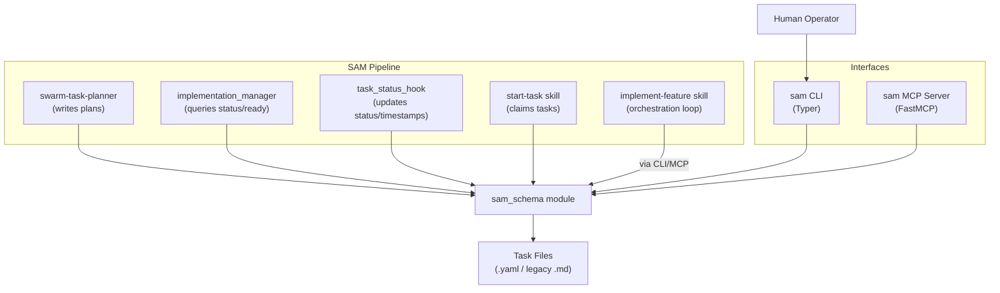
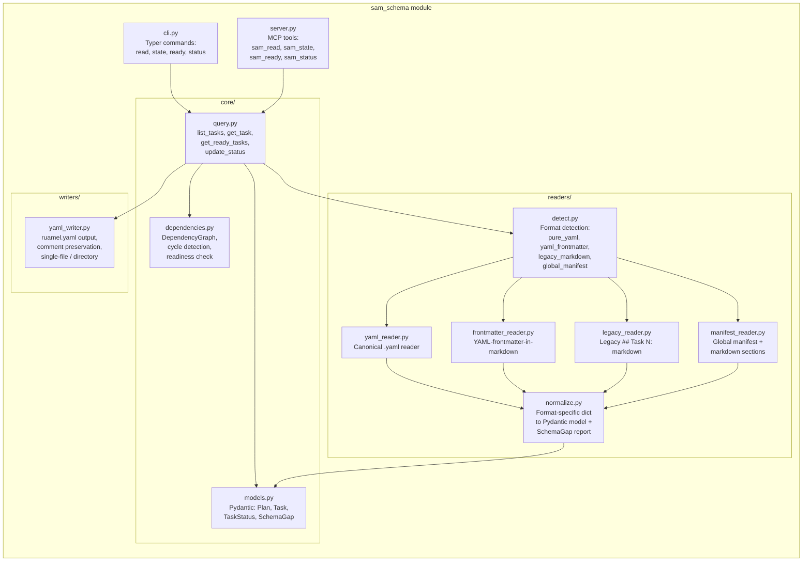
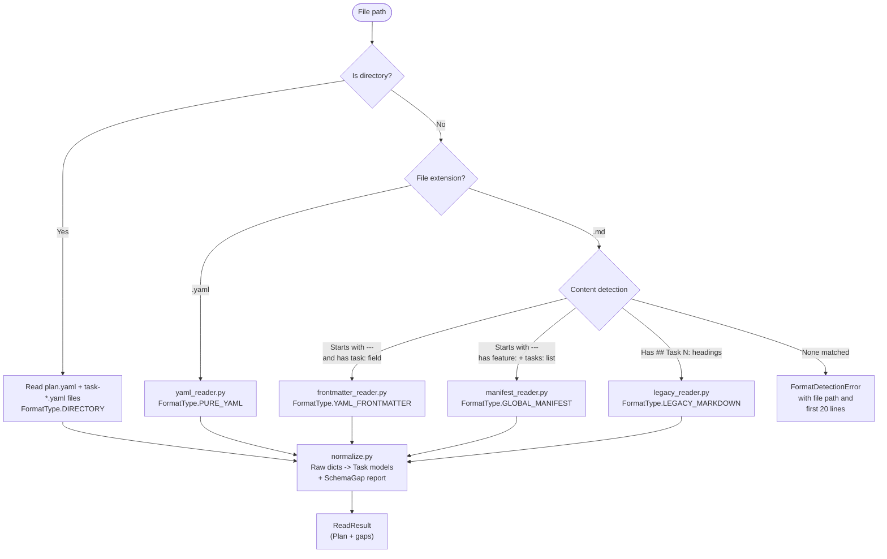

# Architecture Spec: Unified SAM Task/Plan Schema Module

**Issue**: #715
**Date**: 2026-03-14
**Status**: Design Document

---

## 1. Executive Summary

The SAM pipeline has five independent task file parsers, each with its own format assumptions. When the swarm-task-planner produces a format variant not anticipated by the consumers, the pipeline stalls silently with zero visible tasks. This architecture defines a single shared Python module (`sam_schema`) that becomes the sole interface for reading, writing, and querying SAM task/plan files.

The canonical format is pure YAML. Structural fields (id, title, status, dependencies, agent, priority, complexity, skills) are typed YAML fields. Rich text content (description, acceptance_criteria, verification_steps) is markdown stored in YAML multiline scalars (`|`). Legacy markdown and YAML-frontmatter-in-markdown formats are supported as read-only backward compatibility layers that normalize to the same Pydantic model and report schema gaps.

The module exposes two equivalent interfaces: a Typer CLI (`sam read P1/T3`, `sam state P1/T3 in_progress`, `sam ready P1`, `sam status P1`) and an MCP server with matching tools. All existing consumers (swarm-task-planner, implementation_manager, task_status_hook, split_task_file, migrate_task_format) migrate to import from this single module.

## 2. Architecture Overview

### C4 Context Diagram



### C4 Container Diagram



### Data Flow

```text
Read path:
  File on disk -> detect.py (identify format) -> format-specific reader -> normalize.py -> Plan/Task models + SchemaGap[]

Write path:
  Plan/Task models -> yaml_writer.py -> .yaml file(s) on disk

Query path:
  CLI/MCP request -> query.py (load + filter/update) -> response (JSON for CLI, dict for MCP)

State update path:
  CLI/MCP/hook call -> query.py update_status() -> load plan -> modify task -> yaml_writer.py -> file on disk
```

## 3. Technology Stack

| Component | Technology | Justification |
|-----------|-----------|---------------|
| CLI Framework | Typer 0.21.2+ | Type safety, automatic help, Rich included. Standard per architecture-spec-patterns.md |
| Data Models | Pydantic 2.12+ | Already a project dependency (backlog_core). Runtime validation, serialization, schema gap detection via model_fields_set |
| YAML Library | ruamel.yaml 0.18+ | Already project standard per yaml-toml-libraries.md. Preserves comments and field order on round-trip |
| MCP Server | FastMCP | Already used for backlog MCP server. Consistent pattern |
| Type Hints | Python 3.11+ native | `str \| None`, not `Optional[str]`. Project convention |
| Type Checker | ty | Configured in project .pre-commit-config.yaml |
| Testing | pytest 8+, pytest-cov, pytest-mock | Standard per testing-spec-guidance.md |
| Linting | ruff | Project standard |
| Package Manager | uv | Project standard |

## 4. Component Design

### Module Location

```text
packages/sam_schema/
    __init__.py              # Public API re-exports
    cli.py                   # Typer app: read, state, ready, status
    server.py                # FastMCP server: sam_read, sam_state, sam_ready, sam_status
    core/
        __init__.py
        models.py            # Pydantic: Plan, Task, TaskStatus, SchemaGap, etc.
        query.py             # list_tasks, get_task, get_ready_tasks, update_status
        dependencies.py      # DependencyGraph, cycle detection, readiness
        addressing.py        # Plan addressing: P{N} resolution to file paths
    readers/
        __init__.py
        detect.py            # Format detection and routing
        yaml_reader.py       # Pure YAML (.yaml) reader
        frontmatter_reader.py  # YAML-frontmatter-in-markdown reader
        legacy_reader.py     # Legacy ## Task N: markdown reader
        manifest_reader.py   # Global manifest + markdown sections reader
        normalize.py         # Raw dict -> Pydantic model + SchemaGap
    writers/
        __init__.py
        yaml_writer.py       # Pure YAML output with ruamel.yaml
tests/
    conftest.py
    fixtures/                # Sample task files in all formats
    test_models.py
    test_query.py
    test_readers/
        test_detect.py
        test_yaml_reader.py
        test_frontmatter_reader.py
        test_legacy_reader.py
        test_manifest_reader.py
        test_normalize.py
    test_writers/
        test_yaml_writer.py
    test_cli.py
    test_dependencies.py
```

### Public API (`__init__.py`)

```python
from sam_schema.core.models import (
    Plan,
    Task,
    TaskStatus,
    Complexity,
    Priority,
    SchemaGap,
    ReadResult,
)
from sam_schema.core.query import (
    load_plan,
    get_task,
    list_tasks,
    get_ready_tasks,
    update_status,
    get_plan_status,
)
from sam_schema.readers.detect import detect_format, FormatType
from sam_schema.writers.yaml_writer import write_plan
```

### cli.py Interfaces

```python
import typer
from typing import Annotated

app = typer.Typer(name="sam", help="SAM task/plan file interface")

@app.command()
def read(
    address: Annotated[str, typer.Argument(help="Task address: P{plan}/T{task}")],
    plan_dir: Annotated[Path, typer.Option("--plan-dir", help="Plan directory")] = Path("plan"),
    format: Annotated[str, typer.Option(help="Output format: json|yaml|rich")] = "json",
) -> None: ...

@app.command()
def state(
    address: Annotated[str, typer.Argument(help="Task address: P{plan}/T{task}")],
    new_status: Annotated[str, typer.Argument(help="New status value")],
    plan_dir: Annotated[Path, typer.Option("--plan-dir")] = Path("plan"),
) -> None: ...

@app.command()
def ready(
    plan_address: Annotated[str, typer.Argument(help="Plan address: P{plan}")],
    plan_dir: Annotated[Path, typer.Option("--plan-dir")] = Path("plan"),
) -> None: ...

@app.command()
def status(
    plan_address: Annotated[str, typer.Argument(help="Plan address: P{plan}")],
    plan_dir: Annotated[Path, typer.Option("--plan-dir")] = Path("plan"),
) -> None: ...

@app.command()
def migrate(
    plan_address: Annotated[str, typer.Argument(help="Plan address: P{plan}")],
    plan_dir: Annotated[Path, typer.Option("--plan-dir")] = Path("plan"),
    dry_run: Annotated[bool, typer.Option("--dry-run")] = False,
) -> None: ...
```

### core/query.py Interfaces

```python
from pathlib import Path
from sam_schema.core.models import Plan, Task, TaskStatus, ReadResult, PlanStatus, SchemaGap

def load_plan(plan_path: Path) -> ReadResult:
    """Load a plan from any supported format. Returns parsed plan + schema gaps."""
    ...

def get_task(plan_path: Path, task_id: str) -> Task:
    """Get a single task by ID from a plan file."""
    ...

def list_tasks(plan_path: Path) -> list[Task]:
    """List all tasks in a plan."""
    ...

def get_ready_tasks(plan_path: Path) -> list[Task]:
    """Get tasks with status not-started and all dependencies satisfied."""
    ...

def update_status(
    plan_path: Path,
    task_id: str,
    new_status: TaskStatus,
    timestamp_field: str | None = None,
) -> Task:
    """Update a task's status and optional timestamp. Returns updated task."""
    ...

def get_plan_status(plan_path: Path) -> PlanStatus:
    """Get plan-level status summary with counts by status."""
    ...
```

### core/addressing.py Interfaces

```python
from pathlib import Path

def resolve_plan_address(address: str, plan_dir: Path) -> Path:
    """Resolve P{N} to a plan file/directory path.

    Resolution order:
    1. P{N} where N is the sequence number from filename tasks-{N}-{slug}
    2. P{slug} where slug matches the plan slug directly
    3. Raises AddressingError if no match
    """
    ...

def parse_address(address: str) -> tuple[str, str | None]:
    """Parse 'P1/T3' into (plan_ref='1', task_ref='3').
    Parse 'P1' into (plan_ref='1', task_ref=None).
    Parse 'my-slug/T3' into (plan_ref='my-slug', task_ref='3').
    """
    ...
```

### core/dependencies.py Interfaces

```python
from sam_schema.core.models import Task, TaskStatus

class DependencyGraph:
    """Task dependency graph with cycle detection and readiness queries."""

    def __init__(self, tasks: list[Task]) -> None: ...

    def get_ready_tasks(self) -> list[Task]:
        """Tasks with status not-started and all deps in terminal states."""
        ...

    def has_cycles(self) -> bool: ...

    def get_cycles(self) -> list[list[str]]:
        """Return list of cycles as lists of task IDs."""
        ...

    def get_blocked_tasks(self) -> list[tuple[Task, list[str]]]:
        """Tasks blocked by unsatisfied dependencies. Returns (task, missing_dep_ids)."""
        ...

TERMINAL_STATUSES: frozenset[TaskStatus] = frozenset({
    TaskStatus.COMPLETE,
    TaskStatus.DEFERRED,
    TaskStatus.SKIPPED,
})
```

### readers/detect.py Interfaces

```python
from enum import StrEnum
from pathlib import Path

class FormatType(StrEnum):
    PURE_YAML = "pure_yaml"              # .yaml file(s), canonical format
    YAML_FRONTMATTER = "yaml_frontmatter"  # .md with --- delimited YAML per task
    LEGACY_MARKDOWN = "legacy_markdown"    # .md with ## Task N: headings
    GLOBAL_MANIFEST = "global_manifest"    # .md with global frontmatter + ### TN: sections
    DIRECTORY = "directory"                # directory containing per-task files

def detect_format(path: Path) -> FormatType:
    """Detect the task file format. Raises FormatDetectionError if unrecognized."""
    ...

def read_plan(path: Path) -> tuple[dict, list[dict], FormatType]:
    """Read plan from any format. Returns (plan_metadata, task_dicts, format_type).
    Delegates to format-specific reader based on detect_format().
    """
    ...
```

### readers/normalize.py Interfaces

```python
from sam_schema.core.models import Task, Plan, SchemaGap, ReadResult

def normalize_task(raw: dict, source_format: FormatType) -> tuple[Task, list[SchemaGap]]:
    """Convert a raw dict from any reader into a validated Task model.
    Returns the task and a list of schema gaps (missing optional fields).
    """
    ...

def normalize_plan(
    plan_meta: dict,
    task_dicts: list[dict],
    source_format: FormatType,
    source_path: Path,
) -> ReadResult:
    """Normalize an entire plan from raw reader output to validated models."""
    ...
```

### writers/yaml_writer.py Interfaces

```python
from pathlib import Path
from sam_schema.core.models import Plan

LINE_THRESHOLD: int = 500

def write_plan(plan: Plan, output_path: Path, force_single: bool = False) -> Path:
    """Write plan to pure YAML. Returns path written.

    If total YAML exceeds LINE_THRESHOLD lines and force_single is False:
      Creates output_path/ directory with plan.yaml + task-{id}.yaml files.
    Otherwise:
      Writes single .yaml file.

    Uses ruamel.yaml for comment preservation on round-trip.
    """
    ...

def update_field(
    file_path: Path,
    task_id: str,
    field: str,
    value: str | int | list[str],
) -> None:
    """Update a single field in a YAML task file without full re-serialization.
    Preserves comments and field order.
    """
    ...
```

### server.py Interfaces (MCP)

```python
from fastmcp import FastMCP
from typing import Annotated
from pydantic import Field

mcp = FastMCP("sam")

@mcp.tool()
async def sam_read(
    plan: Annotated[str, Field(description="Plan address (e.g., 'P1' or slug)")],
    task: Annotated[str, Field(description="Task ID (e.g., 'T3')")],
    plan_dir: Annotated[str, Field(description="Plan directory path")] = "plan",
) -> dict: ...

@mcp.tool()
async def sam_state(
    plan: Annotated[str, Field(description="Plan address")],
    task: Annotated[str, Field(description="Task ID")],
    status: Annotated[str, Field(description="New status value")],
    plan_dir: Annotated[str, Field(description="Plan directory path")] = "plan",
) -> dict: ...

@mcp.tool()
async def sam_ready(
    plan: Annotated[str, Field(description="Plan address")],
    plan_dir: Annotated[str, Field(description="Plan directory path")] = "plan",
) -> dict: ...

@mcp.tool()
async def sam_status(
    plan: Annotated[str, Field(description="Plan address")],
    plan_dir: Annotated[str, Field(description="Plan directory path")] = "plan",
) -> dict: ...
```

## 5. Data Architecture

### Pydantic Models (core/models.py)

```python
from __future__ import annotations

from datetime import datetime
from enum import IntEnum, StrEnum
from pathlib import Path
from pydantic import BaseModel, Field, field_validator
import re

TASK_ID_PATTERN: re.Pattern[str] = re.compile(r"^[A-Za-z]?\d+(\.\d+)?$")


class TaskStatus(StrEnum):
    NOT_STARTED = "not-started"
    IN_PROGRESS = "in-progress"
    COMPLETE = "complete"
    BLOCKED = "blocked"
    DEFERRED = "deferred"
    SKIPPED = "skipped"


class Complexity(StrEnum):
    LOW = "low"
    MEDIUM = "medium"
    HIGH = "high"


class Priority(IntEnum):
    CRITICAL = 1
    HIGH = 2
    MEDIUM = 3
    LOW = 4
    LOWEST = 5


class IssueClassification(StrEnum):
    PROCEDURAL = "procedural"
    DEFECT = "defect"
    RECURRING_PATTERN = "recurring-pattern"
    MISSING_GUARDRAIL = "missing-guardrail"
    UNBOUNDED_DESIGN = "unbounded-design"


class AnalysisMethod(StrEnum):
    NONE = "none"
    FIVE_WHYS = "5-whys"
    SIX_SIGMA = "6-sigma"
    DESIGN_FRAMING = "design-framing"


class Task(BaseModel):
    """Canonical task model. All readers normalize to this."""

    # Required fields
    id: str = Field(..., pattern=r"^[A-Za-z]?\d+(\.\d+)?$")
    title: str = Field(..., min_length=1, max_length=200)
    status: TaskStatus

    # Optional structural fields
    agent: str | None = None
    dependencies: list[str] = Field(default_factory=list)
    priority: Priority = Priority.MEDIUM
    complexity: Complexity = Complexity.MEDIUM
    skills: list[str] = Field(default_factory=list)
    blocked_by: list[str] = Field(default_factory=list)
    parallelize_with: list[str] = Field(default_factory=list)

    # Timestamps
    created: datetime | None = None
    started: datetime | None = None
    completed: datetime | None = None
    last_activity: datetime | None = None

    # Analytical metadata
    issue_classification: IssueClassification | None = None
    scenario_target: str | None = None
    analysis_method: AnalysisMethod = AnalysisMethod.NONE
    divergence_notes: int = Field(default=0, ge=0)

    # Markdown content fields (stored as YAML multiline scalars)
    description: str = ""
    objective: str = ""
    requirements: str = ""
    constraints: str = ""
    expected_outputs: str = ""
    acceptance_criteria: str = ""
    verification_steps: str = ""
    context_notes: str = ""
    handoff: str = ""

    # GitHub integration
    github_issue: int | None = None

    @field_validator("dependencies", "parallelize_with")
    @classmethod
    def validate_task_id_list(cls, v: list[str]) -> list[str]:
        ...

    model_config = {"use_enum_values": True}


class Plan(BaseModel):
    """Canonical plan model containing metadata and tasks."""

    feature: str
    version: str = "1.0"
    description: str = ""
    tasks: list[Task] = Field(default_factory=list)
    source_path: Path | None = None
    source_format: str | None = None  # FormatType value


class SchemaGap(BaseModel):
    """A missing or invalid field detected during legacy format reading."""

    task_id: str
    field_name: str
    gap_type: str  # "missing" | "invalid_type" | "invalid_value"
    expected: str  # description of expected value/type
    actual: str | None = None  # what was found (None if missing)


class ReadResult(BaseModel):
    """Result of reading a plan file. Contains plan + any schema gaps."""

    plan: Plan
    gaps: list[SchemaGap] = Field(default_factory=list)
    source_format: str  # FormatType value
    source_path: Path


class PlanStatus(BaseModel):
    """Summary of plan progress."""

    feature: str
    total_tasks: int
    by_status: dict[str, int]  # status -> count
    ready_tasks: list[str]  # task IDs ready for dispatch
    blocked_tasks: list[dict[str, list[str]]]  # [{task_id: [missing_deps]}]
    completion_pct: float
    has_cycles: bool
```

### Canonical YAML Schema

#### Single File Format (under 500 lines)

```yaml
# plan/tasks-1-my-feature.yaml
feature: my-feature
version: "1.0"
description: |
  Feature-level description in markdown.

tasks:
  - id: T1
    title: Create data models
    status: not-started
    agent: python-cli-architect
    dependencies: []
    priority: 1
    complexity: medium
    skills:
      - python3-development
    description: |
      ## Context

      Background information in markdown.

      ## Objective

      Create type-safe data models.
    acceptance_criteria: |
      1. All models type-check with ty
      2. Unit tests pass
    verification_steps: |
      ```bash
      uv run ty check packages/my_module/models.py
      uv run pytest tests/test_models.py -v
      ```

  - id: T2
    title: Implement readers
    status: not-started
    agent: python-cli-architect
    dependencies:
      - T1
    priority: 2
    complexity: high
    description: |
      Implement format-specific readers.
    acceptance_criteria: |
      1. All three legacy formats parse correctly
      2. Schema gaps reported for legacy files
```

#### Directory Format (over 500 lines)

```text
plan/tasks-my-feature/
    plan.yaml           # plan-level metadata + task references
    task-T1.yaml         # individual task
    task-T2.yaml
    task-T3.yaml
```

`plan.yaml`:

```yaml
feature: my-feature
version: "1.0"
description: |
  Feature-level description.
task_files:
  - task-T1.yaml
  - task-T2.yaml
  - task-T3.yaml
```

`task-T1.yaml`:

```yaml
id: T1
title: Create data models
status: not-started
agent: python-cli-architect
dependencies: []
priority: 1
complexity: medium
description: |
  Full markdown content here.
acceptance_criteria: |
  1. Models type-check
  2. Tests pass
```

### YAML Field Name Mapping

YAML uses kebab-case for compatibility with existing TASK_FILE_FORMAT.md. Pydantic model uses snake_case with `alias` or `populate_by_name=True`.

```python
class Task(BaseModel):
    model_config = {
        "use_enum_values": True,
        "populate_by_name": True,
    }

    blocked_by: list[str] = Field(default_factory=list, alias="blocked-by")
    parallelize_with: list[str] = Field(default_factory=list, alias="parallelize-with")
    issue_classification: IssueClassification | None = Field(None, alias="issue-classification")
    scenario_target: str | None = Field(None, alias="scenario-target")
    analysis_method: AnalysisMethod = Field(AnalysisMethod.NONE, alias="analysis-method")
    divergence_notes: int = Field(0, ge=0, alias="divergence-notes")
    last_activity: datetime | None = Field(None, alias="last-activity")
    acceptance_criteria: str = Field("", alias="acceptance-criteria")
    verification_steps: str = Field("", alias="verification-steps")
    expected_outputs: str = Field("", alias="expected-outputs")
    context_notes: str = Field("", alias="context-notes")
    github_issue: int | None = Field(None, alias="github-issue")
```

### Reader Pipeline



### Status Normalization Map (reused from task_format.py)

```python
STATUS_MAP: dict[str, TaskStatus] = {
    "not started": TaskStatus.NOT_STARTED,
    "not-started": TaskStatus.NOT_STARTED,
    "in progress": TaskStatus.IN_PROGRESS,
    "in-progress": TaskStatus.IN_PROGRESS,
    "complete": TaskStatus.COMPLETE,
    "blocked": TaskStatus.BLOCKED,
    "deferred": TaskStatus.DEFERRED,
    "skipped": TaskStatus.SKIPPED,
    "wont-fix": TaskStatus.SKIPPED,
    # Emoji variations
    ":x:": TaskStatus.NOT_STARTED,
    ":white_check_mark:": TaskStatus.COMPLETE,
    ":arrows_counterclockwise:": TaskStatus.IN_PROGRESS,
}
```

### Schema Gap Detection

When reading a legacy or frontmatter file, `normalize_task()` compares the raw dict against Task's model fields. For each optional field defined in Task that is absent from the raw dict, a `SchemaGap` is emitted:

```python
def detect_gaps(raw: dict, task_id: str) -> list[SchemaGap]:
    """Compare raw dict against canonical Task fields.
    Returns SchemaGap for each missing optional field.
    """
    OPTIONAL_FIELDS = {
        "agent": "Agent responsible for task",
        "priority": "Priority level 1-5",
        "complexity": "Complexity: low/medium/high",
        "skills": "Skills list for sub-agent",
        "blocked_by": "External blockers",
        "parallelize_with": "Concurrent task IDs",
        "created": "ISO 8601 creation timestamp",
        "issue_classification": "Analytical classification",
        "scenario_target": "Scenario -> improvement",
        "analysis_method": "Root-cause method",
    }
    gaps: list[SchemaGap] = []
    for field_name, description in OPTIONAL_FIELDS.items():
        yaml_key = field_name.replace("_", "-")
        if field_name not in raw and yaml_key not in raw:
            gaps.append(SchemaGap(
                task_id=task_id,
                field_name=field_name,
                gap_type="missing",
                expected=description,
            ))
    return gaps
```

## 6. Security Architecture

This module operates on local files only. No network I/O, no credentials, no secrets.

Security checklist:

- [x] Path traversal prevention: `resolve()` all paths, reject paths outside plan_dir
- [x] No `shell=True` subprocess calls (module does not call subprocesses)
- [x] Input validation: Pydantic validates all task fields before processing
- [x] No credential storage or handling
- [x] File permissions: follow existing plan directory permissions (no special handling needed)
- [x] Task ID validation: regex pattern `^[A-Za-z]?\d+(\.\d+)?$` prevents injection in addressing

## 7. Testing Architecture

### Testing Stack

```text
pytest>=8.0.0
pytest-cov>=6.0.0
pytest-mock>=3.14.0
hypothesis>=6.100.0        # Property-based testing for parsers/validators
```

### Coverage Requirements

- Overall: 80% line and branch coverage
- Readers: 95%+ (critical parsing code)
- Dependency resolution: 95%+ (cycle detection, readiness logic)
- CLI: all commands tested via `typer.testing.CliRunner`

### Test Strategy by Component

**Readers (property-based + fixture-based)**:
- One fixture file per format variant in `tests/fixtures/`
- Property-based tests for status normalization, dependency parsing, task ID validation
- Edge cases: empty files, malformed YAML, missing required fields, extra fields
- Schema gap detection: verify gap reports for each legacy format

**Query layer (unit tests)**:
- `get_ready_tasks()`: test with dependency chains, cycles, terminal statuses
- `update_status()`: verify file modification, timestamp injection, round-trip fidelity
- `load_plan()`: test all format variants produce identical Plan objects

**CLI (integration tests)**:
- `CliRunner` with `mix_stderr=False`, `env={"NO_COLOR": "1"}`
- Test: `sam read P1/T3`, `sam state P1/T3 in_progress`, `sam ready P1`, `sam status P1`
- Test: invalid addresses, missing files, permission errors
- Test: `sam migrate` with dry-run flag

**Writers (round-trip tests)**:
- Write -> read -> compare: verify Plan equality after round-trip
- Verify single-file vs directory threshold behavior
- Verify comment preservation on field update

### Test Directory

```text
tests/
    conftest.py
    fixtures/
        pure_yaml_single.yaml
        pure_yaml_directory/
            plan.yaml
            task-T1.yaml
            task-T2.yaml
        yaml_frontmatter_single.md
        yaml_frontmatter_multi.md
        legacy_markdown.md
        global_manifest.md
        malformed/
            missing_required.yaml
            invalid_status.yaml
            circular_deps.yaml
    test_models.py
    test_query.py
    test_dependencies.py
    test_cli.py
    test_readers/
        test_detect.py
        test_yaml_reader.py
        test_frontmatter_reader.py
        test_legacy_reader.py
        test_manifest_reader.py
        test_normalize.py
    test_writers/
        test_yaml_writer.py
```

### pytest Configuration

```toml
[tool.pytest.ini_options]
addopts = [
    "--cov=packages/sam_schema",
    "--cov-report=term-missing",
    "-v",
]
testpaths = ["tests"]
pythonpath = [".", "packages/"]
markers = [
    "slow: marks tests as slow",
    "integration: marks tests as integration tests",
    "cli: marks tests as CLI integration tests",
]

[tool.coverage.run]
branch = true

[tool.coverage.report]
show_missing = true
fail_under = 80
```

## 8. Distribution Architecture

### Strategy: Python Package

This module is multi-file (readers, writers, core, CLI, MCP server) with shared dependencies. PEP 723 standalone script is not suitable.

```toml
[project]
name = "sam-schema"
version = "0.1.0"
requires-python = ">=3.11"
dependencies = [
    "pydantic>=2.12.0",
    "ruamel.yaml>=0.18.0",
    "typer>=0.21.2",
    "fastmcp>=2.0.0",
]

[build-system]
requires = ["hatchling"]
build-backend = "hatchling.build"

[tool.hatchling.build.targets.wheel]
packages = ["packages/sam_schema"]

[project.scripts]
sam = "sam_schema.cli:app"
```

### Integration with Existing Project

The module lives in `packages/sam_schema/` within the existing `claude_skills` repository. It is added as a workspace dependency so existing scripts can import from it:

```toml
# In root pyproject.toml
[tool.uv.sources]
sam-schema = { workspace = true }
```

### MCP Server Registration

The MCP server (`sam_schema.server`) is registered alongside the existing backlog MCP server. It is a separate server (not an extension of backlog) because it has a distinct domain and lifecycle.

```json
{
  "mcpServers": {
    "sam": {
      "command": "uv",
      "args": ["run", "python", "-m", "sam_schema.server"]
    }
  }
}
```

## 9. Architectural Decisions (ADRs)

### ADR-001: Pure YAML as Canonical Format (not markdown with YAML frontmatter)

**Context**: Current task files are markdown with YAML frontmatter. Three format variants exist, each requiring different regex-based parsing. The markdown structure (headings, bold markers) is part of the schema, making parsing fragile.

**Decision**: Canonical format is pure `.yaml`. Markdown content lives inside YAML multiline scalar fields (`|`). Structural fields are typed YAML.

**Rationale**: YAML parsers handle all structural parsing. No regex needed for field extraction. Format validation is handled by Pydantic, not regex patterns. Markdown content is preserved as-is in multiline scalars.

**Consequences**: Legacy `.md` files require backward-compatible readers. New files use `.yaml` extension. Existing plan file glob patterns (`plan/tasks-*.md`) need updating.

---

### ADR-002: Separate MCP Server (not extension of backlog server)

**Context**: The backlog MCP server handles GitHub issue CRUD. SAM task operations are a different domain (local file-based task tracking within a plan).

**Decision**: Create a standalone `sam` MCP server.

**Rationale**: Separation of concerns. The backlog server manages GitHub sync; the SAM server manages local plan files. Different lifecycles, different failure modes. Users who need only one server do not load the other.

**Consequences**: Users add a second MCP server entry to their config. The `backlog_get_ready_sam_tasks` tool in the backlog server can delegate to the sam module internally.

---

### ADR-003: P{N} Addressing via Sequence Number from Filename

**Context**: CLI needs a concise way to reference plans. Current filenames follow `tasks-{N}-{slug}.md` or `tasks-{slug}/` conventions. Options: sequential number, slug, or both.

**Decision**: Support both. `P1` resolves to the plan with sequence number 1 from filename `tasks-1-*`. `P{slug}` resolves by slug match. Numeric takes precedence.

**Rationale**: `P1/T3` is concise for CLI use. `Pmy-feature/T3` is unambiguous for scripts. Supporting both avoids forcing users to remember arbitrary numbers.

**Consequences**: Plan discovery must scan the plan directory for matching filenames. Ambiguity between a numeric slug and a sequence number is resolved by always treating bare integers as sequence numbers.

---

### ADR-004: Read-Only Legacy Support (no auto-conversion on read)

**Context**: When a legacy `.md` file is read, should it be auto-converted to `.yaml`?

**Decision**: Read-only normalization. Legacy files are parsed and returned as in-memory models but not modified on disk. Conversion is explicit via `sam migrate P1`.

**Rationale**: Auto-conversion would break git history, file references in skill docs, and ongoing work that references `.md` paths. Explicit migration lets users control timing and review diffs.

**Consequences**: Legacy `.md` files persist until explicitly migrated. The module must maintain backward-compatible readers indefinitely (or until a manual migration is complete).

---

### ADR-005: Writer Never Auto-Splits (explicit split command)

**Context**: The 500-line threshold determines single-file vs directory format. Should the writer auto-split when a state update pushes a file over 500 lines?

**Decision**: Writer preserves the current storage format (single/directory). Auto-split is not performed during state updates. Splitting is an explicit operation.

**Rationale**: Auto-splitting during a status update could surprise consumers mid-workflow, break file references in the task file's context manifest, and create unexpected git diffs. The swarm-task-planner decides format at creation time based on plan size.

**Consequences**: A plan that grows beyond 500 lines in a single file stays in single-file format until explicitly split. The `write_plan()` function respects the threshold only for initial writes (new plans).

---

### ADR-006: Pydantic for Schema over JSON Schema Validation

**Context**: TASK_FILE_FORMAT.md defines a JSON Schema. Options: validate with `jsonschema` library, or validate with Pydantic models.

**Decision**: Use Pydantic models as the schema definition. Do not use `jsonschema` library.

**Rationale**: Pydantic provides runtime validation, type coercion, serialization, and schema gap detection in one package. It is already a project dependency. The JSON Schema in TASK_FILE_FORMAT.md is a documentation artifact; the Pydantic models become the enforceable source of truth.

**Consequences**: TASK_FILE_FORMAT.md's JSON Schema section should be updated to note that the Pydantic models in `sam_schema.core.models` are the authoritative schema. The JSON Schema remains as documentation.

---

### ADR-007: ruamel.yaml for Field Updates (not full re-serialization)

**Context**: `task_status_hook.py` currently uses regex to update individual fields because re-serializing YAML loses comments and formatting. The new module uses pure YAML.

**Decision**: Use ruamel.yaml's round-trip mode for field updates. The `update_field()` function loads the YAML, modifies the specific field in the ruamel.yaml data structure, and dumps back. This preserves comments, field order, and formatting.

**Rationale**: ruamel.yaml's round-trip (`typ='rt'`) mode is designed for exactly this use case. It preserves comments and formatting while allowing targeted field modifications.

**Consequences**: Field updates do not require regex parsing. The entire file is loaded and re-dumped, but ruamel.yaml preserves formatting. Performance is acceptable for single-field updates on files under 500 lines.

## 10. Scalability Strategy

### Sync-First Design

The module is synchronous by default. Task files are local, small (under 500 lines per file), and operations complete in milliseconds. No async I/O needed for the core module.

The MCP server uses async signatures (required by FastMCP) but delegates to synchronous core functions. No `asyncio.to_thread()` needed given the sub-millisecond file I/O.

### Resource Management

- File reads: `Path.read_text(encoding="utf-8")` (no context manager needed for reads)
- File writes: use `tempfile.NamedTemporaryFile` with `rename` for atomic writes (prevents partial files on crash)
- YAML parser: create `ruamel.yaml.YAML(typ='rt')` instance per call (lightweight, no caching needed)

### Memory

- Plans are small (tens of tasks). Full in-memory loading is appropriate.
- No streaming needed. No pagination for task lists.
- `list_tasks()` returns full task objects, not summaries. Consistent with "No Invented Limits" project rule.

---

## 11. Hook Integration

### task_status_hook.py Migration

The hook currently uses regex-based `find_task_section()` and `update_task_status()` from its own code, plus `update_yaml_field()` from `task_format.py`. After migration:

```python
# Before (regex-based):
from task_format import update_yaml_field
content = path.read_text()
content = update_yaml_field(content, "status", "complete")
path.write_text(content)

# After (sam_schema module):
from sam_schema import update_status, TaskStatus
update_status(plan_path, task_id, TaskStatus.COMPLETE, timestamp_field="completed")
```

The hook reads `.claude/context/active-task-{session_id}.json` to find the active task. This context file format does not change. The hook changes its file modification calls from regex-based to `sam_schema.core.query.update_status()`.

### implementation_manager.py Migration

Replace all internal parsing with `sam_schema` imports:

```python
# Before:
from task_format import parse_yaml_frontmatter, normalize_status
tasks = parse_task_file(file_path)  # internal multi-format parser

# After:
from sam_schema import load_plan, get_ready_tasks, get_plan_status
result = load_plan(plan_path)
ready = get_ready_tasks(plan_path)
status = get_plan_status(plan_path)
```

The `claim-task` command in `implementation_manager.py` uses `update_status()` with a guard (refuse if status is not `not-started`). This guard logic moves into `sam_schema.core.query.claim_task()`:

```python
def claim_task(plan_path: Path, task_id: str) -> Task:
    """Atomically claim a task: set status to in-progress, set started timestamp.
    Raises ClaimError if task status is not not-started.
    """
    ...
```

### swarm-task-planner Output

The swarm-task-planner agent writes plan files. After migration, it produces pure YAML by constructing `Plan` and `Task` models and calling `write_plan()`:

```python
from sam_schema import Plan, Task, TaskStatus, write_plan

plan = Plan(
    feature="my-feature",
    description="Feature description",
    tasks=[
        Task(id="T1", title="First task", status=TaskStatus.NOT_STARTED, ...),
        Task(id="T2", title="Second task", status=TaskStatus.NOT_STARTED, ...),
    ],
)
write_plan(plan, Path("plan/tasks-1-my-feature.yaml"))
```

Alternatively, the agent can write raw YAML directly (it is an LLM agent producing text). The module's `yaml_reader.py` validates the output on first read. The critical improvement is that the YAML schema is documented and validated, so format drift is caught at the boundary.

---

## 12. Migration Path

### Phase 1: Module Creation

Create `packages/sam_schema/` with models, readers, writers, query, CLI, and tests. No changes to existing consumers yet.

### Phase 2: Parallel Operation

Add `sam_schema` as a dependency. Existing scripts continue working. New `sam` CLI and MCP server are available for testing alongside `implementation_manager.py`.

### Phase 3: Consumer Migration (incremental, one script at a time)

1. `implementation_manager.py` -- replace internal parsing with `sam_schema` imports. Maintain CLI interface unchanged (commands, output format).
2. `task_status_hook.py` -- replace regex-based field updates with `sam_schema.update_status()`.
3. `task_format.py` -- deprecate. Functions now exist in `sam_schema.readers.normalize` and `sam_schema.writers.yaml_writer`.
4. `split_task_file.py` -- rewrite to use `sam_schema.load_plan()` + `sam_schema.write_plan()` with directory output.
5. `migrate_task_format.py` -- rewrite to use `sam_schema.load_plan()` + `sam_schema.write_plan()` for format conversion.

### Phase 4: Cleanup

Remove deprecated code from `task_format.py` and internal parsing from `implementation_manager.py`. This unblocks #441 (dead code cleanup).

---

## 13. Acceptance Criteria Mapping

| # | Criterion | Component |
|---|-----------|-----------|
| 1 | `sam status P1` returns all tasks from any format | `query.get_plan_status()` + all readers |
| 2 | `sam ready P1` returns tasks with satisfied deps | `query.get_ready_tasks()` + `DependencyGraph` |
| 3 | No parse warnings on any task file | Format detection handles all variants |
| 4 | Legacy files parse with schema gap report | `normalize.detect_gaps()` + `SchemaGap` model |
| 5 | `sam state P1/T3 in_progress` updates status + timestamp | `query.update_status()` + `yaml_writer.update_field()` |
| 6 | `sam read P1/T3` returns structured + markdown content | `query.get_task()` returning full `Task` model |
| 7 | ty check zero errors | All models use Python 3.11+ type hints, no `Any` |
| 8 | pytest coverage for all readers | Test fixtures for each format, 95%+ reader coverage |
| 9 | task_status_hook uses shared module | Hook imports `update_status()` from `sam_schema` |
| 10 | Fixes #715 | All consumers use single module, no ad-hoc parsing |

---

## Post-Implementation Annotations

_Added by context-refinement agent on 2026-03-15_

### Design Refinements

1. **`readers/_yaml_utils.py` — unplanned shared module**: During T2, a `readers/_yaml_utils.py` module emerged to hold `make_yaml()` and `load_yaml()` helpers shared by all four readers. The architecture spec (section 4, `readers/` layout) did not include this module. It is a pure internal utility that does not change the reader API contract.
   - Original: "readers/" layout lists `detect.py`, `yaml_reader.py`, `frontmatter_reader.py`, `legacy_reader.py`, `manifest_reader.py`, `normalize.py`
   - Actual: Sixth file `_yaml_utils.py` added as private shared factory
   - Recorded in: plan/tasks-2-unified-sam-task-schema.md, Context Manifest

2. **Custom exceptions replaced by stdlib types**: Section 4 (`core/query.py`) specified defining `TaskNotFoundError`, `ClaimError`, and `AddressingError`. The implementation uses `KeyError` (task not found), `ValueError` (claim violation), and defines `AddressingError` in `core/addressing.py` (not `core/query.py`).
   - Original: "Custom exceptions: `TaskNotFoundError`, `ClaimError`, `AddressingError` — define in `core/query.py` or a shared `exceptions.py`"
   - Actual: `KeyError` + `ValueError` used in `query.py`; `AddressingError` in `core/addressing.py`
   - Recorded in: plan/tasks-2-unified-sam-task-schema.md, Context Manifest

3. **`update_fields()` multi-field API added**: Section 4 (`writers/yaml_writer.py`) specified `update_field(file_path, task_id, field, value)`. The implementation also adds `update_fields(file_path, task_id, fields: dict)` for batch updates. The query layer uses `update_fields` (note: acceptance criterion #5 in this table references `update_field` — both exist, but `query.py` uses the plural form).
   - Original: "`update_field(file_path: Path, task_id: str, field: str, value: ...) -> None`"
   - Actual: Both `update_field` and `update_fields` implemented; `query.py` imports `update_fields`
   - Recorded in: plan/tasks-2-unified-sam-task-schema.md, Context Manifest

4. **Sync MCP tool handlers**: Section 4 (`server.py`) stated tools would use `async def`. ADR-002 did not address sync vs async. FastMCP 3.0.2 supports synchronous handlers; using `async def` with no awaitable code triggers ruff RUF029. All four tools use `def`.
   - Original: "MCP tools are async signatures (required by FastMCP)"
   - Actual: Synchronous `def` handlers throughout `server.py`
   - Recorded in: plan/tasks-2-unified-sam-task-schema.md, DN-1
