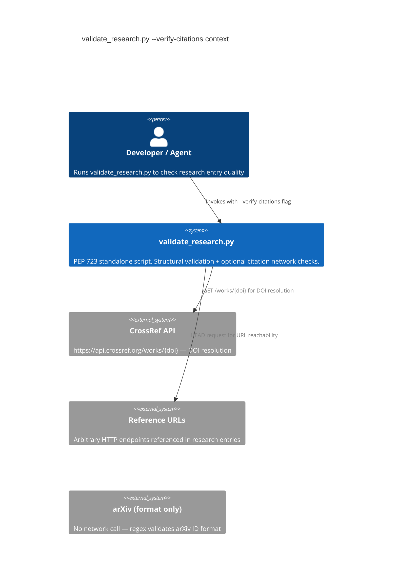
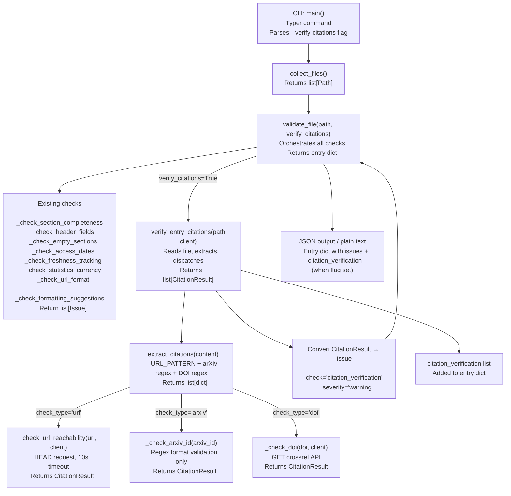

# Architecture: --verify-citations Flag for research-curator validate mode

## Table of Contents

1. [Executive Summary](#1-executive-summary)
2. [Architecture Overview](#2-architecture-overview)
3. [Technology Stack](#3-technology-stack)
4. [Component Design](#4-component-design)
5. [Data Architecture](#5-data-architecture)
6. [Security Architecture](#6-security-architecture)
7. [Testing Architecture](#7-testing-architecture)
8. [Distribution Architecture](#8-distribution-architecture)
9. [Architectural Decisions (ADRs)](#9-architectural-decisions-adrs)
10. [Scalability Strategy](#10-scalability-strategy)
11. [Documentation Change Specs](#11-documentation-change-specs)

---

## 1. Executive Summary

This architecture extends `validate_research.py` — a PEP 723 standalone script — with an
opt-in `--verify-citations` flag that performs live network checks against references extracted
from research entry files. The design is additive: all new logic is contained in five new
private functions and one new `CitationResult` TypedDict. No existing function signatures, return
shapes, or exit code semantics are altered.

When `--verify-citations` is absent (the default), the script behaves identically to the current
version. When present, extraction runs over the full document (not just the References section),
network checks execute sequentially with per-request timeouts using `httpx.Client` (imported
lazily inside the flag branch), and results appear in both the per-entry `issues` list
(as `severity: "warning"`) and a new `citation_verification` key on each entry dict.

The three citation types handled are:

- **URLs** — HTTP HEAD request, 10-second timeout, non-2xx final response or exception = `unreachable`
- **arXiv IDs** — regex-only format validation (`\d{4}\.\d{4,5}(?:v\d+)?`), no network call
- **DOIs** — GET `https://api.crossref.org/works/{doi}`, 404 = `invalid-doi`

Citation failures are `warning`-severity and do not alter the entry `status` field (`pass`/`fail`)
or the script exit code. CI pipelines that omit `--verify-citations` are completely unaffected.

---

## 2. Architecture Overview

### C4 Context: validate_research.py with --verify-citations



### C4 Container: Internal Data Flow



---

## 3. Technology Stack

### Runtime

| Component | Choice | Justification |
|-----------|--------|---------------|
| Python | 3.11+ (existing constraint) | `validate_research.py` already requires `>=3.11`; `TypedDict` with inline syntax, `match`, `tomllib` all present |
| CLI Framework | Typer 0.21+ (existing) | Already the CLI framework in `validate_research.py`; no change required |
| HTTP client | `httpx>=0.27.0` | Sync `httpx.Client` provides connection pooling across multiple URL checks within one file, clean timeout API, and follows redirects by default. Lighter than `requests` for a standalone script that also needs async-readiness for a future upgrade. Does not require async for sequential checks. |
| Distribution | PEP 723 inline dependencies (existing) | The script is already PEP 723; `httpx` is added to the existing `dependencies` block |

### Development Tools (for implementer)

| Tool | Version |
|------|---------|
| pytest | >=8.0.0 |
| pytest-cov | >=6.0.0 |
| pytest-mock | >=3.14.0 |
| pytest-asyncio | >=0.24.0 (for future async upgrade path) |
| hypothesis | >=6.100.0 (for regex extraction validation functions) |
| ruff | project-detected |
| basedpyright / pyright | project-detected |

### PEP 723 Dependency Block Change

The existing block in `validate_research.py` lines 2-5:

```python
# /// script
# requires-python = ">=3.11"
# dependencies = ["typer>=0.21.0"]
# ///
```

becomes:

```python
# /// script
# requires-python = ">=3.11"
# dependencies = [
#   "typer>=0.21.0",
#   "httpx>=0.27.0",
# ]
# ///
```

`httpx` is imported lazily inside the `--verify-citations` branch of `main()` only — the import
does not execute when the flag is absent, keeping startup time identical for CI pipelines.

---

## 4. Component Design

This feature lives entirely within `.claude/skills/research-curator/scripts/validate_research.py`.
No new files are created. The script grows by five private functions and one TypedDict.

### 4.1 New TypedDict: CitationResult

Location: immediately after the existing `Issue` TypedDict definition (after line 26 in the
current script).

```python
class CitationResult(TypedDict):
    """Per-reference outcome from --verify-citations checks."""

    url: str
    """The canonical string that was checked: full URL, arXiv ID, or DOI."""

    status: str
    """Outcome: reachable | unreachable | invalid-format | invalid-arxiv | invalid-doi"""

    http_status: int | None
    """HTTP response code from HEAD/GET request, or None when no request was made."""

    check_type: str
    """Which checker was applied: url | arxiv | doi"""
```

Valid `status` values by `check_type`:

| check_type | Possible status values |
|------------|----------------------|
| `url` | `reachable`, `unreachable`, `invalid-format` |
| `arxiv` | `reachable` (format valid), `invalid-arxiv` (format invalid) |
| `doi` | `reachable`, `invalid-doi`, `unreachable` |

`invalid-format` applies to URLs that fail basic scheme validation before a network attempt.

### 4.2 New Module-Level Constant

```python
_VERIFY_CITATIONS_OPT: bool = typer.Option(
    False,
    "--verify-citations",
    help=(
        "Check URL reachability, arXiv ID format, and DOI resolution via CrossRef "
        "(requires network access; omit in CI pipelines)"
    ),
)
```

### 4.3 New Function: _extract_citations

```python
def _extract_citations(content: str) -> list[dict[str, str]]:
    """Extract all citation references from a research entry's full text.

    Scans the entire document (not restricted to the References section) for:
    - HTTP/HTTPS URLs via URL_PATTERN
    - arXiv IDs matching the canonical format (YYMM.NNNNN with optional version suffix)
    - DOIs matching the CrossRef-registered prefix pattern (10.NNNN/...)

    Deduplicates across all three types. Each returned dict has keys
    ``url`` (the matched string) and ``check_type`` (``url``, ``arxiv``, or ``doi``).

    Args:
        content: Full file content as a single string.

    Returns:
        Deduplicated list of dicts, one per distinct citation reference found.
        Order: URLs first, then arXiv IDs, then DOIs.
    """
```

Regex patterns used:

```python
# arXiv — matches 2301.12345, 2301.12345v2, 1234.5678 (no scheme prefix needed)
_ARXIV_PATTERN = re.compile(r"\b(\d{4}\.\d{4,5}(?:v\d+)?)\b")

# DOI — CrossRef prefix pattern; excludes trailing punctuation
_DOI_PATTERN = re.compile(r"\b(10\.\d{4,}/\S+)\b")
```

Deduplication key: `(check_type, url)` tuple — the same string appearing as both a URL and a
DOI is represented once per check type.

### 4.4 New Function: _check_url_reachability

```python
def _check_url_reachability(url: str, client: httpx.Client) -> CitationResult:
    """Check whether a URL responds with a 2xx status to an HTTP HEAD request.

    Uses the provided shared httpx.Client (connection pooling). Follows redirects.
    Non-2xx final response or any exception (timeout, DNS, TLS) = unreachable.

    Args:
        url: Absolute URL to check (must start with http:// or https://).
        client: Shared httpx.Client configured with a 10-second timeout.

    Returns:
        CitationResult with status ``reachable`` on HTTP 2xx,
        ``unreachable`` on non-2xx or exception, ``invalid-format`` if the
        URL does not match a basic scheme check before the request is made.
    """
```

Timeout: `httpx.Timeout(10.0)` — set on the shared `client`, not per-request.

Redirect policy: `follow_redirects=True` on the client — the final response status determines
`reachable`/`unreachable`. A 301 that resolves to a 200 is `reachable`.

### 4.5 New Function: _check_arxiv_id

```python
def _check_arxiv_id(arxiv_id: str) -> CitationResult:
    """Validate an arXiv ID against the canonical format pattern.

    No network request is made. The check is purely structural: does the ID
    match the pattern expected by arXiv (YYMM.NNNNN with optional vN suffix)?

    Args:
        arxiv_id: The arXiv ID string (e.g., ``2301.12345``, ``2301.12345v2``).

    Returns:
        CitationResult with status ``reachable`` (format valid) or
        ``invalid-arxiv`` (format invalid), http_status always None,
        check_type always ``arxiv``.
    """
```

Validation regex (same as extraction, applied as `re.fullmatch`):

```python
_ARXIV_VALID = re.compile(r"^\d{4}\.\d{4,5}(?:v\d+)?$")
```

### 4.6 New Function: _check_doi

```python
def _check_doi(doi: str, client: httpx.Client) -> CitationResult:
    """Resolve a DOI via the CrossRef public API.

    Sends a GET to ``https://api.crossref.org/works/{doi}`` with a
    browser-like User-Agent that identifies the tool. 200 = reachable,
    404 = invalid-doi, any other status or exception = unreachable.

    Args:
        doi: The DOI string without URL prefix (e.g., ``10.1234/example``).
        client: Shared httpx.Client configured with a 10-second timeout.

    Returns:
        CitationResult with check_type ``doi`` and status one of:
        ``reachable`` (HTTP 200), ``invalid-doi`` (HTTP 404),
        ``unreachable`` (other HTTP status or exception).
    """
```

CrossRef endpoint: `https://api.crossref.org/works/{doi}`

User-Agent header: `research-curator-validator/1.0`

This header is required by CrossRef's polite API policy. It must be set on the shared client
at construction time, not per-request, so it applies to all DOI requests.

### 4.7 New Function: _verify_entry_citations

```python
def _verify_entry_citations(
    entry_path: Path,
    client: httpx.Client,
) -> list[CitationResult]:
    """Run citation checks for all references extracted from an entry file.

    Reads the entry file, extracts all citation references via
    ``_extract_citations``, then dispatches each to the appropriate checker
    (_check_url_reachability, _check_arxiv_id, or _check_doi).

    Args:
        entry_path: Absolute or relative path to the research entry .md file.
        client: Shared httpx.Client (connection-pooled, pre-configured timeout).

    Returns:
        List of CitationResult dicts, one per extracted reference.
        Order mirrors the order from _extract_citations (URLs, arXiv, DOIs).
        Empty list if the file contains no extractable citations.
    """
```

### 4.8 Modified Function: validate_file

The existing `validate_file` signature:

```python
def validate_file(path: Path, research_root: Path) -> dict[str, Any]:
```

becomes:

```python
def validate_file(
    path: Path,
    research_root: Path,
    verify_citations: bool = False,
    http_client: httpx.Client | None = None,
) -> dict[str, Any]:
    """Validate a single research entry file against all quality checks.

    Args:
        path: Path to the research entry .md file.
        research_root: Root directory for computing relative file paths in output.
        verify_citations: When True, also run network-based citation checks.
            Requires http_client to be provided.
        http_client: Shared httpx.Client for citation checks. Must be provided
            when verify_citations=True. Ignored when verify_citations=False.

    Returns:
        Entry result dict. When verify_citations=True, includes a
        ``citation_verification`` key containing list[CitationResult].
        The ``issues`` list always contains warning Issues for any failed
        citation results.
    """
```

The return dict grows conditionally:

```python
# Inside validate_file, after all existing checks:
if verify_citations and http_client is not None:
    citation_results = _verify_entry_citations(path, http_client)
    # Convert failures to Issues
    for result in citation_results:
        if result["status"] not in ("reachable",):
            all_issues.append({
                "check": "citation_verification",
                "severity": "warning",
                "message": f"{result['check_type']} {result['url']}: {result['status']}",
                "line": None,
            })
    # Always include the section when flag is active
    entry_dict["citation_verification"] = citation_results
```

### 4.9 Modified Function: main

New option constant added at module level (section 4.2). The command signature becomes:

```python
@app.command()
def main(
    path: Path = _PATH_ARG,
    output_json: bool = _JSON_OPT,
    verbose: bool = _VERBOSE_OPT,
    verify_citations: bool = _VERIFY_CITATIONS_OPT,
) -> None:
    """Validate research entries against quality standards."""
```

Inside `main`, the `httpx` import and client construction are lazy:

```python
http_client: httpx.Client | None = None
if verify_citations:
    import httpx  # lazy import — only when flag is active
    http_client = httpx.Client(
        follow_redirects=True,
        timeout=httpx.Timeout(10.0),
        headers={"User-Agent": "research-curator-validator/1.0"},
    )

try:
    for file_path in files:
        entry = validate_file(
            file_path,
            research_root,
            verify_citations=verify_citations,
            http_client=http_client,
        )
        entries.append(entry)
finally:
    if http_client is not None:
        http_client.close()
```

The `try/finally` guarantees the client is closed even if validation raises an exception.

---

## 5. Data Architecture

### 5.1 TypedDict Definitions (Complete Set)

The existing `Issue` TypedDict is unchanged:

```python
class Issue(TypedDict):
    """A single validation issue found in a research entry."""

    check: str
    severity: str
    message: str
    line: int | None
```

New `CitationResult` TypedDict (added after `Issue`):

```python
class CitationResult(TypedDict):
    """Per-reference outcome from --verify-citations checks."""

    url: str
    """Checked string: full URL, arXiv ID, or DOI as extracted from the entry."""

    status: str
    """Outcome: reachable | unreachable | invalid-format | invalid-arxiv | invalid-doi"""

    http_status: int | None
    """HTTP response code when a network request was made; None for format-only checks."""

    check_type: str
    """Which checker was applied: url | arxiv | doi"""
```

### 5.2 Status Values Reference

```python
# Complete valid status vocabulary per check_type:
CITATION_STATUSES: dict[str, list[str]] = {
    "url": ["reachable", "unreachable", "invalid-format"],
    "arxiv": ["reachable", "invalid-arxiv"],
    "doi": ["reachable", "invalid-doi", "unreachable"],
}

# Statuses that trigger Issue emission (non-passing):
CITATION_FAILING_STATUSES = frozenset([
    "unreachable",
    "invalid-format",
    "invalid-arxiv",
    "invalid-doi",
])
```

### 5.3 Extraction Patterns

```python
# Existing (reused, do not redeclare):
URL_PATTERN = re.compile(r"https?://[^\s>)\]]+")

# New patterns (added to module-level constants block):
_ARXIV_PATTERN = re.compile(r"\b(\d{4}\.\d{4,5}(?:v\d+)?)\b")
_ARXIV_VALID = re.compile(r"^\d{4}\.\d{4,5}(?:v\d+)?$")
_DOI_PATTERN = re.compile(r"\b(10\.\d{4,}/\S+)\b")
```

### 5.4 JSON Output Schema: Before and After

**Before** (current schema, per-entry object):

```json
{
  "file": "agent-frameworks/AutoResearchClaw.md",
  "status": "pass",
  "issues": [
    {
      "check": "access_dates",
      "severity": "warning",
      "message": "Reference without access date on line 42",
      "line": 42
    }
  ]
}
```

**After** (with `--verify-citations` active):

```json
{
  "file": "agent-frameworks/AutoResearchClaw.md",
  "status": "pass",
  "issues": [
    {
      "check": "access_dates",
      "severity": "warning",
      "message": "Reference without access date on line 42",
      "line": 42
    },
    {
      "check": "citation_verification",
      "severity": "warning",
      "message": "url https://example.com/dead-link: unreachable",
      "line": null
    },
    {
      "check": "citation_verification",
      "severity": "warning",
      "message": "doi 10.9999/nonexistent: invalid-doi",
      "line": null
    }
  ],
  "citation_verification": [
    {
      "url": "https://example.com/live-paper",
      "status": "reachable",
      "http_status": 200,
      "check_type": "url"
    },
    {
      "url": "https://example.com/dead-link",
      "status": "unreachable",
      "http_status": 404,
      "check_type": "url"
    },
    {
      "url": "2301.12345",
      "status": "reachable",
      "http_status": null,
      "check_type": "arxiv"
    },
    {
      "url": "9999.99999",
      "status": "invalid-arxiv",
      "http_status": null,
      "check_type": "arxiv"
    },
    {
      "url": "10.1234/valid-doi",
      "status": "reachable",
      "http_status": 200,
      "check_type": "doi"
    },
    {
      "url": "10.9999/nonexistent",
      "status": "invalid-doi",
      "http_status": 404,
      "check_type": "doi"
    }
  ]
}
```

Key schema rules:
- `citation_verification` key is present on an entry dict only when `--verify-citations` is active
- When `--verify-citations` is absent, the entry dict has exactly the same shape as today
- `status` on the entry (`pass`/`fail`) is unchanged by citation failures — warnings do not cause `fail`
- `http_status: null` in JSON corresponds to `None` in Python (arXiv checks and network exceptions)
- `issues` contains one entry per *failed* citation result; `citation_verification` contains one entry per *all* citation results (pass and fail)

**Top-level summary object** is unchanged — `total_warnings` already aggregates all warning-severity issues including citation ones:

```json
{
  "summary": {
    "total": 1,
    "passed": 1,
    "errors": 0,
    "warnings": 3,
    "info": 0
  },
  "entries": [ ... ]
}
```

### 5.5 _extract_citations Output Contract

Input: full file content string (all lines joined with `\n`).

Output: `list[dict[str, str]]` where each dict has exactly two keys:

```python
{"url": "<matched string>", "check_type": "url" | "arxiv" | "doi"}
```

Deduplication: a `set` of `(check_type, url)` tuples tracks seen items; duplicates are dropped.

Ordering guarantee: URLs are appended first (in document order), then arXiv IDs, then DOIs.
Within each type, document order is preserved.

### 5.6 Call Flow Sequence

```text
main()
  │
  ├─ verify_citations=True?
  │    YES → import httpx (lazy)
  │         → create httpx.Client(follow_redirects=True, timeout=10s, User-Agent=...)
  │
  ├─ for file_path in files:
  │    │
  │    └─ validate_file(path, root, verify_citations=True, http_client=client)
  │         │
  │         ├─ [existing checks run unchanged]
  │         │
  │         └─ verify_citations=True:
  │              │
  │              └─ _verify_entry_citations(path, client)
  │                   │
  │                   ├─ content = path.read_text()
  │                   │
  │                   ├─ citations = _extract_citations(content)
  │                   │    ├─ URL_PATTERN.findall(content)   → check_type="url"
  │                   │    ├─ _ARXIV_PATTERN.findall(content) → check_type="arxiv"
  │                   │    └─ _DOI_PATTERN.findall(content)  → check_type="doi"
  │                   │
  │                   ├─ for each citation:
  │                   │    ├─ check_type="url"   → _check_url_reachability(url, client)
  │                   │    ├─ check_type="arxiv" → _check_arxiv_id(arxiv_id)
  │                   │    └─ check_type="doi"   → _check_doi(doi, client)
  │                   │
  │                   └─ returns list[CitationResult]
  │
  │              ├─ for each failed CitationResult → append Issue(check="citation_verification",
  │              │    severity="warning", message=f"{check_type} {url}: {status}", line=None)
  │              │
  │              └─ entry_dict["citation_verification"] = citation_results
  │
  └─ finally: http_client.close()
```

---

## 6. Security Architecture

### 6.1 Threat Model

The citation checker makes outbound network requests to arbitrary URLs supplied in research
entry files. Those URLs are user-authored content and must be treated as untrusted input.

### 6.2 Security Checklist

- [ ] **Path traversal prevention**: `entry_path` is validated by the existing `collect_files()`
  function before reaching `validate_file`. No additional traversal risk is introduced.
- [ ] **Command injection prevention**: No subprocess calls. All network requests use
  `httpx.Client` with structured arguments — no string concatenation into shell commands.
- [ ] **Certificate validation**: `httpx` validates TLS certificates by default. Do NOT set
  `verify=False` on the client. A TLS error results in `status: "unreachable"`, not a bypass.
- [ ] **SSRF (Server-Side Request Forgery)**: The script runs on a developer workstation, not
  a server. SSRF risk is low but noted: URLs pointing to `localhost`, `169.254.x.x` (AWS
  metadata), or RFC 1918 ranges will receive HEAD requests. The implementer MUST NOT add URL
  pre-filtering that silently drops results — if SSRF is a concern in a deployment context,
  the caller should not pass `--verify-citations`.
- [ ] **Rate limiting / API courtesy**: CrossRef polite API requires a descriptive User-Agent.
  The `User-Agent: research-curator-validator/1.0` header satisfies this. No retry logic is
  implemented; a single request per DOI respects API courtesy.
- [ ] **Timeout enforcement**: `httpx.Timeout(10.0)` is set on the shared client. This applies
  to connect + read combined. Individual slow endpoints cannot block indefinitely.
- [ ] **Sensitive data in URLs**: `httpx` logs requests at DEBUG level. The script does not
  configure Python logging. If the user has DEBUG logging enabled in their environment, URLs
  (which may contain API keys or tokens) could appear in logs. This is out of scope for this
  feature but is a known risk.
- [ ] **Secure temp file handling**: No temp files are created by this feature.
- [ ] **Input validation for arXiv IDs and DOIs**: Extraction regexes are anchored to word
  boundaries (`\b`) to prevent catastrophic backtracking on adversarial input. The arXiv
  validation regex uses `re.fullmatch` which avoids partial-match ambiguity.

### 6.3 httpx Client Configuration (Required)

```python
# Required configuration — do not deviate:
client = httpx.Client(
    follow_redirects=True,   # Follow 301/302 to final destination
    timeout=httpx.Timeout(10.0),  # 10s total per request
    headers={"User-Agent": "research-curator-validator/1.0"},  # CrossRef polite API
    # verify=True (default) — do NOT override to False
)
```

---

## 7. Testing Architecture

### 7.1 Testing Stack

```text
pytest>=8.0.0
pytest-cov>=6.0.0
pytest-mock>=3.14.0       # mock httpx.Client — never real network calls in tests
hypothesis>=6.100.0        # property-based testing for _extract_citations
typer.testing.CliRunner    # CLI integration tests for --verify-citations flag
```

### 7.2 Coverage Requirements

- Overall: 80% line and branch coverage enforced via `fail_under=80`
- New citation functions (`_extract_citations`, `_check_url_reachability`, `_check_arxiv_id`,
  `_check_doi`, `_verify_entry_citations`): 95%+ line coverage — these are the new critical paths
- `validate_file` with `verify_citations=True` branch: 95%+ coverage

### 7.3 Test Suite Structure

```text
tests/
├── conftest.py
├── fixtures/
│   ├── entry_with_citations.md        # sample entry with URLs, arXiv IDs, DOIs
│   ├── entry_no_citations.md          # sample entry with no references
│   └── entry_mixed_citations.md       # mix of valid and invalid references
├── test_cli.py                        # CLI integration tests
├── test_extract_citations.py          # unit tests + property-based tests
├── test_citation_checkers.py          # unit tests for the 3 checker functions
└── test_verify_entry_citations.py     # integration of extraction + dispatch
```

### 7.4 Test Categories

#### CLI Integration Tests (`test_cli.py`, `@pytest.mark.cli`)

Test the `--verify-citations` flag via `CliRunner`:

```python
# Required test cases:
# 1. --verify-citations absent: output is identical to current script (no citation_verification key)
# 2. --verify-citations present, all citations reachable: no warning issues, citation_verification populated
# 3. --verify-citations present, some unreachable: warning issues emitted, exit code still 0
# 4. --verify-citations + --json: citation_verification appears in JSON per-entry
# 5. --verify-citations without --json: runs without error (verbose mode compatibility)
# 6. --verify-citations on directory: all files processed, shared client used
```

All tests mock `httpx.Client` via `mocker.patch("validate_research.httpx.Client")` — no real
network calls.

#### Unit Tests: _extract_citations (`test_extract_citations.py`, `@pytest.mark.unit`)

```python
# Required test cases:
# 1. Empty content returns empty list
# 2. Content with HTTP URL: returned with check_type="url"
# 3. Content with HTTPS URL: returned with check_type="url"
# 4. Content with arXiv ID (valid format): returned with check_type="arxiv"
# 5. Content with DOI (10.XXXX/...): returned with check_type="doi"
# 6. Content with all three types: all three returned in correct order (URLs, arXiv, DOIs)
# 7. Duplicate URL appears once only
# 8. arXiv ID that also matches DOI pattern: classified by _ARXIV_PATTERN first
#    (URLs are extracted first, then arXiv, then DOIs — order-dependent deduplication by check_type)
# 9. Trailing punctuation stripped from DOI (period, parenthesis)
```

Property-based tests with hypothesis:

```python
@given(st.text())
@settings(max_examples=500)
def test_extract_citations_never_raises(content):
    # Must not raise on any input
    result = _extract_citations(content)
    assert isinstance(result, list)
```

#### Unit Tests: Citation Checkers (`test_citation_checkers.py`, `@pytest.mark.unit`)

Tests for `_check_url_reachability`:

```python
# 1. HEAD returns 200 → status="reachable", http_status=200
# 2. HEAD returns 404 → status="unreachable", http_status=404
# 3. HEAD returns 500 → status="unreachable", http_status=500
# 4. httpx.TimeoutException raised → status="unreachable", http_status=None
# 5. httpx.RequestError raised (DNS failure) → status="unreachable", http_status=None
# 6. URL missing scheme (no http/https) → status="invalid-format", http_status=None (no request)
# 7. Redirect 301 → 200: status="reachable" (follow_redirects=True on client)
```

Tests for `_check_arxiv_id`:

```python
# 1. "2301.12345" → status="reachable", http_status=None
# 2. "2301.12345v2" → status="reachable", http_status=None
# 3. "1234.5678" → status="reachable", http_status=None (4-digit mantissa valid)
# 4. "1234.567" → status="invalid-arxiv" (3-digit mantissa invalid)
# 5. "not-an-id" → status="invalid-arxiv"
# 6. "" → status="invalid-arxiv"
# Returns http_status=None always
```

Tests for `_check_doi`:

```python
# 1. GET returns 200 → status="reachable", http_status=200
# 2. GET returns 404 → status="invalid-doi", http_status=404
# 3. GET returns 503 → status="unreachable", http_status=503
# 4. httpx.TimeoutException → status="unreachable", http_status=None
# 5. Verifies User-Agent header was sent (assert called_with includes headers)
```

#### Integration Tests: _verify_entry_citations

```python
# 1. File with 2 URLs (one reachable, one unreachable) + 1 arXiv ID + 1 DOI
#    → returns list of 4 CitationResult dicts
# 2. File with no citations → returns []
# 3. Reading a non-existent file → propagates FileNotFoundError (caller handles)
```

### 7.5 Mocking Strategy

`httpx.Client` is imported lazily inside the `--verify-citations` branch of `main()`. In tests,
mock at the point of import:

```python
# For CLI tests that trigger the lazy import path:
mocker.patch("validate_research.httpx")

# For unit tests of individual checker functions that receive a client directly:
mock_client = mocker.MagicMock(spec=httpx.Client)
mock_client.head.return_value.status_code = 200
result = _check_url_reachability("https://example.com", mock_client)
```

Using `spec=httpx.Client` ensures that tests catch incorrect method names on the mock.

### 7.6 Fixture Files

`tests/fixtures/entry_with_citations.md` must contain:
- At least one valid URL (`https://example.com`)
- At least one valid arXiv ID (`2301.12345`)
- At least one valid DOI (`10.1234/test`)
- At least one malformed URL (no scheme)

`tests/fixtures/entry_no_citations.md` must be a valid research entry that passes structural
validation with no URLs, arXiv IDs, or DOIs in the body.

### 7.7 pytest Configuration

```toml
[tool.pytest.ini_options]
addopts = [
    "--cov=.",
    "--cov-report=term-missing",
    "-v",
]
testpaths = ["tests"]
markers = [
    "slow: marks tests as slow (network-dependent)",
    "integration: marks tests as integration tests",
    "cli: marks tests as CLI integration tests",
    "unit: marks tests as unit tests (no I/O)",
]

[tool.coverage.run]
branch = true

[tool.coverage.report]
show_missing = true
fail_under = 80
```

Note: `addopts = "--cov=."` because `validate_research.py` is a standalone script, not a package.
Coverage is measured on the script file directly.

---

## 8. Distribution Architecture

**Strategy: PEP 723 Standalone Script** — no change to distribution model.

`validate_research.py` is already a PEP 723 script invoked via `uv run`. This feature adds one
dependency (`httpx>=0.27.0`) to the existing inline metadata block. The script remains a single
file, zero-setup tool.

The PEP 723 approach is appropriate because:

1. The script is under 500 lines (adding ~150 lines stays well within the single-file threshold)
2. The dependency count grows from 1 to 2 — still well within the 1-5 dep guideline
3. httpx's lazy import ensures the dependency is not loaded for CI invocations that omit the flag
4. `uv run` handles dependency installation transparently — no change to invocation syntax

No `pyproject.toml`, `packages/` directory, or Hatchling configuration is required or appropriate
for this change.

**Shebang**: If `validate_research.py` currently has a shebang line, the implementer must verify
it matches the PEP 723 standard form after editing:

```text
#!/usr/bin/env -S uv --quiet run --active --script
```

Verify via `Skill(skill="python3-development:shebangpython")` as part of the quality gate.

---

## 9. Architectural Decisions (ADRs)

### ADR-001: httpx over requests

**Decision**: Use `httpx>=0.27.0` for HTTP requests rather than `requests`.

**Context**: The script needs HTTP HEAD (URL checks) and GET (DOI checks) with a shared
connection pool, timeout control, and automatic redirect following.

**Rationale**:
- `httpx` and `requests` have near-identical sync APIs, so migration cost is zero
- `httpx` supports both sync and async modes — if a future version adds concurrent checks
  via `asyncio`, switching to `httpx.AsyncClient` requires no new dependency
- `httpx` is lighter than `requests` (no `urllib3` transitive dependency overhead)
- `httpx` timeout API (`httpx.Timeout(10.0)`) is more explicit than requests' tuple syntax

**Rejected alternative**: `urllib.request` (stdlib) — lacks connection pooling, redirect
handling requires manual implementation, and the API is significantly more verbose.

### ADR-002: Sequential (not concurrent) network checks

**Decision**: Citation checks within a single file run sequentially in a `for` loop, not
concurrently via `asyncio` or `concurrent.futures`.

**Context**: A typical research entry contains 5-20 references. At 10 seconds max per check,
worst-case sequential time is ~200 seconds for a single file with 20 dead references.
Directory-wide runs across 50 files could take minutes.

**Rationale**:
- Sequential implementation is simpler, more debuggable, and has no race conditions
- The shared `httpx.Client` provides connection pooling — reusing TCP connections to the
  same host reduces actual wall time below the theoretical maximum
- The flag is documented as requiring network access; users invoking it on large directories
  are accepting latency (Scenario 3: periodic link-rot audit)
- Async would require `httpx.AsyncClient`, `asyncio.gather`, and `asyncio.Semaphore` — a
  significant complexity increase for a first implementation

**Migration path**: If performance becomes a bottleneck, replace the `for` loop in
`_verify_entry_citations` with `asyncio.gather` and change `httpx.Client` to
`httpx.AsyncClient`. The function signatures and return types are unchanged.

**Rejected alternative**: `concurrent.futures.ThreadPoolExecutor` — introduces thread safety
concerns and makes timeout handling more complex without the clean cancellation semantics of async.

### ADR-003: Full-document extraction scope (not References section only)

**Decision**: `_extract_citations` scans the entire file content, not just the References section.

**Context**: Feature context gap analysis identified this as an open question (Q1). The
requirement specification resolves it as full-document scan.

**Rationale**:
- arXiv IDs and DOIs appear in prose sections (Overview, Technical Architecture) as inline
  citations, not just in References
- The existing `URL_PATTERN` already works on the full line, not section-filtered content
- A full-document scan is simpler to implement (no section boundary detection needed) and
  produces more complete results
- False positives (e.g., version numbers matching `\d{4}\.\d{4,5}`) are acceptable at
  `warning` severity — developers review findings before acting

**Tradeoff**: The `Source URL` header field is included in the full-document scan automatically,
satisfying gap analysis option B without special-casing.

### ADR-004: arXiv format-only validation (no API lookup)

**Decision**: arXiv IDs are validated by regex format check only. No network request is made.

**Context**: The requirement specification explicitly states "regex validation only, no network"
for arXiv ID checking.

**Rationale**:
- Format-only validation catches malformed IDs (wrong digit counts, invalid suffixes)
- A validly-formatted but nonexistent arXiv ID produces `status: "reachable"` — this is
  acceptable because the arXiv API is not part of this feature's scope
- Avoids introducing a dependency on arXiv API availability or rate limits
- The `invalid-arxiv` status signals a structural problem (hallucinated ID that doesn't even
  look like a real ID), which is the primary detection goal

**Rejected alternative**: Live arXiv API (`https://export.arxiv.org/abs/{id}`) — adds network
dependency, rate limiting concerns, and API availability risk for minimal additional signal
over format validation.

### ADR-005: Dual output (citation_verification + issues) rather than issues-only

**Decision**: Citation results appear in both `citation_verification` (all results) and
`issues` (failed results only). Not issues-only.

**Context**: Feature context gap analysis Q4. The requirement specification resolves as
"both — per-reference details in citation_verification, summary as warning issues in issues array".

**Rationale**:
- `issues` alone provides only failure information — consumers cannot distinguish "no failures"
  from "flag was not set" without the `citation_verification` key
- `citation_verification` with all results (pass and fail) gives consumers the full picture
  for reporting, dashboards, and diff-based comparisons
- The `issues` list is the existing contract for automated fix agents — citation warnings flow
  through the same severity-filtering path without any agent code changes
- Schema stability: `citation_verification` key is present only when `--verify-citations` is
  active, so consumers that don't use the flag see no schema change

### ADR-006: Lazy httpx import

**Decision**: `import httpx` is placed inside the `--verify-citations` branch of `main()`, not
at module top level.

**Rationale**:
- PEP 723 script startup time is observable; adding `httpx` to top-level imports adds ~50-100ms
  even when the flag is absent
- CI pipelines that do not pass `--verify-citations` should observe zero performance impact
- Type annotations that reference `httpx.Client` use string form (`"httpx.Client"`) or
  `TYPE_CHECKING` guard to satisfy type checkers without a runtime import

**Implementation note**: The `http_client` parameter on `validate_file` and
`_verify_entry_citations` is typed as `httpx.Client | None`. To avoid a top-level import for
type checking, use:

```python
from __future__ import annotations
from typing import TYPE_CHECKING

if TYPE_CHECKING:
    import httpx
```

This makes `httpx.Client` available as a string annotation at type-check time without importing
at runtime.

---

## 10. Scalability Strategy

### 10.1 Concurrency Model

Sequential. One HTTP request at a time per file, one file at a time. The shared `httpx.Client`
provides TCP connection reuse across requests to the same host, reducing overhead for entries
with multiple references to the same domain.

For directory-wide runs (`--verify-citations ./research/`), files are processed sequentially
in sorted order (existing `collect_files()` behavior). The single `httpx.Client` is shared
across all files for the duration of the run.

### 10.2 Timeout Policy

| Request type | Timeout | Behavior on timeout |
|--------------|---------|---------------------|
| URL (HEAD) | 10 seconds total (connect + read) | `status: "unreachable"`, `http_status: None` |
| DOI (GET CrossRef) | 10 seconds total | `status: "unreachable"`, `http_status: None` |
| arXiv (none) | N/A — no request | N/A |

The 10-second timeout is set once on the shared `httpx.Client` via `httpx.Timeout(10.0)` and
applies to all requests. It is not configurable via CLI flag in this version.

**Worst-case latency calculation:**

```text
Single file, 20 references, all timing out:
  20 × 10 seconds = 200 seconds max

Directory run, 50 files, 10 references per file, all timing out:
  50 × 10 × 10 = 5000 seconds max (83 minutes)
```

This worst case is pathological (all references unreachable, all timing out). Typical runs
complete in seconds. The flag documentation must communicate that directory-wide use with
many dead links can be slow.

### 10.3 Resource Management

`httpx.Client` is created once per `main()` invocation and closed in a `finally` block.
This ensures:
- Connection pool is released even if validation raises an unexpected exception
- No file descriptor leaks on early exit
- No duplicate client creation per file

```python
# Resource lifecycle in main():
http_client = None
if verify_citations:
    import httpx
    http_client = httpx.Client(...)
try:
    # ... all validation ...
finally:
    if http_client is not None:
        http_client.close()
```

### 10.4 Upgrade Path to Async

If sequential performance becomes unacceptable, the migration path is:

1. Change `httpx.Client` to `httpx.AsyncClient`
2. Change `_check_url_reachability`, `_check_doi`, `_verify_entry_citations` to `async def`
3. Add `asyncio.Semaphore(10)` in `_verify_entry_citations` to cap concurrency at 10
4. Change `main()` to call `asyncio.run(_verify_all(...))` for the citation phase
5. All other function signatures and return types remain unchanged

This migration does not require changing the CLI interface, JSON schema, or any documentation.

### 10.5 Memory Management

Each `_verify_entry_citations` call reads the entire file into a string. Research entry files
are expected to be small (1-50 KB). No streaming is required.

`CitationResult` objects are small dicts; a list of 100 results consumes negligible memory.
No caching of results between files is performed.

---

## 11. Documentation Change Specs

Three documentation files require updates. Each spec below names the exact file path, the
section heading to locate, and what content to add or modify.

---

### 11.1 `.claude/skills/research-curator/SKILL.md`

**File**: `.claude/skills/research-curator/SKILL.md`

**Section to update**: The "What Gets Checked" table inside the `## Validate Mode` section
(currently at approximately line 286 based on feature context analysis).

**Change 1 — Add row to "What Gets Checked" table:**

Locate the table that documents validation checks with columns for Check Name, Severity, and
Description (or equivalent). Add a new row for citation verification. The row content:

```text
| Citation verification | Warning | When `--verify-citations` is passed: checks URL reachability via HTTP HEAD, validates arXiv ID format, and resolves DOIs via CrossRef API. Results appear in `citation_verification` per-entry JSON key and as warning issues. Does not affect `pass`/`fail` status. |
```

**Change 2 — Add `--verify-citations` to the invocation examples subsection:**

Locate the bash invocation examples (near line 313 per codebase analysis). After the existing
single-file and directory examples, add:

```bash
# Citation verification (requires network; adds citation_verification to JSON output)
uv run .claude/skills/research-curator/scripts/validate_research.py --json --verify-citations ./research/{category}/{name}.md

# Directory-wide link-rot audit
uv run .claude/skills/research-curator/scripts/validate_research.py --json --verify-citations ./research/
```

**Change 3 — Add JSON output example showing citation_verification key:**

Locate the JSON output example in the Validate Mode section. After the existing example
(which shows `file`, `status`, `issues`), add a supplementary example showing the extended
shape when `--verify-citations` is active. Insert under a heading such as
"JSON output with --verify-citations":

````markdown
When `--verify-citations` is active, each entry in `entries` gains a `citation_verification`
key:

```json
{
  "file": "agent-frameworks/SomeTool.md",
  "status": "pass",
  "issues": [
    {
      "check": "citation_verification",
      "severity": "warning",
      "message": "url https://dead.example.com: unreachable",
      "line": null
    }
  ],
  "citation_verification": [
    {
      "url": "https://live.example.com",
      "status": "reachable",
      "http_status": 200,
      "check_type": "url"
    },
    {
      "url": "https://dead.example.com",
      "status": "unreachable",
      "http_status": null,
      "check_type": "url"
    },
    {
      "url": "2301.12345",
      "status": "reachable",
      "http_status": null,
      "check_type": "arxiv"
    }
  ]
}
```

Citation failures are `warning`-severity and do not change the entry `status` from `pass` to
`fail`. The `citation_verification` key is absent when `--verify-citations` is not passed.
````

**Change 4 — Warnings severity handling note:**

Locate the section describing how warning-severity findings are handled (near line 320-325 per
feature context). Confirm or add the note:

```text
Citation verification warnings (`citation_verification` check) are surfaced in the issues list
at `severity: "warning"`. They follow the same handling path as other warnings: reported to
the user but not auto-fixed by `--fix` mode.
```

---

### 11.2 `.claude/skills/research-curator/references/validation-rules.md`

**File**: `.claude/skills/research-curator/references/validation-rules.md`

**Section to update**: The validation rules table and/or list (lines 14-22 per codebase analysis).
The existing structure documents check names, severity, and descriptions.

**Change — Add 3 new citation validation rules:**

Locate the **Warning severity** subsection (which currently includes `access_dates`,
`freshness_tracking`, `statistics_currency`, `url_format`, `cross_references_absent`). Add
three new entries in a logical grouping, under a subheading if the document uses them:

```markdown
**Citation Verification warnings** (when `--verify-citations` is active):

- `citation_verification` / `citation_url_unreachable` — A URL in the entry returned a
  non-2xx HTTP response or could not be reached (timeout, DNS failure, TLS error).
  Severity: `warning`. The `CitationResult.status` value is `unreachable` or `invalid-format`.

- `citation_verification` / `citation_arxiv_invalid` — An arXiv ID in the entry does not
  match the expected format (`YYMM.NNNNN` with optional `vN` suffix).
  Severity: `warning`. The `CitationResult.status` value is `invalid-arxiv`.

- `citation_verification` / `citation_doi_invalid` — A DOI in the entry returned HTTP 404
  from the CrossRef API (`https://api.crossref.org/works/{doi}`).
  Severity: `warning`. The `CitationResult.status` value is `invalid-doi`.
```

Note: The `check` field in the emitted `Issue` TypedDict is always `"citation_verification"`
for all three cases. The distinction between URL/arXiv/DOI is carried by the `CitationResult`
`check_type` and `status` fields, and by the `message` text in the `Issue`.

**Change — Add JSON schema section for `citation_verification` key:**

Locate the JSON output schema section (lines 55-79 per feature context). After the existing
schema documentation for the entry dict, add:

```markdown
### Per-Entry `citation_verification` key (when `--verify-citations` active)

Each item in the `citation_verification` list is a `CitationResult` object:

| Field | Type | Values |
|-------|------|--------|
| `url` | `string` | The checked string: full URL, arXiv ID (e.g. `2301.12345`), or DOI (e.g. `10.1234/x`) |
| `status` | `string` | `reachable` \| `unreachable` \| `invalid-format` \| `invalid-arxiv` \| `invalid-doi` |
| `http_status` | `integer \| null` | HTTP response code, or `null` when no network request was made |
| `check_type` | `string` | `url` \| `arxiv` \| `doi` |

The key is **absent** from the entry dict when `--verify-citations` is not passed. Consumers
must not assume its presence.
```

---

### 11.3 `.claude/agents/research-curator.md`

**File**: `.claude/agents/research-curator.md`

**Section to update**: The `--fix` mode section (at approximately lines 431-437 per codebase
analysis). This section describes how the agent handles issues received from the validator.

**Change — Add explicit non-fixable rule for citation_verification issues:**

Locate the `--fix` mode section. After the existing fix instructions (which cover structural
errors and warnings that can be auto-repaired), add a clearly separated paragraph:

```markdown
### Citation Verification Issues (--verify-citations findings)

Issues with `"check": "citation_verification"` are **warning-severity only** and are
**never auto-fixable**. When the orchestrator passes citation verification issues in the
issues list, the agent must:

1. Include them in the validation report output under a "Citation Warnings" heading.
2. Describe each finding: which URL/arXiv ID/DOI failed, and what the failure status was.
3. NOT attempt to modify the research entry file to fix or remove the citations.
4. NOT emit any "fix applied" record for citation_verification issues.

Citation verification failures require human judgment — a URL may be temporarily down,
an arXiv ID may be in a format that is valid but from an older era, or a DOI may resolve
via an alternative registry. The agent surfaces the findings; the human decides the action.
```

This rule prevents fix agents from incorrectly treating citation warnings as auto-fixable,
which would delete or modify references that may be valid.
