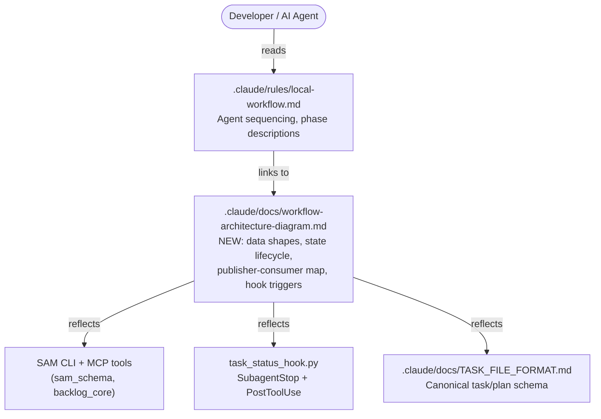
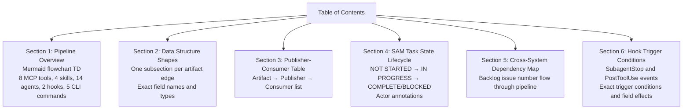

# Architecture Spec: Workflow Architecture Diagram Document
<!-- GitHub Issue: #933 -->
<!-- slug: workflow-architecture-diagram -->

## 1. Executive Summary

This spec defines the structure and content of two documentation artifacts for GitHub Issue #933:

1. **`.claude/docs/workflow-architecture-diagram.md`** — a new reference document that augments
   `local-workflow.md` with machine-readable data structure shapes, publisher-consumer
   relationships, state lifecycle diagrams, cross-system dependency maps, and hook trigger
   conditions. Designed for AI agent consumption.

2. **`.claude/rules/local-workflow.md`** — receives one new link pointing to the new diagram file.

**Problem addressed**: `local-workflow.md` documents agent sequencing but omits data structure
shapes and publisher-consumer relationships. AI agents reading it make incorrect assumptions
about available fields (e.g., which MCP tools return which fields, what a TaskAssignment
contains, which component owns a given status transition).

**Approach**: Multiple focused Mermaid diagrams (not one giant flowchart) covering pipeline
overview, state lifecycle, and cross-system dependency flow. Data shapes go in a dedicated
reference section, not as edge labels. No code changes — documentation only.

## 2. Architecture Overview

The document is a single markdown file with six sections corresponding to the six acceptance
criteria. Each section uses Mermaid `flowchart TD` syntax. Data structure shapes live in a
dedicated section (not inline as edge labels) so agents can look up field definitions without
parsing diagram syntax.

**C4 Context: Where the diagram file sits in the system**



**Document sections (6 deliverable sections + 1 table of contents)**



## 3. Technology Stack

This is a pure documentation task. No code is introduced. The relevant "technology" is the
diagramming syntax and document format.

| Concern | Choice | Justification |
|---------|--------|---------------|
| Diagram syntax | Mermaid `flowchart TD` | User preference (CLAUDE.md); renders in GitHub markdown natively |
| Diagram strategy | Multiple focused diagrams | One giant flowchart with 8+14+4+2+5 = 33 nodes is unreadable; split by concern |
| Data shapes format | Fenced YAML/JSON blocks in a reference section | Edge labels truncate; separate section allows full field definitions |
| Publisher-consumer | Prose table (markdown) | Flat data lookup — tables are appropriate per CLAUDE.md "User Formatting Preferences" |
| File format | Single `.md` file | Content under 25K characters; no split needed (see ADR-1) |
| Link from local-workflow.md | One markdown link | Minimal edit, preserves existing doc structure |

**Mermaid node count justification for multi-diagram approach**

A single `flowchart TD` with all 33 components and their edges would be unreadable both in
GitHub rendering (node overlap, long paths) and for AI agents (no clear entry point for
targeted lookups). Three focused diagrams solve different agent queries:

- **Pipeline overview** — answers "which agents/tools interact with which?"
- **State lifecycle** — answers "who transitions task status and when?"
- **Cross-system dependency** — answers "how does a backlog issue number propagate?"

## 4. Component Design

The document has one file and one edit target. No cli/, core/, services/, or utils/ apply here —
this is documentation. The component design describes the document's internal structure.

### 4.1 Target File: `.claude/docs/workflow-architecture-diagram.md`

**Purpose**: Machine-readable reference for AI agents; complements `local-workflow.md` with
data shapes that `local-workflow.md` explicitly omits.

**Audience**: AI agents (not humans). Format choices optimize for agent lookup patterns:
- Table of Contents at top (agents peek files; TOC at top reduces missed sections)
- Section headers use exact artifact names (agents search by name)
- YAML/JSON code blocks for data shapes (agents parse structured blocks reliably)
- No prose explaining "why" — agents need "what" and "which fields"

**Internal structure**

```text
.claude/docs/workflow-architecture-diagram.md
├── # Workflow Architecture Diagram
├── > Table of Contents (links to all 6 sections)
├── ## 1. Pipeline Overview
│   └── flowchart TD (grouped by phase: Planning, Execution, Quality Gates)
├── ## 2. Data Structure Shapes
│   ├── ### 2.1 sam_ready output (ReadyTasksResult)
│   ├── ### 2.2 TaskAssignment (sam_read P{N}/T{M})
│   ├── ### 2.3 T0 baseline YAML (plan/T0-baseline-{slug}.yaml)
│   ├── ### 2.4 TN verification YAML (plan/TN-verification-{slug}.yaml)
│   ├── ### 2.5 BacklogItem fields
│   ├── ### 2.6 active-task context file
│   └── ### 2.7 sam_claim output
├── ## 3. Publisher-Consumer Map
│   └── markdown table: Artifact | Publisher | Consumer(s)
├── ## 4. SAM Task State Lifecycle
│   └── flowchart TD (states + actors + guard conditions)
├── ## 5. Cross-System Dependency Map
│   └── flowchart TD (issue number flow: GitHub → backlog → plan → task → hook → GitHub)
└── ## 6. Hook Trigger Conditions
    ├── ### 6.1 SubagentStop
    └── ### 6.2 PostToolUse (Write|Edit|Bash)
```

### 4.2 Edit Target: `.claude/rules/local-workflow.md`

**Change**: Add one line after the Data Flow Diagram section (end of the diagram block):

```markdown
For data structure shapes, publisher-consumer relationships, state lifecycle,
and hook trigger conditions, see [Workflow Architecture Diagram](./../docs/workflow-architecture-diagram.md).
```

The link uses `./` relative path from `.claude/rules/` to `.claude/docs/` per CLAUDE.md
markdown link standards.

## 5. Data Architecture

This section defines exact field shapes for every data structure the diagram file must document.
Sources: `.claude/docs/TASK_FILE_FORMAT.md` (canonical), `backlog_core/models.py`,
`backlog_core/server.py`.

### 5.1 Pipeline Overview Node Inventory

The pipeline overview diagram must include exactly these nodes (verified from local-workflow.md):

**MCP Tools (8)**
- `backlog_get_ready_sam_tasks(parent_issue_number)` — readiness query
- `backlog_add` — create backlog item
- `backlog_list` — list items
- `backlog_view` — view single item
- `backlog_update(selector, plan)` — attach plan to item
- `sam_read(address)` — read task/plan
- `sam_claim(address)` — claim task
- `sam_state(address, status)` — transition status

**Skills (4)**
- `/add-new-feature`
- `/implement-feature`
- `/start-task`
- `/complete-implementation`

**Agents (14)** — grouped by phase:
- Planning: `feature-researcher`, `codebase-analyzer`, `python-cli-design-spec`, `swarm-task-planner`, `plan-validator`, `context-gathering`
- Execution: `t0-baseline-capture`, `tn-verification-gate`
- Quality Gates: `code-reviewer`, `feature-verifier`, `integration-checker`, `doc-drift-auditor`, `service-docs-maintainer`, `context-refinement`

**Hooks (2)**
- `task_status_hook.py SubagentStop`
- `task_status_hook.py PostToolUse`

**CLI Commands (5)**
- `sam list`
- `sam ready`
- `sam read`
- `sam claim`
- `sam status`

### 5.2 Data Structure Shapes to Document

**ReadyTasksResult** (output of `sam ready P{N}` and `backlog_get_ready_sam_tasks`)

```json
{
  "feature": "string (plan slug)",
  "ready_tasks": [
    {
      "task": "T01",
      "title": "string",
      "agent": "string",
      "skills": ["skill-name"],
      "priority": 1,
      "complexity": "low|medium|high",
      "dependencies": []
    }
  ],
  "count": 3
}
```

**TaskAssignment** (output of `sam read P{N}/T{M}`)

```json
{
  "plan_number": 719,
  "plan_slug": "string",
  "plan_goal": "string",
  "plan_context": "string",
  "plan_acceptance_criteria": ["string"],
  "task": {
    "task": "T04",
    "title": "string",
    "status": "not-started|in-progress|complete|blocked|deferred|skipped",
    "agent": "string",
    "dependencies": ["T01"],
    "priority": 1,
    "complexity": "low|medium|high",
    "skills": ["string"],
    "started": "ISO 8601 | null",
    "completed": "ISO 8601 | null",
    "last-activity": "ISO 8601 | null",
    "github_issue": "int | null",
    "is-bookend": "bool | null",
    "bookend-type": "t0-baseline|tn-verification | null",
    "body": "markdown string"
  }
}
```

**T0 Baseline YAML** (written by `t0-baseline-capture` to `plan/T0-baseline-{slug}.yaml`)

```yaml
# Array of per-criterion capture records
- criterion_id: "AC1"
  check_command: "uv run pytest tests/"
  exit_code: 1
  stdout: "string"
  stderr: "string"
```

**TN Verification YAML** (written by `tn-verification-gate` to `plan/TN-verification-{slug}.yaml`)

```yaml
# Array of BookendVerification records (one per criterion)
- criterion_id: "AC1"
  check_command: "uv run pytest tests/"
  t0_exit_code: 1
  tn_exit_code: 0
  status: "passed|regressed|pre-existing-fail|newly-passing"
  stdout_diff_summary: "string"
```

**Active Task Context File** (`.claude/context/active-task-{CLAUDE_SESSION_ID}.json`)

```json
{
  "task_file_path": "plan/P719-my-feature.yaml",
  "task_id": "T04",
  "parent_issue_number": 719
}
```

Note: `parent_issue_number` is omitted when story issue number is unknown.

**BacklogItem** (relevant fields for pipeline — from `backlog_core/models.py`)

```json
{
  "title": "string",
  "priority": "P0|P1|P2|Ideas",
  "description": "string",
  "source": "string",
  "type": "Feature|Bug|Refactor|Docs|Chore",
  "issue_number": "int | null",
  "plan": "string (file path) | null"
}
```

**sam_claim output**

```json
{
  "claimed": true,
  "task_id": "T04",
  "started": "2026-03-15T13:00:00Z"
}
```

Exit code 1 when: already claimed, task not found, or status != `not-started`.

### 5.3 Publisher-Consumer Map (complete)

The diagram file's Section 3 must reflect this complete mapping:

| Artifact | Publisher | Consumer(s) |
|----------|-----------|-------------|
| `plan/feature-context-{slug}.md` | `feature-researcher` | `python-cli-design-spec`, `swarm-task-planner` |
| `plan/codebase/{FOCUS}.md` | `codebase-analyzer` | `swarm-task-planner` |
| `plan/architect-{slug}.md` | `python-cli-design-spec` | `swarm-task-planner`, executing agents via `/start-task` |
| `plan/P{NNN}-{slug}.yaml` | `swarm-task-planner` (via `sam create`) | `/implement-feature`, `sam ready`, `sam status`, all execution agents |
| `plan/T0-baseline-{slug}.yaml` | `t0-baseline-capture` | `tn-verification-gate` |
| `plan/TN-verification-{slug}.yaml` | `tn-verification-gate` | `/complete-implementation` (Pre-Phase 1 check) |
| `.claude/context/active-task-{sid}.json` | `/start-task` skill | `task_status_hook.py` PostToolUse handler |
| `last-activity` field in task | `task_status_hook.py` PostToolUse | (consumed by progress reporting) |
| `status: complete`, `completed` field | `task_status_hook.py` SubagentStop | `sam ready` (readiness evaluation) |
| `status: in-progress`, `started` field | `sam claim` (via `/start-task`) | `sam status`, `sam ready` (exclusion) |
| Follow-up task files | `code-reviewer` | `/complete-implementation` recursion gate |
| Context Manifest in task file | `context-gathering`, `context-refinement` | executing agents, future sessions |

### 5.4 SAM Task State Lifecycle Transitions

States: `not-started` → `in-progress` → `complete`
                                    ↘ `blocked`
                                    (also: `deferred`, `skipped` from orchestrator)

Transition rules (from TASK_FILE_FORMAT.md Authorized Writers):

| Transition | Actor | Mechanism | Guard condition |
|-----------|-------|-----------|----------------|
| created → `not-started` | `swarm-task-planner` | `sam create` | Task created for first time |
| `not-started` → `in-progress` | `/start-task` skill | `sam claim P{N}/T{M}` | Exit code 0 only; fails if already claimed |
| `in-progress` → `complete` | `task_status_hook.py` SubagentStop | `sam state P{N}/T{M} complete` | Sub-agent finished |
| `in-progress` → `blocked` | executing agent or human | `sam state P{N}/T{M} blocked` | External dependency unresolvable |
| any → `deferred` | orchestrator | `sam state P{N}/T{M} deferred` | Postponed to later session |
| any → `skipped` | orchestrator | `sam state P{N}/T{M} skipped` | Intentionally not executed |

**Readiness rule**: A task is ready when `status == not-started` AND all dependency task IDs have `status == complete`.

### 5.5 Cross-System Dependency: Issue Number Flow

The `parent_issue_number` (GitHub issue) propagates through these fields:

```text
GitHub Issue #{N} (created by backlog_add)
  ↓ issue_number field in BacklogItem
  ↓ plan_number N used in plan file name P{NNN}-{slug}.yaml
    ↓ issue: N field in plan YAML (set by sam create --issue N)
      ↓ parent_issue_number in active-task-{sid}.json (written by /start-task)
        ↓ task_status_hook.py reads parent_issue_number → syncs completion to GitHub sub-issue
          ↓ github_issue field in Task YAML → linked sub-issue number
```

Key invariant: the `parent_issue_number` in the context file is the GitHub issue number for the
plan, NOT the task's `github_issue` sub-issue number. The hook uses both:
- `parent_issue_number` — the story issue (for `backlog_get_ready_sam_tasks`)
- `task.github_issue` — the sub-issue to close on completion

## 6. Security Architecture

This document contains no secrets, credentials, or sensitive data. It references file paths
and field names from the existing codebase.

Security checklist for this documentation task:

- No credentials documented (N/A — diagrams reference tool names and field shapes only)
- No internal system architecture exposed beyond what is already in `local-workflow.md`
- GitHub issue numbers are referenced as structural examples (e.g., `P{NNN}`) not real values
- The document is checked into the repository alongside `local-workflow.md` — same visibility

## 7. Testing Architecture

This is a documentation task. There are no code components to test.

**Verification criteria for the implementing agent**:

1. **Mermaid renders without error** — paste each diagram block into a Mermaid live editor
   (`mermaid.live`) to verify no syntax errors before committing.

2. **All 33 nodes present in pipeline overview** — count: 8 MCP tools + 4 skills + 14 agents +
   2 hooks + 5 CLI commands = 33. The implementing agent must verify this count after writing
   Section 1.

3. **Data shapes match source** — every field in Section 2 must exist in one of:
   - `.claude/docs/TASK_FILE_FORMAT.md` (Task and Plan schemas)
   - `plugins/development-harness/backlog_core/server.py` (backlog MCP tool signatures)
   - `plugins/development-harness/skills/implementation-manager/scripts/task_status_hook.py`
     (hook behavior)

4. **State lifecycle is complete** — all 6 status values (`not-started`, `in-progress`,
   `complete`, `blocked`, `deferred`, `skipped`) must appear in Section 4 with their actors.

5. **No invented fields** — no field name appears in Section 2 unless it is verified in the
   source files listed above. The implementing agent applies the Citation Requirements from
   CLAUDE.md.

6. **Link renders in GitHub** — the link added to `local-workflow.md` uses a relative path
   starting with `./` per CLAUDE.md File Reference Standards.

7. **No code fences missing language specifiers** — all fenced blocks have a language tag
   (`json`, `yaml`, `mermaid`, `text`, `bash`) per CLAUDE.md Code Fence Language Specifiers.

8. **linting passes** — `uv run prek run --files .claude/docs/workflow-architecture-diagram.md`
   and `uv run prek run --files .claude/rules/local-workflow.md` exit 0.

## 8. Distribution Architecture

Documentation files. No packaging, PEP 723, or distribution concerns apply.

**File placement**:

| File | Location | Why |
|------|----------|-----|
| `workflow-architecture-diagram.md` | `.claude/docs/` | Alongside `TASK_FILE_FORMAT.md`; same audience (AI agents and developers reading the pipeline) |
| Link edit | `.claude/rules/local-workflow.md` | Minimal touch; existing doc retains primary agent sequencing role |

The `.claude/docs/` directory is the established location for canonical reference documents
(`TASK_FILE_FORMAT.md`, `plan-schema.json`, `task-schema.json`, `assignment-schema.json`).
Placing the new file there is consistent with existing patterns.

## 9. Architectural Decisions (ADRs)

### ADR-1: Single file vs. companion files

**Decision**: Single file (`.claude/docs/workflow-architecture-diagram.md`).

**Context**: Large File Write Strategy requires Strategy A (multi-file split) when output
exceeds 25K characters. Estimated content:
- Section 1 pipeline diagram: ~2K characters
- Section 2 data shapes (7 subsections): ~4K characters
- Section 3 publisher-consumer table: ~1.5K characters
- Section 4 state lifecycle diagram: ~1K characters
- Section 5 cross-system dependency diagram: ~1K characters
- Section 6 hook trigger conditions: ~2K characters
- Headers, TOC, prose: ~1K characters
- Total: ~12.5K characters — well under 25K

**Decision**: Single file is appropriate. No split needed.

**Consequence**: The implementing agent writes the file in one Write call (skeleton) then fills
sections with Edit calls per Strategy B. Each Edit is under 5K characters.

---

### ADR-2: Multiple focused diagrams vs. single pipeline diagram

**Decision**: Three focused Mermaid diagrams:
1. Pipeline overview (all 33 components, grouped by phase)
2. State lifecycle (task status machine)
3. Cross-system dependency (issue number flow)

**Context**: A single flowchart with 33 nodes and all edges would have ~60+ edges. GitHub
renders Mermaid up to a complexity limit; beyond it, the diagram shows an error or collapses.
AI agents benefit more from focused diagrams — each answers a specific question.

**Rejected alternative**: One giant diagram with subgraphs. Subgraphs in Mermaid `flowchart TD`
can only be defined at top level; cross-subgraph edges reduce readability further.

**Consequence**: Section 1 uses subgraph grouping within one diagram for phase separation
(Planning / Execution / Quality Gates). Sections 4 and 5 are separate independent diagrams.

---

### ADR-3: Data shapes as reference section vs. edge labels

**Decision**: Dedicated Section 2 (data structure shapes) with fenced YAML/JSON blocks.

**Context**: Mermaid edge labels are limited to short strings. Embedding
`{"feature": "...", "ready_tasks": [...], "count": N}` as an edge label would be clipped and
unparseable. AI agents that look up "what fields does `sam_ready` return?" need to find a
block they can parse, not a diagram edge.

**Consequence**: Section 2 is a reference catalog. Agents that want to know the shape of any
inter-component message look it up there by subsection name (e.g., "2.1 sam_ready output").
The pipeline overview diagram in Section 1 labels edges with the subsection number (e.g.,
`-- "§2.1" -->`) so agents can cross-reference.

---

### ADR-4: Publisher-consumer as table vs. diagram

**Decision**: Markdown table in Section 3.

**Context**: A flowchart of all artifacts, publishers, and consumers would overlap with the
pipeline overview. The table format is appropriate per CLAUDE.md "User Formatting Preferences"
("Tables acceptable only for pure data lookup"). This is exactly a data lookup — given an
artifact name, find who writes it and who reads it.

**Consequence**: Section 3 is a lookup table. Agents that need to know "who produces
`plan/T0-baseline-{slug}.yaml`?" scan the Artifact column. No narrative required.

## 10. Scalability Strategy

Documentation files do not have async patterns or resource management requirements.

**Maintenance scalability**: The diagram file will drift from the implementation as MCP tools
and agents are added. To prevent this:

1. The file header should cite its source files explicitly:

   ```text
   Sources: TASK_FILE_FORMAT.md, backlog_core/server.py, task_status_hook.py
   Last verified: {date}
   ```

2. The `doc-drift-auditor` agent (Phase 4 of `/complete-implementation`) should be pointed at
   this file in future implementation sessions that modify the SAM pipeline. It is designed
   to detect exactly this kind of structural drift.

3. When new MCP tools are added to `backlog_core/server.py` or `sam_schema`, the publisher-
   consumer table (Section 3) requires a new row. This is a bounded, low-effort update.

**Size scalability**: The document is currently estimated at ~12.5K characters. If new
pipeline phases (beyond Planning / Execution / Quality Gates) are introduced, Section 1's
pipeline overview may need to split into Phase 1 and Phase 2 sub-diagrams. The current
single-file strategy accommodates up to ~25K characters before Strategy A (multi-file split)
becomes necessary.

---

## Implementation Instructions for the Developing Agent

The implementing agent creates two artifacts:

### Artifact 1: `.claude/docs/workflow-architecture-diagram.md`

Write using Strategy B (skeleton Write + section Edit calls):

1. Write skeleton with `<!-- PENDING: section-N -->` stubs for all 6 sections.
2. Fill Section 1 (pipeline overview Mermaid diagram) with all 33 nodes grouped into
   3 subgraphs: `subgraph Planning`, `subgraph Execution`, `subgraph QualityGates`.
3. Fill Section 2 (data shapes) using the exact field definitions in Section 5.2 of this spec.
4. Fill Section 3 (publisher-consumer table) using the complete mapping in Section 5.3.
5. Fill Section 4 (state lifecycle) using the transitions in Section 5.4.
6. Fill Section 5 (cross-system dependency) using the issue number flow in Section 5.5.
7. Fill Section 6 (hook trigger conditions) from `TASK_FILE_FORMAT.md` Authorized Writers
   table and `task_status_hook.py`.
8. Verify zero `<!-- PENDING:` markers remain.
9. Run `uv run prek run --files .claude/docs/workflow-architecture-diagram.md`.

### Artifact 2: Edit to `.claude/rules/local-workflow.md`

Locate the Data Flow Diagram section (ends with `Done` node in the flowchart). After the
closing triple-backtick of that diagram block, add one blank line then:

```markdown
For data structure shapes, publisher-consumer relationships, state lifecycle,
and hook trigger conditions, see [Workflow Architecture Diagram](./../docs/workflow-architecture-diagram.md).
```

Run `uv run prek run --files .claude/rules/local-workflow.md`.

### Verification Gate

Before reporting DONE, the implementing agent must confirm all 8 testing criteria from
Section 7 are satisfied. No criterion may be skipped.
