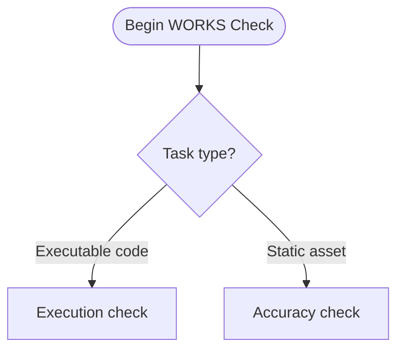

# SAM Pipeline Architecture and Conventions

**Analysis Date:** 2026-03-01
**Focus:** Architecture and Conventions for Process Quality Discipline feature
**Source Files Analyzed:**
- `.claude/docs/TASK_FILE_FORMAT.md`
- `.claude/skills/groom-backlog-item/SKILL.md`
- `.claude/skills/complete-implementation/SKILL.md`
- `.claude/skills/verify/SKILL.md`
- `.claude/rules/local-workflow.md`
- `plugins/python3-development/agents/feature-verifier.md`
- `plugins/development-harness/agents/feature-verifier.md`
- `plugins/python3-development/agents/code-reviewer.md`
- `plugins/python3-development/agents/integration-checker.md`
- `plugins/python3-development/agents/swarm-task-planner.md`
- `plugins/python3-development/agents/plan-validator.md`
- `plugins/python3-development/skills/implementation-manager/scripts/implementation_manager.py`
- `plugins/python3-development/skills/implementation-manager/scripts/task_format.py`

---

## Module Overview

```text
SAM Pipeline — Key Entry Points
├── .claude/skills/
│   ├── complete-implementation/SKILL.md   — Quality gates after all tasks COMPLETE
│   ├── groom-backlog-item/SKILL.md        — Pre-planning backlog preparation
│   ├── verify/SKILL.md                    — Self-assessment checklist for task completion
│   └── add-new-feature/SKILL.md           — Planning: discovery → architect → tasks
│
├── plugins/python3-development/agents/
│   ├── feature-verifier.md                — Goal-backward verification (post-execution)
│   ├── integration-checker.md             — Cross-module wiring verification
│   ├── code-reviewer.md                   — Code quality and pattern compliance
│   ├── plan-validator.md                  — Plan completeness before execution
│   └── swarm-task-planner.md              — Task decomposition from architecture spec
│
└── plugins/python3-development/skills/implementation-manager/scripts/
    ├── implementation_manager.py          — CLI: status, ready-tasks, validate
    ├── task_format.py                     — Shared YAML frontmatter utilities
    ├── task_status_hook.py                — Hook: auto-update status/timestamps
    └── get_task_context.py                — Dynamic context injection
```

---

## Task Metadata Schema

### Canonical Location

Schema is defined and versioned at `.claude/docs/TASK_FILE_FORMAT.md` (v2.0, 2026-02-04).

### YAML Frontmatter Format (Current Default)

```yaml
---
task: T1                        # REQUIRED — pattern: ^[A-Za-z]?\d+(\.\d+)?$
title: Data Models and Error Codes  # REQUIRED — 5-100 chars
status: not-started             # REQUIRED — enum (see Status Values below)
agent: python-cli-architect     # OPTIONAL — agent name string
dependencies: []                # OPTIONAL — array of task IDs
priority: 1                     # OPTIONAL — integer 1-5 (1=highest)
complexity: medium              # OPTIONAL — enum: low | medium | high
created: 2026-02-02T15:00:00Z  # OPTIONAL — ISO 8601 with timezone
started: 2026-02-02T15:15:00Z  # OPTIONAL — ISO 8601 with timezone
completed: 2026-02-02T15:30:00Z # OPTIONAL — ISO 8601 with timezone
blocked-by: []                  # OPTIONAL — external blockers (strings, not task IDs)
parallelize-with: []            # OPTIONAL — task IDs that can run concurrently
skills: []                      # OPTIONAL — skills for sub-agent to load
---
```

**Source:** `.claude/docs/TASK_FILE_FORMAT.md:127-151`

### Status Values

| Status | Description |
|--------|-------------|
| `not-started` | Default for new tasks |
| `in-progress` | Set when agent claims task |
| `complete` | Set after verification passes |
| `blocked` | Set when waiting on external dependency |

**Source:** `.claude/docs/TASK_FILE_FORMAT.md:155-160`

### Legacy Format (Still Supported, Being Migrated)

```markdown
## Task T1: Data Models and Error Codes

**Status**: NOT STARTED
**Agent**: python-cli-architect
**Dependencies**: None
**Priority**: 1 (Foundational)
**Complexity**: Medium
**Skills**: fastmcp-python-tests, python3-development
**Started**: 2026-02-02T15:15:00Z
**Completed**: 2026-02-02T15:30:00Z
```

**Status:** Migration in progress as of 2026-02-13. New tasks use YAML frontmatter. Legacy format is parsed via regex fallback in `implementation_manager.py`.

**Source:** `.claude/docs/TASK_FILE_FORMAT.md:466-479`

### Fields Currently NOT in Schema (Future Fields Appendix)

The schema explicitly reserves these for future versions:

- `estimate-hours`, `actual-hours`
- `assignee`, `labels`, `epic`, `sprint`
- `verification-agent`
- `retry-count`, `last-error`

**Source:** `.claude/docs/TASK_FILE_FORMAT.md:899-911`

### `accuracy-risk` Field (swarm-task-planner Extension)

The `swarm-task-planner` agent writes an `accuracy-risk` field to task YAML frontmatter that is NOT in the core schema:

```yaml
accuracy-risk: low  # low | medium | high
```

This field drives CoVe (Chain of Verification) checks in tasks. It is defined in `plugins/python3-development/agents/swarm-task-planner.md:258` but is not consumed by `implementation_manager.py`. It is present in task files written by the planner but silently ignored during execution.

---

## Markdown Body Sections

Task files use these sections after the YAML frontmatter (defined in template at `.claude/docs/TASK_FILE_FORMAT.md:172-186`):

```markdown
## Context        — Why this task exists, background
## Objective      — Single sentence: what this task achieves
## Requirements   — Numbered list of specific deliverables
## Constraints    — Technical / policy constraints
## Expected Outputs — Files, artifacts, deliverables
## Acceptance Criteria — Testable pass/fail conditions
## Verification Steps  — Executable commands
## Can Parallelize With — Task IDs (optional)
## Handoff        — What to report to orchestrator (optional)
```

**Source:** `.claude/docs/TASK_FILE_FORMAT.md:172-186`

---

## How Fields Are Consumed by Agents

### `implementation_manager.py` Field Consumption

The parser at `plugins/python3-development/skills/implementation-manager/scripts/implementation_manager.py` loads these fields into the `Task` dataclass:

```python
@dataclass
class Task:
    id: str
    name: str
    status: TaskStatus
    dependencies: list[str] = field(default_factory=list)
    agent: str | None = None
    priority: TaskPriority = TaskPriority.CRITICAL
    complexity: str = "Medium"
    started: str | None = None
    completed: str | None = None
    skills: list[str] = field(default_factory=list)
```

**Source:** `plugins/python3-development/skills/implementation-manager/scripts/implementation_manager.py:90-115`

Fields consumed by `ready-tasks` command (which drives orchestrator delegation):
- `status` — must be `NOT STARTED` / `not-started`
- `dependencies` — all must be `COMPLETE` / `complete`
- `agent` — passed to orchestrator for routing
- `skills` — passed to orchestrator for sub-agent skill-loading

Fields **not consumed** by `implementation_manager.py`: `complexity`, `created`, `blocked-by`, `parallelize-with`, `accuracy-risk`

### Timestamp Ownership

Timestamps are managed by two separate mechanisms:

| Field | Written By | When | How |
|-------|-----------|------|-----|
| `started` | `/start-task` skill (agent) | When agent begins | Agent edits task file directly |
| `completed` | `task_status_hook.py` (SubagentStop hook) | When sub-agent finishes | Hook reads `.claude/context/active-task-{session_id}.json` |
| `last-activity` | `task_status_hook.py` (PostToolUse hook) | On Write/Edit/Bash | Continuous updates during execution |

**Source:** `.claude/rules/local-workflow.md` (Timestamp Responsibilities table)

---

## Skill File Conventions

### YAML Frontmatter Schema for Skills

```yaml
---
name: skill-name                        # kebab-case
description: "One sentence description" # used in agent selection
argument-hint: <arg-description>        # shown in help
user-invocable: true                    # whether user can invoke
metadata:
  version: "1.0.0"
  last_updated: "YYYY-MM-DD"
  source: description of source
hooks:                                  # optional Claude Code hooks
  SubagentStop:
  - hooks:
    - type: command
      command: python3 "./path/to/hook.py"
---
```

**Source:** `.claude/skills/complete-implementation/SKILL.md:1-10` and `.claude/skills/groom-backlog-item/SKILL.md:1-6`

### Skill Step Numbering Convention

Skills use numbered `### Step N:` headings for workflow steps. Steps are executed sequentially by the agent. Example from `/groom-backlog-item`:

```markdown
### Step 1: Parse Arguments and Load Backlog
### Step 2: Validity Check (Pre-Groom Gate)
### Step 3: Extract Item Details
### Step 4: Fact-Check Item Claims
### Step 5: RT-ICA Assessment Per Item
### Step 6: Issue Classification
### Step 7: Root-Cause Analysis (Conditional)
### Step 8: Spawn Groomer Agents
### Step 9: Write Groomed Content to Item Files
```

**Source:** `.claude/skills/groom-backlog-item/SKILL.md:23-187`

### Skill Decision Gates (Mermaid Flowcharts)

Skills embed Mermaid flowcharts to represent conditional branches. The `/verify` skill uses this to represent the "WORKS Check" (`## 2. The "WORKS" Check`):

```markdown

```

Use `<br>` not `\n` for line breaks inside Mermaid node labels. Use `=` not `:` for assignments inside label strings.

**Source:** `.claude/skills/verify/SKILL.md:25-39`

### Complete-Implementation Phase Pattern

`/complete-implementation` (`SKILL.md:1-66`) uses a simple numbered `## Phase N:` heading pattern. Each phase names the agent to launch and the input. No mermaid diagrams are used in this skill — it is intentionally minimal:

```markdown
## Phase 1: Code Review

Launch `code-reviewer` with the task file path.

---

## Phase 2: Feature Verification (goal-backward)

Launch `feature-verifier` with the task file path.
```

**Source:** `.claude/skills/complete-implementation/SKILL.md:21-65`

### Phase Sequence in `/complete-implementation`

Current 6-phase quality gate sequence (sequential, not parallel):

```text
Phase 1: code-reviewer            → code quality, pattern compliance, follow-up task files
Phase 2: feature-verifier         → goal-backward verification (VERIFIED | GAPS_FOUND)
Phase 3: integration-checker      → cross-module wiring (CONNECTED | GAPS_FOUND)
Phase 4: doc-drift-auditor         → documentation drift audit (read-only)
Phase 5: service-docs-maintainer  → documentation update (conditional: if drift found)
Phase 6: context-refinement       → update Context Manifest in task file
```

**Adding a new phase:** Insert a `## Phase N:` section in `/complete-implementation/SKILL.md` following the `Launch {agent} with the task file path.` pattern. Renumber subsequent phases.

**Source:** `.claude/skills/complete-implementation/SKILL.md:22-65`

---

## Agent File Conventions

### Agent Frontmatter Schema

```yaml
---
name: agent-name                # kebab-case, matches invocation name
description: "..."              # what it does and when to spawn it
tools: Read, Write, Edit, ...   # comma-separated tool list
model: sonnet | opus | haiku    # model selection
skills: subagent-contract, ...  # skills loaded on spawn
color: green | yellow | blue    # visual indicator
permissionMode: acceptEdits     # optional
---
```

**Source:** `plugins/python3-development/agents/code-reviewer.md:1-8`

### Agent Section Structure

Agent files use these XML-style wrapper sections:

```xml
<role>...</role>               — Identity, who spawns this agent, job description
<core_principle>...</core_principle>  — Central mental model
<critical_rules>...</critical_rules>  — DO/DO NOT rules
<verification_process>...</verification_process> — Step-by-step SOP
<output>...</output>           — Structured return format
<success_criteria>...</success_criteria>  — Checklist for quality assurance
```

**Source:** Observed across `feature-verifier.md`, `integration-checker.md`, `plan-validator.md`

### Agent Output Format Convention

All agents return structured `STATUS:` blocks as their final response. Two variants:

```text
STATUS: DONE
SUMMARY: ...
ARTIFACTS:
  - key: value
RISKS:
  - ...
NOTES:
  - ...
```

```text
STATUS: BLOCKED
SUMMARY: what is blocking
NEEDED:
  - missing input 1
SUGGESTED NEXT STEP: ...
```

**Source:** `plugins/python3-development/agents/code-reviewer.md:240-256`

### Agent SOP Pattern

Agents define their workflow using `## Step N:` headings inside a `<workflow>` or `<verification_process>` block. Steps include inline bash commands as code fences.

**feature-verifier.md** uses 7 steps (`<verification_process>`):
1. Load Context
2. Establish Must-Haves
3. Verify Observable Truths
4. Verify Artifacts (Three Levels: Existence, Substantive, Wired)
5. Verify Key Links
6. Test Edge Cases
7. Determine Overall Status

**Source:** `plugins/python3-development/agents/feature-verifier.md:53-200`

---

## Completion Gate Verification Logic

### feature-verifier: Three-Level Artifact Check

Use this framework for verifying any implementation artifact:

```python
| Exists | Substantive | Wired | Status     |
| ------ | ----------- | ----- | ---------- |
| ✓      | ✓           | ✓     | VERIFIED   |
| ✓      | ✓           | ✗     | ORPHANED   |
| ✓      | ✗           | -     | STUB       |
| ✗      | -           | -     | MISSING    |
```

**Substantive check:** File has >10 lines for a function, >30 for a module. No TODO/FIXME/placeholder patterns.
**Wired check:** Function is imported AND called (not just imported).

**Source:** `plugins/python3-development/agents/feature-verifier.md:120-148`

### integration-checker: Five Integration Status Categories

```text
CONNECTED          — Exported, imported, AND used
IMPORTED_NOT_USED  — Imported but call site missing
ORPHANED           — Not imported anywhere
BROKEN_FLOW        — Data flow breaks at a specific step
MISSING_CONSUMER   — API exists but has no consumers
```

**Source:** `plugins/python3-development/agents/integration-checker.md:107-111`

### plan-validator: Nine Validation Dimensions

The plan-validator checks these dimensions in order:

```text
1. Requirement Coverage     — every requirement has covering task(s)
2. Task Completeness        — required fields present: ID, status, deps, agent, AC, verification
3. Dependency Correctness   — acyclic, no missing refs, valid execution order
4. Agent Capability Match   — task type → valid agent mapping
5. Input/Output Validity    — inputs exist or created earlier; no conflicts
6. Artifact Wiring          — components connected, not just created
7. Testability              — acceptance criteria are measurable and executable
8. Scope Sanity             — tasks/phase ≤7 warning, ≥8 blocker; files/task ≤6 warning, ≥7 blocker
9. Architectural Boundary   — plans describe WHAT (interfaces), not HOW (implementations)
```

**Severity levels:** `blocker` (must fix), `warning` (should fix), `info` (suggestions)

**Source:** `plugins/python3-development/agents/plan-validator.md:68-303`

### verify Skill: Four Check Categories

The `/verify` skill uses four sequential sections:

```text
1. Task Type & Strategy   — FIX | FEATURE | REFACTOR | DOCS | INVESTIGATION
2. WORKS Check            — execution evidence (code) or accuracy check (static)
3. FIXED Check            — for bug fixes: before/after comparison
4. Quality Gates          — pre-commit, linting, type checking
```

All checks require explicit EVIDENCE text blocks, not assumptions.

**Source:** `.claude/skills/verify/SKILL.md:14-113`

---

## Grooming Workflow and Task Template Interface

### What Grooming Produces

The `/groom-backlog-item` skill produces a DEEP item (Detailed, Estimated, Emergent, Prioritized). It writes to `.claude/backlog/{priority}-{slug}.md` via `backlog.py groom` commands.

Groomed sections written to backlog item files:
- `Fact-Check` — verified claims, refuted claims, citations
- `RT-ICA` — information completeness assessment (AVAILABLE | DERIVABLE | MISSING per condition)
- `Reproducibility`, `Priority`, `Impact`, `Scope`, `Output / Evidence`, `Dependencies`
- `Research`, `Skills`, `Agents`, `Prior Work`, `Files`, `Decision`

**Source:** `.claude/skills/groom-backlog-item/SKILL.md:230`

### Grooming → Task Template Interface

Grooming does NOT create task files. It prepares backlog items for the planning phase (`/work-backlog-item` → Step 6: architecture, task decomposition).

The interface is:
1. Groomed item provides `Skills` and `Agents` sections identifying relevant skills/agents
2. Architecture phase (`python-cli-design-spec` agent) reads groomed item
3. Task planner (`swarm-task-planner`) reads architect spec and writes task files with `skills:` field

The `skills:` field in task YAML frontmatter maps directly to the groomed item's `Skills` section discoveries.

**Source:** `.claude/skills/groom-backlog-item/SKILL.md:160-165`, `.claude/rules/local-workflow.md:38-41`

---

## Patterns for Adding New Agent Checks

### Adding a New Check to `feature-verifier`

The `feature-verifier` checks at `plugins/python3-development/agents/feature-verifier.md` are organized as `## Step N:` sections inside `<verification_process>`. To add a new check:

1. Add a new `## Step N:` inside the `<verification_process>` block (before `## Step 7: Determine Overall Status`)
2. Update `## Step 7` to include the new check in the status determination logic
3. Add a checkbox for the new step to `<success_criteria>`
4. If the check adds a new output field, update the `<output>` block's `STATUS: GAPS_FOUND` format

**Pattern for a new check step:**

```markdown
## Step N: Check {New Property}

For each feature, verify {what to check}:

```bash
# Check command
Grep(pattern="{pattern}", path="{path}")
```

**Status:**
- VERIFIED: {condition for pass}
- FAILED: {condition for fail}
```

Both `plugins/python3-development/agents/feature-verifier.md` and `plugins/development-harness/agents/feature-verifier.md` must be updated in parallel. The development-harness version is language-agnostic (references "language manifest"), while the python3-development version is Python-specific.

**Source:** `plugins/python3-development/agents/feature-verifier.md:51-199`

### Adding a New Phase to `/complete-implementation`

```markdown
## Phase N: {Phase Name}

Launch `{agent-name}` with the task file path.

---
```

Place conditional phases (only run under certain conditions) after unconditional phases. Document the condition inline:

```markdown
## Phase 5: Documentation Update (if drift found)

If drift exists or docs must be updated for the feature, launch `service-docs-maintainer`.
```

**Source:** `.claude/skills/complete-implementation/SKILL.md:43-48`

### Adding a New Validation Dimension to `plan-validator`

Add a new `## Dimension N:` section inside `<validation_dimensions>`. Required elements:

```markdown
## Dimension N: {Name}

**Question:** {Binary question about plan quality}

**Process:**
1. ...
2. ...

**Red flags:**
- {specific observable anti-pattern}

**Pass criteria:** (optional)
- {what a passing plan looks like}
```

Also add the dimension to:
- `<output>` → `VALIDATION_RESULTS:` list
- `<success_criteria>` → Level 2 checklist
- `<gap_categories>` → new category row if needed

**Source:** `plugins/python3-development/agents/plan-validator.md:68-303`

---

## Existing Issue Classification Patterns

No explicit "issue classification" field exists in the current task schema. Issue classification is currently expressed through:

1. **`plan-validator` gap categories** — 10 named categories (DEPENDENCY, INPUT, OUTPUT, WIRING, AGENT, CRITERIA, VERIFICATION, SCOPE, STRUCTURE, BOUNDARY_VIOLATION) returned in structured YAML in the output
2. **`integration-checker` status categories** — 5 categories (CONNECTED, IMPORTED_NOT_USED, ORPHANED, BROKEN_FLOW, MISSING_CONSUMER) in structured YAML output
3. **`code-reviewer` issue categories** — expressed via follow-up task files, not in-place field updates

Issue classification is an output artifact of quality gate agents, not an input field in task metadata.

**Source:** `plugins/python3-development/agents/plan-validator.md:424-440`, `plugins/python3-development/agents/integration-checker.md:57-60`

---

## Analysis Method Selection Patterns

No formal "analysis method selection" mechanism exists. The closest patterns are:

1. **`accuracy-risk` in swarm-task-planner** — `low | medium | high` drives CoVe inclusion. High risk = CoVe Checks required. Source: `plugins/python3-development/agents/swarm-task-planner.md:258-265`

2. **`/verify` task type branch** — Executable code → execution evidence path; Static asset → accuracy check path. Represented as Mermaid flowchart in `.claude/skills/verify/SKILL.md:25-39`

3. **development-harness language manifest** — `Glob(pattern="{project_path}/.planning/harness/language-manifest*")` determines which test/lint commands to run in `feature-verifier`. Source: `plugins/development-harness/agents/feature-verifier.md:57-63`

---

## Where to Add New Code

| New functionality | Location |
|-------------------|----------|
| New quality gate phase | `.claude/skills/complete-implementation/SKILL.md` — new `## Phase N:` |
| New agent check (Python-specific) | `plugins/python3-development/agents/{agent-name}.md` |
| New agent check (language-agnostic) | `plugins/development-harness/agents/{agent-name}.md` |
| New task metadata field | `.claude/docs/TASK_FILE_FORMAT.md` + `plugins/python3-development/skills/implementation-manager/scripts/task_format.py` + `implementation_manager.py` `Task` dataclass |
| New status value | `task_format.py:STATUS_MAP` + `VALID_STATUSES` + `_YAML_STATUS_TO_ENUM` in `implementation_manager.py` |
| New validation dimension | `plugins/python3-development/agents/plan-validator.md` `<validation_dimensions>` block |
| New grooming section | `.claude/skills/groom-backlog-item/SKILL.md` Step 7 valid section names |
| New verification check in `/verify` | `.claude/skills/verify/SKILL.md` — new numbered section |

---

## Python Conventions in Pipeline Scripts

### Import Order

```python
from __future__ import annotations  # Always first

import json                          # stdlib
import re
import sys
from dataclasses import dataclass, field
from enum import IntEnum, StrEnum
from pathlib import Path

import typer                         # third-party
from rich.console import Console

from task_format import VALID_STATUSES, ...  # local
```

**Source:** `plugins/python3-development/skills/implementation-manager/scripts/implementation_manager.py:1-40`

### YAML Library

Use `ruamel.yaml` exclusively. Never `pyyaml` (`import yaml`).

```python
from ruamel.yaml import YAML
_yaml = YAML(typ="safe")
```

**Source:** `plugins/python3-development/skills/implementation-manager/scripts/task_format.py:19-22` and `.claude/rules/yaml-toml-libraries.md`

### Docstring Style

Google-style with Args/Returns/Raises sections:

```python
def parse_yaml_frontmatter(content: str) -> tuple[dict[str, Any], str]:
    """Extract YAML frontmatter and markdown body from content.

    Args:
        content: File content with YAML frontmatter.

    Returns:
        Tuple of (frontmatter_dict, body_content).

    Raises:
        ValueError: If frontmatter format is invalid or YAML parsing fails.
        TypeError: If parsed YAML is not a mapping.
    """
```

**Source:** `plugins/python3-development/skills/implementation-manager/scripts/task_format.py:95-112`

### Error Handling

Raise specific exception types. Fail fast with descriptive messages. Never catch `Exception:` broadly.

```python
if not isinstance(parsed, dict):
    msg = f"Frontmatter must be a YAML mapping, got {type(parsed).__name__}"
    raise TypeError(msg)
```

**Source:** `plugins/python3-development/skills/implementation-manager/scripts/task_format.py:129-131`

### Type Annotations

Python 3.12+ native generics. No `typing.Optional`, `typing.List`, `typing.Dict`.

```python
def update_yaml_field(content: str, field: str, value: str | int | list[str]) -> str:
```

**Source:** `plugins/python3-development/skills/implementation-manager/scripts/task_format.py:142`

---

*Architecture and conventions analysis: 2026-03-01*
