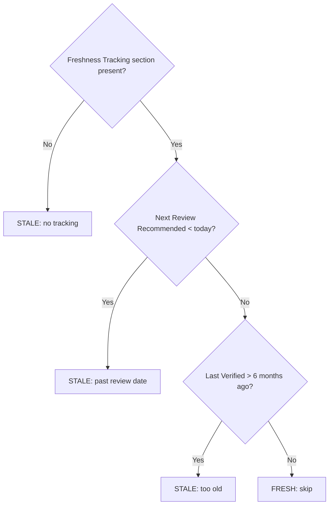

# Skill Conventions: Duplicate Detection, Freshness Tracking, and Gating Behavior

**Analysis Date:** 2026-03-06
**Scope:** `.claude/skills/research-curator/`, `.claude/skills/refresh-research/`, `.claude/agents/research-curator.md`, and selected comparison skills

---

## 1. Current Freshness and Duplicate Gating Patterns

### research-curator: Duplicate Detection

**File:** `.claude/skills/research-curator/SKILL.md` (Batch Mode section, line 165-166)
**File:** `.claude/skills/research-curator/references/batch-mode.md` (lines 64-65)

In **batch mode**, the duplicate detection behavior is:

```text
Before spawning, check if ./research/ already contains an entry for the URL's
resource. If found, skip with info message suggesting --rerun instead.
```

The batch-mode Mermaid flowchart (`references/batch-mode.md`, lines 30-53) encodes this at the `Start` node label: `"Parse deduplicated URLs from --batch"`. The deduplication happens before wave spawning — no agent is spawned for a known duplicate.

**Outcome type:** Informational skip — the orchestrator emits a message to the user and does not spawn an agent. There is no delta report, no count of what already exists, and no mechanism to proceed anyway. The user is redirected to `--rerun`.

**In default mode** (single URL, `SKILL.md` lines 99-143): There is no explicit duplicate check documented. The agent is spawned unconditionally.

**In rerun mode** (`SKILL.md` lines 192-244): Not a duplicate check — it is an intentional refresh. The agent reads the existing entry and updates it.

---

### research-curator: Freshness Gating

**File:** `.claude/skills/research-curator/SKILL.md` (Rerun Mode, lines 200-222)
**File:** `.claude/agents/research-curator.md` (`--rerun` mode, lines 324-338)

The orchestrator SKILL.md does **not** gate rerun on staleness — it re-researches any named entry unconditionally. Staleness detection is entirely delegated to the `/refresh-research` skill.

In the `@research-curator` agent's `--rerun` mode (agent file lines 324-338), the agent:

1. Reads the existing entry file
2. Re-gathers fresh data from primary sources
3. Re-extracts passages and notes changes
4. Updates content and freshness tracking
5. Returns a result listing what changed and what was confirmed unchanged

The agent categorizes outcomes as **Updated** or **Unchanged** but this distinction only surfaces in its structured return block — the orchestrator (`/research-curator` SKILL.md Rerun Mode Output, lines 407-417) includes `"Changes Detected: M entries had updated data"` in its output template, which shows the delta. So rerun mode does display a delta (what changed vs. confirmed unchanged) and always proceeds regardless of whether changes were found.

---

### refresh-research: Staleness Detection (Steps 1-2)

**File:** `.claude/skills/refresh-research/SKILL.md` (lines 23-58)

**Step 1** inventories all entries and applies a three-condition staleness check:



The `FRESH: skip` branch is a **silent skip** — fresh entries are excluded from the target set. The summary report (Step 6) does report the count as `"Skipped (fresh): {K}"` in the header table, so the user knows how many were skipped, but receives no per-entry details about fresh entries.

**Step 2** applies scope filters with an explicit stop condition: `"If zero entries remain after all filters: report 'No entries match the applied filters.' and stop."` This is a **gating stop** — not a skip — and includes a specific `--layer` message variant that explains why entries were excluded.

The `--dry-run` flag in Step 2 provides a preview path: display the filtered target list and stop without spawning agents. This is the closest the codebase comes to "show what would happen, then stop."

**Key gap:** Fresh entries are counted in the summary but not individually reported. There is no "show me all fresh entries with their review dates" output — only the aggregate skip count.

---

### Validation Mode: Three-Severity Gating

**File:** `.claude/skills/research-curator/SKILL.md` (Validate Mode, lines 249-323)
**File:** `.claude/skills/research-curator/references/validation-rules.md`

Validation applies a three-tier severity model that distinguishes action from information:

| Severity | Handling |
|----------|----------|
| `error` | Gate → spawn `@research-curator --fix` agents (auto-fix) |
| `warning` | Report to user; do not auto-fix |
| `info` | Report to user; no action needed |

This is the most explicit gating pattern in the research system. The Mermaid flowchart (`SKILL.md` lines 270-282) makes the gate explicit:

```text
HasErrors{"Does parsed output contain any error-severity issues?"}
  -->|"No — zero error-severity issues"| ReportClean(["Report: all entries passed. Stop."])
  -->|"Yes — N error-severity issues found"| SpawnFix[...]
```

Zero-error path is a clean stop with informational output. Warnings and info are **never gating** — they always proceed to the summary report.

---

## 2. How Other Skills Handle "Already Exists" and "Not Yet Due"

### create-backlog-item: Duplicate Detection with User Agency

**File:** `.claude/skills/create-backlog-item/SKILL.md` (lines 123-136)

```text
Step 3: Duplicate Detection
Scan .claude/backlog/ per-item files. Search item titles for case-insensitive
overlap with title.

If a match is found within edit distance ≤ 2 tokens, report:
  "Possible duplicate: '{existing title}' already exists in {section}.
  Proceed anyway? (y/n)"

Use AskUserQuestion with Yes / No options. If No: stop.
```

In `--auto` mode, a duplicate is a **hard stop**: `"[AUTO] STOP — duplicate detected"` — no user question, just halt. In interactive mode, the user is shown the duplicate and given the choice to proceed anyway.

This is the "show delta, ask to proceed" pattern — the closest example of user-agency over duplicate detection in the repo. The key difference from research-curator's batch mode is that the user can **override** the duplicate detection.

### groom-backlog-item: Staleness Check with Automatic Cleanup

**File:** `.claude/skills/groom-backlog-item/SKILL.md` (lines 69-94)

The validity check includes:

```text
Is this local file stale? If the item has a GitHub issue and the issue is
closed, the local file is a stale remnant. Do not groom. Instead, run the
Completed Issue Discovery procedure.
```

This is a **gating skip with side-effect**: the skill detects staleness, auto-resolves the item with evidence, and skips grooming. No user question is asked.

There is also an "already groomed today" check (lines 96-98):

```text
Is this item already groomed today? Check the groomed frontmatter field.
If it matches today's date AND the item has all required sections, skip
Steps 4-8 entirely. Go directly to Step 9 and apply only the specific
change requested.
```

This is a **partial skip with forward routing** — not a full stop. The skill recognizes freshness and skips redundant work, but still completes the user's actual request.

### work-backlog-item: Already-Has-Plan Gate

**File:** `.claude/skills/work-backlog-item/SKILL.md` (lines 140-147)

```text
If the item already has a **Plan**: field, report:
"This item already has a plan at {path}. Use /implement-feature {path} to execute it."
Then stop.
```

This is a **hard redirect gate**: the skill detects a pre-existing artifact and stops, providing the exact command to use instead. No delta is shown, no "proceed anyway" option offered.

### knowledge-explorer: Add Command Conflict Detection

**File:** `.claude/skills/knowledge-explorer/SKILL.md` (lines 166-180)

The `add` command detects topic conflicts:

```text
7. Checks for topic conflicts at target path
```

This raises a `TopicConflictError` — a hard stop with no user-agency. The error handler shows the conflict; the user must manually resolve.

### refresh-research vs. research-curator --rerun: Mode Split

**File:** `.claude/skills/refresh-research/SKILL.md` (lines 9)
**File:** `.claude/skills/research-curator/SKILL.md` (lines 196-244)

`/refresh-research` and `/research-curator --rerun` are two separate paths to the same underlying operation (`@research-curator --rerun {file}`), with a critical behavioral difference:

| Behavior | `/refresh-research` | `/research-curator --rerun` |
|----------|--------------------|-----------------------------|
| Staleness filter | Yes — STALE only by default | No — always re-researches |
| `--dry-run` support | Yes | No |
| `--all` flag | Yes | Via `--rerun all` |
| Layer filter | Yes | Yes (via `--layer`) |
| Pre-flight (RT-ICA) | Yes | No |
| Fresh entry handling | Skip with count in summary | N/A (not checked) |

---

## 3. Mermaid Flowchart Conventions in SKILL.md Files

Based on observed usage across `.claude/skills/research-curator/SKILL.md`, `.claude/skills/refresh-research/SKILL.md`, `.claude/skills/verify/SKILL.md`, `.claude/skills/groom-backlog-item/SKILL.md`, and `.claude/agents/research-curator.md`.

### Declaration as Executable Instruction Set

Research-curator SKILL.md establishes a binding convention (lines 7-10):

```text
When provided a process map or Mermaid diagram, treat it as the authoritative procedure.
Execute steps in the exact order shown, including branches, decision points, and stop
conditions. A Mermaid process diagram is an executable instruction set.
```

This declaration appears in research-curator's SKILL.md and implicitly applies wherever Mermaid diagrams appear as "authoritative procedure" labels (e.g., "The following diagram is the authoritative procedure for rerun mode", line 201).

### Standard Node Types

| Node Type | Syntax | Semantic |
|-----------|--------|----------|
| Round (`([...])`) | `(["Start node"])` | Terminal: entry or exit point |
| Diamond (`{...}`) | `{"Decision?"}` | Branch: evaluable condition |
| Rectangle (`[...]`) | `["Action step"]` | Imperative: do this |
| No shape | `Step[...]` | Named step for reference |

### Label Conventions

- Diamond labels are phrased as questions: `"Does ./research/category/name.md exist?"`
- Edge labels describe the evaluated outcome: `|"Yes — file exists"|`, `|"No — file not found"|`
- Terminal node labels describe the action and outcome: `(["Report error: entry not found at path. Stop."])`
- The word **Stop.** inside a terminal node explicitly signals a gating halt (not just an end state)

### `<br>` for Multi-Line Node Labels

Multi-line node labels use `<br>` (not `\n`):

```text
Clone["Shallow clone to .worktrees/repo-name/<br>git clone --depth 1 URL .worktrees/repo-name/"]
```

This is enforced by Mermaid's rendering requirements (backslash-n does not break lines inside node labels).

### Colons in Quoted Strings

Assignment-style labels inside nodes use `=` not `:` to avoid Mermaid parse failures:

```text
Fix["subagent_type='plugin-creator:subagent-refactorer'"]
```

This is documented in `.claude/rules/delegation-format.md` and observed in CLAUDE.md Mermaid examples.

### Stop vs. Skip Encoding

- **Hard stop**: Terminal node with "Stop." in label — `(["Report error: entry not found at path. Stop."])`
- **Silent skip**: Edge that routes to the main flow's next step without a terminal — `TooOld -->|No| Fresh[FRESH: skip]` followed by no further node (skip exits the flowchart)
- **Gating continue**: Diamond with one branch to a terminal (stop) and one branch continuing — `HasErrors -->|No| ReportClean([...]) -->|Yes| SpawnFix[...]`

---

## 4. Entry Template Freshness Fields and Semantic Meaning

**File:** `.claude/skills/research-curator/references/entry-template.md` (lines 168-183)

The Freshness Tracking section is a table at the end of every entry:

```markdown
## Freshness Tracking

| Field | Value |
|-------|-------|
| Last Verified | YYYY-MM-DD |
| Version at Verification | vX.Y.Z |
| Next Review Recommended | YYYY-MM-DD |
```

### Field Semantics

| Field | Written By | Read By | Meaning |
|-------|-----------|---------|---------|
| `Last Verified` | `@research-curator` agent | `/refresh-research` Step 1 | Date agent last confirmed data against primary sources |
| `Version at Verification` | `@research-curator` agent | — (informational only) | Version string at time of last research — enables change detection |
| `Next Review Recommended` | `@research-curator` agent | `/refresh-research` Step 1 | Threshold date; entries past this date are STALE |

### Schedule Rules

**File:** `.claude/skills/research-curator/references/entry-template.md` (lines 179-183)

```text
- Next Review: Set to 3 months from research date
- Stale threshold: 6 months without verification
- Review required: Version change, significant star/fork growth, breaking API changes
```

Two independent thresholds exist:

1. **Next Review Recommended** — 3-month target, agent-set on creation or refresh
2. **6-month stale threshold** — hard cutoff checked by `/refresh-research` even if Next Review date hasn't passed (via the `TooOld` branch in the staleness flowchart)

This means an entry could be FRESH by Next Review date but STALE by the 6-month rule if Next Review was set far in the future. Both checks must pass for `FRESH` status.

### Confidence Map (Agent-Level, Not Template-Level)

**File:** `.claude/agents/research-curator.md` (lines 193-206)

The agent's fidelity rules require a confidence level per section (`high | medium | low`), recorded in the Freshness Tracking section as a confidence map. However, the entry template (`entry-template.md`) does not include a `Confidence Map` row — the agent adds it beyond the template's defined fields. This means the confidence map is present in practice but not enforced by the template structure.

The validation rules file (`references/validation-rules.md`) does not check for confidence map presence — it checks for `Last Verified`, `Version at Verification`, and `Next Review Recommended` fields only (warning severity, line 18-19).

---

## 5. Gaps Where "Show Delta, Proceed Anyway" Pattern Is Not Yet Established

### Gap 1: Batch Duplicate Detection — No User Override

**File:** `.claude/skills/research-curator/SKILL.md` (line 165-166)
**File:** `.claude/skills/research-curator/references/batch-mode.md` (line 64-65)

Current behavior: silent skip with info message redirecting to `--rerun`.

What's missing:
- No count of how many URLs were detected as duplicates
- No list of which URLs were skipped
- No `--force` or `--update` flag to proceed with re-research for known entries
- The info message is described but its exact text is not specified — it could be swallowed in wave output

The `create-backlog-item` skill (line 123-136) demonstrates the alternative pattern: surface the duplicate, let the user decide. Batch mode has no equivalent.

### Gap 2: Fresh Entry Reporting in refresh-research

**File:** `.claude/skills/refresh-research/SKILL.md` (Step 6 summary, lines 106-138)

The Step 6 summary reports `"Skipped (fresh): {K}"` as an aggregate count. Individual fresh entries are not listed. There is no way to audit which entries were considered fresh and what their review dates are without running Step 1 manually.

What's missing:
- Per-entry freshness detail in dry-run output
- A `--verbose` mode that lists all fresh entries with their Next Review dates alongside skipped counts
- The `knowledge-explorer list` command (`.claude/skills/knowledge-explorer/SKILL.md` lines 36-43) does provide per-entry freshness metadata (`verified`, `review`, `[OVERDUE]`) — this pattern exists but is not used by `/refresh-research`'s output

### Gap 3: Default Mode Has No Duplicate Check

**File:** `.claude/skills/research-curator/SKILL.md` (lines 99-143)

The single-URL default mode spawns `@research-curator` without checking whether an entry for that URL already exists. If the research directory contains `agent-frameworks/agno.md` and the user runs `/research-curator https://agno.ai`, a duplicate entry may be created.

What's missing: a pre-spawn existence check matching the batch mode's duplicate detection, with either a redirect to `--rerun` or a `--force` override.

### Gap 4: rerun Mode Has No Unchanged-Entry Output Format

**File:** `.claude/skills/research-curator/SKILL.md` (Rerun Mode Output, lines 407-417)

The output template shows:

```text
**Changes Detected**: M entries had updated data

### Updated Entries
- ./research/{category}/{name}.md -- {what changed}
```

The output template does not include an "Unchanged Entries" section. The `/refresh-research` summary (lines 106-138) does enumerate Unchanged as a category in the Results table (`| Unchanged | {N} |`), but the per-entry listing under "Updates" only shows changed entries.

What's missing in both skills: a structured listing of re-verified-but-unchanged entries, analogous to the `unchanged -- ./research/...` line shown in Step 4's wave output example (line 91). The wave-level output has this, but the final summary does not aggregate it.

### Gap 5: No "Show Delta, Proceed Anyway" in validate --fix

**File:** `.claude/skills/research-curator/SKILL.md` (Validate Mode, lines 249-323)

The validate mode auto-fixes error-severity issues without confirmation. The user sees the fix summary after the fact. There is no dry-run for `--validate` that would show what would be fixed and ask for confirmation before spawning fix agents.

What's missing: a `--validate --dry-run` path that reports errors without spawning fix agents. Currently `--dry-run` is only implemented in `/refresh-research`, not in `research-curator --validate`.

---

## Cross-Skill Pattern Summary

| Pattern | research-curator | refresh-research | create-backlog-item | groom-backlog-item |
|---------|-----------------|-----------------|--------------------|--------------------|
| Duplicate → silent skip | batch mode only | — | No — asks user | No — auto-resolves |
| Duplicate → user choice | No | — | Yes (interactive) | No |
| Duplicate → hard stop (auto) | No | — | Yes (--auto mode) | No |
| Staleness → skip fresh | No | Yes, with count | — | Yes (today's date) |
| Staleness → skip + report | No | Aggregate count only | — | No |
| Dry-run preview | No | Yes (--dry-run flag) | No | No |
| Three-severity gating | Yes (validate mode) | No | No | No |
| Post-run delta report | rerun mode only | Updated/Unchanged/Failed table | No | No |
| User redirect on block | batch → suggest --rerun | stop with message | create new item | skip with report |

---

_Analysis based on direct file reads. All line numbers verified at time of writing (2026-03-06)._
