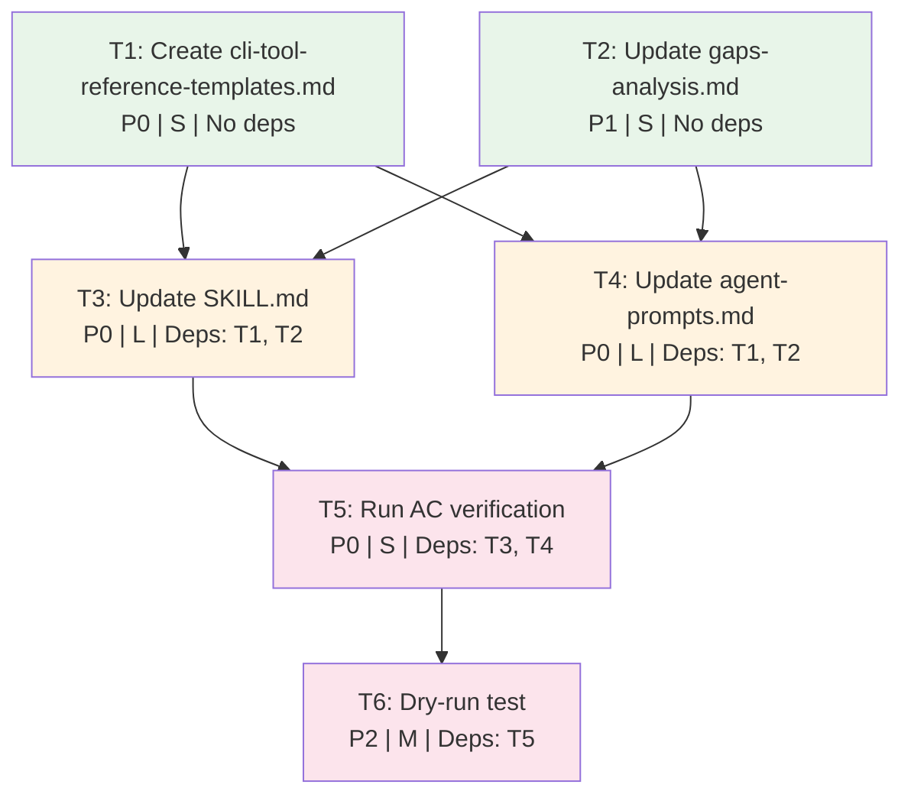

# Task Plan: Enhance skill-research-process for Complete CLI Tool Skill Production

## Metadata

- **Feature slug**: enhance-skill-research-process
- **Issue**: #197
- **Architecture spec**: [plan/architect-enhance-skill-research-process.md](./architect-enhance-skill-research-process.md)
- **Discovery doc**: [plan/feature-context-enhance-skill-research-process.md](./feature-context-enhance-skill-research-process.md)
- **Total tasks**: 6
- **Estimated change**: ~230 lines across 4 files (3 modified, 1 new)

## Parallelization Map

```text
Group 1 (Foundation — no dependencies):
  T1 ──┐
       ├── can run concurrently
  T2 ──┘

    ↓ Sync Checkpoint 1: verify reference files exist and are well-formed

Group 2 (Core Changes — depends on Group 1):
  T3 ──┐
       ├── can run concurrently (T3 and T4 modify different files)
  T4 ──┘

    ↓ Sync Checkpoint 2: verify SKILL.md and agent-prompts.md pass linting

Group 3 (Validation — depends on Group 2):
  T5 ──→ T6  (sequential: T6 depends on T5 passing)

    ↓ Sync Checkpoint 3: verify all 15 automated checks from architecture spec pass
```

---

## Sync Checkpoints

### Checkpoint 1: After Group 1

Verify reference files exist and are well-formed before proceeding to Group 2.

```bash
# cli-tool-reference-templates.md exists and has content
test -f .claude/skills/skill-research-process/references/cli-tool-reference-templates.md
wc -l .claude/skills/skill-research-process/references/cli-tool-reference-templates.md

# gaps-analysis.md has new Output Structure section
grep -q 'Output Structure' .claude/skills/skill-research-process/references/gaps-analysis.md

# Both files pass linting
uv run prek run --files .claude/skills/skill-research-process/references/cli-tool-reference-templates.md
uv run prek run --files .claude/skills/skill-research-process/references/gaps-analysis.md
```

### Checkpoint 2: After Group 2

Verify core files pass linting before proceeding to validation.

```bash
uv run prek run --files .claude/skills/skill-research-process/SKILL.md
uv run prek run --files .claude/skills/skill-research-process/references/agent-prompts.md
```

### Checkpoint 3: After Group 3

All 15 acceptance criteria from the architecture spec pass. See T5 verification steps.

---

## T1: Create cli-tool-reference-templates.md Reference File

- **Status**: [ ]
- **Dependencies**: None
- **Priority**: P0
- **Complexity**: S
- **Agent**: general-purpose

**Context**: The architecture spec defines a new reference file that catalogs standard reference file types for CLI tool skills (cli_reference.md, configuration.md, migration-guide.md, quick-reference.md, troubleshooting.md). This file is consulted by the categorization agent to enforce a minimum reference set. No equivalent file exists today, so every research run produces ad-hoc file names.

**Objective**: Create a reference file defining standard reference types, their file names, when they are required, and the minimum required sets for CLI tools vs. libraries.

**Inputs**:

- [Architecture spec Section 1.3](./architect-enhance-skill-research-process.md) — content specification for the file
- `plugins/python3-development/skills/uv/references/` — benchmark reference file names (5 flat .md files)
- `.claude/skills/skill-research-process/SKILL.md` — current skill (to understand where this file will be referenced)

**Requirements**:

1. File location: `.claude/skills/skill-research-process/references/cli-tool-reference-templates.md`
2. Must define the 5 standard reference types from the architecture spec table (Section 1.3)
3. Must specify minimum required set for CLI tools: `cli_reference.md`, `configuration.md`, `troubleshooting.md`
4. Must specify minimum required set for libraries: `quick-reference.md`, `troubleshooting.md`
5. Must note that categorization agent may propose additional tool-specific references
6. All code fences must have language specifiers
7. File references must use `[text](./path)` markdown link syntax

**Constraints**:

- Do NOT invent reference types beyond the 5 specified in the architecture spec
- Do NOT include example content for each reference type — only define structure and purpose
- Do NOT modify any other files in this task

**Expected Outputs**:

- `.claude/skills/skill-research-process/references/cli-tool-reference-templates.md` (new file, ~60 lines)

**Acceptance Criteria**:

1. [ ] File exists at `.claude/skills/skill-research-process/references/cli-tool-reference-templates.md`
2. [ ] Contains all 5 reference types: cli_reference, configuration, migration-guide, quick-reference, troubleshooting
3. [ ] Specifies minimum required set for CLI tools (3 files) and libraries (2 files)
4. [ ] All code fences have language specifiers
5. [ ] File passes linting: `uv run prek run --files` exits clean

**Verification Steps**:

1. `test -f .claude/skills/skill-research-process/references/cli-tool-reference-templates.md && echo PASS || echo FAIL`
2. `grep -c 'cli_reference\|configuration\|migration-guide\|quick-reference\|troubleshooting' .claude/skills/skill-research-process/references/cli-tool-reference-templates.md` — should return >=5
3. `grep -c 'Minimum\|Required' .claude/skills/skill-research-process/references/cli-tool-reference-templates.md` — should return >=2
4. `uv run prek run --files .claude/skills/skill-research-process/references/cli-tool-reference-templates.md`

---

## T2: Update gaps-analysis.md to Consolidate Findings

- **Status**: [ ]
- **Dependencies**: None
- **Priority**: P1
- **Complexity**: S
- **Agent**: general-purpose

**Context**: The existing `gaps-analysis.md` tracks 9 process quality gaps (verification, citations, hallucination checks). The feature context document identified 8 additional gaps related to output structure (local path input, flat layout, assets, sync scripts, agent prompt hardcoding). These must be consolidated into a single canonical gap tracker with two sections.

**Objective**: Add an "Output Structure Gaps" section to `gaps-analysis.md` with gaps #10-#17 (continuing the existing numbering), and add P1 entries to the Recommended Improvements table.

**Inputs**:

- `.claude/skills/skill-research-process/references/gaps-analysis.md` — current file with 9 gaps
- [Feature context Gap Analysis table](./feature-context-enhance-skill-research-process.md) — 8 output-structure gaps (#1-#8 in that document)
- [Architecture spec Section 1.4](./architect-enhance-skill-research-process.md) — merge strategy (Option A)

**Requirements**:

1. Rename existing "Identified Gaps" section to "Process Quality Gaps" (or add a subsection heading)
2. Add new "Output Structure Gaps" section after the existing gaps
3. Number new gaps starting at #10 (existing gaps are #1-#9)
4. Map feature context gaps #1-#8 to new numbers #10-#17
5. Add P1 entries to the Recommended Improvements Priority table for the 5 primary output-structure gaps
6. Preserve all existing content — this is an additive change

**Constraints**:

- Do NOT renumber existing gaps #1-#9
- Do NOT modify the existing gap descriptions
- Do NOT remove or rewrite the existing Recommended Improvements table — only append rows
- Do NOT modify any other files in this task

**Expected Outputs**:

- `.claude/skills/skill-research-process/references/gaps-analysis.md` (modified, ~30 lines added)

**Acceptance Criteria**:

1. [ ] File contains "Output Structure Gaps" or "Output Structure" section heading
2. [ ] Gaps numbered #10 through #17 are present
3. [ ] Original 9 gaps (#1-#9) are unchanged
4. [ ] Recommended Improvements table has entries for local path input, flat layout, assets, sync scripts
5. [ ] File passes linting: `uv run prek run --files` exits clean

**Verification Steps**:

1. `grep -q 'Output Structure' .claude/skills/skill-research-process/references/gaps-analysis.md && echo PASS || echo FAIL`
2. `grep -c '### 1[0-7]' .claude/skills/skill-research-process/references/gaps-analysis.md` — should return 8
3. `grep -c 'Missing Verification\|Weak Citation\|No Freshness' .claude/skills/skill-research-process/references/gaps-analysis.md` — should return >=3 (originals preserved)
4. `uv run prek run --files .claude/skills/skill-research-process/references/gaps-analysis.md`

---

## T3: Update SKILL.md — Input Detection, Flat Layout, Assets, Sync Delegation

- **Status**: [ ]
- **Dependencies**: T1, T2
- **Priority**: P0
- **Complexity**: L
- **Agent**: general-purpose

**Context**: The SKILL.md orchestration workflow needs four categories of changes: (1) argument-hint update and input detection step in Stage 1, (2) flat `references/{slug}.md` layout replacing subdirectory layout in Stage 2, (3) assets/ production substep added to Stage 3, and (4) new Stage 4 for sync script delegation to `/add-doc-updater`. The architecture spec Section 1.1 lists 10 section-level modifications.

**Objective**: Modify SKILL.md to implement all changes specified in architecture spec Section 1.1, including the updated process overview diagram with 4 stages.

**Inputs**:

- `.claude/skills/skill-research-process/SKILL.md` — current skill file
- [Architecture spec Section 1.1](./architect-enhance-skill-research-process.md) — SKILL.md modification table (10 sections)
- [Architecture spec Section 2](./architect-enhance-skill-research-process.md) — input detection design (detection criteria, LOCAL_PATH mode, TOOL_NAME mode)
- [Architecture spec Section 3](./architect-enhance-skill-research-process.md) — output structure specification (flat layout, assets convention)
- `.claude/skills/skill-research-process/references/cli-tool-reference-templates.md` — T1 output (must exist before this task runs)

**Requirements**:

1. **Frontmatter**: Change `argument-hint` from `<tool-or-library-name>` to `<tool-name-or-local-docs-path>`
2. **Process Overview diagram**: Update to show 4 stages + input detection branch
3. **Stage 1**: Add input detection step using `test -d "$ARGUMENTS"` before categorization; add minimum reference set check to Gate 1
4. **Stage 2**: Replace all `./references/{category}/` with `./references/{slug}.md`; add local-path variant note
5. **Stage 3**: Replace `references/{category}/index.md` links with `references/{slug}.md`; add assets/ production substep
6. **Stage 4 (NEW)**: Add sync script delegation step invoking `/add-doc-updater`
7. **Quality Gate 1**: Add minimum reference set verification for CLI tools
8. **Quality Gate 3**: Replace `index.md` checks with flat file checks; add assets/ existence check
9. **Success Checklist**: Replace `index.md` references with flat layout; add assets/ and sync script items
10. **References section**: Add link to `cli-tool-reference-templates.md`
11. All references use `[text](./path)` markdown link syntax with `./` prefix

**Constraints**:

- Do NOT rewrite sections that are not listed in the architecture spec modification table
- Do NOT change the frontmatter fields other than `argument-hint`
- Do NOT remove the Agent Team Alternative section — it is orthogonal to these changes
- Do NOT remove or modify the Error Recovery section
- Do NOT remove or modify the MCP Tool Selection table
- Preserve the Key Principles table (may need minor wording updates if it references index.md)

**Expected Outputs**:

- `.claude/skills/skill-research-process/SKILL.md` (modified, ~60 lines changed across 10 sections)

**Acceptance Criteria**:

1. [ ] `argument-hint` contains "path" (AC-1 from architecture spec)
2. [ ] No references to `index.md` remain (AC-2)
3. [ ] No references to `references/{category}/` subdirectory pattern remain (AC-4)
4. [ ] `test -d` input detection logic is present (AC-12)
5. [ ] Stage 4 heading and `/add-doc-updater` reference are present (AC-9, AC-10)
6. [ ] Link to `cli-tool-reference-templates.md` is present (AC-8)
7. [ ] File passes linting: `uv run prek run --files` exits clean

**Verification Steps**:

1. `grep -q 'argument-hint:.*path' .claude/skills/skill-research-process/SKILL.md && echo PASS || echo FAIL`
2. `grep -c 'index\.md' .claude/skills/skill-research-process/SKILL.md` — should return 0
3. `grep -q 'test -d' .claude/skills/skill-research-process/SKILL.md && echo PASS || echo FAIL`
4. `grep -q 'Stage 4' .claude/skills/skill-research-process/SKILL.md && echo PASS || echo FAIL`
5. `grep -q 'add-doc-updater' .claude/skills/skill-research-process/SKILL.md && echo PASS || echo FAIL`
6. `grep -q 'cli-tool-reference-templates' .claude/skills/skill-research-process/SKILL.md && echo PASS || echo FAIL`
7. `uv run prek run --files .claude/skills/skill-research-process/SKILL.md`

---

## T4: Update agent-prompts.md — Categorization, Research, Integration, Sync Agents

- **Status**: [ ]
- **Dependencies**: T1, T2
- **Priority**: P0
- **Complexity**: L
- **Agent**: general-purpose

**Context**: The agent prompt templates in `agent-prompts.md` hardcode the subdirectory layout (`references/{category}/` + `index.md`) and have no support for local path input. All three existing prompts need updates, and a new Stage 4 sync script delegation section needs to be added. The architecture spec Section 4 details exact changes per agent prompt.

**Objective**: Modify all three existing agent prompt templates and add a new Stage 4 delegation section, implementing all changes from architecture spec Section 4.

**Inputs**:

- `.claude/skills/skill-research-process/references/agent-prompts.md` — current agent prompts
- [Architecture spec Section 4.1](./architect-enhance-skill-research-process.md) — categorization agent changes (input detection preamble, minimum reference set, output format)
- [Architecture spec Section 4.2](./architect-enhance-skill-research-process.md) — research agent changes (flat output, local-path variant, success criteria)
- [Architecture spec Section 4.3](./architect-enhance-skill-research-process.md) — integration agent changes (flat links, assets/ substep, validator command)
- [Architecture spec Section 4.4](./architect-enhance-skill-research-process.md) — sync script delegation section (Stage 4 orchestrator instructions)
- `.claude/skills/skill-research-process/references/cli-tool-reference-templates.md` — T1 output (referenced from categorization agent)

**Requirements**:

1. **Categorization Agent**:
   - Add input detection preamble with `## Input Type: {LOCAL_PATH | TOOL_NAME}` branching
   - LOCAL_PATH variant: use Glob to enumerate `{path}/**/*.md`, Read to sample headers
   - Add minimum reference set output requirement referencing `cli-tool-reference-templates.md`
   - Change output format to include target filename slug: `Category: {Name} → references/{slug}.md`
2. **Research Agent**:
   - Replace `references/{category}/` + `index.md` output with flat `references/{slug}.md`
   - Remove all `index.md` references
   - Add local-path variant: Read assigned local files, citation format `SOURCE: Local file {path} (read YYYY-MM-DD)`
   - Update success criteria to reference flat file with internal table of contents
3. **Integration Agent**:
   - Replace `references/{category}/index.md` reads with `references/*.md` reads
   - Replace link format from `./references/{category}/index.md` to `./references/{slug}.md`
   - Add assets/ production substep (review content for templates, create `assets/{category}/` subdirectories)
   - Replace vague validation with explicit validator command: `uv run plugins/plugin-creator/scripts/plugin_validator.py ./{skill-name}/`
4. **Sync Script Delegation (NEW)**:
   - Add Stage 4 section with orchestrator-level instructions for invoking `/add-doc-updater`
   - Include decision logic: does the tool have a release API or updatable docs?
   - Reference the `/add-doc-updater` skill's 5-phase pipeline
   - Include post-completion verification (scripts/ directory exists, SKILL.md updated)

**Constraints**:

- Do NOT remove the Agent Launch Pattern section — it is still valid
- Do NOT change the Agent tool invocation syntax examples
- Do NOT rewrite the Identity sections of existing prompts unless they reference subdirectory layout
- Keep each prompt template inside a code fence (existing convention)
- The sync script delegation section is NOT a subagent prompt — it is orchestrator instructions

**Expected Outputs**:

- `.claude/skills/skill-research-process/references/agent-prompts.md` (modified, ~80 lines changed + new section)

**Acceptance Criteria**:

1. [ ] No references to `index.md` remain (AC-3 from architecture spec)
2. [ ] No references to `references/{category}/` subdirectory pattern remain (AC-5)
3. [ ] Flat layout `references/{slug}.md` pattern present (AC-6)
4. [ ] `assets/` production mentioned in integration agent prompt (AC-11)
5. [ ] `/add-doc-updater` reference present (AC-10)
6. [ ] Local path variant instructions present in categorization and research prompts
7. [ ] File passes linting: `uv run prek run --files` exits clean

**Verification Steps**:

1. `grep -c 'index\.md' .claude/skills/skill-research-process/references/agent-prompts.md` — should return 0
2. `grep -q 'references/{slug}\.md' .claude/skills/skill-research-process/references/agent-prompts.md && echo PASS || echo FAIL`
3. `grep -q 'assets/' .claude/skills/skill-research-process/references/agent-prompts.md && echo PASS || echo FAIL`
4. `grep -q 'add-doc-updater' .claude/skills/skill-research-process/references/agent-prompts.md && echo PASS || echo FAIL`
5. `grep -q 'LOCAL_PATH\|local.*path\|local.*docs' .claude/skills/skill-research-process/references/agent-prompts.md && echo PASS || echo FAIL`
6. `grep -q 'cli-tool-reference-templates' .claude/skills/skill-research-process/references/agent-prompts.md && echo PASS || echo FAIL`
7. `uv run prek run --files .claude/skills/skill-research-process/references/agent-prompts.md`

---

## T5: Run Acceptance Criteria Verification Commands

- **Status**: [ ]
- **Dependencies**: T3, T4
- **Priority**: P0
- **Complexity**: S
- **Agent**: general-purpose

**Context**: The architecture spec defines 15 acceptance criteria (AC-1 through AC-15) with concrete verification commands. This task executes all 15 checks and reports pass/fail for each. Any failures must be documented for remediation before T6.

**Objective**: Execute all 15 AC verification commands from architecture spec Section 6, report results, and fix any failures.

**Inputs**:

- `.claude/skills/skill-research-process/SKILL.md` — T3 output
- `.claude/skills/skill-research-process/references/agent-prompts.md` — T4 output
- `.claude/skills/skill-research-process/references/cli-tool-reference-templates.md` — T1 output
- `.claude/skills/skill-research-process/references/gaps-analysis.md` — T2 output
- [Architecture spec Section 6](./architect-enhance-skill-research-process.md) — 15 acceptance criteria with commands

**Requirements**:

1. Execute each of the 15 AC checks from the architecture spec
2. Report pass/fail for each check with the command output
3. If any check fails, fix the underlying issue in the relevant file and re-run
4. All 15 checks must pass before marking this task complete

**Constraints**:

- Do NOT skip any check — all 15 must be executed
- Do NOT mark this task complete if any check fails
- If a fix is needed, apply it to the correct file (T1/T2/T3/T4 outputs) and re-run the specific check
- Do NOT modify files beyond what is needed to pass failing checks

**Expected Outputs**:

- All 15 AC checks passing
- Any remediation commits if fixes were needed

**Acceptance Criteria**:

1. [ ] AC-1 through AC-13 (structural checks) all pass
2. [ ] AC-14 (linting) passes for all 4 modified files
3. [ ] AC-15 (plugin validator) passes for the skill directory

**Verification Steps**:

```bash
# AC-1: SKILL.md argument-hint updated
grep -q 'argument-hint:.*path' .claude/skills/skill-research-process/SKILL.md && echo "AC-1: PASS" || echo "AC-1: FAIL"

# AC-2: No index.md in SKILL.md
! grep -q 'index\.md' .claude/skills/skill-research-process/SKILL.md && echo "AC-2: PASS" || echo "AC-2: FAIL"

# AC-3: No index.md in agent-prompts.md
! grep -q 'index\.md' .claude/skills/skill-research-process/references/agent-prompts.md && echo "AC-3: PASS" || echo "AC-3: FAIL"

# AC-4: No references/{category}/ in SKILL.md
! grep -q 'references/{category}/' .claude/skills/skill-research-process/SKILL.md && echo "AC-4: PASS" || echo "AC-4: FAIL"

# AC-5: No references/{category}/ in agent-prompts.md
! grep -q 'references/{category}/' .claude/skills/skill-research-process/references/agent-prompts.md && echo "AC-5: PASS" || echo "AC-5: FAIL"

# AC-6: Flat layout present in agent-prompts.md
grep -q 'references/{slug}\.md' .claude/skills/skill-research-process/references/agent-prompts.md && echo "AC-6: PASS" || echo "AC-6: FAIL"

# AC-7: cli-tool-reference-templates.md exists
test -f .claude/skills/skill-research-process/references/cli-tool-reference-templates.md && echo "AC-7: PASS" || echo "AC-7: FAIL"

# AC-8: cli-tool-reference-templates.md referenced from SKILL.md
grep -q 'cli-tool-reference-templates\.md' .claude/skills/skill-research-process/SKILL.md && echo "AC-8: PASS" || echo "AC-8: FAIL"

# AC-9: Stage 4 present in SKILL.md
grep -q 'Stage 4' .claude/skills/skill-research-process/SKILL.md && echo "AC-9: PASS" || echo "AC-9: FAIL"

# AC-10: /add-doc-updater reference present
grep -rq 'add-doc-updater' .claude/skills/skill-research-process/ && echo "AC-10: PASS" || echo "AC-10: FAIL"

# AC-11: assets/ in integration agent prompt
grep -q 'assets/' .claude/skills/skill-research-process/references/agent-prompts.md && echo "AC-11: PASS" || echo "AC-11: FAIL"

# AC-12: Local path detection in SKILL.md
grep -q 'test -d' .claude/skills/skill-research-process/SKILL.md && echo "AC-12: PASS" || echo "AC-12: FAIL"

# AC-13: Output Structure section in gaps-analysis.md
grep -q 'Output Structure' .claude/skills/skill-research-process/references/gaps-analysis.md && echo "AC-13: PASS" || echo "AC-13: FAIL"

# AC-14: Linting passes
uv run prek run --files .claude/skills/skill-research-process/SKILL.md
uv run prek run --files .claude/skills/skill-research-process/references/agent-prompts.md
uv run prek run --files .claude/skills/skill-research-process/references/cli-tool-reference-templates.md
uv run prek run --files .claude/skills/skill-research-process/references/gaps-analysis.md

# AC-15: Validator passes
uv run plugins/plugin-creator/scripts/plugin_validator.py .claude/skills/skill-research-process/
```

---

## T6: Dry-Run Test — Simulate /skill-research-process with Local Path Input

- **Status**: [ ]
- **Dependencies**: T5
- **Priority**: P2
- **Complexity**: M
- **Agent**: general-purpose

**Context**: All structural and linting checks have passed (T5). This task performs a behavioral verification by simulating the updated skill flow with a local docs directory to confirm the input detection branch works, the categorization agent receives correct instructions, and the output path references are flat.

**Objective**: Create a temporary test directory with sample markdown docs, then walk through the updated SKILL.md and agent-prompts.md flow to verify behavioral correctness for LOCAL_PATH mode. This is a read-through simulation, not a full skill invocation.

**Inputs**:

- `.claude/skills/skill-research-process/SKILL.md` — updated skill (T3 output, verified by T5)
- `.claude/skills/skill-research-process/references/agent-prompts.md` — updated prompts (T4 output, verified by T5)
- `.claude/skills/skill-research-process/references/cli-tool-reference-templates.md` — reference templates (T1 output)

**Requirements**:

1. Create a temporary test directory with 3-5 sample `.md` files simulating a local docs source
2. Verify `test -d` detection: run the detection command from SKILL.md against the test directory — confirm it returns LOCAL_PATH mode
3. Read the categorization agent prompt and verify it includes LOCAL_PATH branching instructions with Glob/Read tools
4. Read the research agent prompt and verify flat output path `references/{slug}.md` is specified
5. Read the integration agent prompt and verify `assets/` production substep is present
6. Verify Stage 4 sync delegation section references `/add-doc-updater`
7. Clean up temporary test directory

**Constraints**:

- Do NOT actually invoke `/skill-research-process` — this is a simulation/walk-through
- Do NOT modify any skill files during this task
- Test directory must be created in `/tmp/` to avoid polluting the repository
- If any behavioral check fails, document the failure and re-open the relevant T3/T4 task for remediation

**Expected Outputs**:

- Pass/fail report for each behavioral check
- Temporary test directory cleaned up

**Acceptance Criteria**:

1. [ ] `test -d /tmp/test-local-docs/` succeeds (test directory created)
2. [ ] Input detection command from SKILL.md correctly identifies the test directory as LOCAL_PATH mode
3. [ ] Categorization agent prompt contains LOCAL_PATH-specific Glob/Read instructions
4. [ ] Research agent prompt specifies flat `references/{slug}.md` output (no subdirectories)
5. [ ] Integration agent prompt includes assets/ production substep
6. [ ] Stage 4 section references `/add-doc-updater` skill invocation
7. [ ] Temporary test directory cleaned up after verification

**Verification Steps**:

1. `mkdir -p /tmp/test-local-docs && echo "# Test Doc" > /tmp/test-local-docs/getting-started.md && test -d /tmp/test-local-docs && echo "PASS: test dir created" || echo "FAIL"`
2. `test -d "/tmp/test-local-docs" && echo "LOCAL_PATH mode detected — PASS" || echo "TOOL_NAME mode — FAIL"`
3. `grep -A5 'LOCAL_PATH\|local.*path' .claude/skills/skill-research-process/references/agent-prompts.md | grep -q 'Glob\|Read' && echo "PASS: local tools referenced" || echo "FAIL"`
4. `grep -q 'references/{slug}\.md' .claude/skills/skill-research-process/references/agent-prompts.md && echo "PASS: flat output" || echo "FAIL"`
5. `grep -A10 'assets/' .claude/skills/skill-research-process/references/agent-prompts.md | grep -q 'template\|config\|example' && echo "PASS: assets substep" || echo "FAIL"`
6. `grep -q 'add-doc-updater' .claude/skills/skill-research-process/SKILL.md && echo "PASS: sync delegation" || echo "FAIL"`
7. `rm -rf /tmp/test-local-docs && echo "PASS: cleaned up" || echo "FAIL"`

---

## Critical Constraints

- All file edits target `.claude/skills/skill-research-process/` — do NOT modify files outside this directory
- T3 and T4 modify different files (`SKILL.md` vs `references/agent-prompts.md`) and can run concurrently, but both depend on T1 completing first (for the `cli-tool-reference-templates.md` reference link)
- The architecture spec is the authoritative source for WHAT to change — implementation agents decide HOW to write the prose
- Do NOT introduce new frontmatter fields beyond `argument-hint` change
- Do NOT modify `references/mcp-tools.md` — it is unchanged in this feature
- All verification commands use `grep` patterns from architecture spec Section 6 — do not substitute different patterns
- Conventional commit scope for this feature: `feat(skill-research-process): ...`

---

## Dependency Graph



---

## References

- [Architecture Spec](./architect-enhance-skill-research-process.md) — authoritative change specification
- [Feature Context](./feature-context-enhance-skill-research-process.md) — discovery document with gap analysis
- [Current SKILL.md](./../.claude/skills/skill-research-process/SKILL.md) — target skill
- [Current Agent Prompts](./../.claude/skills/skill-research-process/references/agent-prompts.md) — target prompts
- [Current Gaps Analysis](./../.claude/skills/skill-research-process/references/gaps-analysis.md) — gap tracker
- [uv Skill (Benchmark)](./../plugins/python3-development/skills/uv/) — production-quality reference
